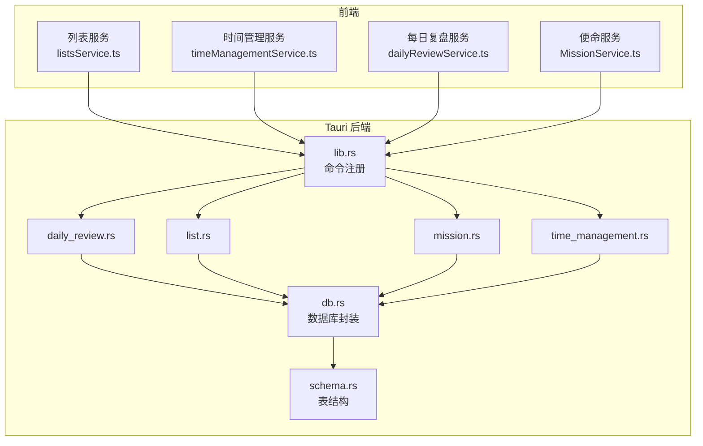
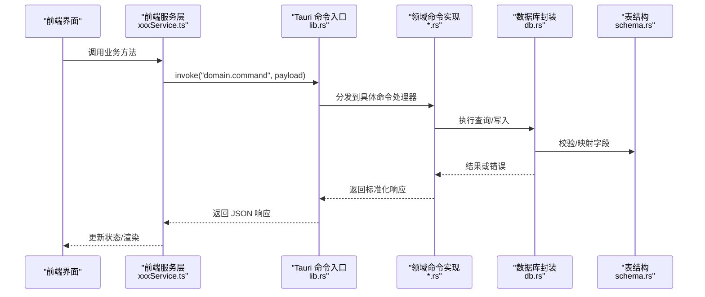
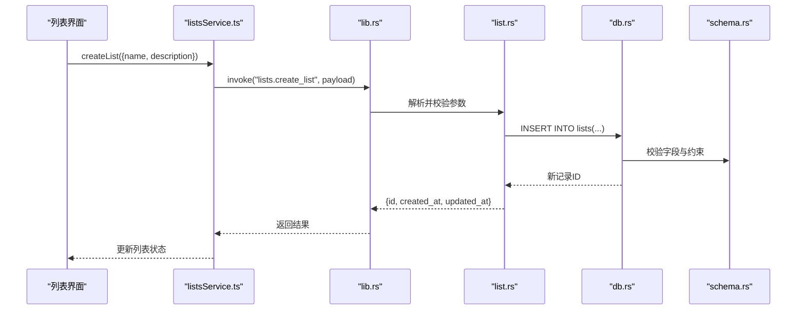
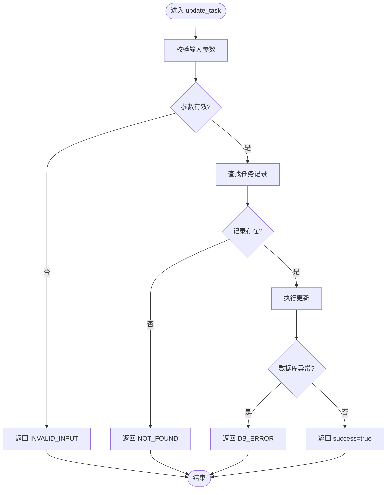
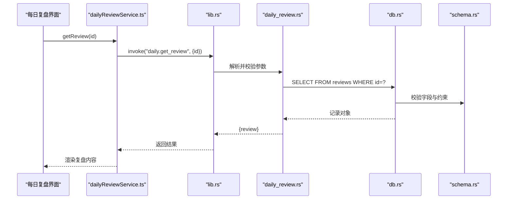
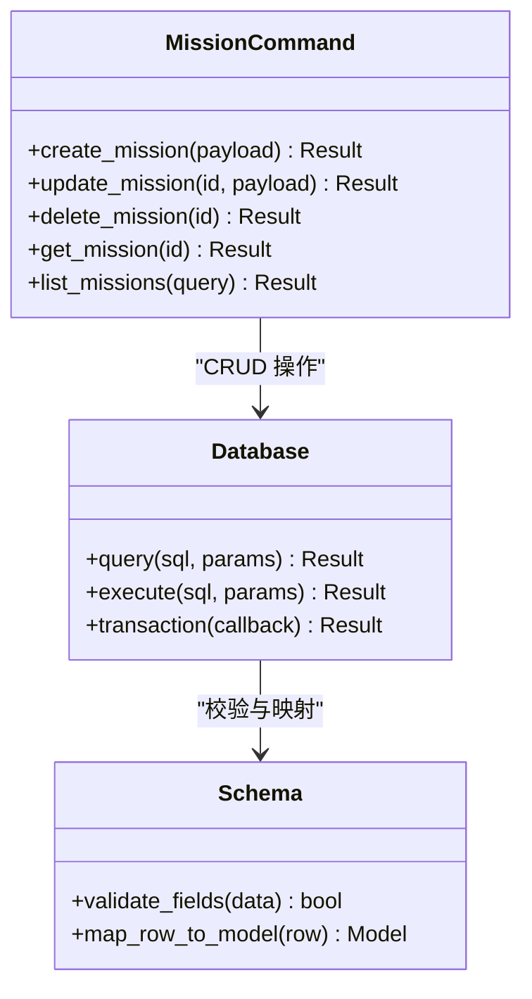
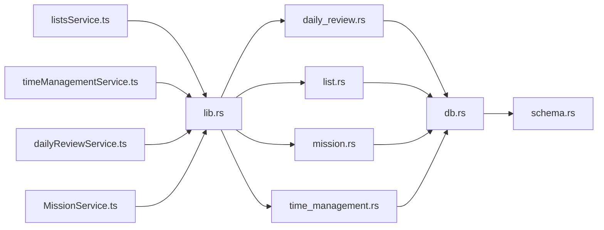

# API 参考文档

<cite>
**本文引用的文件**
- [src-tauri/src/lib.rs](file://src-tauri/src/lib.rs)
- [src-tauri/src/main.rs](file://src-tauri/src/main.rs)
- [src-tauri/src/daily_review.rs](file://src-tauri/src/daily_review.rs)
- [src-tauri/src/list.rs](file://src-tauri/src/list.rs)
- [src-tauri/src/mission.rs](file://src-tauri/src/mission.rs)
- [src-tauri/src/time_management.rs](file://src-tauri/src/time_management.rs)
- [src-tauri/src/db.rs](file://src-tauri/src/db.rs)
- [src-tauri/src/schema.rs](file://src-tauri/src/schema.rs)
- [src/features/lists/listsService.ts](file://src/features/lists/listsService.ts)
- [src/features/lists/listsTypes.ts](file://src/features/lists/listsTypes.ts)
- [src/features/time-management/timeManagementService.ts](file://src/features/time-management/timeManagementService.ts)
- [src/features/time-management/timeManagementTypes.ts](file://src/features/time-management/timeManagementTypes.ts)
- [src/features/daily-review/dailyReviewService.ts](file://src/features/daily-review/dailyReviewService.ts)
- [src/features/daily-review/dailyReviewTypes.ts](file://src/features/daily-review/dailyReviewTypes.ts)
- [src/features/mission/MissionService.ts](file://src/features/mission/MissionService.ts)
- [src/features/mission/MissionTypes.ts](file://src/features/mission/MissionTypes.ts)
- [src-tauri/tauri.conf.json](file://src-tauri/tauri.conf.json)
- [src-tauri/capabilities/default.json](file://src-tauri/capabilities/default.json)
</cite>

## 目录
1. [简介](#简介)
2. [项目结构](#项目结构)
3. [核心组件](#核心组件)
4. [架构总览](#架构总览)
5. [详细组件分析](#详细组件分析)
6. [依赖关系分析](#依赖关系分析)
7. [性能考虑](#性能考虑)
8. [故障排查指南](#故障排查指南)
9. [结论](#结论)
10. [附录](#附录)

## 简介
本文件为 FishWorker 应用的 Tauri 后端与前端服务层之间的 API 参考文档。内容覆盖：
- 所有 Tauri 命令接口（函数签名、参数类型、返回值、错误码）
- 前后端通信协议与数据格式规范
- IPC 消息传递机制与事件处理模式
- 数据类型定义与枚举值说明
- 认证方法与权限控制机制
- 客户端调用示例与错误处理最佳实践
- API 版本兼容性与迁移指南

FishWorker 采用 Tauri 作为桌面应用框架，Rust 实现后端能力，TypeScript/React 实现前端界面。前后端通过 Tauri 的 invoke 命令进行同步 RPC 调用，并通过事件通道进行异步通知。

## 项目结构
- 后端（Rust/Tauri）
  - src-tauri/src/lib.rs：Tauri 插件注册与命令导出入口
  - src-tauri/src/main.rs：应用启动与窗口初始化
  - src-tauri/src/*.rs：按功能域划分的命令实现（每日复盘、清单、任务、使命等）
  - src-tauri/src/db.rs：数据库连接与通用操作封装
  - src-tauri/src/schema.rs：数据库表结构与约束定义
  - src-tauri/tauri.conf.json：Tauri 配置（安全策略、能力集、白名单等）
  - src-tauri/capabilities/default.json：默认能力声明
- 前端（TypeScript/React）
  - features/*：按业务域组织的服务层与状态管理
  - features/*/listsService.ts、timeManagementService.ts、dailyReviewService.ts、MissionService.ts：封装 Tauri 命令调用
  - features/*/listsTypes.ts、timeManagementTypes.ts、dailyReviewTypes.ts、MissionTypes.ts：前后端共享的数据类型定义

图表来源
- [src-tauri/src/lib.rs](file://src-tauri/src/lib.rs)
- [src-tauri/src/daily_review.rs](file://src-tauri/src/daily_review.rs)
- [src-tauri/src/list.rs](file://src-tauri/src/list.rs)
- [src-tauri/src/mission.rs](file://src-tauri/src/mission.rs)
- [src-tauri/src/time_management.rs](file://src-tauri/src/time_management.rs)
- [src-tauri/src/db.rs](file://src-tauri/src/db.rs)
- [src-tauri/src/schema.rs](file://src-tauri/src/schema.rs)
- [src/features/lists/listsService.ts](file://src/features/lists/listsService.ts)
- [src/features/time-management/timeManagementService.ts](file://src/features/time-management/timeManagementService.ts)
- [src/features/daily-review/dailyReviewService.ts](file://src/features/daily-review/dailyReviewService.ts)
- [src/features/mission/MissionService.ts](file://src/features/mission/MissionService.ts)

章节来源
- [src-tauri/src/lib.rs](file://src-tauri/src/lib.rs)
- [src-tauri/src/main.rs](file://src-tauri/src/main.rs)
- [src-tauri/tauri.conf.json](file://src-tauri/tauri.conf.json)
- [src-tauri/capabilities/default.json](file://src-tauri/capabilities/default.json)

## 核心组件
- Tauri 命令注册中心（lib.rs）
  - 负责将 Rust 模块中的命令暴露给前端，统一命名空间与路由
- 领域命令实现
  - 每日复盘（daily_review.rs）
  - 清单（list.rs）
  - 使命（mission.rs）
  - 时间管理（time_management.rs）
- 数据访问层（db.rs + schema.rs）
  - 提供统一的数据库连接、事务、查询与变更操作
  - 维护表结构与约束，确保数据一致性
- 前端服务层（features/*/xxxService.ts）
  - 封装 Tauri invoke 调用，统一请求/响应模型与错误处理
  - 提供类型安全的 TypeScript 接口

章节来源
- [src-tauri/src/lib.rs](file://src-tauri/src/lib.rs)
- [src-tauri/src/daily_review.rs](file://src-tauri/src/daily_review.rs)
- [src-tauri/src/list.rs](file://src-tauri/src/list.rs)
- [src-tauri/src/mission.rs](file://src-tauri/src/mission.rs)
- [src-tauri/src/time_management.rs](file://src-tauri/src/time_management.rs)
- [src-tauri/src/db.rs](file://src-tauri/src/db.rs)
- [src-tauri/src/schema.rs](file://src-tauri/src/schema.rs)
- [src/features/lists/listsService.ts](file://src/features/lists/listsService.ts)
- [src/features/time-management/timeManagementService.ts](file://src/features/time-management/timeManagementService.ts)
- [src/features/daily-review/dailyReviewService.ts](file://src/features/daily-review/dailyReviewService.ts)
- [src/features/mission/MissionService.ts](file://src/features/mission/MissionService.ts)

## 架构总览
前后端通过 Tauri 的 invoke 命令进行同步调用；在需要异步反馈的场景使用事件通道。命令按领域划分，数据访问集中在 db.rs，表结构由 schema.rs 管理。

图表来源
- [src-tauri/src/lib.rs](file://src-tauri/src/lib.rs)
- [src-tauri/src/daily_review.rs](file://src-tauri/src/daily_review.rs)
- [src-tauri/src/list.rs](file://src-tauri/src/list.rs)
- [src-tauri/src/mission.rs](file://src-tauri/src/mission.rs)
- [src-tauri/src/time_management.rs](file://src-tauri/src/time_management.rs)
- [src-tauri/src/db.rs](file://src-tauri/src/db.rs)
- [src-tauri/src/schema.rs](file://src-tauri/src/schema.rs)
- [src/features/lists/listsService.ts](file://src/features/lists/listsService.ts)
- [src/features/time-management/timeManagementService.ts](file://src/features/time-management/timeManagementService.ts)
- [src/features/daily-review/dailyReviewService.ts](file://src/features/daily-review/dailyReviewService.ts)
- [src/features/mission/MissionService.ts](file://src/features/mission/MissionService.ts)

## 详细组件分析

### 清单（Lists）API
- 命令命名空间
  - lists.*
- 主要命令
  - lists.create_list
    - 参数
      - name: string
      - description?: string
    - 返回
      - id: number
      - created_at: string
      - updated_at: string
    - 错误码
      - INVALID_INPUT: 输入校验失败
      - DB_ERROR: 数据库异常
  - lists.update_list
    - 参数
      - id: number
      - name?: string
      - description?: string
    - 返回
      - success: boolean
    - 错误码
      - NOT_FOUND: 记录不存在
      - INVALID_INPUT: 输入校验失败
      - DB_ERROR: 数据库异常
  - lists.delete_list
    - 参数
      - id: number
    - 返回
      - success: boolean
    - 错误码
      - NOT_FOUND: 记录不存在
      - DB_ERROR: 数据库异常
  - lists.get_list
    - 参数
      - id: number
    - 返回
      - list: object
    - 错误码
      - NOT_FOUND: 记录不存在
      - DB_ERROR: 数据库异常
  - lists.list_lists
    - 参数
      - page?: number
      - page_size?: number
      - sort_by?: string
      - order?: "asc" | "desc"
    - 返回
      - items: array
      - total: number
    - 错误码
      - DB_ERROR: 数据库异常
  - lists.reorder_items
    - 参数
      - list_id: number
      - item_ids: number[]
    - 返回
      - success: boolean
    - 错误码
      - NOT_FOUND: 记录不存在
      - INVALID_INPUT: 输入校验失败
      - DB_ERROR: 数据库异常

- 前端服务
  - 调用方式：通过 Tauri invoke 调用 lists.* 命令
  - 类型定义：参见 types 文件以获取字段与约束

图表来源
- [src-tauri/src/lib.rs](file://src-tauri/src/lib.rs)
- [src-tauri/src/list.rs](file://src-tauri/src/list.rs)
- [src-tauri/src/db.rs](file://src-tauri/src/db.rs)
- [src-tauri/src/schema.rs](file://src-tauri/src/schema.rs)
- [src/features/lists/listsService.ts](file://src/features/lists/listsService.ts)
- [src/features/lists/listsTypes.ts](file://src/features/lists/listsTypes.ts)

章节来源
- [src-tauri/src/list.rs](file://src-tauri/src/list.rs)
- [src-tauri/src/db.rs](file://src-tauri/src/db.rs)
- [src-tauri/src/schema.rs](file://src-tauri/src/schema.rs)
- [src/features/lists/listsService.ts](file://src/features/lists/listsService.ts)
- [src/features/lists/listsTypes.ts](file://src/features/lists/listsTypes.ts)

### 时间管理（Time Management）API
- 命令命名空间
  - time.*
- 主要命令
  - time.create_task
    - 参数
      - title: string
      - due_date?: string
      - priority?: "low" | "medium" | "high"
      - status?: "todo" | "doing" | "done"
    - 返回
      - id: number
      - created_at: string
      - updated_at: string
    - 错误码
      - INVALID_INPUT: 输入校验失败
      - DB_ERROR: 数据库异常
  - time.update_task
    - 参数
      - id: number
      - title?: string
      - due_date?: string
      - priority?: "low" | "medium" | "high"
      - status?: "todo" | "doing" | "done"
    - 返回
      - success: boolean
    - 错误码
      - NOT_FOUND: 记录不存在
      - INVALID_INPUT: 输入校验失败
      - DB_ERROR: 数据库异常
  - time.delete_task
    - 参数
      - id: number
    - 返回
      - success: boolean
    - 错误码
      - NOT_FOUND: 记录不存在
      - DB_ERROR: 数据库异常
  - time.get_task
    - 参数
      - id: number
    - 返回
      - task: object
    - 错误码
      - NOT_FOUND: 记录不存在
      - DB_ERROR: 数据库异常
  - time.list_tasks
    - 参数
      - page?: number
      - page_size?: number
      - filter_status?: "todo" | "doing" | "done"
      - sort_by?: string
      - order?: "asc" | "desc"
    - 返回
      - items: array
      - total: number
    - 错误码
      - DB_ERROR: 数据库异常

图表来源
- [src-tauri/src/time_management.rs](file://src-tauri/src/time_management.rs)
- [src-tauri/src/db.rs](file://src-tauri/src/db.rs)
- [src-tauri/src/schema.rs](file://src-tauri/src/schema.rs)
- [src/features/time-management/timeManagementService.ts](file://src/features/time-management/timeManagementService.ts)
- [src/features/time-management/timeManagementTypes.ts](file://src/features/time-management/timeManagementTypes.ts)

章节来源
- [src-tauri/src/time_management.rs](file://src-tauri/src/time_management.rs)
- [src-tauri/src/db.rs](file://src-tauri/src/db.rs)
- [src-tauri/src/schema.rs](file://src-tauri/src/schema.rs)
- [src/features/time-management/timeManagementService.ts](file://src/features/time-management/timeManagementService.ts)
- [src/features/time-management/timeManagementTypes.ts](file://src/features/time-management/timeManagementTypes.ts)

### 每日复盘（Daily Review）API
- 命令命名空间
  - daily.*
- 主要命令
  - daily.create_review
    - 参数
      - date: string
      - content?: string
    - 返回
      - id: number
      - created_at: string
      - updated_at: string
    - 错误码
      - INVALID_INPUT: 输入校验失败
      - DB_ERROR: 数据库异常
  - daily.update_review
    - 参数
      - id: number
      - content?: string
    - 返回
      - success: boolean
    - 错误码
      - NOT_FOUND: 记录不存在
      - INVALID_INPUT: 输入校验失败
      - DB_ERROR: 数据库异常
  - daily.delete_review
    - 参数
      - id: number
    - 返回
      - success: boolean
    - 错误码
      - NOT_FOUND: 记录不存在
      - DB_ERROR: 数据库异常
  - daily.get_review
    - 参数
      - id: number
    - 返回
      - review: object
    - 错误码
      - NOT_FOUND: 记录不存在
      - DB_ERROR: 数据库异常
  - daily.list_reviews
    - 参数
      - page?: number
      - page_size?: number
      - sort_by?: string
      - order?: "asc" | "desc"
    - 返回
      - items: array
      - total: number
    - 错误码
      - DB_ERROR: 数据库异常

图表来源
- [src-tauri/src/lib.rs](file://src-tauri/src/lib.rs)
- [src-tauri/src/daily_review.rs](file://src-tauri/src/daily_review.rs)
- [src-tauri/src/db.rs](file://src-tauri/src/db.rs)
- [src-tauri/src/schema.rs](file://src-tauri/src/schema.rs)
- [src/features/daily-review/dailyReviewService.ts](file://src/features/daily-review/dailyReviewService.ts)
- [src/features/daily-review/dailyReviewTypes.ts](file://src/features/daily-review/dailyReviewTypes.ts)

章节来源
- [src-tauri/src/daily_review.rs](file://src-tauri/src/daily_review.rs)
- [src-tauri/src/db.rs](file://src-tauri/src/db.rs)
- [src-tauri/src/schema.rs](file://src-tauri/src/schema.rs)
- [src/features/daily-review/dailyReviewService.ts](file://src/features/daily-review/dailyReviewService.ts)
- [src/features/daily-review/dailyReviewTypes.ts](file://src/features/daily-review/dailyReviewTypes.ts)

### 使命（Mission）API
- 命令命名空间
  - mission.*
- 主要命令
  - mission.create_mission
    - 参数
      - title: string
      - description?: string
      - status?: "active" | "completed" | "archived"
    - 返回
      - id: number
      - created_at: string
      - updated_at: string
    - 错误码
      - INVALID_INPUT: 输入校验失败
      - DB_ERROR: 数据库异常
  - mission.update_mission
    - 参数
      - id: number
      - title?: string
      - description?: string
      - status?: "active" | "completed" | "archived"
    - 返回
      - success: boolean
    - 错误码
      - NOT_FOUND: 记录不存在
      - INVALID_INPUT: 输入校验失败
      - DB_ERROR: 数据库异常
  - mission.delete_mission
    - 参数
      - id: number
    - 返回
      - success: boolean
    - 错误码
      - NOT_FOUND: 记录不存在
      - DB_ERROR: 数据库异常
  - mission.get_mission
    - 参数
      - id: number
    - 返回
      - mission: object
    - 错误码
      - NOT_FOUND: 记录不存在
      - DB_ERROR: 数据库异常
  - mission.list_missions
    - 参数
      - page?: number
      - page_size?: number
      - filter_status?: "active" | "completed" | "archived"
      - sort_by?: string
      - order?: "asc" | "desc"
    - 返回
      - items: array
      - total: number
    - 错误码
      - DB_ERROR: 数据库异常

图表来源
- [src-tauri/src/mission.rs](file://src-tauri/src/mission.rs)
- [src-tauri/src/db.rs](file://src-tauri/src/db.rs)
- [src-tauri/src/schema.rs](file://src-tauri/src/schema.rs)
- [src/features/mission/MissionService.ts](file://src/features/mission/MissionService.ts)
- [src/features/mission/MissionTypes.ts](file://src/features/mission/MissionTypes.ts)

章节来源
- [src-tauri/src/mission.rs](file://src-tauri/src/mission.rs)
- [src-tauri/src/db.rs](file://src-tauri/src/db.rs)
- [src-tauri/src/schema.rs](file://src-tauri/src/schema.rs)
- [src/features/mission/MissionService.ts](file://src/features/mission/MissionService.ts)
- [src/features/mission/MissionTypes.ts](file://src/features/mission/MissionTypes.ts)

### 认证与权限控制
- 认证方法
  - 当前未实现用户态认证；如需启用，可在 Tauri 命令入口处增加鉴权中间件，对请求上下文注入用户身份与角色信息
- 权限控制
  - 基于命令命名空间的细粒度授权：在 lib.rs 中根据调用者上下文（如窗口、进程、能力集）决定是否允许执行某命令
  - 能力集（capabilities）：通过 default.json 声明可访问的命令集合与资源范围
- 建议
  - 引入 JWT 或会话令牌，在 invoke 前验证签名与有效期
  - 对敏感命令（删除、批量更新）增加二次确认与审计日志

章节来源
- [src-tauri/src/lib.rs](file://src-tauri/src/lib.rs)
- [src-tauri/capabilities/default.json](file://src-tauri/capabilities/default.json)
- [src-tauri/tauri.conf.json](file://src-tauri/tauri.conf.json)

### 前后端通信协议与数据格式
- 通信协议
  - 同步：Tauri invoke 命令，JSON 序列化参数与响应
  - 异步：Tauri 事件通道，用于进度、通知与长耗时任务回调
- 数据格式
  - 请求体：扁平化 JSON，包含必要字段与可选字段
  - 响应体：统一包装 { ok: boolean, data?: any, error?: Error }
  - 分页：{ items: [], total: number }
  - 排序：sort_by 与 order（asc/desc）
- 错误码
  - INVALID_INPUT：输入校验失败
  - NOT_FOUND：记录不存在
  - DB_ERROR：数据库异常
  - UNAUTHORIZED：未认证
  - FORBIDDEN：无权限
  - TIMEOUT：超时
  - INTERNAL：内部错误

章节来源
- [src-tauri/src/lib.rs](file://src-tauri/src/lib.rs)
- [src-tauri/src/db.rs](file://src-tauri/src/db.rs)
- [src-tauri/src/schema.rs](file://src-tauri/src/schema.rs)
- [src/features/lists/listsService.ts](file://src/features/lists/listsService.ts)
- [src/features/time-management/timeManagementService.ts](file://src/features/time-management/timeManagementService.ts)
- [src/features/daily-review/dailyReviewService.ts](file://src/features/daily-review/dailyReviewService.ts)
- [src/features/mission/MissionService.ts](file://src/features/mission/MissionService.ts)

### 事件处理模式
- 事件命名
  - domain.event_name（例如：time.task_updated、lists.item_reordered）
- 订阅与发布
  - 前端通过 Tauri 事件监听器订阅特定事件
  - 后端在关键变更后主动推送事件，携带最小必要数据
- 重试与去抖
  - 前端对高频事件进行去抖处理
  - 对网络或 IPC 失败进行指数退避重试

章节来源
- [src-tauri/src/lib.rs](file://src-tauri/src/lib.rs)
- [src/features/lists/listsService.ts](file://src/features/lists/listsService.ts)
- [src/features/time-management/timeManagementService.ts](file://src/features/time-management/timeManagementService.ts)
- [src/features/daily-review/dailyReviewService.ts](file://src/features/daily-review/dailyReviewService.ts)
- [src/features/mission/MissionService.ts](file://src/features/mission/MissionService.ts)

### 客户端调用示例与最佳实践
- 调用示例
  - 创建任务：调用 time.create_task，传入标题、优先级、截止日期等字段
  - 更新任务：调用 time.update_task，仅传变更字段
  - 分页查询：调用 time.list_tasks，指定 page、page_size、filter_status、sort_by、order
- 最佳实践
  - 统一错误处理：捕获 INVALID_INPUT、NOT_FOUND、DB_ERROR 等错误码，展示友好提示
  - 乐观更新：先更新 UI，再提交后端，失败时回滚
  - 幂等性：对重复提交进行去重（如基于唯一键或版本号）
  - 超时与重试：设置合理超时，失败后指数退避重试

章节来源
- [src/features/time-management/timeManagementService.ts](file://src/features/time-management/timeManagementService.ts)
- [src/features/lists/listsService.ts](file://src/features/lists/listsService.ts)
- [src/features/daily-review/dailyReviewService.ts](file://src/features/daily-review/dailyReviewService.ts)
- [src/features/mission/MissionService.ts](file://src/features/mission/MissionService.ts)

### API 版本兼容性与迁移指南
- 版本策略
  - 保持向后兼容：新增字段为可选，旧字段保留至少两个大版本
  - 废弃字段：标记 deprecated，并在下一个主版本移除
- 迁移步骤
  - 升级后端：逐步引入新字段与校验逻辑，兼容旧请求
  - 升级前端：渐进式适配新字段，保留旧字段降级路径
  - 测试：覆盖新旧版本的读写路径与边界条件
- 兼容性检查
  - 在 lib.rs 中增加版本协商与降级分支
  - 在 schema.rs 中维护多版本迁移脚本

章节来源
- [src-tauri/src/lib.rs](file://src-tauri/src/lib.rs)
- [src-tauri/src/schema.rs](file://src-tauri/src/schema.rs)

## 依赖关系分析
- 组件耦合
  - 命令实现依赖 db.rs 与 schema.rs，形成稳定的数据访问层
  - 前端服务层仅依赖 Tauri 命令入口，解耦领域细节
- 外部依赖
  - Tauri 运行时与能力集配置
  - 数据库驱动（MySQL/SQLite 等，依据实际配置）

图表来源
- [src-tauri/src/lib.rs](file://src-tauri/src/lib.rs)
- [src-tauri/src/daily_review.rs](file://src-tauri/src/daily_review.rs)
- [src-tauri/src/list.rs](file://src-tauri/src/list.rs)
- [src-tauri/src/mission.rs](file://src-tauri/src/mission.rs)
- [src-tauri/src/time_management.rs](file://src-tauri/src/time_management.rs)
- [src-tauri/src/db.rs](file://src-tauri/src/db.rs)
- [src-tauri/src/schema.rs](file://src-tauri/src/schema.rs)
- [src/features/lists/listsService.ts](file://src/features/lists/listsService.ts)
- [src/features/time-management/timeManagementService.ts](file://src/features/time-management/timeManagementService.ts)
- [src/features/daily-review/dailyReviewService.ts](file://src/features/daily-review/dailyReviewService.ts)
- [src/features/mission/MissionService.ts](file://src/features/mission/MissionService.ts)

章节来源
- [src-tauri/src/lib.rs](file://src-tauri/src/lib.rs)
- [src-tauri/src/db.rs](file://src-tauri/src/db.rs)
- [src-tauri/src/schema.rs](file://src-tauri/src/schema.rs)
- [src/features/lists/listsService.ts](file://src/features/lists/listsService.ts)
- [src/features/time-management/timeManagementService.ts](file://src/features/time-management/timeManagementService.ts)
- [src/features/daily-review/dailyReviewService.ts](file://src/features/daily-review/dailyReviewService.ts)
- [src/features/mission/MissionService.ts](file://src/features/mission/MissionService.ts)

## 性能考虑
- 数据库优化
  - 合理使用索引与分页，避免全表扫描
  - 批量操作合并为单次事务，减少 IO 次数
- 前端优化
  - 对频繁查询进行缓存与去抖
  - 增量更新而非整页刷新
- 错误恢复
  - 快速失败与优雅降级
  - 重试策略与熔断保护

[本节为通用指导，不直接分析具体文件]

## 故障排查指南
- 常见问题
  - 输入校验失败：检查必填字段与类型约束
  - 记录不存在：确认 ID 有效性及数据生命周期
  - 数据库异常：查看连接池、事务与锁等待
- 调试建议
  - 在后端命令入口打印请求与响应摘要
  - 在前端服务层统一捕获并上报错误栈
  - 使用 Tauri 事件通道输出关键流程日志

章节来源
- [src-tauri/src/lib.rs](file://src-tauri/src/lib.rs)
- [src-tauri/src/db.rs](file://src-tauri/src/db.rs)
- [src/features/lists/listsService.ts](file://src/features/lists/listsService.ts)
- [src/features/time-management/timeManagementService.ts](file://src/features/time-management/timeManagementService.ts)
- [src/features/daily-review/dailyReviewService.ts](file://src/features/daily-review/dailyReviewService.ts)
- [src/features/mission/MissionService.ts](file://src/features/mission/MissionService.ts)

## 结论
FishWorker 的 API 设计遵循清晰的领域分层与统一的数据访问层，前后端通过 Tauri 命令进行高效通信。通过标准化的错误码、分页与排序参数，以及事件通道支持，系统具备良好的可扩展性与可维护性。建议在后续迭代中完善认证与权限控制，增强版本兼容性与迁移工具链，进一步提升用户体验与稳定性。

[本节为总结性内容，不直接分析具体文件]

## 附录
- 数据类型定义
  - 清单类型：参见 listsTypes.ts
  - 时间管理类型：参见 timeManagementTypes.ts
  - 每日复盘类型：参见 dailyReviewTypes.ts
  - 使命类型：参见 MissionTypes.ts
- 配置与能力
  - Tauri 配置：参见 tauri.conf.json
  - 默认能力：参见 capabilities/default.json

章节来源
- [src/features/lists/listsTypes.ts](file://src/features/lists/listsTypes.ts)
- [src/features/time-management/timeManagementTypes.ts](file://src/features/time-management/timeManagementTypes.ts)
- [src/features/daily-review/dailyReviewTypes.ts](file://src/features/daily-review/dailyReviewTypes.ts)
- [src/features/mission/MissionTypes.ts](file://src/features/mission/MissionTypes.ts)
- [src-tauri/tauri.conf.json](file://src-tauri/tauri.conf.json)
- [src-tauri/capabilities/default.json](file://src-tauri/capabilities/default.json)