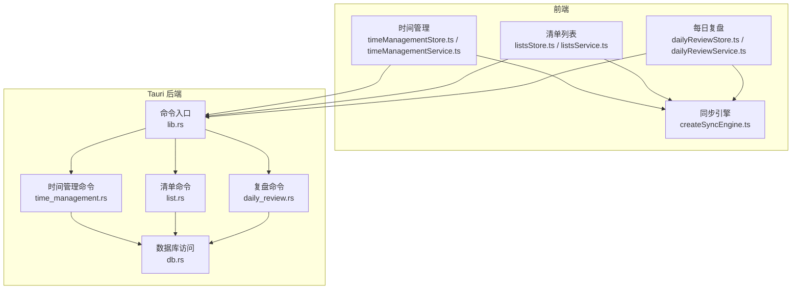
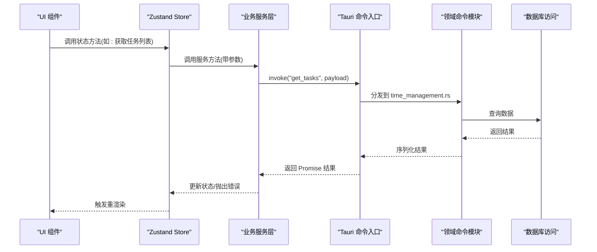
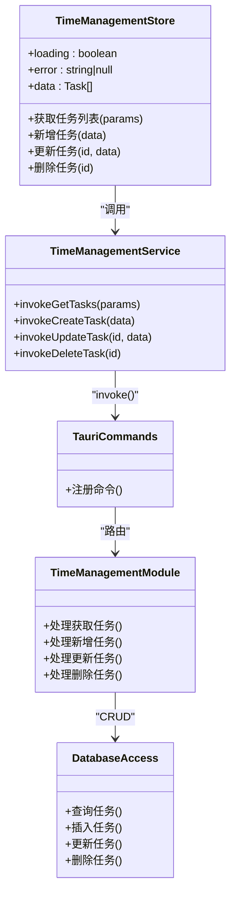
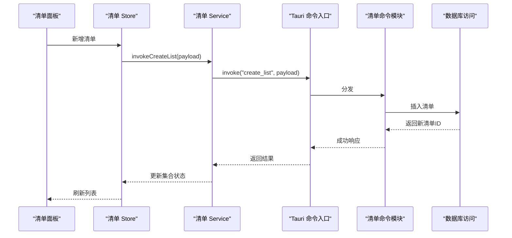
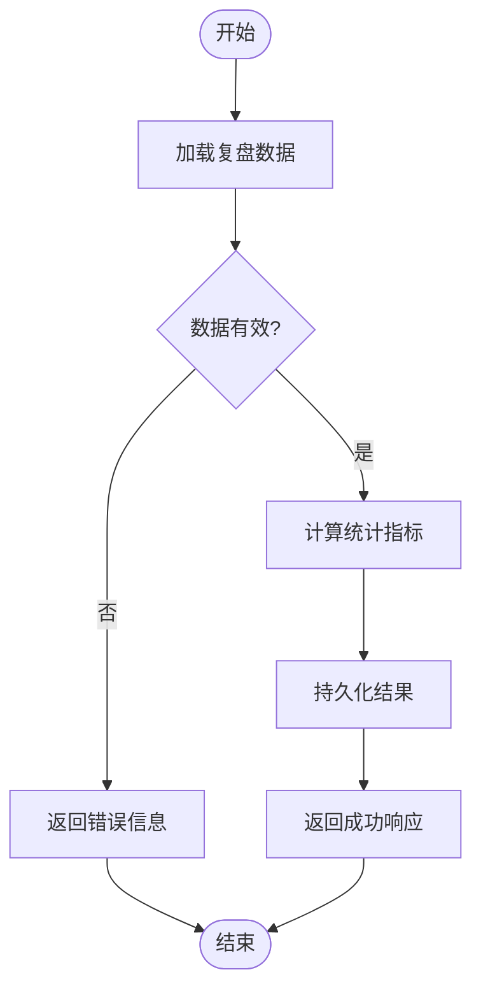
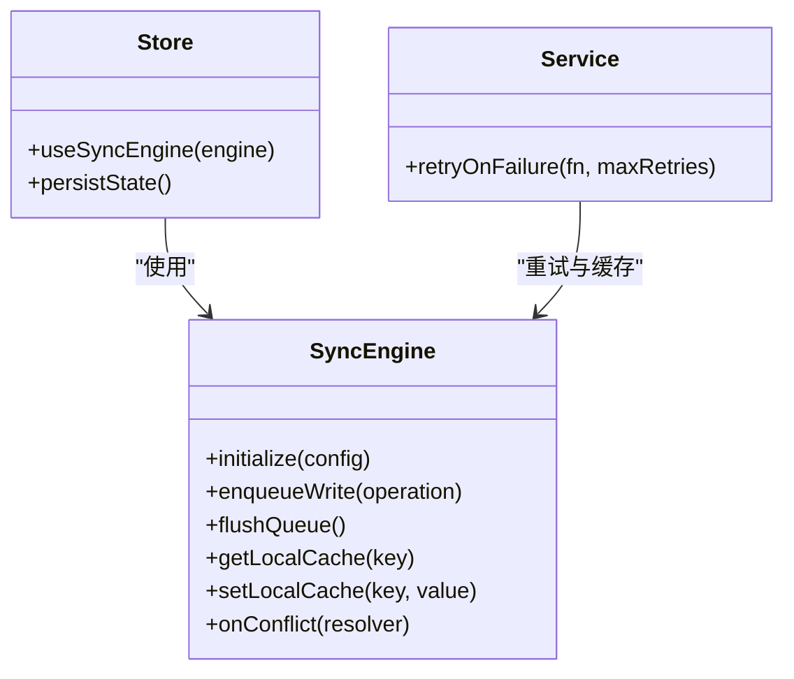
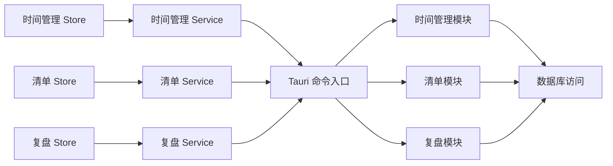

# API 参考文档

<cite>
**本文引用的文件**   
- [src/features/time-management/timeManagementService.ts](file://src/features/time-management/timeManagementService.ts)
- [src/features/time-management/timeManagementStore.ts](file://src/features/time-management/timeManagementStore.ts)
- [src/features/time-management/timeManagementTypes.ts](file://src/features/time-management/timeManagementTypes.ts)
- [src/features/lists/listsService.ts](file://src/features/lists/listsService.ts)
- [src/features/lists/listsStore.ts](file://src/features/lists/listsStore.ts)
- [src/features/lists/listsTypes.ts](file://src/features/lists/listsTypes.ts)
- [src/features/daily-review/dailyReviewService.ts](file://src/features/daily-review/dailyReviewService.ts)
- [src/features/daily-review/dailyReviewStore.ts](file://src/features/daily-review/dailyReviewStore.ts)
- [src/features/daily-review/dailyReviewTypes.ts](file://src/features/daily-review/dailyReviewTypes.ts)
- [src/lib/createSyncEngine.ts](file://src/lib/createSyncEngine.ts)
- [src-tauri/src/lib.rs](file://src-tauri/src/lib.rs)
- [src-tauri/src/time_management.rs](file://src-tauri/src/time_management.rs)
- [src-tauri/src/list.rs](file://src-tauri/src/list.rs)
- [src-tauri/src/daily_review.rs](file://src-tauri/src/daily_review.rs)
- [src-tauri/src/db.rs](file://src-tauri/src/db.rs)
- [src-tauri/tauri.conf.json](file://src-tauri/tauri.conf.json)
</cite>

## 目录
1. [简介](#简介)
2. [项目结构](#项目结构)
3. [核心组件](#核心组件)
4. [架构总览](#架构总览)
5. [详细组件分析](#详细组件分析)
6. [依赖分析](#依赖分析)
7. [性能考虑](#性能考虑)
8. [故障排查指南](#故障排查指南)
9. [结论](#结论)
10. [附录](#附录)

## 简介
本文件为 FishWorker 的前端与 Tauri 后端之间的完整 API 参考，覆盖：
- Zustand Store API（状态管理与异步操作）
- Tauri 命令接口（跨进程调用）
- 业务服务层 API（领域服务封装）

文档包含请求/响应模式、参数说明、返回值类型、错误码定义、异步处理策略、数据验证规则、调用示例与集成指南，并给出版本管理、向后兼容性与废弃策略建议，以及调试与测试方法。所有描述均基于仓库中实际实现进行归纳整理。

## 项目结构
FishWorker 采用“特性域 + 服务层 + Tauri 命令”的分层架构：
- 前端特性域：time-management、lists、daily-review 各自维护 types、store、service 与 UI
- 同步引擎：createSyncEngine 提供本地持久化与变更同步能力
- Tauri 后端：lib.rs 注册命令，各模块 time_management.rs、list.rs、daily_review.rs 暴露命令，db.rs 负责数据库访问

图表来源
- [src/features/time-management/timeManagementStore.ts](file://src/features/time-management/timeManagementStore.ts)
- [src/features/time-management/timeManagementService.ts](file://src/features/time-management/timeManagementService.ts)
- [src/features/lists/listsStore.ts](file://src/features/lists/listsStore.ts)
- [src/features/lists/listsService.ts](file://src/features/lists/listsService.ts)
- [src/features/daily-review/dailyReviewStore.ts](file://src/features/daily-review/dailyReviewStore.ts)
- [src/features/daily-review/dailyReviewService.ts](file://src/features/daily-review/dailyReviewService.ts)
- [src/lib/createSyncEngine.ts](file://src/lib/createSyncEngine.ts)
- [src-tauri/src/lib.rs](file://src-tauri/src/lib.rs)
- [src-tauri/src/time_management.rs](file://src-tauri/src/time_management.rs)
- [src-tauri/src/list.rs](file://src-tauri/src/list.rs)
- [src-tauri/src/daily_review.rs](file://src-tauri/src/daily_review.rs)
- [src-tauri/src/db.rs](file://src-tauri/src/db.rs)

章节来源
- [src/features/time-management/timeManagementStore.ts](file://src/features/time-management/timeManagementStore.ts)
- [src/features/time-management/timeManagementService.ts](file://src/features/time-management/timeManagementService.ts)
- [src/features/lists/listsStore.ts](file://src/features/lists/listsStore.ts)
- [src/features/lists/listsService.ts](file://src/features/lists/listsService.ts)
- [src/features/daily-review/dailyReviewStore.ts](file://src/features/daily-review/dailyReviewStore.ts)
- [src/features/daily-review/dailyReviewService.ts](file://src/features/daily-review/dailyReviewService.ts)
- [src/lib/createSyncEngine.ts](file://src/lib/createSyncEngine.ts)
- [src-tauri/src/lib.rs](file://src-tauri/src/lib.rs)
- [src-tauri/src/time_management.rs](file://src-tauri/src/time_management.rs)
- [src-tauri/src/list.rs](file://src-tauri/src/list.rs)
- [src-tauri/src/daily_review.rs](file://src-tauri/src/daily_review.rs)
- [src-tauri/src/db.rs](file://src-tauri/src/db.rs)

## 核心组件
- 时间管理（Time Management）
  - Store：提供任务查询、新增、更新、删除等状态与方法
  - Service：封装对 Tauri 命令的调用，统一错误与加载态
  - Types：定义任务、筛选条件、分页等数据结构
- 清单列表（Lists）
  - Store：维护清单集合、分组、排序与批量操作
  - Service：封装清单增删改查、导入导出等命令
  - Types：定义清单、分组、模板等模型
- 每日复盘（Daily Review）
  - Store：维护复盘记录、统计聚合
  - Service：封装复盘读写与统计计算
  - Types：定义复盘条目、统计指标
- 同步引擎（Sync Engine）
  - 提供本地缓存、变更队列与重试机制，保障离线可用与一致性

章节来源
- [src/features/time-management/timeManagementTypes.ts](file://src/features/time-management/timeManagementTypes.ts)
- [src/features/time-management/timeManagementStore.ts](file://src/features/time-management/timeManagementStore.ts)
- [src/features/time-management/timeManagementService.ts](file://src/features/time-management/timeManagementService.ts)
- [src/features/lists/listsTypes.ts](file://src/features/lists/listsTypes.ts)
- [src/features/lists/listsStore.ts](file://src/features/lists/listsStore.ts)
- [src/features/lists/listsService.ts](file://src/features/lists/listsService.ts)
- [src/features/daily-review/dailyReviewTypes.ts](file://src/features/daily-review/dailyReviewTypes.ts)
- [src/features/daily-review/dailyReviewStore.ts](file://src/features/daily-review/dailyReviewStore.ts)
- [src/features/daily-review/dailyReviewService.ts](file://src/features/daily-review/dailyReviewService.ts)
- [src/lib/createSyncEngine.ts](file://src/lib/createSyncEngine.ts)

## 架构总览
前端通过 Store 发起业务操作，Service 将请求转发至 Tauri 命令；Tauri 侧路由到对应模块，最终由 db.rs 执行数据库操作。createSyncEngine 在需要时介入，提供本地缓存与重试。

图表来源
- [src/features/time-management/timeManagementStore.ts](file://src/features/time-management/timeManagementStore.ts)
- [src/features/time-management/timeManagementService.ts](file://src/features/time-management/timeManagementService.ts)
- [src-tauri/src/lib.rs](file://src-tauri/src/lib.rs)
- [src-tauri/src/time_management.rs](file://src-tauri/src/time_management.rs)
- [src-tauri/src/db.rs](file://src-tauri/src/db.rs)

## 详细组件分析

### 时间管理 API
- 关键类型
  - 任务实体、筛选条件、分页参数、排序字段等定义于类型文件
- Store API
  - 提供获取任务列表、新增任务、更新任务、删除任务等方法
  - 内部维护 loading、error、data 等状态
- Service API
  - 封装 Tauri 命令调用，统一错误包装与重试
  - 支持分页与筛选参数的传递
- Tauri 命令
  - 在命令入口注册时间管理相关命令
  - 具体实现位于时间管理模块，调用数据库访问层

图表来源
- [src/features/time-management/timeManagementStore.ts](file://src/features/time-management/timeManagementStore.ts)
- [src/features/time-management/timeManagementService.ts](file://src/features/time-management/timeManagementService.ts)
- [src-tauri/src/lib.rs](file://src-tauri/src/lib.rs)
- [src-tauri/src/time_management.rs](file://src-tauri/src/time_management.rs)
- [src-tauri/src/db.rs](file://src-tauri/src/db.rs)

章节来源
- [src/features/time-management/timeManagementTypes.ts](file://src/features/time-management/timeManagementTypes.ts)
- [src/features/time-management/timeManagementStore.ts](file://src/features/time-management/timeManagementStore.ts)
- [src/features/time-management/timeManagementService.ts](file://src/features/time-management/timeManagementService.ts)
- [src-tauri/src/lib.rs](file://src-tauri/src/lib.rs)
- [src-tauri/src/time_management.rs](file://src-tauri/src/time_management.rs)
- [src-tauri/src/db.rs](file://src-tauri/src/db.rs)

### 清单列表 API
- 关键类型
  - 清单、分组、模板、排序规则等定义于类型文件
- Store API
  - 提供清单集合的增删改查、批量操作、导入导出等
- Service API
  - 封装清单相关命令，支持批量与模板应用
- Tauri 命令
  - 清单命令模块处理 CRUD 与批量逻辑，调用数据库访问层

图表来源
- [src/features/lists/listsStore.ts](file://src/features/lists/listsStore.ts)
- [src/features/lists/listsService.ts](file://src/features/lists/listsService.ts)
- [src-tauri/src/lib.rs](file://src-tauri/src/lib.rs)
- [src-tauri/src/list.rs](file://src-tauri/src/list.rs)
- [src-tauri/src/db.rs](file://src-tauri/src/db.rs)

章节来源
- [src/features/lists/listsTypes.ts](file://src/features/lists/listsTypes.ts)
- [src/features/lists/listsStore.ts](file://src/features/lists/listsStore.ts)
- [src/features/lists/listsService.ts](file://src/features/lists/listsService.ts)
- [src-tauri/src/lib.rs](file://src-tauri/src/lib.rs)
- [src-tauri/src/list.rs](file://src-tauri/src/list.rs)
- [src-tauri/src/db.rs](file://src-tauri/src/db.rs)

### 每日复盘 API
- 关键类型
  - 复盘条目、统计指标、日期范围等定义于类型文件
- Store API
  - 提供复盘记录的读取、写入与统计聚合
- Service API
  - 封装复盘命令，支持按日/周维度查询与汇总
- Tauri 命令
  - 复盘命令模块处理复盘数据的持久化与统计

图表来源
- [src/features/daily-review/dailyReviewStore.ts](file://src/features/daily-review/dailyReviewStore.ts)
- [src/features/daily-review/dailyReviewService.ts](file://src/features/daily-review/dailyReviewService.ts)
- [src-tauri/src/lib.rs](file://src-tauri/src/lib.rs)
- [src-tauri/src/daily_review.rs](file://src-tauri/src/daily_review.rs)
- [src-tauri/src/db.rs](file://src-tauri/src/db.rs)

章节来源
- [src/features/daily-review/dailyReviewTypes.ts](file://src/features/daily-review/dailyReviewTypes.ts)
- [src/features/daily-review/dailyReviewStore.ts](file://src/features/daily-review/dailyReviewStore.ts)
- [src/features/daily-review/dailyReviewService.ts](file://src/features/daily-review/dailyReviewService.ts)
- [src-tauri/src/lib.rs](file://src-tauri/src/lib.rs)
- [src-tauri/src/daily_review.rs](file://src-tauri/src/daily_review.rs)
- [src-tauri/src/db.rs](file://src-tauri/src/db.rs)

### 同步引擎 API
- 职责
  - 提供本地缓存、变更队列、重试与冲突解决
- 使用方式
  - 在 Store 或 Service 初始化时注入同步引擎实例
  - 对写操作进行落盘与队列化，读操作优先从本地缓存返回
- 配置项
  - 存储路径、最大重试次数、退避策略等

图表来源
- [src/lib/createSyncEngine.ts](file://src/lib/createSyncEngine.ts)
- [src/features/time-management/timeManagementStore.ts](file://src/features/time-management/timeManagementStore.ts)
- [src/features/lists/listsStore.ts](file://src/features/lists/listsStore.ts)
- [src/features/daily-review/dailyReviewStore.ts](file://src/features/daily-review/dailyReviewStore.ts)

章节来源
- [src/lib/createSyncEngine.ts](file://src/lib/createSyncEngine.ts)
- [src/features/time-management/timeManagementStore.ts](file://src/features/time-management/timeManagementStore.ts)
- [src/features/lists/listsStore.ts](file://src/features/lists/listsStore.ts)
- [src/features/daily-review/dailyReviewStore.ts](file://src/features/daily-review/dailyReviewStore.ts)

## 依赖分析
- 前端依赖
  - Store 依赖 Service 与 SyncEngine
  - Service 依赖 Tauri 命令入口
- 后端依赖
  - lib.rs 注册命令，分派到各模块
  - 各模块依赖 db.rs 进行数据库访问
- 外部依赖
  - Tauri 运行时与配置文件 tauri.conf.json

图表来源
- [src/features/time-management/timeManagementStore.ts](file://src/features/time-management/timeManagementStore.ts)
- [src/features/time-management/timeManagementService.ts](file://src/features/time-management/timeManagementService.ts)
- [src/features/lists/listsStore.ts](file://src/features/lists/listsStore.ts)
- [src/features/lists/listsService.ts](file://src/features/lists/listsService.ts)
- [src/features/daily-review/dailyReviewStore.ts](file://src/features/daily-review/dailyReviewStore.ts)
- [src/features/daily-review/dailyReviewService.ts](file://src/features/daily-review/dailyReviewService.ts)
- [src-tauri/src/lib.rs](file://src-tauri/src/lib.rs)
- [src-tauri/src/time_management.rs](file://src-tauri/src/time_management.rs)
- [src-tauri/src/list.rs](file://src-tauri/src/list.rs)
- [src-tauri/src/daily_review.rs](file://src-tauri/src/daily_review.rs)
- [src-tauri/src/db.rs](file://src-tauri/src/db.rs)

章节来源
- [src-tauri/tauri.conf.json](file://src-tauri/tauri.conf.json)
- [src-tauri/src/lib.rs](file://src-tauri/src/lib.rs)

## 性能考虑
- 分页与筛选
  - 列表类接口应支持分页与筛选，减少一次性传输数据量
- 本地缓存
  - 利用同步引擎缓存热点数据，降低重复请求
- 批量操作
  - 合并多次写操作为一次事务，减少 I/O 开销
- 重试与退避
  - 对网络或数据库异常采用指数退避重试，避免雪崩
- 并发控制
  - 限制并发写操作数量，防止资源争用

[本节为通用指导，不直接分析具体文件]

## 故障排查指南
- 常见问题
  - 命令未注册：检查 Tauri 命令入口是否正确注册
  - 参数校验失败：确认前端传入参数符合类型定义
  - 数据库连接失败：检查数据库配置与权限
- 日志与调试
  - 在前端 Service 层打印请求与响应摘要
  - 在后端模块输出关键步骤日志
- 单元测试与集成测试
  - 对 Store 方法进行 Mock 测试
  - 对 Service 层进行端到端调用测试
  - 对 Tauri 命令进行隔离测试

章节来源
- [src/features/time-management/timeManagementService.ts](file://src/features/time-management/timeManagementService.ts)
- [src/features/lists/listsService.ts](file://src/features/lists/listsService.ts)
- [src/features/daily-review/dailyReviewService.ts](file://src/features/daily-review/dailyReviewService.ts)
- [src-tauri/src/lib.rs](file://src-tauri/src/lib.rs)

## 结论
FishWorker 的 API 体系以 Store-Service-Tauri 分层为核心，结合同步引擎提升可靠性与用户体验。通过明确的类型定义、统一的错误处理与可观测性设计，便于扩展与维护。建议在后续迭代中持续完善错误码规范、版本管理与兼容性策略。

[本节为总结，不直接分析具体文件]

## 附录

### 版本管理、向后兼容与废弃策略
- 版本管理
  - 在 Tauri 命令入口对命令进行版本前缀或版本号字段标识
  - 前端 Service 根据目标版本选择不同调用路径
- 向后兼容
  - 新增字段默认值与可选参数，避免破坏旧客户端
  - 保留旧命令别名一段时间，逐步迁移
- 废弃策略
  - 标记废弃命令，提供迁移指南与过渡期
  - 在日志中输出弃用警告，便于监控

[本节为通用指导，不直接分析具体文件]

### 错误码定义与处理策略
- 错误分类
  - 参数错误：前端校验失败或参数缺失
  - 业务错误：数据不存在、状态不一致等
  - 系统错误：数据库连接失败、超时等
- 处理策略
  - 前端统一捕获并展示用户友好提示
  - 后端返回结构化错误对象，包含错误码与消息
  - 对可重试错误实施自动重试与退避

[本节为通用指导，不直接分析具体文件]

### 数据验证规则
- 必填字段校验
- 数据类型与长度限制
- 枚举值约束
- 关联关系完整性校验

[本节为通用指导，不直接分析具体文件]

### 调用示例与集成指南
- 时间管理
  - 获取任务列表：调用 Store 方法，传入分页与筛选参数
  - 新增任务：提交任务数据，处理成功回调与错误提示
- 清单列表
  - 批量导入：准备清单数组，调用批量导入方法，处理进度反馈
- 每日复盘
  - 生成周报：选择日期范围，调用统计方法，渲染图表

[本节为通用指导，不直接分析具体文件]