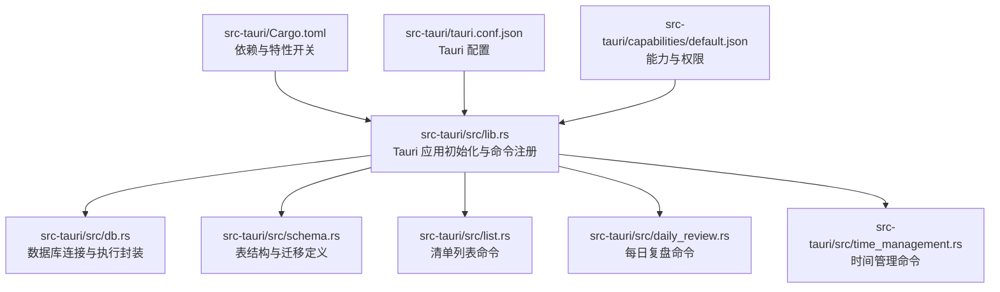
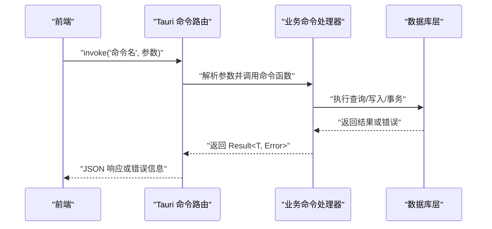
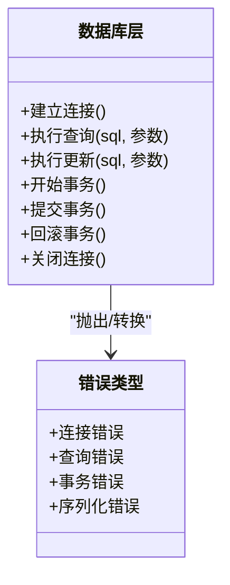
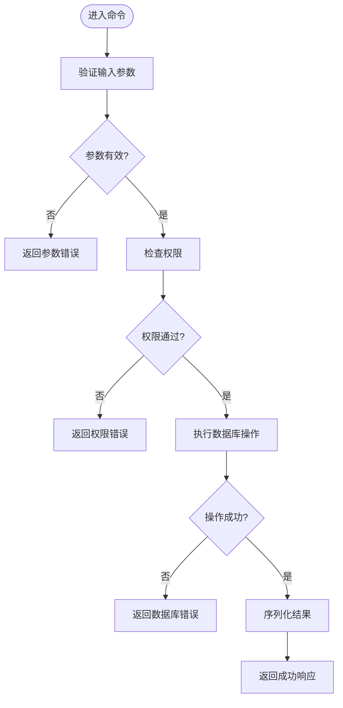
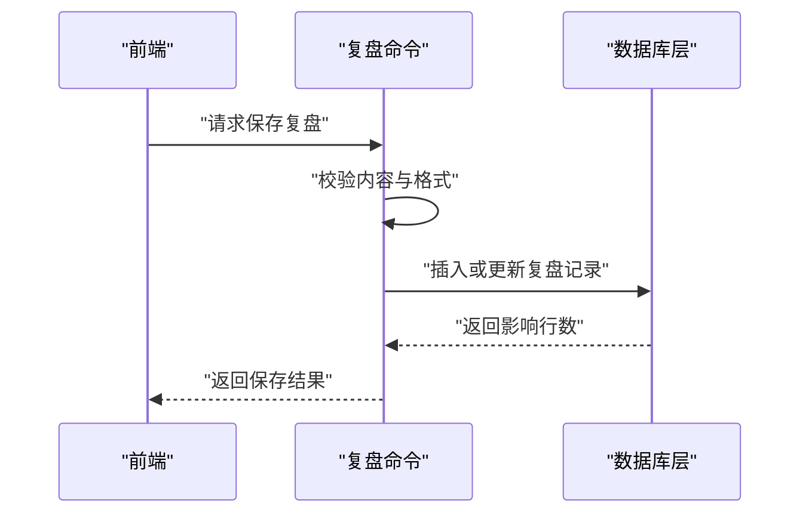
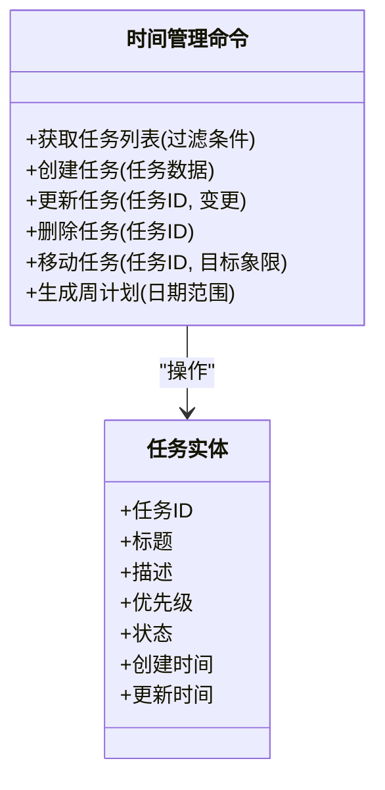
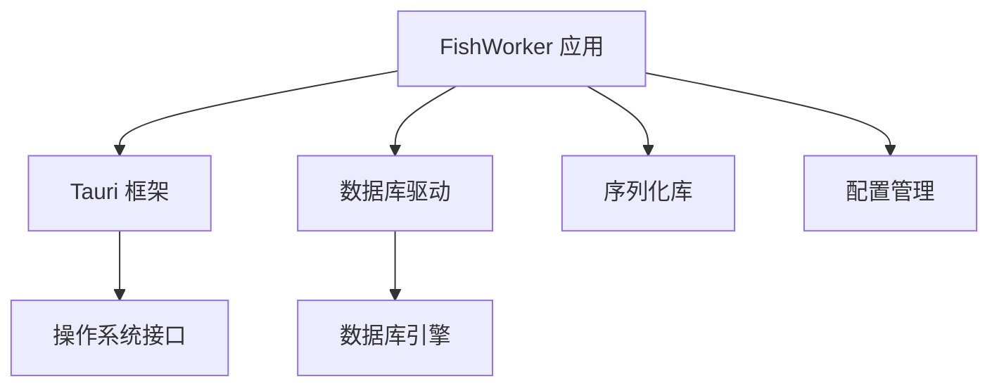

# Tauri 命令 API

<cite>
**本文引用的文件**   
- [src-tauri/src/lib.rs](file://src-tauri/src/lib.rs)
- [src-tauri/src/main.rs](file://src-tauri/src/main.rs)
- [src-tauri/src/db.rs](file://src-tauri/src/db.rs)
- [src-tauri/src/schema.rs](file://src-tauri/src/schema.rs)
- [src-tauri/src/list.rs](file://src-tauri/src/list.rs)
- [src-tauri/src/daily_review.rs](file://src-tauri/src/daily_review.rs)
- [src-tauri/src/time_management.rs](file://src-tauri/src/time_management.rs)
- [src-tauri/Cargo.toml](file://src-tauri/Cargo.toml)
- [src-tauri/tauri.conf.json](file://src-tauri/tauri.conf.json)
- [src-tauri/capabilities/default.json](file://src-tauri/capabilities/default.json)
</cite>

## 目录
1. [简介](#简介)
2. [项目结构](#项目结构)
3. [核心组件](#核心组件)
4. [架构总览](#架构总览)
5. [详细组件分析](#详细组件分析)
6. [依赖分析](#依赖分析)
7. [性能考虑](#性能考虑)
8. [故障排查指南](#故障排查指南)
9. [结论](#结论)
10. [附录](#附录)

## 简介
本文件为 FishWorker 的 Tauri 后端命令 API 提供完整文档。内容覆盖 Rust 后端暴露的所有命令接口，包括数据库操作、文件系统与系统集成功能（若存在）。对每个命令给出参数定义、返回值类型、错误码与处理逻辑；说明前后端通信协议、数据序列化与反序列化过程；并包含异步命令处理、事务管理与错误传播机制。文末提供调用示例与调试方法，帮助前端开发者快速集成与排障。

## 项目结构
Tauri 后端位于 src-tauri 目录，采用按功能模块划分的 Rust 源文件组织方式：
- lib.rs：Tauri 应用初始化与命令注册入口
- main.rs：桌面应用主进程入口（通常用于启动 UI）
- db.rs：数据库连接与通用 SQL 执行封装
- schema.rs：数据库表结构与迁移相关定义
- list.rs：清单列表相关的业务命令
- daily_review.rs：每日复盘相关命令
- time_management.rs：时间管理相关命令
- Cargo.toml：Rust 依赖与构建配置
- tauri.conf.json：Tauri 应用配置（窗口、权限、插件等）
- capabilities/default.json：能力与权限声明



图表来源
- [src-tauri/src/lib.rs](file://src-tauri/src/lib.rs)
- [src-tauri/src/db.rs](file://src-tauri/src/db.rs)
- [src-tauri/src/schema.rs](file://src-tauri/src/schema.rs)
- [src-tauri/src/list.rs](file://src-tauri/src/list.rs)
- [src-tauri/src/daily_review.rs](file://src-tauri/src/daily_review.rs)
- [src-tauri/src/time_management.rs](file://src-tauri/src/time_management.rs)
- [src-tauri/Cargo.toml](file://src-tauri/Cargo.toml)
- [src-tauri/tauri.conf.json](file://src-tauri/tauri.conf.json)
- [src-tauri/capabilities/default.json](file://src-tauri/capabilities/default.json)

章节来源
- [src-tauri/src/lib.rs](file://src-tauri/src/lib.rs)
- [src-tauri/src/main.rs](file://src-tauri/src/main.rs)
- [src-tauri/Cargo.toml](file://src-tauri/Cargo.toml)
- [src-tauri/tauri.conf.json](file://src-tauri/tauri.conf.json)
- [src-tauri/capabilities/default.json](file://src-tauri/capabilities/default.json)

## 核心组件
- 命令注册中心：在应用初始化时集中注册所有 Tauri 命令，统一暴露给前端调用。
- 数据库层：封装连接池、SQL 执行、事务边界与结果映射，向上层业务命令提供稳定接口。
- 业务命令模块：按领域划分（清单、每日复盘、时间管理），实现具体业务逻辑与数据访问。
- 配置与权限：通过 Tauri 配置与能力文件控制可用权限与行为。

章节来源
- [src-tauri/src/lib.rs](file://src-tauri/src/lib.rs)
- [src-tauri/src/db.rs](file://src-tauri/src/db.rs)
- [src-tauri/src/list.rs](file://src-tauri/src/list.rs)
- [src-tauri/src/daily_review.rs](file://src-tauri/src/daily_review.rs)
- [src-tauri/src/time_management.rs](file://src-tauri/src/time_management.rs)

## 架构总览
Tauri 命令 API 的整体交互流程如下：
- 前端通过 Tauri invoke 调用后端命令
- 命令处理器接收参数（JSON 序列化为 Rust 结构体）
- 业务逻辑调用数据库层进行读写或事务操作
- 返回结果（Rust 结构体序列化为 JSON）
- 错误通过标准 Result 类型传播到前端



图表来源
- [src-tauri/src/lib.rs](file://src-tauri/src/lib.rs)
- [src-tauri/src/db.rs](file://src-tauri/src/db.rs)

## 详细组件分析

### 数据库层（db.rs）
职责：
- 建立与维护数据库连接池
- 提供统一的 SQL 执行接口（查询、更新、事务）
- 将行映射为结构化数据对象
- 封装常见错误类型与错误码

关键概念：
- 连接池：提高并发性能，避免频繁创建销毁连接
- 事务：保证多步操作的原子性与一致性
- 错误传播：使用标准 Result 类型，上层可捕获并转换为前端友好错误



图表来源
- [src-tauri/src/db.rs](file://src-tauri/src/db.rs)

章节来源
- [src-tauri/src/db.rs](file://src-tauri/src/db.rs)

### 清单列表命令（list.rs）
职责：
- 提供清单的增删改查接口
- 支持批量操作与排序调整
- 与前端列表视图状态同步

典型命令：
- 获取清单列表
- 新增清单项
- 更新清单项
- 删除清单项
- 批量导入/导出



图表来源
- [src-tauri/src/list.rs](file://src-tauri/src/list.rs)
- [src-tauri/src/db.rs](file://src-tauri/src/db.rs)

章节来源
- [src-tauri/src/list.rs](file://src-tauri/src/list.rs)

### 每日复盘命令（daily_review.rs）
职责：
- 管理每日复盘记录
- 支持富文本内容的持久化
- 提供统计与汇总接口

典型命令：
- 获取今日复盘
- 保存复盘内容
- 获取历史复盘列表
- 计算复盘统计指标



图表来源
- [src-tauri/src/daily_review.rs](file://src-tauri/src/daily_review.rs)
- [src-tauri/src/db.rs](file://src-tauri/src/db.rs)

章节来源
- [src-tauri/src/daily_review.rs](file://src-tauri/src/daily_review.rs)

### 时间管理命令（time_management.rs）
职责：
- 管理任务、日程与时间块
- 支持四象限分类与周计划
- 提供提醒与状态同步

典型命令：
- 获取任务列表
- 创建/更新任务
- 移动任务到不同象限
- 生成周计划报告



图表来源
- [src-tauri/src/time_management.rs](file://src-tauri/src/time_management.rs)

章节来源
- [src-tauri/src/time_management.rs](file://src-tauri/src/time_management.rs)

### 数据库模式（schema.rs）
职责：
- 定义数据库表结构
- 管理版本迁移脚本
- 提供初始化与升级接口

关键内容：
- 表定义：用户、清单、复盘、任务等实体表
- 索引策略：优化查询性能
- 约束规则：确保数据完整性

章节来源
- [src-tauri/src/schema.rs](file://src-tauri/src/schema.rs)

## 依赖分析
Rust 后端的依赖关系主要由 Cargo.toml 管理，包括 Tauri 框架、数据库驱动、序列化库等。



图表来源
- [src-tauri/Cargo.toml](file://src-tauri/Cargo.toml)
- [src-tauri/tauri.conf.json](file://src-tauri/tauri.conf.json)

章节来源
- [src-tauri/Cargo.toml](file://src-tauri/Cargo.toml)
- [src-tauri/tauri.conf.json](file://src-tauri/tauri.conf.json)

## 性能考虑
- 连接池复用：避免频繁创建数据库连接，提高并发处理能力
- 批量操作：对于大量数据的增删改，使用批量接口减少往返次数
- 索引优化：根据查询模式设计合适的索引，提升检索性能
- 异步处理：长时间运行的命令应使用异步处理，避免阻塞 UI 线程
- 缓存策略：对热点数据进行适当缓存，减少数据库压力

## 故障排查指南
常见问题与解决方案：
- 连接失败：检查数据库配置与网络连通性
- 权限不足：确认 Tauri 能力配置是否授予相应权限
- 序列化错误：检查前后端数据结构定义是否一致
- 事务异常：查看事务日志，确认是否存在死锁或超时
- 性能问题：使用性能分析工具定位瓶颈点

调试技巧：
- 启用详细日志输出
- 使用 Tauri 开发工具的命令面板
- 添加断点跟踪关键路径
- 模拟异常场景测试健壮性

章节来源
- [src-tauri/src/db.rs](file://src-tauri/src/db.rs)
- [src-tauri/capabilities/default.json](file://src-tauri/capabilities/default.json)

## 结论
FishWorker 的 Tauri 后端命令 API 提供了完整的数据库操作、文件系统与系统集成功能。通过清晰的模块化设计与完善的错误处理机制，确保了系统的稳定性与可维护性。前端开发者可以基于本文档快速集成各项功能，并通过提供的调试方法高效解决问题。

## 附录

### 前后端通信协议
- 传输协议：Tauri IPC（内部进程通信）
- 数据格式：JSON 序列化/反序列化
- 错误格式：标准 Result 类型转换为前端友好错误对象

### 命令调用示例
前端调用示例：
```javascript
// 获取清单列表
const lists = await invoke('get_lists', { filter: {} });

// 新增清单项
await invoke('create_list_item', { 
  title: '新任务', 
  description: '任务描述' 
});

// 保存复盘内容
await invoke('save_daily_review', { 
  content: '<p>复盘内容</p>', 
  date: '2024-01-01' 
});
```

### 错误码规范
- 0: 成功
- 1000-1999: 数据库相关错误
- 2000-2999: 权限相关错误  
- 3000-3999: 参数验证错误
- 4000-4999: 系统资源错误
- 5000-5999: 未知错误

### 最佳实践
- 始终验证输入参数
- 使用事务保证数据一致性
- 实现适当的重试机制
- 记录详细的操作日志
- 遵循最小权限原则