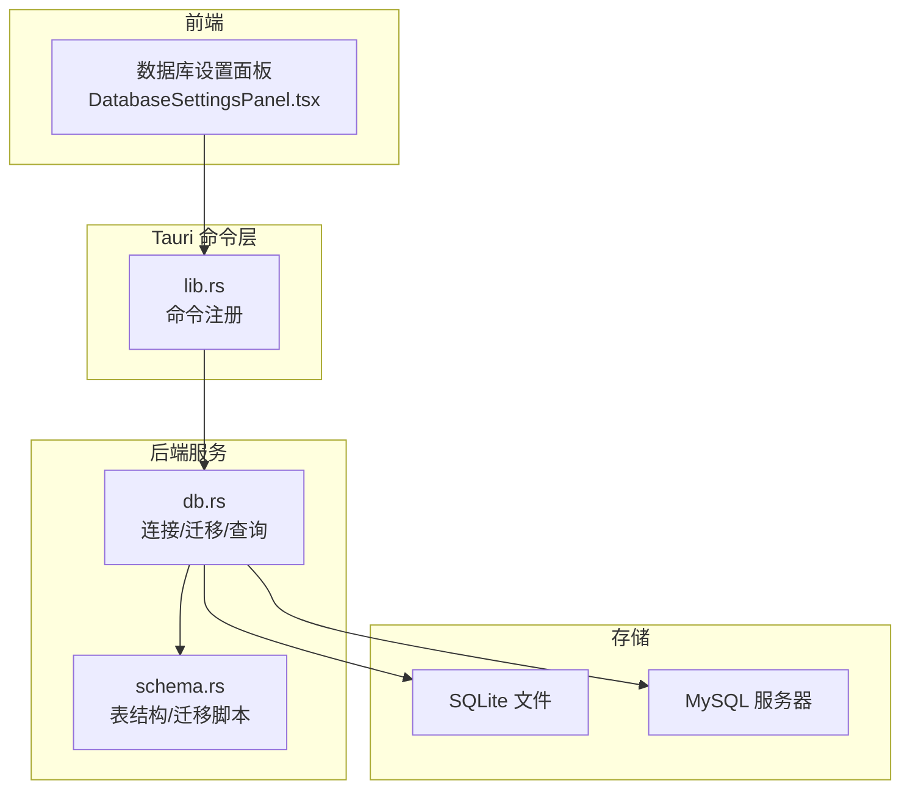
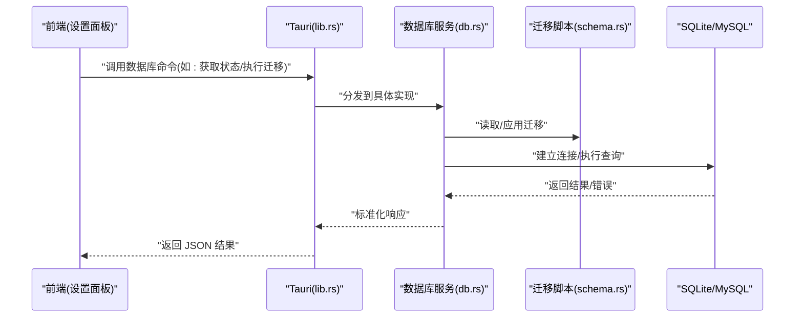
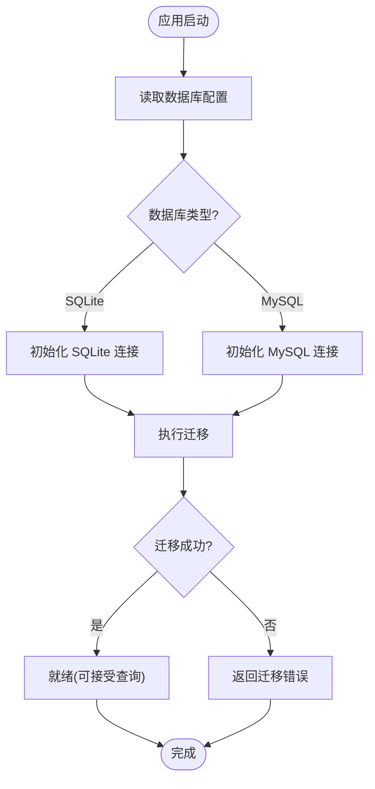
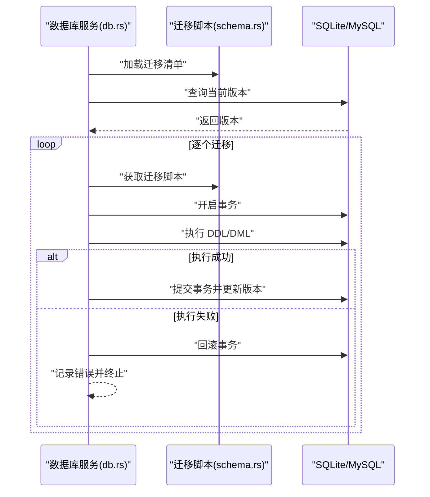
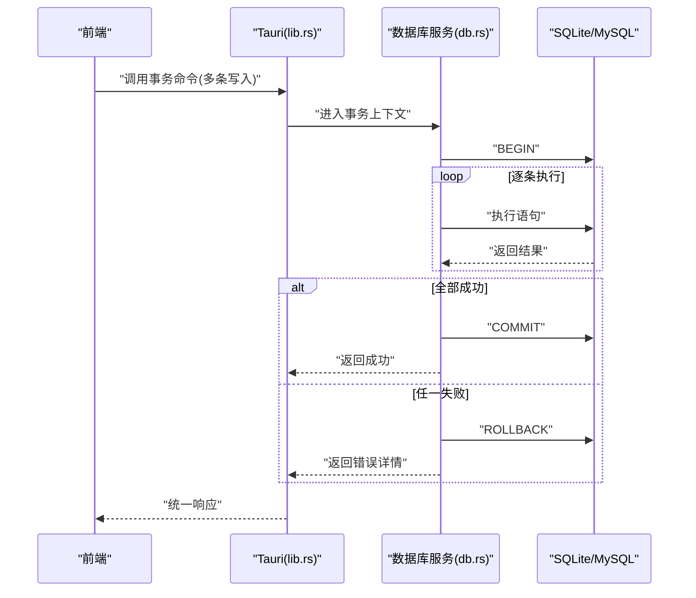
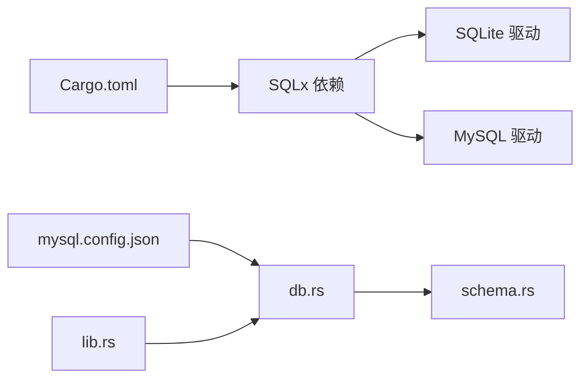

# 数据库操作命令

<cite>
**本文引用的文件**   
- [src-tauri/src/db.rs](file://src-tauri/src/db.rs)
- [src-tauri/src/schema.rs](file://src-tauri/src/schema.rs)
- [src-tauri/src/lib.rs](file://src-tauri/src/lib.rs)
- [src-tauri/Cargo.toml](file://src-tauri/Cargo.toml)
- [src-tauri/mysql.config.json](file://src-tauri/mysql.config.json)
- [src/features/settings/components/DatabaseSettingsPanel.tsx](file://src/features/settings/components/DatabaseSettingsPanel.tsx)
</cite>

## 目录
1. [简介](#简介)
2. [项目结构](#项目结构)
3. [核心组件](#核心组件)
4. [架构总览](#架构总览)
5. [详细组件分析](#详细组件分析)
6. [依赖关系分析](#依赖关系分析)
7. [性能考虑](#性能考虑)
8. [故障排查指南](#故障排查指南)
9. [结论](#结论)
10. [附录](#附录)

## 简介
本文件为 FishWorker 的数据库操作命令提供系统化文档，覆盖 Tauri 后端暴露的所有与数据库相关的命令。内容包含：
- 连接管理（SQLite/MySQL 双引擎）
- 表结构与迁移策略
- CRUD 操作与事务处理
- 参数类型、返回值格式与错误处理机制
- 连接池配置与数据迁移策略
- 实际调用示例与性能优化建议

FishWorker 采用 Tauri 架构，前端通过 Tauri 命令与 Rust 后端交互，后端基于 SQLx 访问 SQLite 或 MySQL 数据库，并提供统一的连接管理与查询接口。

## 项目结构
与数据库相关的关键位置如下：
- src-tauri/src/db.rs：数据库连接、初始化、迁移与通用查询封装
- src-tauri/src/schema.rs：表结构定义与迁移脚本
- src-tauri/src/lib.rs：Tauri 命令注册入口
- src-tauri/Cargo.toml：Rust 依赖（SQLx、SQLite/MySQL 驱动等）
- src-tauri/mysql.config.json：MySQL 连接配置
- src/features/settings/components/DatabaseSettingsPanel.tsx：前端数据库设置面板（用于切换/验证连接）

图表来源
- [src-tauri/src/lib.rs](file://src-tauri/src/lib.rs)
- [src-tauri/src/db.rs](file://src-tauri/src/db.rs)
- [src-tauri/src/schema.rs](file://src-tauri/src/schema.rs)
- [src/features/settings/components/DatabaseSettingsPanel.tsx](file://src/features/settings/components/DatabaseSettingsPanel.tsx)

章节来源
- [src-tauri/src/db.rs](file://src-tauri/src/db.rs)
- [src-tauri/src/schema.rs](file://src-tauri/src/schema.rs)
- [src-tauri/src/lib.rs](file://src-tauri/src/lib.rs)
- [src-tauri/Cargo.toml](file://src-tauri/Cargo.toml)
- [src-tauri/mysql.config.json](file://src-tauri/mysql.config.json)
- [src/features/settings/components/DatabaseSettingsPanel.tsx](file://src/features/settings/components/DatabaseSettingsPanel.tsx)

## 核心组件
- 数据库连接与初始化
  - 负责根据配置选择 SQLite 或 MySQL，建立并缓存连接，执行启动时迁移。
  - 关键职责：解析配置、创建连接、运行迁移、提供统一查询接口。
- 表结构与迁移
  - 集中维护表结构定义与版本化迁移脚本，确保多环境一致性。
- Tauri 命令注册
  - 将 Rust 函数注册为 Tauri 命令，供前端调用。
- 前端设置面板
  - 提供可视化界面以切换数据库类型、填写连接信息、测试连通性。

章节来源
- [src-tauri/src/db.rs](file://src-tauri/src/db.rs)
- [src-tauri/src/schema.rs](file://src-tauri/src/schema.rs)
- [src-tauri/src/lib.rs](file://src-tauri/src/lib.rs)
- [src/features/settings/components/DatabaseSettingsPanel.tsx](file://src/features/settings/components/DatabaseSettingsPanel.tsx)

## 架构总览
整体数据流从前端发起 Tauri 命令开始，经 lib.rs 路由到 db.rs 的数据库服务，再根据配置访问 SQLite 或 MySQL。schema.rs 提供 DDL 与迁移脚本，保证数据库结构一致。

图表来源
- [src-tauri/src/lib.rs](file://src-tauri/src/lib.rs)
- [src-tauri/src/db.rs](file://src-tauri/src/db.rs)
- [src-tauri/src/schema.rs](file://src-tauri/src/schema.rs)

## 详细组件分析

### 连接管理
- 功能要点
  - 支持 SQLite 与 MySQL 两种后端，依据配置动态选择。
  - 提供连接健康检查、重连与错误上报。
  - 在应用启动时自动执行迁移，确保表结构最新。
- 关键流程
  - 读取配置（含 MySQL 配置文件）。
  - 初始化连接池（按数据库类型）。
  - 执行 schema 迁移。
  - 暴露统一查询接口（读/写/事务）。
- 错误处理
  - 对连接失败、认证失败、权限不足、网络超时等进行分类错误返回。
  - 对迁移失败进行回滚提示与日志记录。

章节来源
- [src-tauri/src/db.rs](file://src-tauri/src/db.rs)
- [src-tauri/mysql.config.json](file://src-tauri/mysql.config.json)

#### 连接管理流程图

图表来源
- [src-tauri/src/db.rs](file://src-tauri/src/db.rs)
- [src-tauri/src/schema.rs](file://src-tauri/src/schema.rs)

### 表结构与迁移策略
- 设计原则
  - 所有 DDL 变更集中在 schema.rs，使用版本化迁移脚本。
  - 迁移具备幂等性与回滚能力，避免重复执行与破坏性变更。
- 迁移流程
  - 启动时对比当前版本与目标版本，顺序执行新增迁移。
  - 对每个迁移进行事务包裹，失败则回滚并报错。
- 兼容性
  - 针对 SQLite 与 MySQL 的差异字段类型与语法进行适配。

章节来源
- [src-tauri/src/schema.rs](file://src-tauri/src/schema.rs)
- [src-tauri/src/db.rs](file://src-tauri/src/db.rs)

#### 迁移时序图

图表来源
- [src-tauri/src/db.rs](file://src-tauri/src/db.rs)
- [src-tauri/src/schema.rs](file://src-tauri/src/schema.rs)

### CRUD 操作与事务处理
- 命令范围
  - 提供通用的增删改查命令，以及批量写入与事务命令。
- 参数与返回
  - 输入参数以 JSON 形式传递，字段类型由 Rust 侧严格校验。
  - 返回统一结构，包含状态码、消息体与数据负载。
- 事务语义
  - 支持显式事务命令，确保多个操作的原子性。
  - 异常时自动回滚，并返回明确错误信息。

章节来源
- [src-tauri/src/db.rs](file://src-tauri/src/db.rs)
- [src-tauri/src/lib.rs](file://src-tauri/src/lib.rs)

#### 事务处理序列图

图表来源
- [src-tauri/src/db.rs](file://src-tauri/src/db.rs)
- [src-tauri/src/lib.rs](file://src-tauri/src/lib.rs)

### 前端集成（数据库设置面板）
- 功能说明
  - 提供数据库类型选择、连接参数编辑、连通性测试与保存配置。
- 交互流程
  - 用户修改配置后点击“测试连接”，前端调用 Tauri 命令验证连通性。
  - 成功后保存至本地配置，并在下次启动时生效。

章节来源
- [src/features/settings/components/DatabaseSettingsPanel.tsx](file://src/features/settings/components/DatabaseSettingsPanel.tsx)
- [src-tauri/src/lib.rs](file://src-tauri/src/lib.rs)

## 依赖关系分析
- Rust 依赖
  - SQLx：数据库抽象与连接池
  - SQLite/MySQL 驱动：根据启用特性编译对应后端
- 配置依赖
  - mysql.config.json：MySQL 连接参数（主机、端口、用户名、密码、库名等）
- 模块耦合
  - lib.rs 仅负责命令注册与路由，业务逻辑集中在 db.rs 与 schema.rs，降低耦合度。

图表来源
- [src-tauri/Cargo.toml](file://src-tauri/Cargo.toml)
- [src-tauri/mysql.config.json](file://src-tauri/mysql.config.json)
- [src-tauri/src/lib.rs](file://src-tauri/src/lib.rs)
- [src-tauri/src/db.rs](file://src-tauri/src/db.rs)
- [src-tauri/src/schema.rs](file://src-tauri/src/schema.rs)

章节来源
- [src-tauri/Cargo.toml](file://src-tauri/Cargo.toml)
- [src-tauri/mysql.config.json](file://src-tauri/mysql.config.json)
- [src-tauri/src/lib.rs](file://src-tauri/src/lib.rs)
- [src-tauri/src/db.rs](file://src-tauri/src/db.rs)
- [src-tauri/src/schema.rs](file://src-tauri/src/schema.rs)

## 性能考虑
- 连接池配置
  - 合理设置最大连接数与空闲连接数，避免资源耗尽或频繁创建销毁。
  - 针对高并发场景，适当增大连接池上限，并结合超时控制。
- 查询优化
  - 优先使用索引与预编译语句，减少全表扫描与重复解析。
  - 批量写入使用事务包裹，显著降低 I/O 开销。
- 迁移策略
  - 迁移脚本尽量幂等，避免重复执行造成锁竞争。
  - 大表变更建议在低峰期执行，并分批次提交。
- 错误重试
  - 对瞬时错误（如网络抖动）实施有限次重试，避免雪崩。

[本节为通用指导，不直接分析具体文件]

## 故障排查指南
- 常见问题
  - 连接失败：检查配置是否正确、网络可达性与凭据有效性。
  - 迁移失败：查看迁移日志，确认 DDL 兼容性与权限。
  - 事务回滚：定位失败的语句，检查约束冲突与数据类型不匹配。
- 诊断步骤
  - 启用详细日志，捕获错误堆栈与 SQL 文本。
  - 使用最小复现用例，逐步缩小问题范围。
  - 分别测试 SQLite 与 MySQL，隔离平台差异。

章节来源
- [src-tauri/src/db.rs](file://src-tauri/src/db.rs)
- [src-tauri/src/schema.rs](file://src-tauri/src/schema.rs)

## 结论
FishWorker 的数据库层通过清晰的模块化设计与统一的命令接口，实现了 SQLite/MySQL 双引擎支持与稳健的迁移机制。配合合理的连接池与事务策略，可在桌面端应用中提供高性能与高可靠的数据访问体验。建议在生产环境中持续监控连接池指标与迁移耗时，并根据业务负载调优。

[本节为总结，不直接分析具体文件]

## 附录
- 实际调用示例（概念性）
  - 获取数据库状态：前端调用 Tauri 命令，后端返回连接类型、版本与可用性。
  - 执行迁移：前端触发迁移命令，后端顺序执行迁移脚本并返回结果。
  - 事务写入：前端传入多条写入指令，后端在事务中执行并返回成功或错误详情。
- 最佳实践
  - 始终使用事务包裹批量写入。
  - 对敏感配置（如 MySQL 密码）进行加密存储。
  - 为常用查询字段建立索引，定期评估慢查询。

[本节为补充说明，不直接分析具体文件]