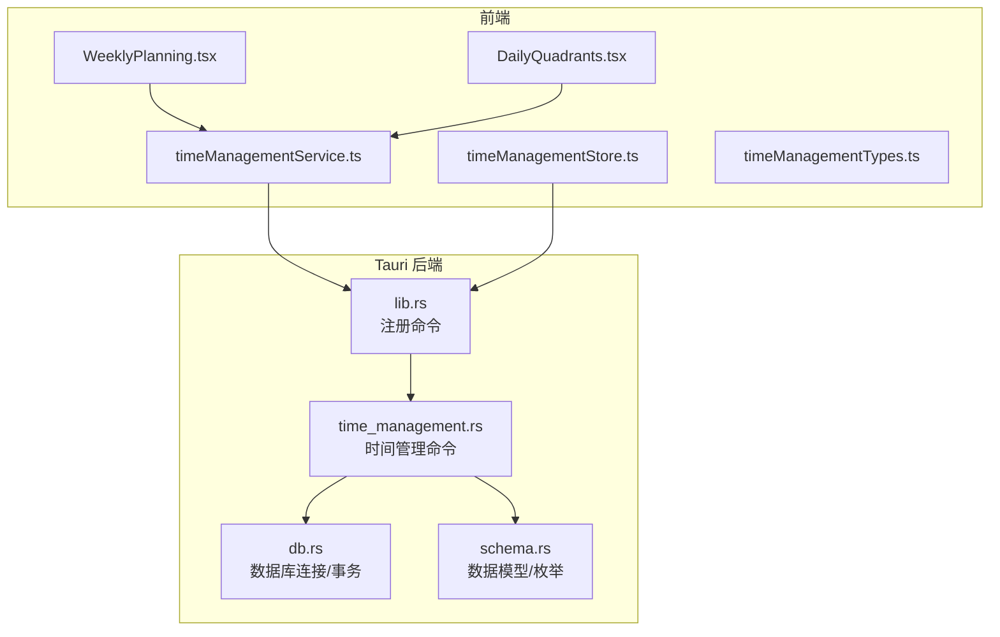
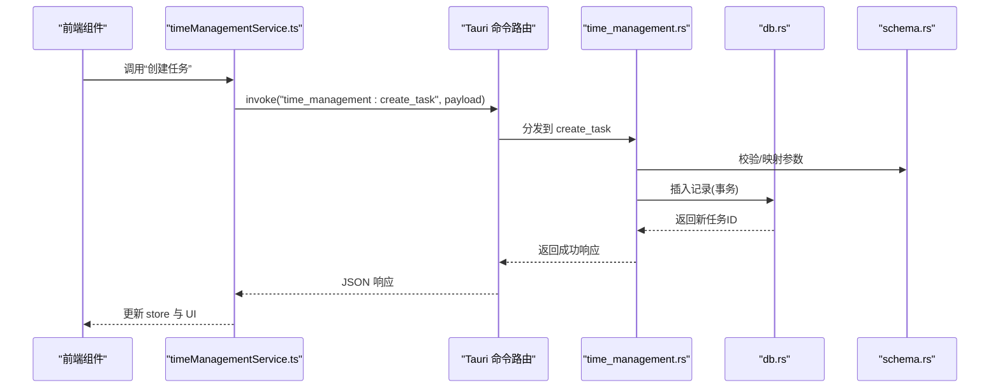
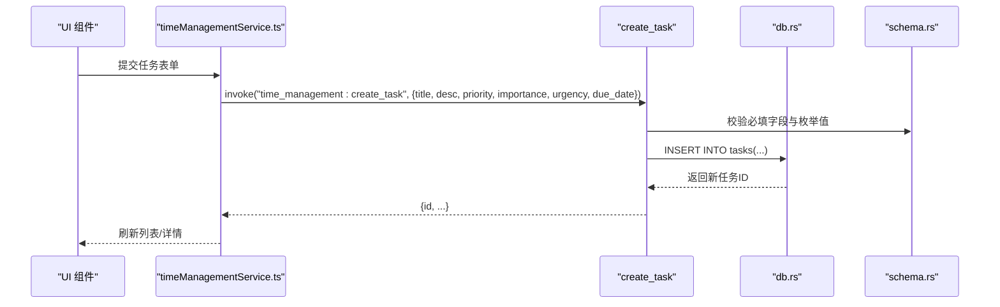
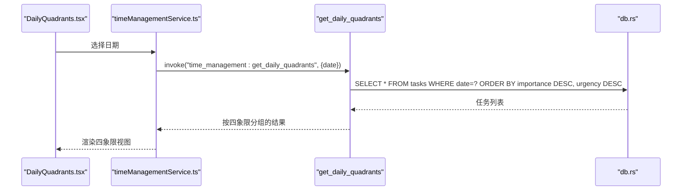
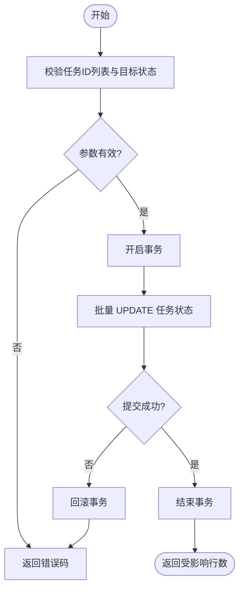
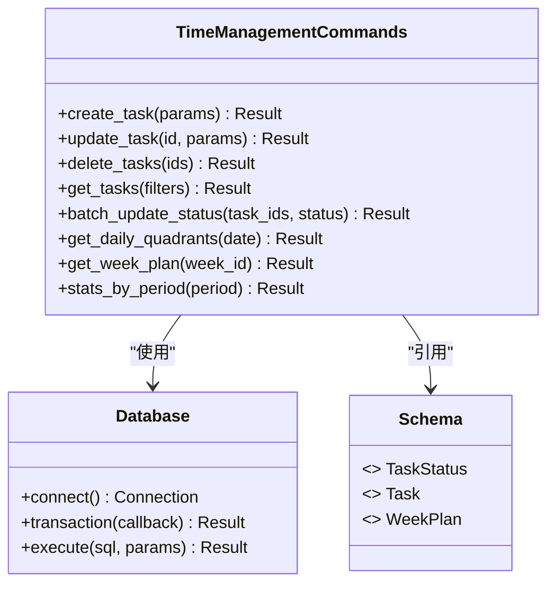
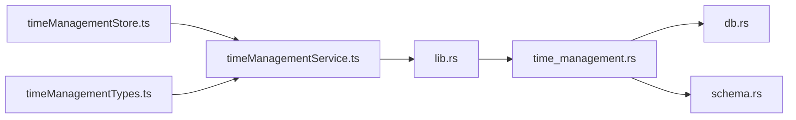

# 时间管理命令

<cite>
**本文引用的文件**   
- [src-tauri/src/time_management.rs](file://src-tauri/src/time_management.rs)
- [src-tauri/src/db.rs](file://src-tauri/src/db.rs)
- [src-tauri/src/schema.rs](file://src-tauri/src/schema.rs)
- [src-tauri/src/lib.rs](file://src-tauri/src/lib.rs)
- [src/features/time-management/timeManagementService.ts](file://src/features/time-management/timeManagementService.ts)
- [src/features/time-management/timeManagementStore.ts](file://src/features/time-management/timeManagementStore.ts)
- [src/features/time-management/timeManagementTypes.ts](file://src/features/time-management/timeManagementTypes.ts)
- [src/features/time-management/WeeklyPlanning.tsx](file://src/features/time-management/WeeklyPlanning.tsx)
- [src/features/time-management/DailyQuadrants.tsx](file://src/features/time-management/DailyQuadrants.tsx)
- [docx/Time_Management_API_Spec.md](file://docx/Time_Management_API_Spec.md)
</cite>

## 目录
1. [简介](#简介)
2. [项目结构](#项目结构)
3. [核心组件](#核心组件)
4. [架构总览](#架构总览)
5. [详细组件分析](#详细组件分析)
6. [依赖分析](#依赖分析)
7. [性能考虑](#性能考虑)
8. [故障排查指南](#故障排查指南)
9. [结论](#结论)
10. [附录](#附录)

## 简介
本文件为 FishWorker 时间管理模块的 Tauri 命令文档，覆盖周计划、每日四象限与任务管理等能力。内容包含：
- 所有相关 Tauri 命令接口定义（参数、返回值、错误码）
- 任务数据结构与状态流转
- 增删改查、批量操作、统计查询等业务流程
- 前端调用示例与调试方法

## 项目结构
时间管理模块由前端特性层与后端 Tauri 命令层组成：
- 前端特性层：服务层、状态存储、类型定义与页面组件
- 后端命令层：Tauri 命令实现、数据库访问与数据模型

图表来源
- [src/features/time-management/timeManagementService.ts](file://src/features/time-management/timeManagementService.ts)
- [src/features/time-management/timeManagementStore.ts](file://src/features/time-management/timeManagementStore.ts)
- [src/features/time-management/timeManagementTypes.ts](file://src/features/time-management/timeManagementTypes.ts)
- [src/features/time-management/WeeklyPlanning.tsx](file://src/features/time-management/WeeklyPlanning.tsx)
- [src/features/time-management/DailyQuadrants.tsx](file://src/features/time-management/DailyQuadrants.tsx)
- [src-tauri/src/lib.rs](file://src-tauri/src/lib.rs)
- [src-tauri/src/time_management.rs](file://src-tauri/src/time_management.rs)
- [src-tauri/src/db.rs](file://src-tauri/src/db.rs)
- [src-tauri/src/schema.rs](file://src-tauri/src/schema.rs)

章节来源
- [src-tauri/src/lib.rs](file://src-tauri/src/lib.rs)
- [src-tauri/src/time_management.rs](file://src-tauri/src/time_management.rs)
- [src-tauri/src/db.rs](file://src-tauri/src/db.rs)
- [src-tauri/src/schema.rs](file://src-tauri/src/schema.rs)
- [src/features/time-management/timeManagementService.ts](file://src/features/time-management/timeManagementService.ts)
- [src/features/time-management/timeManagementStore.ts](file://src/features/time-management/timeManagementStore.ts)
- [src/features/time-management/timeManagementTypes.ts](file://src/features/time-management/timeManagementTypes.ts)
- [src/features/time-management/WeeklyPlanning.tsx](file://src/features/time-management/WeeklyPlanning.tsx)
- [src/features/time-management/DailyQuadrants.tsx](file://src/features/time-management/DailyQuadrants.tsx)

## 核心组件
- 命令注册中心：负责将 Tauri 命令暴露给前端
- 时间管理命令：提供周计划、每日四象限、任务管理的业务接口
- 数据库访问：封装连接、事务与 SQL 执行
- 数据模型：定义任务、周计划、四象限等实体与枚举
- 前端服务与状态：封装命令调用、缓存与 UI 状态同步

章节来源
- [src-tauri/src/lib.rs](file://src-tauri/src/lib.rs)
- [src-tauri/src/time_management.rs](file://src-tauri/src/time_management.rs)
- [src-tauri/src/db.rs](file://src-tauri/src/db.rs)
- [src-tauri/src/schema.rs](file://src-tauri/src/schema.rs)
- [src/features/time-management/timeManagementService.ts](file://src/features/time-management/timeManagementService.ts)
- [src/features/time-management/timeManagementStore.ts](file://src/features/time-management/timeManagementStore.ts)

## 架构总览
前端通过 Tauri 命令与后端交互，后端基于数据库持久化数据并返回结构化结果。

图表来源
- [src/features/time-management/timeManagementService.ts](file://src/features/time-management/timeManagementService.ts)
- [src-tauri/src/lib.rs](file://src-tauri/src/lib.rs)
- [src-tauri/src/time_management.rs](file://src-tauri/src/time_management.rs)
- [src-tauri/src/db.rs](file://src-tauri/src/db.rs)
- [src-tauri/src/schema.rs](file://src-tauri/src/schema.rs)

## 详细组件分析

### 数据模型与枚举
- 任务实体：包含唯一标识、标题、描述、优先级、重要度、紧急度、所属日期、所属周、状态、完成时间、创建/更新时间等字段
- 周计划实体：包含周标识、起止日期、备注、关联任务集合
- 四象限维度：按重要度与紧急度组合形成四个象限
- 任务状态：待办、进行中、已完成、已取消等
- 错误码：用于统一返回错误信息，便于前端处理

章节来源
- [src-tauri/src/schema.rs](file://src-tauri/src/schema.rs)
- [docx/Time_Management_API_Spec.md](file://docx/Time_Management_API_Spec.md)

### 命令注册与路由
- 在命令注册中心集中声明所有时间管理相关命令
- 前端通过统一的 invoke 调用入口触发对应命令

章节来源
- [src-tauri/src/lib.rs](file://src-tauri/src/lib.rs)

### 时间管理命令集
以下命令均位于时间管理命令文件中，涵盖周计划、每日四象限与任务管理：

- 周计划
  - 获取本周计划：按当前周范围查询计划与任务
  - 创建/更新/删除周计划：维护周计划主数据
  - 批量迁移任务至新周：支持整周任务迁移

- 每日四象限
  - 获取某日四象限视图：按日期与重要度/紧急度分组
  - 调整任务象限：更新任务的优先级、重要度、紧急度
  - 快速移动任务：在同日内跨象限移动

- 任务管理
  - 创建任务：新增任务并返回完整对象
  - 更新任务：部分字段更新（如状态、时间、标签等）
  - 删除任务：单条或批量删除
  - 查询任务：按条件过滤（日期、状态、标签、搜索词）
  - 批量操作：批量更新状态、批量移动日期、批量打标签
  - 统计查询：按日/周/月统计任务数量、完成率、耗时分布等

- 通用
  - 事务性写入：确保多表一致性
  - 分页与排序：支持列表分页、多字段排序
  - 错误码：统一错误返回格式

章节来源
- [src-tauri/src/time_management.rs](file://src-tauri/src/time_management.rs)
- [docx/Time_Management_API_Spec.md](file://docx/Time_Management_API_Spec.md)

### 数据库访问层
- 连接管理：初始化连接池、配置读取
- 事务控制：开启/提交/回滚
- 查询构建：动态条件拼接、分页与排序
- 错误传播：将底层错误包装为统一错误码

章节来源
- [src-tauri/src/db.rs](file://src-tauri/src/db.rs)

### 前端服务与状态
- timeManagementService.ts：封装对 Tauri 命令的调用，统一参数序列化与错误处理
- timeManagementStore.ts：维护本地状态，监听命令结果并更新 UI
- timeManagementTypes.ts：定义前后端共享的数据结构与类型
- WeeklyPlanning.tsx / DailyQuadrants.tsx：页面组件，调用服务层进行交互

章节来源
- [src/features/time-management/timeManagementService.ts](file://src/features/time-management/timeManagementService.ts)
- [src/features/time-management/timeManagementStore.ts](file://src/features/time-management/timeManagementStore.ts)
- [src/features/time-management/timeManagementTypes.ts](file://src/features/time-management/timeManagementTypes.ts)
- [src/features/time-management/WeeklyPlanning.tsx](file://src/features/time-management/WeeklyPlanning.tsx)
- [src/features/time-management/DailyQuadrants.tsx](file://src/features/time-management/DailyQuadrants.tsx)

### 关键流程时序图

#### 创建任务

图表来源
- [src/features/time-management/timeManagementService.ts](file://src/features/time-management/timeManagementService.ts)
- [src-tauri/src/time_management.rs](file://src-tauri/src/time_management.rs)
- [src-tauri/src/db.rs](file://src-tauri/src/db.rs)
- [src-tauri/src/schema.rs](file://src-tauri/src/schema.rs)

#### 获取每日四象限

图表来源
- [src/features/time-management/DailyQuadrants.tsx](file://src/features/time-management/DailyQuadrants.tsx)
- [src/features/time-management/timeManagementService.ts](file://src/features/time-management/timeManagementService.ts)
- [src-tauri/src/time_management.rs](file://src-tauri/src/time_management.rs)
- [src-tauri/src/db.rs](file://src-tauri/src/db.rs)

#### 批量更新任务状态

图表来源
- [src-tauri/src/time_management.rs](file://src-tauri/src/time_management.rs)
- [src-tauri/src/db.rs](file://src-tauri/src/db.rs)

### 类关系图（后端）

图表来源
- [src-tauri/src/time_management.rs](file://src-tauri/src/time_management.rs)
- [src-tauri/src/db.rs](file://src-tauri/src/db.rs)
- [src-tauri/src/schema.rs](file://src-tauri/src/schema.rs)

## 依赖分析
- 命令注册与路由：lib.rs 将时间管理命令注入 Tauri 运行时
- 命令实现：time_management.rs 依赖 db.rs 与 schema.rs
- 前端服务：timeManagementService.ts 依赖 Tauri invoke 接口
- 状态与类型：timeManagementStore.ts 与 timeManagementTypes.ts 保持前后端契约一致

图表来源
- [src-tauri/src/lib.rs](file://src-tauri/src/lib.rs)
- [src-tauri/src/time_management.rs](file://src-tauri/src/time_management.rs)
- [src-tauri/src/db.rs](file://src-tauri/src/db.rs)
- [src-tauri/src/schema.rs](file://src-tauri/src/schema.rs)
- [src/features/time-management/timeManagementService.ts](file://src/features/time-management/timeManagementService.ts)
- [src/features/time-management/timeManagementStore.ts](file://src/features/time-management/timeManagementStore.ts)
- [src/features/time-management/timeManagementTypes.ts](file://src/features/time-management/timeManagementTypes.ts)

章节来源
- [src-tauri/src/lib.rs](file://src-tauri/src/lib.rs)
- [src-tauri/src/time_management.rs](file://src-tauri/src/time_management.rs)
- [src-tauri/src/db.rs](file://src-tauri/src/db.rs)
- [src-tauri/src/schema.rs](file://src-tauri/src/schema.rs)
- [src/features/time-management/timeManagementService.ts](file://src/features/time-management/timeManagementService.ts)
- [src/features/time-management/timeManagementStore.ts](file://src/features/time-management/timeManagementStore.ts)
- [src/features/time-management/timeManagementTypes.ts](file://src/features/time-management/timeManagementTypes.ts)

## 性能考虑
- 批量操作优先使用事务与批量 SQL，减少往返次数
- 列表查询支持分页与索引优化，避免全表扫描
- 四象限视图按需加载，避免一次性拉取过多数据
- 前端采用状态缓存与增量更新，降低重复请求

[本节为通用指导，无需特定文件来源]

## 故障排查指南
- 常见错误码
  - 参数校验失败：检查必填字段、枚举值与日期格式
  - 数据库连接失败：确认连接配置与权限
  - 事务失败：查看日志定位具体 SQL 错误
  - 权限不足：确认用户角色与资源访问策略
- 调试方法
  - 前端：打开开发者工具，查看 invoke 调用与响应体
  - 后端：启用详细日志，捕获命令入参与 SQL 执行
  - 断点：在命令入口与数据库层设置断点，逐步验证

章节来源
- [src-tauri/src/time_management.rs](file://src-tauri/src/time_management.rs)
- [src-tauri/src/db.rs](file://src-tauri/src/db.rs)
- [src/features/time-management/timeManagementService.ts](file://src/features/time-management/timeManagementService.ts)

## 结论
时间管理模块通过清晰的命令分层与前后端契约，实现了周计划、每日四象限与任务管理的完整闭环。建议在生产环境完善错误码规范、日志采集与监控告警，进一步提升稳定性与可观测性。

[本节为总结，无需特定文件来源]

## 附录

### 命令清单与参数/返回说明
以下为时间管理相关命令的概览（以实际实现为准）：
- 周计划
  - get_week_plan：参数 week_id；返回周计划与任务列表
  - upsert_week_plan：参数 week_plan；返回周计划 ID
  - delete_week_plan：参数 week_id；返回成功标志
  - migrate_week_tasks：参数 source_week_id, target_week_id；返回迁移计数
- 每日四象限
  - get_daily_quadrants：参数 date；返回四象限分组的任务
  - move_task_to_quadrant：参数 task_id, importance, urgency；返回更新后的任务
- 任务管理
  - create_task：参数 title, description, priority, importance, urgency, due_date, tags；返回任务对象
  - update_task：参数 id, fields；返回更新后的任务
  - delete_tasks：参数 ids；返回受影响行数
  - get_tasks：参数 filters（date_range, status, tags, search, page, size, sort）；返回分页结果
  - batch_update_status：参数 task_ids, status；返回受影响行数
  - stats_by_period：参数 period（day/week/month）、filters；返回统计指标

章节来源
- [src-tauri/src/time_management.rs](file://src-tauri/src/time_management.rs)
- [docx/Time_Management_API_Spec.md](file://docx/Time_Management_API_Spec.md)

### 前端调用示例（概念性）
- 创建任务
  - 调用 service.createTask({title, description, priority, importance, urgency, due_date, tags})
  - 成功后更新 store 并刷新列表
- 获取四象限
  - 调用 service.getDailyQuadrants(date)
  - 根据返回分组渲染四象限面板
- 批量更新状态
  - 调用 service.batchUpdateStatus(taskIds, status)
  - 成功后批量刷新 UI

章节来源
- [src/features/time-management/timeManagementService.ts](file://src/features/time-management/timeManagementService.ts)
- [src/features/time-management/timeManagementStore.ts](file://src/features/time-management/timeManagementStore.ts)
- [src/features/time-management/DailyQuadrants.tsx](file://src/features/time-management/DailyQuadrants.tsx)