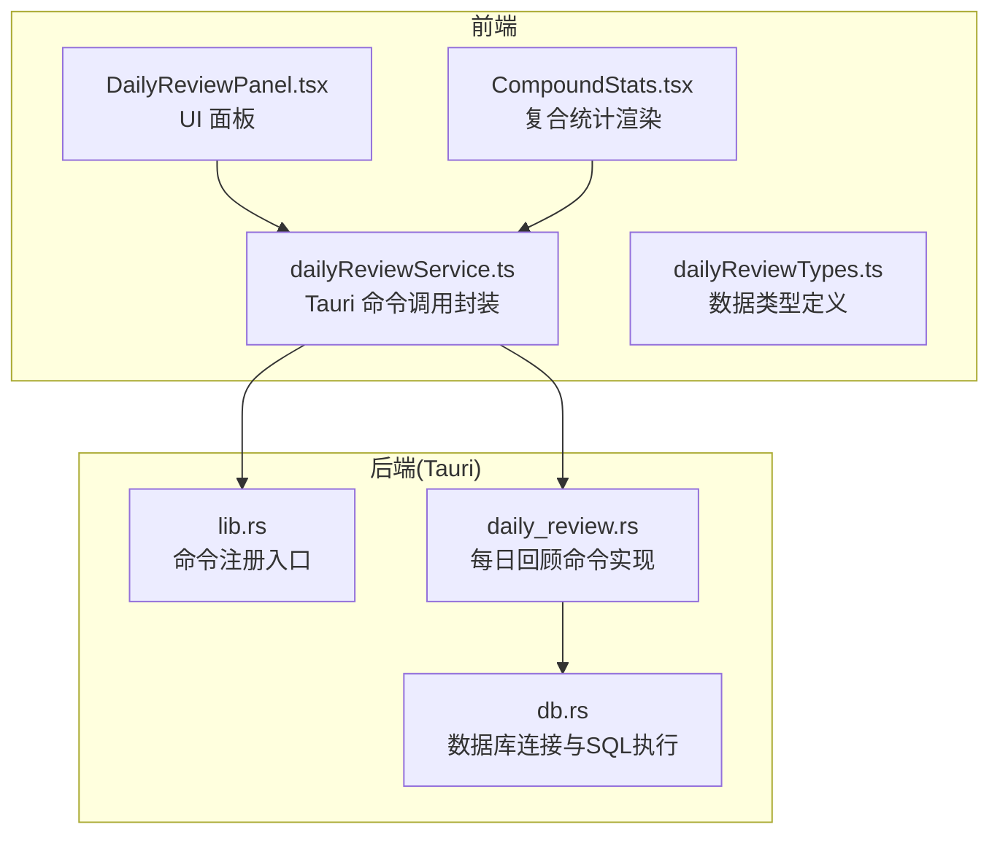
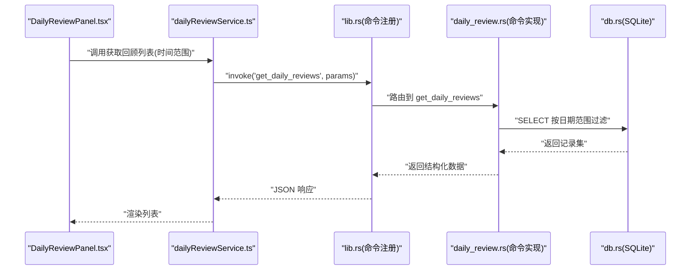
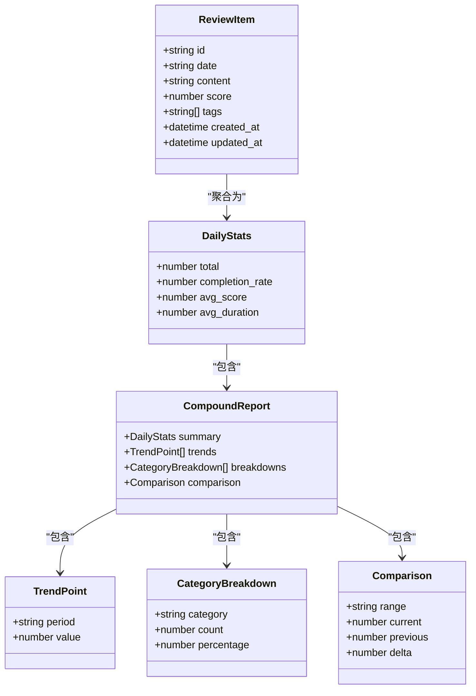
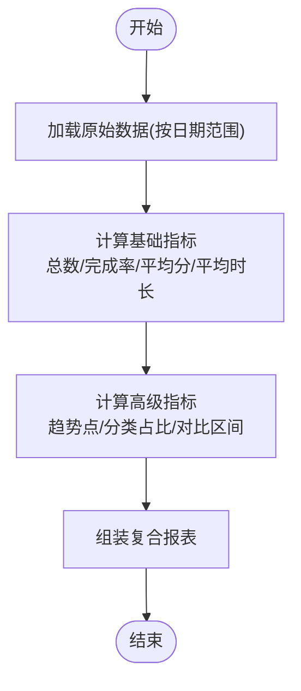
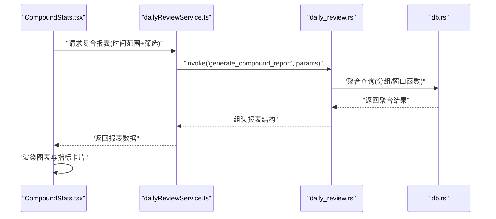
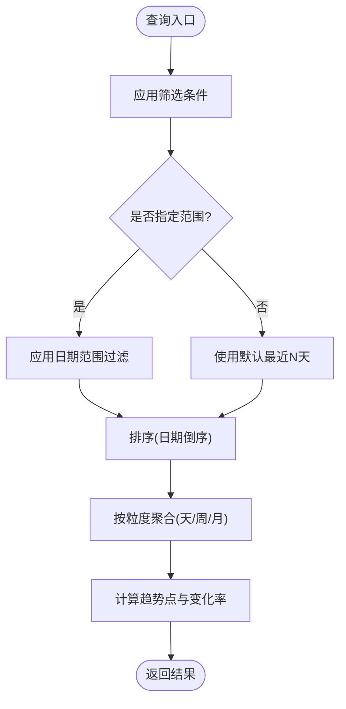
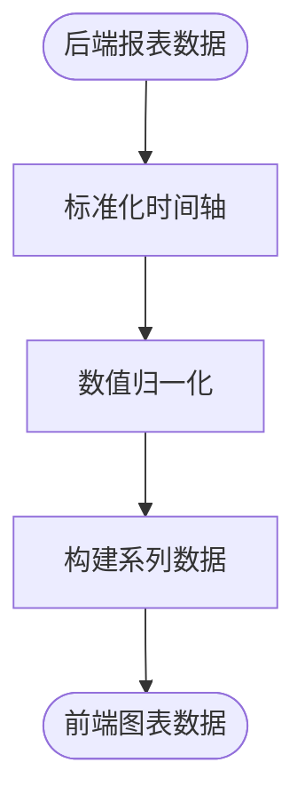
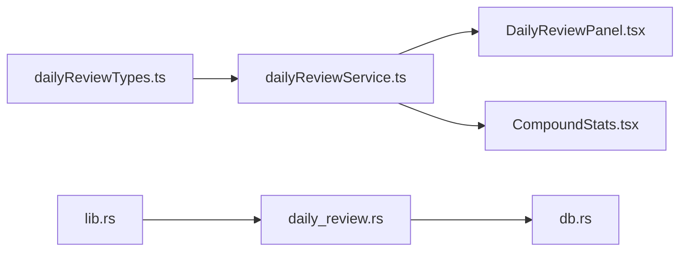

# 每日回顾命令

<cite>
**本文引用的文件**   
- [src-tauri/src/daily_review.rs](file://src-tauri/src/daily_review.rs)
- [src-tauri/src/db.rs](file://src-tauri/src/db.rs)
- [src-tauri/src/lib.rs](file://src-tauri/src/lib.rs)
- [src/features/daily-review/dailyReviewService.ts](file://src/features/daily-review/dailyReviewService.ts)
- [src/features/daily-review/dailyReviewTypes.ts](file://src/features/daily-review/dailyReviewTypes.ts)
- [src/features/daily-review/CompoundStats.tsx](file://src/features/daily-review/CompoundStats.tsx)
- [src/features/daily-review/DailyReviewPanel.tsx](file://src/features/daily-review/DailyReviewPanel.tsx)
</cite>

## 目录
1. [简介](#简介)
2. [项目结构](#项目结构)
3. [核心组件](#核心组件)
4. [架构总览](#架构总览)
5. [详细组件分析](#详细组件分析)
6. [依赖关系分析](#依赖关系分析)
7. [性能考虑](#性能考虑)
8. [故障排查指南](#故障排查指南)
9. [结论](#结论)
10. [附录](#附录)

## 简介
本文件为 FishWorker 的“每日回顾”模块中 Tauri 命令的完整技术文档，聚焦于以下能力：
- 回顾数据的持久化与查询（存储、历史数据检索）
- 统计指标计算（日级、周级、月级等维度）
- 复合报表生成（多源聚合、趋势分析与可视化数据准备）
- 前端调用契约（Tauri 命令接口定义与类型约定）
- 数据聚合算法说明与性能优化建议

目标读者包括前端开发者、后端（Rust/Tauri）工程师以及产品与测试人员。

## 项目结构
围绕“每日回顾”的关键代码分布在前后端两部分：
- 前端（TypeScript/React）
  - 服务层：封装对 Tauri 命令的调用
  - 类型层：定义请求/响应数据结构
  - 视图层：展示面板与复合统计图表
- 后端（Rust/Tauri）
  - 命令实现：暴露给前端的 Tauri 命令
  - 数据库访问：SQLite 读写与查询
  - 注册入口：将命令挂载到 Tauri 应用

**图示来源**
- [src/features/daily-review/dailyReviewService.ts](file://src/features/daily-review/dailyReviewService.ts)
- [src/features/daily-review/dailyReviewTypes.ts](file://src/features/daily-review/dailyReviewTypes.ts)
- [src/features/daily-review/DailyReviewPanel.tsx](file://src/features/daily-review/DailyReviewPanel.tsx)
- [src/features/daily-review/CompoundStats.tsx](file://src/features/daily-review/CompoundStats.tsx)
- [src-tauri/src/lib.rs](file://src-tauri/src/lib.rs)
- [src-tauri/src/daily_review.rs](file://src-tauri/src/daily_review.rs)
- [src-tauri/src/db.rs](file://src-tauri/src/db.rs)

**章节来源**
- [src/features/daily-review/dailyReviewService.ts](file://src/features/daily-review/dailyReviewService.ts)
- [src/features/daily-review/dailyReviewTypes.ts](file://src/features/daily-review/dailyReviewTypes.ts)
- [src/features/daily-review/DailyReviewPanel.tsx](file://src/features/daily-review/DailyReviewPanel.tsx)
- [src/features/daily-review/CompoundStats.tsx](file://src/features/daily-review/CompoundStats.tsx)
- [src-tauri/src/lib.rs](file://src-tauri/src/lib.rs)
- [src-tauri/src/daily_review.rs](file://src-tauri/src/daily_review.rs)
- [src-tauri/src/db.rs](file://src-tauri/src/db.rs)

## 核心组件
- 前端服务层（dailyReviewService.ts）
  - 职责：封装所有与“每日回顾”相关的 Tauri 命令调用，统一错误处理与参数校验
  - 关键能力：新增/更新回顾条目、按日期范围查询、获取统计摘要、生成复合报表
- 类型定义（dailyReviewTypes.ts）
  - 职责：定义 ReviewItem、统计指标、报表结构等 TypeScript 类型，确保前后端契约一致
- 后端命令（daily_review.rs）
  - 职责：实现 Tauri 命令，接收前端请求，执行业务逻辑并返回结果
  - 关键能力：CRUD 操作、聚合统计、报表组装
- 数据库访问（db.rs）
  - 职责：提供 SQLite 连接、事务、预编译语句执行、批量写入等通用能力
- 命令注册（lib.rs）
  - 职责：在 Tauri 启动时注册“每日回顾”相关命令，使其可被前端调用

**章节来源**
- [src/features/daily-review/dailyReviewService.ts](file://src/features/daily-review/dailyReviewService.ts)
- [src/features/daily-review/dailyReviewTypes.ts](file://src/features/daily-review/dailyReviewTypes.ts)
- [src-tauri/src/daily_review.rs](file://src-tauri/src/daily_review.rs)
- [src-tauri/src/db.rs](file://src-tauri/src/db.rs)
- [src-tauri/src/lib.rs](file://src-tauri/src/lib.rs)

## 架构总览
整体采用“前端服务层 -> Tauri 命令 -> 数据库访问”的分层架构。前端通过 Tauri 命令与本地 SQLite 交互，避免直接访问文件系统；后端集中实现业务逻辑与数据聚合，保证一致性。

**图示来源**
- [src/features/daily-review/DailyReviewPanel.tsx](file://src/features/daily-review/DailyReviewPanel.tsx)
- [src/features/daily-review/dailyReviewService.ts](file://src/features/daily-review/dailyReviewService.ts)
- [src-tauri/src/lib.rs](file://src-tauri/src/lib.rs)
- [src-tauri/src/daily_review.rs](file://src-tauri/src/daily_review.rs)
- [src-tauri/src/db.rs](file://src-tauri/src/db.rs)

## 详细组件分析

### 数据模型与类型契约
- 前端类型（dailyReviewTypes.ts）
  - 定义回顾条目字段（如日期、内容、标签、评分等）、统计指标（总数、完成率、平均时长等）、复合报表结构（含趋势点、分类占比、对比区间等）
  - 作用：约束请求/响应格式，减少前后端联调成本
- 后端结构（daily_review.rs）
  - 对应 Rust 结构体或 DTO，用于序列化/反序列化 JSON 数据
  - 与 db.rs 中的表结构映射，确保字段名与类型一致

**图示来源**
- [src/features/daily-review/dailyReviewTypes.ts](file://src/features/daily-review/dailyReviewTypes.ts)
- [src-tauri/src/daily_review.rs](file://src-tauri/src/daily_review.rs)

**章节来源**
- [src/features/daily-review/dailyReviewTypes.ts](file://src/features/daily-review/dailyReviewTypes.ts)
- [src-tauri/src/daily_review.rs](file://src-tauri/src/daily_review.rs)

### 统计指标计算逻辑
- 基础指标
  - 总数：按日期范围计数
  - 完成率：完成项数/总项数
  - 平均分：评分均值
  - 平均时长：时长均值（若存在）
- 高级指标
  - 趋势点：按天/周/月聚合的时间序列值
  - 分类占比：按标签/类别分组统计数量与百分比
  - 对比区间：当前区间与上一区间的差值与变化率

**图示来源**
- [src-tauri/src/daily_review.rs](file://src-tauri/src/daily_review.rs)
- [src-tauri/src/db.rs](file://src-tauri/src/db.rs)

**章节来源**
- [src-tauri/src/daily_review.rs](file://src-tauri/src/daily_review.rs)
- [src-tauri/src/db.rs](file://src-tauri/src/db.rs)

### 复合报表生成机制
- 输入：时间范围、筛选条件（标签、评分阈值等）
- 处理：
  - 从 SQLite 拉取原始数据
  - 执行聚合与分组计算
  - 生成趋势点、分类占比、对比区间
- 输出：符合前端类型的复合报表对象，便于可视化渲染

**图示来源**
- [src/features/daily-review/CompoundStats.tsx](file://src/features/daily-review/CompoundStats.tsx)
- [src/features/daily-review/dailyReviewService.ts](file://src/features/daily-review/dailyReviewService.ts)
- [src-tauri/src/daily_review.rs](file://src-tauri/src/daily_review.rs)
- [src-tauri/src/db.rs](file://src-tauri/src/db.rs)

**章节来源**
- [src/features/daily-review/CompoundStats.tsx](file://src/features/daily-review/CompoundStats.tsx)
- [src/features/daily-review/dailyReviewService.ts](file://src/features/daily-review/dailyReviewService.ts)
- [src-tauri/src/daily_review.rs](file://src-tauri/src/daily_review.rs)
- [src-tauri/src/db.rs](file://src-tauri/src/db.rs)

### 历史数据查询与趋势分析
- 历史查询
  - 支持按日期范围、标签、评分等条件过滤
  - 分页与排序（按日期倒序）
- 趋势分析
  - 按天/周/月粒度聚合
  - 计算移动平均与环比/同比变化

**图示来源**
- [src/features/daily-review/dailyReviewService.ts](file://src/features/daily-review/dailyReviewService.ts)
- [src-tauri/src/daily_review.rs](file://src-tauri/src/daily_review.rs)
- [src-tauri/src/db.rs](file://src-tauri/src/db.rs)

**章节来源**
- [src/features/daily-review/dailyReviewService.ts](file://src/features/daily-review/dailyReviewService.ts)
- [src-tauri/src/daily_review.rs](file://src-tauri/src/daily_review.rs)
- [src-tauri/src/db.rs](file://src-tauri/src/db.rs)

### 可视化数据准备
- 目的：将后端聚合结果转换为前端图表库可直接消费的数据结构
- 步骤：
  - 标准化时间轴（补齐缺失日期）
  - 归一化数值（百分比、比率）
  - 构建系列数据（多条线/柱状图）

**图示来源**
- [src/features/daily-review/CompoundStats.tsx](file://src/features/daily-review/CompoundStats.tsx)
- [src/features/daily-review/dailyReviewService.ts](file://src/features/daily-review/dailyReviewService.ts)

**章节来源**
- [src/features/daily-review/CompoundStats.tsx](file://src/features/daily-review/CompoundStats.tsx)
- [src/features/daily-review/dailyReviewService.ts](file://src/features/daily-review/dailyReviewService.ts)

## 依赖关系分析
- 前端依赖
  - dailyReviewService.ts 依赖 dailyReviewTypes.ts 的类型定义
  - DailyReviewPanel.tsx 与 CompoundStats.tsx 依赖 dailyReviewService.ts 提供的命令封装
- 后端依赖
  - daily_review.rs 依赖 db.rs 的数据库访问能力
  - lib.rs 负责将 daily_review.rs 的命令注册到 Tauri 运行时

**图示来源**
- [src/features/daily-review/dailyReviewTypes.ts](file://src/features/daily-review/dailyReviewTypes.ts)
- [src/features/daily-review/dailyReviewService.ts](file://src/features/daily-review/dailyReviewService.ts)
- [src/features/daily-review/DailyReviewPanel.tsx](file://src/features/daily-review/DailyReviewPanel.tsx)
- [src/features/daily-review/CompoundStats.tsx](file://src/features/daily-review/CompoundStats.tsx)
- [src-tauri/src/lib.rs](file://src-tauri/src/lib.rs)
- [src-tauri/src/daily_review.rs](file://src-tauri/src/daily_review.rs)
- [src-tauri/src/db.rs](file://src-tauri/src/db.rs)

**章节来源**
- [src/features/daily-review/dailyReviewTypes.ts](file://src/features/daily-review/dailyReviewTypes.ts)
- [src/features/daily-review/dailyReviewService.ts](file://src/features/daily-review/dailyReviewService.ts)
- [src/features/daily-review/DailyReviewPanel.tsx](file://src/features/daily-review/DailyReviewPanel.tsx)
- [src/features/daily-review/CompoundStats.tsx](file://src/features/daily-review/CompoundStats.tsx)
- [src-tauri/src/lib.rs](file://src-tauri/src/lib.rs)
- [src-tauri/src/daily_review.rs](file://src-tauri/src/daily_review.rs)
- [src-tauri/src/db.rs](file://src-tauri/src/db.rs)

## 性能考虑
- 数据库层面
  - 合理使用索引：对日期、标签、评分等高频过滤字段建立索引
  - 分批读取：大数据量时使用分页与游标，避免一次性加载过多记录
  - 预编译语句：复用 SQL 模板，减少解析开销
- 计算层面
  - 增量聚合：对趋势点与分类占比采用增量更新策略
  - 缓存热点数据：对常用时间范围的统计结果进行短期缓存
- 传输层面
  - 压缩与精简：仅返回必要字段，必要时启用响应压缩
  - 批处理：合并多次小请求为一次批量命令调用

[本节为通用性能建议，不直接分析具体文件]

## 故障排查指南
- 常见问题
  - 命令未注册：检查 lib.rs 是否正确注册 daily_review.rs 中的命令
  - 类型不匹配：确认 dailyReviewTypes.ts 与后端结构体字段一致
  - 数据库连接失败：检查 db.rs 的连接配置与权限
- 定位方法
  - 前端日志：在服务层捕获并打印请求参数与响应
  - 后端日志：在命令实现中记录关键步骤与异常堆栈
  - 数据库审计：开启 SQLite 日志，观察慢查询与锁等待

**章节来源**
- [src-tauri/src/lib.rs](file://src-tauri/src/lib.rs)
- [src-tauri/src/daily_review.rs](file://src-tauri/src/daily_review.rs)
- [src-tauri/src/db.rs](file://src-tauri/src/db.rs)
- [src/features/daily-review/dailyReviewService.ts](file://src/features/daily-review/dailyReviewService.ts)

## 结论
“每日回顾”模块通过清晰的命令分层与类型契约，实现了可靠的本地数据存储、统计计算与复合报表生成。建议在后续迭代中持续优化索引与聚合算法，完善缓存与错误恢复机制，以提升用户体验与系统稳定性。

[本节为总结性内容，不直接分析具体文件]

## 附录
- 命令清单（示例）
  - 新增/更新回顾条目
  - 按日期范围查询回顾列表
  - 获取统计摘要
  - 生成复合报表
- 类型清单（示例）
  - ReviewItem、DailyStats、CompoundReport、TrendPoint、CategoryBreakdown、Comparison

[本节为补充信息，不直接分析具体文件]