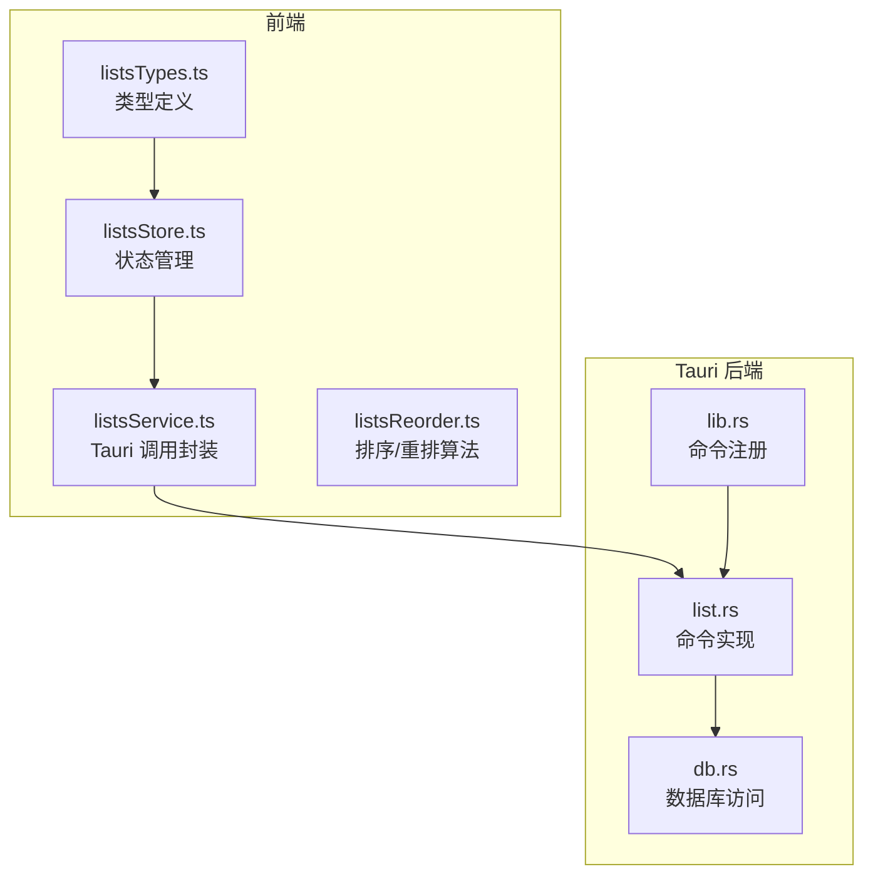
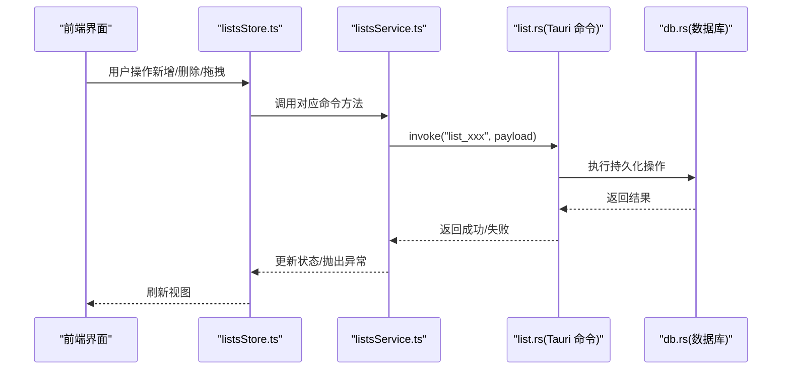
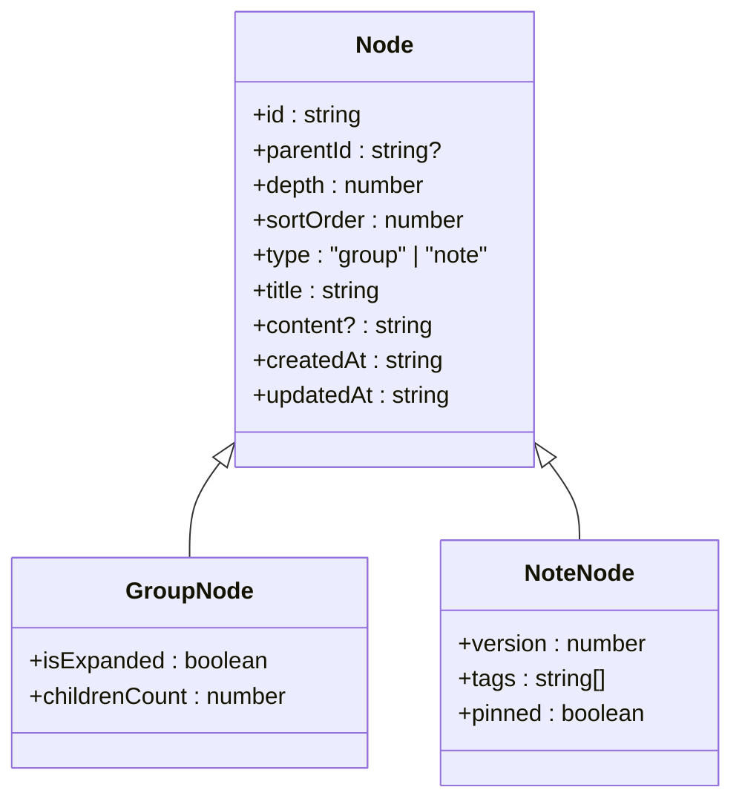
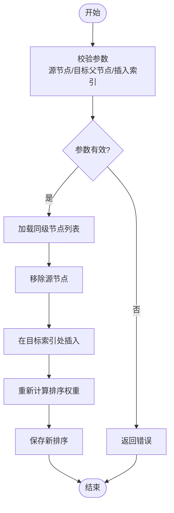

# 清单管理命令

<cite>
**本文引用的文件**   
- [src/features/lists/listsTypes.ts](file://src/features/lists/listsTypes.ts)
- [src/features/lists/listsStore.ts](file://src/features/lists/listsStore.ts)
- [src/features/lists/listsService.ts](file://src/features/lists/listsService.ts)
- [src/features/lists/listsReorder.ts](file://src/features/lists/listsReorder.ts)
- [src-tauri/src/list.rs](file://src-tauri/src/list.rs)
- [src-tauri/src/db.rs](file://src-tauri/src/db.rs)
- [src-tauri/src/lib.rs](file://src-tauri/src/lib.rs)
</cite>

## 目录
1. [简介](#简介)
2. [项目结构](#项目结构)
3. [核心组件](#核心组件)
4. [架构总览](#架构总览)
5. [详细组件分析](#详细组件分析)
6. [依赖关系分析](#依赖关系分析)
7. [性能考虑](#性能考虑)
8. [故障排查指南](#故障排查指南)
9. [结论](#结论)
10. [附录：API 参考与示例](#附录api-参考与示例)

## 简介
本文件面向 FishWorker 的“清单管理”模块，聚焦于 Tauri 后端命令与前端交互的完整文档。内容覆盖：
- 清单分组、笔记条目、拖拽排序、批量操作等所有相关命令接口
- 清单树形结构与条目层级关系
- 排序算法实现（含拖拽重排）
- 条目的增删改查、移动复制、批量导入导出
- 数据模型定义与 API 使用示例

## 项目结构
清单管理涉及前后端协作：
- 前端类型与状态：位于 src/features/lists 下，包含类型定义、状态管理、服务层与重排逻辑
- Tauri 后端命令：位于 src-tauri/src/list.rs，负责持久化与业务编排
- 数据库访问：位于 src-tauri/src/db.rs，封装 SQL/ORM 调用
- Tauri 命令注册：位于 src-tauri/src/lib.rs，将 Rust 函数暴露为 Tauri 命令

**图表来源**
- [src/features/lists/listsTypes.ts](file://src/features/lists/listsTypes.ts)
- [src/features/lists/listsStore.ts](file://src/features/lists/listsStore.ts)
- [src/features/lists/listsService.ts](file://src/features/lists/listsService.ts)
- [src/features/lists/listsReorder.ts](file://src/features/lists/listsReorder.ts)
- [src-tauri/src/list.rs](file://src-tauri/src/list.rs)
- [src-tauri/src/db.rs](file://src-tauri/src/db.rs)
- [src-tauri/src/lib.rs](file://src-tauri/src/lib.rs)

**章节来源**
- [src/features/lists/listsTypes.ts](file://src/features/lists/listsTypes.ts)
- [src/features/lists/listsStore.ts](file://src/features/lists/listsStore.ts)
- [src/features/lists/listsService.ts](file://src/features/lists/listsService.ts)
- [src/features/lists/listsReorder.ts](file://src/features/lists/listsReorder.ts)
- [src-tauri/src/list.rs](file://src-tauri/src/list.rs)
- [src-tauri/src/db.rs](file://src-tauri/src/db.rs)
- [src-tauri/src/lib.rs](file://src-tauri/src/lib.rs)

## 核心组件
- 类型定义（listsTypes.ts）：集中声明清单节点、分组、笔记条目、排序字段、请求/响应结构等
- 状态管理（listsStore.ts）：维护当前视图、选中项、展开/折叠状态、本地缓存与 UI 交互状态
- 服务层（listsService.ts）：封装对 Tauri 命令的调用，统一错误处理与参数校验
- 排序与重排（listsReorder.ts）：提供列表重排、插入位置计算、边界条件处理等纯函数
- Tauri 命令（list.rs）：实现增删改查、分组管理、批量导入导出、移动复制等命令
- 数据库访问（db.rs）：封装底层存储读写，保证事务性与一致性
- 命令注册（lib.rs）：将 Rust 函数注册为 Tauri 命令，供前端通过 invoke 调用

**章节来源**
- [src/features/lists/listsTypes.ts](file://src/features/lists/listsTypes.ts)
- [src/features/lists/listsStore.ts](file://src/features/lists/listsStore.ts)
- [src/features/lists/listsService.ts](file://src/features/lists/listsService.ts)
- [src/features/lists/listsReorder.ts](file://src/features/lists/listsReorder.ts)
- [src-tauri/src/list.rs](file://src-tauri/src/list.rs)
- [src-tauri/src/db.rs](file://src-tauri/src/db.rs)
- [src-tauri/src/lib.rs](file://src-tauri/src/lib.rs)

## 架构总览
前端通过 listsService.ts 调用 Tauri 命令，命令在 list.rs 中实现，必要时委托 db.rs 进行持久化。排序与重排在前端以纯函数方式完成，确保 UI 即时反馈与可测试性。

**图表来源**
- [src/features/lists/listsStore.ts](file://src/features/lists/listsStore.ts)
- [src/features/lists/listsService.ts](file://src/features/lists/listsService.ts)
- [src-tauri/src/list.rs](file://src-tauri/src/list.rs)
- [src-tauri/src/db.rs](file://src-tauri/src/db.rs)

## 详细组件分析

### 数据模型与树形结构
- 节点类型：支持分组与笔记两类节点，具备唯一标识、父级引用、层级深度、排序权重等字段
- 树形结构：通过父子关系与层级深度构建；根节点无父级，子节点按排序权重排列
- 层级关系：用于渲染缩进、权限控制、路径解析等
- 排序字段：用于同级节点的稳定排序，支持手动拖拽调整

**图表来源**
- [src/features/lists/listsTypes.ts](file://src/features/lists/listsTypes.ts)

**章节来源**
- [src/features/lists/listsTypes.ts](file://src/features/lists/listsTypes.ts)

### 排序与拖拽重排算法
- 输入：源节点 id、目标父节点 id、插入索引
- 输出：新的同级节点排序序列
- 规则：
  - 若目标父节点为空，则视为根级别
  - 若插入索引越界，自动修正到有效范围
  - 保持其他同级节点相对顺序不变
  - 避免循环引用（如将节点移动到其子树内）

**图表来源**
- [src/features/lists/listsReorder.ts](file://src/features/lists/listsReorder.ts)

**章节来源**
- [src/features/lists/listsReorder.ts](file://src/features/lists/listsReorder.ts)

### Tauri 命令实现（list.rs）
- 命令分类：
  - 分组管理：创建分组、删除分组、获取分组列表
  - 笔记管理：创建笔记、更新笔记、删除笔记、获取笔记详情
  - 树形查询：获取整棵树或指定父节点下的子节点
  - 排序与移动：同组内重排、跨组移动、复制节点
  - 批量操作：批量导入（JSON/CSV）、批量导出（JSON/Markdown）
- 错误处理：
  - 参数校验失败返回明确错误码
  - 数据库异常捕获并转换为统一错误格式
  - 事务回滚保证一致性

**章节来源**
- [src-tauri/src/list.rs](file://src-tauri/src/list.rs)

### 数据库访问（db.rs）
- 连接与初始化：建立数据库连接，执行必要的表结构迁移
- CRUD 封装：提供统一的增删改查接口，支持分页与过滤
- 事务支持：批量操作使用事务，确保原子性
- 索引优化：针对 parentId、sortOrder、type 等常用查询字段建立索引

**章节来源**
- [src-tauri/src/db.rs](file://src-tauri/src/db.rs)

### 命令注册（lib.rs）
- 将 Rust 函数注册为 Tauri 命令，命名规范：list_create_group、list_update_note、list_reorder_nodes 等
- 中间件：可选日志记录、权限校验、限流保护
- 错误映射：将 Rust 错误映射为前端可识别的错误对象

**章节来源**
- [src-tauri/src/lib.rs](file://src-tauri/src/lib.rs)

### 前端服务层（listsService.ts）
- 调用封装：对每个 Tauri 命令提供 TypeScript 方法，统一参数序列化与反序列化
- 错误处理：捕获 Tauri 异常，转换为领域错误对象
- 重试机制：对网络/临时错误提供有限次重试
- 缓存策略：读取操作优先使用本地缓存，必要时触发增量同步

**章节来源**
- [src/features/lists/listsService.ts](file://src/features/lists/listsService.ts)

### 前端状态管理（listsStore.ts）
- 状态结构：维护树形数据、选中项、展开/折叠状态、搜索过滤条件
- 局部更新：基于节点 id 的细粒度更新，避免全量重渲染
- 撤销/重做：记录操作历史，支持撤销最近一次变更
- 事件总线：监听外部事件（如全局快捷键）触发相应操作

**章节来源**
- [src/features/lists/listsStore.ts](file://src/features/lists/listsStore.ts)

## 依赖关系分析
- 低耦合：前端类型与服务层解耦，便于独立测试
- 高内聚：Tauri 命令内部聚合相关业务逻辑，减少跨模块调用
- 单向数据流：从 UI 到 Store 到 Service 再到 Tauri 命令，最后落库
- 潜在循环依赖：避免在类型定义中引入运行时逻辑，防止循环导入

**图表来源**
- [src/features/lists/listsTypes.ts](file://src/features/lists/listsTypes.ts)
- [src/features/lists/listsStore.ts](file://src/features/lists/listsStore.ts)
- [src/features/lists/listsService.ts](file://src/features/lists/listsService.ts)
- [src-tauri/src/list.rs](file://src-tauri/src/list.rs)
- [src-tauri/src/db.rs](file://src-tauri/src/db.rs)

**章节来源**
- [src/features/lists/listsTypes.ts](file://src/features/lists/listsTypes.ts)
- [src/features/lists/listsStore.ts](file://src/features/lists/listsStore.ts)
- [src/features/lists/listsService.ts](file://src/features/lists/listsService.ts)
- [src-tauri/src/list.rs](file://src-tauri/src/list.rs)
- [src-tauri/src/db.rs](file://src-tauri/src/db.rs)

## 性能考虑
- 树形渲染优化：按需加载子节点，避免一次性渲染大规模树
- 排序算法复杂度：同级重排 O(n)，整体树遍历 O(n)
- 批量操作：使用事务合并写入，减少磁盘 I/O
- 缓存命中：读多写少场景下提高缓存命中率
- 索引设计：针对高频查询字段建立合适索引

[本节为通用性能建议，不直接分析具体文件]

## 故障排查指南
- 常见问题：
  - 拖拽后排序错乱：检查排序权重是否连续、是否存在重复权重
  - 跨组移动失败：确认目标父节点存在且非源节点子树
  - 批量导入失败：验证文件格式与必填字段
- 定位步骤：
  - 查看 Tauri 命令日志，确认入参与返回值
  - 检查数据库事务是否回滚
  - 对比前端本地缓存与后端实际数据
- 恢复策略：
  - 使用撤销功能回退到上一版本
  - 重新拉取最新树结构，强制刷新 UI

**章节来源**
- [src-tauri/src/list.rs](file://src-tauri/src/list.rs)
- [src-tauri/src/db.rs](file://src-tauri/src/db.rs)

## 结论
FishWorker 清单管理模块通过清晰的前后端分层与严格的类型约束，实现了稳定的树形结构管理与高效的批量操作能力。排序与重排算法在前端实现，保证了良好的用户体验与可测试性。Tauri 命令层提供了完整的 CRUD 与批量处理能力，结合数据库事务确保了数据一致性。

[本节为总结性内容，不直接分析具体文件]

## 附录：API 参考与示例

### 数据模型定义
- 节点基础字段：id、parentId、depth、sortOrder、type、title、content、createdAt、updatedAt
- 分组扩展字段：isExpanded、childrenCount
- 笔记扩展字段：version、tags、pinned

**章节来源**
- [src/features/lists/listsTypes.ts](file://src/features/lists/listsTypes.ts)

### 命令接口一览
- 分组管理
  - 创建分组：传入父节点 id、标题、排序权重
  - 删除分组：传入分组 id，级联处理子节点
  - 获取分组列表：支持分页与过滤
- 笔记管理
  - 创建笔记：传入父节点 id、内容、标签
  - 更新笔记：传入笔记 id、增量更新字段
  - 删除笔记：传入笔记 id
  - 获取笔记详情：传入笔记 id
- 树形查询
  - 获取整棵树：可选深度限制
  - 获取子节点：传入父节点 id
- 排序与移动
  - 同组重排：传入源节点 id、目标索引
  - 跨组移动：传入源节点 id、目标父节点 id、插入索引
  - 复制节点：传入源节点 id、目标父节点 id、插入索引
- 批量操作
  - 批量导入：上传 JSON/CSV，解析并批量写入
  - 批量导出：选择节点范围，导出为 JSON/Markdown

**章节来源**
- [src-tauri/src/list.rs](file://src-tauri/src/list.rs)
- [src/features/lists/listsService.ts](file://src/features/lists/listsService.ts)

### 使用示例（概念性流程）
- 新增笔记：
  - 前端调用 listsService.createNote({parentId, title, content})
  - Tauri 命令 list_create_note 执行写入
  - 成功后更新本地缓存并刷新 UI
- 拖拽重排：
  - 前端计算新排序序列（listsReorder.ts）
  - 调用 list_reorder_nodes 持久化
  - 更新本地状态并触发重渲染
- 批量导入：
  - 前端选择文件并解析为节点数组
  - 调用 list_batch_import 提交
  - 事务完成后返回成功统计

[本节为概念性示例，不直接分析具体文件]