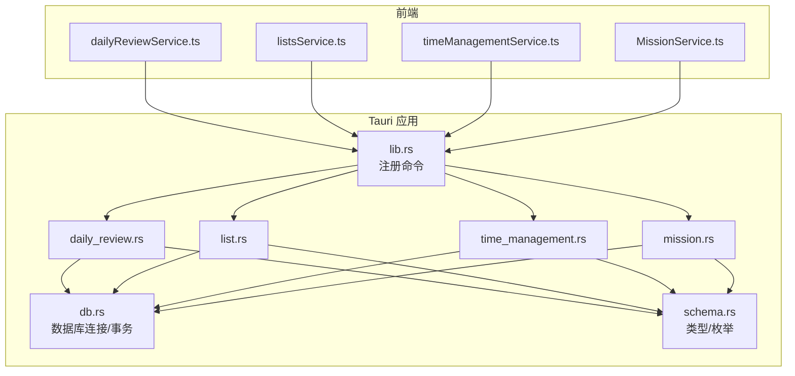
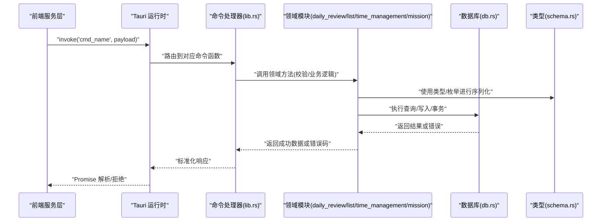
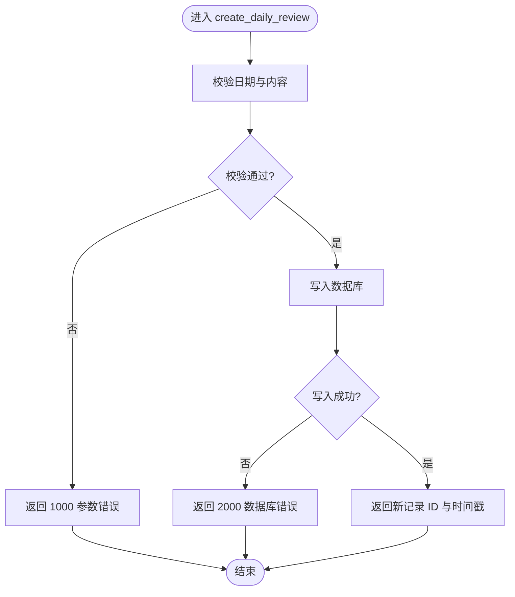
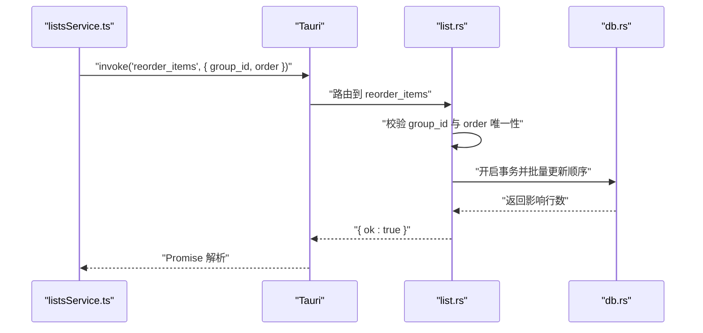
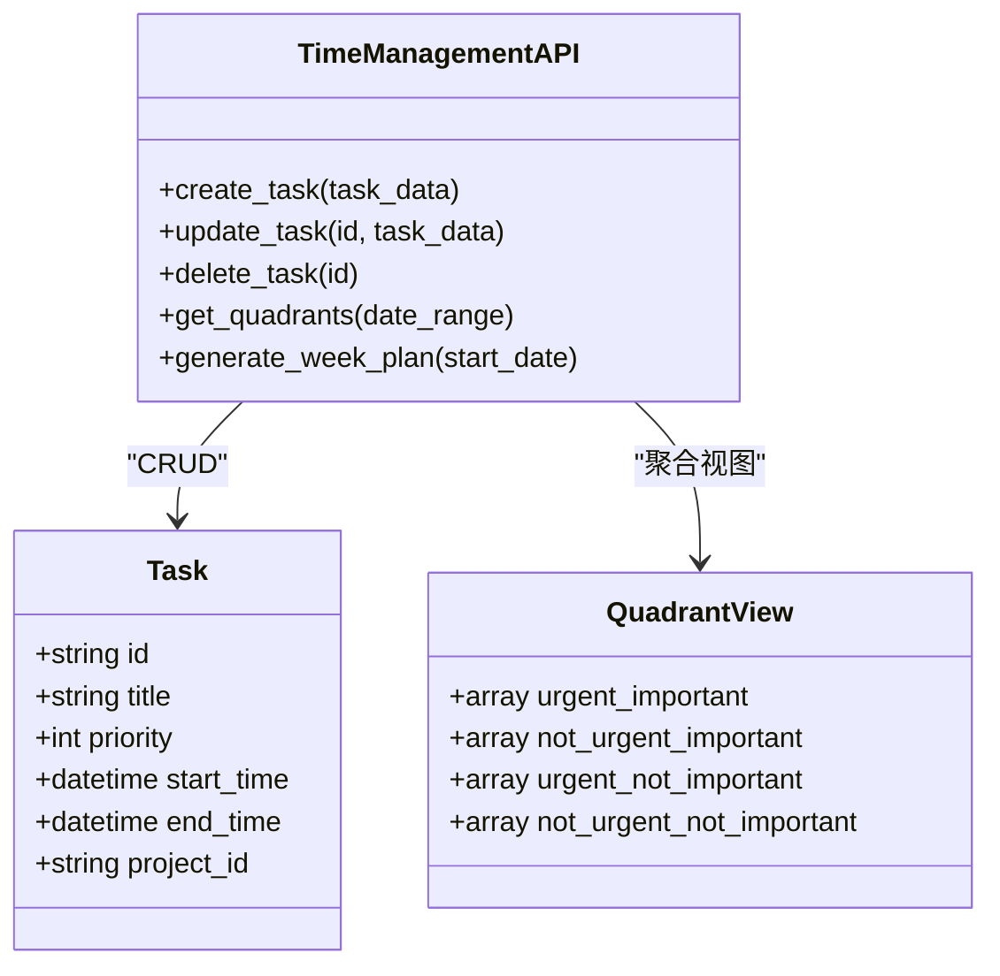
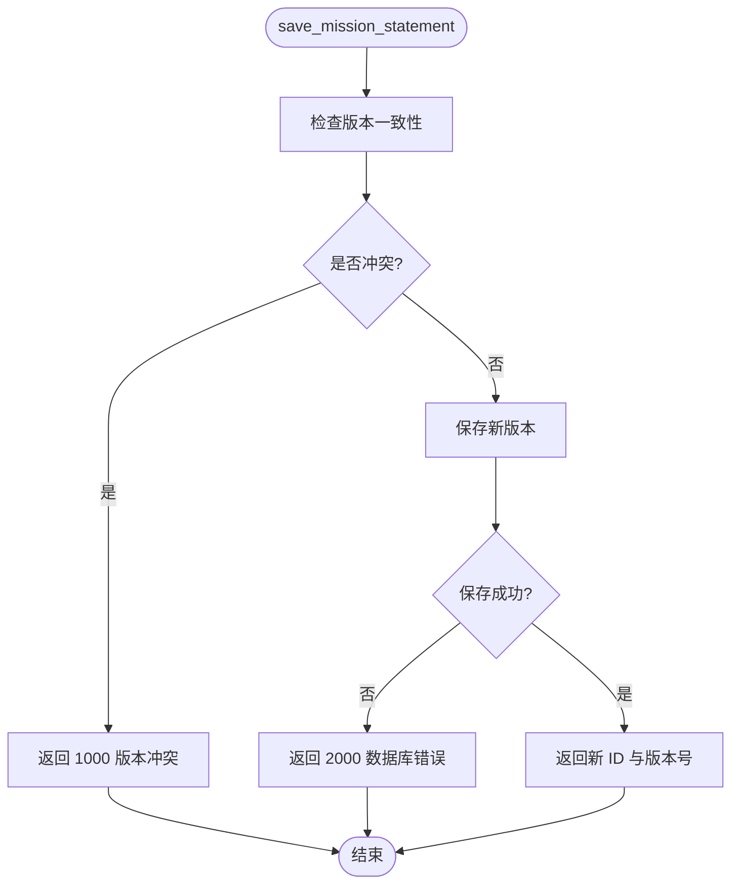
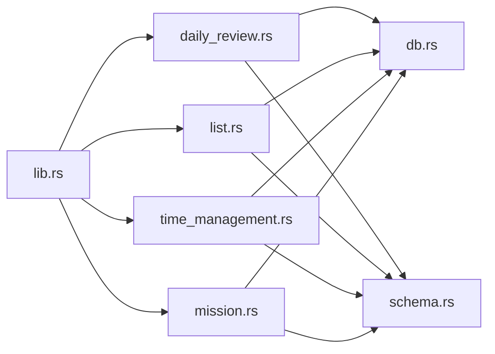

# Tauri 命令接口

<cite>
**本文引用的文件**   
- [src-tauri/src/lib.rs](file://src-tauri/src/lib.rs)
- [src-tauri/src/daily_review.rs](file://src-tauri/src/daily_review.rs)
- [src-tauri/src/list.rs](file://src-tauri/src/list.rs)
- [src-tauri/src/time_management.rs](file://src-tauri/src/time_management.rs)
- [src-tauri/src/mission.rs](file://src-tauri/src/mission.rs)
- [src-tauri/src/db.rs](file://src-tauri/src/db.rs)
- [src-tauri/src/schema.rs](file://src-tauri/src/schema.rs)
- [src-tauri/tauri.conf.json](file://src-tauri/tauri.conf.json)
- [src-tauri/capabilities/default.json](file://src-tauri/capabilities/default.json)
- [src/features/daily-review/dailyReviewService.ts](file://src/features/daily-review/dailyReviewService.ts)
- [src/features/lists/listsService.ts](file://src/features/lists/listsService.ts)
- [src/features/time-management/timeManagementService.ts](file://src/features/time-management/timeManagementService.ts)
- [src/features/mission/MissionService.ts](file://src/features/mission/MissionService.ts)
</cite>

## 目录
1. [简介](#简介)
2. [项目结构](#项目结构)
3. [核心组件](#核心组件)
4. [架构总览](#架构总览)
5. [详细组件分析](#详细组件分析)
6. [依赖关系分析](#依赖关系分析)
7. [性能考虑](#性能考虑)
8. [故障排查指南](#故障排查指南)
9. [结论](#结论)
10. [附录](#附录)

## 简介
本文件为 FishWorker 应用的 Tauri 后端命令接口文档，聚焦于以下模块：每日回顾、清单管理、时间管理、使命声明。文档覆盖 Rust 侧暴露的命令函数签名、参数与返回值约定、错误码规范、请求响应示例、权限与安全配置、异步处理模式以及性能优化建议。读者可据此在前端通过 Tauri invoke 调用后端能力，并实现一致的异常处理与用户体验。

## 项目结构
FishWorker 采用前后端分离的 Tauri 架构：前端 TypeScript 服务层通过 Tauri invoke 调用 Rust 命令；Rust 侧按功能域拆分模块（daily_review、list、time_management、mission），并通过 db 与 schema 提供数据访问与类型定义。

图表来源
- [src-tauri/src/lib.rs](file://src-tauri/src/lib.rs)
- [src-tauri/src/daily_review.rs](file://src-tauri/src/daily_review.rs)
- [src-tauri/src/list.rs](file://src-tauri/src/list.rs)
- [src-tauri/src/time_management.rs](file://src-tauri/src/time_management.rs)
- [src-tauri/src/mission.rs](file://src-tauri/src/mission.rs)
- [src-tauri/src/db.rs](file://src-tauri/src/db.rs)
- [src-tauri/src/schema.rs](file://src-tauri/src/schema.rs)

章节来源
- [src-tauri/src/lib.rs](file://src-tauri/src/lib.rs)
- [src-tauri/src/daily_review.rs](file://src-tauri/src/daily_review.rs)
- [src-tauri/src/list.rs](file://src-tauri/src/list.rs)
- [src-tauri/src/time_management.rs](file://src-tauri/src/time_management.rs)
- [src-tauri/src/mission.rs](file://src-tauri/src/mission.rs)
- [src-tauri/src/db.rs](file://src-tauri/src/db.rs)
- [src-tauri/src/schema.rs](file://src-tauri/src/schema.rs)

## 核心组件
- 命令注册中心：负责将 Rust 函数注册为 Tauri 命令，供前端 invoke 调用。
- 领域模块：每日回顾、清单、时间管理、使命声明各自提供一组命令。
- 数据访问层：统一数据库连接、查询与事务封装。
- 类型与枚举：跨模块共享的数据结构与状态枚举。

章节来源
- [src-tauri/src/lib.rs](file://src-tauri/src/lib.rs)
- [src-tauri/src/db.rs](file://src-tauri/src/db.rs)
- [src-tauri/src/schema.rs](file://src-tauri/src/schema.rs)

## 架构总览
下图展示从前端到后端的完整调用链路，包括命令分发、领域逻辑、数据访问与返回结果。

图表来源
- [src-tauri/src/lib.rs](file://src-tauri/src/lib.rs)
- [src-tauri/src/daily_review.rs](file://src-tauri/src/daily_review.rs)
- [src-tauri/src/list.rs](file://src-tauri/src/list.rs)
- [src-tauri/src/time_management.rs](file://src-tauri/src/time_management.rs)
- [src-tauri/src/mission.rs](file://src-tauri/src/mission.rs)
- [src-tauri/src/db.rs](file://src-tauri/src/db.rs)
- [src-tauri/src/schema.rs](file://src-tauri/src/schema.rs)

## 详细组件分析

### 通用约定与错误模型
- 请求格式
  - 所有命令通过 Tauri invoke 调用，参数以 JSON 对象传递。
  - 字段命名遵循驼峰式，日期时间使用 ISO 字符串。
- 响应格式
  - 成功：包含 data 字段，值为领域数据对象。
  - 失败：包含 error_code 与 message，error_code 为整数枚举，message 为人类可读描述。
- 错误码（全局）
  - 0：成功
  - 1000：参数校验失败
  - 1001：资源不存在
  - 1002：权限不足
  - 1003：重复提交/冲突
  - 2000：数据库错误
  - 2001：连接失败
  - 2002：事务失败
  - 3000：外部依赖错误（如网络/IO）
- 异步处理
  - 长耗时操作应返回“任务 ID”，并提供查询进度的命令；或直接返回 Promise，由前端等待完成。
  - 建议在领域层对 I/O 密集操作使用异步并发与批处理。

章节来源
- [src-tauri/src/schema.rs](file://src-tauri/src/schema.rs)
- [src-tauri/src/db.rs](file://src-tauri/src/db.rs)

### 每日回顾（Daily Review）
- 主要职责
  - 创建/更新/删除每日回顾条目
  - 获取指定日期的回顾内容
  - 批量导出/导入回顾数据
- 典型命令
  - create_daily_review(payload) -> { id, created_at }
  - update_daily_review(id, payload) -> { updated_at }
  - get_daily_review(date) -> { content, stats }
  - list_daily_reviews(range) -> [items]
  - export_daily_reviews(range, format) -> { file_path | stream_id }
- 参数要点
  - date 使用 ISO 日期字符串（YYYY-MM-DD）
  - range 支持 start_date 与 end_date
  - format 支持 json/csv/pdf
- 错误码
  - 1000：日期格式非法
  - 1001：未找到该日期的回顾
  - 2000：持久化失败
- 请求/响应示例
  - 请求：{ "date": "2025-01-01" }
  - 成功响应：{ "data": { "id": "uuid", "content": "...", "stats": {} } }
  - 失败响应：{ "error_code": 1001, "message": "未找到该日期的回顾" }

图表来源
- [src-tauri/src/daily_review.rs](file://src-tauri/src/daily_review.rs)
- [src-tauri/src/db.rs](file://src-tauri/src/db.rs)
- [src-tauri/src/schema.rs](file://src-tauri/src/schema.rs)

章节来源
- [src-tauri/src/daily_review.rs](file://src-tauri/src/daily_review.rs)
- [src-tauri/src/db.rs](file://src-tauri/src/db.rs)
- [src-tauri/src/schema.rs](file://src-tauri/src/schema.rs)

### 清单管理（Lists）
- 主要职责
  - 清单分组与条目的增删改查
  - 排序与批量操作
  - 模板管理与批量导出
- 典型命令
  - create_list_group(name) -> { id }
  - update_list_group(id, name) -> { updated_at }
  - delete_list_group(id) -> { success }
  - add_list_item(group_id, item_data) -> { id }
  - reorder_items(group_id, order) -> { ok }
  - batch_export(group_ids, format) -> { file_path }
- 参数要点
  - group_id 为必填
  - item_data 包含标题、描述、标签等
  - order 为有序 ID 列表
- 错误码
  - 1000：参数缺失或格式错误
  - 1001：分组不存在
  - 1003：顺序冲突（重复 ID）
  - 2000：持久化失败
- 请求/响应示例
  - 请求：{ "group_id": "gid", "order": ["id1","id2","id3"] }
  - 成功响应：{ "data": { "ok": true } }
  - 失败响应：{ "error_code": 1003, "message": "顺序冲突" }

图表来源
- [src-tauri/src/list.rs](file://src-tauri/src/list.rs)
- [src-tauri/src/db.rs](file://src-tauri/src/db.rs)

章节来源
- [src-tauri/src/list.rs](file://src-tauri/src/list.rs)
- [src-tauri/src/db.rs](file://src-tauri/src/db.rs)

### 时间管理（Time Management）
- 主要职责
  - 任务与日程的 CRUD
  - 四象限视图数据聚合
  - 周计划生成与同步
- 典型命令
  - create_task(task_data) -> { id }
  - update_task(id, task_data) -> { updated_at }
  - delete_task(id) -> { success }
  - get_quadrants(date_range) -> { quadrants }
  - generate_week_plan(start_date) -> { plan_id }
- 参数要点
  - task_data 包含标题、优先级、起止时间、所属项目等
  - date_range 支持 start_date 与 end_date
- 错误码
  - 1000：时间范围非法
  - 1001：任务不存在
  - 2000：持久化失败
- 请求/响应示例
  - 请求：{ "start_date": "2025-01-01", "end_date": "2025-01-07" }
  - 成功响应：{ "data": { "quadrants": { "urgent-important": [...], ... } } }
  - 失败响应：{ "error_code": 1000, "message": "时间范围非法" }

图表来源
- [src-tauri/src/time_management.rs](file://src-tauri/src/time_management.rs)
- [src-tauri/src/schema.rs](file://src-tauri/src/schema.rs)

章节来源
- [src-tauri/src/time_management.rs](file://src-tauri/src/time_management.rs)
- [src-tauri/src/schema.rs](file://src-tauri/src/schema.rs)

### 使命声明（Mission）
- 主要职责
  - 使命陈述的编辑与版本管理
  - 角色与目标关联
  - 导出与分享
- 典型命令
  - save_mission_statement(content, version) -> { id, version }
  - get_mission_statement(version) -> { content, version }
  - list_versions() -> [{ version, updated_at }]
  - export_mission(format) -> { file_path }
- 参数要点
  - content 支持富文本或结构化 JSON
  - version 用于乐观锁控制
- 错误码
  - 1000：版本冲突
  - 1001：未找到指定版本
  - 2000：持久化失败
- 请求/响应示例
  - 请求：{ "content": "...", "version": 3 }
  - 成功响应：{ "data": { "id": "uuid", "version": 4 } }
  - 失败响应：{ "error_code": 1000, "message": "版本冲突" }

图表来源
- [src-tauri/src/mission.rs](file://src-tauri/src/mission.rs)
- [src-tauri/src/db.rs](file://src-tauri/src/db.rs)
- [src-tauri/src/schema.rs](file://src-tauri/src/schema.rs)

章节来源
- [src-tauri/src/mission.rs](file://src-tauri/src/mission.rs)
- [src-tauri/src/db.rs](file://src-tauri/src/db.rs)
- [src-tauri/src/schema.rs](file://src-tauri/src/schema.rs)

## 依赖关系分析
- 模块耦合
  - lib.rs 作为命令注册中心，低耦合地引入各模块命令。
  - 领域模块仅依赖 db.rs 与 schema.rs，避免循环依赖。
- 外部依赖
  - 数据库驱动与连接池在 db.rs 中集中管理。
  - 文件系统 IO 用于导出文件路径返回。
- 潜在风险
  - 若命令过多且未分页，可能导致大数据量传输开销。
  - 事务粒度需合理，避免长时间持有锁。

图表来源
- [src-tauri/src/lib.rs](file://src-tauri/src/lib.rs)
- [src-tauri/src/daily_review.rs](file://src-tauri/src/daily_review.rs)
- [src-tauri/src/list.rs](file://src-tauri/src/list.rs)
- [src-tauri/src/time_management.rs](file://src-tauri/src/time_management.rs)
- [src-tauri/src/mission.rs](file://src-tauri/src/mission.rs)
- [src-tauri/src/db.rs](file://src-tauri/src/db.rs)
- [src-tauri/src/schema.rs](file://src-tauri/src/schema.rs)

章节来源
- [src-tauri/src/lib.rs](file://src-tauri/src/lib.rs)
- [src-tauri/src/db.rs](file://src-tauri/src/db.rs)
- [src-tauri/src/schema.rs](file://src-tauri/src/schema.rs)

## 性能考虑
- 批量操作
  - 对清单重排、批量导出等场景，优先使用事务与批量 SQL，减少往返次数。
- 分页与增量
  - 列表类接口默认返回分页结果，支持 cursor 或 offset+limit。
- 缓存策略
  - 对只读视图（如四象限统计）增加短期缓存，降低数据库压力。
- 并发与超时
  - 对 I/O 密集操作设置合理的超时与重试上限，避免阻塞事件循环。
- 序列化优化
  - 大对象按需字段返回，避免冗余数据传输。

[本节为通用指导，不直接分析具体文件]

## 故障排查指南
- 常见错误定位
  - 参数校验失败：检查前端传入字段类型与必填项。
  - 资源不存在：确认 ID 是否存在，或是否已被删除。
  - 数据库错误：查看 db.rs 日志与连接池状态。
- 调试建议
  - 启用 Tauri 日志输出，捕获命令入参与返回体。
  - 对事务失败场景，打印受影响行数和回滚原因。
- 恢复策略
  - 幂等设计：对写操作支持幂等键，防止重复提交导致不一致。
  - 重试机制：对瞬时错误（如连接抖动）进行有限次重试。

章节来源
- [src-tauri/src/db.rs](file://src-tauri/src/db.rs)
- [src-tauri/src/schema.rs](file://src-tauri/src/schema.rs)

## 结论
FishWorker 的 Tauri 命令接口以清晰的模块划分与统一的错误模型为基础，提供了稳定的数据访问与业务处理能力。通过规范的请求/响应约定、完善的错误码体系与合理的异步处理模式，前端可高效集成并获得一致的用户体验。后续可在分页、缓存与并发方面持续优化，以提升大规模数据场景下的性能与稳定性。

[本节为总结，不直接分析具体文件]

## 附录

### 权限配置与安全考虑
- 能力与权限
  - 通过 tauri.conf.json 与 capabilities/default.json 配置命令访问权限与系统能力。
  - 建议最小权限原则：仅开放必要命令与文件系统访问范围。
- 输入校验
  - 在后端对所有输入进行严格校验，防止注入与越权访问。
- 审计与日志
  - 对关键写操作记录审计日志，便于追踪与回溯。

章节来源
- [src-tauri/tauri.conf.json](file://src-tauri/tauri.conf.json)
- [src-tauri/capabilities/default.json](file://src-tauri/capabilities/default.json)

### 前端调用示例（路径参考）
- 每日回顾
  - [src/features/daily-review/dailyReviewService.ts](file://src/features/daily-review/dailyReviewService.ts)
- 清单管理
  - [src/features/lists/listsService.ts](file://src/features/lists/listsService.ts)
- 时间管理
  - [src/features/time-management/timeManagementService.ts](file://src/features/time-management/timeManagementService.ts)
- 使命声明
  - [src/features/mission/MissionService.ts](file://src/features/mission/MissionService.ts)

章节来源
- [src/features/daily-review/dailyReviewService.ts](file://src/features/daily-review/dailyReviewService.ts)
- [src/features/lists/listsService.ts](file://src/features/lists/listsService.ts)
- [src/features/time-management/timeManagementService.ts](file://src/features/time-management/timeManagementService.ts)
- [src/features/mission/MissionService.ts](file://src/features/mission/MissionService.ts)