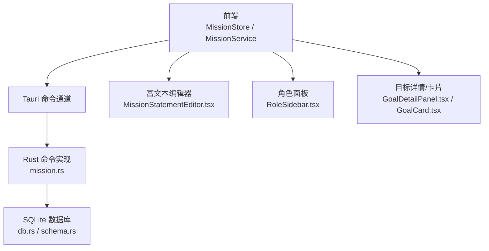
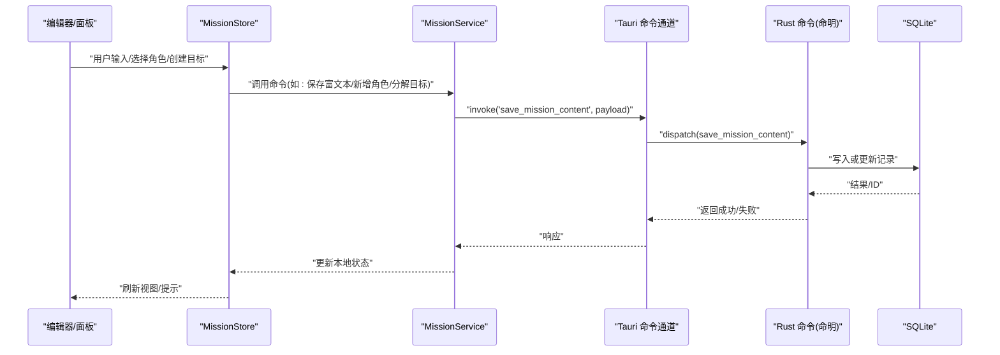
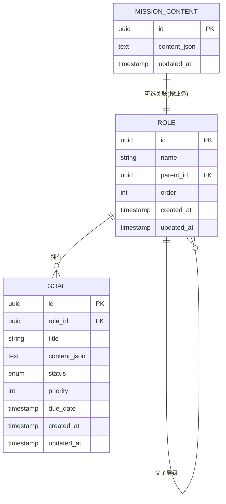
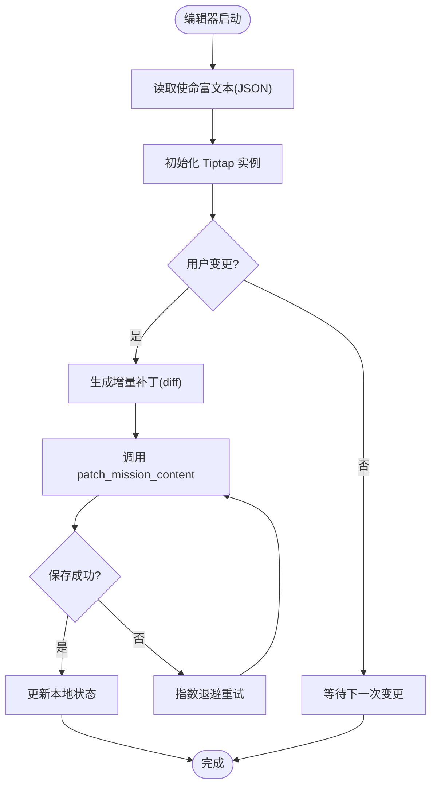
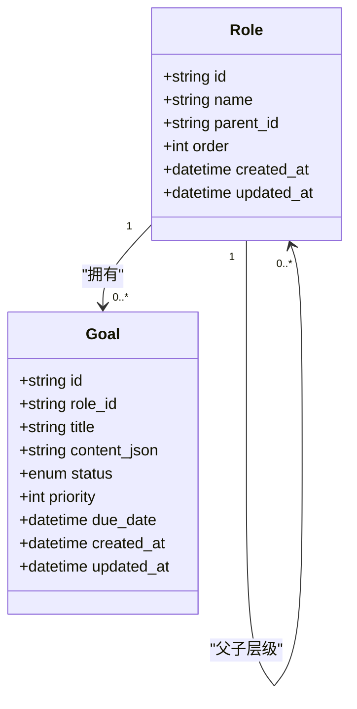
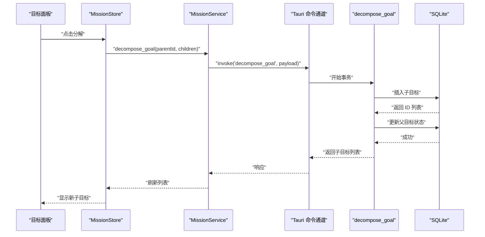
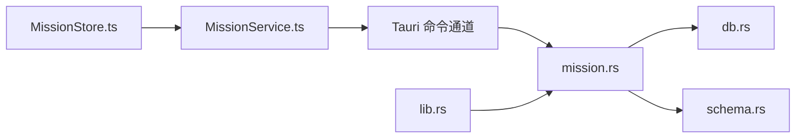

# 使命声明命令接口

<cite>
**本文引用的文件**   
- [src-tauri/src/mission.rs](file://src-tauri/src/mission.rs)
- [src-tauri/src/db.rs](file://src-tauri/src/db.rs)
- [src-tauri/src/schema.rs](file://src-tauri/src/schema.rs)
- [src-tauri/src/lib.rs](file://src-tauri/src/lib.rs)
- [src/features/mission/MissionStore.ts](file://src/features/mission/MissionStore.ts)
- [src/features/mission/MissionService.ts](file://src/features/mission/MissionService.ts)
- [src/features/mission/MissionTypes.ts](file://src/features/mission/MissionTypes.ts)
- [src/features/mission/MissionStatementEditor.tsx](file://src/features/mission/MissionStatementEditor.tsx)
- [src/features/mission/RoleSidebar.tsx](file://src/features/mission/RoleSidebar.tsx)
- [src/features/mission/GoalDetailPanel.tsx](file://src/features/mission/GoalDetailPanel.tsx)
- [src/features/mission/GoalCard.tsx](file://src/features/mission/GoalCard.tsx)
</cite>

## 目录
1. [简介](#简介)
2. [项目结构](#项目结构)
3. [核心组件](#核心组件)
4. [架构总览](#架构总览)
5. [详细组件分析](#详细组件分析)
6. [依赖关系分析](#依赖关系分析)
7. [性能考虑](#性能考虑)
8. [故障排查指南](#故障排查指南)
9. [结论](#结论)
10. [附录](#附录)

## 简介
本文件为“使命声明系统”的 Tauri 命令接口文档，聚焦角色驱动的目标管理。内容涵盖：
- 与 Rust 后端交互的命令定义、参数与返回值约定
- 富文本内容的存储格式（基于 Tiptap JSON）
- 角色层级关系与目标关联的数据模型
- 编辑器集成示例与数据同步策略
- 大文本处理优化建议

## 项目结构
前端通过 Tauri 调用 Rust 命令，Rust 侧使用 SQLite 持久化数据。关键路径如下：
- Rust 命令实现：src-tauri/src/mission.rs
- 数据库连接与迁移：src-tauri/src/db.rs、src-tauri/src/schema.rs
- Tauri 命令注册入口：src-tauri/src/lib.rs
- 前端状态与服务层：src/features/mission/*

图表来源
- [src-tauri/src/mission.rs](file://src-tauri/src/mission.rs)
- [src-tauri/src/db.rs](file://src-tauri/src/db.rs)
- [src-tauri/src/schema.rs](file://src-tauri/src/schema.rs)
- [src-tauri/src/lib.rs](file://src-tauri/src/lib.rs)
- [src/features/mission/MissionStore.ts](file://src/features/mission/MissionStore.ts)
- [src/features/mission/MissionService.ts](file://src/features/mission/MissionService.ts)
- [src/features/mission/MissionStatementEditor.tsx](file://src/features/mission/MissionStatementEditor.tsx)
- [src/features/mission/RoleSidebar.tsx](file://src/features/mission/RoleSidebar.tsx)
- [src/features/mission/GoalDetailPanel.tsx](file://src/features/mission/GoalDetailPanel.tsx)
- [src/features/mission/GoalCard.tsx](file://src/features/mission/GoalCard.tsx)

章节来源
- [src-tauri/src/mission.rs](file://src-tauri/src/mission.rs)
- [src-tauri/src/db.rs](file://src-tauri/src/db.rs)
- [src-tauri/src/schema.rs](file://src-tauri/src/schema.rs)
- [src-tauri/src/lib.rs](file://src-tauri/src/lib.rs)
- [src/features/mission/MissionStore.ts](file://src/features/mission/MissionStore.ts)
- [src/features/mission/MissionService.ts](file://src/features/mission/MissionService.ts)
- [src/features/mission/MissionStatementEditor.tsx](file://src/features/mission/MissionStatementEditor.tsx)
- [src/features/mission/RoleSidebar.tsx](file://src/features/mission/RoleSidebar.tsx)
- [src/features/mission/GoalDetailPanel.tsx](file://src/features/mission/GoalDetailPanel.tsx)
- [src/features/mission/GoalCard.tsx](file://src/features/mission/GoalCard.tsx)

## 核心组件
- 命令实现层（Rust）
  - mission.rs：暴露所有与使命声明相关的 Tauri 命令，包括富文本读写、角色增删改查、目标分解等。
  - db.rs：封装数据库连接、事务、查询执行等通用能力。
  - schema.rs：定义表结构与字段约束。
  - lib.rs：集中注册命令到 Tauri 运行时。
- 前端服务与状态
  - MissionService.ts：封装对 Tauri 命令的调用，统一错误处理与重试。
  - MissionStore.ts：维护应用状态，协调编辑、保存、同步。
  - MissionTypes.ts：前后端共享的类型定义。
- 编辑器与 UI
  - MissionStatementEditor.tsx：基于 Tiptap 的富文本编辑器，负责渲染与增量更新。
  - RoleSidebar.tsx：角色列表与层级操作。
  - GoalDetailPanel.tsx / GoalCard.tsx：目标详情与卡片展示。

章节来源
- [src-tauri/src/mission.rs](file://src-tauri/src/mission.rs)
- [src-tauri/src/db.rs](file://src-tauri/src/db.rs)
- [src-tauri/src/schema.rs](file://src-tauri/src/schema.rs)
- [src-tauri/src/lib.rs](file://src-tauri/src/lib.rs)
- [src/features/mission/MissionStore.ts](file://src/features/mission/MissionStore.ts)
- [src/features/mission/MissionService.ts](file://src/features/mission/MissionService.ts)
- [src/features/mission/MissionTypes.ts](file://src/features/mission/MissionTypes.ts)
- [src/features/mission/MissionStatementEditor.tsx](file://src/features/mission/MissionStatementEditor.tsx)
- [src/features/mission/RoleSidebar.tsx](file://src/features/mission/RoleSidebar.tsx)
- [src/features/mission/GoalDetailPanel.tsx](file://src/features/mission/GoalDetailPanel.tsx)
- [src/features/mission/GoalCard.tsx](file://src/features/mission/GoalCard.tsx)

## 架构总览
以下序列图展示了从编辑器变更到持久化的完整流程。

图表来源
- [src-tauri/src/mission.rs](file://src-tauri/src/mission.rs)
- [src-tauri/src/db.rs](file://src-tauri/src/db.rs)
- [src-tauri/src/schema.rs](file://src-tauri/src/schema.rs)
- [src-tauri/src/lib.rs](file://src-tauri/src/lib.rs)
- [src/features/mission/MissionStore.ts](file://src/features/mission/MissionStore.ts)
- [src/features/mission/MissionService.ts](file://src/features/mission/MissionService.ts)

## 详细组件分析

### 数据模型与存储格式
- 富文本内容
  - 存储格式：Tiptap JSON（JSON 字符串），包含节点与标记树结构。
  - 典型字段：根节点 children、marks、attrs 等；支持标题、段落、列表、代码块、图片、引用等。
  - 建议：在 Rust 侧以 TEXT/BLOB 类型存储；前端以 JSON 对象进行 diff 与增量更新。
- 角色与层级
  - 角色实体：id、name、parent_id、order、created_at、updated_at。
  - parent_id 表示父角色，形成树形结构；order 用于同级排序。
- 目标与分解
  - 目标实体：id、role_id、title、content_json、status、priority、due_date、created_at、updated_at。
  - content_json 为目标说明的富文本片段；status 可枚举（进行中/已完成/已取消）。
  - 分解：将父目标拆分为若干子目标，保持 role_id 一致并建立父子关系（可通过 parent_goal_id 扩展）。

图表来源
- [src-tauri/src/schema.rs](file://src-tauri/src/schema.rs)
- [src-tauri/src/db.rs](file://src-tauri/src/db.rs)

章节来源
- [src-tauri/src/schema.rs](file://src-tauri/src/schema.rs)
- [src-tauri/src/db.rs](file://src-tauri/src/db.rs)

### 命令接口清单（Rust → Tauri）
以下为与使命声明相关的命令集合（名称与参数以实际实现为准）：
- 富文本内容
  - save_mission_content：保存整篇使命声明富文本（JSON）。
  - get_mission_content：读取当前使命声明富文本（JSON）。
  - patch_mission_content：增量补丁（diff）合并，减少传输量。
- 角色管理
  - list_roles：列出角色树（含层级）。
  - create_role：新建角色（name、parent_id、order）。
  - update_role：修改角色信息（name、parent_id、order）。
  - delete_role：删除角色（级联处理目标）。
  - reorder_roles：批量重排同级顺序。
- 目标管理
  - list_goals_by_role：按角色分页获取目标列表。
  - create_goal：创建目标（title、content_json、priority、due_date）。
  - update_goal：更新目标（title、content_json、status、priority、due_date）。
  - delete_goal：删除目标。
  - decompose_goal：将目标分解为多个子目标（传入子目标数组）。
  - batch_update_goals：批量更新目标（状态、优先级等）。
- 其他
  - export_mission_data：导出角色+目标+富文本为 JSON。
  - import_mission_data：导入并合并数据（冲突策略可配置）。

注意：
- 所有命令均返回统一结构：{ ok, data?, error? }，便于前端统一处理。
- 富文本字段一律以 JSON 字符串形式传递，避免转义问题。

章节来源
- [src-tauri/src/mission.rs](file://src-tauri/src/mission.rs)
- [src-tauri/src/lib.rs](file://src-tauri/src/lib.rs)

### 编辑器集成示例（前端）
- 初始化
  - 在 MissionStore 中加载 get_mission_content，解析 JSON 并注入 Tiptap。
- 增量保存
  - 监听编辑器 onTransaction/onUpdate，生成 diff（例如使用 yjs 或自定义 diff），调用 patch_mission_content。
- 角色切换
  - 切换角色时，先缓存当前富文本，再加载对应角色的默认模板（如有）。
- 目标编辑
  - 在 GoalDetailPanel 中打开目标富文本片段，保存后触发 list_goals_by_role 刷新。

图表来源
- [src/features/mission/MissionStore.ts](file://src/features/mission/MissionStore.ts)
- [src/features/mission/MissionService.ts](file://src/features/mission/MissionService.ts)
- [src/features/mission/MissionStatementEditor.tsx](file://src/features/mission/MissionStatementEditor.tsx)

章节来源
- [src/features/mission/MissionStore.ts](file://src/features/mission/MissionStore.ts)
- [src/features/mission/MissionService.ts](file://src/features/mission/MissionService.ts)
- [src/features/mission/MissionStatementEditor.tsx](file://src/features/mission/MissionStatementEditor.tsx)

### 角色管理与层级关系
- 树形构建
  - 后端返回扁平列表，前端根据 parent_id 构建树；或使用后端聚合接口直接返回树。
- 拖拽排序
  - 前端维护 order 字段，提交 reorder_roles 批量更新。
- 级联删除
  - 删除角色时，可选择将其下目标迁移至父角色或一并删除（由命令参数控制）。

图表来源
- [src-tauri/src/schema.rs](file://src-tauri/src/schema.rs)
- [src-tauri/src/mission.rs](file://src-tauri/src/mission.rs)

章节来源
- [src-tauri/src/mission.rs](file://src-tauri/src/mission.rs)
- [src/features/mission/RoleSidebar.tsx](file://src/features/mission/RoleSidebar.tsx)

### 目标分解流程
- 输入：父目标 id、子目标数组（每个包含 title、content_json、priority、due_date）。
- 处理：开启事务，插入子目标，必要时更新父目标状态。
- 输出：返回新创建的子目标列表及父目标最新状态。

图表来源
- [src-tauri/src/mission.rs](file://src-tauri/src/mission.rs)
- [src-tauri/src/db.rs](file://src-tauri/src/db.rs)
- [src/features/mission/GoalDetailPanel.tsx](file://src/features/mission/GoalDetailPanel.tsx)

章节来源
- [src-tauri/src/mission.rs](file://src-tauri/src/mission.rs)
- [src/features/mission/GoalDetailPanel.tsx](file://src/features/mission/GoalDetailPanel.tsx)

## 依赖关系分析
- 前端依赖
  - MissionStore 依赖 MissionService 与 MissionTypes。
  - 编辑器与面板依赖 Store 提供的状态与回调。
- 后端依赖
  - mission.rs 依赖 db.rs 与 schema.rs。
  - lib.rs 集中注册命令，供 Tauri 分发。

图表来源
- [src/features/mission/MissionStore.ts](file://src/features/mission/MissionStore.ts)
- [src/features/mission/MissionService.ts](file://src/features/mission/MissionService.ts)
- [src-tauri/src/mission.rs](file://src-tauri/src/mission.rs)
- [src-tauri/src/db.rs](file://src-tauri/src/db.rs)
- [src-tauri/src/schema.rs](file://src-tauri/src/schema.rs)
- [src-tauri/src/lib.rs](file://src-tauri/src/lib.rs)

章节来源
- [src/features/mission/MissionStore.ts](file://src/features/mission/MissionStore.ts)
- [src/features/mission/MissionService.ts](file://src/features/mission/MissionService.ts)
- [src-tauri/src/mission.rs](file://src-tauri/src/mission.rs)
- [src-tauri/src/db.rs](file://src-tauri/src/db.rs)
- [src-tauri/src/schema.rs](file://src-tauri/src/schema.rs)
- [src-tauri/src/lib.rs](file://src-tauri/src/lib.rs)

## 性能考虑
- 富文本传输
  - 优先使用 patch_mission_content 增量同步，避免全量传输。
  - 对超大文档启用分片上传与断点续传（前端切块，后端合并）。
- 数据库
  - 批量操作使用事务（create/decompose/batch_update）。
  - 为常用查询字段添加索引（role_id、status、due_date）。
- 前端渲染
  - 虚拟滚动长列表（目标列表）。
  - 懒加载富文本内容（按需请求）。
- 并发与锁
  - 同一资源（如某角色下的目标）加写锁，避免竞态。
- 压缩与缓存
  - 对富文本 JSON 做 gzip 压缩（网络层）。
  - 本地缓存最近访问的角色与目标，减少重复 IO。

[本节为通用指导，不直接分析具体文件]

## 故障排查指南
- 常见问题
  - 富文本解析失败：检查 JSON 合法性与 schema 版本兼容性。
  - 角色删除后目标丢失：确认级联策略与迁移逻辑。
  - 分解目标部分失败：查看事务回滚日志与错误码。
- 定位步骤
  - 在前端增加命令调用日志（入参/出参/耗时）。
  - 在后端开启 SQL 日志与错误堆栈。
  - 对比前后端类型定义是否一致（MissionTypes.ts）。
- 恢复策略
  - 提供 export/import 工具，快速恢复数据。
  - 保留历史版本快照（按时间戳归档富文本）。

章节来源
- [src-tauri/src/mission.rs](file://src-tauri/src/mission.rs)
- [src-tauri/src/db.rs](file://src-tauri/src/db.rs)
- [src/features/mission/MissionService.ts](file://src/features/mission/MissionService.ts)

## 结论
本接口围绕“角色—目标—富文本”的核心模型，提供了完整的 CRUD 与分解能力。通过增量同步、事务与索引优化，可在保证一致性的同时提升性能。建议在后续迭代中完善版本化与审计日志，进一步提升可追溯性与容错性。

[本节为总结，不直接分析具体文件]

## 附录
- 富文本 JSON 字段参考
  - 根节点 type、content[]、marks[]、attrs{}
  - 常见节点：heading、paragraph、bullet_list、ordered_list、code_block、image、blockquote
  - 常见标记：bold、italic、link、highlight
- 命令命名规范
  - 动词_名词：save/get/list/create/update/delete/patch/decompose/export/import
- 错误码约定
  - ok=true/false；error 包含 code/message；data 为业务数据

[本节为补充说明，不直接分析具体文件]