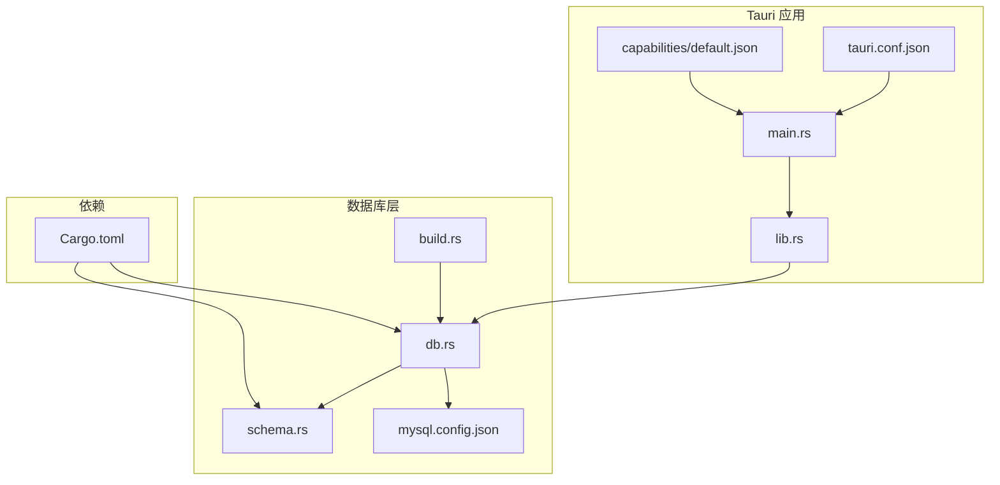
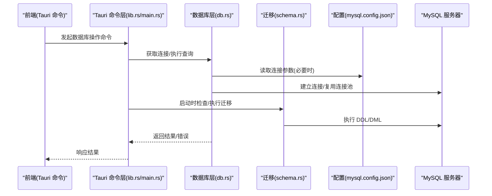
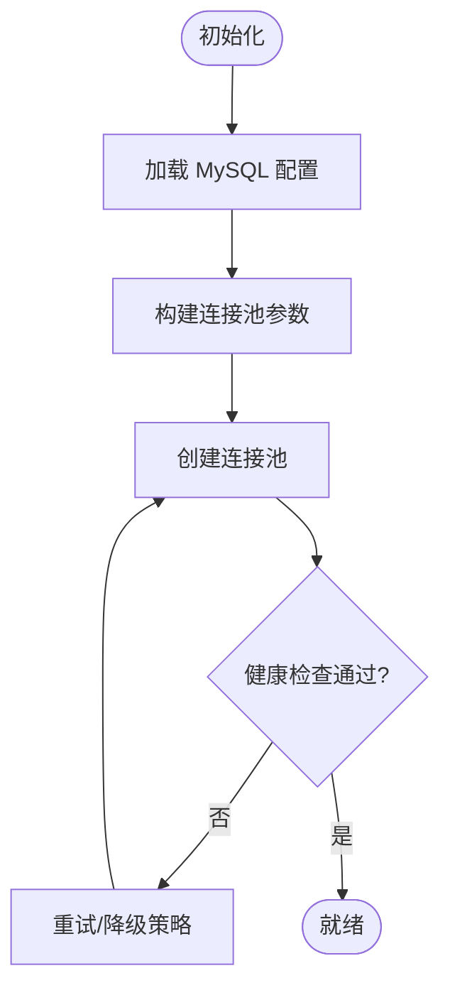
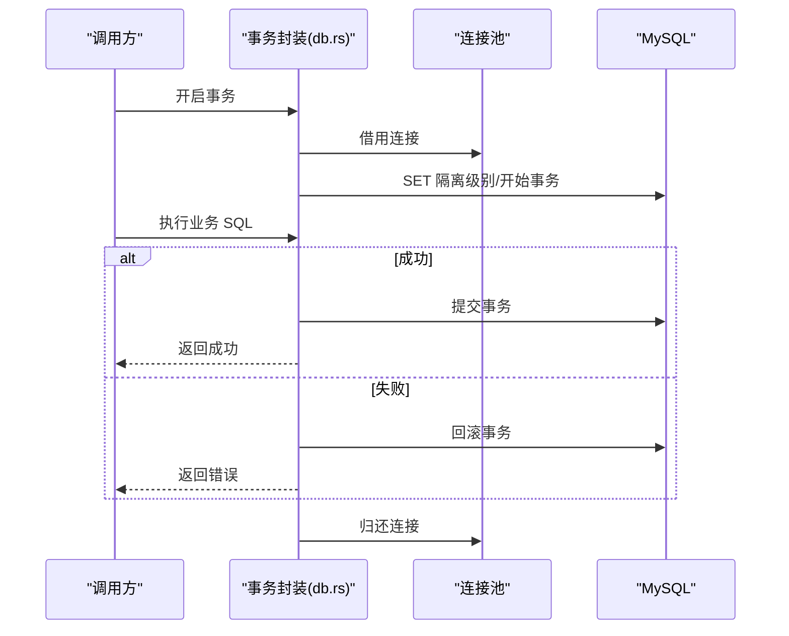
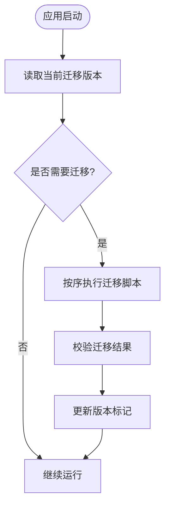
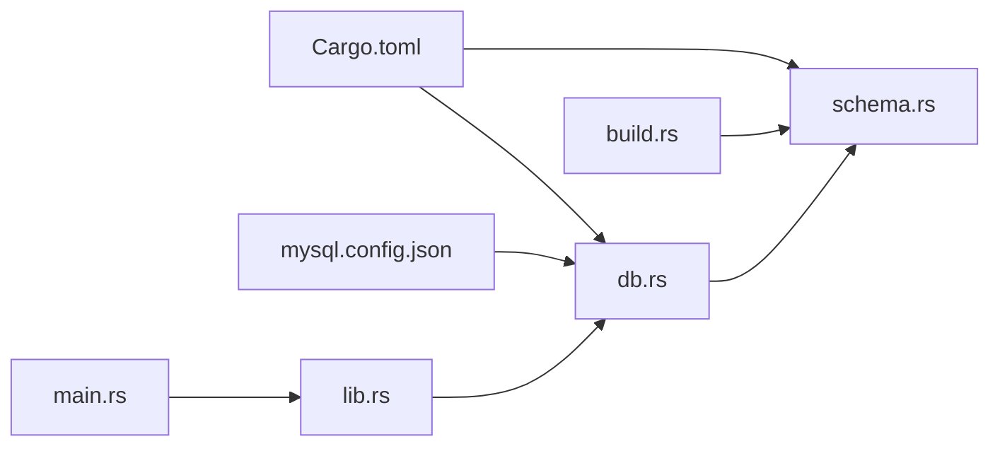

# 数据库操作命令接口

<cite>
**本文引用的文件**   
- [src-tauri/src/db.rs](file://src-tauri/src/db.rs)
- [src-tauri/src/schema.rs](file://src-tauri/src/schema.rs)
- [src-tauri/mysql.config.json](file://src-tauri/mysql.config.json)
- [src-tauri/Cargo.toml](file://src-tauri/Cargo.toml)
- [src-tauri/tauri.conf.json](file://src-tauri/tauri.conf.json)
- [src-tauri/capabilities/default.json](file://src-tauri/capabilities/default.json)
- [src-tauri/build.rs](file://src-tauri/build.rs)
- [src-tauri/src/lib.rs](file://src-tauri/src/lib.rs)
- [src-tauri/src/main.rs](file://src-tauri/src/main.rs)
</cite>

## 目录
1. [简介](#简介)
2. [项目结构](#项目结构)
3. [核心组件](#核心组件)
4. [架构总览](#架构总览)
5. [详细组件分析](#详细组件分析)
6. [依赖关系分析](#依赖关系分析)
7. [性能考虑](#性能考虑)
8. [故障排查指南](#故障排查指南)
9. [结论](#结论)
10. [附录](#附录)

## 简介
本文件面向 Tauri 后端（Rust）的数据库操作层，聚焦于 MySQL 连接、连接池管理、事务处理、数据迁移、错误恢复与备份恢复等能力。文档以“Tauri 命令接口”为视角，梳理底层 Rust 函数如何暴露给前端调用，并给出最佳实践与性能调优建议。

## 项目结构
本项目采用 Tauri + React 的前后端分离架构。数据库相关实现集中在 src-tauri 子工程中：
- 数据库连接与连接池：db.rs
- 数据模型与迁移：schema.rs
- 构建期生成与配置注入：build.rs
- Tauri 应用入口与命令注册：main.rs / lib.rs
- 运行时配置：mysql.config.json、tauri.conf.json、capabilities/default.json
- 依赖声明：Cargo.toml

图表来源
- [src-tauri/src/main.rs](file://src-tauri/src/main.rs)
- [src-tauri/src/lib.rs](file://src-tauri/src/lib.rs)
- [src-tauri/src/db.rs](file://src-tauri/src/db.rs)
- [src-tauri/src/schema.rs](file://src-tauri/src/schema.rs)
- [src-tauri/mysql.config.json](file://src-tauri/mysql.config.json)
- [src-tauri/build.rs](file://src-tauri/build.rs)
- [src-tauri/tauri.conf.json](file://src-tauri/tauri.conf.json)
- [src-tauri/capabilities/default.json](file://src-tauri/capabilities/default.json)
- [src-tauri/Cargo.toml](file://src-tauri/Cargo.toml)

章节来源
- [src-tauri/src/db.rs](file://src-tauri/src/db.rs)
- [src-tauri/src/schema.rs](file://src-tauri/src/schema.rs)
- [src-tauri/mysql.config.json](file://src-tauri/mysql.config.json)
- [src-tauri/Cargo.toml](file://src-tauri/Cargo.toml)
- [src-tauri/tauri.conf.json](file://src-tauri/tauri.conf.json)
- [src-tauri/capabilities/default.json](file://src-tauri/capabilities/default.json)
- [src-tauri/build.rs](file://src-tauri/build.rs)
- [src-tauri/src/lib.rs](file://src-tauri/src/lib.rs)
- [src-tauri/src/main.rs](file://src-tauri/src/main.rs)

## 核心组件
- 数据库连接与连接池
  - 负责初始化 MySQL 连接、维护连接池、提供可复用的连接句柄。
  - 关注点：连接参数来源、超时与重试、最大连接数、空闲回收策略。
- 事务处理
  - 封装事务开启、提交、回滚流程；支持嵌套业务边界与错误自动回滚。
  - 关注点：隔离级别设置、失败路径一致性、长事务控制。
- 数据迁移
  - 在应用启动或构建阶段执行 DDL/DML 变更，保证版本一致性与幂等性。
  - 关注点：迁移脚本顺序、回滚策略、幂等校验。
- 配置与安全
  - 从配置文件加载 MySQL 连接信息；通过权限与最小权限原则限制访问范围。
  - 关注点：敏感信息保护、环境变量注入、白名单化命令。
- 备份与恢复
  - 提供导出/导入接口，确保数据完整性与一致性。
  - 关注点：大对象处理、并发安全、断点续传与校验。

章节来源
- [src-tauri/src/db.rs](file://src-tauri/src/db.rs)
- [src-tauri/src/schema.rs](file://src-tauri/src/schema.rs)
- [src-tauri/mysql.config.json](file://src-tauri/mysql.config.json)
- [src-tauri/Cargo.toml](file://src-tauri/Cargo.toml)

## 架构总览
下图展示从前端到数据库层的调用链路，以及关键配置与迁移的参与位置。

图表来源
- [src-tauri/src/lib.rs](file://src-tauri/src/lib.rs)
- [src-tauri/src/main.rs](file://src-tauri/src/main.rs)
- [src-tauri/src/db.rs](file://src-tauri/src/db.rs)
- [src-tauri/src/schema.rs](file://src-tauri/src/schema.rs)
- [src-tauri/mysql.config.json](file://src-tauri/mysql.config.json)

## 详细组件分析

### 数据库连接与连接池（db.rs）
- 职责
  - 解析 MySQL 连接配置，创建并缓存连接池实例。
  - 提供统一的连接获取方法，供查询与写入使用。
- 关键行为
  - 连接参数来源：优先从配置文件加载，支持覆盖变量（如主机、端口、用户、密码、库名、SSL 开关）。
  - 连接池参数：最大连接数、最小空闲连接、连接超时、读写超时、心跳检测间隔。
  - 健康检查：周期性探测连接可用性，异常连接剔除。
- 错误处理
  - 连接失败：记录错误上下文，触发重试与退避策略。
  - 连接中断：自动重连，必要时重建连接池。
- 线程安全
  - 连接池全局单例或按命名空间隔离，避免竞争条件。
- 典型调用路径
  - 初始化：应用启动时完成连接池预热。
  - 请求期：按需从池中借出连接，执行后归还。

图表来源
- [src-tauri/src/db.rs](file://src-tauri/src/db.rs)
- [src-tauri/mysql.config.json](file://src-tauri/mysql.config.json)

章节来源
- [src-tauri/src/db.rs](file://src-tauri/src/db.rs)
- [src-tauri/mysql.config.json](file://src-tauri/mysql.config.json)

### 事务处理（db.rs）
- 职责
  - 封装事务生命周期：开始、提交、回滚。
  - 提供便捷 API，使上层无需关心底层细节。
- 隔离级别
  - 根据业务需求设置事务隔离级别（例如读已提交、可重复读），并在事务开始时生效。
- 错误恢复
  - 任何未捕获错误将触发回滚，确保一致性。
  - 支持部分失败时的补偿逻辑（由上层业务编排）。
- 最佳实践
  - 控制事务粒度，避免长事务。
  - 批量更新尽量合并以减少锁持有时间。
  - 对只读操作使用只读事务以提升吞吐。

图表来源
- [src-tauri/src/db.rs](file://src-tauri/src/db.rs)

章节来源
- [src-tauri/src/db.rs](file://src-tauri/src/db.rs)

### 数据迁移（schema.rs）
- 职责
  - 定义表结构与索引变更，确保多环境一致。
  - 在应用启动或构建阶段执行迁移，保证数据库版本正确。
- 迁移策略
  - 版本号管理：每个迁移带唯一标识，避免重复执行。
  - 幂等性：DDL 使用 IF NOT EXISTS 等机制，DML 使用 UPSERT 模式。
  - 回滚方案：保留反向脚本或兼容字段，便于降级。
- 执行时机
  - 构建期：通过 build.rs 预生成或校验迁移清单。
  - 运行期：首次启动或检测到版本不一致时执行。

图表来源
- [src-tauri/src/schema.rs](file://src-tauri/src/schema.rs)
- [src-tauri/build.rs](file://src-tauri/build.rs)

章节来源
- [src-tauri/src/schema.rs](file://src-tauri/src/schema.rs)
- [src-tauri/build.rs](file://src-tauri/build.rs)

### 配置与安全（mysql.config.json、tauri.conf.json、capabilities/default.json）
- 配置项
  - 连接地址、端口、用户名、密码、数据库名、SSL/TLS 开关、字符集、连接池大小等。
- 安全要点
  - 生产环境避免硬编码敏感信息，建议使用环境变量或密钥管理服务。
  - 通过 Tauri 权限模型限制命令暴露面，仅开放必要接口。
- 权限控制
  - capabilities 中声明允许的命令与资源访问范围。
  - 结合角色与最小权限原则，限制数据库账户权限。

章节来源
- [src-tauri/mysql.config.json](file://src-tauri/mysql.config.json)
- [src-tauri/tauri.conf.json](file://src-tauri/tauri.conf.json)
- [src-tauri/capabilities/default.json](file://src-tauri/capabilities/default.json)

### 依赖与构建（Cargo.toml、build.rs）
- 依赖
  - 引入 MySQL 驱动、连接池库、序列化/反序列化库、日志库等。
- 构建期
  - build.rs 可用于生成迁移清单、校验配置或嵌入静态资源。

章节来源
- [src-tauri/Cargo.toml](file://src-tauri/Cargo.toml)
- [src-tauri/build.rs](file://src-tauri/build.rs)

## 依赖关系分析
- 模块耦合
  - db.rs 依赖 mysql.config.json 的配置与 Cargo.toml 的驱动实现。
  - schema.rs 在启动或构建期与 db.rs 协作执行迁移。
  - lib.rs/main.rs 作为命令注册与调度中心，桥接前端与 db.rs。
- 外部依赖
  - MySQL 服务器、网络与 TLS 栈、系统 I/O。
- 潜在风险
  - 循环依赖需避免；配置热更新需谨慎处理连接池重建。
  - 迁移与业务代码版本需严格对齐。

图表来源
- [src-tauri/Cargo.toml](file://src-tauri/Cargo.toml)
- [src-tauri/src/db.rs](file://src-tauri/src/db.rs)
- [src-tauri/src/schema.rs](file://src-tauri/src/schema.rs)
- [src-tauri/mysql.config.json](file://src-tauri/mysql.config.json)
- [src-tauri/build.rs](file://src-tauri/build.rs)
- [src-tauri/src/lib.rs](file://src-tauri/src/lib.rs)
- [src-tauri/src/main.rs](file://src-tauri/src/main.rs)

章节来源
- [src-tauri/Cargo.toml](file://src-tauri/Cargo.toml)
- [src-tauri/src/db.rs](file://src-tauri/src/db.rs)
- [src-tauri/src/schema.rs](file://src-tauri/src/schema.rs)
- [src-tauri/mysql.config.json](file://src-tauri/mysql.config.json)
- [src-tauri/build.rs](file://src-tauri/build.rs)
- [src-tauri/src/lib.rs](file://src-tauri/src/lib.rs)
- [src-tauri/src/main.rs](file://src-tauri/src/main.rs)

## 性能考虑
- 连接池调优
  - 根据并发量调整最大连接数与最小空闲连接，避免频繁创建销毁。
  - 合理设置连接超时与读写超时，防止慢查询拖垮线程。
- 事务优化
  - 缩小事务范围，减少锁持有时间；批量操作分批提交。
  - 只读事务提升吞吐，避免不必要的写锁。
- 查询优化
  - 合理使用索引与 EXPLAIN 分析慢查询；避免 SELECT *。
  - 分页查询使用游标或基于键的分页，避免深分页。
- 迁移优化
  - 大表变更分批次进行，降低锁竞争与主从延迟。
  - 迁移脚本幂等且可回滚，缩短停机窗口。
- 监控与告警
  - 采集连接池使用率、慢查询、错误率等指标，设置阈值告警。

[本节为通用指导，不直接分析具体文件]

## 故障排查指南
- 连接失败
  - 检查 mysql.config.json 中的主机、端口、用户名、密码是否正确。
  - 确认防火墙与网络安全组放行；验证 SSL/TLS 证书链。
  - 查看连接池日志，定位是否因最大连接数耗尽导致拒绝。
- 事务异常
  - 确认事务内 SQL 是否存在死锁或长时间锁等待。
  - 检查错误码与回滚路径，确保异常分支均能回滚。
- 迁移失败
  - 核对迁移版本与目标环境一致；查看迁移脚本语法与权限。
  - 若部分成功，先清理脏状态再重试，或执行反向迁移。
- 权限问题
  - 校验数据库账户权限是否满足最小权限要求。
  - 检查 Tauri capabilities 是否限制了相应命令。

章节来源
- [src-tauri/mysql.config.json](file://src-tauri/mysql.config.json)
- [src-tauri/capabilities/default.json](file://src-tauri/capabilities/default.json)
- [src-tauri/src/db.rs](file://src-tauri/src/db.rs)
- [src-tauri/src/schema.rs](file://src-tauri/src/schema.rs)

## 结论
本数据库操作层围绕连接池、事务、迁移与配置安全展开，形成稳定可靠的底层支撑。通过合理的连接池与事务策略、幂等且可回滚的迁移方案，以及严格的权限与配置管理，可在保证一致性的同时获得良好的性能表现。建议在上线前完善监控与告警，持续优化慢查询与锁竞争问题。

[本节为总结，不直接分析具体文件]

## 附录
- 术语
  - 连接池：复用数据库连接的容器，减少握手开销。
  - 事务隔离级别：控制事务间可见性的规则集合。
  - 幂等：多次执行产生相同结果的操作。
- 参考
  - Tauri 命令注册与权限模型参见 lib.rs、main.rs、tauri.conf.json、capabilities/default.json。
  - 数据库驱动与连接池依赖参见 Cargo.toml。

[本节为补充说明，不直接分析具体文件]