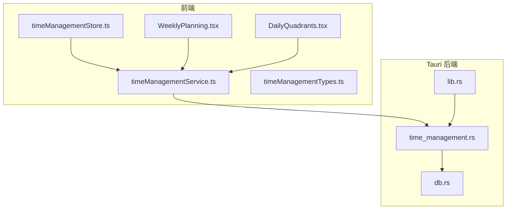
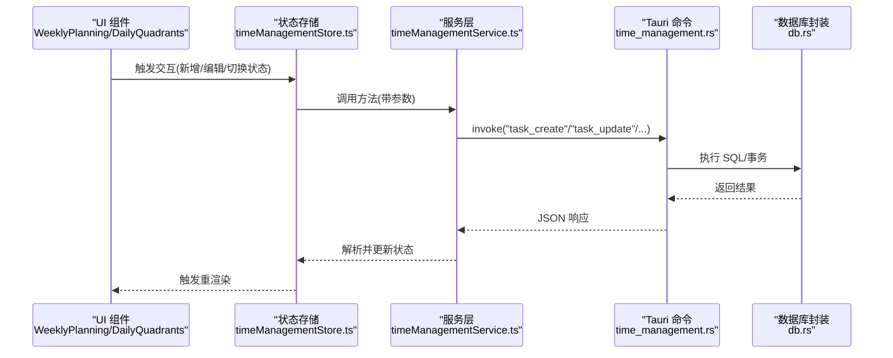
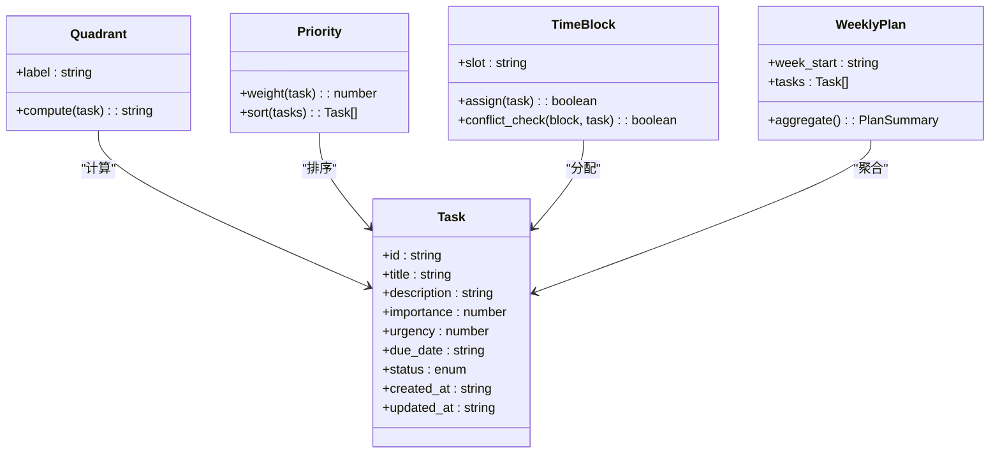
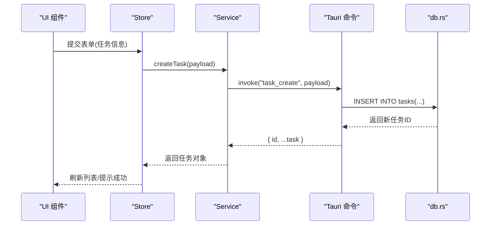
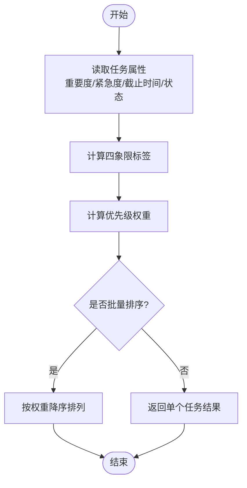
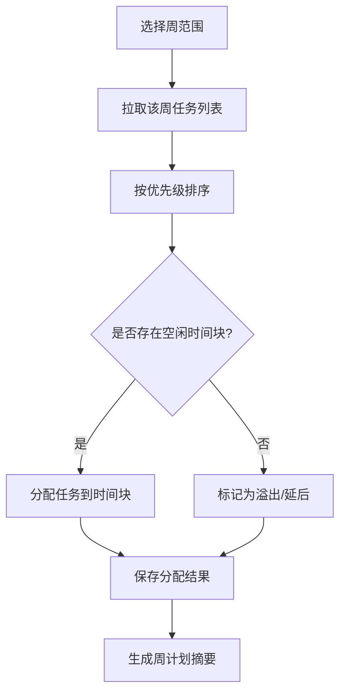
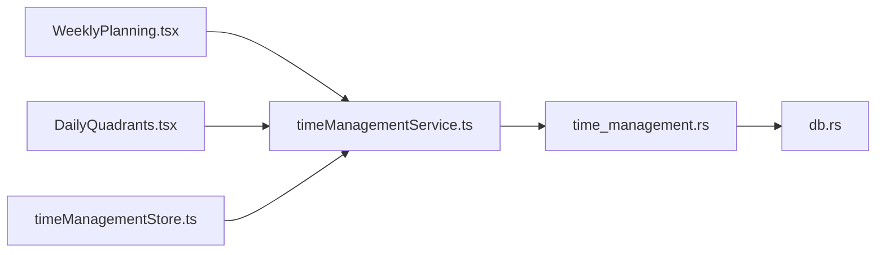

# 时间管理命令接口

<cite>
**本文引用的文件**   
- [src-tauri/src/time_management.rs](file://src-tauri/src/time_management.rs)
- [src-tauri/src/db.rs](file://src-tauri/src/db.rs)
- [src-tauri/src/lib.rs](file://src-tauri/src/lib.rs)
- [src/features/time-management/timeManagementService.ts](file://src/features/time-management/timeManagementService.ts)
- [src/features/time-management/timeManagementStore.ts](file://src/features/time-management/timeManagementStore.ts)
- [src/features/time-management/timeManagementTypes.ts](file://src/features/time-management/timeManagementTypes.ts)
- [src/features/time-management/WeeklyPlanning.tsx](file://src/features/time-management/WeeklyPlanning.tsx)
- [src/features/time-management/DailyQuadrants.tsx](file://src/features/time-management/DailyQuadrants.tsx)
</cite>

## 目录
1. [简介](#简介)
2. [项目结构](#项目结构)
3. [核心组件](#核心组件)
4. [架构总览](#架构总览)
5. [详细组件分析](#详细组件分析)
6. [依赖关系分析](#依赖关系分析)
7. [性能考虑](#性能考虑)
8. [故障排查指南](#故障排查指南)
9. [结论](#结论)
10. [附录](#附录)

## 简介
本文件为“时间管理”功能的 Tauri 命令接口文档，聚焦任务管理与周计划相关能力。内容涵盖：
- Rust 后端暴露的 Tauri 命令与数据模型
- 任务创建、更新、状态管理、四象限算法、优先级计算、时间块分配与进度跟踪的数据结构
- 前端集成示例与异步操作处理模式
- 复杂查询的性能优化建议

目标读者包括前后端开发者与产品/测试人员，力求在技术细节与可读性之间取得平衡。

## 项目结构
时间管理功能由前端特性模块与 Tauri 后端命令共同组成：
- 前端位于 src/features/time-management，包含服务层、状态存储、类型定义与 UI 组件
- 后端位于 src-tauri/src，核心命令实现集中在 time_management.rs，数据库访问封装在 db.rs，Tauri 命令注册在 lib.rs

图表来源
- [src/features/time-management/timeManagementService.ts](file://src/features/time-management/timeManagementService.ts)
- [src/features/time-management/timeManagementStore.ts](file://src/features/time-management/timeManagementStore.ts)
- [src/features/time-management/timeManagementTypes.ts](file://src/features/time-management/timeManagementTypes.ts)
- [src/features/time-management/WeeklyPlanning.tsx](file://src/features/time-management/WeeklyPlanning.tsx)
- [src/features/time-management/DailyQuadrants.tsx](file://src/features/time-management/DailyQuadrants.tsx)
- [src-tauri/src/time_management.rs](file://src-tauri/src/time_management.rs)
- [src-tauri/src/db.rs](file://src-tauri/src/db.rs)
- [src-tauri/src/lib.rs](file://src-tauri/src/lib.rs)

章节来源
- [src-tauri/src/time_management.rs](file://src-tauri/src/time_management.rs)
- [src-tauri/src/db.rs](file://src-tauri/src/db.rs)
- [src-tauri/src/lib.rs](file://src-tauri/src/lib.rs)
- [src/features/time-management/timeManagementService.ts](file://src/features/time-management/timeManagementService.ts)
- [src/features/time-management/timeManagementStore.ts](file://src/features/time-management/timeManagementStore.ts)
- [src/features/time-management/timeManagementTypes.ts](file://src/features/time-management/timeManagementTypes.ts)
- [src/features/time-management/WeeklyPlanning.tsx](file://src/features/time-management/WeeklyPlanning.tsx)
- [src/features/time-management/DailyQuadrants.tsx](file://src/features/time-management/DailyQuadrants.tsx)

## 核心组件
本节概述时间管理的关键能力与数据结构，便于快速定位后续详细分析。

- 任务实体与状态
  - 任务标识、标题、描述、优先级、重要度、紧急度、截止日期、所属日期、状态（待办/进行中/已完成/已取消）、创建与更新时间戳等
  - 状态机：新建 -> 进行中 -> 完成；或任意状态 -> 取消
- 四象限算法
  - 基于重要度与紧急度将任务划分到四个象限，用于每日视图的快速筛选与展示
- 优先级计算
  - 综合重要度、紧急度、截止时间、状态等因素生成排序权重，支持按日/周维度排序
- 时间块分配
  - 将任务映射到具体时间段（如上午/下午/晚间），结合日历视图进行可视化排程
- 进度跟踪
  - 记录任务完成比例、实际耗时、预估耗时、里程碑节点等

章节来源
- [src-tauri/src/time_management.rs](file://src-tauri/src/time_management.rs)
- [src/features/time-management/timeManagementTypes.ts](file://src/features/time-management/timeManagementTypes.ts)

## 架构总览
Tauri 命令作为前后端契约，前端通过 service 调用命令，命令内部使用 db 模块执行持久化与查询。

图表来源
- [src/features/time-management/WeeklyPlanning.tsx](file://src/features/time-management/WeeklyPlanning.tsx)
- [src/features/time-management/DailyQuadrants.tsx](file://src/features/time-management/DailyQuadrants.tsx)
- [src/features/time-management/timeManagementStore.ts](file://src/features/time-management/timeManagementStore.ts)
- [src/features/time-management/timeManagementService.ts](file://src/features/time-management/timeManagementService.ts)
- [src-tauri/src/time_management.rs](file://src-tauri/src/time_management.rs)
- [src-tauri/src/db.rs](file://src-tauri/src/db.rs)

## 详细组件分析

### Rust 后端：Tauri 命令与数据模型
- 命令注册
  - 在 Tauri 应用初始化时注册时间管理相关命令，供前端通过 invoke 调用
- 任务命令
  - 任务创建：接收任务字段，校验必填项，写入数据库，返回新任务 ID 与完整对象
  - 任务更新：根据 ID 更新指定字段，支持批量更新与部分更新
  - 任务删除：软删除或硬删除策略（依据业务约定）
  - 任务查询：按日期范围、状态、四象限、优先级等多条件组合查询
  - 状态变更：原子更新状态，附带时间戳与审计信息
- 四象限与优先级
  - 提供计算函数，输入任务属性，输出象限标签与排序权重
- 时间块与周计划
  - 提供按周聚合的任务列表、时间块分配建议与冲突检测
- 错误处理
  - 统一错误码与消息，区分参数校验失败、数据库异常、权限不足等

章节来源
- [src-tauri/src/time_management.rs](file://src-tauri/src/time_management.rs)
- [src-tauri/src/db.rs](file://src-tauri/src/db.rs)
- [src-tauri/src/lib.rs](file://src-tauri/src/lib.rs)

#### 类图（Rust 侧概念模型）

图表来源
- [src-tauri/src/time_management.rs](file://src-tauri/src/time_management.rs)

### 前端：服务层与状态管理
- 服务层
  - 封装所有 Tauri 命令调用，提供统一的 Promise API
  - 负责请求参数序列化、响应反序列化和基础错误转换
- 状态存储
  - 维护任务列表、当前选中任务、加载状态、错误信息等
  - 提供增删改查与批量操作的副作用处理
- 类型定义
  - 明确前后端一致的数据结构，确保强类型安全

章节来源
- [src/features/time-management/timeManagementService.ts](file://src/features/time-management/timeManagementService.ts)
- [src/features/time-management/timeManagementStore.ts](file://src/features/time-management/timeManagementStore.ts)
- [src/features/time-management/timeManagementTypes.ts](file://src/features/time-management/timeManagementTypes.ts)

#### 时序图（任务创建流程）

图表来源
- [src/features/time-management/timeManagementService.ts](file://src/features/time-management/timeManagementService.ts)
- [src/features/time-management/timeManagementStore.ts](file://src/features/time-management/timeManagementStore.ts)
- [src-tauri/src/time_management.rs](file://src-tauri/src/time_management.rs)
- [src-tauri/src/db.rs](file://src-tauri/src/db.rs)

### 四象限算法与优先级计算
- 四象限规则
  - 重要度高且紧急度高：第一象限（立即做）
  - 重要度高但紧急度低：第二象限（计划做）
  - 重要度低但紧急度高：第三象限（委托做）
  - 重要度低且紧急度低：第四象限（延后做）
- 优先级权重
  - 权重 = f(重要度, 紧急度, 截止剩余时间, 状态惩罚/奖励)
  - 支持自定义系数以适配不同团队节奏
- 复杂度
  - 单任务计算 O(1)，批量排序 O(n log n)

图表来源
- [src-tauri/src/time_management.rs](file://src-tauri/src/time_management.rs)

章节来源
- [src-tauri/src/time_management.rs](file://src-tauri/src/time_management.rs)

### 时间块分配与周计划
- 时间块槽位
  - 典型槽位：上午、下午、晚间；可按小时粒度扩展
- 分配策略
  - 优先匹配高优先级任务，避免与已有任务冲突
  - 支持拖拽调整与自动重排
- 周计划聚合
  - 按周统计任务数量、完成率、时间占用分布
  - 提供下周建议与历史对比

图表来源
- [src-tauri/src/time_management.rs](file://src-tauri/src/time_management.rs)

章节来源
- [src-tauri/src/time_management.rs](file://src-tauri/src/time_management.rs)

### 前端集成示例与异步处理模式
- 基本调用
  - 通过 service 提供的 Promise API 发起命令调用
  - 使用 try/catch 捕获网络与业务错误
- 并发与重试
  - 对独立任务更新可使用 Promise.all 并行处理
  - 对幂等操作可引入指数退避重试
- 乐观更新
  - 先更新本地状态，再异步同步后端，失败时回滚
- 取消与节流
  - 对频繁搜索/过滤使用防抖
  - 长耗时操作支持 AbortController 取消

章节来源
- [src/features/time-management/timeManagementService.ts](file://src/features/time-management/timeManagementService.ts)
- [src/features/time-management/timeManagementStore.ts](file://src/features/time-management/timeManagementStore.ts)

## 依赖关系分析
- 前端依赖
  - UI 组件依赖 Store，Store 依赖 Service，Service 依赖 Tauri 命令
- 后端依赖
  - 命令模块依赖数据库封装，统一错误与日志处理
- 外部依赖
  - Tauri IPC、SQLite/MySQL（依据配置）

图表来源
- [src/features/time-management/WeeklyPlanning.tsx](file://src/features/time-management/WeeklyPlanning.tsx)
- [src/features/time-management/DailyQuadrants.tsx](file://src/features/time-management/DailyQuadrants.tsx)
- [src/features/time-management/timeManagementStore.ts](file://src/features/time-management/timeManagementStore.ts)
- [src/features/time-management/timeManagementService.ts](file://src/features/time-management/timeManagementService.ts)
- [src-tauri/src/time_management.rs](file://src-tauri/src/time_management.rs)
- [src-tauri/src/db.rs](file://src-tauri/src/db.rs)

章节来源
- [src/features/time-management/timeManagementService.ts](file://src/features/time-management/timeManagementService.ts)
- [src-tauri/src/time_management.rs](file://src-tauri/src/time_management.rs)
- [src-tauri/src/db.rs](file://src-tauri/src/db.rs)

## 性能考虑
- 数据库层面
  - 为常用查询字段建立索引（如 due_date、status、importance、urgency）
  - 分页与游标式翻页，避免一次性加载大量数据
  - 使用物化视图或汇总表缓存周/月统计指标
- 命令层
  - 批量更新采用事务包裹，减少锁竞争
  - 复杂查询拆分多步，避免超长 SQL
- 前端层
  - 虚拟滚动渲染长列表
  - 合并多次小更新为批量更新
  - 合理设置缓存与失效策略

[本节为通用指导，不直接分析具体文件]

## 故障排查指南
- 常见错误
  - 参数校验失败：检查必填字段与格式
  - 数据库连接异常：确认连接串与权限
  - 并发冲突：重试或加锁策略
- 诊断步骤
  - 查看 Tauri 命令日志与错误码
  - 复现最小用例，隔离问题域
  - 对比前后端数据结构一致性

章节来源
- [src-tauri/src/time_management.rs](file://src-tauri/src/time_management.rs)
- [src-tauri/src/db.rs](file://src-tauri/src/db.rs)

## 结论
时间管理功能通过清晰的 Tauri 命令契约与前后端分层设计，实现了任务全生命周期管理与周计划编排。四象限与优先级算法为日常决策提供了量化依据，时间块分配提升了可执行性。建议在后续迭代中持续完善索引与缓存策略，提升复杂查询性能与用户体验。

[本节为总结性内容，不直接分析具体文件]

## 附录
- 术语表
  - 四象限：按重要度与紧急度划分的任务分类
  - 时间块：一天内可分配任务的固定时段
  - 周计划：一周维度的任务聚合与排程
- 参考路径
  - 命令实现：[src-tauri/src/time_management.rs](file://src-tauri/src/time_management.rs)
  - 数据库封装：[src-tauri/src/db.rs](file://src-tauri/src/db.rs)
  - 前端服务：[src/features/time-management/timeManagementService.ts](file://src/features/time-management/timeManagementService.ts)
  - 前端类型：[src/features/time-management/timeManagementTypes.ts](file://src/features/time-management/timeManagementTypes.ts)