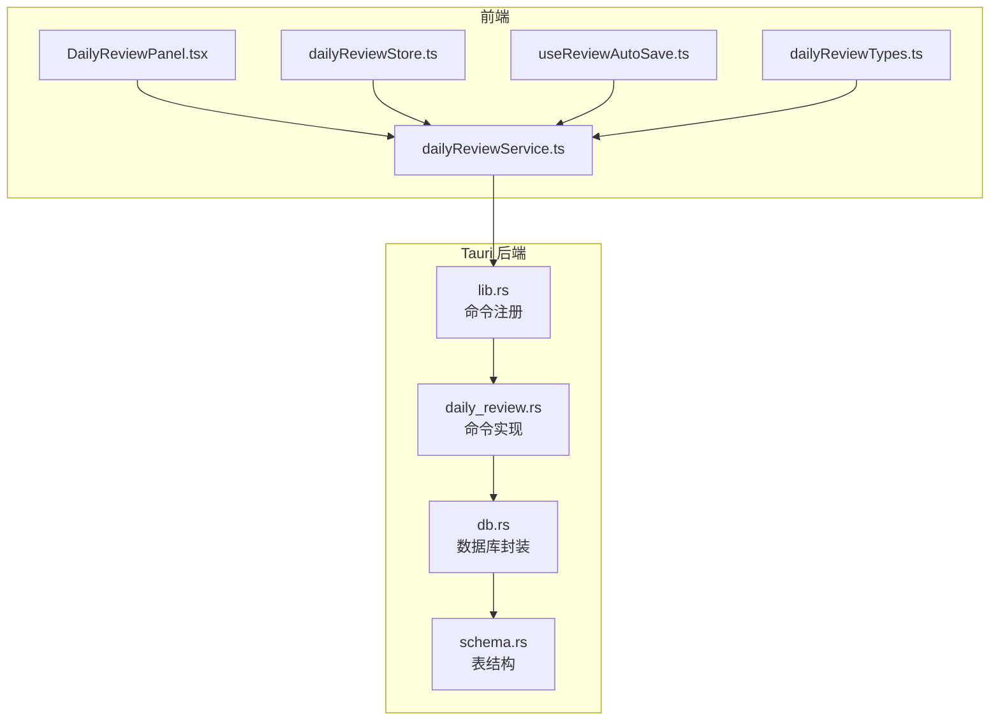
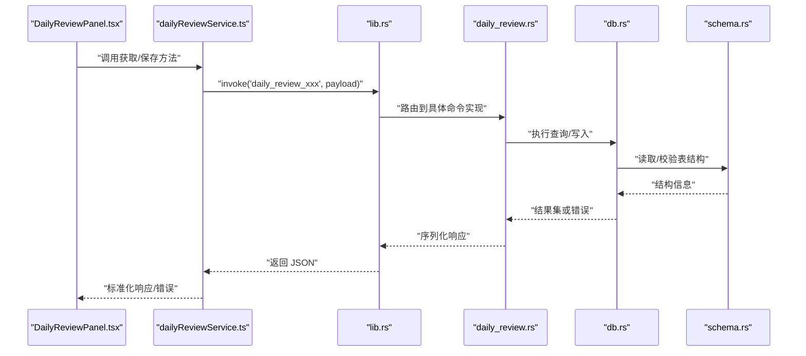
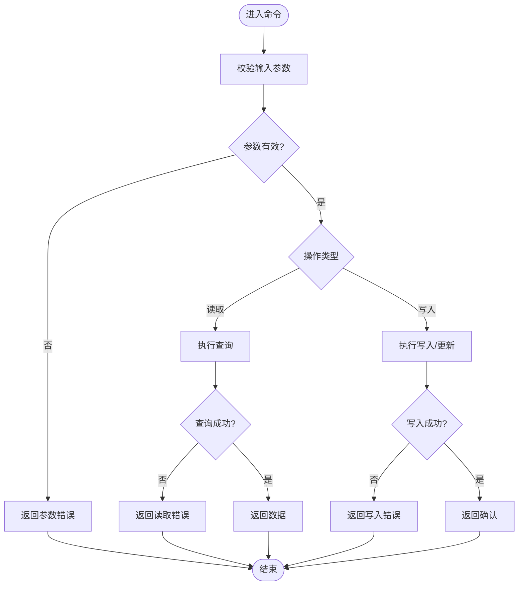
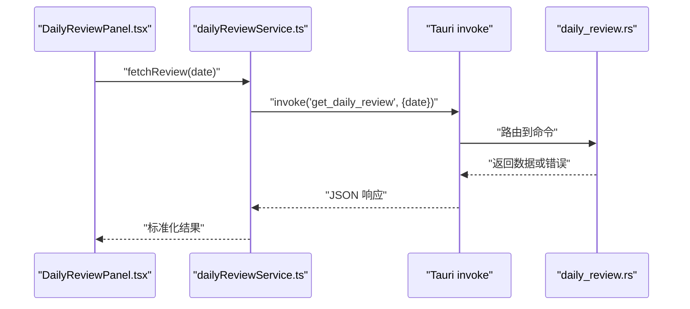
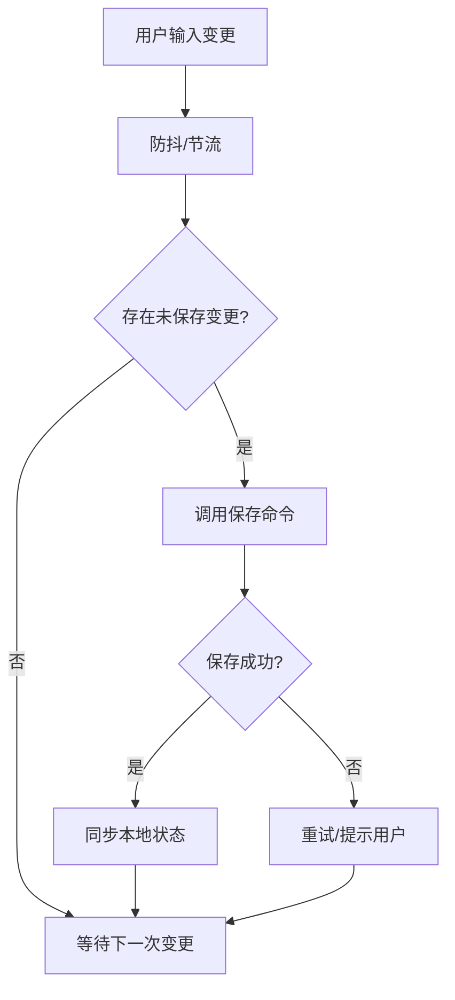
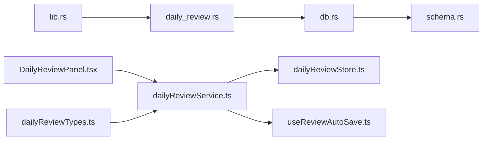

# 每日回顾命令接口

<cite>
**本文引用的文件**   
- [daily_review.rs](file://src-tauri/src/daily_review.rs)
- [lib.rs](file://src-tauri/src/lib.rs)
- [db.rs](file://src-tauri/src/db.rs)
- [schema.rs](file://src-tauri/src/schema.rs)
- [DailyReviewPanel.tsx](file://src/features/daily-review/DailyReviewPanel.tsx)
- [dailyReviewService.ts](file://src/features/daily-review/dailyReviewService.ts)
- [dailyReviewStore.ts](file://src/features/daily-review/dailyReviewStore.ts)
- [useReviewAutoSave.ts](file://src/features/daily-review/useReviewAutoSave.ts)
- [dailyReviewTypes.ts](file://src/features/daily-review/dailyReviewTypes.ts)
</cite>

## 目录
1. [简介](#简介)
2. [项目结构](#项目结构)
3. [核心组件](#核心组件)
4. [架构总览](#架构总览)
5. [详细组件分析](#详细组件分析)
6. [依赖关系分析](#依赖关系分析)
7. [性能考虑](#性能考虑)
8. [故障排查指南](#故障排查指南)
9. [结论](#结论)
10. [附录](#附录)

## 简介
本文件为“每日回顾”功能的 Tauri 命令接口文档，聚焦后端 Rust 侧暴露的命令、参数与返回结构、错误处理策略，以及前端调用示例与响应格式。同时给出数据同步策略与性能优化建议，帮助前后端开发者快速集成与稳定运行。

## 项目结构
围绕“每日回顾”功能，关键代码分布如下：
- 后端（Rust/Tauri）
  - src-tauri/src/daily_review.rs：定义并实现每日回顾相关的 Tauri 命令
  - src-tauri/src/lib.rs：注册所有 Tauri 命令入口
  - src-tauri/src/db.rs：数据库连接与通用操作封装
  - src-tauri/src/schema.rs：表结构与字段定义
- 前端（TypeScript/React）
  - features/daily-review/*：UI 面板、服务层、状态管理、自动保存 Hook 与类型定义

图表来源
- [lib.rs](file://src-tauri/src/lib.rs)
- [daily_review.rs](file://src-tauri/src/daily_review.rs)
- [db.rs](file://src-tauri/src/db.rs)
- [schema.rs](file://src-tauri/src/schema.rs)
- [DailyReviewPanel.tsx](file://src/features/daily-review/DailyReviewPanel.tsx)
- [dailyReviewService.ts](file://src/features/daily-review/dailyReviewService.ts)
- [dailyReviewStore.ts](file://src/features/daily-review/dailyReviewStore.ts)
- [useReviewAutoSave.ts](file://src/features/daily-review/useReviewAutoSave.ts)
- [dailyReviewTypes.ts](file://src/features/daily-review/dailyReviewTypes.ts)

章节来源
- [lib.rs](file://src-tauri/src/lib.rs)
- [daily_review.rs](file://src-tauri/src/daily_review.rs)
- [db.rs](file://src-tauri/src/db.rs)
- [schema.rs](file://src-tauri/src/schema.rs)
- [DailyReviewPanel.tsx](file://src/features/daily-review/DailyReviewPanel.tsx)
- [dailyReviewService.ts](file://src/features/daily-review/dailyReviewService.ts)
- [dailyReviewStore.ts](file://src/features/daily-review/dailyReviewStore.ts)
- [useReviewAutoSave.ts](file://src/features/daily-review/useReviewAutoSave.ts)
- [dailyReviewTypes.ts](file://src/features/daily-review/dailyReviewTypes.ts)

## 核心组件
- Tauri 命令注册中心
  - 负责将 Rust 函数暴露为前端可调用的命令名，统一入口位于命令注册模块。
- 每日回顾命令实现
  - 提供获取、保存、批量更新等能力；内部通过数据库封装访问持久化存储。
- 数据库封装
  - 提供连接、查询、写入等基础能力，屏蔽底层 SQL 细节。
- 表结构定义
  - 定义每日回顾相关表及字段，确保读写一致性。
- 前端服务层
  - 封装对 Tauri 命令的调用，统一请求/响应转换与错误处理。
- 前端状态管理与自动保存
  - 使用 Store 缓存本地状态，结合自动保存 Hook 实现增量/定时保存。

章节来源
- [lib.rs](file://src-tauri/src/lib.rs)
- [daily_review.rs](file://src-tauri/src/daily_review.rs)
- [db.rs](file://src-tauri/src/db.rs)
- [schema.rs](file://src-tauri/src/schema.rs)
- [dailyReviewService.ts](file://src/features/daily-review/dailyReviewService.ts)
- [dailyReviewStore.ts](file://src/features/daily-review/dailyReviewStore.ts)
- [useReviewAutoSave.ts](file://src/features/daily-review/useReviewAutoSave.ts)

## 架构总览
下图展示了从前端 UI 到后端命令再到数据库的完整调用链路。

图表来源
- [lib.rs](file://src-tauri/src/lib.rs)
- [daily_review.rs](file://src-tauri/src/daily_review.rs)
- [db.rs](file://src-tauri/src/db.rs)
- [schema.rs](file://src-tauri/src/schema.rs)
- [DailyReviewPanel.tsx](file://src/features/daily-review/DailyReviewPanel.tsx)
- [dailyReviewService.ts](file://src/features/daily-review/dailyReviewService.ts)

## 详细组件分析

### 后端命令：每日回顾（Rust/Tauri）
- 职责
  - 暴露 Tauri 命令，供前端调用以获取和保存每日回顾数据。
  - 封装业务逻辑，协调数据库读写。
- 典型命令清单（命名约定）
  - get_daily_review：按日期获取回顾内容
  - save_daily_review：保存单条回顾
  - batch_update_reviews：批量更新多条回顾
  - list_review_dates：列出有回顾数据的日期集合
- 参数与返回
  - 参数：通常为包含日期、内容等字段的 JSON 对象
  - 返回：成功时返回结构化数据（如回顾记录），失败时返回错误码与消息
- 错误处理
  - 数据库不可用/连接失败
  - 参数校验失败（如日期格式不正确）
  - 写入冲突或约束违反
  - 统一转换为前端可识别的错误对象

图表来源
- [daily_review.rs](file://src-tauri/src/daily_review.rs)
- [db.rs](file://src-tauri/src/db.rs)
- [schema.rs](file://src-tauri/src/schema.rs)

章节来源
- [daily_review.rs](file://src-tauri/src/daily_review.rs)
- [db.rs](file://src-tauri/src/db.rs)
- [schema.rs](file://src-tauri/src/schema.rs)

### 前端服务层：dailyReviewService.ts
- 职责
  - 封装对 Tauri 命令的调用，统一参数组装、响应解析与错误处理。
  - 提供面向业务的 API，如 fetchReview(date)、saveReview(payload)、batchUpdate(items)。
- 调用约定
  - 使用 invoke 调用对应命令名，传入 JSON 参数
  - 捕获并转换错误为统一结构（含 code、message、details）
- 响应格式
  - 成功：{ data, meta }
  - 失败：{ error: { code, message, details } }

图表来源
- [dailyReviewService.ts](file://src/features/daily-review/dailyReviewService.ts)
- [daily_review.rs](file://src-tauri/src/daily_review.rs)
- [DailyReviewPanel.tsx](file://src/features/daily-review/DailyReviewPanel.tsx)

章节来源
- [dailyReviewService.ts](file://src/features/daily-review/dailyReviewService.ts)
- [DailyReviewPanel.tsx](file://src/features/daily-review/DailyReviewPanel.tsx)

### 前端状态与自动保存：dailyReviewStore.ts 与 useReviewAutoSave.ts
- dailyReviewStore.ts
  - 维护当前编辑的回顾数据、加载状态、错误信息等
  - 提供 set/get 方法与副作用触发（如保存）
- useReviewAutoSave.ts
  - 基于用户输入变化或定时器触发自动保存
  - 防抖/节流避免频繁写入
  - 合并本地变更与远程状态，保证一致性

图表来源
- [useReviewAutoSave.ts](file://src/features/daily-review/useReviewAutoSave.ts)
- [dailyReviewStore.ts](file://src/features/daily-review/dailyReviewStore.ts)
- [dailyReviewService.ts](file://src/features/daily-review/dailyReviewService.ts)

章节来源
- [dailyReviewStore.ts](file://src/features/daily-review/dailyReviewStore.ts)
- [useReviewAutoSave.ts](file://src/features/daily-review/useReviewAutoSave.ts)
- [dailyReviewService.ts](file://src/features/daily-review/dailyReviewService.ts)

### 数据类型：dailyReviewTypes.ts
- 职责
  - 定义前后端共享的数据模型（如 ReviewItem、ListDatesResponse、SavePayload 等）
  - 用于 TS 类型检查与服务层参数/返回值约束
- 常见字段
  - date：日期字符串（YYYY-MM-DD）
  - content：回顾正文（文本或结构化内容）
  - updatedAt：更新时间戳
  - status：保存状态（pending/saved/error）

章节来源
- [dailyReviewTypes.ts](file://src/features/daily-review/dailyReviewTypes.ts)

## 依赖关系分析
- 命令注册与实现解耦
  - lib.rs 仅负责命令注册，具体逻辑在 daily_review.rs 中实现，便于扩展与维护。
- 数据库抽象
  - db.rs 向上层提供统一接口，屏蔽底层差异；schema.rs 集中定义表结构，降低耦合。
- 前端分层清晰
  - UI 层不直接调用 Tauri，而是通过 service 层，利于测试与复用。
  - store 与 auto-save hook 分离关注点，提升可维护性。

图表来源
- [lib.rs](file://src-tauri/src/lib.rs)
- [daily_review.rs](file://src-tauri/src/daily_review.rs)
- [db.rs](file://src-tauri/src/db.rs)
- [schema.rs](file://src-tauri/src/schema.rs)
- [DailyReviewPanel.tsx](file://src/features/daily-review/DailyReviewPanel.tsx)
- [dailyReviewService.ts](file://src/features/daily-review/dailyReviewService.ts)
- [dailyReviewStore.ts](file://src/features/daily-review/dailyReviewStore.ts)
- [useReviewAutoSave.ts](file://src/features/daily-review/useReviewAutoSave.ts)
- [dailyReviewTypes.ts](file://src/features/daily-review/dailyReviewTypes.ts)

章节来源
- [lib.rs](file://src-tauri/src/lib.rs)
- [daily_review.rs](file://src-tauri/src/daily_review.rs)
- [db.rs](file://src-tauri/src/db.rs)
- [schema.rs](file://src-tauri/src/schema.rs)
- [DailyReviewPanel.tsx](file://src/features/daily-review/DailyReviewPanel.tsx)
- [dailyReviewService.ts](file://src/features/daily-review/dailyReviewService.ts)
- [dailyReviewStore.ts](file://src/features/daily-review/dailyReviewStore.ts)
- [useReviewAutoSave.ts](file://src/features/daily-review/useReviewAutoSave.ts)
- [dailyReviewTypes.ts](file://src/features/daily-review/dailyReviewTypes.ts)

## 性能考虑
- 批量操作优先
  - 使用批量更新命令减少往返次数，适合多日回顾一次性导入/迁移场景。
- 自动保存策略
  - 采用防抖/节流控制保存频率，避免高频写入造成阻塞。
  - 仅在存在变更时触发保存，减少无效 IO。
- 并发与锁
  - 后端写入需考虑并发安全，必要时加行级锁或队列串行化。
- 缓存与预取
  - 前端可对近期日期数据进行轻量缓存，减少重复读取。
- 传输压缩
  - 大文本内容可在后端进行压缩后再返回，前端解压展示。

[本节为通用性能建议，无需特定文件引用]

## 故障排查指南
- 常见问题定位
  - 命令未注册：检查命令注册入口是否包含目标命令名
  - 参数校验失败：核对日期格式、必填字段
  - 数据库连接异常：检查连接配置与权限
  - 写入冲突：查看唯一约束与事务回滚日志
- 前端错误处理
  - 统一捕获 invoke 错误，显示友好提示并提供重试入口
  - 自动保存失败时保留草稿并提示用户手动保存
- 日志与追踪
  - 在后端关键路径添加结构化日志，便于问题复现与定位

章节来源
- [daily_review.rs](file://src-tauri/src/daily_review.rs)
- [db.rs](file://src-tauri/src/db.rs)
- [dailyReviewService.ts](file://src/features/daily-review/dailyReviewService.ts)

## 结论
通过将命令注册与实现解耦、统一错误处理与类型定义，每日回顾功能具备清晰的边界与良好的可扩展性。配合前端的自动保存与缓存策略，可实现流畅的用户体验与稳定的数据一致性。后续可按需扩展更多命令与高级特性（如版本历史、冲突合并）。

[本节为总结性内容，无需特定文件引用]

## 附录

### 前端调用示例（概念性说明）
- 获取某日回顾
  - 调用方式：service.fetchReview(date)
  - 成功响应：{ data: ReviewItem, meta: {} }
  - 失败响应：{ error: { code, message, details } }
- 保存回顾
  - 调用方式：service.saveReview({ date, content })
  - 成功响应：{ data: { ok: true }, meta: {} }
  - 失败响应：同上
- 批量更新
  - 调用方式：service.batchUpdate([{ date, content }, ...])
  - 成功响应：{ data: { updated: number }, meta: {} }
  - 失败响应：同上

[本节为概念性示例，不包含具体代码片段]