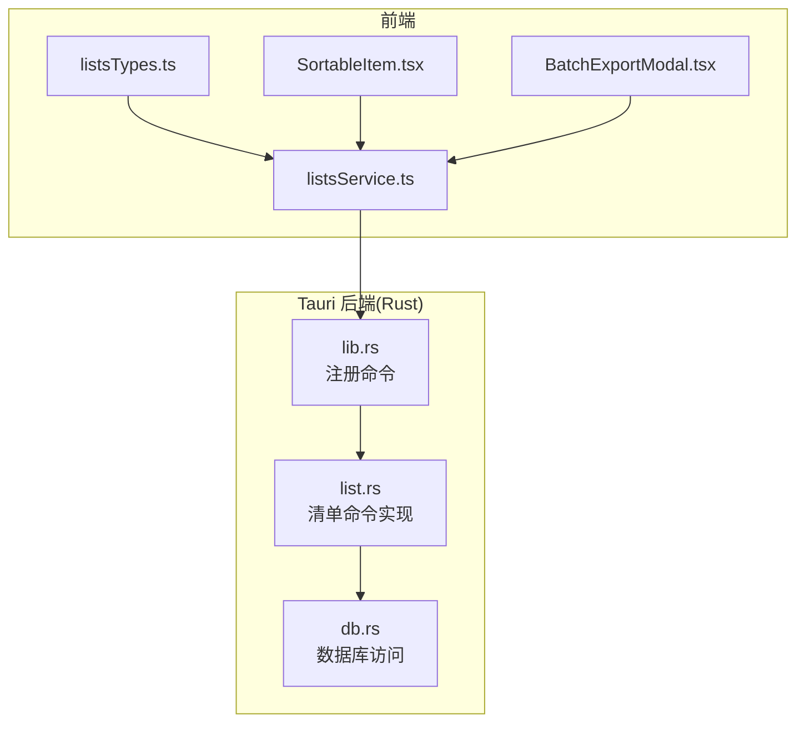
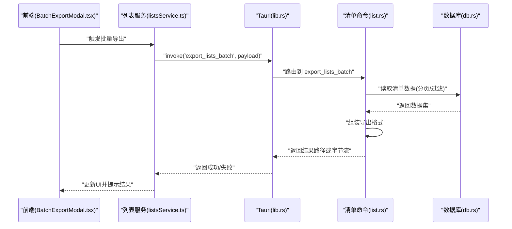
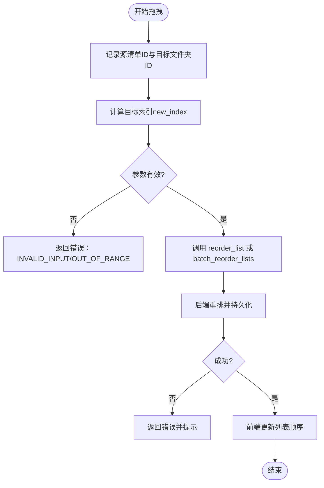
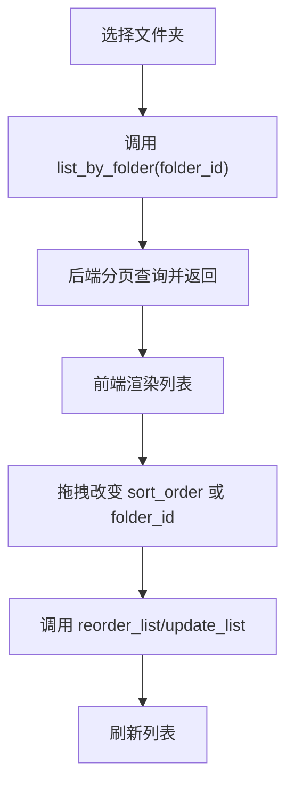
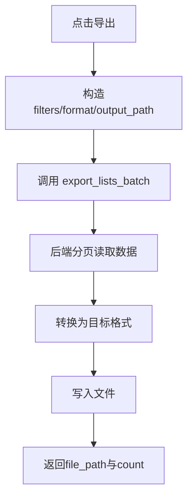
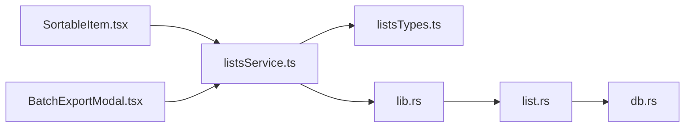

# 清单管理命令接口

<cite>
**本文引用的文件**   
- [src-tauri/src/lib.rs](file://src-tauri/src/lib.rs)
- [src-tauri/src/list.rs](file://src-tauri/src/list.rs)
- [src-tauri/src/db.rs](file://src-tauri/src/db.rs)
- [src/features/lists/listsService.ts](file://src/features/lists/listsService.ts)
- [src/features/lists/listsTypes.ts](file://src/features/lists/listsTypes.ts)
- [src/features/lists/SortableItem.tsx](file://src/features/lists/SortableItem.tsx)
- [src/features/lists/BatchExportModal.tsx](file://src/features/lists/BatchExportModal.tsx)
</cite>

## 目录
1. [简介](#简介)
2. [项目结构](#项目结构)
3. [核心组件](#核心组件)
4. [架构总览](#架构总览)
5. [详细组件分析](#详细组件分析)
6. [依赖关系分析](#依赖关系分析)
7. [性能考虑](#性能考虑)
8. [故障排查指南](#故障排查指南)
9. [结论](#结论)
10. [附录](#附录)

## 简介
本文件为“清单管理系统”的 Tauri 命令接口文档，聚焦于清单（List）相关的 Rust 后端能力与前端调用约定。内容覆盖：
- 清单的创建、删除、排序、批量导出等命令
- 拖拽排序的数据结构与交互流程
- 文件夹分类的实现方式
- 批量操作的 API 设计
- 请求/响应示例与错误处理模式
- 大数据量处理的性能优化建议

## 项目结构
清单功能涉及前后端协作：
- 前端通过 listsService.ts 调用 Tauri 命令
- Rust 侧在 lib.rs 中注册命令，list.rs 实现业务逻辑，db.rs 提供数据库访问
- 类型定义集中在 listsTypes.ts，用于前后端数据契约

图表来源
- [src-tauri/src/lib.rs](file://src-tauri/src/lib.rs)
- [src-tauri/src/list.rs](file://src-tauri/src/list.rs)
- [src-tauri/src/db.rs](file://src-tauri/src/db.rs)
- [src/features/lists/listsService.ts](file://src/features/lists/listsService.ts)
- [src/features/lists/listsTypes.ts](file://src/features/lists/listsTypes.ts)
- [src/features/lists/SortableItem.tsx](file://src/features/lists/SortableItem.tsx)
- [src/features/lists/BatchExportModal.tsx](file://src/features/lists/BatchExportModal.tsx)

章节来源
- [src-tauri/src/lib.rs](file://src-tauri/src/lib.rs)
- [src-tauri/src/list.rs](file://src-tauri/src/list.rs)
- [src-tauri/src/db.rs](file://src-tauri/src/db.rs)
- [src/features/lists/listsService.ts](file://src/features/lists/listsService.ts)
- [src/features/lists/listsTypes.ts](file://src/features/lists/listsTypes.ts)
- [src/features/lists/SortableItem.tsx](file://src/features/lists/SortableItem.tsx)
- [src/features/lists/BatchExportModal.tsx](file://src/features/lists/BatchExportModal.tsx)

## 核心组件
- Tauri 命令注册层：负责将前端调用的命令名映射到具体 Rust 函数
- 清单命令实现层：封装清单的增删改查、排序、批量导出等业务逻辑
- 数据库访问层：统一读写持久化数据
- 前端服务层：封装 Tauri 调用、参数校验、错误处理与状态更新
- 类型定义层：前后端共享的数据模型与枚举

章节来源
- [src-tauri/src/lib.rs](file://src-tauri/src/lib.rs)
- [src-tauri/src/list.rs](file://src-tauri/src/list.rs)
- [src-tauri/src/db.rs](file://src-tauri/src/db.rs)
- [src/features/lists/listsService.ts](file://src/features/lists/listsService.ts)
- [src/features/lists/listsTypes.ts](file://src/features/lists/listsTypes.ts)

## 架构总览
以下序列图展示一次“批量导出清单”的前端到后端的调用链路。

图表来源
- [src/features/lists/BatchExportModal.tsx](file://src/features/lists/BatchExportModal.tsx)
- [src/features/lists/listsService.ts](file://src/features/lists/listsService.ts)
- [src-tauri/src/lib.rs](file://src-tauri/src/lib.rs)
- [src-tauri/src/list.rs](file://src-tauri/src/list.rs)
- [src-tauri/src/db.rs](file://src-tauri/src/db.rs)

## 详细组件分析

### 清单命令接口规范
说明：以下为清单相关命令的接口约定，包含请求参数、响应字段、错误码与使用示例。所有命令均通过 Tauri invoke 调用。

- 通用约定
  - 调用入口：Tauri 命令名由前端指定，后端在命令注册层进行映射
  - 错误返回：统一以错误对象形式返回，包含 code、message、details
  - 分页参数：page、pageSize、orderBy、orderDir（如适用）
  - 事务性操作：批量写入采用事务，保证一致性

- 命令清单
  - create_list
    - 描述：创建新清单
    - 请求体：{ title, folder_id?, sort_order? }
    - 响应体：{ id, title, folder_id, sort_order, created_at, updated_at }
    - 错误码：INVALID_INPUT, DUPLICATE_TITLE, DB_ERROR
    - 示例：见“请求/响应示例”小节

  - delete_list
    - 描述：删除指定清单
    - 请求体：{ id }
    - 响应体：{ success: boolean }
    - 错误码：NOT_FOUND, DB_ERROR

  - update_list
    - 描述：更新清单元信息（标题、文件夹、排序等）
    - 请求体：{ id, title?, folder_id?, sort_order? }
    - 响应体：{ id, title, folder_id, sort_order, updated_at }
    - 错误码：NOT_FOUND, INVALID_INPUT, DB_ERROR

  - reorder_list
    - 描述：对清单进行拖拽排序（单条移动）
    - 请求体：{ id, target_folder_id?, new_index }
    - 响应体：{ ids: number[], folder_ids: number[] }
    - 错误码：OUT_OF_RANGE, DB_ERROR
    - 说明：new_index 为目标位置索引；target_folder_id 为空表示当前文件夹内排序

  - batch_reorder_lists
    - 描述：批量调整多个清单的顺序（支持跨文件夹）
    - 请求体：{ moves: Array<{ id, target_folder_id?, new_index }> }
    - 响应体：{ ids: number[], folder_ids: number[] }
    - 错误码：INVALID_MOVE, OUT_OF_RANGE, DB_ERROR

  - list_by_folder
    - 描述：按文件夹获取清单列表（支持分页与排序）
    - 请求体：{ folder_id, page, pageSize, orderBy?, orderDir? }
    - 响应体：{ items: List[], total, page, pageSize }
    - 错误码：DB_ERROR

  - export_lists_batch
    - 描述：批量导出清单（支持筛选条件与分页）
    - 请求体：{ filters?: { folder_id?, keyword? }, format?: "json"|"csv", output_path? }
    - 响应体：{ file_path: string, count: number }
    - 错误码：IO_ERROR, DB_ERROR, INVALID_FORMAT

- 请求/响应示例（文本示意）
  - 创建清单
    - 请求：{ "title": "工作清单", "folder_id": 1, "sort_order": 0 }
    - 响应：{ "id": 101, "title": "工作清单", "folder_id": 1, "sort_order": 0, "created_at": "...", "updated_at": "..." }
  - 删除清单
    - 请求：{ "id": 101 }
    - 响应：{ "success": true }
  - 拖拽排序
    - 请求：{ "id": 101, "target_folder_id": 1, "new_index": 2 }
    - 响应：{ "ids": [101, 102, 103], "folder_ids": [1] }
  - 批量导出
    - 请求：{ "filters": { "folder_id": 1, "keyword": "重要" }, "format": "json", "output_path": "/tmp/export.json" }
    - 响应：{ "file_path": "/tmp/export.json", "count": 120 }

- 错误处理模式
  - 统一错误对象：{ code: string, message: string, details?: any }
  - 常见错误码：
    - INVALID_INPUT：输入校验失败
    - NOT_FOUND：资源不存在
    - DUPLICATE_TITLE：标题重复
    - OUT_OF_RANGE：索引越界
    - INVALID_MOVE：批量移动非法
    - DB_ERROR：数据库异常
    - IO_ERROR：文件I/O异常
  - 前端建议：根据 code 分支处理用户提示与重试策略

章节来源
- [src-tauri/src/list.rs](file://src-tauri/src/list.rs)
- [src-tauri/src/db.rs](file://src-tauri/src/db.rs)
- [src/features/lists/listsService.ts](file://src/features/lists/listsService.ts)
- [src/features/lists/listsTypes.ts](file://src/features/lists/listsTypes.ts)

### 拖拽排序数据结构与流程
- 数据结构
  - 清单项：{ id, title, folder_id, sort_order, created_at, updated_at }
  - 排序请求：{ id, target_folder_id?, new_index }
  - 批量排序请求：{ moves: Array<{ id, target_folder_id?, new_index }> }
  - 排序响应：{ ids: number[], folder_ids: number[] }

- 交互流程

图表来源
- [src/features/lists/SortableItem.tsx](file://src/features/lists/SortableItem.tsx)
- [src/features/lists/listsService.ts](file://src/features/lists/listsService.ts)
- [src-tauri/src/list.rs](file://src-tauri/src/list.rs)

章节来源
- [src/features/lists/SortableItem.tsx](file://src/features/lists/SortableItem.tsx)
- [src/features/lists/listsService.ts](file://src/features/lists/listsService.ts)
- [src-tauri/src/list.rs](file://src-tauri/src/list.rs)

### 文件夹分类实现方式
- 概念
  - 每个清单属于一个文件夹（folder_id），支持空值表示未分类
  - 列表查询可按 folder_id 过滤，支持分页与排序
- 关键命令
  - list_by_folder：按文件夹获取清单列表
  - update_list：变更清单所属文件夹
  - reorder_list / batch_reorder_lists：支持跨文件夹排序
- 数据模型
  - 清单：{ id, title, folder_id, sort_order, ... }
  - 文件夹：{ id, name, parent_id? }（若存在）
- 流程图

图表来源
- [src-tauri/src/list.rs](file://src-tauri/src/list.rs)
- [src/features/lists/listsService.ts](file://src/features/lists/listsService.ts)
- [src/features/lists/listsTypes.ts](file://src/features/lists/listsTypes.ts)

章节来源
- [src-tauri/src/list.rs](file://src-tauri/src/list.rs)
- [src/features/lists/listsService.ts](file://src/features/lists/listsService.ts)
- [src/features/lists/listsTypes.ts](file://src/features/lists/listsTypes.ts)

### 批量导出 API 设计
- 目标
  - 支持按筛选条件导出大量清单数据
  - 输出格式：JSON、CSV（可扩展）
  - 输出路径可配置，便于后续下载或归档
- 请求参数
  - filters：可选，包含 folder_id、keyword 等
  - format：导出格式
  - output_path：输出文件路径
- 响应字段
  - file_path：生成文件路径
  - count：导出条目数
- 流程图

图表来源
- [src/features/lists/BatchExportModal.tsx](file://src/features/lists/BatchExportModal.tsx)
- [src/features/lists/listsService.ts](file://src/features/lists/listsService.ts)
- [src-tauri/src/list.rs](file://src-tauri/src/list.rs)
- [src-tauri/src/db.rs](file://src-tauri/src/db.rs)

章节来源
- [src/features/lists/BatchExportModal.tsx](file://src/features/lists/BatchExportModal.tsx)
- [src/features/lists/listsService.ts](file://src/features/lists/listsService.ts)
- [src-tauri/src/list.rs](file://src-tauri/src/list.rs)
- [src-tauri/src/db.rs](file://src-tauri/src/db.rs)

## 依赖关系分析
- 前端依赖
  - listsService.ts 依赖 Tauri 命令调用与 listsTypes.ts 的类型定义
  - SortableItem.tsx 与 BatchExportModal.tsx 通过 listsService.ts 发起操作
- 后端依赖
  - lib.rs 注册命令并路由到 list.rs
  - list.rs 调用 db.rs 完成数据存取
- 耦合与内聚
  - 命令层与数据库层解耦，便于替换存储实现
  - 前端服务层集中错误处理与重试逻辑，提升健壮性

图表来源
- [src/features/lists/SortableItem.tsx](file://src/features/lists/SortableItem.tsx)
- [src/features/lists/BatchExportModal.tsx](file://src/features/lists/BatchExportModal.tsx)
- [src/features/lists/listsService.ts](file://src/features/lists/listsService.ts)
- [src/features/lists/listsTypes.ts](file://src/features/lists/listsTypes.ts)
- [src-tauri/src/lib.rs](file://src-tauri/src/lib.rs)
- [src-tauri/src/list.rs](file://src-tauri/src/list.rs)
- [src-tauri/src/db.rs](file://src-tauri/src/db.rs)

章节来源
- [src/features/lists/SortableItem.tsx](file://src/features/lists/SortableItem.tsx)
- [src/features/lists/BatchExportModal.tsx](file://src/features/lists/BatchExportModal.tsx)
- [src/features/lists/listsService.ts](file://src/features/lists/listsService.ts)
- [src/features/lists/listsTypes.ts](file://src/features/lists/listsTypes.ts)
- [src-tauri/src/lib.rs](file://src-tauri/src/lib.rs)
- [src-tauri/src/list.rs](file://src-tauri/src/list.rs)
- [src-tauri/src/db.rs](file://src-tauri/src/db.rs)

## 性能考虑
- 分页与游标
  - 列表查询默认分页，避免一次性加载过多数据
  - 大数据集导出时采用流式写入，减少内存占用
- 批量操作
  - 使用事务确保批量写入的一致性
  - 合并相邻排序变更，降低写放大
- 索引与查询优化
  - 对常用过滤字段（folder_id、sort_order）建立索引
  - 关键字搜索结合全文索引或外部搜索引擎
- 前端优化
  - 虚拟滚动渲染长列表
  - 防抖/节流拖拽事件，减少频繁请求
- 并发控制
  - 限制并发导出任务数量，避免磁盘IO瓶颈
  - 导出任务队列化，支持进度反馈

[本节为通用性能建议，不直接分析具体文件]

## 故障排查指南
- 常见问题
  - 拖拽排序无效：检查 new_index 是否越界、target_folder_id 是否正确
  - 批量导出失败：确认输出路径权限、磁盘空间与格式合法性
  - 列表加载缓慢：检查分页参数与数据库索引
- 定位步骤
  - 查看前端控制台日志与服务层错误码
  - 检查后端日志中的 DB_ERROR/IO_ERROR 详情
  - 复现最小用例，逐步缩小范围
- 恢复策略
  - 对幂等操作进行重试
  - 对非幂等操作提供补偿机制（如回滚事务）

章节来源
- [src-tauri/src/list.rs](file://src-tauri/src/list.rs)
- [src-tauri/src/db.rs](file://src-tauri/src/db.rs)
- [src/features/lists/listsService.ts](file://src/features/lists/listsService.ts)

## 结论
本接口文档明确了清单管理的 Tauri 命令约定、数据结构与交互流程，覆盖了创建、删除、排序、批量导出等核心场景。通过统一的错误处理与性能优化策略，可在大规模数据下保持稳定的用户体验。建议在实际集成中严格遵循类型定义与错误码约定，并结合监控与日志完善问题定位能力。

## 附录
- 术语
  - 清单：用户创建的待办或条目集合
  - 文件夹：清单的分类容器
  - 拖拽排序：通过拖拽调整清单顺序的操作
- 参考文件
  - 命令注册与实现：[src-tauri/src/lib.rs](file://src-tauri/src/lib.rs)、[src-tauri/src/list.rs](file://src-tauri/src/list.rs)
  - 数据库访问：[src-tauri/src/db.rs](file://src-tauri/src/db.rs)
  - 前端服务与类型：[src/features/lists/listsService.ts](file://src/features/lists/listsService.ts)、[src/features/lists/listsTypes.ts](file://src/features/lists/listsTypes.ts)
  - 交互组件：[src/features/lists/SortableItem.tsx](file://src/features/lists/SortableItem.tsx)、[src/features/lists/BatchExportModal.tsx](file://src/features/lists/BatchExportModal.tsx)