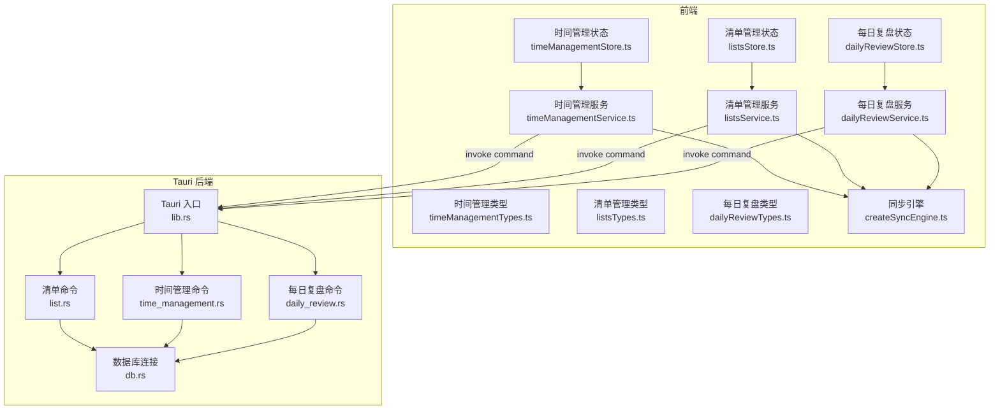
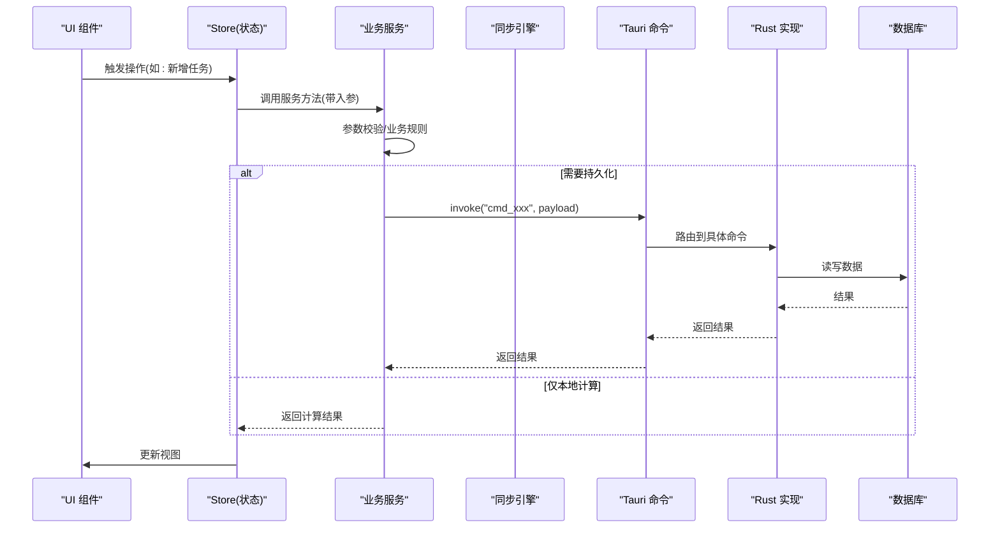
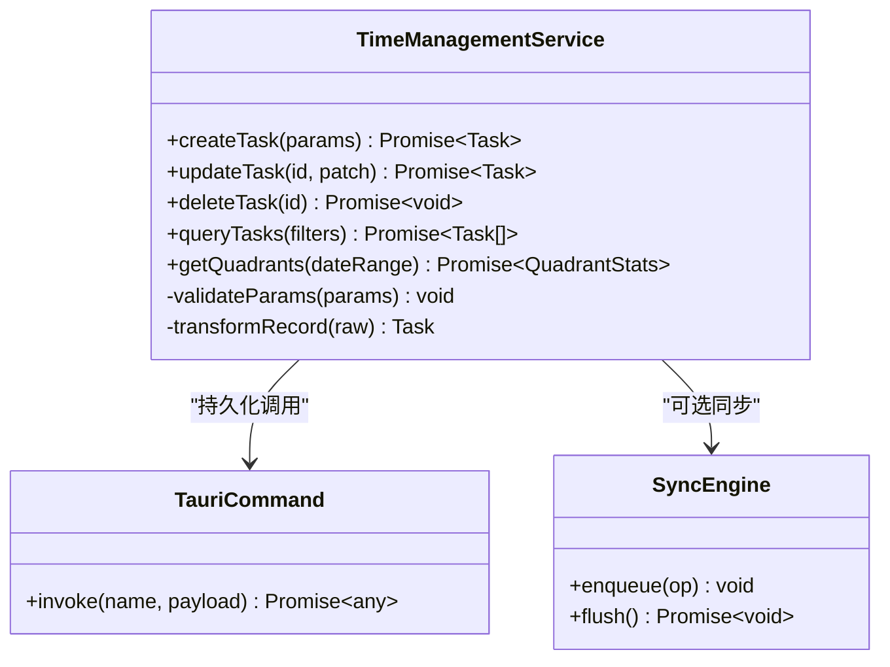
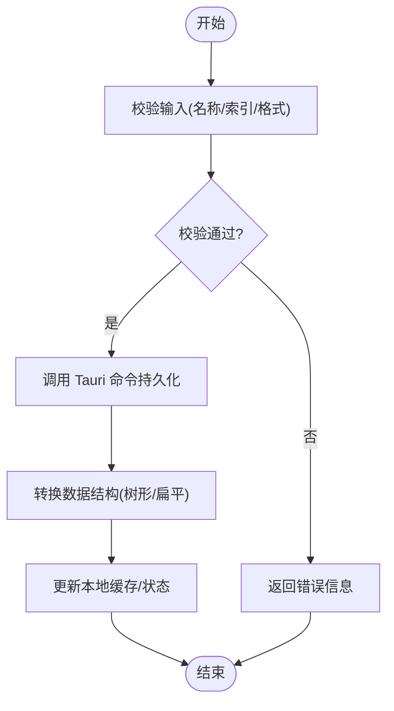
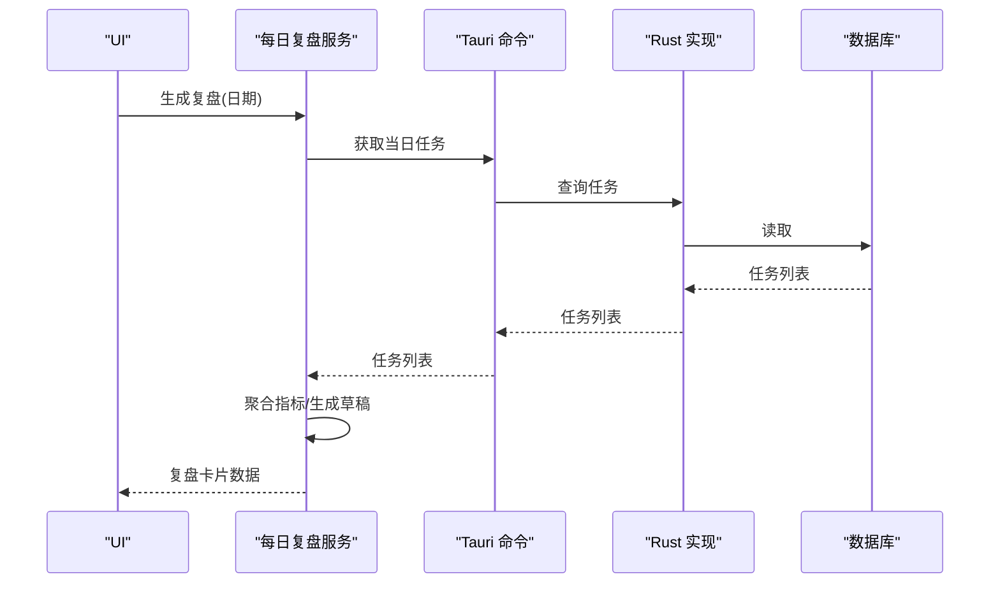
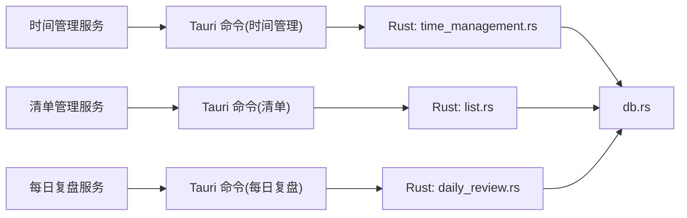

# 业务服务 API

<cite>
**本文引用的文件**   
- [src/features/time-management/timeManagementService.ts](file://src/features/time-management/timeManagementService.ts)
- [src/features/time-management/timeManagementStore.ts](file://src/features/time-management/timeManagementStore.ts)
- [src/features/time-management/timeManagementTypes.ts](file://src/features/time-management/timeManagementTypes.ts)
- [src/features/lists/listsService.ts](file://src/features/lists/listsService.ts)
- [src/features/lists/listsStore.ts](file://src/features/lists/listsStore.ts)
- [src/features/lists/listsTypes.ts](file://src/features/lists/listsTypes.ts)
- [src/features/daily-review/dailyReviewService.ts](file://src/features/daily-review/dailyReviewService.ts)
- [src/features/daily-review/dailyReviewStore.ts](file://src/features/daily-review/dailyReviewStore.ts)
- [src/features/daily-review/dailyReviewTypes.ts](file://src/features/daily-review/dailyReviewTypes.ts)
- [src/lib/createSyncEngine.ts](file://src/lib/createSyncEngine.ts)
- [src-tauri/src/db.rs](file://src-tauri/src/db.rs)
- [src-tauri/src/list.rs](file://src-tauri/src/list.rs)
- [src-tauri/src/time_management.rs](file://src-tauri/src/time_management.rs)
- [src-tauri/src/daily_review.rs](file://src-tauri/src/daily_review.rs)
- [src-tauri/src/lib.rs](file://src-tauri/src/lib.rs)
</cite>

## 目录
1. [简介](#简介)
2. [项目结构](#项目结构)
3. [核心组件](#核心组件)
4. [架构总览](#架构总览)
5. [详细组件分析](#详细组件分析)
6. [依赖关系分析](#依赖关系分析)
7. [性能考虑](#性能考虑)
8. [故障排查指南](#故障排查指南)
9. [结论](#结论)
10. [附录](#附录)

## 简介
本文件为 FishWorker 的业务服务层 API 文档，聚焦于前端业务服务（TypeScript）与 Tauri 后端（Rust）之间的协作。内容涵盖：
- 业务逻辑封装的服务接口：数据验证、业务规则处理、流程编排
- 服务的依赖注入方式、错误处理策略与数据转换逻辑
- 完整的接口定义、参数验证规则与返回值格式
- 服务组合模式、中间件使用与性能监控方法
- 与底层存储和外部系统的集成方式（Tauri + Rust + SQLite/MySQL）

## 项目结构
FishWorker 采用“特性域”组织前端代码，每个特性包含 UI、状态管理、服务层与类型定义；后端通过 Tauri 暴露命令，由 Rust 模块负责持久化与跨进程通信。

图表来源
- [src/features/time-management/timeManagementService.ts](file://src/features/time-management/timeManagementService.ts)
- [src/features/time-management/timeManagementStore.ts](file://src/features/time-management/timeManagementStore.ts)
- [src/features/time-management/timeManagementTypes.ts](file://src/features/time-management/timeManagementTypes.ts)
- [src/features/lists/listsService.ts](file://src/features/lists/listsService.ts)
- [src/features/lists/listsStore.ts](file://src/features/lists/listsStore.ts)
- [src/features/lists/listsTypes.ts](file://src/features/lists/listsTypes.ts)
- [src/features/daily-review/dailyReviewService.ts](file://src/features/daily-review/dailyReviewService.ts)
- [src/features/daily-review/dailyReviewStore.ts](file://src/features/daily-review/dailyReviewStore.ts)
- [src/features/daily-review/dailyReviewTypes.ts](file://src/features/daily-review/dailyReviewTypes.ts)
- [src/lib/createSyncEngine.ts](file://src/lib/createSyncEngine.ts)
- [src-tauri/src/lib.rs](file://src-tauri/src/lib.rs)
- [src-tauri/src/db.rs](file://src-tauri/src/db.rs)
- [src-tauri/src/list.rs](file://src-tauri/src/list.rs)
- [src-tauri/src/time_management.rs](file://src-tauri/src/time_management.rs)
- [src-tauri/src/daily_review.rs](file://src-tauri/src/daily_review.rs)

章节来源
- [src/features/time-management/timeManagementService.ts](file://src/features/time-management/timeManagementService.ts)
- [src/features/lists/listsService.ts](file://src/features/lists/listsService.ts)
- [src/features/daily-review/dailyReviewService.ts](file://src/features/daily-review/dailyReviewService.ts)
- [src/lib/createSyncEngine.ts](file://src/lib/createSyncEngine.ts)
- [src-tauri/src/lib.rs](file://src-tauri/src/lib.rs)

## 核心组件
本节概述三大业务服务及其职责边界与交互方式。

- 时间管理服务（Time Management Service）
  - 职责：任务创建/更新/删除、按日/周维度聚合、四象限分组、计划编排
  - 输入校验：日期范围、任务必填字段、优先级/分类枚举值
  - 输出：标准化任务对象、分页/过滤后的列表、统计摘要
  - 依赖：Tauri 命令（时间管理）、同步引擎（可选）

- 清单管理服务（Lists Service）
  - 职责：清单增删改查、排序、批量导出、模板应用
  - 输入校验：清单名称非空、条目顺序合法、导出格式有效
  - 输出：清单树形结构、条目序列、导出结果
  - 依赖：Tauri 命令（清单）、同步引擎（可选）

- 每日复盘服务（Daily Review Service）
  - 职责：生成每日复盘草稿、汇总关键指标、编辑与保存
  - 输入校验：复盘日期存在性、内容长度限制
  - 输出：复盘记录、指标卡片数据
  - 依赖：Tauri 命令（每日复盘）、同步引擎（可选）

章节来源
- [src/features/time-management/timeManagementService.ts](file://src/features/time-management/timeManagementService.ts)
- [src/features/lists/listsService.ts](file://src/features/lists/listsService.ts)
- [src/features/daily-review/dailyReviewService.ts](file://src/features/daily-review/dailyReviewService.ts)

## 架构总览
前端服务通过 Tauri 调用 Rust 命令，Rust 侧统一访问数据库。同步引擎提供可选的离线/增量同步能力。

图表来源
- [src/features/time-management/timeManagementService.ts](file://src/features/time-management/timeManagementService.ts)
- [src/features/lists/listsService.ts](file://src/features/lists/listsService.ts)
- [src/features/daily-review/dailyReviewService.ts](file://src/features/daily-review/dailyReviewService.ts)
- [src/lib/createSyncEngine.ts](file://src/lib/createSyncEngine.ts)
- [src-tauri/src/lib.rs](file://src-tauri/src/lib.rs)
- [src-tauri/src/db.rs](file://src-tauri/src/db.rs)

## 详细组件分析

### 时间管理服务（Time Management Service）
- 主要能力
  - 任务 CRUD：创建、更新、删除、批量导入
  - 查询与筛选：按日期范围、标签、优先级、完成状态
  - 聚合与统计：四象限分布、完成率、趋势
  - 流程编排：从“快速添加”到“纳入计划”的流水线
- 依赖注入
  - 通过构造函数或工厂函数注入 Tauri 命令调用器与同步引擎实例
- 数据转换
  - 将后端返回的原始记录转换为前端领域模型（规范化 ID、时间戳、枚举映射）
- 错误处理
  - 网络/IPC 异常捕获并转换为统一错误对象（含可展示消息与重试建议）
- 性能优化
  - 分页加载、按需展开详情、去抖搜索、缓存最近查询结果

图表来源
- [src/features/time-management/timeManagementService.ts](file://src/features/time-management/timeManagementService.ts)
- [src/lib/createSyncEngine.ts](file://src/lib/createSyncEngine.ts)
- [src-tauri/src/time_management.rs](file://src-tauri/src/time_management.rs)

章节来源
- [src/features/time-management/timeManagementService.ts](file://src/features/time-management/timeManagementService.ts)
- [src/features/time-management/timeManagementTypes.ts](file://src/features/time-management/timeManagementTypes.ts)
- [src-tauri/src/time_management.rs](file://src-tauri/src/time_management.rs)

#### 接口定义与参数验证（示例说明）
- 新增任务
  - 请求体字段：标题、描述、优先级、分类、计划开始/结束时间、标签等
  - 验证规则：标题非空且长度上限；时间区间合法；枚举值在允许集合内
  - 返回：任务对象（含服务端生成的 ID 与时间戳）
- 查询任务
  - 查询条件：日期范围、标签、优先级、完成状态、关键词
  - 返回：任务数组、总数、是否还有下一页
- 更新任务
  - 支持部分更新（patch），未提供的字段保持不变
  - 返回：更新后的任务对象

章节来源
- [src/features/time-management/timeManagementService.ts](file://src/features/time-management/timeManagementService.ts)
- [src/features/time-management/timeManagementTypes.ts](file://src/features/time-management/timeManagementTypes.ts)

### 清单管理服务（Lists Service）
- 主要能力
  - 清单与条目增删改查、拖拽排序、批量导出（CSV/JSON）
  - 模板应用：基于模板批量生成条目
- 依赖注入
  - 注入 Tauri 命令调用器与同步引擎
- 数据转换
  - 将后端扁平结构重组为前端树形结构（父/子关系）
- 错误处理
  - 对非法排序索引、重复名称等进行友好提示
- 性能优化
  - 大清单分页渲染、虚拟滚动（配合 UI 层）、导出异步分块

图表来源
- [src/features/lists/listsService.ts](file://src/features/lists/listsService.ts)
- [src-tauri/src/list.rs](file://src-tauri/src/list.rs)

章节来源
- [src/features/lists/listsService.ts](file://src/features/lists/listsService.ts)
- [src/features/lists/listsTypes.ts](file://src/features/lists/listsTypes.ts)
- [src-tauri/src/list.rs](file://src-tauri/src/list.rs)

#### 接口定义与参数验证（示例说明）
- 新增清单
  - 字段：名称、描述、可见性
  - 验证：名称唯一、长度限制
  - 返回：清单对象
- 批量导出
  - 参数：清单 ID 列表、导出格式
  - 返回：下载链接或二进制流（由上层处理）

章节来源
- [src/features/lists/listsService.ts](file://src/features/lists/listsService.ts)
- [src/features/lists/listsTypes.ts](file://src/features/lists/listsTypes.ts)

### 每日复盘服务（Daily Review Service）
- 主要能力
  - 根据当日任务生成复盘草稿
  - 汇总关键指标（完成率、耗时分布、重点事项）
  - 编辑与保存复盘记录
- 依赖注入
  - 注入 Tauri 命令调用器与同步引擎
- 数据转换
  - 将任务数据聚合为复盘卡片数据
- 错误处理
  - 当无任务数据时给出“无可复盘”提示
- 性能优化
  - 复用已缓存的任务数据，避免重复查询

图表来源
- [src/features/daily-review/dailyReviewService.ts](file://src/features/daily-review/dailyReviewService.ts)
- [src-tauri/src/daily_review.rs](file://src-tauri/src/daily_review.rs)

章节来源
- [src/features/daily-review/dailyReviewService.ts](file://src/features/daily-review/dailyReviewService.ts)
- [src/features/daily-review/dailyReviewTypes.ts](file://src/features/daily-review/dailyReviewTypes.ts)
- [src-tauri/src/daily_review.rs](file://src-tauri/src/daily_review.rs)

## 依赖关系分析
- 前端服务与 Tauri 命令解耦：通过统一的命令调用器抽象，便于测试与替换
- 同步引擎作为可选横切关注点：仅在开启同步时参与写入流程
- Rust 后端集中式路由：lib.rs 注册各功能命令，分别委托至 list.rs、time_management.rs、daily_review.rs
- 数据库访问集中在 db.rs：对外暴露连接与事务能力

图表来源
- [src-tauri/src/lib.rs](file://src-tauri/src/lib.rs)
- [src-tauri/src/db.rs](file://src-tauri/src/db.rs)
- [src-tauri/src/list.rs](file://src-tauri/src/list.rs)
- [src-tauri/src/time_management.rs](file://src-tauri/src/time_management.rs)
- [src-tauri/src/daily_review.rs](file://src-tauri/src/daily_review.rs)

章节来源
- [src-tauri/src/lib.rs](file://src-tauri/src/lib.rs)
- [src-tauri/src/db.rs](file://src-tauri/src/db.rs)

## 性能考虑
- 前端
  - 分页与懒加载：列表首屏只加载必要数据，滚动时按需加载
  - 去抖与节流：搜索与高频操作使用去抖/节流降低调用频率
  - 局部更新：仅变更受影响的状态节点，减少重渲染
  - 缓存：对热点查询结果进行短期缓存，结合失效策略
- 后端
  - 索引优化：对常用查询字段建立索引（如日期、标签、状态）
  - 批量操作：合并多次写入为一次事务，减少 IO 次数
  - 流式导出：大数据量导出采用流式输出，避免内存峰值

[本节为通用指导，不直接分析具体文件]

## 故障排查指南
- 常见错误分类
  - 参数校验失败：返回明确的字段级错误信息，便于定位
  - 权限/冲突：如名称重复、并发更新冲突，需提示用户重试或修正
  - 持久化失败：网络/IPC 异常、数据库不可用，应提供重试与降级策略
- 日志与追踪
  - 在服务层记录关键步骤与耗时，便于定位瓶颈
  - 在后端命令入口记录请求上下文（如用户、操作类型、时间戳）
- 恢复策略
  - 幂等设计：对写操作提供幂等键，防止重复提交导致数据不一致
  - 回滚机制：复杂流程中发生错误时回滚已变更的数据

章节来源
- [src/features/time-management/timeManagementService.ts](file://src/features/time-management/timeManagementService.ts)
- [src/features/lists/listsService.ts](file://src/features/lists/listsService.ts)
- [src/features/daily-review/dailyReviewService.ts](file://src/features/daily-review/dailyReviewService.ts)
- [src-tauri/src/db.rs](file://src-tauri/src/db.rs)

## 结论
FishWorker 的业务服务层以“特性域 + 服务 + 状态 + 类型”的方式组织，清晰分离了 UI、业务逻辑与持久化。通过 Tauri 命令与 Rust 后端对接，实现了跨进程的稳定通信；同步引擎提供了可扩展的离线/增量同步能力。建议在后续迭代中完善统一错误码体系、增强监控埋点，并对高频路径进行基准测试与压测。

[本节为总结性内容，不直接分析具体文件]

## 附录

### 服务组合模式与中间件
- 组合模式
  - 将多个小服务组合为大流程（例如：先校验 → 再持久化 → 最后触发同步）
  - 通过工厂函数或依赖注入容器装配服务实例
- 中间件
  - 日志中间件：记录进入/退出时间与参数摘要
  - 重试中间件：对瞬时错误自动重试并退避
  - 缓存中间件：读多写少场景下缓存查询结果

[本节为概念性内容，不直接分析具体文件]

### 与底层存储和外部系统集成
- 存储
  - SQLite/MySQL 通过 db.rs 统一管理连接与事务
  - 迁移与初始化脚本应在启动阶段执行
- 外部系统
  - 如需接入第三方服务，可在 Rust 命令层增加 HTTP 客户端调用，并在前端服务层做超时与熔断处理

章节来源
- [src-tauri/src/db.rs](file://src-tauri/src/db.rs)
- [src-tauri/src/lib.rs](file://src-tauri/src/lib.rs)