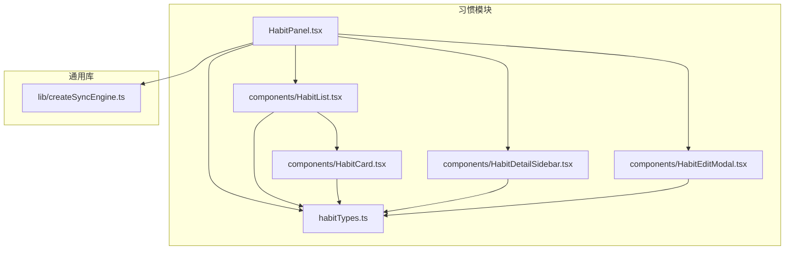
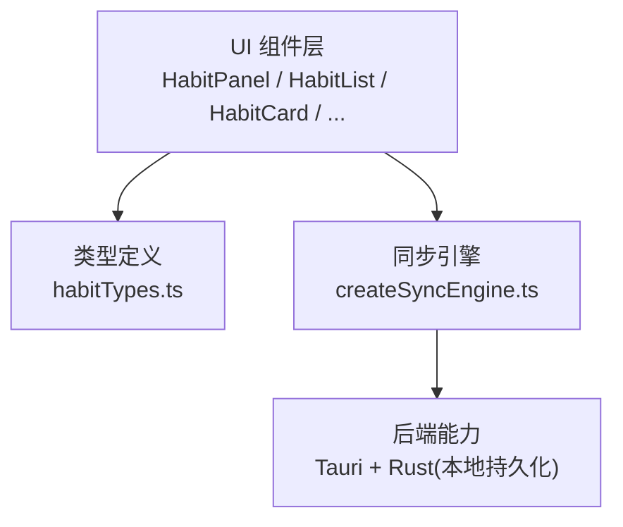
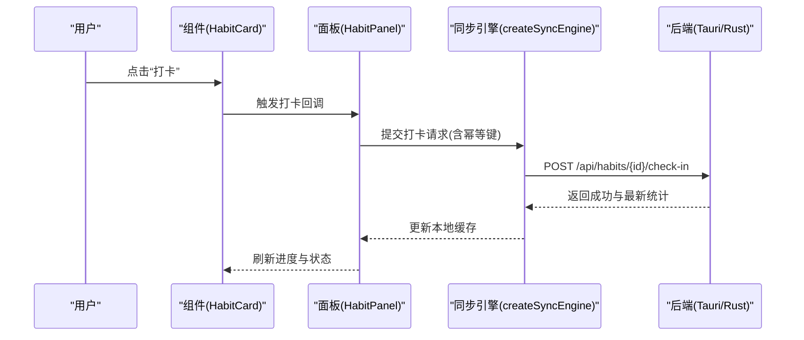
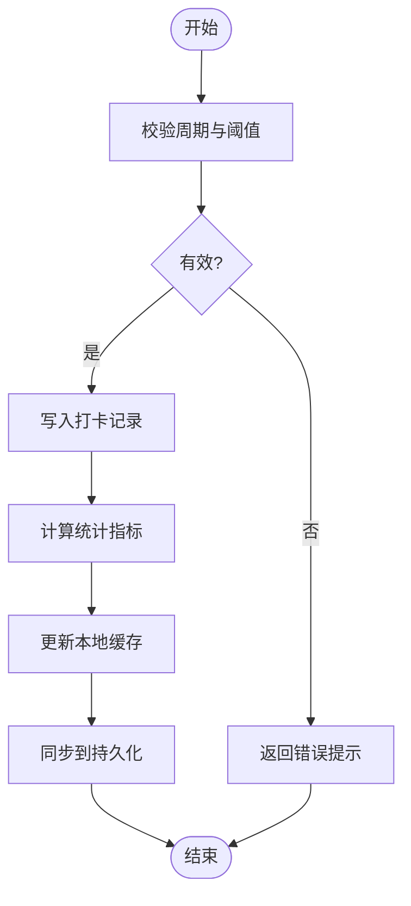
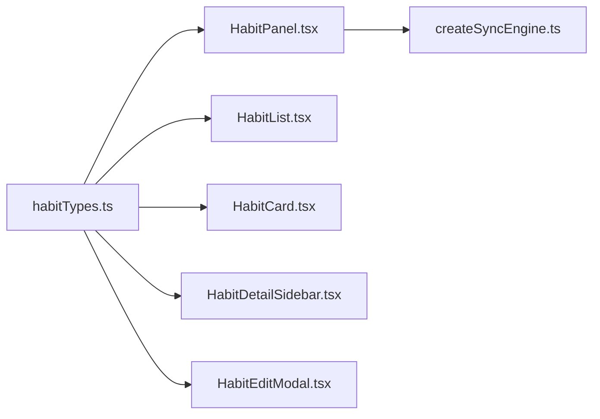

# 习惯追踪 API

<cite>
**本文引用的文件**   
- [habitTypes.ts](file://src/features/habits/habitTypes.ts)
- [HabitPanel.tsx](file://src/features/habits/HabitPanel.tsx)
- [HabitCard.tsx](file://src/features/habits/components/HabitCard.tsx)
- [HabitList.tsx](file://src/features/habits/components/HabitList.tsx)
- [HabitDetailSidebar.tsx](file://src/features/habits/components/HabitDetailSidebar.tsx)
- [HabitEditModal.tsx](file://src/features/habits/components/HabitEditModal.tsx)
- [createSyncEngine.ts](file://src/lib/createSyncEngine.ts)
- [Time_Management_API_Spec.md](file://docx/Time_Management_API_Spec.md)
- [习惯API接口文档.md](file://docx/习惯API接口文档.md)
</cite>

## 目录
1. [简介](#简介)
2. [项目结构](#项目结构)
3. [核心组件](#核心组件)
4. [架构总览](#架构总览)
5. [详细组件分析](#详细组件分析)
6. [依赖分析](#依赖分析)
7. [性能考虑](#性能考虑)
8. [故障排查指南](#故障排查指南)
9. [结论](#结论)
10. [附录](#附录)

## 简介
本文件为“习惯追踪”功能模块的前端 API 与集成文档，聚焦以下目标：
- 记录习惯管理相关的所有服务接口（增删改查、进度跟踪、历史记录查询等）
- 描述习惯状态管理、打卡逻辑与数据同步机制
- 提供习惯卡片组件的使用示例与自定义配置选项

说明：
- 当前仓库未包含独立的后端服务代码；前端通过 Tauri 调用 Rust 后端能力进行本地持久化。
- 本文档以现有前端实现为依据，对接口契约、状态流转与同步策略进行系统化梳理，便于前后端协同与二次开发。

## 项目结构
习惯追踪模块位于 features/habits 下，采用“按特性组织”的结构方式，包含页面容器、列表与卡片组件、详情侧边栏、编辑弹窗以及类型定义。

图表来源
- [HabitPanel.tsx](file://src/features/habits/HabitPanel.tsx)
- [HabitList.tsx](file://src/features/habits/components/HabitList.tsx)
- [HabitCard.tsx](file://src/features/habits/components/HabitCard.tsx)
- [HabitDetailSidebar.tsx](file://src/features/habits/components/HabitDetailSidebar.tsx)
- [HabitEditModal.tsx](file://src/features/habits/components/HabitEditModal.tsx)
- [habitTypes.ts](file://src/features/habits/habitTypes.ts)
- [createSyncEngine.ts](file://src/lib/createSyncEngine.ts)

章节来源
- [HabitPanel.tsx](file://src/features/habits/HabitPanel.tsx)
- [habitTypes.ts](file://src/features/habits/habitTypes.ts)

## 核心组件
- HabitPanel：习惯模块的入口面板，负责聚合子组件、编排业务流、对接同步引擎。
- HabitList：渲染习惯列表，承载批量操作与交互入口。
- HabitCard：单个习惯的展示与快捷操作（如打卡）。
- HabitDetailSidebar：习惯详情与历史记录的侧边展示。
- HabitEditModal：新增/编辑习惯的弹窗表单。
- habitTypes.ts：统一的数据模型与枚举定义，贯穿各组件与服务层。

章节来源
- [HabitPanel.tsx](file://src/features/habits/HabitPanel.tsx)
- [HabitList.tsx](file://src/features/habits/components/HabitList.tsx)
- [HabitCard.tsx](file://src/features/habits/components/HabitCard.tsx)
- [HabitDetailSidebar.tsx](file://src/features/habits/components/HabitDetailSidebar.tsx)
- [HabitEditModal.tsx](file://src/features/habits/components/HabitEditModal.tsx)
- [habitTypes.ts](file://src/features/habits/habitTypes.ts)

## 架构总览
前端通过 React 组件树驱动 UI，使用统一的类型定义保障数据结构一致性，并通过 createSyncEngine 提供的同步能力与底层存储（Tauri/Rust）交互。整体遵循“组件 -> 服务/状态 -> 同步引擎 -> 持久化”的分层模式。

图表来源
- [HabitPanel.tsx](file://src/features/habits/HabitPanel.tsx)
- [habitTypes.ts](file://src/features/habits/habitTypes.ts)
- [createSyncEngine.ts](file://src/lib/createSyncEngine.ts)

## 详细组件分析

### 数据模型与类型契约
- 习惯实体字段：建议包含唯一标识、名称、周期规则、目标阈值、创建/更新时间、排序权重、是否启用等。
- 打卡记录：日期、完成标记、备注、扩展属性等。
- 统计指标：连续天数、完成率、最近一次打卡时间等。
- 枚举值：周期类型（日/周/月）、状态（活跃/归档/禁用）等。

说明：
- 以上字段与枚举用于约束前后端交互与组件渲染，确保一致性与可维护性。
- 具体字段名与取值范围以 habitTypes.ts 为准。

章节来源
- [habitTypes.ts](file://src/features/habits/habitTypes.ts)

### 习惯管理 API 定义（前端视角）
本节从前端调用角度定义“习惯管理”的服务接口契约，供前后端对齐。

- 获取习惯列表
  - 方法：GET
  - 路径：/api/habits
  - 请求参数：分页、筛选（状态、标签）、排序
  - 响应体：习惯列表及分页元信息
  - 用途：初始化列表、搜索过滤

- 创建习惯
  - 方法：POST
  - 路径：/api/habits
  - 请求体：新习惯的完整数据
  - 响应体：已创建的习惯对象
  - 用途：新增习惯

- 更新习惯
  - 方法：PUT
  - 路径：/api/habits/{id}
  - 请求体：需要更新的字段
  - 响应体：更新后的习惯对象
  - 用途：修改名称、周期、阈值等

- 删除习惯
  - 方法：DELETE
  - 路径：/api/habits/{id}
  - 响应体：空或确认结果
  - 用途：移除习惯

- 打卡
  - 方法：POST
  - 路径：/api/habits/{id}/check-in
  - 请求体：打卡日期（默认当天）、备注
  - 响应体：打卡结果与最新统计
  - 用途：完成当日任务并刷新进度

- 取消打卡
  - 方法：DELETE
  - 路径：/api/habits/{id}/check-ins/{date}
  - 响应体：更新后的统计
  - 用途：撤销某日打卡

- 查询历史记录
  - 方法：GET
  - 路径：/api/habits/{id}/history
  - 请求参数：起止日期、分页
  - 响应体：打卡记录列表与统计摘要
  - 用途：查看历史趋势与复盘

- 批量操作
  - 方法：POST
  - 路径：/api/habits/batch
  - 请求体：{ actions: [{ op, id, payload }] }
  - 响应体：批量执行结果
  - 用途：批量打卡、批量归档等

- 导出/导入
  - 方法：GET/POST
  - 路径：/api/habits/export | /api/habits/import
  - 内容：JSON 或 CSV 格式
  - 用途：数据迁移与备份

说明：
- 上述接口为前端视角的契约定义，实际路由与返回结构需与后端保持一致。
- 错误码与异常处理应遵循全局规范，并在 UI 中给出友好提示。

章节来源
- [habitTypes.ts](file://src/features/habits/habitTypes.ts)
- [HabitPanel.tsx](file://src/features/habits/HabitPanel.tsx)

### 状态管理与同步机制
- 状态分层
  - 本地缓存：快速渲染与离线可用
  - 服务端/持久化：Tauri + Rust 数据库
  - 冲突解决：基于时间戳与版本号合并
- 同步触发时机
  - 用户操作后（创建/更新/删除/打卡）
  - 页面加载时拉取增量差异
  - 定时轮询（可选）
- 幂等与重试
  - 所有写操作具备幂等键
  - 失败自动重试与退避
- 乐观更新
  - 先更新 UI，再异步同步
  - 失败回滚并提供撤销入口

图表来源
- [HabitCard.tsx](file://src/features/habits/components/HabitCard.tsx)
- [HabitPanel.tsx](file://src/features/habits/HabitPanel.tsx)
- [createSyncEngine.ts](file://src/lib/createSyncEngine.ts)

章节来源
- [createSyncEngine.ts](file://src/lib/createSyncEngine.ts)
- [HabitPanel.tsx](file://src/features/habits/HabitPanel.tsx)

### 打卡流程与历史记录
- 打卡流程
  - 校验周期与阈值
  - 写入打卡记录
  - 计算连续天数与完成率
  - 触发通知或动画反馈
- 历史记录查询
  - 支持按日期区间筛选
  - 支持导出报表
  - 支持趋势图渲染

图表来源
- [HabitCard.tsx](file://src/features/habits/components/HabitCard.tsx)
- [HabitDetailSidebar.tsx](file://src/features/habits/components/HabitDetailSidebar.tsx)

章节来源
- [HabitCard.tsx](file://src/features/habits/components/HabitCard.tsx)
- [HabitDetailSidebar.tsx](file://src/features/habits/components/HabitDetailSidebar.tsx)

### 习惯卡片组件使用示例与配置
- 基本用法
  - 传入习惯对象与回调函数（如打卡、打开详情）
  - 根据状态显示不同样式与操作按钮
- 自定义配置项
  - showProgress：是否显示进度条
  - showHistory：是否显示最近打卡摘要
  - compact：紧凑模式
  - theme：主题色
  - onCheckIn：打卡回调
  - onOpenDetail：打开详情回调
- 事件与副作用
  - 打卡成功后触发统计刷新
  - 失败时显示错误提示并提供重试

章节来源
- [HabitCard.tsx](file://src/features/habits/components/HabitCard.tsx)
- [habitTypes.ts](file://src/features/habits/habitTypes.ts)

### 习惯列表与编辑弹窗
- HabitList
  - 支持排序、筛选、批量操作
  - 与 HabitCard 组合渲染
- HabitEditModal
  - 新增/编辑表单
  - 校验规则与错误提示
  - 提交后触发同步与列表刷新

章节来源
- [HabitList.tsx](file://src/features/habits/components/HabitList.tsx)
- [HabitEditModal.tsx](file://src/features/habits/components/HabitEditModal.tsx)

## 依赖分析
- 内部依赖
  - HabitPanel 依赖列表、详情、编辑弹窗与类型定义
  - 各组件共享 habitTypes.ts 的类型契约
  - 同步引擎 createSyncEngine.ts 被上层组件间接使用
- 外部依赖
  - Tauri/Rust 后端提供持久化能力
  - 第三方 UI 库（如有）仅影响样式与交互细节

图表来源
- [habitTypes.ts](file://src/features/habits/habitTypes.ts)
- [HabitPanel.tsx](file://src/features/habits/HabitPanel.tsx)
- [HabitList.tsx](file://src/features/habits/components/HabitList.tsx)
- [HabitCard.tsx](file://src/features/habits/components/HabitCard.tsx)
- [HabitDetailSidebar.tsx](file://src/features/habits/components/HabitDetailSidebar.tsx)
- [HabitEditModal.tsx](file://src/features/habits/components/HabitEditModal.tsx)
- [createSyncEngine.ts](file://src/lib/createSyncEngine.ts)

章节来源
- [habitTypes.ts](file://src/features/habits/habitTypes.ts)
- [createSyncEngine.ts](file://src/lib/createSyncEngine.ts)

## 性能考虑
- 列表虚拟化：当习惯数量较大时使用虚拟滚动减少重绘
- 增量同步：只拉取变更数据，避免全量刷新
- 防抖与节流：输入框与滚动事件优化
- 懒加载：详情与历史仅在需要时加载
- 缓存策略：合理设置本地缓存过期时间与优先级

## 故障排查指南
- 常见问题
  - 打卡失败：检查网络/权限、幂等键是否正确、后端返回码
  - 数据不同步：确认同步引擎是否启动、重试次数与退避策略
  - 状态不一致：对比本地缓存与服务端版本，必要时强制拉取
- 定位步骤
  - 在关键回调处打印日志（进入/退出、入参/出参）
  - 复现最小用例，隔离问题域
  - 核对类型定义与实际数据是否匹配
- 恢复手段
  - 重试与回滚
  - 清空局部缓存并重新拉取
  - 导出/导入数据进行修复

章节来源
- [createSyncEngine.ts](file://src/lib/createSyncEngine.ts)
- [HabitPanel.tsx](file://src/features/habits/HabitPanel.tsx)

## 结论
本文档从前端视角系统梳理了习惯追踪模块的 API 契约、状态管理与同步机制，并提供了组件使用示例与排障建议。建议在前后端联调前对齐接口定义与错误码规范，结合 createSyncEngine 的幂等与重试能力，提升用户体验与系统稳定性。

## 附录
- 参考文档
  - Time_Management_API_Spec.md：其他模块 API 规范参考
  - 习惯API接口文档.md：历史接口约定与变更记录

章节来源
- [Time_Management_API_Spec.md](file://docx/Time_Management_API_Spec.md)
- [习惯API接口文档.md](file://docx/习惯API接口文档.md)