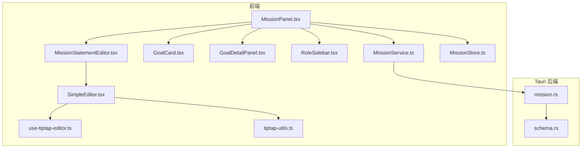
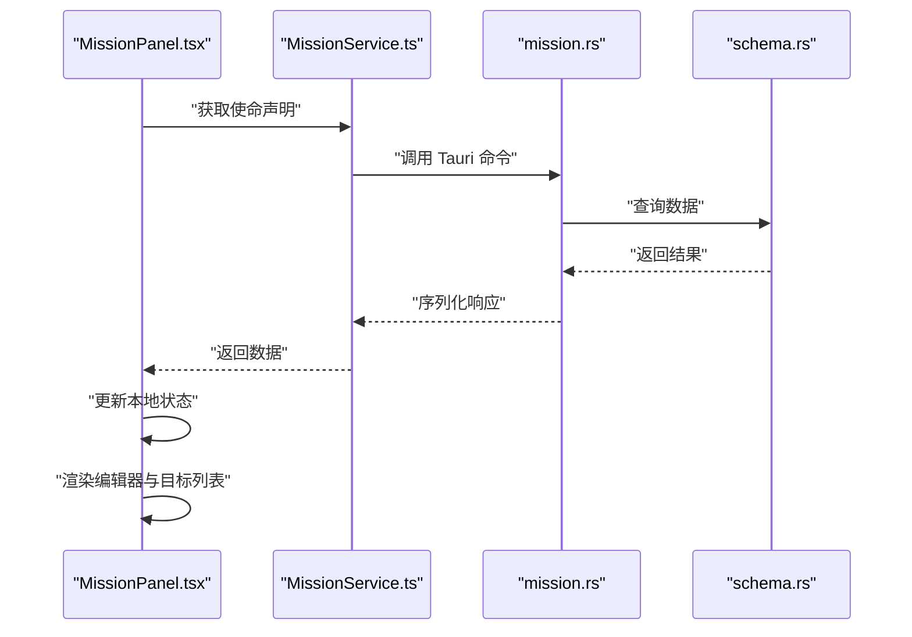
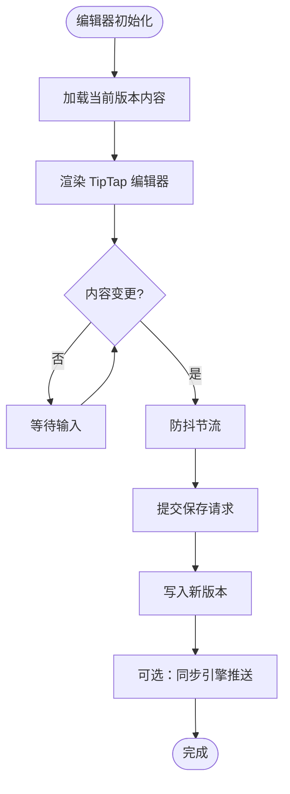
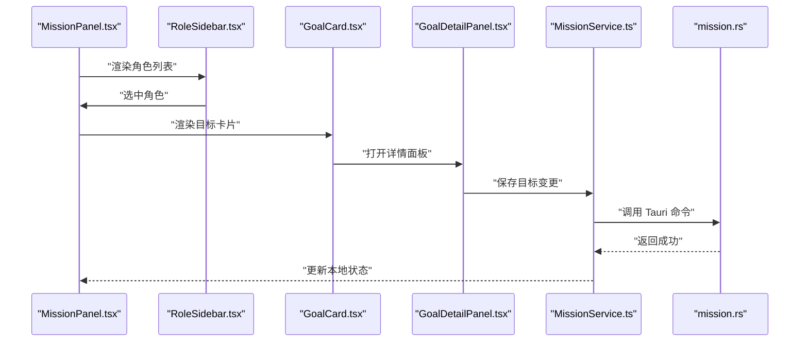
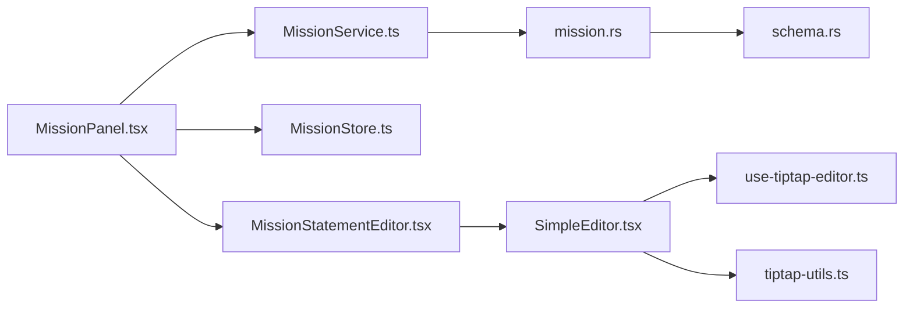

# 使命声明 API

<cite>
**本文引用的文件**   
- [MissionPanel.tsx](file://src/features/mission/MissionPanel.tsx)
- [MissionService.ts](file://src/features/mission/MissionService.ts)
- [MissionStore.ts](file://src/features/mission/MissionStore.ts)
- [MissionTypes.ts](file://src/features/mission/MissionTypes.ts)
- [MissionStatementEditor.tsx](file://src/features/mission/MissionStatementEditor.tsx)
- [GoalCard.tsx](file://src/features/mission/GoalCard.tsx)
- [GoalDetailPanel.tsx](file://src/features/mission/GoalDetailPanel.tsx)
- [RoleSidebar.tsx](file://src/features/mission/RoleSidebar.tsx)
- [SimpleEditor.tsx](file://src/features/tiptap/SimpleEditor.tsx)
- [use-tiptap-editor.ts](file://src/hooks/use-tiptap-editor.ts)
- [tiptap-utils.ts](file://src/lib/tiptap-utils.ts)
- [createSyncEngine.ts](file://src/lib/createSyncEngine.ts)
- [mission.rs](file://src-tauri/src/mission.rs)
- [schema.rs](file://src-tauri/src/schema.rs)
</cite>

## 目录
1. [简介](#简介)
2. [项目结构](#项目结构)
3. [核心组件](#核心组件)
4. [架构总览](#架构总览)
5. [详细组件分析](#详细组件分析)
6. [依赖关系分析](#依赖关系分析)
7. [性能与协作编辑](#性能与协作编辑)
8. [故障排查指南](#故障排查指南)
9. [结论](#结论)
10. [附录：API 定义与集成示例](#附录api-定义与集成示例)

## 简介
本文件为“使命声明”功能模块的前端 API 接口文档，覆盖以下能力：
- 富文本使命声明的创建、读取、更新与删除
- 角色目标（Goals）的增删改查与排序
- 可视化展示与编辑器集成
- 富文本内容存储格式、版本控制与协作编辑的高级特性说明
- 使命编辑器组件的集成与定制方式

该模块采用前端状态管理 + Tauri 后端持久化的架构。前端通过服务层调用 Tauri 命令进行数据读写；编辑器基于 TipTap 构建，支持扩展与主题定制。

## 项目结构
使命声明相关代码位于 features/mission 目录下，包含面板、服务、状态、类型与编辑器等。Tauri 后端在 src-tauri/src/mission.rs 中实现持久化逻辑，并在 schema.rs 中定义数据库模式。

图表来源
- [MissionPanel.tsx](file://src/features/mission/MissionPanel.tsx)
- [MissionService.ts](file://src/features/mission/MissionService.ts)
- [MissionStore.ts](file://src/features/mission/MissionStore.ts)
- [MissionStatementEditor.tsx](file://src/features/mission/MissionStatementEditor.tsx)
- [GoalCard.tsx](file://src/features/mission/GoalCard.tsx)
- [GoalDetailPanel.tsx](file://src/features/mission/GoalDetailPanel.tsx)
- [RoleSidebar.tsx](file://src/features/mission/RoleSidebar.tsx)
- [SimpleEditor.tsx](file://src/features/tiptap/SimpleEditor.tsx)
- [use-tiptap-editor.ts](file://src/hooks/use-tiptap-editor.ts)
- [tiptap-utils.ts](file://src/lib/tiptap-utils.ts)
- [mission.rs](file://src-tauri/src/mission.rs)
- [schema.rs](file://src-tauri/src/schema.rs)

章节来源
- [MissionPanel.tsx](file://src/features/mission/MissionPanel.tsx)
- [MissionService.ts](file://src/features/mission/MissionService.ts)
- [MissionStore.ts](file://src/features/mission/MissionStore.ts)
- [MissionTypes.ts](file://src/features/mission/MissionTypes.ts)
- [MissionStatementEditor.tsx](file://src/features/mission/MissionStatementEditor.tsx)
- [GoalCard.tsx](file://src/features/mission/GoalCard.tsx)
- [GoalDetailPanel.tsx](file://src/features/mission/GoalDetailPanel.tsx)
- [RoleSidebar.tsx](file://src/features/mission/RoleSidebar.tsx)
- [SimpleEditor.tsx](file://src/features/tiptap/SimpleEditor.tsx)
- [use-tiptap-editor.ts](file://src/hooks/use-tiptap-editor.ts)
- [tiptap-utils.ts](file://src/lib/tiptap-utils.ts)
- [mission.rs](file://src-tauri/src/mission.rs)
- [schema.rs](file://src-tauri/src/schema.rs)

## 核心组件
- MissionPanel：页面入口，聚合使命声明与角色目标的展示与交互，负责加载数据、渲染编辑器与目标列表。
- MissionService：封装对 Tauri 后端的调用，提供使命声明与角色的 CRUD 方法。
- MissionStore：本地状态管理，缓存当前使命声明与角色目标，驱动 UI 更新。
- MissionStatementEditor：富文本编辑器容器，基于 SimpleEditor 与 use-tiptap-editor 构建，负责内容同步与保存。
- GoalCard / GoalDetailPanel / RoleSidebar：角色目标卡片、详情面板与侧边栏，用于目标管理与可视化。
- SimpleEditor / use-tiptap-editor / tiptap-utils：TipTap 编辑器封装、钩子与工具函数，统一配置与扩展。

章节来源
- [MissionPanel.tsx](file://src/features/mission/MissionPanel.tsx)
- [MissionService.ts](file://src/features/mission/MissionService.ts)
- [MissionStore.ts](file://src/features/mission/MissionStore.ts)
- [MissionStatementEditor.tsx](file://src/features/mission/MissionStatementEditor.tsx)
- [GoalCard.tsx](file://src/features/mission/GoalCard.tsx)
- [GoalDetailPanel.tsx](file://src/features/mission/GoalDetailPanel.tsx)
- [RoleSidebar.tsx](file://src/features/mission/RoleSidebar.tsx)
- [SimpleEditor.tsx](file://src/features/tiptap/SimpleEditor.tsx)
- [use-tiptap-editor.ts](file://src/hooks/use-tiptap-editor.ts)
- [tiptap-utils.ts](file://src/lib/tiptap-utils.ts)

## 架构总览
前端以 React 组件为入口，通过服务层调用 Tauri 命令访问后端持久化层。编辑器基于 TipTap，使用自定义节点与扩展增强富文本能力。

图表来源
- [MissionPanel.tsx](file://src/features/mission/MissionPanel.tsx)
- [MissionService.ts](file://src/features/mission/MissionService.ts)
- [mission.rs](file://src-tauri/src/mission.rs)
- [schema.rs](file://src-tauri/src/schema.rs)

## 详细组件分析

### 使命声明编辑器（MissionStatementEditor）
- 职责：承载富文本内容，处理用户输入、自动保存、撤销重做、扩展与主题切换。
- 关键流程：
  - 初始化时从 Store 或 Service 拉取最新内容
  - 监听编辑器变更事件，触发防抖保存
  - 将 TipTap JSON 内容持久化到后端
- 高级特性：
  - 版本控制：每次保存生成新版本记录，支持回滚与对比
  - 协作编辑：基于 createSyncEngine 的增量同步机制（可选），冲突策略可配置
  - 扩展：通过 tiptap-utils 注册自定义节点与标记

图表来源
- [MissionStatementEditor.tsx](file://src/features/mission/MissionStatementEditor.tsx)
- [SimpleEditor.tsx](file://src/features/tiptap/SimpleEditor.tsx)
- [use-tiptap-editor.ts](file://src/hooks/use-tiptap-editor.ts)
- [tiptap-utils.ts](file://src/lib/tiptap-utils.ts)
- [createSyncEngine.ts](file://src/lib/createSyncEngine.ts)

章节来源
- [MissionStatementEditor.tsx](file://src/features/mission/MissionStatementEditor.tsx)
- [SimpleEditor.tsx](file://src/features/tiptap/SimpleEditor.tsx)
- [use-tiptap-editor.ts](file://src/hooks/use-tiptap-editor.ts)
- [tiptap-utils.ts](file://src/lib/tiptap-utils.ts)
- [createSyncEngine.ts](file://src/lib/createSyncEngine.ts)

### 角色目标管理（GoalCard / GoalDetailPanel / RoleSidebar）
- 职责：展示角色列表与目标卡片，提供新增、编辑、删除、排序与详情查看。
- 交互流程：
  - 侧边栏选择角色
  - 列表区显示该角色的目标
  - 点击目标打开详情面板进行编辑
  - 拖拽调整顺序并持久化

图表来源
- [MissionPanel.tsx](file://src/features/mission/MissionPanel.tsx)
- [RoleSidebar.tsx](file://src/features/mission/RoleSidebar.tsx)
- [GoalCard.tsx](file://src/features/mission/GoalCard.tsx)
- [GoalDetailPanel.tsx](file://src/features/mission/GoalDetailPanel.tsx)
- [MissionService.ts](file://src/features/mission/MissionService.ts)
- [mission.rs](file://src-tauri/src/mission.rs)

章节来源
- [GoalCard.tsx](file://src/features/mission/GoalCard.tsx)
- [GoalDetailPanel.tsx](file://src/features/mission/GoalDetailPanel.tsx)
- [RoleSidebar.tsx](file://src/features/mission/RoleSidebar.tsx)
- [MissionService.ts](file://src/features/mission/MissionService.ts)
- [mission.rs](file://src-tauri/src/mission.rs)

### 数据模型与类型（MissionTypes）
- 定义使命声明、角色、目标等数据结构，供前后端交互与状态管理使用。
- 字段建议包含：标识符、标题、富文本内容（TipTap JSON）、版本号、时间戳、排序权重等。

章节来源
- [MissionTypes.ts](file://src/features/mission/MissionTypes.ts)

## 依赖关系分析
- 组件耦合：
  - MissionPanel 聚合多个子组件与服务，承担编排职责
  - MissionStatementEditor 依赖 SimpleEditor 与 use-tiptap-editor，解耦编辑器实现
- 服务与后端：
  - MissionService 仅暴露稳定的前端 API，内部调用 Tauri 命令
  - mission.rs 作为 Tauri 命令实现，负责与 schema.rs 定义的数据库交互
- 编辑器扩展：
  - tiptap-utils 集中管理扩展与节点注册，便于复用与测试

图表来源
- [MissionPanel.tsx](file://src/features/mission/MissionPanel.tsx)
- [MissionService.ts](file://src/features/mission/MissionService.ts)
- [MissionStore.ts](file://src/features/mission/MissionStore.ts)
- [MissionStatementEditor.tsx](file://src/features/mission/MissionStatementEditor.tsx)
- [SimpleEditor.tsx](file://src/features/tiptap/SimpleEditor.tsx)
- [use-tiptap-editor.ts](file://src/hooks/use-tiptap-editor.ts)
- [tiptap-utils.ts](file://src/lib/tiptap-utils.ts)
- [mission.rs](file://src-tauri/src/mission.rs)
- [schema.rs](file://src-tauri/src/schema.rs)

章节来源
- [MissionPanel.tsx](file://src/features/mission/MissionPanel.tsx)
- [MissionService.ts](file://src/features/mission/MissionService.ts)
- [MissionStore.ts](file://src/features/mission/MissionStore.ts)
- [MissionStatementEditor.tsx](file://src/features/mission/MissionStatementEditor.tsx)
- [SimpleEditor.tsx](file://src/features/tiptap/SimpleEditor.tsx)
- [use-tiptap-editor.ts](file://src/hooks/use-tiptap-editor.ts)
- [tiptap-utils.ts](file://src/lib/tiptap-utils.ts)
- [mission.rs](file://src-tauri/src/mission.rs)
- [schema.rs](file://src-tauri/src/schema.rs)

## 性能与协作编辑
- 富文本内容存储格式：
  - 使用 TipTap JSON 作为标准格式，具备结构化、可扩展、易序列化的优势
  - 建议在 MissionTypes 中明确字段约束与默认值
- 版本控制：
  - 每次保存生成新版本，保留历史快照，支持回滚与差异对比
  - 建议在前端维护版本索引，避免重复拉取
- 协作编辑：
  - 基于 createSyncEngine 的增量同步机制，减少带宽占用
  - 冲突策略：最后写入优先或三方合并，需在后端与前端共同约定
- 性能优化建议：
  - 编辑器变更防抖与批量保存
  - 大文档分页加载与懒渲染
  - 图片等资源上传走独立通道，避免阻塞主线程

[本节为通用指导，不直接分析具体文件]

## 故障排查指南
- 常见问题定位：
  - 编辑器无法保存：检查 MissionService 的保存调用链与 Tauri 命令返回值
  - 版本回滚失败：确认版本记录是否存在且可读
  - 协作冲突频繁：评估冲突策略与同步频率
- 调试手段：
  - 在 MissionStore 中打印状态变化
  - 在 mission.rs 中记录 SQL 执行与错误堆栈
  - 使用浏览器开发者工具观察网络与本地状态

章节来源
- [MissionService.ts](file://src/features/mission/MissionService.ts)
- [MissionStore.ts](file://src/features/mission/MissionStore.ts)
- [mission.rs](file://src-tauri/src/mission.rs)

## 结论
使命声明模块通过清晰的分层与模块化设计，实现了富文本编辑、版本控制与协作编辑等高级特性。前端以 TipTap 为核心，结合 Tauri 后端提供稳定可靠的持久化能力。建议继续完善错误处理、日志与监控，以提升用户体验与可维护性。

[本节为总结，不直接分析具体文件]

## 附录：API 定义与集成示例

### 前端 API（MissionService）
- 使命声明
  - 获取使命声明：返回当前最新版本的内容与元信息
  - 保存使命声明：提交富文本 JSON 内容，生成新版本
  - 获取历史版本：按版本号或时间范围查询
  - 回滚到指定版本：将指定版本设为当前活跃版本
- 角色与目标
  - 获取角色列表：返回所有角色及其基本信息
  - 获取角色目标：按角色 ID 返回目标集合
  - 新增/更新/删除目标：支持排序权重与详情字段
  - 批量更新目标顺序：接收新的排序数组并持久化

章节来源
- [MissionService.ts](file://src/features/mission/MissionService.ts)
- [MissionTypes.ts](file://src/features/mission/MissionTypes.ts)

### Tauri 命令（mission.rs）
- 命令命名规范：统一前缀，如 mission_get_statement、mission_save_statement、mission_list_roles、mission_update_goals 等
- 参数与返回：
  - 入参：JSON 对象，包含必要字段与校验规则
  - 出参：统一包装 { code, message, data }，data 为业务数据
- 错误处理：
  - 数据库异常映射为前端可识别的错误码
  - 记录详细日志以便排查

章节来源
- [mission.rs](file://src-tauri/src/mission.rs)

### 数据库模式（schema.rs）
- 表结构建议：
  - mission_statements：id、title、content_json、version、created_at、updated_at
  - roles：id、name、description、sort_order
  - goals：id、role_id、title、content_json、sort_order、created_at、updated_at
- 索引与约束：
  - 为 version、role_id、sort_order 建立索引
  - 唯一约束确保版本不重复

章节来源
- [schema.rs](file://src-tauri/src/schema.rs)

### 富文本编辑器集成与定制
- 集成步骤：
  - 在页面中引入 MissionStatementEditor
  - 传入初始内容与回调函数（保存、版本切换）
  - 配置主题与扩展（通过 tiptap-utils）
- 定制示例：
  - 添加自定义节点：在 tiptap-utils 中注册节点与样式
  - 修改工具栏：在 SimpleEditor 中组合按钮与下拉菜单
  - 启用协作：在 createSyncEngine 中配置频道与冲突策略

章节来源
- [MissionStatementEditor.tsx](file://src/features/mission/MissionStatementEditor.tsx)
- [SimpleEditor.tsx](file://src/features/tiptap/SimpleEditor.tsx)
- [use-tiptap-editor.ts](file://src/hooks/use-tiptap-editor.ts)
- [tiptap-utils.ts](file://src/lib/tiptap-utils.ts)
- [createSyncEngine.ts](file://src/lib/createSyncEngine.ts)