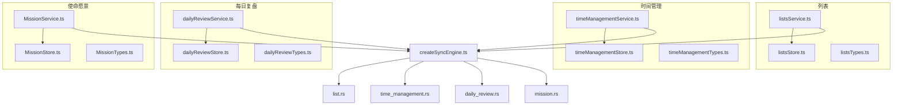
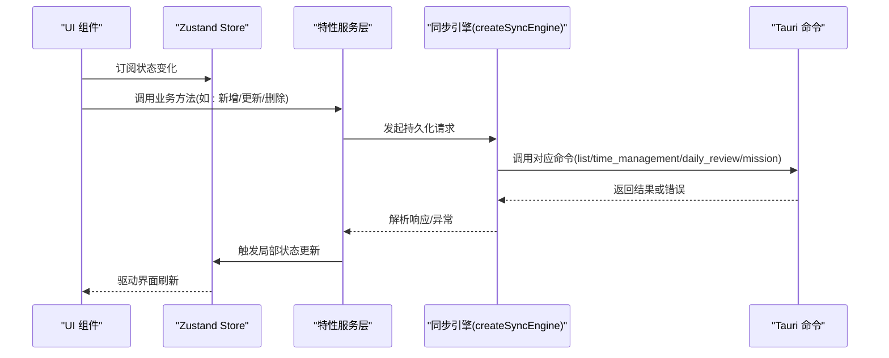
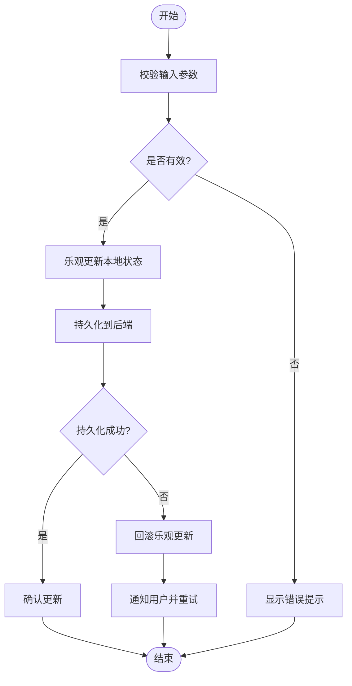
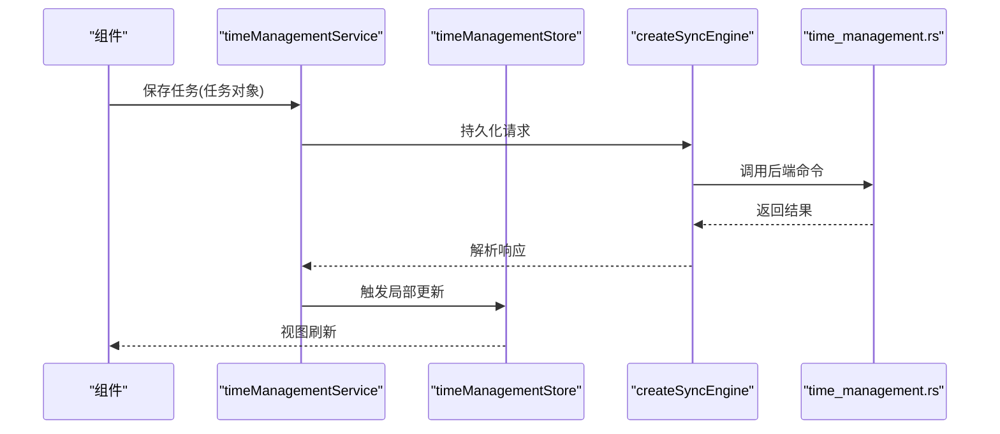
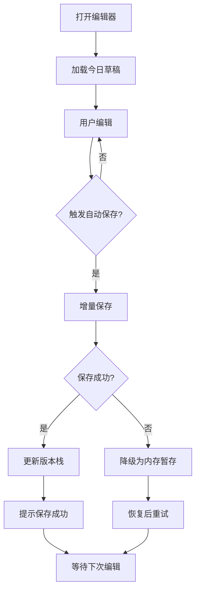
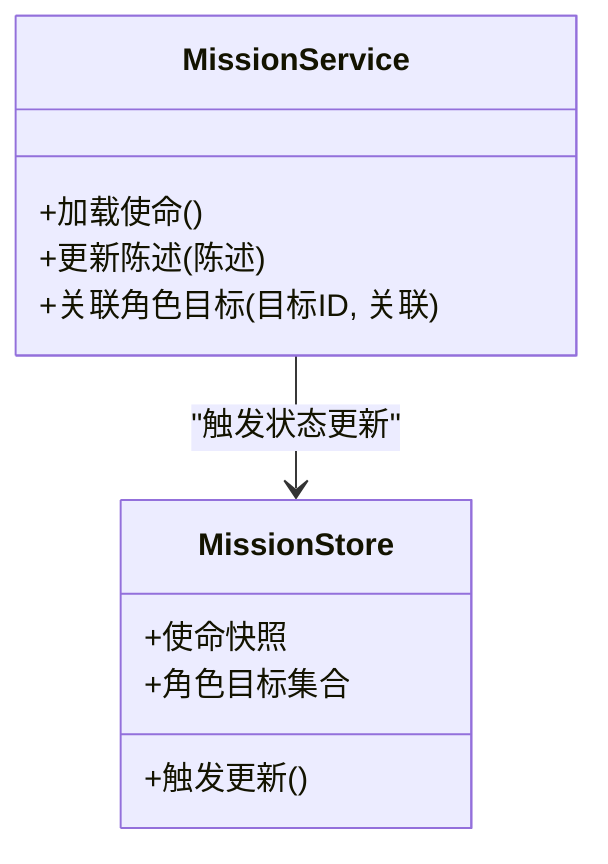
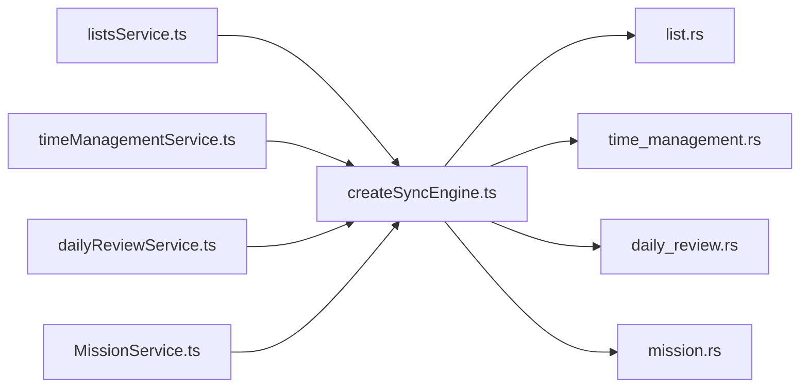

# 前端 API 接口

<cite>
**本文引用的文件**   
- [src/features/lists/listsService.ts](file://src/features/lists/listsService.ts)
- [src/features/lists/listsStore.ts](file://src/features/lists/listsStore.ts)
- [src/features/lists/listsTypes.ts](file://src/features/lists/listsTypes.ts)
- [src/features/time-management/timeManagementService.ts](file://src/features/time-management/timeManagementService.ts)
- [src/features/time-management/timeManagementStore.ts](file://src/features/time-management/timeManagementStore.ts)
- [src/features/time-management/timeManagementTypes.ts](file://src/features/time-management/timeManagementTypes.ts)
- [src/features/daily-review/dailyReviewService.ts](file://src/features/daily-review/dailyReviewService.ts)
- [src/features/daily-review/dailyReviewStore.ts](file://src/features/daily-review/dailyReviewStore.ts)
- [src/features/daily-review/dailyReviewTypes.ts](file://src/features/daily-review/dailyReviewTypes.ts)
- [src/features/mission/MissionService.ts](file://src/features/mission/MissionService.ts)
- [src/features/mission/MissionStore.ts](file://src/features/mission/MissionStore.ts)
- [src/features/mission/MissionTypes.ts](file://src/features/mission/MissionTypes.ts)
- [src/lib/createSyncEngine.ts](file://src/lib/createSyncEngine.ts)
- [src-tauri/src/list.rs](file://src-tauri/src/list.rs)
- [src-tauri/src/time_management.rs](file://src-tauri/src/time_management.rs)
- [src-tauri/src/daily_review.rs](file://src-tauri/src/daily_review.rs)
- [src-tauri/src/mission.rs](file://src-tauri/src/mission.rs)
</cite>

## 目录
1. [简介](#简介)
2. [项目结构](#项目结构)
3. [核心组件](#核心组件)
4. [架构总览](#架构总览)
5. [详细组件分析](#详细组件分析)
6. [依赖分析](#依赖分析)
7. [性能考虑](#性能考虑)
8. [故障排查指南](#故障排查指南)
9. [结论](#结论)
10. [附录](#附录)

## 简介
本文件为 FishWorker 应用的前端服务层 API 文档，聚焦于各功能模块的服务层公共接口、调用方式与集成实践。内容覆盖：
- 函数签名、参数类型、返回值说明
- 状态管理（Zustand）与服务层的协作模式
- 错误处理模式与重试策略
- 异步操作与事件监听机制
- 组件集成示例与最佳实践

## 项目结构
FishWorker 采用“按特性划分”的模块化组织方式，每个特性包含：
- Service 层：封装业务逻辑与持久化访问
- Store 层：基于 Zustand 的状态容器
- Types 层：共享类型定义
- UI 组件：消费 Store 与 Service 的视图层

图表来源
- [src/features/lists/listsService.ts](file://src/features/lists/listsService.ts)
- [src/features/lists/listsStore.ts](file://src/features/lists/listsStore.ts)
- [src/features/lists/listsTypes.ts](file://src/features/lists/listsTypes.ts)
- [src/features/time-management/timeManagementService.ts](file://src/features/time-management/timeManagementService.ts)
- [src/features/time-management/timeManagementStore.ts](file://src/features/time-management/timeManagementStore.ts)
- [src/features/time-management/timeManagementTypes.ts](file://src/features/time-management/timeManagementTypes.ts)
- [src/features/daily-review/dailyReviewService.ts](file://src/features/daily-review/dailyReviewService.ts)
- [src/features/daily-review/dailyReviewStore.ts](file://src/features/daily-review/dailyReviewStore.ts)
- [src/features/daily-review/dailyReviewTypes.ts](file://src/features/daily-review/dailyReviewTypes.ts)
- [src/features/mission/MissionService.ts](file://src/features/mission/MissionService.ts)
- [src/features/mission/MissionStore.ts](file://src/features/mission/MissionStore.ts)
- [src/features/mission/MissionTypes.ts](file://src/features/mission/MissionTypes.ts)
- [src/lib/createSyncEngine.ts](file://src/lib/createSyncEngine.ts)
- [src-tauri/src/list.rs](file://src-tauri/src/list.rs)
- [src-tauri/src/time_management.rs](file://src-tauri/src/time_management.rs)
- [src-tauri/src/daily_review.rs](file://src-tauri/src/daily_review.rs)
- [src-tauri/src/mission.rs](file://src-tauri/src/mission.rs)

章节来源
- [src/features/lists/listsService.ts](file://src/features/lists/listsService.ts)
- [src/features/time-management/timeManagementService.ts](file://src/features/time-management/timeManagementService.ts)
- [src/features/daily-review/dailyReviewService.ts](file://src/features/daily-review/dailyReviewService.ts)
- [src/features/mission/MissionService.ts](file://src/features/mission/MissionService.ts)
- [src/lib/createSyncEngine.ts](file://src/lib/createSyncEngine.ts)

## 核心组件
本节概述各特性服务层暴露的公共接口与其职责边界。为避免泄露实现细节，以下以“接口契约”的方式描述方法名、输入输出与行为约定，并给出调用路径参考。

- 列表（Lists）
  - 服务职责：增删改查清单、分组、排序、批量导出等
  - 典型方法：获取列表、新增条目、更新条目、删除条目、移动/重排、导出
  - 状态同步：通过同步引擎写入本地存储，触发 store 增量更新
  - 参考路径：[src/features/lists/listsService.ts](file://src/features/lists/listsService.ts)、[src/features/lists/listsStore.ts](file://src/features/lists/listsStore.ts)、[src/features/lists/listsTypes.ts](file://src/features/lists/listsTypes.ts)

- 时间管理（Time Management）
  - 服务职责：任务创建、编辑、完成、归档；四象限视图数据聚合
  - 典型方法：加载任务、保存任务、切换状态、批量操作
  - 状态同步：与后端持久化一致，store 提供订阅式响应式更新
  - 参考路径：[src/features/time-management/timeManagementService.ts](file://src/features/time-management/timeManagementService.ts)、[src/features/time-management/timeManagementStore.ts](file://src/features/time-management/timeManagementStore.ts)、[src/features/time-management/timeManagementTypes.ts](file://src/features/time-management/timeManagementTypes.ts)

- 每日复盘（Daily Review）
  - 服务职责：复盘记录读写、自动保存、历史版本
  - 典型方法：读取今日复盘、保存草稿、提交终稿、回滚
  - 状态同步：支持断点续写与冲突合并
  - 参考路径：[src/features/daily-review/dailyReviewService.ts](file://src/features/daily-review/dailyReviewService.ts)、[src/features/daily-review/dailyReviewStore.ts](file://src/features/daily-review/dailyReviewStore.ts)、[src/features/daily-review/dailyReviewTypes.ts](file://src/features/daily-review/dailyReviewTypes.ts)

- 使命愿景（Mission）
  - 服务职责：使命陈述、角色目标维护
  - 典型方法：加载使命、更新陈述、关联角色目标
  - 状态同步：轻量级持久化，变更即时反映到 UI
  - 参考路径：[src/features/mission/MissionService.ts](file://src/features/mission/MissionService.ts)、[src/features/mission/MissionStore.ts](file://src/features/mission/MissionStore.ts)、[src/features/mission/MissionTypes.ts](file://src/features/mission/MissionTypes.ts)

章节来源
- [src/features/lists/listsService.ts](file://src/features/lists/listsService.ts)
- [src/features/lists/listsStore.ts](file://src/features/lists/listsStore.ts)
- [src/features/lists/listsTypes.ts](file://src/features/lists/listsTypes.ts)
- [src/features/time-management/timeManagementService.ts](file://src/features/time-management/timeManagementService.ts)
- [src/features/time-management/timeManagementStore.ts](file://src/features/time-management/timeManagementStore.ts)
- [src/features/time-management/timeManagementTypes.ts](file://src/features/time-management/timeManagementTypes.ts)
- [src/features/daily-review/dailyReviewService.ts](file://src/features/daily-review/dailyReviewService.ts)
- [src/features/daily-review/dailyReviewStore.ts](file://src/features/daily-review/dailyReviewStore.ts)
- [src/features/daily-review/dailyReviewTypes.ts](file://src/features/daily-review/dailyReviewTypes.ts)
- [src/features/mission/MissionService.ts](file://src/features/mission/MissionService.ts)
- [src/features/mission/MissionStore.ts](file://src/features/mission/MissionStore.ts)
- [src/features/mission/MissionTypes.ts](file://src/features/mission/MissionTypes.ts)

## 架构总览
前端服务层统一通过“同步引擎”对接 Tauri 后端能力，形成稳定的跨进程通信通道。

图表来源
- [src/lib/createSyncEngine.ts](file://src/lib/createSyncEngine.ts)
- [src-tauri/src/list.rs](file://src-tauri/src/list.rs)
- [src-tauri/src/time_management.rs](file://src-tauri/src/time_management.rs)
- [src-tauri/src/daily_review.rs](file://src-tauri/src/daily_review.rs)
- [src-tauri/src/mission.rs](file://src-tauri/src/mission.rs)

## 详细组件分析

### 列表（Lists）服务层
- 设计模式
  - 门面模式：对外暴露简洁的 CRUD 与批量操作方法
  - 事务性更新：对多次修改进行批处理，减少状态抖动
  - 乐观更新：先更新 UI，失败时回滚
- 关键接口（概念性描述）
  - 获取列表：返回当前所有清单及分组信息
  - 新增条目：校验必填字段后插入，返回新条目标识
  - 更新条目：按标识定位并合并变更
  - 删除条目：软删除或物理删除，视配置而定
  - 移动/重排：根据索引或拖拽位置调整顺序
  - 批量导出：将选定条目序列化为可下载格式
- 状态管理集成
  - Store 暴露只读快照与 setter 方法，服务层仅触发必要的局部更新
- 错误处理
  - 网络/IO 异常捕获，用户可见的错误提示与重试入口
- 异步与事件
  - 长耗时操作使用 Promise，必要时派发进度事件
- 组件集成示例（步骤）
  - 在组件中订阅 listsStore 的列表快照
  - 点击按钮调用 listsService 的相应方法
  - 成功则展示反馈，失败则显示错误消息并提供重试
- 最佳实践
  - 避免在渲染循环中直接调用服务方法
  - 批量操作尽量合并为一次调用
  - 对大列表分页或虚拟滚动

图表来源
- [src/features/lists/listsService.ts](file://src/features/lists/listsService.ts)
- [src/features/lists/listsStore.ts](file://src/features/lists/listsStore.ts)
- [src/features/lists/listsTypes.ts](file://src/features/lists/listsTypes.ts)

章节来源
- [src/features/lists/listsService.ts](file://src/features/lists/listsService.ts)
- [src/features/lists/listsStore.ts](file://src/features/lists/listsStore.ts)
- [src/features/lists/listsTypes.ts](file://src/features/lists/listsTypes.ts)

### 时间管理（Time Management）服务层
- 设计模式
  - 领域服务：围绕任务生命周期组织方法
  - 查询优化：按需聚合四象限视图数据
- 关键接口（概念性描述）
  - 加载任务：按日期/标签/状态筛选
  - 保存任务：新建或更新，含校验与幂等处理
  - 切换状态：完成/取消/归档等状态机流转
  - 批量操作：批量标记完成、批量移动
- 状态管理集成
  - Store 提供任务集合与视图派生状态，服务层仅触发最小必要变更
- 错误处理
  - 针对并发更新冲突提供合并策略与用户提示
- 异步与事件
  - 大量任务导入/导出时使用分片与进度回调
- 组件集成示例（步骤）
  - 在面板初始化时加载任务快照
  - 用户交互触发服务方法，成功后刷新视图
- 最佳实践
  - 使用防抖/节流处理高频输入
  - 对复杂筛选条件缓存中间结果

图表来源
- [src/features/time-management/timeManagementService.ts](file://src/features/time-management/timeManagementService.ts)
- [src/features/time-management/timeManagementStore.ts](file://src/features/time-management/timeManagementStore.ts)
- [src/features/time-management/timeManagementTypes.ts](file://src/features/time-management/timeManagementTypes.ts)
- [src/lib/createSyncEngine.ts](file://src/lib/createSyncEngine.ts)
- [src-tauri/src/time_management.rs](file://src-tauri/src/time_management.rs)

章节来源
- [src/features/time-management/timeManagementService.ts](file://src/features/time-management/timeManagementService.ts)
- [src/features/time-management/timeManagementStore.ts](file://src/features/time-management/timeManagementStore.ts)
- [src/features/time-management/timeManagementTypes.ts](file://src/features/time-management/timeManagementTypes.ts)

### 每日复盘（Daily Review）服务层
- 设计模式
  - 自动保存：定时/触发式增量保存
  - 版本控制：保留最近若干版本以便回滚
- 关键接口（概念性描述）
  - 读取今日复盘：返回当前草稿或空模板
  - 保存草稿：增量写入，避免全量覆盖
  - 提交终稿：锁定不可再编辑，生成归档
  - 回滚：恢复到指定版本
- 状态管理集成
  - Store 维护草稿指针与版本栈，服务层负责一致性
- 错误处理
  - 磁盘/IO 异常降级为内存暂存，恢复后重试
- 异步与事件
  - 自动保存间隔可配置，保存完成派发事件供 UI 提示
- 组件集成示例（步骤）
  - 编辑器挂载时加载草稿
  - 输入变化触发自动保存
  - 提交前二次确认，成功后禁用编辑区
- 最佳实践
  - 大文本分段保存，降低单次 IO 压力
  - 冲突检测与合并提示

图表来源
- [src/features/daily-review/dailyReviewService.ts](file://src/features/daily-review/dailyReviewService.ts)
- [src/features/daily-review/dailyReviewStore.ts](file://src/features/daily-review/dailyReviewStore.ts)
- [src/features/daily-review/dailyReviewTypes.ts](file://src/features/daily-review/dailyReviewTypes.ts)

章节来源
- [src/features/daily-review/dailyReviewService.ts](file://src/features/daily-review/dailyReviewService.ts)
- [src/features/daily-review/dailyReviewStore.ts](file://src/features/daily-review/dailyReviewStore.ts)
- [src/features/daily-review/dailyReviewTypes.ts](file://src/features/daily-review/dailyReviewTypes.ts)

### 使命愿景（Mission）服务层
- 设计模式
  - 轻实体服务：面向少量实体的读写与简单关系维护
- 关键接口（概念性描述）
  - 加载使命：返回使命陈述与角色目标列表
  - 更新陈述：原子替换，带校验
  - 关联角色目标：建立/解除关联
- 状态管理集成
  - Store 持有单一实例与关联集合，服务层保证一致性
- 错误处理
  - 约束冲突时给出明确提示
- 异步与事件
  - 小体量数据通常同步返回，必要时仍走异步流程
- 组件集成示例（步骤）
  - 页面初始化加载使命
  - 表单提交调用服务方法
  - 成功后刷新相关区域
- 最佳实践
  - 避免重复加载，利用缓存与惰性加载

图表来源
- [src/features/mission/MissionService.ts](file://src/features/mission/MissionService.ts)
- [src/features/mission/MissionStore.ts](file://src/features/mission/MissionStore.ts)
- [src/features/mission/MissionTypes.ts](file://src/features/mission/MissionTypes.ts)

章节来源
- [src/features/mission/MissionService.ts](file://src/features/mission/MissionService.ts)
- [src/features/mission/MissionStore.ts](file://src/features/mission/MissionStore.ts)
- [src/features/mission/MissionTypes.ts](file://src/features/mission/MissionTypes.ts)

## 依赖分析
- 耦合关系
  - 服务层依赖同步引擎，屏蔽底层 Tauri 差异
  - Store 仅依赖服务层触发的更新，不直接访问持久化
- 外部依赖
  - Tauri 命令：list、time_management、daily_review、mission
- 潜在风险
  - 循环依赖：确保服务层不反向依赖 Store 的实现细节
  - 事件风暴：合理拆分事件粒度，避免过度广播

图表来源
- [src/features/lists/listsService.ts](file://src/features/lists/listsService.ts)
- [src/features/time-management/timeManagementService.ts](file://src/features/time-management/timeManagementService.ts)
- [src/features/daily-review/dailyReviewService.ts](file://src/features/daily-review/dailyReviewService.ts)
- [src/features/mission/MissionService.ts](file://src/features/mission/MissionService.ts)
- [src/lib/createSyncEngine.ts](file://src/lib/createSyncEngine.ts)
- [src-tauri/src/list.rs](file://src-tauri/src/list.rs)
- [src-tauri/src/time_management.rs](file://src-tauri/src/time_management.rs)
- [src-tauri/src/daily_review.rs](file://src-tauri/src/daily_review.rs)
- [src-tauri/src/mission.rs](file://src-tauri/src/mission.rs)

章节来源
- [src/lib/createSyncEngine.ts](file://src/lib/createSyncEngine.ts)
- [src-tauri/src/list.rs](file://src-tauri/src/list.rs)
- [src-tauri/src/time_management.rs](file://src-tauri/src/time_management.rs)
- [src-tauri/src/daily_review.rs](file://src-tauri/src/daily_review.rs)
- [src-tauri/src/mission.rs](file://src-tauri/src/mission.rs)

## 性能考虑
- 列表与时间管理
  - 大数据集使用分页/虚拟滚动
  - 批量操作合并为单事务
  - 查询结果缓存与去重
- 每日复盘
  - 增量保存与分段写入
  - 自动保存间隔可调，避免频繁 IO
- 通用
  - 防抖/节流输入
  - 懒加载与按需初始化
  - 避免在渲染路径执行阻塞操作

## 故障排查指南
- 常见问题
  - 持久化失败：检查同步引擎日志与 Tauri 命令返回码
  - 状态不同步：确认服务层是否正确触发 Store 更新
  - 自动保存未生效：核对保存间隔与触发条件
- 建议步骤
  - 开启调试日志，定位具体失败阶段
  - 复现最小用例，隔离问题范围
  - 验证后端命令是否可用（独立测试）
  - 检查权限与磁盘空间

## 结论
FishWorker 前端服务层以清晰的职责边界与统一的同步引擎，实现了稳定可靠的跨进程数据访问。通过 Zustand 的状态管理与合理的错误处理、异步策略，既保证了用户体验，也便于扩展与维护。建议在后续迭代中持续完善监控与可观测性，进一步提升稳定性与可诊断性。

## 附录
- 术语
  - 同步引擎：封装 Tauri 命令调用的统一抽象
  - 乐观更新：先更新 UI，失败时回滚
  - 增量保存：仅保存变更部分，降低 IO 开销
- 参考路径
  - 列表：[src/features/lists/listsService.ts](file://src/features/lists/listsService.ts)、[src/features/lists/listsStore.ts](file://src/features/lists/listsStore.ts)、[src/features/lists/listsTypes.ts](file://src/features/lists/listsTypes.ts)
  - 时间管理：[src/features/time-management/timeManagementService.ts](file://src/features/time-management/timeManagementService.ts)、[src/features/time-management/timeManagementStore.ts](file://src/features/time-management/timeManagementStore.ts)、[src/features/time-management/timeManagementTypes.ts](file://src/features/time-management/timeManagementTypes.ts)
  - 每日复盘：[src/features/daily-review/dailyReviewService.ts](file://src/features/daily-review/dailyReviewService.ts)、[src/features/daily-review/dailyReviewStore.ts](file://src/features/daily-review/dailyReviewStore.ts)、[src/features/daily-review/dailyReviewTypes.ts](file://src/features/daily-review/dailyReviewTypes.ts)
  - 使命愿景：[src/features/mission/MissionService.ts](file://src/features/mission/MissionService.ts)、[src/features/mission/MissionStore.ts](file://src/features/mission/MissionStore.ts)、[src/features/mission/MissionTypes.ts](file://src/features/mission/MissionTypes.ts)
  - 同步引擎：[src/lib/createSyncEngine.ts](file://src/lib/createSyncEngine.ts)
  - Tauri 命令：[src-tauri/src/list.rs](file://src-tauri/src/list.rs)、[src-tauri/src/time_management.rs](file://src-tauri/src/time_management.rs)、[src-tauri/src/daily_review.rs](file://src-tauri/src/daily_review.rs)、[src-tauri/src/mission.rs](file://src-tauri/src/mission.rs)