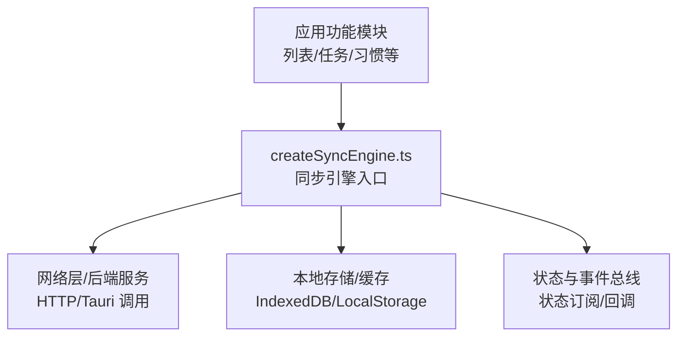
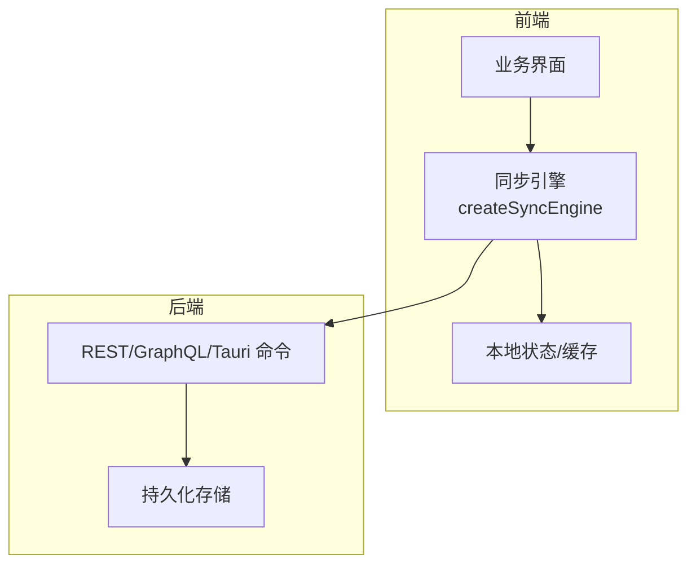
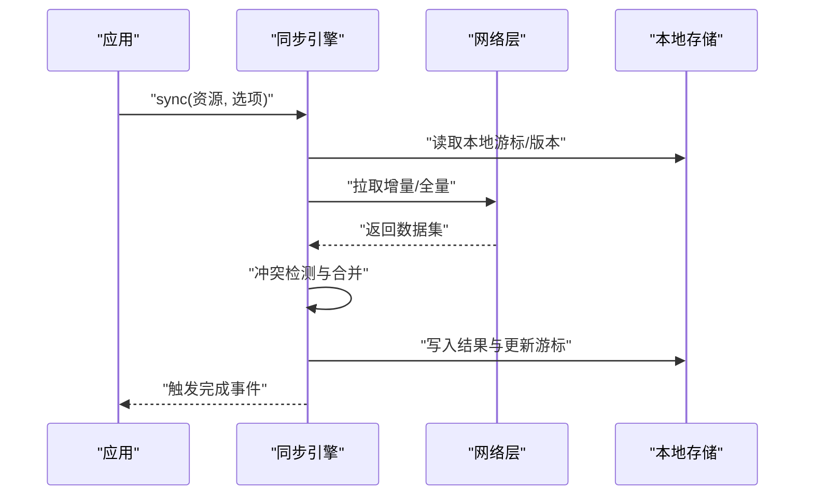
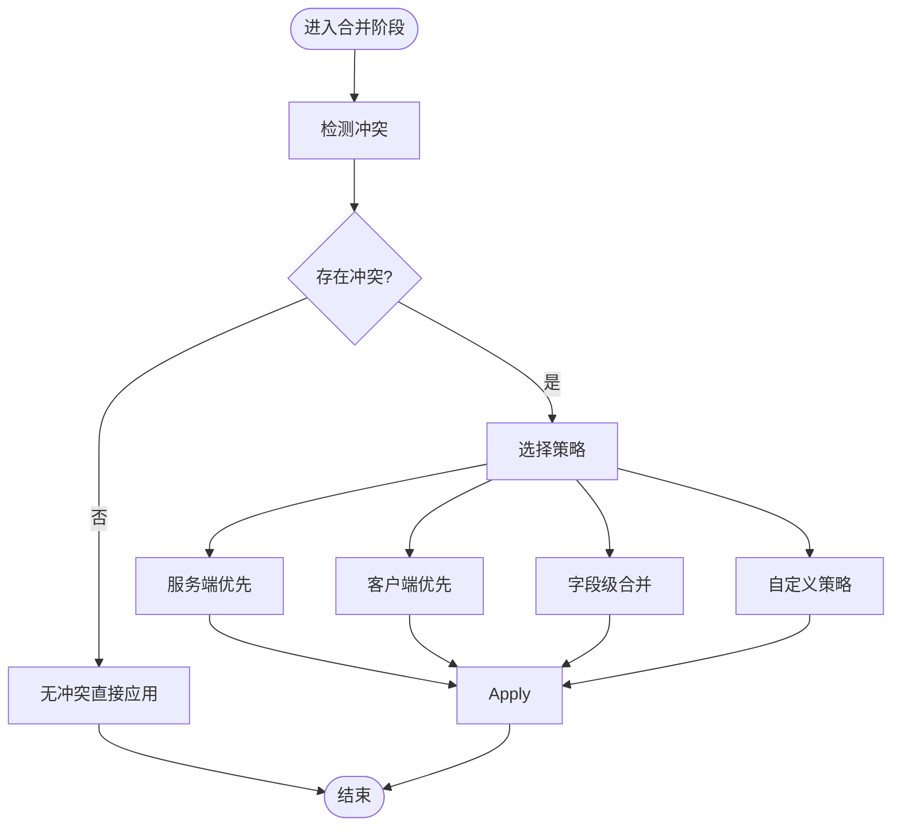
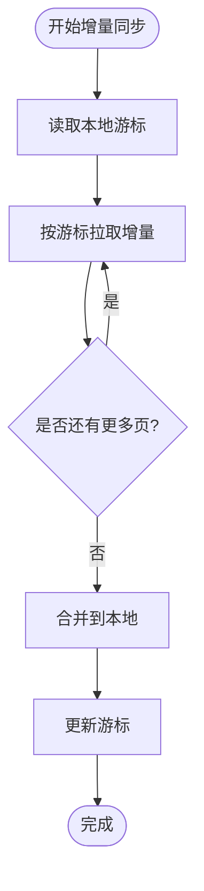
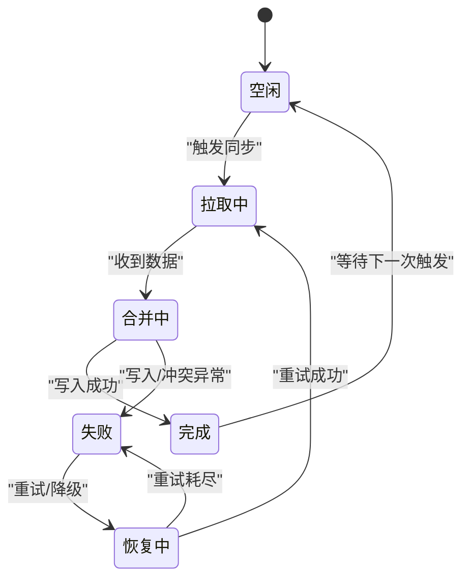
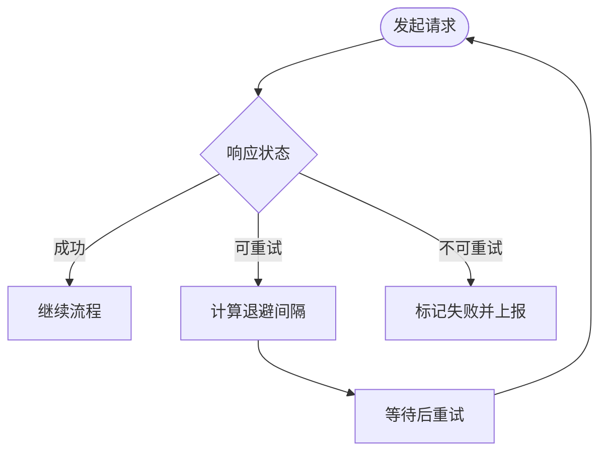
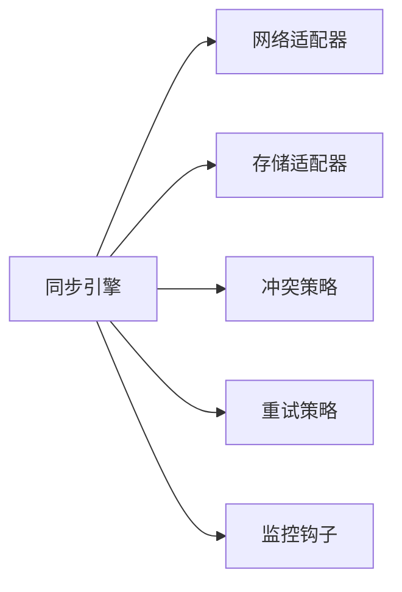

# 数据同步引擎 API

<cite>
**本文引用的文件**   
- [createSyncEngine.ts](file://src/lib/createSyncEngine.ts)
- [createSyncEngine.test.ts](file://src/lib/createSyncEngine.test.ts)
</cite>

## 目录
1. [简介](#简介)
2. [项目结构](#项目结构)
3. [核心组件](#核心组件)
4. [架构总览](#架构总览)
5. [详细组件分析](#详细组件分析)
6. [依赖分析](#依赖分析)
7. [性能考虑](#性能考虑)
8. [故障排查指南](#故障排查指南)
9. [结论](#结论)
10. [附录](#附录)

## 简介
本文件为“数据同步引擎”的前端 API 接口文档，聚焦于 src/lib/createSyncEngine.ts 暴露的同步能力。内容涵盖前后端数据同步机制、冲突解决策略、增量更新、同步状态管理、错误重试机制、性能监控扩展点以及自定义同步策略的实现示例与最佳实践。读者无需深入源码即可理解如何集成与扩展该引擎。

## 项目结构
与数据同步引擎直接相关的代码位于前端 lib 层：
- createSyncEngine.ts：定义并导出创建同步引擎实例的核心工厂函数与类型契约
- createSyncEngine.test.ts：覆盖关键路径与边界用例，辅助理解行为约定与异常处理

图示来源
- [createSyncEngine.ts](file://src/lib/createSyncEngine.ts)

章节来源
- [createSyncEngine.ts](file://src/lib/createSyncEngine.ts)
- [createSyncEngine.test.ts](file://src/lib/createSyncEngine.test.ts)

## 核心组件
本节概述同步引擎对外提供的关键能力与概念，便于快速上手与定位扩展点。

- 引擎初始化与配置
  - 通过工厂函数创建引擎实例，传入网络适配器、本地存储适配器、冲突策略、重试策略、监控钩子等配置项
  - 支持按需启用增量同步、全量拉取、断点续传等开关

- 同步生命周期
  - 启动/停止：控制后台或前台同步任务的生命周期
  - 触发式同步：按资源维度发起一次同步
  - 定时/监听式同步：基于时间或变更事件自动触发

- 数据模型与版本
  - 资源标识、版本号/时间戳、操作日志（可选）
  - 用于实现幂等、去重与冲突检测

- 冲突解决策略
  - 服务端优先/客户端优先/合并策略/自定义策略
  - 字段级合并与整记录覆盖可配置

- 增量更新
  - 基于游标/时间戳/版本号进行差异拉取
  - 支持分页与批处理，降低带宽与内存占用

- 错误与重试
  - 指数退避、抖动、最大重试次数、失败降级
  - 可观测性：错误分类、上报与告警

- 状态管理与事件
  - 同步状态机：空闲、拉取中、合并中、完成、失败
  - 事件订阅：开始、进度、完成、错误、恢复

- 性能监控
  - 指标采集：耗时、吞吐、失败率、缓存命中率
  - 采样与上报：可接入外部监控系统

章节来源
- [createSyncEngine.ts](file://src/lib/createSyncEngine.ts)
- [createSyncEngine.test.ts](file://src/lib/createSyncEngine.test.ts)

## 架构总览
下图展示前端同步引擎在整体系统中的位置与交互关系。

图示来源
- [createSyncEngine.ts](file://src/lib/createSyncEngine.ts)

## 详细组件分析

### 同步引擎接口概览
- 工厂函数
  - 作用：创建并返回一个具备完整生命周期的同步引擎实例
  - 输入：配置对象（网络、存储、策略、监控、调度等）
  - 输出：引擎实例（包含启动、停止、触发同步、订阅事件等方法）

- 核心方法（命名仅为示意，具体以源码为准）
  - start()：启动引擎，注册监听器与定时任务
  - stop()：优雅关闭，清理定时器与未完成的请求
  - sync(resource, options?)：对指定资源执行一次同步
  - subscribe(listener)：订阅同步事件流
  - getStats()：获取运行时统计信息

- 配置项（节选）
  - network：请求发送与响应解析
  - storage：本地读写与快照
  - conflictResolver：冲突策略
  - retryPolicy：重试策略
  - monitor：监控钩子
  - scheduler：调度策略（定时/事件驱动）

章节来源
- [createSyncEngine.ts](file://src/lib/createSyncEngine.ts)

### 前后端数据同步机制
- 全量同步
  - 适用场景：冷启动、首次安装、强制刷新
  - 流程：拉取全量 -> 本地落盘 -> 合并/覆盖 -> 通知上层

- 增量同步
  - 适用场景：日常运行、频繁小改动
  - 关键点：游标/时间戳/版本号维护；分页拉取；批量合并

- 双向同步
  - 上行：将本地变更序列化为操作日志或差异集
  - 下行：拉取远端变更并合并到本地

图示来源
- [createSyncEngine.ts](file://src/lib/createSyncEngine.ts)

章节来源
- [createSyncEngine.ts](file://src/lib/createSyncEngine.ts)

### 冲突解决策略
- 内置策略
  - 服务端优先：远端版本覆盖本地
  - 客户端优先：本地未提交变更保留
  - 字段级合并：按字段粒度合并（需字段互斥假设）
- 自定义策略
  - 提供策略函数，接收本地与远端记录，返回最终记录
  - 建议记录冲突详情以便审计与回滚

图示来源
- [createSyncEngine.ts](file://src/lib/createSyncEngine.ts)

章节来源
- [createSyncEngine.ts](file://src/lib/createSyncEngine.ts)

### 增量更新与游标管理
- 游标来源
  - 服务端返回的更新时间戳/版本号
  - 本地记录的 last_sync_at / cursor
- 增量拉取
  - 使用游标过滤新增/修改/删除
  - 分页拉取避免单次过大负载
- 一致性保障
  - 幂等写入与去重键
  - 事务性落盘（若底层支持）

图示来源
- [createSyncEngine.ts](file://src/lib/createSyncEngine.ts)

章节来源
- [createSyncEngine.ts](file://src/lib/createSyncEngine.ts)

### 同步状态管理与事件
- 状态机
  - 空闲、拉取中、合并中、完成、失败、恢复中
- 事件
  - onSyncStart/onSyncProgress/onSyncSuccess/onSyncError/onRecover
- 用途
  - 驱动 UI 显示加载态、进度条、错误提示
  - 触发后续业务流程（如刷新视图、计算统计）

图示来源
- [createSyncEngine.ts](file://src/lib/createSyncEngine.ts)

章节来源
- [createSyncEngine.ts](file://src/lib/createSyncEngine.ts)

### 错误与重试机制
- 重试策略
  - 指数退避 + 随机抖动
  - 最大重试次数与超时控制
  - 区分可重试与不可重试错误
- 降级与熔断
  - 失败时回退到只读模式或仅本地可用
  - 限流保护后端
- 可观测性
  - 错误分类、堆栈、上下文（资源、游标、批次）
  - 上报至监控平台

图示来源
- [createSyncEngine.ts](file://src/lib/createSyncEngine.ts)

章节来源
- [createSyncEngine.ts](file://src/lib/createSyncEngine.ts)

### 性能监控与扩展点
- 指标采集
  - 同步耗时、吞吐、失败率、缓存命中率、内存峰值
- 采样与上报
  - 采样率控制、批量上报、异步上报
- 扩展点
  - 自定义网络适配器（代理、鉴权、压缩）
  - 自定义存储适配器（IndexedDB、SQLite、加密）
  - 自定义调度器（Web Worker、Service Worker）
  - 自定义监控上报（Sentry、自研平台）

章节来源
- [createSyncEngine.ts](file://src/lib/createSyncEngine.ts)

### 自定义同步策略实现示例
以下示例演示如何注入自定义策略与扩展点（以伪代码形式说明，实际参数与类型以源码为准）。

- 自定义冲突策略
  - 目标：当本地与远端同时修改同一字段时，采用“最后写入者胜”的策略
  - 步骤：
    - 在配置中传入 conflictResolver
    - 比较本地与远端的更新时间戳，选择较新的记录
    - 记录冲突日志以便审计

- 自定义网络适配器
  - 目标：统一添加鉴权头、重试包装、请求压缩
  - 步骤：
    - 实现 fetch/send 接口
    - 封装错误分类与重试判断
    - 注入到 engine 的网络配置

- 自定义存储适配器
  - 目标：使用 IndexedDB 替代默认存储
  - 步骤：
    - 实现 get/set/remove/clear 等接口
    - 保证原子性与事务性
    - 注入到 engine 的存储配置

- 自定义监控上报
  - 目标：将关键指标上报至内部监控
  - 步骤：
    - 实现 monitor.onMetric 回调
    - 聚合指标并批量上报
    - 处理上报失败与降级

章节来源
- [createSyncEngine.ts](file://src/lib/createSyncEngine.ts)

## 依赖分析
- 内部依赖
  - 网络层：负责 HTTP/Tauri 调用与错误分类
  - 存储层：负责本地读写与游标管理
  - 策略层：冲突解决、重试、调度
  - 监控层：指标采集与上报
- 外部依赖
  - 浏览器 API（Fetch、Storage、IndexedDB 等）
  - Tauri 命令（桌面端持久化与系统能力）

图示来源
- [createSyncEngine.ts](file://src/lib/createSyncEngine.ts)

章节来源
- [createSyncEngine.ts](file://src/lib/createSyncEngine.ts)

## 性能考虑
- 增量优先：尽量使用游标/时间戳减少传输量
- 批处理：合并多次变更，减少落盘与网络往返
- 分页拉取：避免一次性加载大量数据导致卡顿
- 并发控制：限制并行请求数，防止雪崩
- 缓存命中：复用已存在的本地数据，减少重复计算
- 压缩与序列化：在网络层启用压缩，选择合适的序列化格式
- 监控与采样：在高流量场景下开启采样上报，降低开销

[本节为通用指导，不直接分析具体文件]

## 故障排查指南
- 常见问题
  - 同步卡住：检查网络适配器与重试策略，确认是否被限流或熔断
  - 数据不一致：核对游标更新时机与幂等键，确认冲突策略是否符合预期
  - 内存溢出：检查增量大小与批处理阈值，必要时降低并发
  - 上报丢失：确认监控上报链路，增加本地缓冲与重试
- 诊断手段
  - 打开调试日志，关注关键事件与错误堆栈
  - 查看统计指标，定位瓶颈环节
  - 回放失败请求，复现问题并验证修复

章节来源
- [createSyncEngine.ts](file://src/lib/createSyncEngine.ts)
- [createSyncEngine.test.ts](file://src/lib/createSyncEngine.test.ts)

## 结论
本引擎通过可插拔的网络、存储、策略与监控扩展点，提供了稳定高效的前端数据同步能力。结合增量更新、冲突解决与重试机制，可在复杂网络与多端协作场景下保持数据一致性与用户体验。建议在生产环境完善监控与日志，持续优化批处理与并发策略，确保可扩展与可观测。

[本节为总结性内容，不直接分析具体文件]

## 附录
- 术语
  - 游标：用于标识增量边界的值（时间戳/版本号）
  - 幂等：多次执行相同操作不会产生副作用
  - 熔断：在连续失败时快速失败，避免雪崩
- 参考
  - 单元测试：用于理解边界条件与异常路径
  - 类型定义：以源码中的类型为准，确保类型安全

[本节为补充信息，不直接分析具体文件]