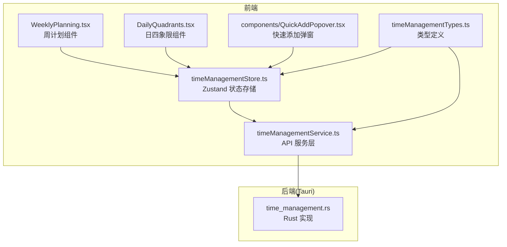
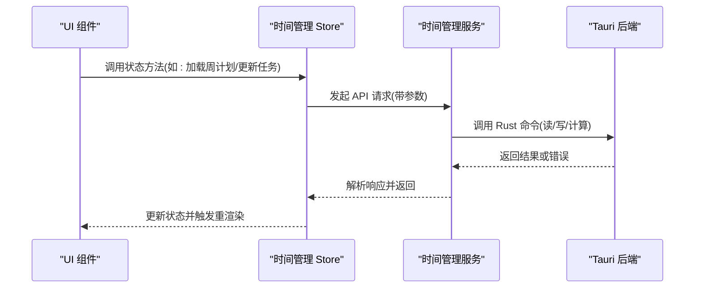
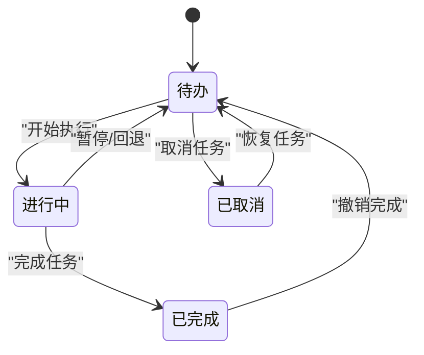
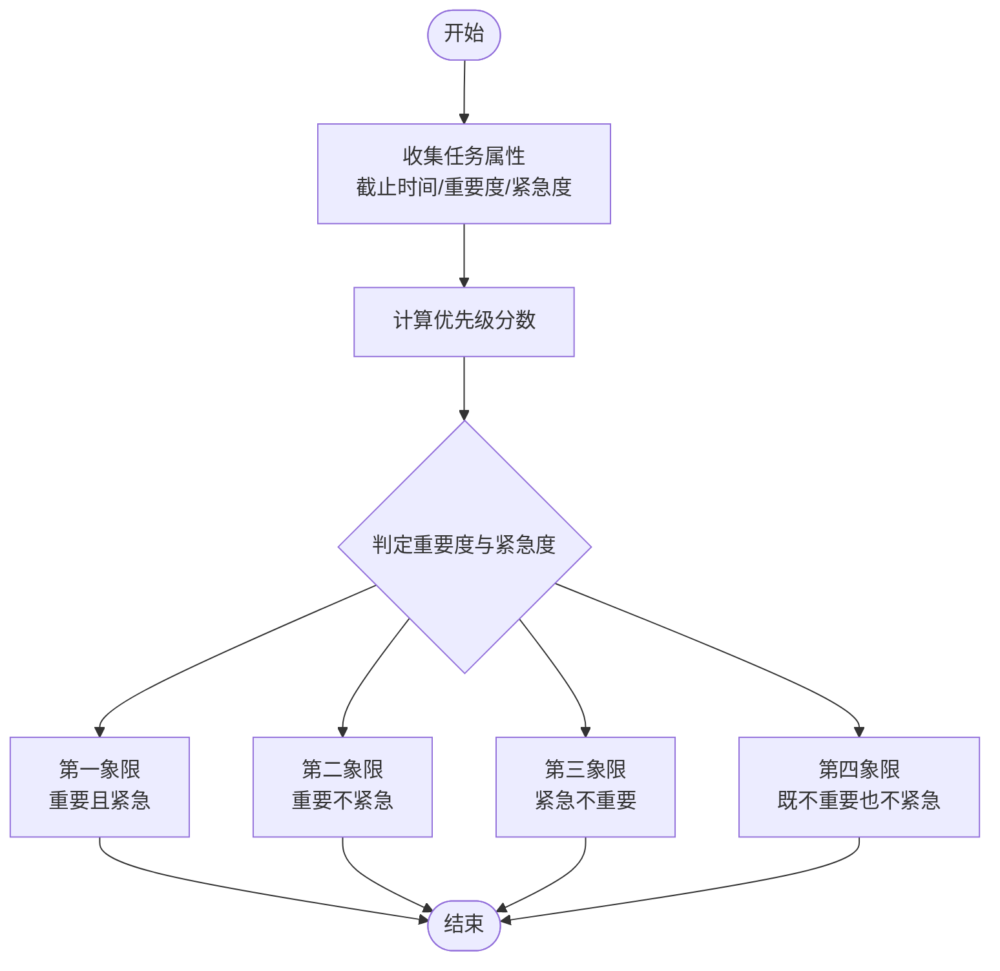
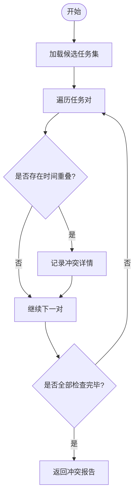
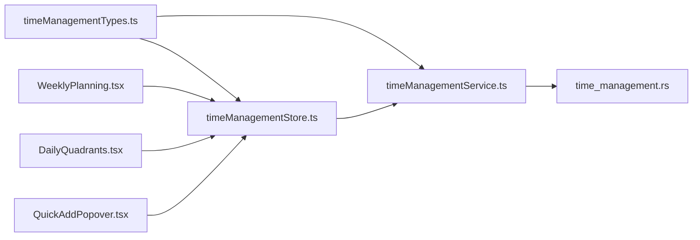

# 时间管理 API

<cite>
**本文引用的文件**   
- [src/features/time-management/timeManagementTypes.ts](file://src/features/time-management/timeManagementTypes.ts)
- [src/features/time-management/timeManagementService.ts](file://src/features/time-management/timeManagementService.ts)
- [src/features/time-management/timeManagementStore.ts](file://src/features/time-management/timeManagementStore.ts)
- [src/features/time-management/WeeklyPlanning.tsx](file://src/features/time-management/WeeklyPlanning.tsx)
- [src/features/time-management/DailyQuadrants.tsx](file://src/features/time-management/DailyQuadrants.tsx)
- [src/features/time-management/components/QuickAddPopover.tsx](file://src/features/time-management/components/QuickAddPopover.tsx)
- [src-tauri/src/time_management.rs](file://src-tauri/src/time_management.rs)
</cite>

## 目录
1. [简介](#简介)
2. [项目结构](#项目结构)
3. [核心组件](#核心组件)
4. [架构总览](#架构总览)
5. [详细组件分析](#详细组件分析)
6. [依赖分析](#依赖分析)
7. [性能考虑](#性能考虑)
8. [故障排查指南](#故障排查指南)
9. [结论](#结论)
10. [附录](#附录)

## 简介
本文件为“时间管理”功能模块的前端 API 接口文档，聚焦以下能力：
- 任务四象限分类（重要/紧急矩阵）
- 周计划生成与编辑
- 日计划管理与四象限视图
- 任务状态流转、优先级计算、时间冲突检测等关键业务逻辑的调用方式
- 周计划与日四象限组件的集成示例

说明：
- 前端通过服务层与服务仓库交互，后端由 Tauri Rust 提供持久化能力。
- 本文档以实际源码为依据，给出接口定义、参数与返回结构、错误处理与使用示例路径。

## 项目结构
时间管理相关代码位于 features/time-management 目录下，包含类型定义、服务层、状态存储、UI 组件；Tauri 后端在 src-tauri/src/time_management.rs 中实现。

图表来源
- [src/features/time-management/timeManagementTypes.ts](file://src/features/time-management/timeManagementTypes.ts)
- [src/features/time-management/timeManagementService.ts](file://src/features/time-management/timeManagementService.ts)
- [src/features/time-management/timeManagementStore.ts](file://src/features/time-management/timeManagementStore.ts)
- [src/features/time-management/WeeklyPlanning.tsx](file://src/features/time-management/WeeklyPlanning.tsx)
- [src/features/time-management/DailyQuadrants.tsx](file://src/features/time-management/DailyQuadrants.tsx)
- [src/features/time-management/components/QuickAddPopover.tsx](file://src/features/time-management/components/QuickAddPopover.tsx)
- [src-tauri/src/time_management.rs](file://src-tauri/src/time_management.rs)

章节来源
- [src/features/time-management/timeManagementTypes.ts](file://src/features/time-management/timeManagementTypes.ts)
- [src/features/time-management/timeManagementService.ts](file://src/features/time-management/timeManagementService.ts)
- [src/features/time-management/timeManagementStore.ts](file://src/features/time-management/timeManagementStore.ts)
- [src/features/time-management/WeeklyPlanning.tsx](file://src/features/time-management/WeeklyPlanning.tsx)
- [src/features/time-management/DailyQuadrants.tsx](file://src/features/time-management/DailyQuadrants.tsx)
- [src/features/time-management/components/QuickAddPopover.tsx](file://src/features/time-management/components/QuickAddPopover.tsx)
- [src-tauri/src/time_management.rs](file://src-tauri/src/time_management.rs)

## 核心组件
本节概述时间管理模块的核心职责与边界：
- 类型定义：统一任务、计划、四象限等数据结构
- 服务层：封装对外 API 调用（含 Tauri 命令），负责请求构造与响应解析
- 状态存储：基于 Zustand 维护应用级状态，暴露读写方法供 UI 消费
- UI 组件：周计划与日四象限展示与交互入口
- 快速添加：轻量弹窗用于快速创建任务并自动归类

章节来源
- [src/features/time-management/timeManagementTypes.ts](file://src/features/time-management/timeManagementTypes.ts)
- [src/features/time-management/timeManagementService.ts](file://src/features/time-management/timeManagementService.ts)
- [src/features/time-management/timeManagementStore.ts](file://src/features/time-management/timeManagementStore.ts)
- [src/features/time-management/WeeklyPlanning.tsx](file://src/features/time-management/WeeklyPlanning.tsx)
- [src/features/time-management/DailyQuadrants.tsx](file://src/features/time-management/DailyQuadrants.tsx)
- [src/features/time-management/components/QuickAddPopover.tsx](file://src/features/time-management/components/QuickAddPopover.tsx)

## 架构总览
前端采用“组件 -> Store -> Service -> Tauri 后端”的分层架构。UI 组件通过 Store 暴露的方法操作状态，Store 调用 Service 进行数据获取与变更，Service 最终通过 Tauri 命令与 Rust 后端通信完成持久化与复杂计算。

图表来源
- [src/features/time-management/timeManagementStore.ts](file://src/features/time-management/timeManagementStore.ts)
- [src/features/time-management/timeManagementService.ts](file://src/features/time-management/timeManagementService.ts)
- [src-tauri/src/time_management.rs](file://src-tauri/src/time_management.rs)

## 详细组件分析

### 数据类型模型
- 任务实体：包含唯一标识、标题、描述、开始/结束时间、优先级、四象限分类、状态、所属日期/周、标签等字段
- 计划实体：周计划与日计划的结构，包含日期范围、任务集合、备注等
- 四象限分类：按重要性与紧急性将任务归入四个象限
- 状态枚举：待办、进行中、已完成、已取消等
- 错误对象：统一错误码与消息

章节来源
- [src/features/time-management/timeManagementTypes.ts](file://src/features/time-management/timeManagementTypes.ts)

### 服务层 API 清单
以下为时间管理服务提供的核心接口（以函数名与参数/返回结构描述为主，具体签名请参考源文件）：

- 任务 CRUD
  - 新增任务
    - 输入：任务基本信息（标题、描述、起止时间、优先级、四象限、日期/周等）
    - 返回：创建后的任务实体
    - 校验：必填字段、时间区间合法性、重复 ID 检查
  - 更新任务
    - 输入：任务 ID 与需更新的字段
    - 返回：更新后的任务实体
    - 校验：存在性、时间区间合法性
  - 删除任务
    - 输入：任务 ID
    - 返回：成功标志
  - 批量更新任务
    - 输入：任务 ID 列表与目标状态/四象限等
    - 返回：更新统计

- 四象限分类
  - 计算四象限
    - 输入：日期或周范围、过滤条件
    - 返回：四象限分组结果（每个象限的任务列表）
  - 移动任务到象限
    - 输入：任务 ID、目标象限
    - 返回：更新后的任务

- 周计划
  - 生成周计划
    - 输入：起始日期、可选模板/规则
    - 返回：周计划实体（含每日任务建议）
  - 保存周计划
    - 输入：周计划实体
    - 返回：保存结果
  - 读取周计划
    - 输入：周范围
    - 返回：周计划实体

- 日计划
  - 生成日计划
    - 输入：日期、过滤条件
    - 返回：日计划实体（含四象限任务）
  - 保存日计划
    - 输入：日计划实体
    - 返回：保存结果
  - 读取日计划
    - 输入：日期
    - 返回：日计划实体

- 冲突检测与优先级
  - 检测时间冲突
    - 输入：任务列表或单个任务的起止时间
    - 返回：冲突详情（重叠区间、涉及任务）
  - 计算优先级
    - 输入：任务属性（截止时间、重要度、紧急度等）
    - 返回：优先级评分或等级

- 搜索与筛选
  - 查询任务
    - 输入：关键词、日期范围、状态、象限、标签等
    - 返回：任务列表

注意：
- 所有写操作均会触发本地状态同步与必要的冲突检测。
- 读操作支持分页与排序（如需要）。

章节来源
- [src/features/time-management/timeManagementService.ts](file://src/features/time-management/timeManagementService.ts)
- [src-tauri/src/time_management.rs](file://src-tauri/src/time_management.rs)

### 状态存储 Store
- 职责
  - 维护当前用户的时间管理数据（任务、周计划、日计划、四象限视图）
  - 暴露增删改查与批量操作方法
  - 在数据变更后触发 UI 更新
- 主要方法
  - 初始化与加载：根据当前日期/周加载数据
  - 任务操作：新增、更新、删除、批量更新
  - 计划操作：生成、保存、读取周/日计划
  - 视图操作：切换四象限、刷新冲突提示
- 副作用
  - 调用服务层进行持久化
  - 触发冲突检测与优先级重算

章节来源
- [src/features/time-management/timeManagementStore.ts](file://src/features/time-management/timeManagementStore.ts)

### 周计划组件 WeeklyPlanning
- 职责
  - 展示一周任务概览，支持拖拽调整、快速编辑
  - 提供“生成周计划”入口，依据规则与建议填充任务
  - 与 Store 联动，实时反映计划变更
- 关键交互
  - 点击“生成周计划”：调用服务层生成并保存到 Store
  - 拖拽任务至不同日期：触发更新与冲突检测
  - 打开任务详情：进入任务编辑流程

章节来源
- [src/features/time-management/WeeklyPlanning.tsx](file://src/features/time-management/WeeklyPlanning.tsx)
- [src/features/time-management/timeManagementStore.ts](file://src/features/time-management/timeManagementStore.ts)
- [src/features/time-management/timeManagementService.ts](file://src/features/time-management/timeManagementService.ts)

### 日四象限组件 DailyQuadrants
- 职责
  - 按重要/紧急矩阵展示当日任务
  - 支持跨象限移动任务、批量标记完成
  - 显示冲突警告与优先级提示
- 关键交互
  - 移动任务：更新四象限分类并触发冲突检测
  - 批量操作：统一更新状态或象限
  - 刷新视图：重新计算优先级与冲突

章节来源
- [src/features/time-management/DailyQuadrants.tsx](file://src/features/time-management/DailyQuadrants.tsx)
- [src/features/time-management/timeManagementStore.ts](file://src/features/time-management/timeManagementStore.ts)
- [src/features/time-management/timeManagementService.ts](file://src/features/time-management/timeManagementService.ts)

### 快速添加 QuickAddPopover
- 职责
  - 轻量弹窗快速录入任务信息
  - 自动推断四象限与优先级（若未指定）
  - 提交后即时加入对应日期/周计划
- 关键交互
  - 输入标题与时间：校验时间区间
  - 选择/自动分配象限：调用服务层计算
  - 提交：写入 Store 并持久化

章节来源
- [src/features/time-management/components/QuickAddPopover.tsx](file://src/features/time-management/components/QuickAddPopover.tsx)
- [src/features/time-management/timeManagementStore.ts](file://src/features/time-management/timeManagementStore.ts)
- [src/features/time-management/timeManagementService.ts](file://src/features/time-management/timeManagementService.ts)

### 任务状态流转

图表来源
- [src/features/time-management/timeManagementTypes.ts](file://src/features/time-management/timeManagementTypes.ts)
- [src/features/time-management/timeManagementStore.ts](file://src/features/time-management/timeManagementStore.ts)

### 优先级计算与四象限分类
- 优先级计算
  - 输入：截止时间、重要度、紧急度、剩余时间等
  - 输出：优先级评分或等级
  - 规则：越接近截止且重要度高则优先级越高
- 四象限分类
  - 输入：任务的重要度与紧急度
  - 输出：象限编号（1-4）
  - 规则：高重要+高紧急=第一象限，依此类推

图表来源
- [src/features/time-management/timeManagementTypes.ts](file://src/features/time-management/timeManagementTypes.ts)
- [src/features/time-management/timeManagementService.ts](file://src/features/time-management/timeManagementService.ts)

### 时间冲突检测
- 输入：任务起止时间与其他任务时间窗口
- 输出：冲突列表（重叠区间、涉及任务 ID）
- 策略：对同一时间段内的任务进行两两比较，记录重叠部分

图表来源
- [src/features/time-management/timeManagementService.ts](file://src/features/time-management/timeManagementService.ts)
- [src-tauri/src/time_management.rs](file://src-tauri/src/time_management.rs)

### 集成示例（组件调用）
- 周计划组件集成
  - 在页面中引入周计划组件，并通过 props 传入当前周范围
  - 监听“生成周计划”事件，调用服务层生成并保存到 Store
  - 使用 Store 的订阅机制实时更新 UI
- 日四象限组件集成
  - 在页面中引入日四象限组件，传入当前日期
  - 监听任务移动与批量操作事件，调用 Store 更新并触发冲突检测
  - 使用 Store 的状态驱动视图渲染

章节来源
- [src/features/time-management/WeeklyPlanning.tsx](file://src/features/time-management/WeeklyPlanning.tsx)
- [src/features/time-management/DailyQuadrants.tsx](file://src/features/time-management/DailyQuadrants.tsx)
- [src/features/time-management/timeManagementStore.ts](file://src/features/time-management/timeManagementStore.ts)
- [src/features/time-management/timeManagementService.ts](file://src/features/time-management/timeManagementService.ts)

## 依赖分析
- 组件依赖 Store：UI 组件仅依赖 Store 暴露的方法与状态，避免直接耦合服务层
- Store 依赖 Service：状态变更通过服务层进行数据持久化与复杂计算
- Service 依赖 Tauri 后端：读写与计算逻辑下沉到 Rust 实现，保证一致性与性能
- 类型定义被多处复用：确保前后端数据结构一致性

图表来源
- [src/features/time-management/timeManagementTypes.ts](file://src/features/time-management/timeManagementTypes.ts)
- [src/features/time-management/timeManagementService.ts](file://src/features/time-management/timeManagementService.ts)
- [src/features/time-management/timeManagementStore.ts](file://src/features/time-management/timeManagementStore.ts)
- [src/features/time-management/WeeklyPlanning.tsx](file://src/features/time-management/WeeklyPlanning.tsx)
- [src/features/time-management/DailyQuadrants.tsx](file://src/features/time-management/DailyQuadrants.tsx)
- [src/features/time-management/components/QuickAddPopover.tsx](file://src/features/time-management/components/QuickAddPopover.tsx)
- [src-tauri/src/time_management.rs](file://src-tauri/src/time_management.rs)

章节来源
- [src/features/time-management/timeManagementTypes.ts](file://src/features/time-management/timeManagementTypes.ts)
- [src/features/time-management/timeManagementService.ts](file://src/features/time-management/timeManagementService.ts)
- [src/features/time-management/timeManagementStore.ts](file://src/features/time-management/timeManagementStore.ts)
- [src/features/time-management/WeeklyPlanning.tsx](file://src/features/time-management/WeeklyPlanning.tsx)
- [src/features/time-management/DailyQuadrants.tsx](file://src/features/time-management/DailyQuadrants.tsx)
- [src/features/time-management/components/QuickAddPopover.tsx](file://src/features/time-management/components/QuickAddPopover.tsx)
- [src-tauri/src/time_management.rs](file://src-tauri/src/time_management.rs)

## 性能考虑
- 批量操作优先：减少多次网络/持久化调用，合并更新
- 懒加载与分页：大列表按需加载，避免一次性渲染过多节点
- 冲突检测优化：仅在必要时运行，缓存中间结果
- 状态更新最小化：Store 只更新必要字段，降低重渲染开销

[本节为通用指导，无需特定文件引用]

## 故障排查指南
- 常见错误
  - 时间区间非法：开始时间晚于结束时间
  - 任务不存在：更新或删除时 ID 无效
  - 冲突未解决：尝试保存导致冲突的任务
  - 权限/资源不可用：Tauri 后端访问失败
- 定位步骤
  - 查看服务层返回的错误对象，确认错误码与消息
  - 在 Store 中打印变更日志，确认状态是否正确更新
  - 检查 UI 组件的事件绑定与参数传递
  - 在后端日志中检索对应命令的执行结果

章节来源
- [src/features/time-management/timeManagementService.ts](file://src/features/time-management/timeManagementService.ts)
- [src/features/time-management/timeManagementStore.ts](file://src/features/time-management/timeManagementStore.ts)
- [src-tauri/src/time_management.rs](file://src-tauri/src/time_management.rs)

## 结论
时间管理模块通过清晰的分层架构与统一的类型定义，实现了任务四象限分类、周/日计划管理与冲突检测等核心能力。UI 组件与 Store 解耦良好，服务层集中处理业务逻辑与持久化，便于扩展与维护。建议在后续迭代中持续优化冲突检测与批量操作的体验，并提供更丰富的可视化反馈。

[本节为总结，无需特定文件引用]

## 附录
- 术语
  - 四象限：按重要性与紧急性划分的任务分类
  - 周计划：以周为单位规划任务集合
  - 日计划：以天为单位细化任务安排
- 参考路径
  - 类型定义：[src/features/time-management/timeManagementTypes.ts](file://src/features/time-management/timeManagementTypes.ts)
  - 服务层：[src/features/time-management/timeManagementService.ts](file://src/features/time-management/timeManagementService.ts)
  - 状态存储：[src/features/time-management/timeManagementStore.ts](file://src/features/time-management/timeManagementStore.ts)
  - 周计划组件：[src/features/time-management/WeeklyPlanning.tsx](file://src/features/time-management/WeeklyPlanning.tsx)
  - 日四象限组件：[src/features/time-management/DailyQuadrants.tsx](file://src/features/time-management/DailyQuadrants.tsx)
  - 快速添加弹窗：[src/features/time-management/components/QuickAddPopover.tsx](file://src/features/time-management/components/QuickAddPopover.tsx)
  - 后端实现：[src-tauri/src/time_management.rs](file://src-tauri/src/time_management.rs)