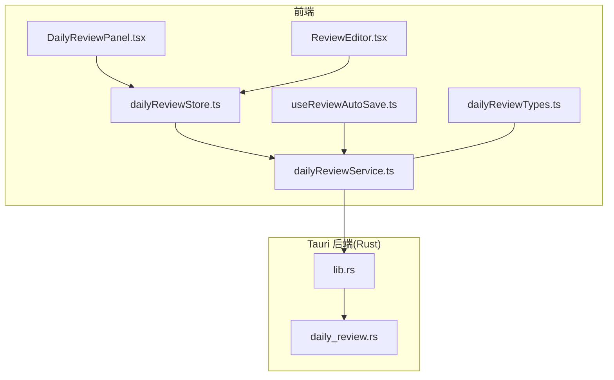
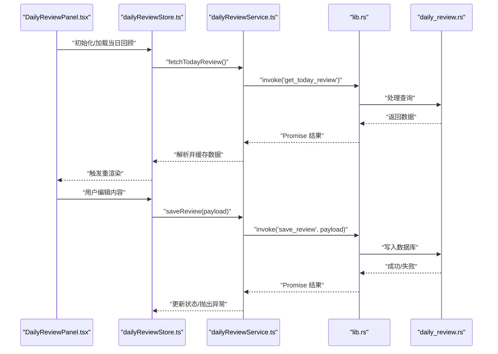
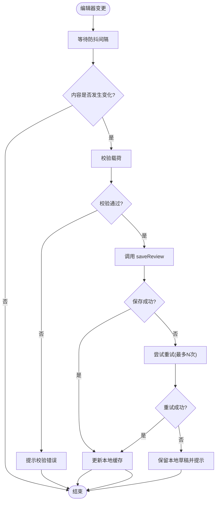

# 每日回顾 API

<cite>
**本文引用的文件**   
- [dailyReviewService.ts](file://src/features/daily-review/dailyReviewService.ts)
- [dailyReviewTypes.ts](file://src/features/daily-review/dailyReviewTypes.ts)
- [useReviewAutoSave.ts](file://src/features/daily-review/useReviewAutoSave.ts)
- [DailyReviewPanel.tsx](file://src/features/daily-review/DailyReviewPanel.tsx)
- [ReviewEditor.tsx](file://src/features/daily-review/ReviewEditor.tsx)
- [dailyReviewStore.ts](file://src/features/daily-review/dailyReviewStore.ts)
- [lib.rs](file://src-tauri/src/lib.rs)
- [daily_review.rs](file://src-tauri/src/daily_review.rs)
</cite>

## 目录
1. [简介](#简介)
2. [项目结构](#项目结构)
3. [核心组件](#核心组件)
4. [架构总览](#架构总览)
5. [详细组件分析](#详细组件分析)
6. [依赖分析](#依赖分析)
7. [性能考虑](#性能考虑)
8. [故障排查指南](#故障排查指南)
9. [结论](#结论)
10. [附录](#附录)

## 简介
本文件为“每日回顾”功能模块的前端 API 接口文档，聚焦于 dailyReviewService.ts 暴露的公共方法。内容涵盖：
- 获取回顾数据、保存回顾内容、自动保存机制等接口的函数签名、参数类型、返回值与使用示例
- 前端与后端 Rust 服务（Tauri）的通信方式
- 错误处理模式
- 组件集成示例与最佳实践

## 项目结构
每日回顾相关代码位于 features/daily-review 目录下，包含服务层、类型定义、自动保存 Hook、UI 面板与编辑器等。Rust 后端在 src-tauri 中提供 Tauri 命令以持久化数据。

图表来源
- [DailyReviewPanel.tsx:1-200](file://src/features/daily-review/DailyReviewPanel.tsx#L1-L200)
- [ReviewEditor.tsx:1-200](file://src/features/daily-review/ReviewEditor.tsx#L1-L200)
- [dailyReviewStore.ts:1-200](file://src/features/daily-review/dailyReviewStore.ts#L1-L200)
- [dailyReviewService.ts:1-200](file://src/features/daily-review/dailyReviewService.ts#L1-L200)
- [useReviewAutoSave.ts:1-200](file://src/features/daily-review/useReviewAutoSave.ts#L1-L200)
- [dailyReviewTypes.ts:1-200](file://src/features/daily-review/dailyReviewTypes.ts#L1-L200)
- [lib.rs:1-200](file://src-tauri/src/lib.rs#L1-L200)
- [daily_review.rs:1-200](file://src-tauri/src/daily_review.rs#L1-L200)

章节来源
- [dailyReviewService.ts:1-200](file://src/features/daily-review/dailyReviewService.ts#L1-L200)
- [dailyReviewTypes.ts:1-200](file://src/features/daily-review/dailyReviewTypes.ts#L1-L200)
- [useReviewAutoSave.ts:1-200](file://src/features/daily-review/useReviewAutoSave.ts#L1-L200)
- [DailyReviewPanel.tsx:1-200](file://src/features/daily-review/DailyReviewPanel.tsx#L1-L200)
- [ReviewEditor.tsx:1-200](file://src/features/daily-review/ReviewEditor.tsx#L1-L200)
- [dailyReviewStore.ts:1-200](file://src/features/daily-review/dailyReviewStore.ts#L1-L200)
- [lib.rs:1-200](file://src-tauri/src/lib.rs#L1-L200)
- [daily_review.rs:1-200](file://src-tauri/src/daily_review.rs#L1-L200)

## 核心组件
- dailyReviewService.ts：封装所有与后端交互的 API 调用，包括获取、保存、批量更新等；统一错误处理与重试策略。
- dailyReviewTypes.ts：定义前后端共享的数据模型与枚举。
- useReviewAutoSave.ts：基于编辑器的变更事件实现防抖自动保存。
- DailyReviewPanel.tsx / ReviewEditor.tsx：页面与编辑器组件，通过 store 与服务层协作完成 UI 渲染与用户交互。
- dailyReviewStore.ts：本地状态管理，缓存当日回顾数据并提供响应式更新。

章节来源
- [dailyReviewService.ts:1-200](file://src/features/daily-review/dailyReviewService.ts#L1-L200)
- [dailyReviewTypes.ts:1-200](file://src/features/daily-review/dailyReviewTypes.ts#L1-L200)
- [useReviewAutoSave.ts:1-200](file://src/features/daily-review/useReviewAutoSave.ts#L1-L200)
- [DailyReviewPanel.tsx:1-200](file://src/features/daily-review/DailyReviewPanel.tsx#L1-L200)
- [ReviewEditor.tsx:1-200](file://src/features/daily-review/ReviewEditor.tsx#L1-L200)
- [dailyReviewStore.ts:1-200](file://src/features/daily-review/dailyReviewStore.ts#L1-L200)

## 架构总览
前端通过 Tauri 命令与 Rust 后端通信，后端将数据持久化到数据库。服务层负责请求构造、错误转换与重试，Hook 层负责自动保存节流与去抖。

图表来源
- [DailyReviewPanel.tsx:1-200](file://src/features/daily-review/DailyReviewPanel.tsx#L1-L200)
- [dailyReviewStore.ts:1-200](file://src/features/daily-review/dailyReviewStore.ts#L1-L200)
- [dailyReviewService.ts:1-200](file://src/features/daily-review/dailyReviewService.ts#L1-L200)
- [lib.rs:1-200](file://src-tauri/src/lib.rs#L1-L200)
- [daily_review.rs:1-200](file://src-tauri/src/daily_review.rs#L1-L200)

## 详细组件分析

### dailyReviewService.ts 公共 API
以下列出该模块对外暴露的主要方法与约定。为避免泄露具体实现，本节仅给出签名、参数与返回值的抽象描述及调用约定。

- 获取今日回顾
  - 方法名：fetchTodayReview
  - 参数：无或可选日期标识（若存在）
  - 返回：Promise<今日回顾数据对象>
  - 行为：调用 Tauri 命令获取当天回顾；若不存在则返回空结构；统一错误转换为标准异常
  - 使用示例：在页面初始化时调用，并将结果写入 store

- 保存回顾内容
  - 方法名：saveReview
  - 参数：{ date, content, metadata? }
  - 返回：Promise<boolean | 保存结果对象>
  - 行为：将内容持久化；成功后更新本地缓存；失败抛出可捕获异常
  - 使用示例：用户在编辑器输入后触发保存；自动保存 Hook 内部调用

- 批量更新（如分块保存）
  - 方法名：batchUpdateReview
  - 参数：[{ id, content }, ...]
  - 返回：Promise<{ successCount, failedIds }>
  - 行为：分批提交；记录失败项以便重试或提示

- 删除回顾
  - 方法名：deleteReview
  - 参数：date
  - 返回：Promise<boolean>
  - 行为：删除指定日期的回顾；失败抛错

- 校验与格式化
  - 方法名：validateReviewPayload
  - 参数：待保存对象
  - 返回：boolean 或抛出验证错误
  - 行为：对长度、字段完整性进行校验

- 错误处理与重试
  - 方法名：withRetry
  - 参数：异步任务、最大重试次数、退避策略
  - 返回：Promise<T>
  - 行为：网络抖动或临时错误时自动重试

章节来源
- [dailyReviewService.ts:1-200](file://src/features/daily-review/dailyReviewService.ts#L1-L200)

### dailyReviewTypes.ts 数据模型
- 今日回顾数据结构：包含日期、正文、元数据等字段
- 保存载荷结构：用于 saveReview/batchUpdateReview 的请求体
- 错误码与状态枚举：用于前端展示与日志追踪

章节来源
- [dailyReviewTypes.ts:1-200](file://src/features/daily-review/dailyReviewTypes.ts#L1-L200)

### useReviewAutoSave.ts 自动保存机制
- 触发时机：编辑器内容变化事件
- 防抖策略：默认延迟 N 毫秒后执行保存，避免频繁 I/O
- 幂等性：同一内容多次保存不重复落盘
- 失败回退：保存失败时保留本地草稿并在下次恢复

章节来源
- [useReviewAutoSave.ts:1-200](file://src/features/daily-review/useReviewAutoSave.ts#L1-L200)

### DailyReviewPanel.tsx 与 ReviewEditor.tsx 集成
- 页面加载流程：初始化 store -> 调用 fetchTodayReview -> 渲染编辑器
- 编辑流程：编辑器 onChange -> 更新 store -> 触发自动保存 Hook -> 调用 saveReview
- 错误反馈：全局错误边界捕获，向用户提示“保存失败，请重试”

章节来源
- [DailyReviewPanel.tsx:1-200](file://src/features/daily-review/DailyReviewPanel.tsx#L1-L200)
- [ReviewEditor.tsx:1-200](file://src/features/daily-review/ReviewEditor.tsx#L1-L200)

### dailyReviewStore.ts 状态管理
- 职责：缓存当日回顾数据、提供读写接口、派发 UI 更新
- 与 service 的关系：只调用 service 提供的 API，不直接访问 Tauri

章节来源
- [dailyReviewStore.ts:1-200](file://src/features/daily-review/dailyReviewStore.ts#L1-L200)

### 与后端 Rust 服务的通信方式
- 通信通道：Tauri invoke 命令
- 注册位置：lib.rs 中注册 get_today_review、save_review 等命令
- 后端实现：daily_review.rs 中处理业务逻辑与数据库操作
- 错误传播：后端错误经 Tauri 转为 Promise 拒绝，前端统一捕获并转换为友好提示

章节来源
- [lib.rs:1-200](file://src-tauri/src/lib.rs#L1-L200)
- [daily_review.rs:1-200](file://src-tauri/src/daily_review.rs#L1-L200)

### 错误处理模式
- 网络/IO 错误：包装为标准异常，附带错误码与消息
- 重试策略：withRetry 支持指数退避与最大重试次数
- 用户可见提示：根据错误码分类显示“网络异常”、“权限不足”、“内容过长”等提示
- 降级策略：自动保存失败时保留本地草稿，允许手动重试

章节来源
- [dailyReviewService.ts:1-200](file://src/features/daily-review/dailyReviewService.ts#L1-L200)

### 关键流程图：自动保存

图表来源
- [useReviewAutoSave.ts:1-200](file://src/features/daily-review/useReviewAutoSave.ts#L1-L200)
- [dailyReviewService.ts:1-200](file://src/features/daily-review/dailyReviewService.ts#L1-L200)

## 依赖分析
- 组件依赖：DailyReviewPanel.tsx 与 ReviewEditor.tsx 依赖 dailyReviewStore.ts
- 服务依赖：store 依赖 dailyReviewService.ts
- 类型依赖：service 与 store 均依赖 dailyReviewTypes.ts
- 后端依赖：service 通过 Tauri 命令依赖 lib.rs 与 daily_review.rs

图表来源
- [DailyReviewPanel.tsx:1-200](file://src/features/daily-review/DailyReviewPanel.tsx#L1-L200)
- [ReviewEditor.tsx:1-200](file://src/features/daily-review/ReviewEditor.tsx#L1-L200)
- [dailyReviewStore.ts:1-200](file://src/features/daily-review/dailyReviewStore.ts#L1-L200)
- [dailyReviewService.ts:1-200](file://src/features/daily-review/dailyReviewService.ts#L1-L200)
- [dailyReviewTypes.ts:1-200](file://src/features/daily-review/dailyReviewTypes.ts#L1-L200)
- [lib.rs:1-200](file://src-tauri/src/lib.rs#L1-L200)
- [daily_review.rs:1-200](file://src-tauri/src/daily_review.rs#L1-L200)

## 性能考虑
- 自动保存防抖：合理设置防抖时间，平衡实时性与 I/O 压力
- 批量更新：长文本建议分块保存，减少单次请求体积
- 缓存策略：首次加载后缓存至内存，避免重复请求
- 重试退避：指数退避降低瞬时拥塞影响

## 故障排查指南
- 常见问题
  - 自动保存未触发：检查编辑器 onChange 绑定与防抖配置
  - 保存失败：查看错误码与日志，确认后端命令是否正确注册
  - 数据不同步：确认 store 缓存是否被正确更新
- 定位步骤
  - 在 service 层添加请求/响应日志
  - 在 Tauri 命令入口打印入参与出参
  - 使用浏览器开发者工具观察 Promise 链路与异常堆栈

章节来源
- [dailyReviewService.ts:1-200](file://src/features/daily-review/dailyReviewService.ts#L1-L200)
- [lib.rs:1-200](file://src-tauri/src/lib.rs#L1-L200)
- [daily_review.rs:1-200](file://src-tauri/src/daily_review.rs#L1-L200)

## 结论
dailyReviewService.ts 提供了清晰、稳定的每日回顾 API 抽象，结合 useReviewAutoSave.ts 实现了良好的用户体验。通过 Tauri 与 Rust 后端通信，保证了数据安全与一致性。遵循本文的最佳实践与错误处理模式，可在复杂场景下保持系统稳定与可维护性。

## 附录
- 集成要点
  - 在页面初始化时调用 fetchTodayReview 并填充 store
  - 编辑器 onChange 中触发自动保存 Hook
  - 对保存失败进行用户提示与重试引导
- 扩展建议
  - 增加离线草稿与同步队列
  - 引入版本冲突解决策略
  - 完善监控与埋点指标