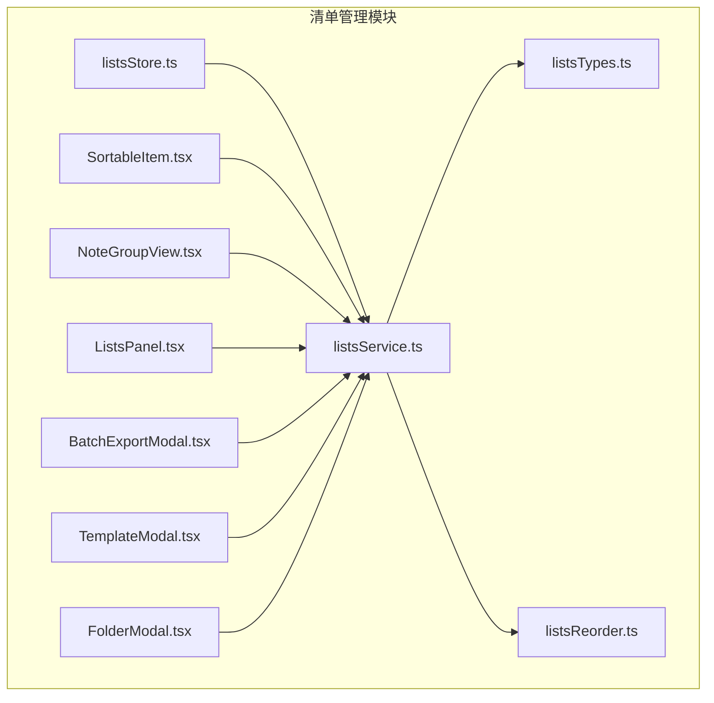
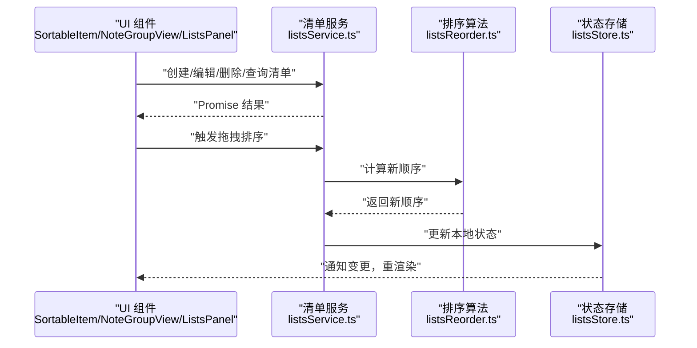
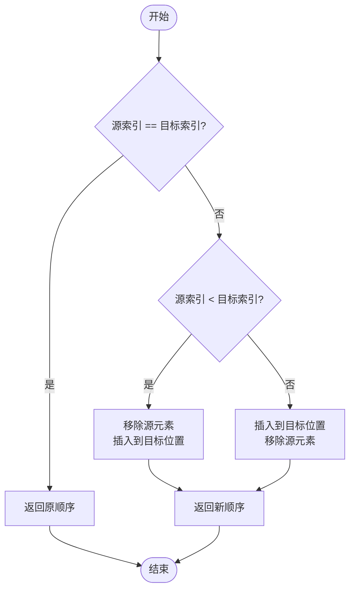
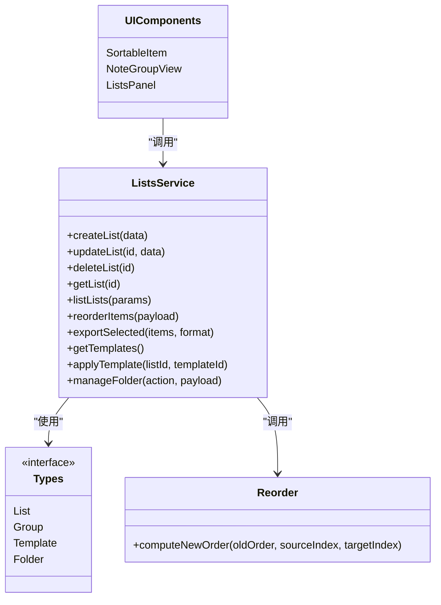

# 清单管理 API

<cite>
**本文引用的文件**   
- [listsService.ts](file://src/features/lists/listsService.ts)
- [listsTypes.ts](file://src/features/lists/listsTypes.ts)
- [listsStore.ts](file://src/features/lists/listsStore.ts)
- [listsReorder.ts](file://src/features/lists/listsReorder.ts)
- [SortableItem.tsx](file://src/features/lists/SortableItem.tsx)
- [NoteGroupView.tsx](file://src/features/lists/NoteGroupView.tsx)
- [ListsPanel.tsx](file://src/features/lists/ListsPanel.tsx)
- [BatchExportModal.tsx](file://src/features/lists/BatchExportModal.tsx)
- [TemplateModal.tsx](file://src/features/lists/TemplateModal.tsx)
- [FolderModal.tsx](file://src/features/lists/FolderModal.tsx)
</cite>

## 目录
1. [简介](#简介)
2. [项目结构](#项目结构)
3. [核心组件](#核心组件)
4. [架构总览](#架构总览)
5. [详细组件分析](#详细组件分析)
6. [依赖关系分析](#依赖关系分析)
7. [性能考虑](#性能考虑)
8. [故障排查指南](#故障排查指南)
9. [结论](#结论)
10. [附录](#附录)

## 简介
本文件为“清单管理”模块的前端 API 文档，聚焦于 listsService.ts 暴露的清单相关服务接口。内容覆盖清单的创建、编辑、删除、排序、批量导出、文件夹分类与模板系统等高级功能的使用方式，并提供列表组件集成示例与性能优化建议。读者无需深入源码即可理解如何调用这些能力并正确集成到界面中。

## 项目结构
清单管理模块位于 features/lists 目录下，核心文件职责如下：
- listsService.ts：对外暴露清单相关的服务方法（CRUD、排序、导出、模板、文件夹等）
- listsTypes.ts：类型定义（清单、分组、模板、文件夹等数据结构）
- listsStore.ts：状态管理与副作用协调（可选，用于 UI 层订阅与更新）
- listsReorder.ts：拖拽排序算法实现
- SortableItem.tsx / NoteGroupView.tsx / ListsPanel.tsx：UI 组件，负责渲染与交互
- BatchExportModal.tsx / TemplateModal.tsx / FolderModal.tsx：功能弹窗，封装批量导出、模板、文件夹操作

图表来源
- [listsService.ts](file://src/features/lists/listsService.ts)
- [listsTypes.ts](file://src/features/lists/listsTypes.ts)
- [listsStore.ts](file://src/features/lists/listsStore.ts)
- [listsReorder.ts](file://src/features/lists/listsReorder.ts)
- [SortableItem.tsx](file://src/features/lists/SortableItem.tsx)
- [NoteGroupView.tsx](file://src/features/lists/NoteGroupView.tsx)
- [ListsPanel.tsx](file://src/features/lists/ListsPanel.tsx)
- [BatchExportModal.tsx](file://src/features/lists/BatchExportModal.tsx)
- [TemplateModal.tsx](file://src/features/lists/TemplateModal.tsx)
- [FolderModal.tsx](file://src/features/lists/FolderModal.tsx)

章节来源
- [listsService.ts](file://src/features/lists/listsService.ts)
- [listsTypes.ts](file://src/features/lists/listsTypes.ts)
- [listsStore.ts](file://src/features/lists/listsStore.ts)
- [listsReorder.ts](file://src/features/lists/listsReorder.ts)
- [SortableItem.tsx](file://src/features/lists/SortableItem.tsx)
- [NoteGroupView.tsx](file://src/features/lists/NoteGroupView.tsx)
- [ListsPanel.tsx](file://src/features/lists/ListsPanel.tsx)
- [BatchExportModal.tsx](file://src/features/lists/BatchExportModal.tsx)
- [TemplateModal.tsx](file://src/features/lists/TemplateModal.tsx)
- [FolderModal.tsx](file://src/features/lists/FolderModal.tsx)

## 核心组件
- 清单服务（listsService.ts）
  - 提供清单的增删改查、排序、批量导出、模板应用、文件夹管理等方法
  - 返回 Promise，统一错误处理，支持回调或异步等待
- 类型系统（listsTypes.ts）
  - 定义清单项、分组、模板、文件夹等数据结构，确保前后端一致
- 排序算法（listsReorder.ts）
  - 基于拖拽事件计算目标位置，生成新的顺序数组
- UI 组件
  - SortableItem.tsx：单项可拖拽容器
  - NoteGroupView.tsx：按分组/文件夹聚合展示
  - ListsPanel.tsx：主面板，组合各子组件与服务调用
- 功能弹窗
  - BatchExportModal.tsx：批量导出清单数据
  - TemplateModal.tsx：选择并应用模板
  - FolderModal.tsx：创建/编辑文件夹分类

章节来源
- [listsService.ts](file://src/features/lists/listsService.ts)
- [listsTypes.ts](file://src/features/lists/listsTypes.ts)
- [listsReorder.ts](file://src/features/lists/listsReorder.ts)
- [SortableItem.tsx](file://src/features/lists/SortableItem.tsx)
- [NoteGroupView.tsx](file://src/features/lists/NoteGroupView.tsx)
- [ListsPanel.tsx](file://src/features/lists/ListsPanel.tsx)
- [BatchExportModal.tsx](file://src/features/lists/BatchExportModal.tsx)
- [TemplateModal.tsx](file://src/features/lists/TemplateModal.tsx)
- [FolderModal.tsx](file://src/features/lists/FolderModal.tsx)

## 架构总览
清单管理采用“服务 + 类型 + 算法 + UI”的分层设计：
- 服务层（listsService.ts）：封装业务逻辑与持久化调用
- 类型层（listsTypes.ts）：统一数据结构契约
- 算法层（listsReorder.ts）：独立排序算法，便于测试与复用
- UI 层：通过组件调用服务，驱动状态更新与视图渲染

图表来源
- [listsService.ts](file://src/features/lists/listsService.ts)
- [listsReorder.ts](file://src/features/lists/listsReorder.ts)
- [listsStore.ts](file://src/features/lists/listsStore.ts)
- [SortableItem.tsx](file://src/features/lists/SortableItem.tsx)
- [NoteGroupView.tsx](file://src/features/lists/NoteGroupView.tsx)
- [ListsPanel.tsx](file://src/features/lists/ListsPanel.tsx)

## 详细组件分析

### 清单服务接口（listsService.ts）
以下列出清单服务的主要接口类别与使用要点（以路径引用代替具体代码）：
- 清单基础操作
  - 创建清单：传入清单标题、描述、所属文件夹等字段，返回新建后的清单对象
  - 更新清单：传入清单 ID 与待修改字段，返回更新后的清单对象
  - 删除清单：传入清单 ID，返回成功标志
  - 获取清单详情：传入清单 ID，返回清单对象
  - 列举清单：支持分页、过滤（如按文件夹）、排序参数
- 排序与拖拽
  - 批量重排：接收旧顺序与新顺序映射，内部调用排序算法，返回最终顺序
  - 单项移动：指定源索引与目标索引，返回新顺序
- 批量导出
  - 导出选中清单：支持多种格式（如 JSON/CSV），返回下载链接或 Blob
- 模板系统
  - 获取模板列表：返回可用模板集合
  - 应用模板：将模板内容应用到指定清单，返回合并后的清单内容
- 文件夹分类
  - 创建/更新/删除文件夹
  - 将清单移动到指定文件夹
  - 按文件夹分组查询清单

使用约定
- 所有方法均返回 Promise，建议在调用处进行 try/catch 或 .catch 处理
- 错误码与消息在服务层统一封装，UI 层可直接提示用户
- 对于大数据量导出，建议使用流式或分片策略（由服务层实现）

章节来源
- [listsService.ts](file://src/features/lists/listsService.ts)

### 拖拽排序算法（listsReorder.ts）
- 输入
  - 当前顺序数组
  - 拖拽源索引
  - 目标索引
- 输出
  - 新的顺序数组
- 行为说明
  - 当源索引等于目标索引时，不改变顺序
  - 当源索引小于目标索引时，移除源元素后插入到目标位置
  - 当源索引大于目标索引时，先插入再移除，避免错位
- 复杂度
  - 时间 O(n)，空间 O(n)
- 适用场景
  - 列表项拖拽重排、分组内重排、跨组移动（需结合分组键）

图表来源
- [listsReorder.ts](file://src/features/lists/listsReorder.ts)

章节来源
- [listsReorder.ts](file://src/features/lists/listsReorder.ts)

### 列表组件集成示例
- SortableItem.tsx
  - 作为可拖拽容器，包裹单个清单项
  - 监听 onDragStart/onDragOver/onDrop 事件，调用服务层的排序接口
  - 在拖拽过程中提供视觉反馈（高亮、占位符）
- NoteGroupView.tsx
  - 按文件夹或分组聚合显示清单项
  - 支持组内拖拽与跨组移动（需要携带分组键）
  - 对空组提供“添加清单”入口
- ListsPanel.tsx
  - 组合上述组件，统一管理加载状态、错误提示与刷新
  - 提供批量操作入口（如批量导出、批量移动）

集成步骤
1. 在页面初始化时调用“列举清单”接口，填充初始数据
2. 为每个清单项绑定拖拽事件，调用“批量重排”或“单项移动”接口
3. 在模板弹窗中选择模板后，调用“应用模板”接口，刷新列表
4. 在文件夹弹窗中移动清单后，调用“按文件夹分组查询”接口，刷新视图
5. 批量导出时，调用“导出选中清单”接口，处理下载完成回调

章节来源
- [SortableItem.tsx](file://src/features/lists/SortableItem.tsx)
- [NoteGroupView.tsx](file://src/features/lists/NoteGroupView.tsx)
- [ListsPanel.tsx](file://src/features/lists/ListsPanel.tsx)

### 批量导出（BatchExportModal.tsx）
- 功能
  - 选择多个清单项，调用服务层导出接口
  - 支持选择导出格式（JSON/CSV）
  - 导出完成后提供下载链接或自动下载
- 使用要点
  - 大列表建议启用分页或增量导出
  - 导出期间禁用重复提交，防止重复请求
  - 失败时提供重试机制

章节来源
- [BatchExportModal.tsx](file://src/features/lists/BatchExportModal.tsx)
- [listsService.ts](file://src/features/lists/listsService.ts)

### 模板系统（TemplateModal.tsx）
- 功能
  - 展示可用模板列表
  - 预览模板内容
  - 将模板应用到目标清单
- 使用要点
  - 应用模板前进行冲突检测（如字段覆盖策略）
  - 支持撤销最近一次模板应用（如需）
  - 模板内容变更时，重新拉取最新模板列表

章节来源
- [TemplateModal.tsx](file://src/features/lists/TemplateModal.tsx)
- [listsService.ts](file://src/features/lists/listsService.ts)

### 文件夹分类（FolderModal.tsx）
- 功能
  - 创建/编辑/删除文件夹
  - 将清单移动到指定文件夹
  - 按文件夹分组查询清单
- 使用要点
  - 移动清单后，刷新分组视图
  - 删除文件夹时，确认是否迁移其下属清单

章节来源
- [FolderModal.tsx](file://src/features/lists/FolderModal.tsx)
- [listsService.ts](file://src/features/lists/listsService.ts)

## 依赖关系分析
- 服务层依赖类型定义，保证数据结构一致性
- UI 组件依赖服务层与排序算法
- 状态存储（可选）用于集中管理清单数据与副作用

图表来源
- [listsService.ts](file://src/features/lists/listsService.ts)
- [listsTypes.ts](file://src/features/lists/listsTypes.ts)
- [listsReorder.ts](file://src/features/lists/listsReorder.ts)
- [SortableItem.tsx](file://src/features/lists/SortableItem.tsx)
- [NoteGroupView.tsx](file://src/features/lists/NoteGroupView.tsx)
- [ListsPanel.tsx](file://src/features/lists/ListsPanel.tsx)

章节来源
- [listsService.ts](file://src/features/lists/listsService.ts)
- [listsTypes.ts](file://src/features/lists/listsTypes.ts)
- [listsReorder.ts](file://src/features/lists/listsReorder.ts)
- [SortableItem.tsx](file://src/features/lists/SortableItem.tsx)
- [NoteGroupView.tsx](file://src/features/lists/NoteGroupView.tsx)
- [ListsPanel.tsx](file://src/features/lists/ListsPanel.tsx)

## 性能考虑
- 列表渲染
  - 使用虚拟滚动或分页加载，减少首屏渲染压力
  - 对长列表启用 memo 与 key 稳定，避免不必要的重渲染
- 拖拽排序
  - 节流拖拽事件，降低频繁计算开销
  - 批量重排尽量合并多次移动为一次提交
- 批量导出
  - 大文件导出采用分块或流式传输
  - 导出前进行去重与校验，减少无效数据
- 网络请求
  - 并发控制，避免同时发起过多请求
  - 缓存热点数据（如模板列表、文件夹树），减少重复请求
- 状态管理
  - 局部更新而非全量替换，提升响应速度
  - 使用乐观更新配合回滚策略，改善用户体验

[本节为通用指导，不涉及具体文件分析]

## 故障排查指南
- 常见问题
  - 拖拽失效：检查拖拽事件绑定与排序算法参数是否正确
  - 导出失败：确认所选清单数量与格式兼容性，查看服务端返回的错误信息
  - 模板应用异常：核对模板版本与清单字段映射，必要时回滚上次应用
  - 文件夹移动后未刷新：确认分组查询接口被调用且状态已更新
- 调试建议
  - 在服务层增加日志记录关键参数与返回值
  - 在 UI 层打印事件序列与状态变化，定位时序问题
  - 对排序算法编写单元测试，覆盖边界情况（同索引、越界、空列表）

章节来源
- [listsService.ts](file://src/features/lists/listsService.ts)
- [listsReorder.ts](file://src/features/lists/listsReorder.ts)
- [BatchExportModal.tsx](file://src/features/lists/BatchExportModal.tsx)
- [TemplateModal.tsx](file://src/features/lists/TemplateModal.tsx)
- [FolderModal.tsx](file://src/features/lists/FolderModal.tsx)

## 结论
清单管理模块通过清晰的服务层接口、稳定的类型定义与独立的排序算法，提供了完整的清单 CRUD、排序、导出、模板与文件夹管理能力。UI 组件围绕服务层进行组合与交互，具备良好的扩展性与可维护性。遵循本文档的集成步骤与性能建议，可在实际项目中快速落地并保障用户体验。

[本节为总结，不涉及具体文件分析]

## 附录
- 术语
  - 清单：一个具体的任务或条目集合
  - 分组/文件夹：用于组织清单的分类维度
  - 模板：预定义的清单结构与内容，可快速应用到目标清单
- 参考路径
  - 清单服务接口：[listsService.ts](file://src/features/lists/listsService.ts)
  - 类型定义：[listsTypes.ts](file://src/features/lists/listsTypes.ts)
  - 排序算法：[listsReorder.ts](file://src/features/lists/listsReorder.ts)
  - 组件与弹窗：见“项目结构”部分所列文件

[本节为补充信息，不涉及具体文件分析]