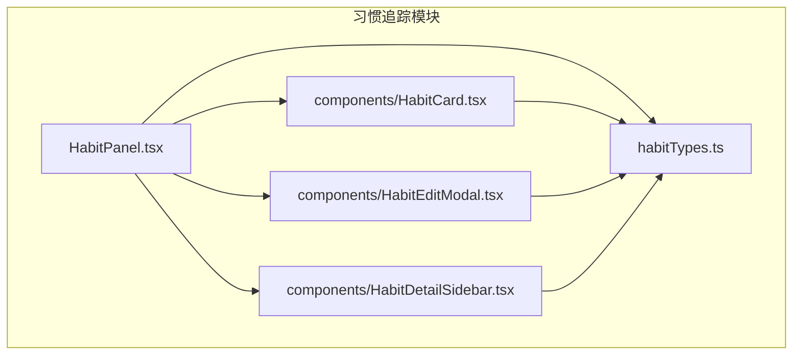
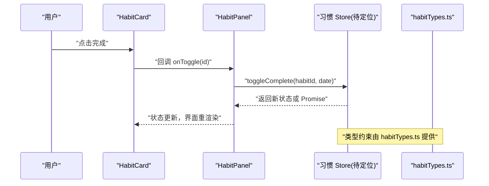
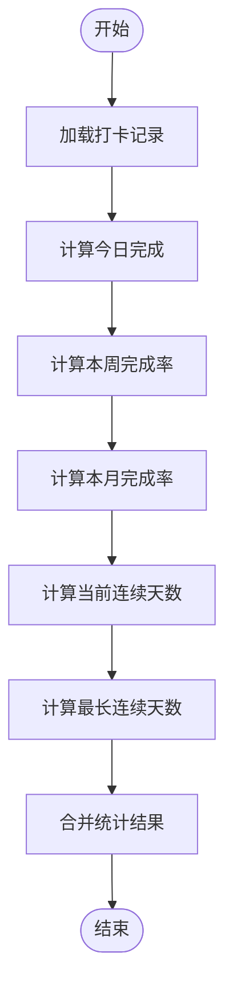
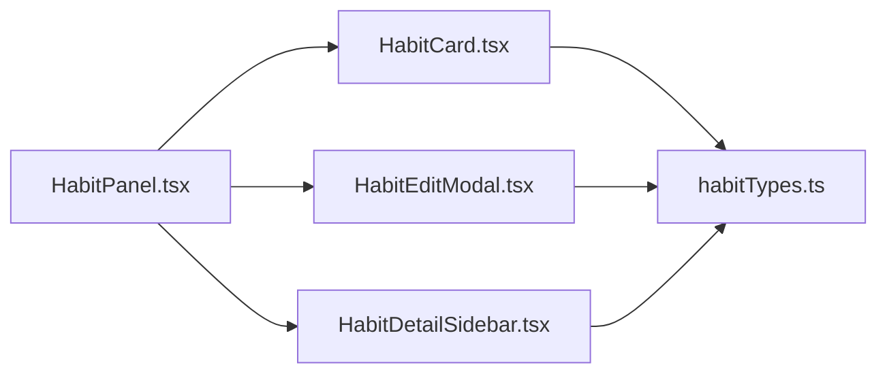

# 习惯追踪 Store API

<cite>
**本文引用的文件**   
- [habitTypes.ts](file://src/features/habits/habitTypes.ts)
- [HabitPanel.tsx](file://src/features/habits/HabitPanel.tsx)
- [HabitCard.tsx](file://src/features/habits/components/HabitCard.tsx)
- [HabitEditModal.tsx](file://src/features/habits/components/HabitEditModal.tsx)
- [HabitDetailSidebar.tsx](file://src/features/habits/components/HabitDetailSidebar.tsx)
- [Zustand_API_Interface_Doc.md](file://docx/Zustand_API_Interface_Doc.md)
- [习惯API接口文档.md](file://docx/习惯API接口文档.md)
</cite>

## 目录
1. [简介](#简介)
2. [项目结构](#项目结构)
3. [核心组件](#核心组件)
4. [架构总览](#架构总览)
5. [详细组件分析](#详细组件分析)
6. [依赖分析](#依赖分析)
7. [性能考虑](#性能考虑)
8. [故障排查指南](#故障排查指南)
9. [结论](#结论)
10. [附录](#附录)

## 简介
本文件为“习惯追踪模块”的 Zustand Store API 提供系统化、可操作的文档。内容涵盖：
- 习惯的创建、编辑、删除与完成状态管理
- 数据结构定义与 TypeScript 类型
- 统计信息计算、连续打卡记录与进度跟踪
- 分类管理与提醒设置
- 数据同步策略与实时更新机制
- 性能优化建议与常见问题排查

## 项目结构
习惯追踪功能位于 features/habits 目录下，包含页面入口、UI 组件与类型定义。Store 的具体实现与导出位置需结合仓库实际代码确认；本节先给出基于现有文件的组织概览。

图表来源
- [HabitPanel.tsx:1-200](file://src/features/habits/HabitPanel.tsx#L1-L200)
- [HabitCard.tsx:1-200](file://src/features/habits/components/HabitCard.tsx#L1-L200)
- [HabitEditModal.tsx:1-200](file://src/features/habits/components/HabitEditModal.tsx#L1-L200)
- [HabitDetailSidebar.tsx:1-200](file://src/features/habits/components/HabitDetailSidebar.tsx#L1-L200)
- [habitTypes.ts:1-200](file://src/features/habits/habitTypes.ts#L1-L200)

章节来源
- [HabitPanel.tsx:1-200](file://src/features/habits/HabitPanel.tsx#L1-L200)
- [habitTypes.ts:1-200](file://src/features/habits/habitTypes.ts#L1-L200)

## 核心组件
- HabitPanel：习惯列表页容器，负责渲染列表、打开编辑弹窗、展示详情侧边栏等。
- HabitCard：单条习惯卡片，承载完成操作、快速预览与跳转详情。
- HabitEditModal：新增/编辑习惯的模态框，提交后触发 Store 更新。
- HabitDetailSidebar：习惯详情面板，展示统计、连续打卡、历史打卡等。
- habitTypes.ts：习惯相关的数据结构与枚举类型定义。

章节来源
- [HabitPanel.tsx:1-200](file://src/features/habits/HabitPanel.tsx#L1-L200)
- [HabitCard.tsx:1-200](file://src/features/habits/components/HabitCard.tsx#L1-L200)
- [HabitEditModal.tsx:1-200](file://src/features/habits/components/HabitEditModal.tsx#L1-L200)
- [HabitDetailSidebar.tsx:1-200](file://src/features/habits/components/HabitDetailSidebar.tsx#L1-L200)
- [habitTypes.ts:1-200](file://src/features/habits/habitTypes.ts#L1-L200)

## 架构总览
下图展示了从 UI 到 Store 的典型调用路径（以“完成一次打卡”为例）。具体函数名与参数请以实际 Store 实现为准。

图表来源
- [HabitCard.tsx:1-200](file://src/features/habits/components/HabitCard.tsx#L1-L200)
- [HabitPanel.tsx:1-200](file://src/features/habits/HabitPanel.tsx#L1-L200)
- [habitTypes.ts:1-200](file://src/features/habits/habitTypes.ts#L1-L200)

## 详细组件分析

### 数据类型与类型定义
- 习惯实体字段建议包含：唯一标识、名称、描述、分类、是否启用、目标频率、提醒配置、创建/更新时间戳等。
- 打卡记录建议包含：日期、完成状态、备注等。
- 统计信息建议包含：今日完成、本周完成率、本月完成率、最长连续天数、当前连续天数等。
- 分类与提醒属于扩展属性，用于筛选与通知。

章节来源
- [habitTypes.ts:1-200](file://src/features/habits/habitTypes.ts#L1-L200)

### 习惯生命周期与操作方法
- 创建习惯
  - 入口：HabitEditModal 提交表单
  - 行为：校验输入 -> 调用 Store.createHabit -> 持久化 -> 刷新列表
- 编辑习惯
  - 入口：HabitEditModal 加载已有数据
  - 行为：校验差异 -> 调用 Store.updateHabit -> 持久化 -> 刷新视图
- 删除习惯
  - 入口：HabitPanel 或 HabitDetailSidebar 的删除按钮
  - 行为：二次确认 -> 调用 Store.deleteHabit -> 持久化 -> 清理缓存
- 完成/取消完成
  - 入口：HabitCard 的勾选操作
  - 行为：调用 Store.toggleComplete -> 更新当日打卡 -> 重新计算统计

章节来源
- [HabitEditModal.tsx:1-200](file://src/features/habits/components/HabitEditModal.tsx#L1-L200)
- [HabitPanel.tsx:1-200](file://src/features/habits/HabitPanel.tsx#L1-L200)
- [HabitCard.tsx:1-200](file://src/features/habits/components/HabitCard.tsx#L1-L200)

### 统计信息计算与进度跟踪
- 统计维度
  - 日维度：今日是否完成、当日打卡次数
  - 周维度：本周完成率、每周趋势
  - 月维度：月度完成率、月度趋势
- 连续打卡
  - 当前连续天数：从最近一次完成向前回溯连续完成的天数
  - 最长连续天数：历史最大连续完成天数
- 进度跟踪
  - 按目标频率计算每日/每周/每月应完成次数与实际完成次数
  - 可视化进度条与里程碑提示

图表来源
- [HabitDetailSidebar.tsx:1-200](file://src/features/habits/components/HabitDetailSidebar.tsx#L1-L200)
- [habitTypes.ts:1-200](file://src/features/habits/habitTypes.ts#L1-L200)

### 分类管理与提醒设置
- 分类管理
  - 支持多分类标签，便于筛选与聚合统计
  - 分类变更时触发列表过滤与统计重算
- 提醒设置
  - 支持时间、重复规则与渠道（本地通知/站内消息）
  - 提醒触发后更新“已读/未读”状态并联动 UI

章节来源
- [habitTypes.ts:1-200](file://src/features/habits/habitTypes.ts#L1-L200)
- [HabitEditModal.tsx:1-200](file://src/features/habits/components/HabitEditModal.tsx#L1-L200)

### 数据同步与实时更新
- 同步策略
  - 本地优先：所有写操作先落盘，再异步同步远端
  - 冲突解决：以服务端时间为基准进行合并
- 实时更新
  - Store 订阅变化，通过细粒度选择器避免不必要重渲染
  - 批量更新使用事务式更新减少中间状态抖动

章节来源
- [Zustand_API_Interface_Doc.md:1-200](file://docx/Zustand_API_Interface_Doc.md#L1-L200)
- [习惯API接口文档.md:1-200](file://docx/习惯API接口文档.md#L1-L200)

## 依赖分析
- 组件耦合
  - HabitPanel 作为编排层，组合卡片、弹窗与详情面板
  - 各子组件仅依赖类型定义与 Store 暴露的方法
- 外部依赖
  - 持久化与同步逻辑可能依赖后端服务或本地存储引擎
  - 提醒系统可能依赖系统通知能力

图表来源
- [HabitPanel.tsx:1-200](file://src/features/habits/HabitPanel.tsx#L1-L200)
- [HabitCard.tsx:1-200](file://src/features/habits/components/HabitCard.tsx#L1-L200)
- [HabitEditModal.tsx:1-200](file://src/features/habits/components/HabitEditModal.tsx#L1-L200)
- [HabitDetailSidebar.tsx:1-200](file://src/features/habits/components/HabitDetailSidebar.tsx#L1-L200)
- [habitTypes.ts:1-200](file://src/features/habits/habitTypes.ts#L1-L200)

## 性能考虑
- 选择器粒度
  - 使用最小必要选择器订阅状态，避免整树重渲染
- 批量更新
  - 将多次修改合并为单次状态更新，减少中间渲染
- 计算缓存
  - 对耗时统计采用惰性计算与结果缓存，仅在依赖项变化时重算
- 列表虚拟化
  - 长列表场景下按需渲染可见区域
- 网络去抖
  - 高频操作（如频繁打卡）对同步请求做节流/合并

[本节为通用指导，不直接分析具体文件]

## 故障排查指南
- 常见错误
  - 类型不匹配：检查 habitTypes.ts 中字段是否与 Store 契约一致
  - 状态不同步：确认 Store 方法是否正确返回新状态或 Promise
  - 统计异常：核对日期边界处理与时区问题
- 调试建议
  - 在关键方法前后打印入参与返回值
  - 使用浏览器 DevTools 观察 Store 快照差异
  - 对统计计算增加单元测试覆盖边界用例

章节来源
- [habitTypes.ts:1-200](file://src/features/habits/habitTypes.ts#L1-L200)
- [Zustand_API_Interface_Doc.md:1-200](file://docx/Zustand_API_Interface_Doc.md#L1-L200)

## 结论
本模块围绕“习惯”这一核心实体，提供了完整的 CRUD、打卡与统计能力。通过清晰的类型定义与合理的 Store 设计，实现了良好的可维护性与可扩展性。建议在后续迭代中完善统计算法的单元测试、强化数据同步的冲突处理，并持续优化渲染性能。

[本节为总结性内容，不直接分析具体文件]

## 附录

### API 参考（概念性）
以下为概念性 API 清单，具体函数名与参数请以实际 Store 实现为准：
- 习惯管理
  - createHabit(data): Promise<Habit>
  - updateHabit(id, patch): Promise<Habit>
  - deleteHabit(id): Promise<void>
  - getHabits(filter?): Habit[]
- 打卡与统计
  - toggleComplete(habitId, date): Promise<void>
  - getDailyRecord(habitId, date): Record | null
  - getWeeklyStats(habitId, weekRange): Stats
  - getMonthlyStats(habitId, monthRange): Stats
  - getStreaks(habitId): { current, best }
- 分类与提醒
  - setCategory(habitId, category): Promise<void>
  - setReminder(habitId, reminderConfig): Promise<void>
  - markReminderRead(habitId, reminderId): Promise<void>

章节来源
- [Zustand_API_Interface_Doc.md:1-200](file://docx/Zustand_API_Interface_Doc.md#L1-L200)
- [习惯API接口文档.md:1-200](file://docx/习惯API接口文档.md#L1-L200)

### 使用示例（步骤说明）
- 新建习惯
  - 打开 HabitEditModal，填写名称、分类、提醒等
  - 提交后调用 createHabit，成功后关闭弹窗并刷新列表
- 完成打卡
  - 在 HabitCard 上点击完成，调用 toggleComplete
  - 自动更新今日统计与连续天数
- 查看统计
  - 在 HabitDetailSidebar 中查看日/周/月统计与连续打卡情况
- 修改分类与提醒
  - 在 HabitEditModal 中调整分类与提醒配置，保存后生效

章节来源
- [HabitEditModal.tsx:1-200](file://src/features/habits/components/HabitEditModal.tsx#L1-L200)
- [HabitCard.tsx:1-200](file://src/features/habits/components/HabitCard.tsx#L1-L200)
- [HabitDetailSidebar.tsx:1-200](file://src/features/habits/components/HabitDetailSidebar.tsx#L1-L200)