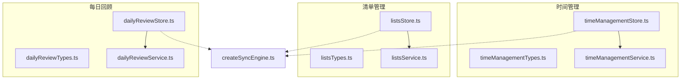
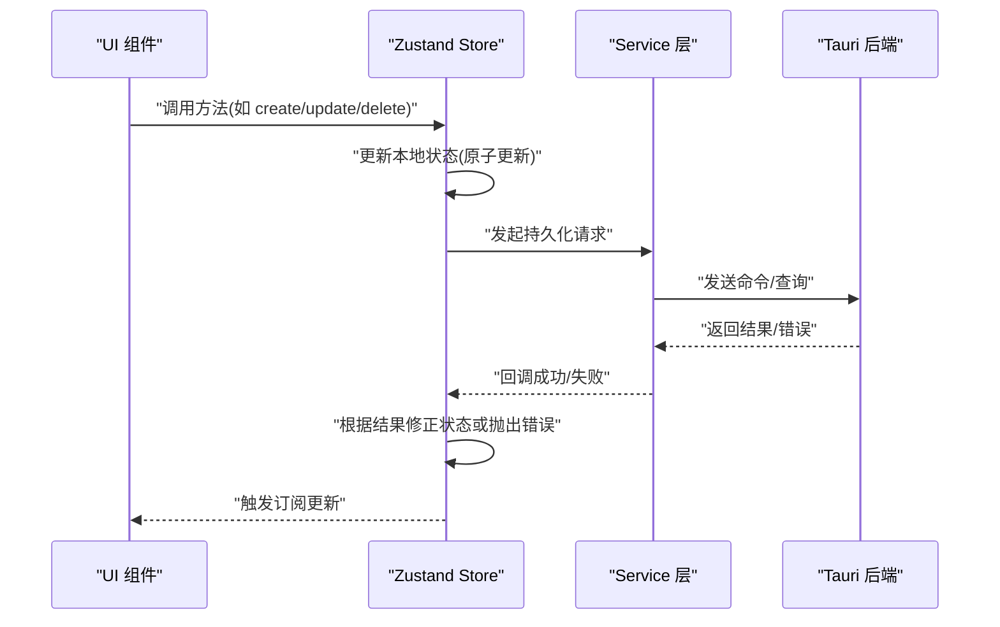
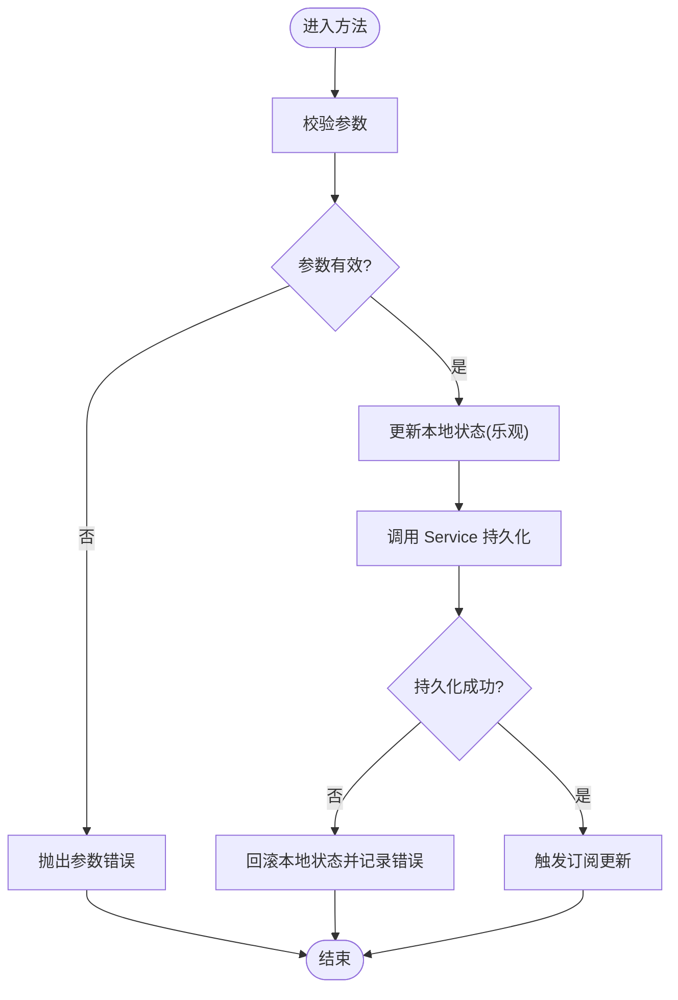
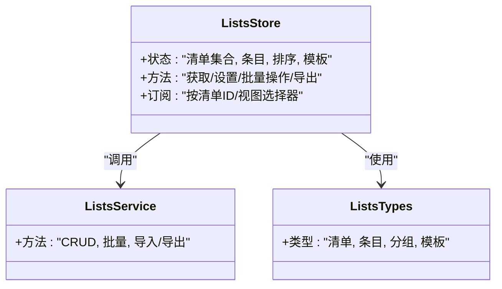
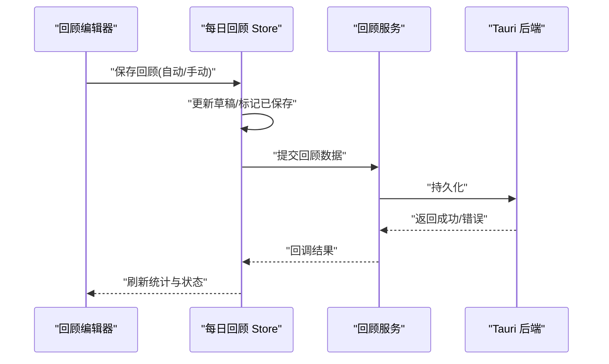
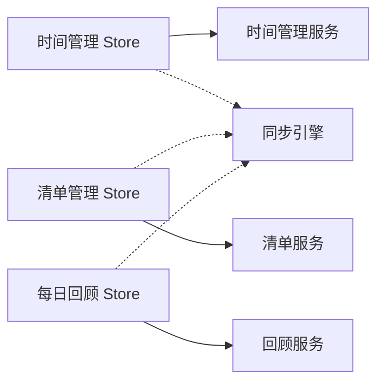

# 前端 Store API

<cite>
**本文引用的文件**   
- [timeManagementStore.ts](file://src/features/time-management/timeManagementStore.ts)
- [timeManagementTypes.ts](file://src/features/time-management/timeManagementTypes.ts)
- [timeManagementService.ts](file://src/features/time-management/timeManagementService.ts)
- [listsStore.ts](file://src/features/lists/listsStore.ts)
- [listsTypes.ts](file://src/features/lists/listsTypes.ts)
- [listsService.ts](file://src/features/lists/listsService.ts)
- [dailyReviewStore.ts](file://src/features/daily-review/dailyReviewStore.ts)
- [dailyReviewTypes.ts](file://src/features/daily-review/dailyReviewTypes.ts)
- [dailyReviewService.ts](file://src/features/daily-review/dailyReviewService.ts)
- [createSyncEngine.ts](file://src/lib/createSyncEngine.ts)
</cite>

## 目录
1. [简介](#简介)
2. [项目结构](#项目结构)
3. [核心组件](#核心组件)
4. [架构总览](#架构总览)
5. [详细组件分析](#详细组件分析)
6. [依赖关系分析](#依赖关系分析)
7. [性能考虑](#性能考虑)
8. [故障排查指南](#故障排查指南)
9. [结论](#结论)
10. [附录](#附录)

## 简介
本文件为 FishWorker 前端 Zustand Store API 的权威文档，覆盖以下功能域：
- 时间管理（Time Management）
- 习惯追踪（Habits）
- 清单管理（Lists）
- 每日回顾（Daily Review）

文档将详细说明每个 Store 的状态结构、操作方法（get/set）、订阅机制与事件处理；提供完整的 TypeScript 类型定义说明与使用示例；并给出异步操作处理、错误处理策略、性能优化技巧，以及状态持久化、数据同步和并发访问控制的最佳实践。

## 项目结构
各功能域的 Store 位于 features 目录下，按领域划分：
- time-management: 时间管理相关 Store、类型与服务
- lists: 清单管理相关 Store、类型与服务
- daily-review: 每日回顾相关 Store、类型与服务
- habits: 习惯追踪（当前以 UI 为主，未包含独立 Store）

图表来源
- [timeManagementStore.ts](file://src/features/time-management/timeManagementStore.ts)
- [timeManagementTypes.ts](file://src/features/time-management/timeManagementTypes.ts)
- [timeManagementService.ts](file://src/features/time-management/timeManagementService.ts)
- [listsStore.ts](file://src/features/lists/listsStore.ts)
- [listsTypes.ts](file://src/features/lists/listsTypes.ts)
- [listsService.ts](file://src/features/lists/listsService.ts)
- [dailyReviewStore.ts](file://src/features/daily-review/dailyReviewStore.ts)
- [dailyReviewTypes.ts](file://src/features/daily-review/dailyReviewTypes.ts)
- [dailyReviewService.ts](file://src/features/daily-review/dailyReviewService.ts)
- [createSyncEngine.ts](file://src/lib/createSyncEngine.ts)

章节来源
- [timeManagementStore.ts](file://src/features/time-management/timeManagementStore.ts)
- [listsStore.ts](file://src/features/lists/listsStore.ts)
- [dailyReviewStore.ts](file://src/features/daily-review/dailyReviewStore.ts)
- [createSyncEngine.ts](file://src/lib/createSyncEngine.ts)

## 核心组件
- 时间管理 Store：维护任务/日程等状态，提供增删改查、分组、筛选等方法，并与后端服务交互完成持久化。
- 清单管理 Store：维护清单集合与条目，支持批量操作、排序、导出等能力。
- 每日回顾 Store：维护回顾内容、统计摘要等，支持编辑与保存。
- 同步引擎：提供跨 Store 的数据同步与一致性保障（可选接入）。

章节来源
- [timeManagementStore.ts](file://src/features/time-management/timeManagementStore.ts)
- [listsStore.ts](file://src/features/lists/listsStore.ts)
- [dailyReviewStore.ts](file://src/features/daily-review/dailyReviewStore.ts)
- [createSyncEngine.ts](file://src/lib/createSyncEngine.ts)

## 架构总览
Zustand Store 作为单一事实来源，通过 Service 层与 Tauri 后端通信，必要时借助同步引擎进行跨模块数据协调。UI 组件通过 useStore 选择器订阅所需切片，避免不必要的重渲染。

图表来源
- [timeManagementStore.ts](file://src/features/time-management/timeManagementStore.ts)
- [listsStore.ts](file://src/features/lists/listsStore.ts)
- [dailyReviewStore.ts](file://src/features/daily-review/dailyReviewStore.ts)
- [timeManagementService.ts](file://src/features/time-management/timeManagementService.ts)
- [listsService.ts](file://src/features/lists/listsService.ts)
- [dailyReviewService.ts](file://src/features/daily-review/dailyReviewService.ts)

## 详细组件分析

### 时间管理 Store
- 状态结构
  - 任务列表、分组、筛选条件、选中项、加载状态、错误信息等。
- 关键方法
  - 获取：按日期/分组/标签查询任务
  - 设置：创建、更新、删除任务；批量移动/归档
  - 订阅：基于选择器的细粒度订阅
  - 事件：在任务变更时触发同步或通知
- 类型定义
  - 参考类型文件中的实体、枚举、接口定义。
- 异步处理
  - 所有写操作均通过 Service 层执行，并在完成后回写本地状态。
- 错误处理
  - 统一捕获异常，记录错误信息并暴露给 UI 展示。
- 性能优化
  - 使用选择器最小化订阅范围；批量更新合并；防抖/节流高频操作。

图表来源
- [timeManagementStore.ts](file://src/features/time-management/timeManagementStore.ts)
- [timeManagementService.ts](file://src/features/time-management/timeManagementService.ts)

章节来源
- [timeManagementStore.ts](file://src/features/time-management/timeManagementStore.ts)
- [timeManagementTypes.ts](file://src/features/time-management/timeManagementTypes.ts)
- [timeManagementService.ts](file://src/features/time-management/timeManagementService.ts)

### 清单管理 Store
- 状态结构
  - 清单集合、条目数组、排序顺序、模板、导入/导出配置等。
- 关键方法
  - 获取：按文件夹/标签/状态检索清单
  - 设置：新增、编辑、删除、批量移动、排序、模板应用
  - 订阅：按清单 ID 或视图维度订阅
  - 事件：在清单变更时触发同步或导出
- 类型定义
  - 参考类型文件中的清单、条目、分组等实体。
- 异步处理
  - 批量操作采用事务式更新，确保一致性与可回滚。
- 错误处理
  - 对 I/O 与网络错误进行分类处理，并提供重试提示。
- 性能优化
  - 大列表虚拟滚动配合选择器；增量更新；去抖动批量写入。

图表来源
- [listsStore.ts](file://src/features/lists/listsStore.ts)
- [listsService.ts](file://src/features/lists/listsService.ts)
- [listsTypes.ts](file://src/features/lists/listsTypes.ts)

章节来源
- [listsStore.ts](file://src/features/lists/listsStore.ts)
- [listsTypes.ts](file://src/features/lists/listsTypes.ts)
- [listsService.ts](file://src/features/lists/listsService.ts)

### 每日回顾 Store
- 状态结构
  - 回顾内容、统计摘要、最近编辑时间、草稿缓存等。
- 关键方法
  - 获取：按日期拉取回顾内容与统计
  - 设置：保存回顾、更新统计、清空草稿
  - 订阅：按日期或视图订阅
  - 事件：在保存成功后触发同步或提醒
- 类型定义
  - 参考类型文件中的回顾实体、统计字段等。
- 异步处理
  - 自动草稿与手动保存分离，避免阻塞用户输入。
- 错误处理
  - 区分网络错误与数据冲突，提供“重试”和“保留草稿”策略。
- 性能优化
  - 只订阅当前日期的回顾；统计计算延迟到可见时触发。

图表来源
- [dailyReviewStore.ts](file://src/features/daily-review/dailyReviewStore.ts)
- [dailyReviewService.ts](file://src/features/daily-review/dailyReviewService.ts)

章节来源
- [dailyReviewStore.ts](file://src/features/daily-review/dailyReviewStore.ts)
- [dailyReviewTypes.ts](file://src/features/daily-review/dailyReviewTypes.ts)
- [dailyReviewService.ts](file://src/features/daily-review/dailyReviewService.ts)

### 习惯追踪（Habits）
- 现状说明
  - 当前仓库中习惯追踪以 UI 组件为主，未见独立 Store 实现。若后续引入状态管理，建议遵循上述 Store 设计模式，保持与时间管理、清单管理一致的接口风格。
- 建议
  - 如需扩展，可新建 habitStore.ts，复用 createSyncEngine 进行数据同步，并参照现有 Store 的错误与性能策略。

[本节不直接分析具体源码文件]

## 依赖关系分析
- Store 与 Service 解耦：Store 仅负责状态与调度，Service 封装与后端的交互逻辑。
- 类型集中管理：各域 types 文件定义共享类型，避免重复声明。
- 可选同步引擎：通过 createSyncEngine 提供跨 Store 的一致性保障（按需启用）。

图表来源
- [timeManagementStore.ts](file://src/features/time-management/timeManagementStore.ts)
- [listsStore.ts](file://src/features/lists/listsStore.ts)
- [dailyReviewStore.ts](file://src/features/daily-review/dailyReviewStore.ts)
- [timeManagementService.ts](file://src/features/time-management/timeManagementService.ts)
- [listsService.ts](file://src/features/lists/listsService.ts)
- [dailyReviewService.ts](file://src/features/daily-review/dailyReviewService.ts)
- [createSyncEngine.ts](file://src/lib/createSyncEngine.ts)

章节来源
- [timeManagementStore.ts](file://src/features/time-management/timeManagementStore.ts)
- [listsStore.ts](file://src/features/lists/listsStore.ts)
- [dailyReviewStore.ts](file://src/features/daily-review/dailyReviewStore.ts)
- [createSyncEngine.ts](file://src/lib/createSyncEngine.ts)

## 性能考虑
- 选择器订阅：使用最小粒度的选择器，避免整树重渲染。
- 批量更新：合并多次写入，减少中间态闪烁。
- 懒加载与分页：大数据集按需加载，结合虚拟滚动。
- 防抖/节流：对高频输入（搜索、过滤）进行节流。
- 计算缓存：复杂统计结果缓存，仅在依赖变化时重新计算。
- 乐观更新与回滚：先更新 UI，再持久化，失败时回滚。

[本节提供通用指导，无需源码引用]

## 故障排查指南
- 常见问题
  - 状态不同步：检查 Service 层是否成功回调，确认错误分支是否回滚。
  - 重复渲染：确认选择器是否正确拆分，避免每次创建新函数。
  - 并发冲突：对同一资源的并发修改需加锁或队列化处理。
- 定位步骤
  - 在 Store 方法入口与出口打印关键日志。
  - 使用浏览器调试工具观察状态快照差异。
  - 复现路径最小化，隔离问题域。
- 恢复策略
  - 提供撤销/重做能力；保留草稿；失败重试与降级显示。

[本节提供通用指导，无需源码引用]

## 结论
FishWorker 前端的 Store 体系以领域为边界，采用 Store-Service 分层与类型集中管理，具备良好的可扩展性与可维护性。通过选择器订阅、批量更新、乐观更新与错误回滚等策略，可在保证一致性的同时提升用户体验。建议在后续开发中持续完善同步引擎与并发控制，进一步提升多端一致性与鲁棒性。

[本节总结性内容，无需源码引用]

## 附录
- 使用示例（概念性）
  - 时间管理：创建一个任务，立即在 UI 可见，随后持久化；失败则回滚并提示。
  - 清单管理：批量移动多个条目，使用事务式更新，失败整体回滚。
  - 每日回顾：自动保存草稿，手动保存时更新统计摘要。
- 最佳实践清单
  - 始终使用选择器订阅最小必要状态。
  - 写操作走 Service 层，Store 只做状态编排。
  - 对幂等操作进行去重，避免重复请求。
  - 对敏感操作增加二次确认与审计日志。
  - 对大数据集采用分页与懒加载。

[本节提供通用指导，无需源码引用]