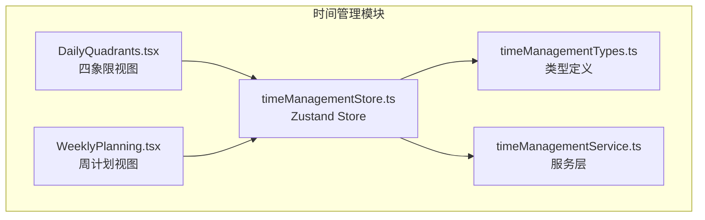
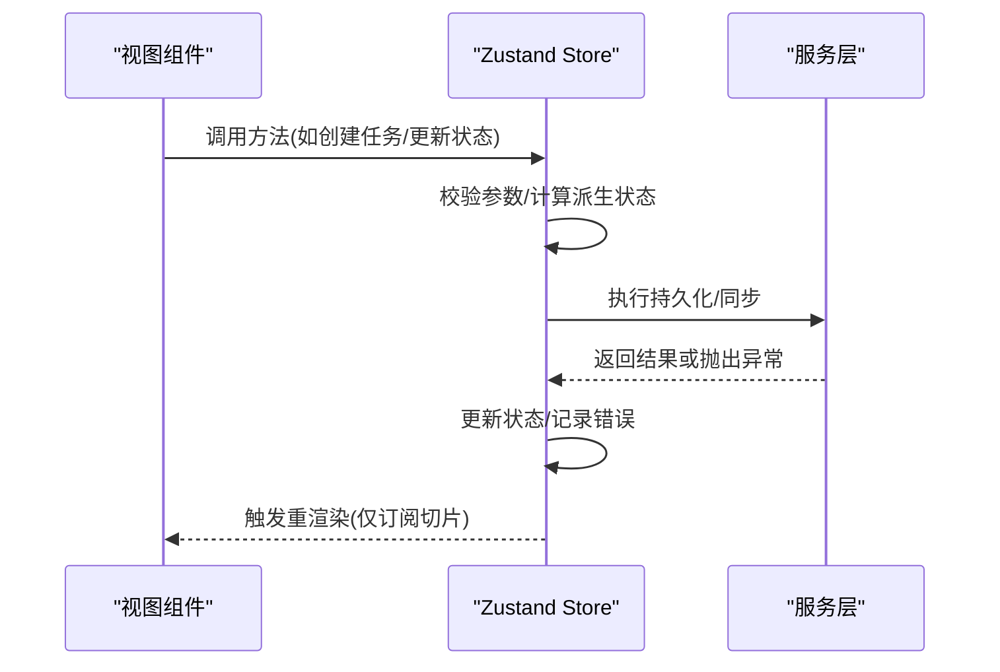
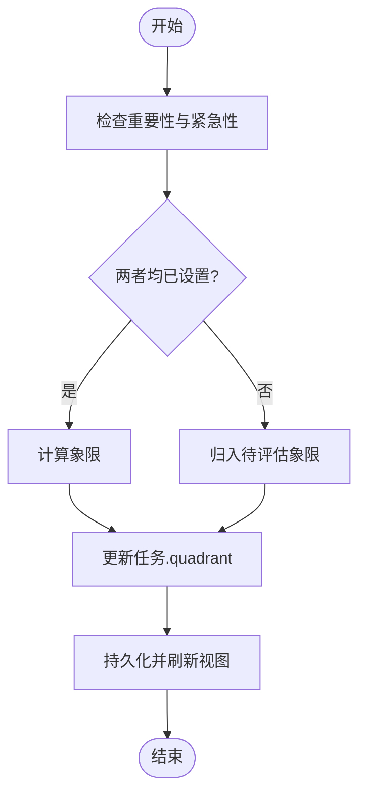
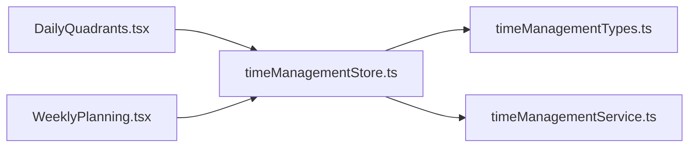

# 时间管理 Store API

<cite>
**本文引用的文件**
- [timeManagementStore.ts](file://src/features/time-management/timeManagementStore.ts)
- [timeManagementTypes.ts](file://src/features/time-management/timeManagementTypes.ts)
- [timeManagementService.ts](file://src/features/time-management/timeManagementService.ts)
- [DailyQuadrants.tsx](file://src/features/time-management/DailyQuadrants.tsx)
- [WeeklyPlanning.tsx](file://src/features/time-management/WeeklyPlanning.tsx)
</cite>

## 目录
1. [简介](#简介)
2. [项目结构](#项目结构)
3. [核心组件](#核心组件)
4. [架构总览](#架构总览)
5. [详细组件分析](#详细组件分析)
6. [依赖关系分析](#依赖关系分析)
7. [性能考虑](#性能考虑)
8. [故障排查指南](#故障排查指南)
9. [结论](#结论)
10. [附录](#附录)

## 简介
本文件为“时间管理模块”的 Zustand Store 提供完整的 API 文档，覆盖任务 CRUD、周计划管理、四象限任务分配、任务状态更新等能力。文档包含：
- 状态结构与字段说明
- 所有方法签名（参数类型、返回值、副作用）
- 使用示例（订阅状态变化、异步操作与错误处理）
- 优先级管理、日期时间处理与批量操作的实现细节
- 性能优化建议与最佳实践

## 项目结构
时间管理模块位于 features/time-management 下，核心文件包括：
- timeManagementStore.ts：Zustand store 定义与业务方法
- timeManagementTypes.ts：类型定义（任务、周计划、四象限等）
- timeManagementService.ts：数据访问与服务层封装
- DailyQuadrants.tsx：四象限视图，消费 store 进行展示与交互
- WeeklyPlanning.tsx：周计划视图，消费 store 进行周维度管理

图表来源
- [timeManagementStore.ts](file://src/features/time-management/timeManagementStore.ts)
- [timeManagementTypes.ts](file://src/features/time-management/timeManagementTypes.ts)
- [timeManagementService.ts](file://src/features/time-management/timeManagementService.ts)
- [DailyQuadrants.tsx](file://src/features/time-management/DailyQuadrants.tsx)
- [WeeklyPlanning.tsx](file://src/features/time-management/WeeklyPlanning.tsx)

章节来源
- [timeManagementStore.ts](file://src/features/time-management/timeManagementStore.ts)
- [timeManagementTypes.ts](file://src/features/time-management/timeManagementTypes.ts)
- [timeManagementService.ts](file://src/features/time-management/timeManagementService.ts)
- [DailyQuadrants.tsx](file://src/features/time-management/DailyQuadrants.tsx)
- [WeeklyPlanning.tsx](file://src/features/time-management/WeeklyPlanning.tsx)

## 核心组件
- 状态模型
  - 任务实体：包含唯一标识、标题、描述、优先级、截止日期、完成状态、所属周、四象限分类等字段
  - 周计划：以周为单位聚合任务，支持按周查询与切换当前周
  - 四象限：基于重要性与紧急性对任务进行分类，用于每日视图分组
- Store 职责
  - 维护任务集合与当前周上下文
  - 暴露任务 CRUD、状态变更、四象限分配、周计划管理等方法
  - 调用服务层执行持久化或远程同步
- 服务层职责
  - 封装数据读写逻辑（本地存储/后端接口）
  - 统一错误处理与重试策略（如需要）

章节来源
- [timeManagementTypes.ts](file://src/features/time-management/timeManagementTypes.ts)
- [timeManagementStore.ts](file://src/features/time-management/timeManagementStore.ts)
- [timeManagementService.ts](file://src/features/time-management/timeManagementService.ts)

## 架构总览
时间管理模块采用“视图 → Store → Service”的分层架构。视图通过 useTimeManagementStore 订阅状态与方法；Store 负责状态计算与调度；Service 负责数据访问。

图表来源
- [timeManagementStore.ts](file://src/features/time-management/timeManagementStore.ts)
- [timeManagementService.ts](file://src/features/time-management/timeManagementService.ts)
- [DailyQuadrants.tsx](file://src/features/time-management/DailyQuadrants.tsx)
- [WeeklyPlanning.tsx](file://src/features/time-management/WeeklyPlanning.tsx)

## 详细组件分析

### 状态与类型定义
- 任务类型
  - 关键字段：id、title、description、priority、dueDate、completed、weekId、quadrant 等
  - 约束：id 唯一；priority 取值范围受枚举限制；dueDate 为合法日期时间
- 周计划类型
  - 关键字段：weekId、startDate、endDate、tasks 列表
  - 行为：根据当前日期计算 weekId，支持切换当前周
- 四象限类型
  - 分类依据：重要性 × 紧急性
  - 输出：将任务映射到四个象限集合，供每日视图分组展示

章节来源
- [timeManagementTypes.ts](file://src/features/time-management/timeManagementTypes.ts)

### Store 方法与 API 规范
以下为时间管理 Store 的主要方法清单与语义说明。每个方法的参数、返回值与副作用均以类型与注释为准。

- 任务 CRUD
  - createTask(params): 新增任务
    - 参数：任务对象（必填字段见类型定义）
    - 返回值：新任务的 id 或完整任务对象
    - 副作用：写入服务层并更新本地状态
  - updateTask(id, patch): 更新任务部分字段
    - 参数：id、patch 对象
    - 返回值：更新后的任务对象
    - 副作用：合并 patch 后持久化
  - deleteTask(id): 删除任务
    - 参数：id
    - 返回值：void
    - 副作用：从集合移除并持久化
  - getTaskById(id): 读取单个任务
    - 参数：id
    - 返回值：任务对象或 undefined
    - 副作用：无
  - listTasks(filters?): 列表查询
    - 参数：可选过滤条件（如 weekId、completed、priority、quadrant）
    - 返回值：任务数组
    - 副作用：无

- 任务状态更新
  - toggleComplete(id): 切换完成状态
    - 参数：id
    - 返回值：void
    - 副作用：更新完成标记并持久化
  - setDueDate(id, dueDate): 设置截止时间
    - 参数：id、日期时间
    - 返回值：void
    - 副作用：更新截止时间并持久化
  - setPriority(id, priority): 设置优先级
    - 参数：id、优先级值
    - 返回值：void
    - 副作用：更新优先级并持久化

- 四象限分配
  - assignToQuadrant(id, quadrant): 分配到指定象限
    - 参数：id、象限值
    - 返回值：void
    - 副作用：更新任务象限并持久化
  - getQuadrantTasks(): 获取各象限任务分组
    - 参数：无
    - 返回值：四象限分组映射
    - 副作用：无（纯计算）

- 周计划管理
  - setCurrentWeek(weekId): 设置当前周
    - 参数：weekId
    - 返回值：void
    - 副作用：更新当前周上下文
  - getCurrentWeek(): 获取当前周信息
    - 参数：无
    - 返回值：当前周对象
    - 副作用：无
  - listWeeks(): 列出可用周
    - 参数：无
    - 返回值：周列表
    - 副作用：无
  - addWeek(week): 新增周
    - 参数：周对象
    - 返回值：新周 id
    - 副作用：写入服务层并更新状态
  - updateWeek(weekId, patch): 更新周信息
    - 参数：weekId、patch
    - 返回值：void
    - 副作用：合并 patch 并持久化
  - deleteWeek(weekId): 删除周
    - 参数：weekId
    - 返回值：void
    - 副作用：级联清理关联任务并持久化

- 批量操作
  - batchUpdateTasks(updates): 批量更新任务
    - 参数：{ id, patch }[]
    - 返回值：void
    - 副作用：逐条合并并持久化
  - batchAssignQuadrants(ids, quadrant): 批量分配象限
    - 参数：id 列表、象限值
    - 返回值：void
    - 副作用：批量更新并持久化
  - batchToggleComplete(ids): 批量切换完成状态
    - 参数：id 列表
    - 返回值：void
    - 副作用：批量更新并持久化

- 辅助与导出
  - exportTasks(format?): 导出任务数据
    - 参数：格式（如 json/csv）
    - 返回值：字符串或 Blob
    - 副作用：无
  - importTasks(data): 导入任务数据
    - 参数：数据源
    - 返回值：导入统计
    - 副作用：写入服务层并更新状态

注意：
- 所有写操作均会触发持久化与状态更新
- 读操作为纯函数，不产生副作用
- 错误由服务层抛出，Store 捕获并可选择记录日志或向 UI 反馈

章节来源
- [timeManagementStore.ts](file://src/features/time-management/timeManagementStore.ts)
- [timeManagementTypes.ts](file://src/features/time-management/timeManagementTypes.ts)
- [timeManagementService.ts](file://src/features/time-management/timeManagementService.ts)

### 使用示例

- 订阅状态变化
  - 在组件中通过 useTimeManagementStore 选择器订阅所需切片（如 tasks、currentWeek），避免全量重渲染
  - 示例路径参考：[DailyQuadrants.tsx](file://src/features/time-management/DailyQuadrants.tsx)、[WeeklyPlanning.tsx](file://src/features/time-management/WeeklyPlanning.tsx)

- 执行异步操作
  - 在事件处理器中调用 Store 方法（如 createTask、updateTask），这些方法内部会调用服务层进行持久化
  - 若需等待结果，可在调用处 await 或直接处理回调（取决于服务层实现）

- 错误处理
  - 在服务层抛出的异常会被 Store 捕获，建议在 UI 层通过 try/catch 包裹关键操作，或监听全局错误提示
  - 对于批量操作，建议逐个捕获失败项并汇总错误信息，便于用户修正

章节来源
- [DailyQuadrants.tsx](file://src/features/time-management/DailyQuadrants.tsx)
- [WeeklyPlanning.tsx](file://src/features/time-management/WeeklyPlanning.tsx)
- [timeManagementStore.ts](file://src/features/time-management/timeManagementStore.ts)
- [timeManagementService.ts](file://src/features/time-management/timeManagementService.ts)

### 优先级管理与四象限算法
- 优先级
  - 优先级为离散枚举值，影响排序与筛选
  - 设置优先级时进行合法性校验，非法值将被拒绝
- 四象限分配
  - 基于任务的重要性与紧急性标签计算象限
  - 当任一属性缺失时，默认归入“待评估”象限
  - 分配后自动刷新四象限分组视图

图表来源
- [timeManagementStore.ts](file://src/features/time-management/timeManagementStore.ts)
- [timeManagementTypes.ts](file://src/features/time-management/timeManagementTypes.ts)

章节来源
- [timeManagementStore.ts](file://src/features/time-management/timeManagementStore.ts)
- [timeManagementTypes.ts](file://src/features/time-management/timeManagementTypes.ts)

### 日期时间处理
- 日期解析与格式化
  - 输入日期时间需符合 ISO 8601 或本地兼容格式
  - 输出统一为标准化字符串，便于比较与排序
- 周边界计算
  - 根据系统时区与起始日规则计算 weekId
  - 切换当前周时，重新计算相关任务归属

章节来源
- [timeManagementTypes.ts](file://src/features/time-management/timeManagementTypes.ts)
- [timeManagementStore.ts](file://src/features/time-management/timeManagementStore.ts)

### 批量操作与事务性
- 批量更新
  - 支持批量合并 patch、批量分配象限、批量切换完成状态
  - 为保证一致性，建议对批量操作进行错误隔离：单条失败不影响其他条目
- 事务性建议
  - 若服务层支持事务，应在同一事务内提交多条更新
  - 否则需在 Store 层维护回滚快照，失败时恢复状态

章节来源
- [timeManagementStore.ts](file://src/features/time-management/timeManagementStore.ts)
- [timeManagementService.ts](file://src/features/time-management/timeManagementService.ts)

## 依赖关系分析
- 组件依赖 Store
  - DailyQuadrants.tsx 与 WeeklyPlanning.tsx 通过 useTimeManagementStore 订阅状态与方法
- Store 依赖类型与服务层
  - timeManagementStore.ts 依赖 timeManagementTypes.ts 的类型定义
  - timeManagementStore.ts 调用 timeManagementService.ts 进行数据访问

图表来源
- [DailyQuadrants.tsx](file://src/features/time-management/DailyQuadrants.tsx)
- [WeeklyPlanning.tsx](file://src/features/time-management/WeeklyPlanning.tsx)
- [timeManagementStore.ts](file://src/features/time-management/timeManagementStore.ts)
- [timeManagementTypes.ts](file://src/features/time-management/timeManagementTypes.ts)
- [timeManagementService.ts](file://src/features/time-management/timeManagementService.ts)

章节来源
- [DailyQuadrants.tsx](file://src/features/time-management/DailyQuadrants.tsx)
- [WeeklyPlanning.tsx](file://src/features/time-management/WeeklyPlanning.tsx)
- [timeManagementStore.ts](file://src/features/time-management/timeManagementStore.ts)
- [timeManagementTypes.ts](file://src/features/time-management/timeManagementTypes.ts)
- [timeManagementService.ts](file://src/features/time-management/timeManagementService.ts)

## 性能考虑
- 选择器订阅
  - 在组件中使用细粒度选择器，仅订阅必要字段，减少不必要重渲染
- 不可变更新
  - 使用浅拷贝与不可变模式更新状态，确保 React 能正确检测变更
- 批量更新
  - 大量变更时使用批量方法，减少多次持久化与重渲染开销
- 防抖与节流
  - 对高频输入（如搜索、筛选）进行防抖/节流，降低计算压力
- 懒加载与分页
  - 大数据集场景下，按需加载与分页显示，避免一次性渲染全部任务
- 计算缓存
  - 对复杂派生状态（如四象限分组）进行缓存，避免重复计算

## 故障排查指南
- 常见问题
  - 参数校验失败：检查必填字段与枚举值是否合法
  - 日期格式错误：确认输入为有效日期时间字符串
  - 网络或服务层异常：查看服务层错误日志与重试策略
- 定位步骤
  - 在 Store 方法入口打印关键参数与中间状态
  - 在服务层捕获并记录异常堆栈
  - 在 UI 层添加错误提示与重试按钮
- 恢复策略
  - 对批量操作保留快照，失败时回滚
  - 对幂等操作启用重试机制

章节来源
- [timeManagementStore.ts](file://src/features/time-management/timeManagementStore.ts)
- [timeManagementService.ts](file://src/features/time-management/timeManagementService.ts)

## 结论
时间管理 Store 提供了清晰的任务与周计划管理能力，并通过四象限与优先级提升日常效率。遵循本文档的 API 规范与最佳实践，可构建稳定、高性能的时间管理界面。

## 附录
- 术语
  - 四象限：按重要性与紧急性划分的任务分类
  - 周计划：以周为维度的任务组织方式
- 版本与兼容性
  - 类型定义与服务层接口应保持向后兼容
  - 重大变更需配合迁移脚本与用户提示