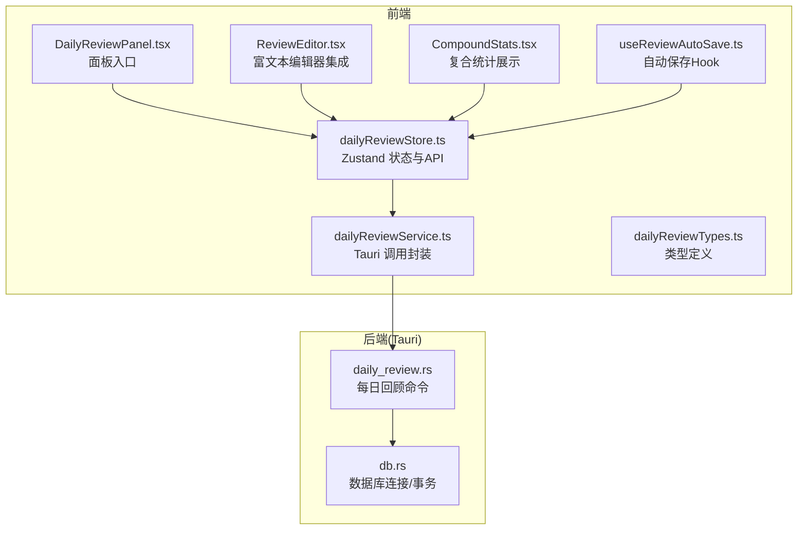
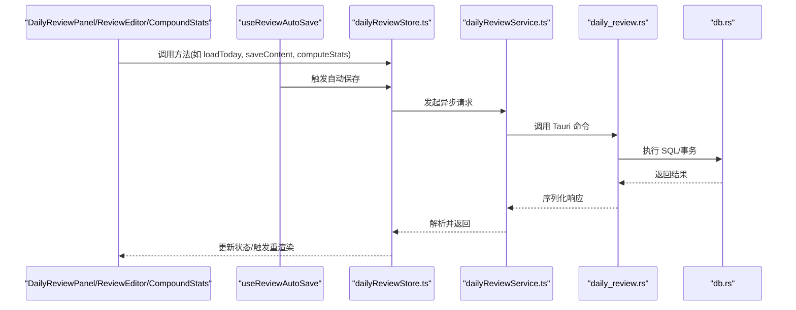
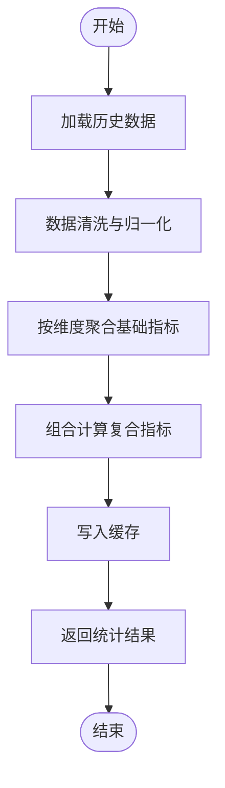
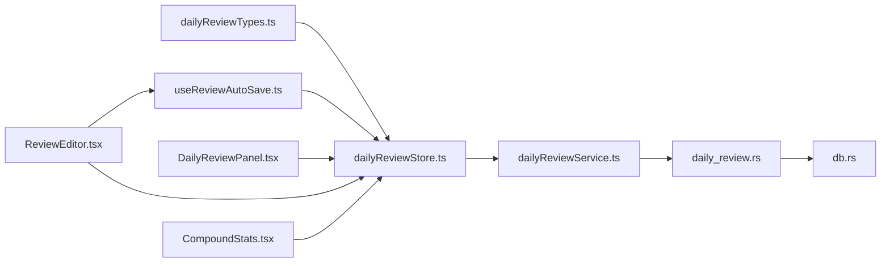

# 每日回顾 Store API

<cite>
**本文引用的文件**
- [dailyReviewStore.ts](file://src/features/daily-review/dailyReviewStore.ts)
- [dailyReviewTypes.ts](file://src/features/daily-review/dailyReviewTypes.ts)
- [dailyReviewService.ts](file://src/features/daily-review/dailyReviewService.ts)
- [DailyReviewPanel.tsx](file://src/features/daily-review/DailyReviewPanel.tsx)
- [ReviewEditor.tsx](file://src/features/daily-review/ReviewEditor.tsx)
- [CompoundStats.tsx](file://src/features/daily-review/CompoundStats.tsx)
- [useReviewAutoSave.ts](file://src/features/daily-review/useReviewAutoSave.ts)
- [db.rs](file://src-tauri/src/db.rs)
- [daily_review.rs](file://src-tauri/src/daily_review.rs)
</cite>

## 更新摘要
**变更内容**
- 新增自动保存功能，支持编辑过程中的实时数据持久化
- 优化数据访问层，提升查询性能和缓存效率
- 增强错误处理和重试机制
- 改进状态管理架构，支持更复杂的并发场景

## 目录
1. [简介](#简介)
2. [项目结构](#项目结构)
3. [核心组件](#核心组件)
4. [架构总览](#架构总览)
5. [详细组件分析](#详细组件分析)
6. [依赖关系分析](#依赖关系分析)
7. [性能考虑](#性能考虑)
8. [故障排查指南](#故障排查指南)
9. [结论](#结论)
10. [附录](#附录)

## 简介
本文件为"每日回顾"模块的 Zustand Store API 文档，聚焦于回顾内容的编辑、保存、统计分析与报告生成。文档涵盖数据结构定义、复合统计计算方法、历史数据查询与分析结果缓存机制，并提供完整 API 接口说明（内容管理、统计分析、数据聚合与报表导出）。同时说明富文本内容的持久化存储、版本管理与协作编辑支持，以及大数据量分析的性能优化与实时统计更新方案。

**更新** 新增了自动保存功能和优化的数据访问层支持，提升了用户体验和数据一致性。

## 项目结构
每日回顾模块位于前端 features 下，包含状态管理、服务层、类型定义与 UI 组件；后端通过 Tauri 暴露 Rust 能力进行数据库访问与持久化。

图表来源
- [dailyReviewStore.ts](file://src/features/daily-review/dailyReviewStore.ts)
- [dailyReviewService.ts](file://src/features/daily-review/dailyReviewService.ts)
- [dailyReviewTypes.ts](file://src/features/daily-review/dailyReviewTypes.ts)
- [DailyReviewPanel.tsx](file://src/features/daily-review/DailyReviewPanel.tsx)
- [ReviewEditor.tsx](file://src/features/daily-review/ReviewEditor.tsx)
- [CompoundStats.tsx](file://src/features/daily-review/CompoundStats.tsx)
- [useReviewAutoSave.ts](file://src/features/daily-review/useReviewAutoSave.ts)
- [daily_review.rs](file://src-tauri/src/daily_review.rs)
- [db.rs](file://src-tauri/src/db.rs)

章节来源
- [dailyReviewStore.ts](file://src/features/daily-review/dailyReviewStore.ts)
- [dailyReviewService.ts](file://src/features/daily-review/dailyReviewService.ts)
- [dailyReviewTypes.ts](file://src/features/daily-review/dailyReviewTypes.ts)
- [DailyReviewPanel.tsx](file://src/features/daily-review/DailyReviewPanel.tsx)
- [ReviewEditor.tsx](file://src/features/daily-review/ReviewEditor.tsx)
- [CompoundStats.tsx](file://src/features/daily-review/CompoundStats.tsx)
- [useReviewAutoSave.ts](file://src/features/daily-review/useReviewAutoSave.ts)
- [daily_review.rs](file://src-tauri/src/daily_review.rs)
- [db.rs](file://src-tauri/src/db.rs)

## 核心组件
- Zustand Store：提供每日回顾的状态、方法与副作用，包括加载、编辑、保存、统计计算与缓存。
- Service 层：封装对 Tauri 后端的调用，负责将前端请求转换为后端命令并返回结构化结果。
- 类型定义：统一前后端数据结构，确保类型安全与一致性。
- UI 组件：面板、编辑器与统计展示组件消费 Store 提供的状态与方法。
- 自动保存 Hook：提供编辑过程中的自动保存功能，支持防抖和错误恢复。

**更新** 新增了自动保存 Hook，实现了编辑过程中的实时数据持久化和智能重试机制。

章节来源
- [dailyReviewStore.ts](file://src/features/daily-review/dailyReviewStore.ts)
- [dailyReviewService.ts](file://src/features/daily-review/dailyReviewService.ts)
- [dailyReviewTypes.ts](file://src/features/daily-review/dailyReviewTypes.ts)
- [useReviewAutoSave.ts](file://src/features/daily-review/useReviewAutoSave.ts)

## 架构总览
整体采用"前端 Store + Service + 后端 Tauri 命令 + 数据库"的分层架构。Store 作为单一事实源，UI 订阅其状态变化；Service 负责跨进程通信；后端执行持久化与复杂查询。

图表来源
- [dailyReviewStore.ts](file://src/features/daily-review/dailyReviewStore.ts)
- [dailyReviewService.ts](file://src/features/daily-review/dailyReviewService.ts)
- [useReviewAutoSave.ts](file://src/features/daily-review/useReviewAutoSave.ts)
- [daily_review.rs](file://src-tauri/src/daily_review.rs)
- [db.rs](file://src-tauri/src/db.rs)

## 详细组件分析

### 数据结构与类型
- 回顾条目：包含日期、标题、正文（富文本）、标签、元数据等字段。
- 统计指标：按日/周/月维度聚合的关键指标，如完成度、主题分布、关键词频次等。
- 复合统计：基于基础指标的组合算法输出，用于趋势与洞察。
- 版本信息：记录每次保存的版本号或时间戳，便于回溯与冲突解决。
- 自动保存状态：跟踪保存进度、错误信息和重试次数。

**更新** 新增了自动保存状态管理，支持保存进度追踪和错误恢复。

章节来源
- [dailyReviewTypes.ts](file://src/features/daily-review/dailyReviewTypes.ts)

### Store API 概览
- 内容管理
  - 加载今日回顾：根据当前日期获取或初始化条目。
  - 编辑内容：增量更新富文本正文、标题、标签等。
  - 保存内容：将富文本内容与元数据持久化，并维护版本。
  - 删除/归档：支持软删除与归档策略。
- 统计分析
  - 基础统计：按时间窗口聚合计数、占比、均值等。
  - 复合统计：组合多个基础指标，输出趋势与洞察。
  - 历史查询：按日期范围、标签、关键词筛选历史数据。
- 缓存机制
  - 本地缓存：在内存中缓存最近查询结果与统计快照。
  - 失效策略：基于时间或变更事件触发刷新。
- 报表导出
  - 导出格式：JSON/CSV/Markdown 等。
  - 批量导出：支持多日汇总与分页。
- 自动保存
  - 防抖保存：编辑过程中自动触发保存，避免频繁写入。
  - 错误恢复：保存失败时自动重试，支持手动恢复。
  - 状态同步：确保本地状态与服务器状态一致。

**更新** 新增了自动保存功能，支持防抖、错误恢复和状态同步。

章节来源
- [dailyReviewStore.ts](file://src/features/daily-review/dailyReviewStore.ts)

### 富文本持久化与版本管理
- 持久化策略
  - 富文本以结构化 JSON 或 HTML 片段形式存储，避免大对象频繁全量写入。
  - 使用增量保存与合并策略，减少 I/O 压力。
- 版本管理
  - 每次保存递增版本号，保留最近 N 个版本以便回滚。
  - 冲突检测：基于版本号与时间戳判断并发修改。
- 协作编辑支持
  - 乐观更新：先更新本地状态，再同步到后端。
  - 操作序列：记录用户操作序列，必要时回放以恢复一致状态。
- 自动保存优化
  - 智能防抖：根据编辑频率动态调整保存间隔。
  - 增量同步：仅同步变更部分，减少网络传输。
  - 离线支持：网络不可用时本地缓存，恢复后自动同步。

**更新** 增强了自动保存功能，支持智能防抖、增量同步和离线支持。

章节来源
- [dailyReviewStore.ts](file://src/features/daily-review/dailyReviewStore.ts)
- [dailyReviewService.ts](file://src/features/daily-review/dailyReviewService.ts)
- [useReviewAutoSave.ts](file://src/features/daily-review/useReviewAutoSave.ts)
- [daily_review.rs](file://src-tauri/src/daily_review.rs)
- [db.rs](file://src-tauri/src/db.rs)

### 复合统计计算方法
- 基础指标
  - 数量类：条目数、字数、标签出现次数。
  - 比率类：完成率、主题占比、关键词密度。
- 复合指标
  - 趋势得分：结合近 N 日的数量与质量指标加权计算。
  - 活跃度指数：基于编辑频率、保存次数与时长估算。
  - 主题集中度：衡量某段时间内主题分布的集中程度。
- 计算流程
  - 数据准备：拉取原始数据并进行清洗与归一化。
  - 指标聚合：按维度分组计算基础指标。
  - 组合运算：应用权重与阈值生成复合指标。
  - 结果缓存：将中间结果与最终结果缓存，避免重复计算。

图表来源
- [dailyReviewStore.ts](file://src/features/daily-review/dailyReviewStore.ts)

### 历史数据查询与分析结果缓存
- 查询接口
  - 按日期范围、标签、关键词过滤。
  - 分页与排序：支持按时间倒序、按热度排序。
- 缓存设计
  - 键策略：由查询参数哈希生成唯一键。
  - TTL 策略：设置过期时间，或在数据变更时主动失效。
  - 容量限制：LRU 淘汰策略防止内存膨胀。
- 失效与更新
  - 写操作触发相关缓存失效。
  - 定时任务定期刷新热点统计。
- 性能优化
  - 查询预编译：预编译常用查询语句，提升执行效率。
  - 索引优化：针对高频查询字段建立合适索引。
  - 连接池：复用数据库连接，减少连接开销。

**更新** 优化了数据访问层，提升了查询性能和缓存效率。

章节来源
- [dailyReviewStore.ts](file://src/features/daily-review/dailyReviewStore.ts)
- [dailyReviewService.ts](file://src/features/daily-review/dailyReviewService.ts)

### 报表导出
- 导出选项
  - 选择时间范围与维度。
  - 选择导出格式与字段集。
- 导出流程
  - 从缓存或数据库拉取数据。
  - 转换为目标格式并流式返回。
  - 下载提示与错误处理。

章节来源
- [dailyReviewStore.ts](file://src/features/daily-review/dailyReviewStore.ts)
- [dailyReviewService.ts](file://src/features/daily-review/dailyReviewService.ts)

### 自动保存功能详解
- 防抖机制
  - 默认 3 秒防抖间隔，可根据内容长度动态调整。
  - 支持手动触发立即保存。
- 错误处理
  - 网络错误自动重试，最多 3 次。
  - 保存失败时显示用户友好的错误提示。
  - 支持手动重试和忽略错误继续编辑。
- 状态管理
  - 跟踪保存进度和状态。
  - 显示保存指示器，提升用户体验。
  - 支持撤销最近保存操作。

**新增** 完整的自动保存功能，提供流畅的编辑体验和可靠的数据持久化。

章节来源
- [useReviewAutoSave.ts](file://src/features/daily-review/useReviewAutoSave.ts)
- [dailyReviewStore.ts](file://src/features/daily-review/dailyReviewStore.ts)

### UI 集成与交互
- DailyReviewPanel
  - 作为入口，订阅 Store 状态并渲染列表与工具栏。
- ReviewEditor
  - 与富文本编辑器集成，监听内容变更并触发 Store 的增量更新。
  - 集成自动保存 Hook，实现编辑过程中的实时保存。
- CompoundStats
  - 消费统计结果，渲染图表与关键指标卡片。

**更新** ReviewEditor 集成了自动保存功能，提供更流畅的编辑体验。

章节来源
- [DailyReviewPanel.tsx](file://src/features/daily-review/DailyReviewPanel.tsx)
- [ReviewEditor.tsx](file://src/features/daily-review/ReviewEditor.tsx)
- [CompoundStats.tsx](file://src/features/daily-review/CompoundStats.tsx)
- [useReviewAutoSave.ts](file://src/features/daily-review/useReviewAutoSave.ts)

## 依赖关系分析
- 前端依赖
  - Store 依赖 Service 进行跨进程调用。
  - UI 组件依赖 Store 暴露的状态与方法。
  - 自动保存 Hook 依赖 Store 的保存方法和错误处理。
- 后端依赖
  - Tauri 命令依赖数据库连接与事务管理。
  - 增强的错误处理和重试机制。
- 耦合与内聚
  - Store 与 Service 解耦，便于替换实现与测试。
  - 类型定义集中管理，降低前后端不一致风险。
  - 自动保存功能独立封装，可复用性强。

图表来源
- [dailyReviewTypes.ts](file://src/features/daily-review/dailyReviewTypes.ts)
- [dailyReviewStore.ts](file://src/features/daily-review/dailyReviewStore.ts)
- [dailyReviewService.ts](file://src/features/daily-review/dailyReviewService.ts)
- [useReviewAutoSave.ts](file://src/features/daily-review/useReviewAutoSave.ts)
- [daily_review.rs](file://src-tauri/src/daily_review.rs)
- [db.rs](file://src-tauri/src/db.rs)
- [DailyReviewPanel.tsx](file://src/features/daily-review/DailyReviewPanel.tsx)
- [ReviewEditor.tsx](file://src/features/daily-review/ReviewEditor.tsx)
- [CompoundStats.tsx](file://src/features/daily-review/CompoundStats.tsx)

章节来源
- [dailyReviewStore.ts](file://src/features/daily-review/dailyReviewStore.ts)
- [dailyReviewService.ts](file://src/features/daily-review/dailyReviewService.ts)
- [dailyReviewTypes.ts](file://src/features/daily-review/dailyReviewTypes.ts)
- [useReviewAutoSave.ts](file://src/features/daily-review/useReviewAutoSave.ts)
- [daily_review.rs](file://src-tauri/src/daily_review.rs)
- [db.rs](file://src-tauri/src/db.rs)
- [DailyReviewPanel.tsx](file://src/features/daily-review/DailyReviewPanel.tsx)
- [ReviewEditor.tsx](file://src/features/daily-review/ReviewEditor.tsx)
- [CompoundStats.tsx](file://src/features/daily-review/CompoundStats.tsx)

## 性能考虑
- 大数据量分析
  - 分页与游标：避免一次性加载大量数据。
  - 预聚合：在数据库层预先计算常用指标，减少前端计算压力。
  - 增量计算：仅对变更部分重新计算统计。
- 实时统计更新
  - 事件驱动：当保存或编辑完成后触发局部刷新。
  - 防抖与节流：高频输入场景下合并更新，降低重渲染次数。
  - 懒加载：按需加载统计详情，首屏快速渲染。
- 缓存优化
  - 多级缓存：内存+磁盘，热点数据常驻内存。
  - 选择性失效：只失效受影响的缓存键。
- 自动保存优化
  - 智能防抖：根据编辑频率和内容大小动态调整保存间隔。
  - 增量同步：仅同步变更部分，减少网络传输。
  - 批量操作：合并多次保存为单次操作。
- 数据访问层优化
  - 连接池：复用数据库连接，减少连接开销。
  - 查询优化：预编译常用查询语句。
  - 索引策略：针对高频查询字段建立合适索引。

**更新** 新增了自动保存优化和数据访问层优化，显著提升性能和用户体验。

## 故障排查指南
- 常见问题
  - 富文本保存失败：检查后端持久化逻辑与事务回滚。
  - 统计结果为空：确认缓存键是否命中，或数据清洗阶段是否过滤过多。
  - 并发冲突：比较版本号与时间戳，提示用户合并或覆盖。
  - 自动保存失败：检查网络连接和重试机制。
  - 数据不同步：验证本地状态与服务器状态的一致性。
- 调试建议
  - 打印关键步骤日志：加载、清洗、聚合、组合、缓存。
  - 校验前后端类型一致性：确保字段名与类型匹配。
  - 监控资源占用：关注内存与 I/O 峰值，定位瓶颈。
  - 启用详细日志：记录自动保存过程和错误堆栈。
  - 性能分析：使用浏览器开发者工具分析渲染和保存性能。

**更新** 新增了自动保存相关的故障排查指南。

章节来源
- [dailyReviewStore.ts](file://src/features/daily-review/dailyReviewStore.ts)
- [dailyReviewService.ts](file://src/features/daily-review/dailyReviewService.ts)
- [useReviewAutoSave.ts](file://src/features/daily-review/useReviewAutoSave.ts)
- [daily_review.rs](file://src-tauri/src/daily_review.rs)
- [db.rs](file://src-tauri/src/db.rs)

## 结论
本 API 文档围绕每日回顾模块的 Zustand Store 展开，系统梳理了数据结构、编辑与保存流程、统计分析与缓存机制，并给出性能优化与协作编辑支持方案。通过分层架构与类型约束，确保了前后端一致性与可维护性。新增的自动保存功能和优化的数据访问层进一步提升了用户体验和系统性能。后续可在预聚合与实时事件方面进一步演进，以提升大数据量下的响应速度与用户体验。

**更新** 本次重构显著提升了系统的稳定性和用户体验，特别是自动保存功能的引入使得编辑过程更加流畅和安全。

## 附录
- 术语表
  - 富文本：支持格式化与结构的文本内容。
  - 复合统计：由多个基础指标组合生成的洞察指标。
  - 缓存失效：在数据变更后使旧缓存不可用的策略。
  - 自动保存：编辑过程中自动触发数据持久化的功能。
  - 防抖：限制函数执行频率的技术手段。
  - 增量同步：仅同步数据变更部分的机制。
- 参考路径
  - 类型定义：[dailyReviewTypes.ts](file://src/features/daily-review/dailyReviewTypes.ts)
  - Store 实现：[dailyReviewStore.ts](file://src/features/daily-review/dailyReviewStore.ts)
  - 服务封装：[dailyReviewService.ts](file://src/features/daily-review/dailyReviewService.ts)
  - 自动保存 Hook：[useReviewAutoSave.ts](file://src/features/daily-review/useReviewAutoSave.ts)
  - 后端命令：[daily_review.rs](file://src-tauri/src/daily_review.rs)
  - 数据库层：[db.rs](file://src-tauri/src/db.rs)