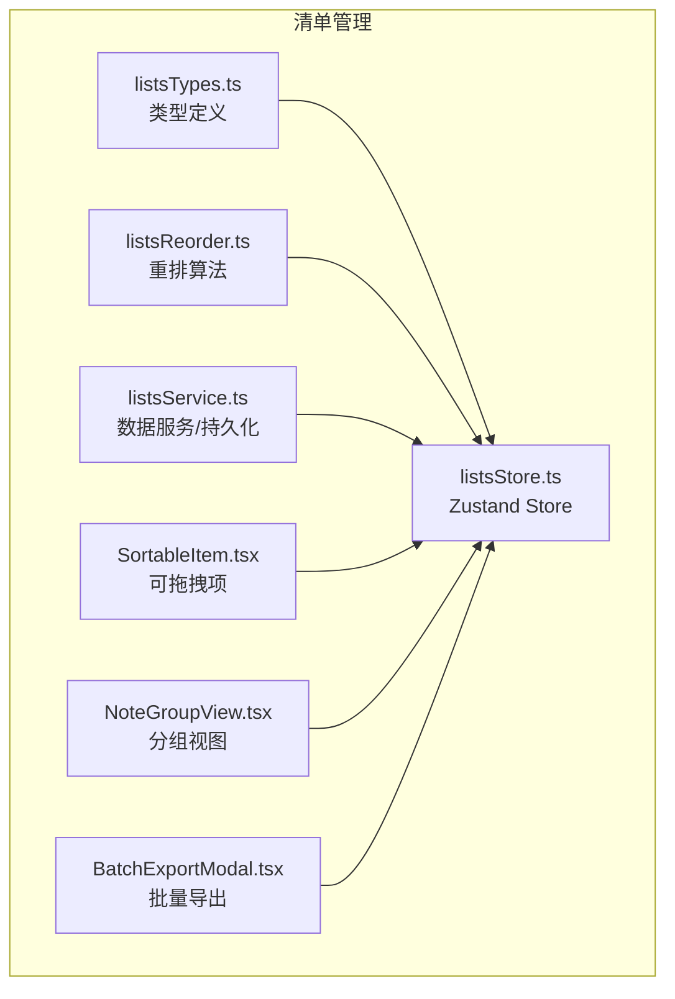
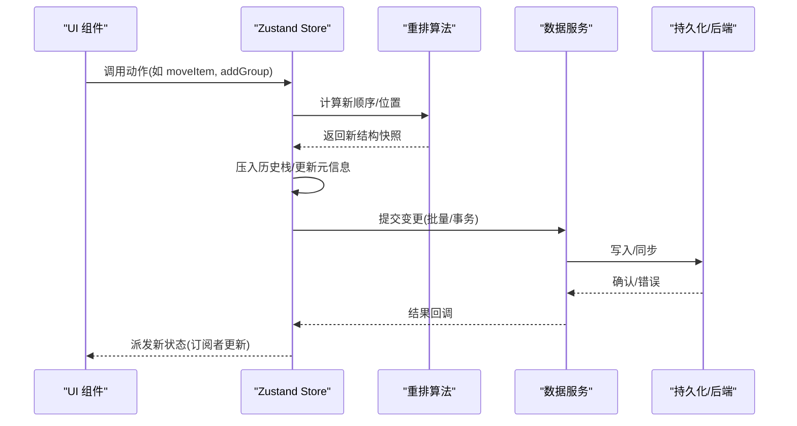
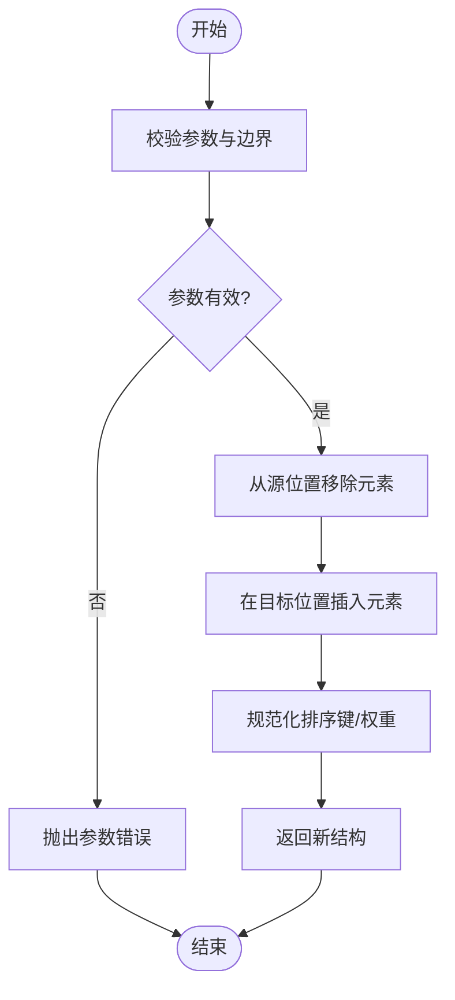
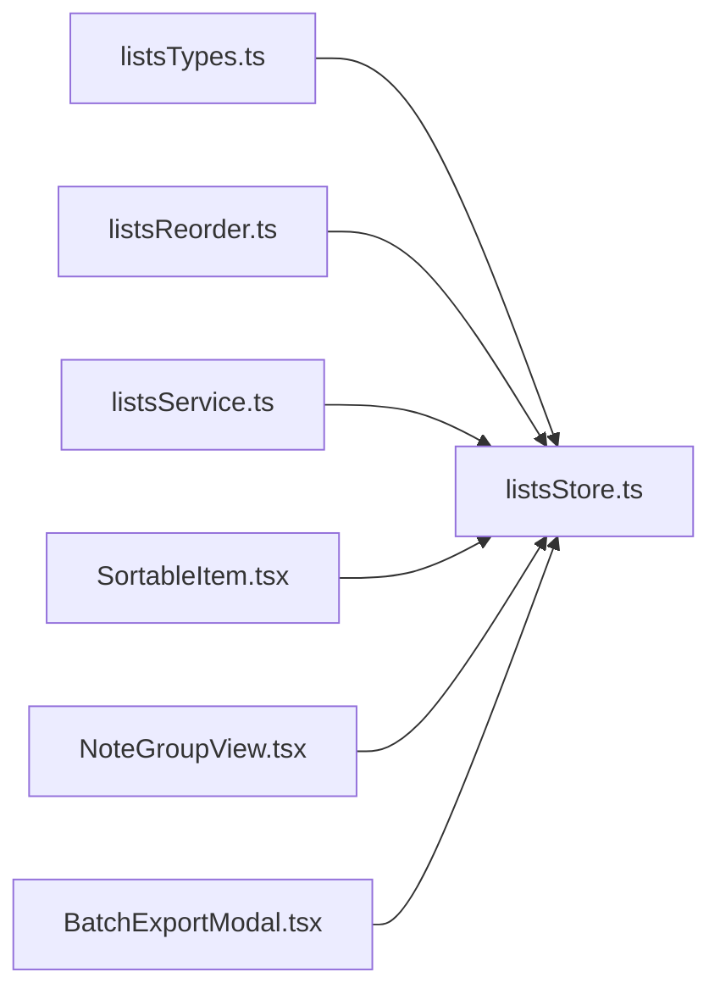

# 清单管理 Store API

<cite>
**本文引用的文件**   
- [listsStore.ts](file://src/features/lists/listsStore.ts)
- [listsTypes.ts](file://src/features/lists/listsTypes.ts)
- [listsReorder.ts](file://src/features/lists/listsReorder.ts)
- [listsService.ts](file://src/features/lists/listsService.ts)
- [SortableItem.tsx](file://src/features/lists/SortableItem.tsx)
- [NoteGroupView.tsx](file://src/features/lists/NoteGroupView.tsx)
- [BatchExportModal.tsx](file://src/features/lists/BatchExportModal.tsx)
</cite>

## 目录
1. [简介](#简介)
2. [项目结构](#项目结构)
3. [核心组件](#核心组件)
4. [架构总览](#架构总览)
5. [详细组件分析](#详细组件分析)
6. [依赖关系分析](#依赖关系分析)
7. [性能考虑](#性能考虑)
8. [故障排查指南](#故障排查指南)
9. [结论](#结论)
10. [附录：API 参考](#附录api-参考)

## 简介
本文件为“清单管理模块”的 Zustand Store API 文档，聚焦以下能力：
- 分组管理：创建、重命名、删除、折叠/展开等
- 条目增删改查：新增、编辑、删除、查询与过滤
- 拖拽排序：组内与跨组移动、插入位置计算
- 批量操作：批量导入/导出、批量状态变更
- 数据结构与嵌套关系：分组与条目的层级模型
- 排序算法与状态同步：稳定排序、撤销/重做、持久化
- 大数据量优化：虚拟滚动、增量更新、内存策略

## 项目结构
清单管理相关代码位于 features/lists 目录下，核心由类型定义、Zustand Store、重排算法、服务层与 UI 交互组成。

图表来源
- [listsTypes.ts](file://src/features/lists/listsTypes.ts)
- [listsStore.ts](file://src/features/lists/listsStore.ts)
- [listsReorder.ts](file://src/features/lists/listsReorder.ts)
- [listsService.ts](file://src/features/lists/listsService.ts)
- [SortableItem.tsx](file://src/features/lists/SortableItem.tsx)
- [NoteGroupView.tsx](file://src/features/lists/NoteGroupView.tsx)
- [BatchExportModal.tsx](file://src/features/lists/BatchExportModal.tsx)

章节来源
- [listsStore.ts](file://src/features/lists/listsStore.ts)
- [listsTypes.ts](file://src/features/lists/listsTypes.ts)
- [listsReorder.ts](file://src/features/lists/listsReorder.ts)
- [listsService.ts](file://src/features/lists/listsService.ts)
- [SortableItem.tsx](file://src/features/lists/SortableItem.tsx)
- [NoteGroupView.tsx](file://src/features/lists/NoteGroupView.tsx)
- [BatchExportModal.tsx](file://src/features/lists/BatchExportModal.tsx)

## 核心组件
- 类型定义（listsTypes.ts）
  - 定义分组、条目、拖拽上下文、批量操作载荷等核心数据结构
  - 提供严格类型约束，确保 Store 与 UI 间的数据契约一致
- Store（listsStore.ts）
  - 基于 Zustand 的状态容器，暴露分组与条目的 CRUD、排序、批量操作、撤销/重做、导入/导出等方法
  - 内部维护历史栈、脏标记、加载态、错误信息等元数据
- 重排算法（listsReorder.ts）
  - 实现稳定的插入位置计算、跨组移动、边界处理、冲突合并
- 数据服务（listsService.ts）
  - 封装本地存储/后端同步、事务性写入、增量同步策略
- UI 交互
  - SortableItem.tsx：封装拖拽事件、预览态、落盘时机
  - NoteGroupView.tsx：渲染分组列表、监听 Store 变化、触发动作
  - BatchExportModal.tsx：批量导出入口，调用 Store 导出方法并生成文件

章节来源
- [listsTypes.ts](file://src/features/lists/listsTypes.ts)
- [listsStore.ts](file://src/features/lists/listsStore.ts)
- [listsReorder.ts](file://src/features/lists/listsReorder.ts)
- [listsService.ts](file://src/features/lists/listsService.ts)
- [SortableItem.tsx](file://src/features/lists/SortableItem.tsx)
- [NoteGroupView.tsx](file://src/features/lists/NoteGroupView.tsx)
- [BatchExportModal.tsx](file://src/features/lists/BatchExportModal.tsx)

## 架构总览
整体采用“UI -> Store -> Service -> Storage/DB”的分层模式。Store 作为唯一可信源，对外暴露原子动作；Service 负责 I/O 与一致性；UI 仅消费状态与调用动作。

图表来源
- [listsStore.ts](file://src/features/lists/listsStore.ts)
- [listsReorder.ts](file://src/features/lists/listsReorder.ts)
- [listsService.ts](file://src/features/lists/listsService.ts)

## 详细组件分析

### 类型与数据模型（listsTypes.ts）
- 分组（Group）
  - 字段：标识、名称、是否折叠、创建/更新时间戳、排序权重等
- 条目（Item）
  - 字段：标识、所属分组、内容、完成状态、优先级、标签、创建/更新时间戳、排序权重等
- 拖拽上下文（DragContext）
  - 字段：拖拽源、目标位置、目标分组、预览索引等
- 批量操作载荷（BatchPayload）
  - 字段：操作类型、目标集合、参数映射等
- 状态与元信息
  - 字段：加载态、错误信息、历史栈指针、是否处于撤销/重做中

章节来源
- [listsTypes.ts](file://src/features/lists/listsTypes.ts)

### Store 接口与行为（listsStore.ts）
- 分组管理
  - 创建分组、重命名、删除、折叠/展开、设置默认分组
- 条目管理
  - 新增条目、更新条目、删除条目、批量更新状态、按条件查询与过滤
- 排序与拖拽
  - 组内排序、跨组移动、插入位置计算、冲突处理
- 批量操作
  - 批量导入、批量导出、批量状态切换
- 撤销/重做
  - 记录历史快照、限制栈深度、合并相邻同类操作
- 持久化与同步
  - 自动保存、增量同步、失败重试、冲突解决策略
- 选择与多选
  - 单选/多选、清空选择、反选、按条件选择

章节来源
- [listsStore.ts](file://src/features/lists/listsStore.ts)

### 重排算法（listsReorder.ts）
- 输入：源元素、目标分组、目标索引、当前结构
- 输出：新的分组与条目序列（不可变）
- 特性：
  - 稳定排序：保持相等元素的相对顺序
  - 边界保护：越界修正、空分组处理
  - 跨组移动：先移除再插入，避免重复引用
  - 冲突合并：同批次多次移动时进行归并，减少中间态

图表来源
- [listsReorder.ts](file://src/features/lists/listsReorder.ts)

章节来源
- [listsReorder.ts](file://src/features/lists/listsReorder.ts)

### 数据服务（listsService.ts）
- 职责
  - 将 Store 的变更转换为持久化操作
  - 提供事务性写入、批量写入、增量同步
  - 处理网络/磁盘错误与重试
- 关键方法
  - 批量写入、读取全量数据、差异同步、导出为结构化数据、导入校验与回滚

章节来源
- [listsService.ts](file://src/features/lists/listsService.ts)

### UI 交互与状态联动
- SortableItem.tsx
  - 封装拖拽事件，向 Store 发送预览与落盘请求
  - 支持拖拽手柄、占位符、高亮提示
- NoteGroupView.tsx
  - 渲染分组与条目，响应 Store 的选中态、折叠态、加载态
  - 触发批量操作入口
- BatchExportModal.tsx
  - 调用 Store 的导出方法，生成文件并下载

章节来源
- [SortableItem.tsx](file://src/features/lists/SortableItem.tsx)
- [NoteGroupView.tsx](file://src/features/lists/NoteGroupView.tsx)
- [BatchExportModal.tsx](file://src/features/lists/BatchExportModal.tsx)

## 依赖关系分析
- 低耦合：UI 仅依赖 Store 暴露的动作与状态片段
- 单一职责：Store 专注状态与业务规则，Service 专注 I/O
- 算法独立：重排逻辑解耦，便于单元测试与替换

图表来源
- [listsTypes.ts](file://src/features/lists/listsTypes.ts)
- [listsStore.ts](file://src/features/lists/listsStore.ts)
- [listsReorder.ts](file://src/features/lists/listsReorder.ts)
- [listsService.ts](file://src/features/lists/listsService.ts)
- [SortableItem.tsx](file://src/features/lists/SortableItem.tsx)
- [NoteGroupView.tsx](file://src/features/lists/NoteGroupView.tsx)
- [BatchExportModal.tsx](file://src/features/lists/BatchExportModal.tsx)

章节来源
- [listsStore.ts](file://src/features/lists/listsStore.ts)
- [listsTypes.ts](file://src/features/lists/listsTypes.ts)
- [listsReorder.ts](file://src/features/lists/listsReorder.ts)
- [listsService.ts](file://src/features/lists/listsService.ts)
- [SortableItem.tsx](file://src/features/lists/SortableItem.tsx)
- [NoteGroupView.tsx](file://src/features/lists/NoteGroupView.tsx)
- [BatchExportModal.tsx](file://src/features/lists/BatchExportModal.tsx)

## 性能考虑
- 大数据量渲染
  - 使用虚拟滚动或分页加载，按需渲染可见区域
  - 对分组与条目建立索引，加速查找与过滤
- 状态更新优化
  - 最小化状态切片订阅，避免无关组件重渲染
  - 合并相邻同类操作，减少历史栈膨胀
- 排序与重排
  - 使用稳定排序算法，避免不必要的重排
  - 批量移动时一次性计算最终位置，降低中间态数量
- 持久化与同步
  - 增量写入与批处理，减少 I/O 次数
  - 失败重试与幂等写入，保证一致性
- 内存管理
  - 及时释放大对象引用，避免闭包持有长生命周期引用
  - 控制历史栈深度，定期清理旧快照

[本节为通用性能建议，不直接分析具体文件]

## 故障排查指南
- 常见问题
  - 拖拽后位置错乱：检查重排边界处理与稳定性
  - 批量导入失败：核对导入数据格式与必填字段
  - 撤销/重做异常：确认历史栈深度与快照大小
  - 同步不一致：查看服务层错误日志与重试策略
- 定位步骤
  - 通过 Store 的元信息字段（加载态、错误信息、历史指针）快速定位阶段
  - 在服务层增加关键路径日志，记录输入/输出与耗时
  - 使用单元测试覆盖重排与批量操作的边界用例

章节来源
- [listsStore.ts](file://src/features/lists/listsStore.ts)
- [listsService.ts](file://src/features/lists/listsService.ts)

## 结论
清单管理 Store 以类型安全与单一职责为核心，结合稳定重排算法与事务性持久化，提供了完整的分组与条目管理能力。通过合理的性能优化与内存策略，可在大数据量场景下保持稳定体验。

[本节为总结性内容，不直接分析具体文件]

## 附录：API 参考

### 分组管理
- 创建分组
  - 方法：createGroup
  - 参数：分组名、可选初始权重
  - 返回：新分组 ID
  - 副作用：写入持久化、更新历史栈
- 重命名分组
  - 方法：renameGroup
  - 参数：分组 ID、新名称
- 删除分组
  - 方法：deleteGroup
  - 参数：分组 ID
  - 行为：级联删除该分组下的条目或迁移至默认分组（依配置）
- 折叠/展开分组
  - 方法：toggleGroupCollapse / setGroupCollapsed
  - 参数：分组 ID、是否折叠

章节来源
- [listsStore.ts](file://src/features/lists/listsStore.ts)
- [listsTypes.ts](file://src/features/lists/listsTypes.ts)

### 条目增删改查
- 新增条目
  - 方法：addItem
  - 参数：分组 ID、条目数据
  - 返回：新条目 ID
- 更新条目
  - 方法：updateItem
  - 参数：条目 ID、更新字段
- 删除条目
  - 方法：deleteItem
  - 参数：条目 ID
- 查询与过滤
  - 方法：getItemsByGroup / filterItems
  - 参数：分组 ID、过滤条件（状态、标签、时间范围等）
  - 返回：条目数组

章节来源
- [listsStore.ts](file://src/features/lists/listsStore.ts)
- [listsTypes.ts](file://src/features/lists/listsTypes.ts)

### 拖拽排序与移动
- 组内排序
  - 方法：reorderWithinGroup
  - 参数：分组 ID、源索引、目标索引
- 跨组移动
  - 方法：moveItemToGroup
  - 参数：条目 ID、目标分组 ID、目标索引
- 批量移动
  - 方法：batchMoveItems
  - 参数：条目 ID 列表、目标分组 ID、目标索引
- 插入位置计算
  - 方法：computeInsertIndex
  - 参数：目标分组、候选索引、排序策略
  - 返回：实际插入索引

章节来源
- [listsStore.ts](file://src/features/lists/listsStore.ts)
- [listsReorder.ts](file://src/features/lists/listsReorder.ts)

### 批量操作
- 批量导入
  - 方法：importItems
  - 参数：数据数组、目标分组 ID、冲突策略（跳过/覆盖/合并）
  - 返回：导入统计（成功/失败/跳过）
- 批量导出
  - 方法：exportItems
  - 参数：分组 ID 列表、导出格式（JSON/CSV）、筛选条件
  - 返回：导出数据或下载链接
- 批量状态变更
  - 方法：batchUpdateStatus
  - 参数：条目 ID 列表、目标状态、附加字段

章节来源
- [listsStore.ts](file://src/features/lists/listsStore.ts)
- [BatchExportModal.tsx](file://src/features/lists/BatchExportModal.tsx)

### 撤销/重做与一致性
- 撤销/重做
  - 方法：undo / redo
  - 行为：回退/前进到上一个/下一个历史快照
  - 限制：最大历史深度、快照压缩策略
- 事务性写入
  - 方法：commitTransaction
  - 参数：操作队列
  - 行为：全部成功则提交，任一失败则回滚
- 冲突解决
  - 策略：最后写入优先、合并字段、用户确认

章节来源
- [listsStore.ts](file://src/features/lists/listsStore.ts)
- [listsService.ts](file://src/features/lists/listsService.ts)

### 选择与多选
- 选择操作
  - 方法：selectItem / selectRange / clearSelection
  - 参数：条目 ID、起始/结束索引
- 条件选择
  - 方法：selectAllMatching
  - 参数：过滤函数
  - 返回：选中集合

章节来源
- [listsStore.ts](file://src/features/lists/listsStore.ts)

### 状态与元信息
- 状态字段
  - 加载态、错误信息、历史指针、是否处于撤销/重做中、选中集合
- 访问器
  - 方法：getStateSnapshot / getHistoryDepth / getErrorInfo

章节来源
- [listsStore.ts](file://src/features/lists/listsStore.ts)
- [listsTypes.ts](file://src/features/lists/listsTypes.ts)