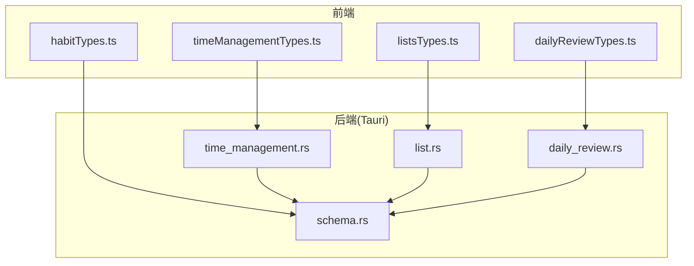
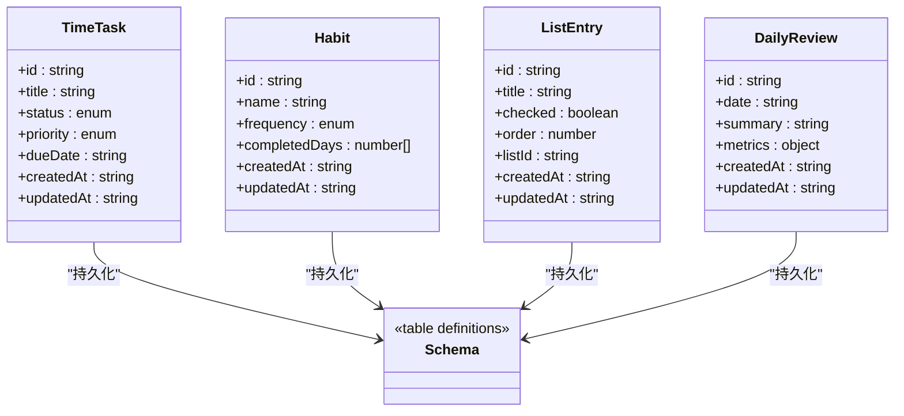
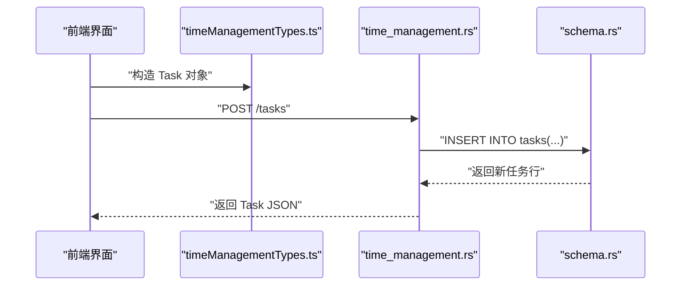
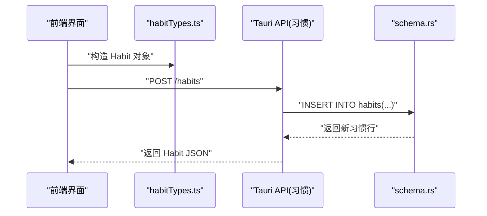
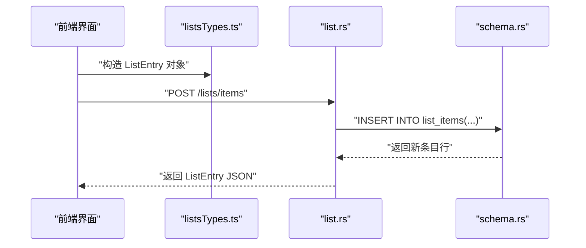
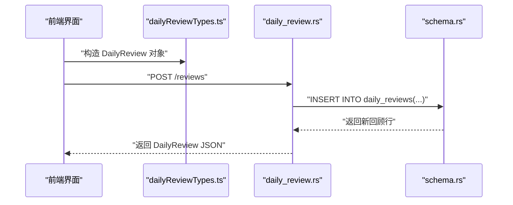
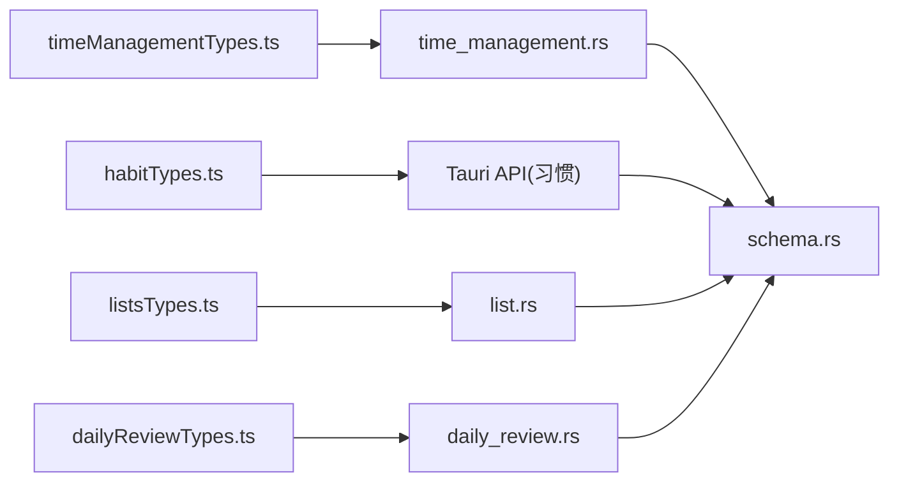

# 数据类型参考

<cite>
**本文引用的文件**   
- [src/features/time-management/timeManagementTypes.ts](file://src/features/time-management/timeManagementTypes.ts)
- [src/features/habits/habitTypes.ts](file://src/features/habits/habitTypes.ts)
- [src/features/lists/listsTypes.ts](file://src/features/lists/listsTypes.ts)
- [src/features/daily-review/dailyReviewTypes.ts](file://src/features/daily-review/dailyReviewTypes.ts)
- [src-tauri/src/schema.rs](file://src-tauri/src/schema.rs)
- [src-tauri/src/time_management.rs](file://src-tauri/src/time_management.rs)
- [src-tauri/src/list.rs](file://src-tauri/src/list.rs)
- [src-tauri/src/daily_review.rs](file://src-tauri/src/daily_review.rs)
</cite>

## 目录
1. [简介](#简介)
2. [项目结构](#项目结构)
3. [核心组件](#核心组件)
4. [架构总览](#架构总览)
5. [详细组件分析](#详细组件分析)
6. [依赖关系分析](#依赖关系分析)
7. [性能考虑](#性能考虑)
8. [故障排查指南](#故障排查指南)
9. [结论](#结论)
10. [附录](#附录)

## 简介
本文件为 FishWorker 的数据类型参考文档，聚焦于任务、习惯、清单、回顾等核心实体的字段定义、约束条件与关系映射。文档同时提供 TypeScript 类型定义与 Rust 结构体定义的对照说明，并总结数据验证规则、枚举值含义、默认值设置、迁移策略、版本兼容性与序列化/反序列化最佳实践，帮助前后端开发者在跨语言协作中保持一致的数据契约。

## 项目结构
FishWorker 采用前端（TypeScript/React）与后端（Tauri + Rust）分层组织：
- 前端类型集中在 features 目录下，按功能域划分；
- 后端模型与数据库 schema 位于 src-tauri/src 下，包含表结构与 Tauri API 层。

图表来源
- [src/features/time-management/timeManagementTypes.ts](file://src/features/time-management/timeManagementTypes.ts)
- [src/features/habits/habitTypes.ts](file://src/features/habits/habitTypes.ts)
- [src/features/lists/listsTypes.ts](file://src/features/lists/listsTypes.ts)
- [src/features/daily-review/dailyReviewTypes.ts](file://src/features/daily-review/dailyReviewTypes.ts)
- [src-tauri/src/schema.rs](file://src-tauri/src/schema.rs)
- [src-tauri/src/time_management.rs](file://src-tauri/src/time_management.rs)
- [src-tauri/src/list.rs](file://src-tauri/src/list.rs)
- [src-tauri/src/daily_review.rs](file://src-tauri/src/daily_review.rs)

章节来源
- [src/features/time-management/timeManagementTypes.ts](file://src/features/time-management/timeManagementTypes.ts)
- [src/features/habits/habitTypes.ts](file://src/features/habits/habitTypes.ts)
- [src/features/lists/listsTypes.ts](file://src/features/lists/listsTypes.ts)
- [src/features/daily-review/dailyReviewTypes.ts](file://src/features/daily-review/dailyReviewTypes.ts)
- [src-tauri/src/schema.rs](file://src-tauri/src/schema.rs)
- [src-tauri/src/time_management.rs](file://src-tauri/src/time_management.rs)
- [src-tauri/src/list.rs](file://src-tauri/src/list.rs)
- [src-tauri/src/daily_review.rs](file://src-tauri/src/daily_review.rs)

## 核心组件
本节概述四大核心领域的数据模型及其职责边界：
- 时间管理（任务）：用于表达待办事项、计划与执行状态，支撑每日四象限与周计划视图。
- 习惯：用于追踪重复性行为的完成度与周期统计。
- 清单：用于结构化条目集合，支持分组、排序与模板化。
- 每日回顾：用于记录反思、复盘与关键指标汇总。

章节来源
- [src/features/time-management/timeManagementTypes.ts](file://src/features/time-management/timeManagementTypes.ts)
- [src/features/habits/habitTypes.ts](file://src/features/habits/habitTypes.ts)
- [src/features/lists/listsTypes.ts](file://src/features/lists/listsTypes.ts)
- [src/features/daily-review/dailyReviewTypes.ts](file://src/features/daily-review/dailyReviewTypes.ts)

## 架构总览
下图展示前端类型到后端 Rust 模型的映射关系以及持久化层（schema）的参与方式。

图表来源
- [src/features/time-management/timeManagementTypes.ts](file://src/features/time-management/timeManagementTypes.ts)
- [src/features/habits/habitTypes.ts](file://src/features/habits/habitTypes.ts)
- [src/features/lists/listsTypes.ts](file://src/features/lists/listsTypes.ts)
- [src/features/daily-review/dailyReviewTypes.ts](file://src/features/daily-review/dailyReviewTypes.ts)
- [src-tauri/src/schema.rs](file://src-tauri/src/schema.rs)

## 详细组件分析

### 时间管理（任务）
- 字段与约束
  - id：唯一标识，字符串类型，建议遵循 UUID v4 格式。
  - title：标题，非空，长度上限建议限制（例如 256）。
  - status：任务状态枚举，常见取值包括“待办”、“进行中”、“已完成”、“已取消”。
  - priority：优先级枚举，常见取值包括“低”、“中”、“高”、“紧急”。
  - dueDate：截止时间，ISO 8601 日期或日期时间字符串。
  - createdAt / updatedAt：创建与更新时间戳，ISO 8601 字符串。
- 关系映射
  - 任务属于某个用户上下文（由应用会话或配置决定），不直接与其他实体外键关联。
- 验证规则
  - 必填字段：id、title、status、priority、dueDate。
  - 时间校验：dueDate 需为合法日期且晚于当前时间（可选业务规则）。
  - 枚举校验：status/priority 必须为允许值之一。
- 默认值
  - status 默认“待办”，priority 默认“中”，createdAt/updatedAt 由服务端生成。
- 序列化/反序列化
  - 前端 JSON 使用 ISO 8601 字符串表示时间；Rust 侧解析时统一转换为本地时间或 UTC。
- 迁移与兼容性
  - 新增字段应可空并提供默认值；删除字段需通过迁移脚本清理历史数据。
- 典型流程（序列图）

图表来源
- [src/features/time-management/timeManagementTypes.ts](file://src/features/time-management/timeManagementTypes.ts)
- [src-tauri/src/time_management.rs](file://src-tauri/src/time_management.rs)
- [src-tauri/src/schema.rs](file://src-tauri/src/schema.rs)

章节来源
- [src/features/time-management/timeManagementTypes.ts](file://src/features/time-management/timeManagementTypes.ts)
- [src-tauri/src/time_management.rs](file://src-tauri/src/time_management.rs)
- [src-tauri/src/schema.rs](file://src-tauri/src/schema.rs)

### 习惯
- 字段与约束
  - id：唯一标识，字符串。
  - name：习惯名称，非空，长度上限建议限制（例如 128）。
  - frequency：频率枚举，如“每日”、“每周”、“每月”。
  - completedDays：完成日期数组，元素为 ISO 8601 日期字符串。
  - createdAt / updatedAt：时间戳。
- 关系映射
  - 习惯独立存在，不与任务或清单强耦合。
- 验证规则
  - 必填字段：id、name、frequency。
  - completedDays 去重并按升序排列。
  - frequency 必须为允许值之一。
- 默认值
  - completedDays 默认为空数组；createdAt/updatedAt 由服务端生成。
- 序列化/反序列化
  - completedDays 以字符串数组形式传输；Rust 侧解析后做去重与排序。
- 迁移与兼容性
  - 若引入新的频率粒度（如“每两周”），需在旧客户端提供降级显示逻辑。
- 典型流程（序列图）

图表来源
- [src/features/habits/habitTypes.ts](file://src/features/habits/habitTypes.ts)
- [src-tauri/src/schema.rs](file://src-tauri/src/schema.rs)

章节来源
- [src/features/habits/habitTypes.ts](file://src/features/habits/habitTypes.ts)
- [src-tauri/src/schema.rs](file://src-tauri/src/schema.rs)

### 清单
- 字段与约束
  - id：唯一标识，字符串。
  - title：清单标题，非空，长度上限建议限制（例如 128）。
  - checked：是否勾选，布尔值。
  - order：排序序号，整数，非负。
  - listId：所属清单 ID，字符串，非空。
  - createdAt / updatedAt：时间戳。
- 关系映射
  - 条目隶属于某清单（listId 作为外键语义）。
- 验证规则
  - 必填字段：id、title、listId、order。
  - order 全局唯一（同一 listId 内）。
  - checked 仅允许 true/false。
- 默认值
  - checked 默认 false；order 由插入顺序或显式指定。
- 序列化/反序列化
  - 列表项以数组形式传输，保持前端交互顺序；后端写入时更新 order。
- 迁移与兼容性
  - 如需引入分组或标签，先增加可空字段并提供默认值，再逐步迁移历史数据。
- 典型流程（序列图）

图表来源
- [src/features/lists/listsTypes.ts](file://src/features/lists/listsTypes.ts)
- [src-tauri/src/list.rs](file://src-tauri/src/list.rs)
- [src-tauri/src/schema.rs](file://src-tauri/src/schema.rs)

章节来源
- [src/features/lists/listsTypes.ts](file://src/features/lists/listsTypes.ts)
- [src-tauri/src/list.rs](file://src-tauri/src/list.rs)
- [src-tauri/src/schema.rs](file://src-tauri/src/schema.rs)

### 每日回顾
- 字段与约束
  - id：唯一标识，字符串。
  - date：回顾日期，ISO 8601 字符串。
  - summary：总结文本，非空，长度上限建议限制（例如 4096）。
  - metrics：指标对象，键值对结构（如完成率、专注时长等）。
  - createdAt / updatedAt：时间戳。
- 关系映射
  - 回顾独立存在，可与任务/习惯聚合统计但不建立强外键。
- 验证规则
  - 必填字段：id、date、summary。
  - metrics 为对象类型，键名固定且值类型为数字或字符串。
- 默认值
  - metrics 默认空对象；createdAt/updatedAt 由服务端生成。
- 序列化/反序列化
  - metrics 以 JSON 对象传输；Rust 侧解析为结构体或动态对象。
- 迁移与兼容性
  - 扩展 metrics 字段时，旧客户端忽略未知键即可。
- 典型流程（序列图）

图表来源
- [src/features/daily-review/dailyReviewTypes.ts](file://src/features/daily-review/dailyReviewTypes.ts)
- [src-tauri/src/daily_review.rs](file://src-tauri/src/daily_review.rs)
- [src-tauri/src/schema.rs](file://src-tauri/src/schema.rs)

章节来源
- [src/features/daily-review/dailyReviewTypes.ts](file://src/features/daily-review/dailyReviewTypes.ts)
- [src-tauri/src/daily_review.rs](file://src-tauri/src/daily_review.rs)
- [src-tauri/src/schema.rs](file://src-tauri/src/schema.rs)

## 依赖关系分析
- 模块内聚与耦合
  - 各功能域类型定义相互独立，降低耦合；
  - 后端通过 schema.rs 集中描述表结构，API 层（time_management.rs、list.rs、daily_review.rs）负责读写。
- 外部依赖
  - 时间处理：ISO 8601 字符串在前后端一致；
  - 数据库：Rust 侧通过 ORM/SQL 驱动访问 schema.rs 定义的表。
- 潜在循环依赖
  - 前端类型与后端 API 无直接导入关系，避免循环依赖。

图表来源
- [src/features/time-management/timeManagementTypes.ts](file://src/features/time-management/timeManagementTypes.ts)
- [src/features/habits/habitTypes.ts](file://src/features/habits/habitTypes.ts)
- [src/features/lists/listsTypes.ts](file://src/features/lists/listsTypes.ts)
- [src/features/daily-review/dailyReviewTypes.ts](file://src/features/daily-review/dailyReviewTypes.ts)
- [src-tauri/src/time_management.rs](file://src-tauri/src/time_management.rs)
- [src-tauri/src/list.rs](file://src-tauri/src/list.rs)
- [src-tauri/src/daily_review.rs](file://src-tauri/src/daily_review.rs)
- [src-tauri/src/schema.rs](file://src-tauri/src/schema.rs)

章节来源
- [src-tauri/src/schema.rs](file://src-tauri/src/schema.rs)
- [src-tauri/src/time_management.rs](file://src-tauri/src/time_management.rs)
- [src-tauri/src/list.rs](file://src-tauri/src/list.rs)
- [src-tauri/src/daily_review.rs](file://src-tauri/src/daily_review.rs)

## 性能考虑
- 批量操作
  - 清单条目与习惯完成日期的批量写入建议使用事务与批量插入接口，减少往返开销。
- 索引优化
  - 高频查询字段（如任务的 dueDate、status；清单的 listId、order）应建立合适索引。
- 序列化成本
  - 大对象（如 review.metrics）按需加载与增量更新，避免全量传输。
- 缓存策略
  - 只读数据（如枚举字典、模板）可在前端缓存，减少重复请求。

[本节为通用指导，无需特定文件引用]

## 故障排查指南
- 常见错误
  - 时间格式错误：确保 ISO 8601 字符串正确；检查时区转换。
  - 枚举值非法：确认前端传入值为后端允许集合之一。
  - 必填字段缺失：在 API 层进行严格校验并返回明确错误信息。
- 定位步骤
  - 查看前端类型定义与实际发送载荷是否一致；
  - 检查后端 API 日志与数据库写入结果；
  - 对比 schema.rs 的列约束与前端输入。
- 恢复策略
  - 对失败的事务进行回滚；
  - 提供重试机制与幂等键以避免重复写入。

章节来源
- [src-tauri/src/time_management.rs](file://src-tauri/src/time_management.rs)
- [src-tauri/src/list.rs](file://src-tauri/src/list.rs)
- [src-tauri/src/daily_review.rs](file://src-tauri/src/daily_review.rs)
- [src-tauri/src/schema.rs](file://src-tauri/src/schema.rs)

## 结论
FishWorker 的核心数据类型围绕任务、习惯、清单与回顾展开，前后端通过一致的 JSON 契约与 ISO 8601 时间格式协作。建议在新增字段时遵循向后兼容原则，完善校验与索引，并在迁移过程中保证数据一致性。

[本节为总结性内容，无需特定文件引用]

## 附录

### TypeScript 与 Rust 类型对照要点
- 字符串与数值
  - 前端 string/number 对应 Rust String/i32/i64/u32 等；注意范围与精度。
- 布尔值
  - 前端 boolean 对应 Rust bool。
- 枚举
  - 前端字符串枚举在后端用 Rust enum 或整型常量表示，需保持映射一致。
- 时间
  - 前端 ISO 8601 字符串，Rust 侧解析为 chrono::DateTime 或 NaiveDate/Time。
- 对象与数组
  - 前端对象/数组对应 Rust struct 与 Vec<T>；复杂对象建议拆分为子结构以提升可读性。

章节来源
- [src/features/time-management/timeManagementTypes.ts](file://src/features/time-management/timeManagementTypes.ts)
- [src/features/habits/habitTypes.ts](file://src/features/habits/habitTypes.ts)
- [src/features/lists/listsTypes.ts](file://src/features/lists/listsTypes.ts)
- [src/features/daily-review/dailyReviewTypes.ts](file://src/features/daily-review/dailyReviewTypes.ts)
- [src-tauri/src/schema.rs](file://src-tauri/src/schema.rs)

### 数据迁移策略与版本兼容性
- 新增字段
  - 优先添加可空字段并提供默认值；
  - 分阶段推进：后端先支持，前端再消费。
- 删除字段
  - 标记废弃并保留一段时间；
  - 通过迁移脚本清理历史数据。
- 枚举变更
  - 新增取值而非替换旧值；
  - 前端对未知枚举值进行降级显示。
- 向后兼容保证
  - 所有响应包含版本号或能力协商字段；
  - 客户端忽略未知字段，避免破坏性变更。

章节来源
- [src-tauri/src/schema.rs](file://src-tauri/src/schema.rs)
- [src-tauri/src/time_management.rs](file://src-tauri/src/time_management.rs)
- [src-tauri/src/list.rs](file://src-tauri/src/list.rs)
- [src-tauri/src/daily_review.rs](file://src-tauri/src/daily_review.rs)

### 序列化与反序列化最佳实践
- 时间
  - 统一使用 ISO 8601 字符串；避免毫秒级歧义与时区问题。
- 枚举
  - 使用稳定字符串标识符，避免数字编码带来的脆弱性。
- 对象
  - 对大型对象采用分页或增量更新；
  - 对可选字段使用 null 或省略策略，避免冗余。
- 校验
  - 在 API 入口进行严格校验，尽早失败并返回清晰错误码。
- 幂等
  - 为写操作提供幂等键，防止网络重试导致重复写入。

章节来源
- [src-tauri/src/time_management.rs](file://src-tauri/src/time_management.rs)
- [src-tauri/src/list.rs](file://src-tauri/src/list.rs)
- [src-tauri/src/daily_review.rs](file://src-tauri/src/daily_review.rs)
- [src-tauri/src/schema.rs](file://src-tauri/src/schema.rs)