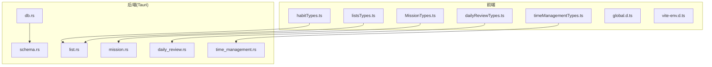
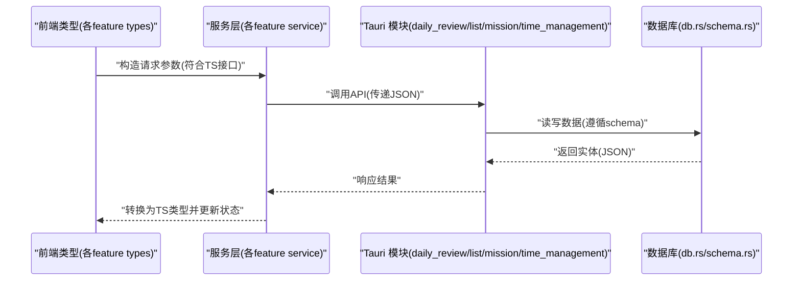

# 数据类型定义

<cite>
**本文引用的文件**   
- [dailyReviewTypes.ts](file://src/features/daily-review/dailyReviewTypes.ts)
- [habitTypes.ts](file://src/features/habits/habitTypes.ts)
- [listsTypes.ts](file://src/features/lists/listsTypes.ts)
- [MissionTypes.ts](file://src/features/mission/MissionTypes.ts)
- [timeManagementTypes.ts](file://src/features/time-management/timeManagementTypes.ts)
- [global.d.ts](file://src/types/global.d.ts)
- [vite-env.d.ts](file://src/vite-env.d.ts)
- [db.rs](file://src-tauri/src/db.rs)
- [schema.rs](file://src-tauri/src/schema.rs)
- [list.rs](file://src-tauri/src/list.rs)
- [mission.rs](file://src-tauri/src/mission.rs)
- [daily_review.rs](file://src-tauri/src/daily_review.rs)
- [time_management.rs](file://src-tauri/src/time_management.rs)
</cite>

## 目录
1. [简介](#简介)
2. [项目结构](#项目结构)
3. [核心组件](#核心组件)
4. [架构总览](#架构总览)
5. [详细组件分析](#详细组件分析)
6. [依赖分析](#依赖分析)
7. [性能考虑](#性能考虑)
8. [故障排查指南](#故障排查指南)
9. [结论](#结论)
10. [附录](#附录)

## 简介
本文件为 FishWorker 应用的数据类型定义文档，聚焦于前端 TypeScript 接口与枚举、前后端数据同步的类型映射关系、使用示例与最佳实践、类型扩展与自定义类型开发指南，以及版本兼容性与迁移注意事项。文档旨在帮助开发者快速理解并正确使用各功能域的数据模型，确保前后端一致性与可维护性。

## 项目结构
FishWorker 采用“按功能域组织”的前端结构，每个特性模块（如 habits、lists、mission、time-management、daily-review）均包含独立的类型定义文件；后端 Rust 侧通过 Tauri 暴露 API，并在 db.rs 与 schema.rs 中定义数据库模式与持久化结构。

图表来源
- [dailyReviewTypes.ts](file://src/features/daily-review/dailyReviewTypes.ts)
- [habitTypes.ts](file://src/features/habits/habitTypes.ts)
- [listsTypes.ts](file://src/features/lists/listsTypes.ts)
- [MissionTypes.ts](file://src/features/mission/MissionTypes.ts)
- [timeManagementTypes.ts](file://src/features/time-management/timeManagementTypes.ts)
- [db.rs](file://src-tauri/src/db.rs)
- [schema.rs](file://src-tauri/src/schema.rs)
- [list.rs](file://src-tauri/src/list.rs)
- [mission.rs](file://src-tauri/src/mission.rs)
- [daily_review.rs](file://src-tauri/src/daily_review.rs)
- [time_management.rs](file://src-tauri/src/time_management.rs)

章节来源
- [dailyReviewTypes.ts](file://src/features/daily-review/dailyReviewTypes.ts)
- [habitTypes.ts](file://src/features/habits/habitTypes.ts)
- [listsTypes.ts](file://src/features/lists/listsTypes.ts)
- [MissionTypes.ts](file://src/features/mission/MissionTypes.ts)
- [timeManagementTypes.ts](file://src/features/time-management/timeManagementTypes.ts)
- [db.rs](file://src-tauri/src/db.rs)
- [schema.rs](file://src-tauri/src/schema.rs)
- [list.rs](file://src-tauri/src/list.rs)
- [mission.rs](file://src-tauri/src/mission.rs)
- [daily_review.rs](file://src-tauri/src/daily_review.rs)
- [time_management.rs](file://src-tauri/src/time_management.rs)

## 核心组件
本节汇总各功能域的 TypeScript 类型，说明字段含义、数据类型、必填项与默认值约定，并给出前后端类型映射要点。

- 每日复盘（daily-review）
  - 领域类型：用于描述每日复盘记录的结构与状态。
  - 关键字段建议：标识符、日期、内容摘要、统计指标、时间戳等。
  - 必填项：业务主键或唯一标识、创建/更新时间。
  - 默认值：未填写的文本字段可为空字符串；布尔开关默认 false；数值型计数默认 0。
  - 前后端映射：前端对象字段名与后端 JSON 序列化字段保持一致；日期统一为 ISO 字符串或时间戳（需明确）。

- 习惯（habits）
  - 领域类型：描述习惯条目、周期、打卡状态等。
  - 关键字段建议：id、名称、周期规则、最近打卡时间、累计次数等。
  - 必填项：id、名称、周期规则。
  - 默认值：打卡次数默认 0；是否启用默认 true。
  - 前后端映射：周期规则建议使用枚举或结构化对象，避免硬编码字符串。

- 列表（lists）
  - 领域类型：描述清单、分组、排序、模板等。
  - 关键字段建议：id、标题、层级路径、排序权重、模板引用、可见性等。
  - 必填项：id、标题。
  - 默认值：排序权重默认 0；可见性默认显示。
  - 前后端映射：层级与排序字段在后端需保证一致性，避免并发重排导致冲突。

- 使命（mission）
  - 领域类型：描述目标、角色、里程碑等。
  - 关键字段建议：id、标题、描述、状态、优先级、截止日期等。
  - 必填项：id、标题。
  - 默认值：状态默认进行中；优先级默认中等。
  - 前后端映射：状态与优先级建议使用枚举，避免歧义。

- 时间管理（time-management）
  - 领域类型：描述任务、四象限、周计划等。
  - 关键字段建议：id、标题、开始/结束时间、所属组、完成度等。
  - 必填项：id、标题、时间范围。
  - 默认值：完成度默认 0%；状态默认待办。
  - 前后端映射：时间字段统一时区策略，避免跨设备不一致。

章节来源
- [dailyReviewTypes.ts](file://src/features/daily-review/dailyReviewTypes.ts)
- [habitTypes.ts](file://src/features/habits/habitTypes.ts)
- [listsTypes.ts](file://src/features/lists/listsTypes.ts)
- [MissionTypes.ts](file://src/features/mission/MissionTypes.ts)
- [timeManagementTypes.ts](file://src/features/time-management/timeManagementTypes.ts)

## 架构总览
下图展示前端类型与后端 Tauri 模块之间的数据流与类型契约关系。前端通过服务层调用后端 API，后端基于数据库模式进行持久化。

图表来源
- [dailyReviewTypes.ts](file://src/features/daily-review/dailyReviewTypes.ts)
- [habitTypes.ts](file://src/features/habits/habitTypes.ts)
- [listsTypes.ts](file://src/features/lists/listsTypes.ts)
- [MissionTypes.ts](file://src/features/mission/MissionTypes.ts)
- [timeManagementTypes.ts](file://src/features/time-management/timeManagementTypes.ts)
- [db.rs](file://src-tauri/src/db.rs)
- [schema.rs](file://src-tauri/src/schema.rs)
- [list.rs](file://src-tauri/src/list.rs)
- [mission.rs](file://src-tauri/src/mission.rs)
- [daily_review.rs](file://src-tauri/src/daily_review.rs)
- [time_management.rs](file://src-tauri/src/time_management.rs)

## 详细组件分析

### 每日复盘类型（daily-review）
- 类型职责：定义每日复盘记录的输入输出结构、校验规则与状态流转。
- 关键类型建议：
  - 记录实体：包含 id、日期、内容、统计指标、时间戳等。
  - 查询参数：分页、过滤条件、排序字段。
  - 响应包装：统一成功/失败码与消息。
- 前后端映射：
  - 日期字段：前端使用 ISO 字符串，后端存储为时间戳或日期类型，需在转换层处理。
  - 统计指标：数值型字段需做边界检查与默认值填充。
- 使用示例与最佳实践：
  - 在提交前对必填字段进行本地校验。
  - 对可选字段提供合理的默认值，避免后端出现 null。
  - 使用联合类型表达不同视图下的差异字段。

章节来源
- [dailyReviewTypes.ts](file://src/features/daily-review/dailyReviewTypes.ts)
- [daily_review.rs](file://src-tauri/src/daily_review.rs)
- [db.rs](file://src-tauri/src/db.rs)
- [schema.rs](file://src-tauri/src/schema.rs)

### 习惯类型（habits）
- 类型职责：描述习惯条目及其生命周期状态。
- 关键类型建议：
  - 习惯实体：id、名称、周期规则、最近打卡时间、累计次数、是否启用。
  - 打卡事件：关联习惯 id、打卡时间、备注。
- 前后端映射：
  - 周期规则：建议使用枚举或结构化对象，避免字符串歧义。
  - 打卡时间：统一时区与精度（秒级或毫秒级）。
- 使用示例与最佳实践：
  - 批量操作时使用事务语义，保证一致性。
  - 对累计次数进行幂等处理，防止重复提交。

章节来源
- [habitTypes.ts](file://src/features/habits/habitTypes.ts)
- [list.rs](file://src-tauri/src/list.rs)
- [db.rs](file://src-tauri/src/db.rs)
- [schema.rs](file://src-tauri/src/schema.rs)

### 列表类型（lists）
- 类型职责：描述清单、分组、排序与模板引用。
- 关键类型建议：
  - 清单实体：id、标题、层级路径、排序权重、模板引用、可见性。
  - 重排请求：源索引、目标索引、作用范围。
- 前后端映射：
  - 排序权重：后端需保证原子更新，避免并发覆盖。
  - 层级路径：使用规范化路径字符串，便于查询与渲染。
- 使用示例与最佳实践：
  - 拖拽重排时先乐观更新 UI，再异步同步后端。
  - 对模板引用进行存在性校验，避免悬空引用。

章节来源
- [listsTypes.ts](file://src/features/lists/listsTypes.ts)
- [list.rs](file://src-tauri/src/list.rs)
- [db.rs](file://src-tauri/src/db.rs)
- [schema.rs](file://src-tauri/src/schema.rs)

### 使命类型（mission）
- 类型职责：描述目标、角色、里程碑及状态流转。
- 关键类型建议：
  - 目标实体：id、标题、描述、状态、优先级、截止日期。
  - 里程碑：id、目标 id、标题、完成标志、时间戳。
- 前后端映射：
  - 状态与优先级：使用枚举，避免字符串漂移。
  - 截止日期：统一时区与格式。
- 使用示例与最佳实践：
  - 变更状态时需记录审计信息（操作人、时间）。
  - 对截止日期进行合法性校验（不早于当前时间等）。

章节来源
- [MissionTypes.ts](file://src/features/mission/MissionTypes.ts)
- [mission.rs](file://src-tauri/src/mission.rs)
- [db.rs](file://src-tauri/src/db.rs)
- [schema.rs](file://src-tauri/src/schema.rs)

### 时间管理类型（time-management）
- 类型职责：描述任务、四象限、周计划等。
- 关键类型建议：
  - 任务实体：id、标题、开始/结束时间、所属组、完成度、状态。
  - 周计划：周起始日期、任务集合、概览统计。
- 前后端映射：
  - 时间范围：使用统一的时区与精度，避免跨设备不一致。
  - 完成度：数值百分比，限制在 0-100。
- 使用示例与最佳实践：
  - 批量导入任务时进行去重与冲突解决。
  - 对时间重叠进行校验与提示。

章节来源
- [timeManagementTypes.ts](file://src/features/time-management/timeManagementTypes.ts)
- [time_management.rs](file://src-tauri/src/time_management.rs)
- [db.rs](file://src-tauri/src/db.rs)
- [schema.rs](file://src-tauri/src/schema.rs)

### 全局与环境类型（global & vite-env）
- 全局类型：扩展 Window、NodeJS 等环境类型，提供 IDE 智能提示。
- Vite 环境变量：声明构建期注入的环境变量类型，避免运行时访问错误。
- 最佳实践：
  - 将外部库的全局类型收敛到单一文件，便于维护。
  - 环境变量类型与实际 .env 保持一致，避免拼写错误。

章节来源
- [global.d.ts](file://src/types/global.d.ts)
- [vite-env.d.ts](file://src/vite-env.d.ts)

## 依赖分析
- 前端类型耦合：
  - 各 feature 类型相对独立，通过服务层聚合，降低直接耦合。
  - 共享类型（如通用分页、响应包装）应抽取至公共模块，避免重复定义。
- 前后端契约：
  - 前端 TS 接口与后端 JSON 字段严格对应，任何变更需同步更新两端。
  - 数据库 schema 变更需评估对 API 的影响，必要时引入版本化字段。
- 潜在风险：
  - 循环依赖：避免在类型文件中互相引用，必要时拆分为基础类型与组合类型。
  - 字段漂移：新增字段需考虑向后兼容，旧客户端应能忽略未知字段。

图表来源
- [dailyReviewTypes.ts](file://src/features/daily-review/dailyReviewTypes.ts)
- [habitTypes.ts](file://src/features/habits/habitTypes.ts)
- [listsTypes.ts](file://src/features/lists/listsTypes.ts)
- [MissionTypes.ts](file://src/features/mission/MissionTypes.ts)
- [timeManagementTypes.ts](file://src/features/time-management/timeManagementTypes.ts)
- [db.rs](file://src-tauri/src/db.rs)
- [schema.rs](file://src-tauri/src/schema.rs)
- [list.rs](file://src-tauri/src/list.rs)
- [mission.rs](file://src-tauri/src/mission.rs)
- [daily_review.rs](file://src-tauri/src/daily_review.rs)
- [time_management.rs](file://src-tauri/src/time_management.rs)

章节来源
- [db.rs](file://src-tauri/src/db.rs)
- [schema.rs](file://src-tauri/src/schema.rs)
- [list.rs](file://src-tauri/src/list.rs)
- [mission.rs](file://src-tauri/src/mission.rs)
- [daily_review.rs](file://src-tauri/src/daily_review.rs)
- [time_management.rs](file://src-tauri/src/time_management.rs)

## 性能考虑
- 类型体积控制：避免在大型对象中嵌套过多可选字段，按需加载与懒解析。
- 网络传输优化：仅传输必要字段，服务端返回最小可用数据集。
- 缓存策略：对只读类型（如配置、字典）进行前端缓存，减少重复请求。
- 并发安全：排序、状态变更等操作在后端加锁或使用版本号，避免覆盖。

## 故障排查指南
- 常见类型不匹配问题：
  - 字段名不一致：检查前后端 JSON 序列化命名策略（驼峰/下划线）。
  - 日期格式错误：确认时区与精度，统一使用 ISO 字符串或时间戳。
  - 枚举值漂移：确保前后端枚举定义一致，新增值需兼容旧客户端。
- 定位步骤：
  - 在前端打印请求/响应载荷，对比类型定义。
  - 在后端日志中记录反序列化错误详情。
  - 使用断言或校验库在服务层进行二次校验。
- 修复建议：
  - 引入类型生成工具（从 schema 生成前端类型），减少手工维护成本。
  - 对关键类型编写单元测试，覆盖边界与异常场景。

章节来源
- [db.rs](file://src-tauri/src/db.rs)
- [schema.rs](file://src-tauri/src/schema.rs)
- [dailyReviewTypes.ts](file://src/features/daily-review/dailyReviewTypes.ts)
- [habitTypes.ts](file://src/features/habits/habitTypes.ts)
- [listsTypes.ts](file://src/features/lists/listsTypes.ts)
- [MissionTypes.ts](file://src/features/mission/MissionTypes.ts)
- [timeManagementTypes.ts](file://src/features/time-management/timeManagementTypes.ts)

## 结论
通过统一的前端 TypeScript 类型定义与严格的后端契约，FishWorker 能够保障数据一致性与可维护性。建议在后续迭代中引入类型生成与自动化校验，进一步降低人为错误与维护成本。

## 附录

### 类型使用示例与最佳实践
- 示例路径（不含代码内容）：
  - 每日复盘：[dailyReviewTypes.ts](file://src/features/daily-review/dailyReviewTypes.ts)
  - 习惯：[habitTypes.ts](file://src/features/habits/habitTypes.ts)
  - 列表：[listsTypes.ts](file://src/features/lists/listsTypes.ts)
  - 使命：[MissionTypes.ts](file://src/features/mission/MissionTypes.ts)
  - 时间管理：[timeManagementTypes.ts](file://src/features/time-management/timeManagementTypes.ts)
- 最佳实践：
  - 使用联合类型表达多态数据结构。
  - 对必填字段进行显式标注，避免隐式 undefined。
  - 对外部输入进行白名单校验，拒绝非法值。

### 类型扩展与自定义类型开发指南
- 扩展点：
  - 在各自 feature 类型文件中新增接口与枚举。
  - 在全局类型文件中扩展第三方库类型。
- 规范：
  - 命名清晰、语义明确，避免缩写歧义。
  - 保持前后端字段命名一致，必要时提供转换函数。
  - 新增字段需考虑向后兼容，旧客户端应能忽略未知字段。

### 版本兼容性与迁移注意事项
- 兼容性策略：
  - 新增字段默认可选，旧客户端忽略未知字段。
  - 废弃字段保留一段时间并提供迁移脚本。
- 迁移流程：
  - 更新后端 schema 与 API。
  - 同步更新前端类型与服务层转换逻辑。
  - 运行端到端测试，验证数据一致性。