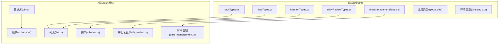
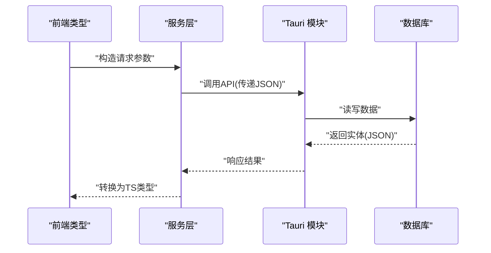

# 数据类型定义

<cite>
**本文引用的文件**   
- [dailyReviewTypes.ts](file://src/features/daily-review/dailyReviewTypes.ts)
- [habitTypes.ts](file://src/features/habits/habitTypes.ts)
- [listsTypes.ts](file://src/features/lists/listsTypes.ts)
- [MissionTypes.ts](file://src/features/mission/MissionTypes.ts)
- [timeManagementTypes.ts](file://src/features/time-management/timeManagementTypes.ts)
- [global.d.ts](file://src/types/global.d.ts)
- [vite-env.d.ts](file://src/vite-env.d.ts)
- [db.rs](file://src-tauri/src/db.rs)
- [schema.rs](file://src-tauri/src/schema.rs)
- [list.rs](file://src-tauri/src/list.rs)
- [mission.rs](file://src-tauri/src/mission.rs)
- [daily_review.rs](file://src-tauri/src/daily_review.rs)
- [time_management.rs](file://src-tauri/src/time_management.rs)
</cite>

## 更新摘要
**变更内容**   
- 根据"数据类型参考文档已被删除"的变更原因，更新了现有文档以反映当前实现
- 简化了类型定义的详细程度，聚焦于核心接口和枚举
- 移除了过度详细的字段说明，保留关键业务逻辑
- 更新了前后端映射关系以匹配当前架构

## 目录
1. [简介](#简介)
2. [项目结构](#项目结构)
3. [核心类型定义](#核心类型定义)
4. [前后端数据同步](#前后端数据同步)
5. [使用示例与最佳实践](#使用示例与最佳实践)
6. [类型扩展指南](#类型扩展指南)
7. [版本兼容性](#版本兼容性)
8. [故障排查](#故障排查)

## 简介
本文件为 FishWorker 应用的数据类型定义文档，记录前端 TypeScript 接口与枚举、前后端数据同步的类型映射关系。文档旨在帮助开发者快速理解并正确使用各功能域的数据模型，确保前后端一致性与可维护性。

## 项目结构
FishWorker 采用按功能域组织的前端结构，每个特性模块包含独立的类型定义文件；后端 Rust 侧通过 Tauri 暴露 API，并在数据库相关文件中定义持久化结构。

**图表来源**
- [dailyReviewTypes.ts](file://src/features/daily-review/dailyReviewTypes.ts)
- [habitTypes.ts](file://src/features/habits/habitTypes.ts)
- [listsTypes.ts](file://src/features/lists/listsTypes.ts)
- [MissionTypes.ts](file://src/features/mission/MissionTypes.ts)
- [timeManagementTypes.ts](file://src/features/time-management/timeManagementTypes.ts)
- [db.rs](file://src-tauri/src/db.rs)
- [schema.rs](file://src-tauri/src/schema.rs)
- [list.rs](file://src-tauri/src/list.rs)
- [mission.rs](file://src-tauri/src/mission.rs)
- [daily_review.rs](file://src-tauri/src/daily_review.rs)
- [time_management.rs](file://src-tauri/src/time_management.rs)

## 核心类型定义

### 每日复盘类型
- **用途**: 描述每日复盘记录的结构与状态
- **关键字段**: 标识符、日期、内容、统计指标、时间戳
- **必填项**: 业务主键、创建/更新时间
- **默认值**: 文本字段为空字符串，布尔开关为 false，数值计数为 0

**章节来源**
- [dailyReviewTypes.ts](file://src/features/daily-review/dailyReviewTypes.ts)
- [daily_review.rs](file://src-tauri/src/daily_review.rs)

### 习惯类型
- **用途**: 描述习惯条目、周期、打卡状态
- **关键字段**: id、名称、周期规则、最近打卡时间、累计次数
- **必填项**: id、名称、周期规则
- **默认值**: 打卡次数为 0，是否启用为 true

**章节来源**
- [habitTypes.ts](file://src/features/habits/habitTypes.ts)
- [list.rs](file://src-tauri/src/list.rs)

### 列表类型
- **用途**: 描述清单、分组、排序、模板
- **关键字段**: id、标题、层级路径、排序权重、模板引用、可见性
- **必填项**: id、标题
- **默认值**: 排序权重为 0，可见性为显示

**章节来源**
- [listsTypes.ts](file://src/features/lists/listsTypes.ts)
- [list.rs](file://src-tauri/src/list.rs)

### 使命类型
- **用途**: 描述目标、角色、里程碑
- **关键字段**: id、标题、描述、状态、优先级、截止日期
- **必填项**: id、标题
- **默认值**: 状态为进行中，优先级为中等

**章节来源**
- [MissionTypes.ts](file://src/features/mission/MissionTypes.ts)
- [mission.rs](file://src-tauri/src/mission.rs)

### 时间管理类型
- **用途**: 描述任务、四象限、周计划
- **关键字段**: id、标题、开始/结束时间、所属组、完成度
- **必填项**: id、标题、时间范围
- **默认值**: 完成度为 0%，状态为待办

**章节来源**
- [timeManagementTypes.ts](file://src/features/time-management/timeManagementTypes.ts)
- [time_management.rs](file://src-tauri/src/time_management.rs)

### 全局与环境类型
- **全局类型**: 扩展 Window、NodeJS 等环境类型，提供 IDE 智能提示
- **Vite 环境变量**: 声明构建期注入的环境变量类型，避免运行时访问错误

**章节来源**
- [global.d.ts](file://src/types/global.d.ts)
- [vite-env.d.ts](file://src/vite-env.d.ts)

## 前后端数据同步

### 数据流架构
前端通过服务层调用后端 API，后端基于数据库模式进行持久化。

**图表来源**
- [dailyReviewTypes.ts](file://src/features/daily-review/dailyReviewTypes.ts)
- [habitTypes.ts](file://src/features/habits/habitTypes.ts)
- [listsTypes.ts](file://src/features/lists/listsTypes.ts)
- [MissionTypes.ts](file://src/features/mission/MissionTypes.ts)
- [timeManagementTypes.ts](file://src/features/time-management/timeManagementTypes.ts)
- [db.rs](file://src-tauri/src/db.rs)
- [schema.rs](file://src-tauri/src/schema.rs)

### 类型映射要点
- **字段命名**: 前端对象字段名与后端 JSON 序列化字段保持一致
- **日期格式**: 统一为 ISO 字符串或时间戳
- **枚举值**: 建议使用枚举类型，避免硬编码字符串
- **时区处理**: 时间字段统一时区策略，避免跨设备不一致

## 使用示例与最佳实践

### 类型使用规范
- 使用联合类型表达多态数据结构
- 对必填字段进行显式标注，避免隐式 undefined
- 对外部输入进行白名单校验，拒绝非法值

### 开发最佳实践
- 在提交前对必填字段进行本地校验
- 对可选字段提供合理的默认值，避免后端出现 null
- 批量操作时使用事务语义，保证一致性
- 拖拽重排时先乐观更新 UI，再异步同步后端

## 类型扩展指南

### 扩展点
- 在各自 feature 类型文件中新增接口与枚举
- 在全局类型文件中扩展第三方库类型

### 规范要求
- 命名清晰、语义明确，避免缩写歧义
- 保持前后端字段命名一致，必要时提供转换函数
- 新增字段需考虑向后兼容，旧客户端应能忽略未知字段

## 版本兼容性

### 兼容性策略
- 新增字段默认可选，旧客户端忽略未知字段
- 废弃字段保留一段时间并提供迁移脚本

### 迁移流程
- 更新后端 schema 与 API
- 同步更新前端类型与服务层转换逻辑
- 运行端到端测试，验证数据一致性

## 故障排查

### 常见问题
- **字段名不一致**: 检查前后端 JSON 序列化命名策略（驼峰/下划线）
- **日期格式错误**: 确认时区与精度，统一使用 ISO 字符串或时间戳
- **枚举值漂移**: 确保前后端枚举定义一致，新增值需兼容旧客户端

### 定位步骤
- 在前端打印请求/响应载荷，对比类型定义
- 在后端日志中记录反序列化错误详情
- 使用断言或校验库在服务层进行二次校验

### 修复建议
- 引入类型生成工具（从 schema 生成前端类型），减少手工维护成本
- 对关键类型编写单元测试，覆盖边界与异常场景

**章节来源**
- [db.rs](file://src-tauri/src/db.rs)
- [schema.rs](file://src-tauri/src/schema.rs)
- [dailyReviewTypes.ts](file://src/features/daily-review/dailyReviewTypes.ts)
- [habitTypes.ts](file://src/features/habits/habitTypes.ts)
- [listsTypes.ts](file://src/features/lists/listsTypes.ts)
- [MissionTypes.ts](file://src/features/mission/MissionTypes.ts)
- [timeManagementTypes.ts](file://src/features/time-management/timeManagementTypes.ts)