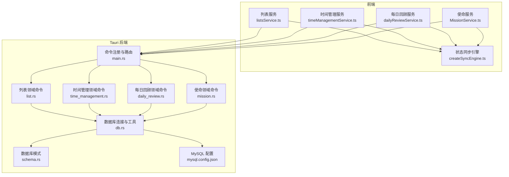
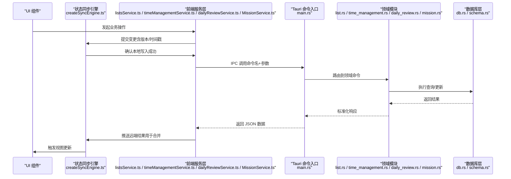
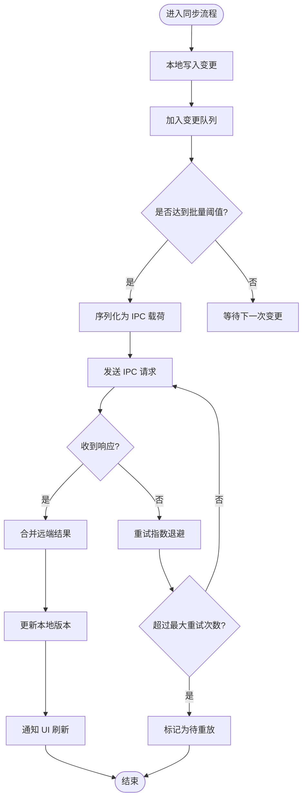
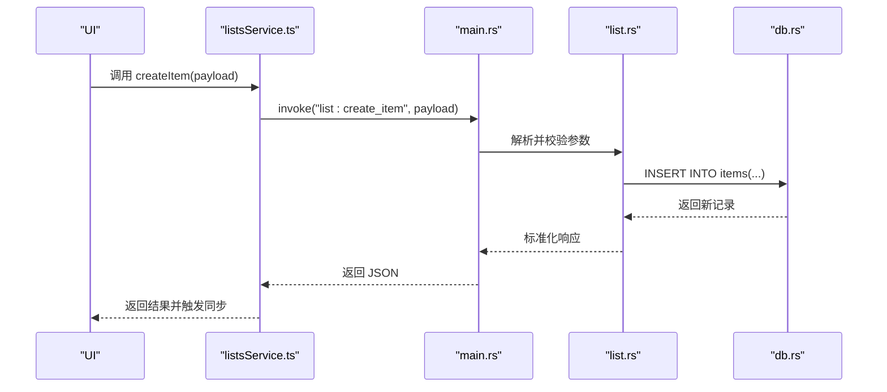
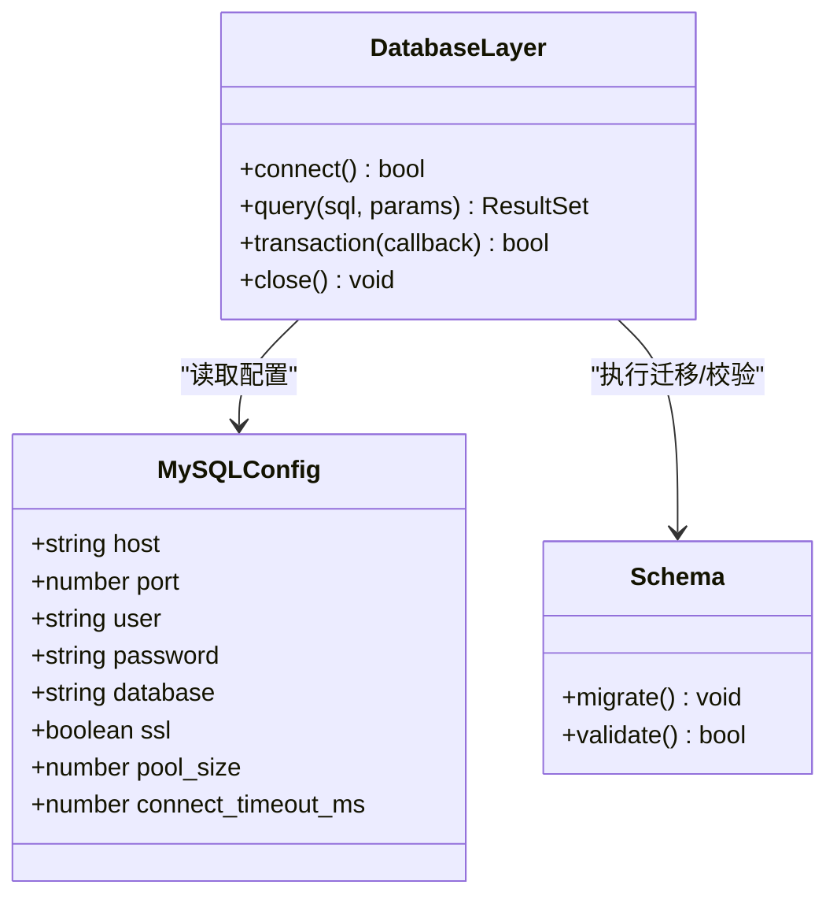
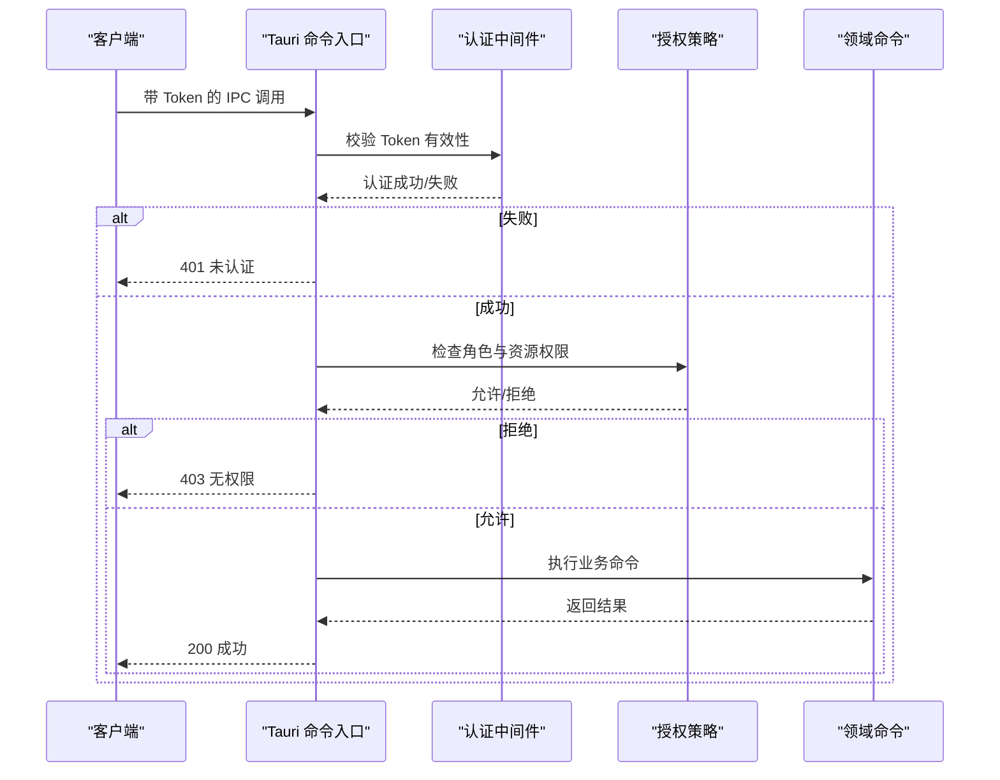
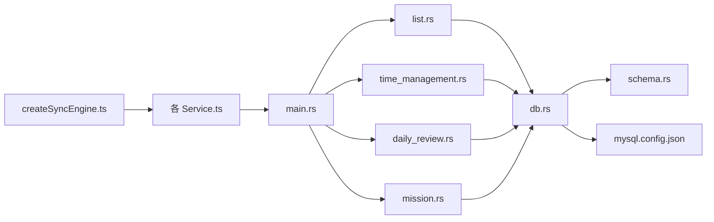

# 通信协议规范

<cite>
**本文引用的文件**   
- [src/lib/createSyncEngine.ts](file://src/lib/createSyncEngine.ts)
- [src/lib/createSyncEngine.test.ts](file://src/lib/createSyncEngine.test.ts)
- [src/features/lists/listsService.ts](file://src/features/lists/listsService.ts)
- [src/features/time-management/timeManagementService.ts](file://src/features/time-management/timeManagementService.ts)
- [src/features/daily-review/dailyReviewService.ts](file://src/features/daily-review/dailyReviewService.ts)
- [src/features/mission/MissionService.ts](file://src/features/mission/MissionService.ts)
- [src-tauri/src/main.rs](file://src-tauri/src/main.rs)
- [src-tauri/src/db.rs](file://src-tauri/src/db.rs)
- [src-tauri/src/list.rs](file://src-tauri/src/list.rs)
- [src-tauri/src/time_management.rs](file://src-tauri/src/time_management.rs)
- [src-tauri/src/daily_review.rs](file://src-tauri/src/daily_review.rs)
- [src-tauri/src/mission.rs](file://src-tauri/src/mission.rs)
- [src-tauri/src/schema.rs](file://src-tauri/src/schema.rs)
- [src-tauri/mysql.config.json](file://src-tauri/mysql.config.json)
- [src-tauri/capabilities/default.json](file://src-tauri/capabilities/default.json)
</cite>

## 目录
1. [简介](#简介)
2. [项目结构](#项目结构)
3. [核心组件](#核心组件)
4. [架构总览](#架构总览)
5. [详细组件分析](#详细组件分析)
6. [依赖关系分析](#依赖关系分析)
7. [性能考虑](#性能考虑)
8. [故障排查指南](#故障排查指南)
9. [结论](#结论)
10. [附录](#附录)

## 简介
本规范面向 FishWorker 应用的前后端通信，聚焦于 Tauri IPC 机制、消息格式与数据序列化方式；定义状态同步引擎的工作原理与实现细节；记录数据库连接配置与查询协议；提供通信错误处理与重试策略；总结性能优化与调试方法；并给出安全认证与权限验证流程建议。文档以源码为依据，确保可追溯性与一致性。

## 项目结构
FishWorker 采用前后端分离的桌面应用架构：前端基于 React + TypeScript，通过 Tauri 调用 Rust 后端能力（数据库、业务逻辑）。关键路径包括：
- 前端服务层：按功能域组织，统一封装对后端的 IPC 调用
- 状态同步引擎：位于 lib 目录，负责本地状态与远端数据的同步
- Rust 后端：Tauri 命令入口、领域模块、数据库访问与模式定义

图表来源
- [src/lib/createSyncEngine.ts](file://src/lib/createSyncEngine.ts)
- [src/features/lists/listsService.ts](file://src/features/lists/listsService.ts)
- [src/features/time-management/timeManagementService.ts](file://src/features/time-management/timeManagementService.ts)
- [src/features/daily-review/dailyReviewService.ts](file://src/features/daily-review/dailyReviewService.ts)
- [src/features/mission/MissionService.ts](file://src/features/mission/MissionService.ts)
- [src-tauri/src/main.rs](file://src-tauri/src/main.rs)
- [src-tauri/src/db.rs](file://src-tauri/src/db.rs)
- [src-tauri/src/list.rs](file://src-tauri/src/list.rs)
- [src-tauri/src/time_management.rs](file://src-tauri/src/time_management.rs)
- [src-tauri/src/daily_review.rs](file://src-tauri/src/daily_review.rs)
- [src-tauri/src/mission.rs](file://src-tauri/src/mission.rs)
- [src-tauri/src/schema.rs](file://src-tauri/src/schema.rs)
- [src-tauri/mysql.config.json](file://src-tauri/mysql.config.json)

章节来源
- [src/lib/createSyncEngine.ts](file://src/lib/createSyncEngine.ts)
- [src-tauri/src/main.rs](file://src-tauri/src/main.rs)

## 核心组件
- 状态同步引擎（createSyncEngine）
  - 职责：维护本地状态与远端数据的一致性，提供增量更新、冲突检测与合并策略，支持批量操作与事件驱动刷新。
  - 关键点：幂等性设计、版本号或时间戳校验、失败回滚与补偿。
- 前端服务层（各 feature 下的 Service）
  - 职责：将 UI 操作转换为 IPC 请求，处理参数序列化与结果反序列化，暴露统一的 Promise API 给上层组件。
  - 关键点：请求去抖/节流、错误分类、重试与退避。
- Tauri 命令入口（main.rs）
  - 职责：注册所有后端命令，解析前端传入的参数，调度到对应领域模块。
  - 关键点：命令命名空间、参数校验、返回值类型约束。
- 领域模块（list.rs、time_management.rs、daily_review.rs、mission.rs）
  - 职责：实现具体业务逻辑，调用数据库层进行读写。
  - 关键点：事务边界、SQL 注入防护、分页与过滤。
- 数据库层（db.rs、schema.rs、mysql.config.json）
  - 职责：连接池管理、迁移执行、通用查询封装、表结构定义。
  - 关键点：连接超时、重试、慢查询日志。

章节来源
- [src/lib/createSyncEngine.ts](file://src/lib/createSyncEngine.ts)
- [src/features/lists/listsService.ts](file://src/features/lists/listsService.ts)
- [src/features/time-management/timeManagementService.ts](file://src/features/time-management/timeManagementService.ts)
- [src/features/daily-review/dailyReviewService.ts](file://src/features/daily-review/dailyReviewService.ts)
- [src/features/mission/MissionService.ts](file://src/features/mission/MissionService.ts)
- [src-tauri/src/main.rs](file://src-tauri/src/main.rs)
- [src-tauri/src/db.rs](file://src-tauri/src/db.rs)
- [src-tauri/src/list.rs](file://src-tauri/src/list.rs)
- [src-tauri/src/time_management.rs](file://src-tauri/src/time_management.rs)
- [src-tauri/src/daily_review.rs](file://src-tauri/src/daily_review.rs)
- [src-tauri/src/mission.rs](file://src-tauri/src/mission.rs)
- [src-tauri/src/schema.rs](file://src-tauri/src/schema.rs)
- [src-tauri/mysql.config.json](file://src-tauri/mysql.config.json)

## 架构总览
下图展示了从前端到后端的完整调用链，以及状态同步引擎在其中的协调作用。

图表来源
- [src/lib/createSyncEngine.ts](file://src/lib/createSyncEngine.ts)
- [src/features/lists/listsService.ts](file://src/features/lists/listsService.ts)
- [src/features/time-management/timeManagementService.ts](file://src/features/time-management/timeManagementService.ts)
- [src/features/daily-review/dailyReviewService.ts](file://src/features/daily-review/dailyReviewService.ts)
- [src/features/mission/MissionService.ts](file://src/features/mission/MissionService.ts)
- [src-tauri/src/main.rs](file://src-tauri/src/main.rs)
- [src-tauri/src/list.rs](file://src-tauri/src/list.rs)
- [src-tauri/src/time_management.rs](file://src-tauri/src/time_management.rs)
- [src-tauri/src/daily_review.rs](file://src-tauri/src/daily_review.rs)
- [src-tauri/src/mission.rs](file://src-tauri/src/mission.rs)
- [src-tauri/src/db.rs](file://src-tauri/src/db.rs)
- [src-tauri/src/schema.rs](file://src-tauri/src/schema.rs)

## 详细组件分析

### 状态同步引擎（createSyncEngine）
- 工作原理
  - 本地优先：用户操作立即落盘，保证交互流畅
  - 远端同步：后台异步提交变更，收到确认后更新本地版本
  - 冲突解决：基于版本号/时间戳比较，采用“最后写入胜出”或“字段级合并”策略
  - 批量合并：聚合多次变更，减少网络往返
- 数据结构
  - 变更队列：包含操作类型、目标实体、新值、旧值、版本信息
  - 合并策略：针对不同类型实体定义差异化合并规则
- 错误处理
  - 网络/IPC 异常：指数退避重试，达到上限后标记为待重放
  - 数据不一致：触发拉取全量并重新合并
- 性能优化
  - 去抖/节流：高频操作合并
  - 增量同步：仅传输差异字段
  - 批处理：批量插入/更新

图表来源
- [src/lib/createSyncEngine.ts](file://src/lib/createSyncEngine.ts)
- [src/lib/createSyncEngine.test.ts](file://src/lib/createSyncEngine.test.ts)

章节来源
- [src/lib/createSyncEngine.ts](file://src/lib/createSyncEngine.ts)
- [src/lib/createSyncEngine.test.ts](file://src/lib/createSyncEngine.test.ts)

### 前端服务层（Lists、Time Management、Daily Review、Mission）
- 统一契约
  - 请求体：包含命令名、参数对象、可选的请求头（如会话标识）
  - 响应体：包含数据、状态码、错误信息、追踪 ID
- 错误分类
  - 网络错误、参数校验错误、业务错误、系统错误
- 重试策略
  - 幂等操作自动重试，非幂等操作需显式确认
- 示例接口（以列表为例）
  - 获取列表：GET /lists?filter=...
  - 创建条目：POST /lists/items {title, order, ...}
  - 更新条目：PUT /lists/items/{id} {fields}
  - 删除条目：DELETE /lists/items/{id}

图表来源
- [src/features/lists/listsService.ts](file://src/features/lists/listsService.ts)
- [src-tauri/src/main.rs](file://src-tauri/src/main.rs)
- [src-tauri/src/list.rs](file://src-tauri/src/list.rs)
- [src-tauri/src/db.rs](file://src-tauri/src/db.rs)

章节来源
- [src/features/lists/listsService.ts](file://src/features/lists/listsService.ts)
- [src/features/time-management/timeManagementService.ts](file://src/features/time-management/timeManagementService.ts)
- [src/features/daily-review/dailyReviewService.ts](file://src/features/daily-review/dailyReviewService.ts)
- [src/features/mission/MissionService.ts](file://src/features/mission/MissionService.ts)
- [src-tauri/src/main.rs](file://src-tauri/src/main.rs)
- [src-tauri/src/list.rs](file://src-tauri/src/list.rs)
- [src-tauri/src/time_management.rs](file://src-tauri/src/time_management.rs)
- [src-tauri/src/daily_review.rs](file://src-tauri/src/daily_review.rs)
- [src-tauri/src/mission.rs](file://src-tauri/src/mission.rs)

### 数据库连接配置与查询协议
- 连接配置
  - 配置文件：mysql.config.json
  - 关键字段：主机、端口、用户名、密码、数据库名、SSL 开关、连接池大小、超时设置
- 连接管理
  - 启动时初始化连接池，失败则延迟重试
  - 健康检查与自动重连
- 查询协议
  - 统一响应格式：{ data, error, trace_id }
  - 分页参数：page、pageSize、orderBy、filters
  - 事务：复杂写操作使用事务包裹，保证原子性

图表来源
- [src-tauri/mysql.config.json](file://src-tauri/mysql.config.json)
- [src-tauri/src/db.rs](file://src-tauri/src/db.rs)
- [src-tauri/src/schema.rs](file://src-tauri/src/schema.rs)

章节来源
- [src-tauri/mysql.config.json](file://src-tauri/mysql.config.json)
- [src-tauri/src/db.rs](file://src-tauri/src/db.rs)
- [src-tauri/src/schema.rs](file://src-tauri/src/schema.rs)

### 安全认证与权限验证流程
- 认证
  - 建议在 IPC 请求头携带会话令牌（JWT），后端校验签名与有效期
- 授权
  - 基于角色的访问控制（RBAC），在命令入口处校验角色与资源权限
- 最小权限原则
  - 每个命令仅开放必要能力，避免越权访问
- 审计
  - 记录关键操作的 trace_id、用户标识、时间戳

图表来源
- [src-tauri/src/main.rs](file://src-tauri/src/main.rs)
- [src-tauri/capabilities/default.json](file://src-tauri/capabilities/default.json)

章节来源
- [src-tauri/src/main.rs](file://src-tauri/src/main.rs)
- [src-tauri/capabilities/default.json](file://src-tauri/capabilities/default.json)

## 依赖关系分析
- 耦合度
  - 前端服务层与 Tauri 命令入口松耦合，通过 IPC 契约解耦
  - 领域模块与数据库层通过 db.rs 抽象，便于替换存储实现
- 外部依赖
  - MySQL 连接器、JSON 序列化库、Tauri 运行时
- 潜在循环依赖
  - 当前分层清晰，未发现直接循环导入

图表来源
- [src/lib/createSyncEngine.ts](file://src/lib/createSyncEngine.ts)
- [src/features/lists/listsService.ts](file://src/features/lists/listsService.ts)
- [src/features/time-management/timeManagementService.ts](file://src/features/time-management/timeManagementService.ts)
- [src/features/daily-review/dailyReviewService.ts](file://src/features/daily-review/dailyReviewService.ts)
- [src/features/mission/MissionService.ts](file://src/features/mission/MissionService.ts)
- [src-tauri/src/main.rs](file://src-tauri/src/main.rs)
- [src-tauri/src/db.rs](file://src-tauri/src/db.rs)
- [src-tauri/src/list.rs](file://src-tauri/src/list.rs)
- [src-tauri/src/time_management.rs](file://src-tauri/src/time_management.rs)
- [src-tauri/src/daily_review.rs](file://src-tauri/src/daily_review.rs)
- [src-tauri/src/mission.rs](file://src-tauri/src/mission.rs)
- [src-tauri/src/schema.rs](file://src-tauri/src/schema.rs)
- [src-tauri/mysql.config.json](file://src-tauri/mysql.config.json)

章节来源
- [src-tauri/src/main.rs](file://src-tauri/src/main.rs)
- [src-tauri/src/db.rs](file://src-tauri/src/db.rs)

## 性能考虑
- 前端
  - 批量提交：合并多次变更，降低 IPC 开销
  - 去抖/节流：避免高频重复请求
  - 增量同步：仅传输差异字段
- 后端
  - 连接池：合理设置池大小与超时
  - 索引优化：为常用查询字段建立索引
  - 分页与过滤：限制返回数据集大小
- 监控
  - 慢查询日志、IPC 耗时统计、错误率告警

[本节为通用指导，不直接分析具体文件]

## 故障排查指南
- 常见问题
  - IPC 调用失败：检查命令注册、参数序列化、权限配置
  - 数据库连接失败：核对 mysql.config.json、网络连通性、账号权限
  - 状态不同步：查看同步引擎日志、版本冲突、重试队列
- 定位步骤
  - 启用详细日志，收集 trace_id
  - 复现问题并抓取前后端请求/响应
  - 检查数据库事务与锁等待
- 恢复策略
  - 自动重试与降级
  - 手动重放待处理队列
  - 回滚至最近一致快照

章节来源
- [src/lib/createSyncEngine.test.ts](file://src/lib/createSyncEngine.test.ts)
- [src-tauri/src/db.rs](file://src-tauri/src/db.rs)

## 结论
本规范明确了 FishWorker 的前后端通信协议、状态同步机制、数据库访问与查询协议、错误处理与重试策略、性能优化与调试方法，以及安全认证与权限验证流程。遵循本规范有助于提升系统的稳定性、可维护性与安全性。

[本节为总结性内容，不直接分析具体文件]

## 附录
- 术语
  - IPC：进程间通信
  - RBAC：基于角色的访问控制
  - JWT：JSON Web Token
- 参考
  - Tauri 官方文档
  - MySQL 连接器文档

[本节为补充说明，不直接分析具体文件]