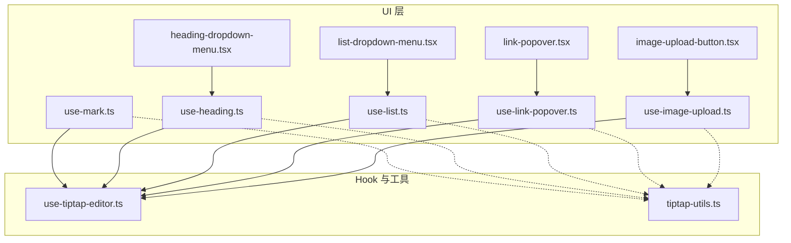
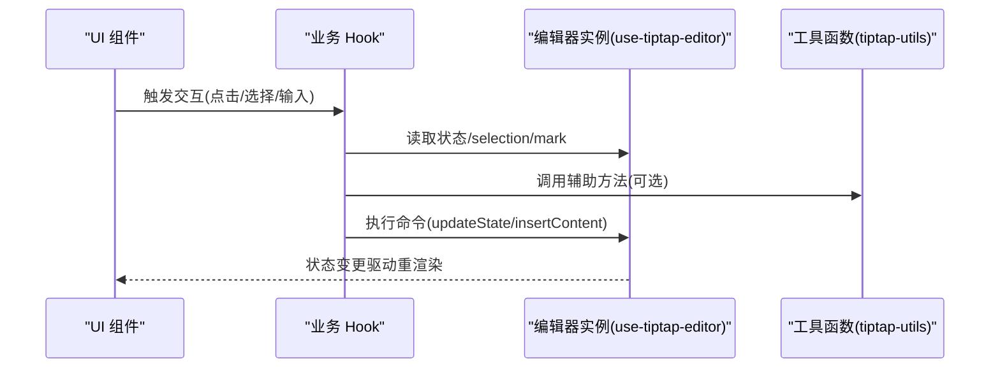
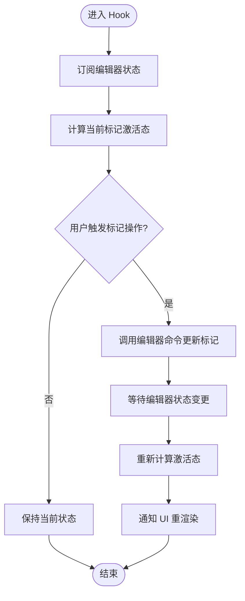
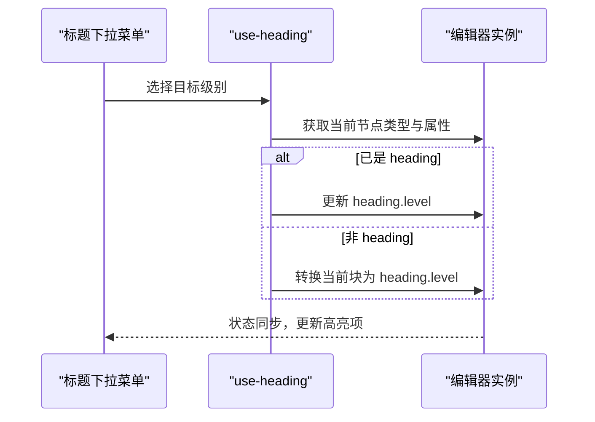
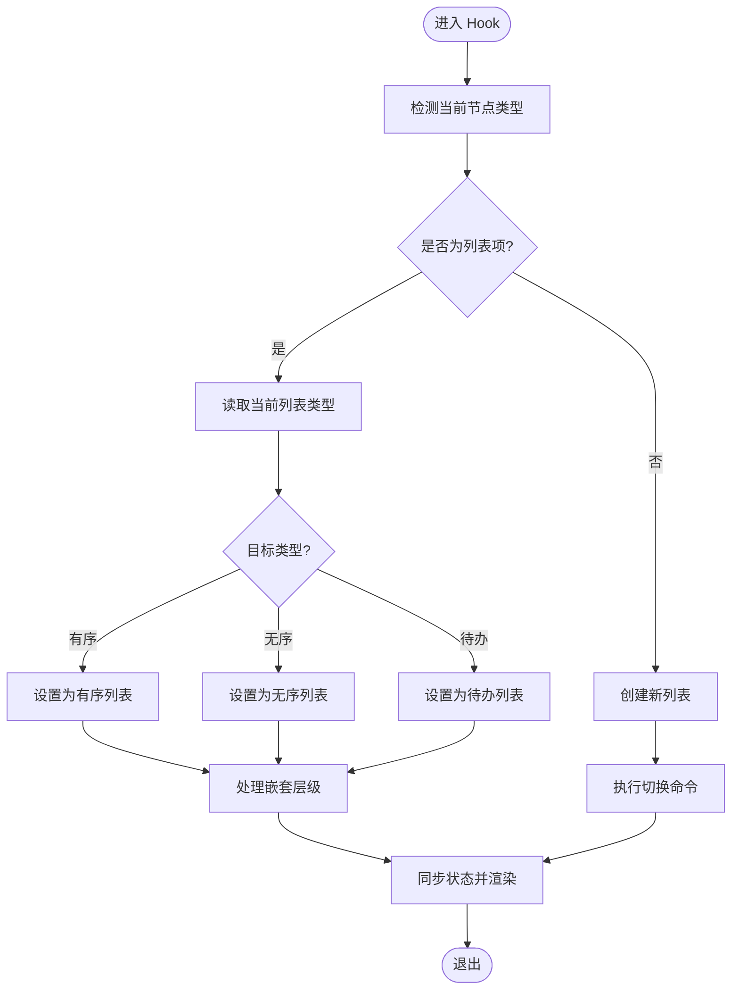
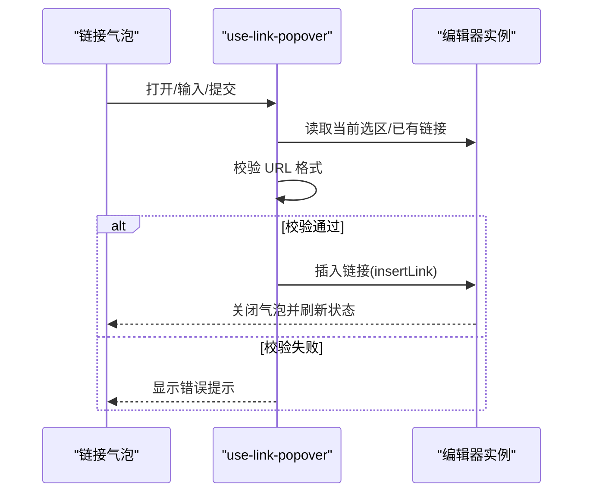
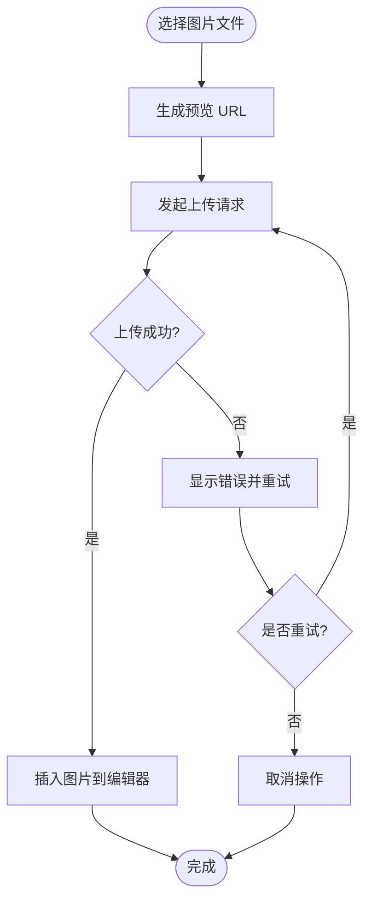
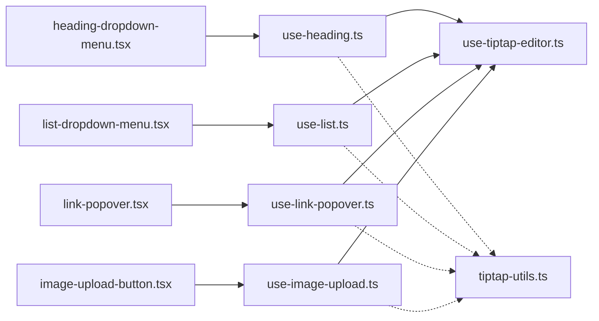

# Hooks 和工具函数

<cite>
**本文引用的文件**   
- [use-mark.ts](file://src/components/tiptap-ui/use-mark.ts)
- [use-heading.ts](file://src/components/tiptap-ui/use-heading.ts)
- [use-list.ts](file://src/components/tiptap-ui/use-list.ts)
- [use-link-popover.ts](file://src/components/tiptap-ui/use-link-popover.ts)
- [use-image-upload.ts](file://src/components/tiptap-ui/use-image-upload.ts)
- [heading-dropdown-menu.tsx](file://src/components/tiptap-ui/heading-dropdown-menu.tsx)
- [list-dropdown-menu.tsx](file://src/components/tiptap-ui/list-dropdown-menu.tsx)
- [link-popover.tsx](file://src/components/tiptap-ui/link-popover.tsx)
- [image-upload-button.tsx](file://src/components/tiptap-ui/image-upload-button.tsx)
- [use-tiptap-editor.ts](file://src/hooks/use-tiptap-editor.ts)
- [tiptap-utils.ts](file://src/lib/tiptap-utils.ts)
</cite>

## 目录
1. [简介](#简介)
2. [项目结构](#项目结构)
3. [核心组件](#核心组件)
4. [架构总览](#架构总览)
5. [详细组件分析](#详细组件分析)
6. [依赖关系分析](#依赖关系分析)
7. [性能考虑](#性能考虑)
8. [故障排查指南](#故障排查指南)
9. [结论](#结论)
10. [附录](#附录)

## 简介
本文件聚焦于 TipTap 编辑器相关的自定义 Hook 与工具函数，系统性梳理其设计模式、实现原理与交互流程。重点覆盖以下 Hook：
- use-mark：文本标记（加粗、斜体等）的状态同步与命令执行
- use-heading：标题级别管理与下拉菜单交互
- use-list：列表类型切换与嵌套处理
- use-link-popover：链接编辑流程与校验逻辑
- use-image-upload：图片上传的文件处理与数据绑定

同时提供 Hook 组合使用建议与性能优化技巧，帮助读者在复杂编辑器场景中高效复用与扩展。

## 项目结构
与本文相关的代码主要分布在以下位置：
- src/components/tiptap-ui：UI 层 Hook 与对应 UI 组件
- src/hooks：通用 Hook（如编辑器实例封装）
- src/lib：工具函数（如 TipTap 辅助方法）

图表来源
- [use-mark.ts:1-200](file://src/components/tiptap-ui/use-mark.ts#L1-L200)
- [use-heading.ts:1-200](file://src/components/tiptap-ui/use-heading.ts#L1-L200)
- [use-list.ts:1-200](file://src/components/tiptap-ui/use-list.ts#L1-L200)
- [use-link-popover.ts:1-200](file://src/components/tiptap-ui/use-link-popover.ts#L1-L200)
- [use-image-upload.ts:1-200](file://src/components/tiptap-ui/use-image-upload.ts#L1-L200)
- [heading-dropdown-menu.tsx:1-200](file://src/components/tiptap-ui/heading-dropdown-menu.tsx#L1-L200)
- [list-dropdown-menu.tsx:1-200](file://src/components/tiptap-ui/list-dropdown-menu.tsx#L1-L200)
- [link-popover.tsx:1-200](file://src/components/tiptap-ui/link-popover.tsx#L1-L200)
- [image-upload-button.tsx:1-200](file://src/components/tiptap-ui/image-upload-button.tsx#L1-L200)
- [use-tiptap-editor.ts:1-200](file://src/hooks/use-tiptap-editor.ts#L1-L200)
- [tiptap-utils.ts:1-200](file://src/lib/tiptap-utils.ts#L1-L200)

章节来源
- [use-mark.ts:1-200](file://src/components/tiptap-ui/use-mark.ts#L1-L200)
- [use-heading.ts:1-200](file://src/components/tiptap-ui/use-heading.ts#L1-L200)
- [use-list.ts:1-200](file://src/components/tiptap-ui/use-list.ts#L1-L200)
- [use-link-popover.ts:1-200](file://src/components/tiptap-ui/use-link-popover.ts#L1-L200)
- [use-image-upload.ts:1-200](file://src/components/tiptap-ui/use-image-upload.ts#L1-L200)
- [use-tiptap-editor.ts:1-200](file://src/hooks/use-tiptap-editor.ts#L1-L200)
- [tiptap-utils.ts:1-200](file://src/lib/tiptap-utils.ts#L1-L200)

## 核心组件
本节对关键 Hook 的职责与对外 API 进行概述，并说明它们如何与编辑器实例协作。

- use-mark
  - 职责：管理文本标记（如加粗、斜体、删除线、下划线、上标、下标、高亮等）的激活状态与切换
  - 典型返回：当前标记是否激活、切换方法集合
  - 关键点：基于编辑器 selection/mark 状态计算；调用编辑器命令更新文档

- use-heading
  - 职责：管理当前块级节点的标题级别（H1-H6），并提供下拉菜单交互
  - 典型返回：当前标题级别、切换方法、菜单项配置
  - 关键点：根据光标所在节点类型与属性判断级别；通过命令设置 heading 级别

- use-list
  - 职责：管理有序/无序/待办列表的类型切换与嵌套
  - 典型返回：当前列表类型、切换方法、嵌套层级信息
  - 关键点：识别 list/listItem/todoListItem 节点；通过命令切换或创建嵌套

- use-link-popover
  - 职责：管理链接气泡弹窗的显示、输入、校验与插入
  - 典型返回：弹窗可见性、URL 值、校验结果、提交方法
  - 关键点：监听 selection/mark 变化；URL 格式校验；调用 insertLink 命令

- use-image-upload
  - 职责：处理图片选择、预览、上传与插入到编辑器
  - 典型返回：文件对象、预览 URL、上传进度、插入方法
  - 关键点：FileReader 生成预览；上传成功后将资源地址写入编辑器

章节来源
- [use-mark.ts:1-200](file://src/components/tiptap-ui/use-mark.ts#L1-L200)
- [use-heading.ts:1-200](file://src/components/tiptap-ui/use-heading.ts#L1-L200)
- [use-list.ts:1-200](file://src/components/tiptap-ui/use-list.ts#L1-L200)
- [use-link-popover.ts:1-200](file://src/components/tiptap-ui/use-link-popover.ts#L1-L200)
- [use-image-upload.ts:1-200](file://src/components/tiptap-ui/use-image-upload.ts#L1-L200)

## 架构总览
下图展示了 UI 组件与 Hook 的协作关系，以及 Hook 如何通过编辑器实例与工具函数完成操作。

图表来源
- [use-tiptap-editor.ts:1-200](file://src/hooks/use-tiptap-editor.ts#L1-L200)
- [tiptap-utils.ts:1-200](file://src/lib/tiptap-utils.ts#L1-L200)
- [use-mark.ts:1-200](file://src/components/tiptap-ui/use-mark.ts#L1-L200)
- [use-heading.ts:1-200](file://src/components/tiptap-ui/use-heading.ts#L1-L200)
- [use-list.ts:1-200](file://src/components/tiptap-ui/use-list.ts#L1-L200)
- [use-link-popover.ts:1-200](file://src/components/tiptap-ui/use-link-popover.ts#L1-L200)
- [use-image-upload.ts:1-200](file://src/components/tiptap-ui/use-image-upload.ts#L1-L200)

## 详细组件分析

### use-mark：标记操作与状态同步
- 设计模式
  - 受控状态 + 命令式更新：Hook 内部维护标记激活态，外部通过回调触发编辑器命令
  - 派生状态：基于 selection/mark 计算当前激活集合
- 关键流程
  - 初始化时订阅编辑器状态变化
  - 用户点击按钮时，调用 toggleMark 或 setMark
  - 编辑器回写文档后，Hook 重新计算激活态并通知 UI
- 复杂度
  - 时间复杂度：O(m)，m 为标记种类数量（通常较小）
  - 空间复杂度：O(m)，存储激活态集合
- 错误处理
  - 无选中内容时的降级策略（如不执行或提示）
  - 非法标记名过滤
- 性能优化
  - 使用 memo 缓存激活态集合
  - 批量更新避免多次重渲染

图表来源
- [use-mark.ts:1-200](file://src/components/tiptap-ui/use-mark.ts#L1-L200)
- [use-tiptap-editor.ts:1-200](file://src/hooks/use-tiptap-editor.ts#L1-L200)

章节来源
- [use-mark.ts:1-200](file://src/components/tiptap-ui/use-mark.ts#L1-L200)
- [use-tiptap-editor.ts:1-200](file://src/hooks/use-tiptap-editor.ts#L1-L200)

### use-heading：标题级别管理与下拉菜单
- 设计模式
  - 状态派生 + 菜单驱动：根据光标所在节点推导当前级别，菜单项用于切换
- 关键流程
  - 检测当前块是否为 heading，解析 level
  - 菜单项点击后，调用 setHeading(level)
  - 若当前非 heading，则转换为对应级别的 heading
- 交互细节
  - 下拉菜单展示 H1-H6 选项
  - 高亮当前级别项
- 边界情况
  - 多行选区：统一应用最高优先级规则（如以首个 heading 为准）
  - 空段落：自动转为 heading

图表来源
- [use-heading.ts:1-200](file://src/components/tiptap-ui/use-heading.ts#L1-L200)
- [heading-dropdown-menu.tsx:1-200](file://src/components/tiptap-ui/heading-dropdown-menu.tsx#L1-L200)
- [use-tiptap-editor.ts:1-200](file://src/hooks/use-tiptap-editor.ts#L1-L200)

章节来源
- [use-heading.ts:1-200](file://src/components/tiptap-ui/use-heading.ts#L1-L200)
- [heading-dropdown-menu.tsx:1-200](file://src/components/tiptap-ui/heading-dropdown-menu.tsx#L1-L200)
- [use-tiptap-editor.ts:1-200](file://src/hooks/use-tiptap-editor.ts#L1-L200)

### use-list：列表类型切换与嵌套处理
- 设计模式
  - 类型枚举 + 嵌套感知：识别 list/listItem/todoListItem，支持有序/无序/待办切换
- 关键流程
  - 检测当前节点是否为列表项
  - 根据目标类型调用相应命令（toggleList/setListType）
  - 处理嵌套：在 listItem 内创建子列表
- 嵌套策略
  - 同级缩进：通过父级 list 包裹新的 listItem
  - 跨级提升/降低：调整 parent 链
- 错误处理
  - 非列表上下文下的降级（创建新列表）
  - 非法类型参数拦截

图表来源
- [use-list.ts:1-200](file://src/components/tiptap-ui/use-list.ts#L1-L200)
- [list-dropdown-menu.tsx:1-200](file://src/components/tiptap-ui/list-dropdown-menu.tsx#L1-L200)
- [use-tiptap-editor.ts:1-200](file://src/hooks/use-tiptap-editor.ts#L1-L200)

章节来源
- [use-list.ts:1-200](file://src/components/tiptap-ui/use-list.ts#L1-L200)
- [list-dropdown-menu.tsx:1-200](file://src/components/tiptap-ui/list-dropdown-menu.tsx#L1-L200)
- [use-tiptap-editor.ts:1-200](file://src/hooks/use-tiptap-editor.ts#L1-L200)

### use-link-popover：链接编辑流程与验证
- 设计模式
  - 表单化气泡：受控输入 + 实时校验 + 提交插入
- 关键流程
  - 监听 selection/mark 变化，打开/关闭气泡
  - 输入 URL 后进行格式校验（协议、域名、路径）
  - 提交时调用 insertLink，并将光标定位到链接文本
- 校验规则
  - 必填检查
  - 合法 URL 正则匹配
  - 安全白名单（可选）
- 用户体验
  - 错误提示与输入反馈
  - 撤销/重做友好

图表来源
- [use-link-popover.ts:1-200](file://src/components/tiptap-ui/use-link-popover.ts#L1-L200)
- [link-popover.tsx:1-200](file://src/components/tiptap-ui/link-popover.tsx#L1-L200)
- [use-tiptap-editor.ts:1-200](file://src/hooks/use-tiptap-editor.ts#L1-L200)

章节来源
- [use-link-popover.ts:1-200](file://src/components/tiptap-ui/use-link-popover.ts#L1-L200)
- [link-popover.tsx:1-200](file://src/components/tiptap-ui/link-popover.tsx#L1-L200)
- [use-tiptap-editor.ts:1-200](file://src/hooks/use-tiptap-editor.ts#L1-L200)

### use-image-upload：文件处理与数据绑定
- 设计模式
  - 文件流处理：选择 -> 预览 -> 上传 -> 插入
- 关键流程
  - 选择文件后使用 FileReader 生成预览 URL
  - 调用上传接口，返回可访问的资源地址
  - 将资源地址作为图片节点插入编辑器
- 数据绑定
  - 本地预览 URL 与远程资源 URL 分离
  - 上传进度与状态同步至 UI
- 错误处理
  - 文件类型/大小限制
  - 上传失败重试与提示

图表来源
- [use-image-upload.ts:1-200](file://src/components/tiptap-ui/use-image-upload.ts#L1-L200)
- [image-upload-button.tsx:1-200](file://src/components/tiptap-ui/image-upload-button.tsx#L1-L200)
- [use-tiptap-editor.ts:1-200](file://src/hooks/use-tiptap-editor.ts#L1-L200)

章节来源
- [use-image-upload.ts:1-200](file://src/components/tiptap-ui/use-image-upload.ts#L1-L200)
- [image-upload-button.tsx:1-200](file://src/components/tiptap-ui/image-upload-button.tsx#L1-L200)
- [use-tiptap-editor.ts:1-200](file://src/hooks/use-tiptap-editor.ts#L1-L200)

## 依赖关系分析
- 耦合度
  - UI 组件仅依赖对应 Hook，不直接操作编辑器，降低耦合
  - Hook 依赖编辑器实例与工具函数，形成清晰分层
- 间接依赖
  - 工具函数 tiptap-utils 被多个 Hook 复用，减少重复逻辑
- 潜在循环
  - 当前结构未发现循环依赖；如需新增 Hook，应避免反向引用 UI 组件

图表来源
- [heading-dropdown-menu.tsx:1-200](file://src/components/tiptap-ui/heading-dropdown-menu.tsx#L1-L200)
- [list-dropdown-menu.tsx:1-200](file://src/components/tiptap-ui/list-dropdown-menu.tsx#L1-L200)
- [link-popover.tsx:1-200](file://src/components/tiptap-ui/link-popover.tsx#L1-L200)
- [image-upload-button.tsx:1-200](file://src/components/tiptap-ui/image-upload-button.tsx#L1-L200)
- [use-heading.ts:1-200](file://src/components/tiptap-ui/use-heading.ts#L1-L200)
- [use-list.ts:1-200](file://src/components/tiptap-ui/use-list.ts#L1-L200)
- [use-link-popover.ts:1-200](file://src/components/tiptap-ui/use-link-popover.ts#L1-L200)
- [use-image-upload.ts:1-200](file://src/components/tiptap-ui/use-image-upload.ts#L1-L200)
- [use-tiptap-editor.ts:1-200](file://src/hooks/use-tiptap-editor.ts#L1-L200)
- [tiptap-utils.ts:1-200](file://src/lib/tiptap-utils.ts#L1-L200)

章节来源
- [use-heading.ts:1-200](file://src/components/tiptap-ui/use-heading.ts#L1-L200)
- [use-list.ts:1-200](file://src/components/tiptap-ui/use-list.ts#L1-L200)
- [use-link-popover.ts:1-200](file://src/components/tiptap-ui/use-link-popover.ts#L1-L200)
- [use-image-upload.ts:1-200](file://src/components/tiptap-ui/use-image-upload.ts#L1-L200)
- [use-tiptap-editor.ts:1-200](file://src/hooks/use-tiptap-editor.ts#L1-L200)
- [tiptap-utils.ts:1-200](file://src/lib/tiptap-utils.ts#L1-L200)

## 性能考虑
- 状态计算优化
  - 使用 memo 缓存派生状态（如标记激活集、当前标题级别）
  - 仅在相关 selection/mark 变化时触发重算
- 命令合并
  - 批量操作时使用事务或批量命令，减少中间状态抖动
- 事件节流/防抖
  - 输入类交互（如链接 URL 校验）采用防抖，避免频繁校验
- 内存管理
  - 及时清理 File Reader 与上传任务，避免泄漏
- 渲染优化
  - 拆分大组件，按需加载气泡/菜单
  - 使用 key 稳定列表项，减少不必要的重排

[本节为通用指导，无需具体文件来源]

## 故障排查指南
- 常见问题
  - 标记未生效：检查 selection 是否存在、命令是否正确调用
  - 标题级别异常：确认当前块类型与属性解析逻辑
  - 列表嵌套错乱：核对父级 list 与子级 listItem 的关系
  - 链接校验失败：检查 URL 正则与安全白名单配置
  - 图片上传失败：查看网络状态、文件大小与类型限制
- 调试建议
  - 打印编辑器状态快照（selection/mark/nodes）
  - 记录命令执行前后差异
  - 使用浏览器开发者工具观察网络请求与错误栈

章节来源
- [use-mark.ts:1-200](file://src/components/tiptap-ui/use-mark.ts#L1-L200)
- [use-heading.ts:1-200](file://src/components/tiptap-ui/use-heading.ts#L1-L200)
- [use-list.ts:1-200](file://src/components/tiptap-ui/use-list.ts#L1-L200)
- [use-link-popover.ts:1-200](file://src/components/tiptap-ui/use-link-popover.ts#L1-L200)
- [use-image-upload.ts:1-200](file://src/components/tiptap-ui/use-image-upload.ts#L1-L200)

## 结论
通过对 use-mark、use-heading、use-list、use-link-popover、use-image-upload 的系统分析，可以看出这些 Hook 遵循“状态派生 + 命令式更新”的设计模式，配合 UI 组件实现了清晰的关注点分离。借助编辑器实例与工具函数的解耦，系统具备良好的可扩展性与可维护性。在实际工程中，应注重状态计算的优化、命令批量化与输入交互的防抖，以提升整体性能与用户体验。

[本节为总结性内容，无需具体文件来源]

## 附录
- 最佳实践
  - 将复杂逻辑下沉至 Hook，UI 只负责展示与触发
  - 对副作用（上传、网络请求）进行隔离与重试
  - 为每个 Hook 编写单元测试，覆盖边界条件
- 扩展建议
  - 新增标记类型时，复用 use-mark 的模式
  - 新增气泡/菜单时，遵循 use-link-popover 的表单化思路
  - 针对复杂列表场景，参考 use-list 的嵌套处理策略

[本节为补充内容，无需具体文件来源]