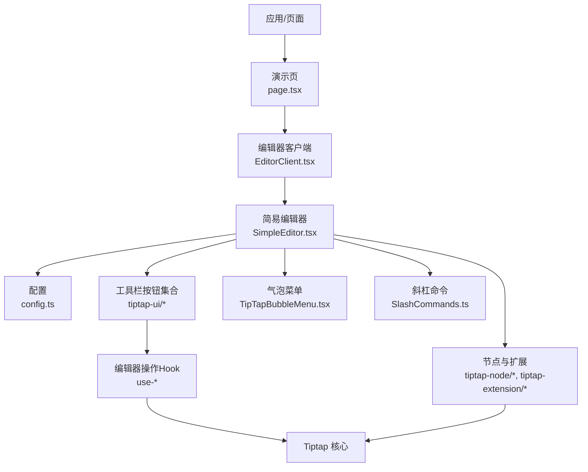
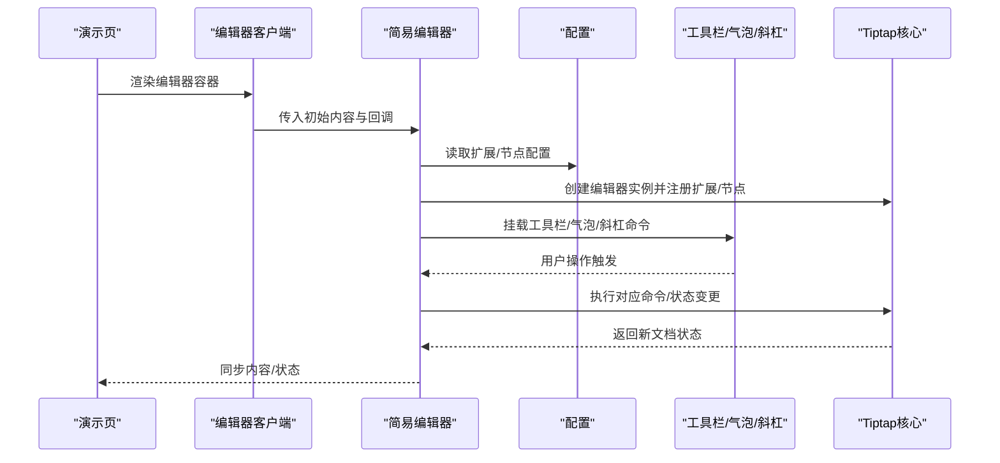
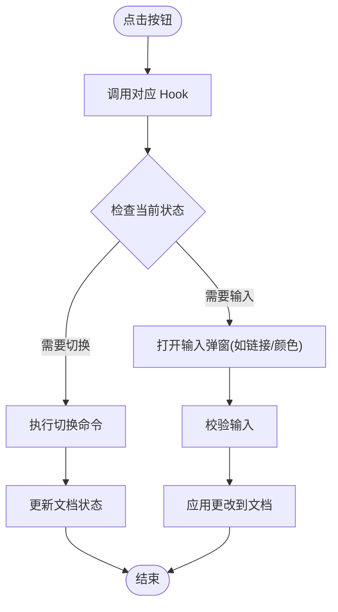
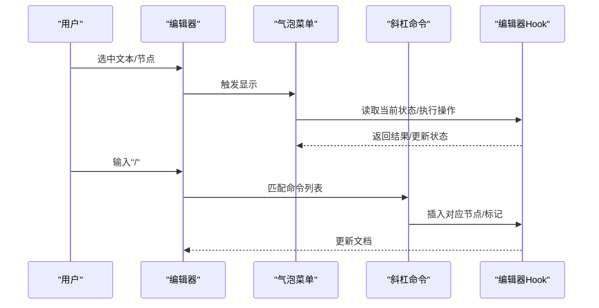
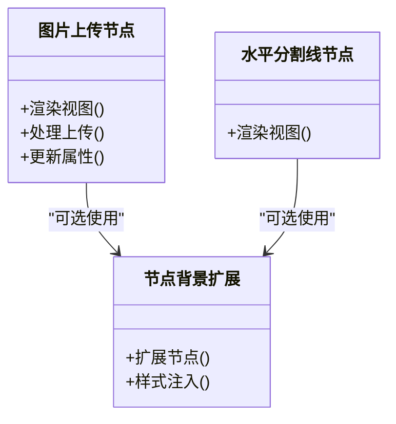
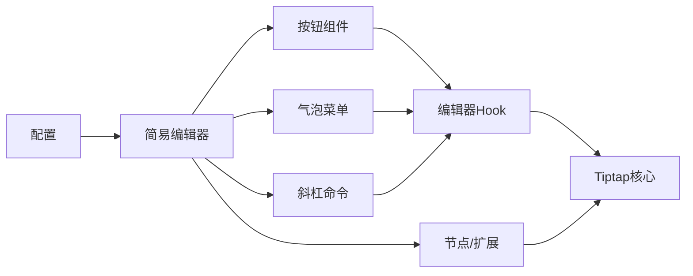

# ReactJS Tiptap编辑器系统

<cite>
**本文引用的文件**   
- [src/components/tiptap-ui/index.tsx](file://src/components/tiptap-ui/index.tsx)
- [src/components/tiptap-node/index.tsx](file://src/components/tiptap-node/index.tsx)
- [src/components/tiptap-icons/heading-icon.tsx](file://src/components/tiptap-icons/heading-icon.tsx)
- [src/components/tiptap-icons/bold-icon.tsx](file://src/components/tiptap-icons/bold-icon.tsx)
- [src/components/tiptap-icons/link-icon.tsx](file://src/components/tiptap-icons/link-icon.tsx)
- [src/components/tiptap-icons/list-icon.tsx](file://src/components/tiptap-icons/list-icon.tsx)
- [src/components/tiptap-icons/code-block-icon.tsx](file://src/components/tiptap-icons/code-block-icon.tsx)
- [src/components/tiptap-icons/blockquote-icon.tsx](file://src/components/tiptap-icons/blockquote-icon.tsx)
- [src/components/tiptap-icons/image-plus-icon.tsx](file://src/components/tiptap-icons/image-plus-icon.tsx)
- [src/components/tiptap-icons/undo2-icon.tsx](file://src/components/tiptap-icons/undo2-icon.tsx)
- [src/components/tiptap-icons/redo2-icon.tsx](file://src/components/tiptap-icons/redo2-icon.tsx)
- [src/components/tiptap-icons/align-left-icon.tsx](file://src/components/tiptap-icons/align-left-icon.tsx)
- [src/components/tiptap-icons/align-center-icon.tsx](file://src/components/tiptap-icons/align-center-icon.tsx)
- [src/components/tiptap-icons/align-right-icon.tsx](file://src/components/tiptap-icons/align-right-icon.tsx)
- [src/components/tiptap-icons/align-justify-icon.tsx](file://src/components/tiptap-icons/align-justify-icon.tsx)
- [src/components/tiptap-icons/strike-icon.tsx](file://src/components/tiptap-icons/strike-icon.tsx)
- [src/components/tiptap-icons/underline-icon.tsx](file://src/components/tiptap-icons/underline-icon.tsx)
- [src/components/tiptap-icons/superscript-icon.tsx](file://src/components/tiptap-icons/superscript-icon.tsx)
- [src/components/tiptap-icons/subscript-icon.tsx](file://src/components/tiptap-icons/subscript-icon.tsx)
- [src/components/tiptap-icons/highlighter-icon.tsx](file://src/components/tiptap-icons/highlighter-icon.tsx)
- [src/components/tiptap-icons/list-ordered-icon.tsx](file://src/components/tiptap-icons/list-ordered-icon.tsx)
- [src/components/tiptap-icons/list-todo-icon.tsx](file://src/components/tiptap-icons/list-todo-icon.tsx)
- [src/components/tiptap-icons/heading-one-icon.tsx](file://src/components/tiptap-icons/heading-one-icon.tsx)
- [src/components/tiptap-icons/heading-two-icon.tsx](file://src/components/tiptap-icons/heading-two-icon.tsx)
- [src/components/tiptap-icons/heading-three-icon.tsx](file://src/components/tiptap-icons/heading-three-icon.tsx)
- [src/components/tiptap-icons/heading-four-icon.tsx](file://src/components/tiptap-icons/heading-four-icon.tsx)
- [src/components/tiptap-icons/heading-five-icon.tsx](file://src/components/tiptap-icons/heading-five-icon.tsx)
- [src/components/tiptap-icons/heading-six-icon.tsx](file://src/components/tiptap-icons/heading-six-icon.tsx)
- [src/components/tiptap-icons/trash-icon.tsx](file://src/components/tiptap-icons/trash-icon.tsx)
- [src/components/tiptap-icons/external-link-icon.tsx](file://src/components/tiptap-icons/external-link-icon.tsx)
- [src/components/tiptap-icons/corner-down-left-icon.tsx](file://src/components/tiptap-icons/corner-down-left-icon.tsx)
- [src/components/tiptap-icons/close-icon.tsx](file://src/components/tiptap-icons/close-icon.tsx)
- [src/components/tiptap-icons/check-icon.tsx](file://src/components/tiptap-icons/check-icon.tsx)
- [src/components/tiptap-icons/arrow-left-icon.tsx](file://src/components/tiptap-icons/arrow-left-icon.tsx)
- [src/components/tiptap-icons/moon-star-icon.tsx](file://src/components/tiptap-icons/moon-star-icon.tsx)
- [src/components/tiptap-icons/sun-icon.tsx](file://src/components/tiptap-icons/sun-icon.tsx)
- [src/components/tiptap-icons/ban-icon.tsx](file://src/components/tiptap-icons/ban-icon.tsx)
- [src/components/tiptap-icons/chevron-down-icon.tsx](file://src/components/tiptap-icons/chevron-down-icon.tsx)
- [src/components/tiptap-icons/code2-icon.tsx](file://src/components/tiptap-icons/code2-icon.tsx)
- [src/components/tiptap-icons/italic-icon.tsx](file://src/components/tiptap-icons/italic-icon.tsx)
- [src/features/tiptap/SimpleEditor.tsx](file://src/features/tiptap/SimpleEditor.tsx)
- [src/features/tiptap/config.ts](file://src/features/tiptap/config.ts)
- [src/features/tiptap/SlashCommands.ts](file://src/features/tiptap/SlashCommands.ts)
- [src/features/tiptap/TipTapBubbleMenu.tsx](file://src/features/tiptap/TipTapBubbleMenu.tsx)
- [src/hooks/use-tiptap-editor.ts](file://src/hooks/use-tiptap-editor.ts)
- [src/lib/tiptap-utils.ts](file://src/lib/tiptap-utils.ts)
- [src/components/tiptap-extension/node-background-extension.ts](file://src/components/tiptap-extension/node-background-extension.ts)
- [src/components/tiptap-node/horizontal-rule-node-extension.ts](file://src/components/tiptap-node/horizontal-rule-node-extension.ts)
- [src/components/tiptap-node/image-upload-node-extension.ts](file://src/components/tiptap-node/image-upload-node-extension.ts)
- [src/components/tiptap-node/image-upload-node.tsx](file://src/components/tiptap-node/image-upload-node.tsx)
- [src/components/tiptap-ui/mark-button.tsx](file://src/components/tiptap-ui/mark-button.tsx)
- [src/components/tiptap-ui/heading-button.tsx](file://src/components/tiptap-ui/heading-button.tsx)
- [src/components/tiptap-ui/heading-dropdown-menu.tsx](file://src/components/tiptap-ui/heading-dropdown-menu.tsx)
- [src/components/tiptap-ui/list-button.tsx](file://src/components/tiptap-ui/list-button.tsx)
- [src/components/tiptap-ui/list-dropdown-menu.tsx](file://src/components/tiptap-ui/list-dropdown-menu.tsx)
- [src/components/tiptap-ui/code-block-button.tsx](file://src/components/tiptap-ui/code-block-button.tsx)
- [src/components/tiptap-ui/blockquote-button.tsx](file://src/components/tiptap-ui/blockquote-button.tsx)
- [src/components/tiptap-ui/text-align-button.tsx](file://src/components/tiptap-ui/text-align-button.tsx)
- [src/components/tiptap-ui/color-highlight-button.tsx](file://src/components/tiptap-ui/color-highlight-button.tsx)
- [src/components/tiptap-ui/color-highlight-popover.tsx](file://src/components/tiptap-ui/color-highlight-popover.tsx)
- [src/components/tiptap-ui/link-popover.tsx](file://src/components/tiptap-ui/link-popover.tsx)
- [src/components/tiptap-ui/image-upload-button.tsx](file://src/components/tiptap-ui/image-upload-button.tsx)
- [src/components/tiptap-ui/undo-redo-button.tsx](file://src/components/tiptap-ui/undo-redo-button.tsx)
- [src/components/tiptap-ui/use-mark.ts](file://src/components/tiptap-ui/use-mark.ts)
- [src/components/tiptap-ui/use-heading.ts](file://src/components/tiptap-ui/use-heading.ts)
- [src/components/tiptap-ui/use-list.ts](file://src/components/tiptap-ui/use-list.ts)
- [src/components/tiptap-ui/use-code-block.ts](file://src/components/tiptap-ui/use-code-block.ts)
- [src/components/tiptap-ui/use-blockquote.ts](file://src/components/tiptap-ui/use-blockquote.ts)
- [src/components/tiptap-ui/use-text-align.ts](file://src/components/tiptap-ui/use-text-align.ts)
- [src/components/tiptap-ui/use-color-highlight.ts](file://src/components/tiptap-ui/use-color-highlight.ts)
- [src/components/tiptap-ui/use-link-popover.ts](file://src/components/tiptap-ui/use-link-popover.ts)
- [src/components/tiptap-ui/use-image-upload.ts](file://src/components/tiptap-ui/use-image-upload.ts)
- [src/components/tiptap-ui/use-undo-redo.ts](file://src/components/tiptap-ui/use-undo-redo.ts)
- [src/components/tiptap-ui-primitive/button.tsx](file://src/components/tiptap-ui-primitive/button.tsx)
- [src/components/tiptap-ui-primitive/button-group.tsx](file://src/components/tiptap-ui-primitive/button-group.tsx)
- [src/components/tiptap-ui-primitive/popover.tsx](file://src/components/tiptap-ui-primitive/popover.tsx)
- [src/components/tiptap-ui-primitive/dropdown-menu.tsx](file://src/components/tiptap-ui-primitive/dropdown-menu.tsx)
- [src/components/tiptap-ui-primitive/input.tsx](file://src/components/tiptap-ui-primitive/input.tsx)
- [src/components/tiptap-ui-primitive/separator.tsx](file://src/components/tiptap-ui-primitive/separator.tsx)
- [src/components/tiptap-ui-primitive/spacer.tsx](file://src/components/tiptap-ui-primitive/spacer.tsx)
- [src/components/tiptap-ui-primitive/toolbar.tsx](file://src/components/tiptap-ui-primitive/toolbar.tsx)
- [src/components/tiptap-ui-primitive/badge.tsx](file://src/components/tiptap-ui-primitive/badge.tsx)
- [src/components/tiptap-ui-primitive/card.tsx](file://src/components/tiptap-ui-primitive/card.tsx)
- [src/components/tiptap-ui-primitive/tooltip.tsx](file://src/components/tiptap-ui-primitive/tooltip.tsx)
- [src/components/tiptap-templates/simple/simple-editor.tsx](file://src/components/tiptap-templates/simple/simple-editor.tsx)
- [src/components/tiptap-templates/simple/theme-toggle.tsx](file://src/components/tiptap-templates/simple/theme-toggle.tsx)
- [reactjs-tiptap-editor-demo/src/app/page.tsx](file://reactjs-tiptap-editor-demo/src/app/page.tsx)
- [reactjs-tiptap-editor-demo/src/components/Editor/EditorClient.tsx](file://reactjs-tiptap-editor-demo/src/components/Editor/EditorClient.tsx)
- [reactjs-tiptap-editor-demo/src/components/Editor/Header.tsx](file://reactjs-tiptap-editor-demo/src/components/Editor/Header.tsx)
- [reactjs-tiptap-editor-demo/package.json](file://reactjs-tiptap-editor-demo/package.json)
</cite>

## 目录
1. [简介](#简介)
2. [项目结构](#项目结构)
3. [核心组件](#核心组件)
4. [架构总览](#架构总览)
5. [详细组件分析](#详细组件分析)
6. [依赖分析](#依赖分析)
7. [性能考虑](#性能考虑)
8. [故障排查指南](#故障排查指南)
9. [结论](#结论)
10. [附录](#附录)

## 简介
本仓库实现了一个基于 Tiptap 的 React 富文本编辑器系统，提供可插拔的扩展、丰富的工具栏按钮、气泡菜单、节点与标记能力，以及模板与演示工程。系统采用“UI 原子组件 + 业务 UI 组合 + 功能 Hook + 编辑器配置”的分层设计，便于在不同场景（如简单编辑器、复杂面板）中复用与定制。

## 项目结构
整体结构围绕以下层次组织：
- 基础 UI 原子组件：按钮、分组、弹出框、下拉菜单、分隔符、间距、工具栏等
- 编辑器 UI 组合：标题、列表、代码块、引用、链接、颜色高亮、图片上传、撤销重做等
- 编辑器节点与扩展：水平分割线、背景扩展、图片上传节点等
- 图标库：为各按钮提供一致的 SVG 图标
- 功能 Hook：封装对 Tiptap 编辑器的操作（标记、段落、列表、对齐、颜色、链接、图片、撤销重做等）
- 特性模块：包含一个“简易编辑器”示例与气泡菜单、斜杠命令等
- 演示工程：独立的 Next.js 应用，展示如何集成与使用编辑器

```mermaid
graph TB
subgraph "基础UI"
PButton["button.tsx"]
PGroup["button-group.tsx"]
Popover["popover.tsx"]
Dropdown["dropdown-menu.tsx"]
Input["input.tsx"]
Separator["separator.tsx"]
Spacer["spacer.tsx"]
Toolbar["toolbar.tsx"]
Badge["badge.tsx"]
Card["card.tsx"]
Tooltip["tooltip.tsx"]
end
subgraph "编辑器UI"
MarkBtn["mark-button.tsx"]
HeadingBtn["heading-button.tsx"]
HeadingDD["heading-dropdown-menu.tsx"]
ListBtn["list-button.tsx"]
ListDD["list-dropdown-menu.tsx"]
CodeBlockBtn["code-block-button.tsx"]
BlockquoteBtn["blockquote-button.tsx"]
TextAlignBtn["text-align-button.tsx"]
ColorBtn["color-highlight-button.tsx"]
ColorPop["color-highlight-popover.tsx"]
LinkPop["link-popover.tsx"]
ImgUploadBtn["image-upload-button.tsx"]
UndoRedoBtn["undo-redo-button.tsx"]
end
subgraph "Hook"
HMark["use-mark.ts"]
HHeading["use-heading.ts"]
HList["use-list.ts"]
HCode["use-code-block.ts"]
HQuote["use-blockquote.ts"]
HAlign["use-text-align.ts"]
HColor["use-color-highlight.ts"]
HLink["use-link-popover.ts"]
HImg["use-image-upload.ts"]
HUndo["use-undo-redo.ts"]
end
subgraph "节点与扩展"
NodeIndex["node/index.tsx"]
HRExt["horizontal-rule-node-extension.ts"]
ImgUpExt["image-upload-node-extension.ts"]
ImgUpNode["image-upload-node.tsx"]
BgExt["node-background-extension.ts"]
end
subgraph "特性"
SimpleEditor["features/tiptap/SimpleEditor.tsx"]
Bubble["features/tiptap/TipTapBubbleMenu.tsx"]
SlashCmd["features/tiptap/SlashCommands.ts"]
Config["features/tiptap/config.ts"]
end
subgraph "图标"
Icons["tiptap-icons/*"]
end
PButton --> MarkBtn
PGroup --> MarkBtn
Popover --> LinkPop
Dropdown --> HeadingDD
Dropdown --> ListDD
Input --> LinkPop
Separator --> Toolbar
Spacer --> Toolbar
Toolbar --> SimpleEditor
MarkBtn --> HMark
HeadingBtn --> HHeading
HeadingDD --> HHeading
ListBtn --> HList
ListDD --> HList
CodeBlockBtn --> HCode
BlockquoteBtn --> HQuote
TextAlignBtn --> HAlign
ColorBtn --> HColor
ColorPop --> HColor
LinkPop --> HLink
ImgUploadBtn --> HImg
UndoRedoBtn --> HUndo
SimpleEditor --> NodeIndex
SimpleEditor --> HRExt
SimpleEditor --> ImgUpExt
SimpleEditor --> ImgUpNode
SimpleEditor --> BgExt
SimpleEditor --> Icons
SimpleEditor --> Config
Bubble --> SimpleEditor
SlashCmd --> SimpleEditor
```

图表来源
- [src/components/tiptap-ui/index.tsx](file://src/components/tiptap-ui/index.tsx)
- [src/components/tiptap-node/index.tsx](file://src/components/tiptap-node/index.tsx)
- [src/features/tiptap/SimpleEditor.tsx](file://src/features/tiptap/SimpleEditor.tsx)
- [src/features/tiptap/config.ts](file://src/features/tiptap/config.ts)
- [src/features/tiptap/TipTapBubbleMenu.tsx](file://src/features/tiptap/TipTapBubbleMenu.tsx)
- [src/features/tiptap/SlashCommands.ts](file://src/features/tiptap/SlashCommands.ts)
- [src/components/tiptap-ui/mark-button.tsx](file://src/components/tiptap-ui/mark-button.tsx)
- [src/components/tiptap-ui/heading-button.tsx](file://src/components/tiptap-ui/heading-button.tsx)
- [src/components/tiptap-ui/heading-dropdown-menu.tsx](file://src/components/tiptap-ui/heading-dropdown-menu.tsx)
- [src/components/tiptap-ui/list-button.tsx](file://src/components/tiptap-ui/list-button.tsx)
- [src/components/tiptap-ui/list-dropdown-menu.tsx](file://src/components/tiptap-ui/list-dropdown-menu.tsx)
- [src/components/tiptap-ui/code-block-button.tsx](file://src/components/tiptap-ui/code-block-button.tsx)
- [src/components/tiptap-ui/blockquote-button.tsx](file://src/components/tiptap-ui/blockquote-button.tsx)
- [src/components/tiptap-ui/text-align-button.tsx](file://src/components/tiptap-ui/text-align-button.tsx)
- [src/components/tiptap-ui/color-highlight-button.tsx](file://src/components/tiptap-ui/color-highlight-button.tsx)
- [src/components/tiptap-ui/color-highlight-popover.tsx](file://src/components/tiptap-ui/color-highlight-popover.tsx)
- [src/components/tiptap-ui/link-popover.tsx](file://src/components/tiptap-ui/link-popover.tsx)
- [src/components/tiptap-ui/image-upload-button.tsx](file://src/components/tiptap-ui/image-upload-button.tsx)
- [src/components/tiptap-ui/undo-redo-button.tsx](file://src/components/tiptap-ui/undo-redo-button.tsx)
- [src/components/tiptap-ui/use-mark.ts](file://src/components/tiptap-ui/use-mark.ts)
- [src/components/tiptap-ui/use-heading.ts](file://src/components/tiptap-ui/use-heading.ts)
- [src/components/tiptap-ui/use-list.ts](file://src/components/tiptap-ui/use-list.ts)
- [src/components/tiptap-ui/use-code-block.ts](file://src/components/tiptap-ui/use-code-block.ts)
- [src/components/tiptap-ui/use-blockquote.ts](file://src/components/tiptap-ui/use-blockquote.ts)
- [src/components/tiptap-ui/use-text-align.ts](file://src/components/tiptap-ui/use-text-align.ts)
- [src/components/tiptap-ui/use-color-highlight.ts](file://src/components/tiptap-ui/use-color-highlight.ts)
- [src/components/tiptap-ui/use-link-popover.ts](file://src/components/tiptap-ui/use-link-popover.ts)
- [src/components/tiptap-ui/use-image-upload.ts](file://src/components/tiptap-ui/use-image-upload.ts)
- [src/components/tiptap-ui/use-undo-redo.ts](file://src/components/tiptap-ui/use-undo-redo.ts)
- [src/components/tiptap-extension/node-background-extension.ts](file://src/components/tiptap-extension/node-background-extension.ts)
- [src/components/tiptap-node/horizontal-rule-node-extension.ts](file://src/components/tiptap-node/horizontal-rule-node-extension.ts)
- [src/components/tiptap-node/image-upload-node-extension.ts](file://src/components/tiptap-node/image-upload-node-extension.ts)
- [src/components/tiptap-node/image-upload-node.tsx](file://src/components/tiptap-node/image-upload-node.tsx)

章节来源
- [src/components/tiptap-ui/index.tsx](file://src/components/tiptap-ui/index.tsx)
- [src/components/tiptap-node/index.tsx](file://src/components/tiptap-node/index.tsx)
- [src/features/tiptap/SimpleEditor.tsx](file://src/features/tiptap/SimpleEditor.tsx)
- [src/features/tiptap/config.ts](file://src/features/tiptap/config.ts)

## 核心组件
- 编辑器入口与装配
  - 简易编辑器：负责组装扩展、节点、工具栏、气泡菜单与斜杠命令，暴露最小可用 API
  - 配置中心：集中管理扩展与节点的启用开关、默认选项
- 工具栏与交互
  - 标记类按钮：加粗、斜体、删除线、下划线、上标、下标、行内代码等
  - 段落类按钮：标题、有序/无序/任务列表、引用、代码块、水平分割线
  - 样式类按钮：文本对齐、颜色高亮
  - 数据类按钮：插入链接、上传图片
  - 历史类按钮：撤销、重做
- 气泡菜单
  - 在选中文本或节点时显示快捷操作（如链接、样式切换）
- 节点与扩展
  - 自定义节点：图片上传节点、水平分割线节点
  - 通用扩展：节点背景扩展
- 图标体系
  - 统一的 SVG 图标集，覆盖所有工具栏与气泡菜单所需图标

章节来源
- [src/features/tiptap/SimpleEditor.tsx](file://src/features/tiptap/SimpleEditor.tsx)
- [src/features/tiptap/config.ts](file://src/features/tiptap/config.ts)
- [src/components/tiptap-ui/index.tsx](file://src/components/tiptap-ui/index.tsx)
- [src/components/tiptap-node/index.tsx](file://src/components/tiptap-node/index.tsx)
- [src/features/tiptap/TipTapBubbleMenu.tsx](file://src/features/tiptap/TipTapBubbleMenu.tsx)
- [src/features/tiptap/SlashCommands.ts](file://src/features/tiptap/SlashCommands.ts)

## 架构总览
系统采用分层解耦：
- 表现层：基础 UI 原子组件与编辑器 UI 组合
- 逻辑层：以 Hook 形式封装对 Tiptap 的操作，避免在组件中直接耦合编辑器实例
- 领域层：节点与扩展定义具体行为与渲染
- 集成层：简易编辑器将上述模块装配起来，对外暴露统一接口
- 外部依赖：Tiptap 核心与官方扩展、React 生态

图表来源
- [reactjs-tiptap-editor-demo/src/app/page.tsx](file://reactjs-tiptap-editor-demo/src/app/page.tsx)
- [reactjs-tiptap-editor-demo/src/components/Editor/EditorClient.tsx](file://reactjs-tiptap-editor-demo/src/components/Editor/EditorClient.tsx)
- [src/features/tiptap/SimpleEditor.tsx](file://src/features/tiptap/SimpleEditor.tsx)
- [src/features/tiptap/config.ts](file://src/features/tiptap/config.ts)
- [src/features/tiptap/TipTapBubbleMenu.tsx](file://src/features/tiptap/TipTapBubbleMenu.tsx)
- [src/features/tiptap/SlashCommands.ts](file://src/features/tiptap/SlashCommands.ts)
- [src/components/tiptap-ui/index.tsx](file://src/components/tiptap-ui/index.tsx)
- [src/components/tiptap-node/index.tsx](file://src/components/tiptap-node/index.tsx)
- [src/components/tiptap-extension/node-background-extension.ts](file://src/components/tiptap-extension/node-background-extension.ts)

## 详细组件分析

### 编辑器装配与配置
- 职责
  - 初始化编辑器实例，注册扩展与节点
  - 注入工具栏、气泡菜单、斜杠命令
  - 暴露内容获取、更新、状态监听等能力
- 关键点
  - 通过配置对象控制功能开关与默认值
  - 将节点与扩展按模块聚合，便于按需启用
  - 与气泡菜单和斜杠命令进行事件绑定

图表来源
- [reactjs-tiptap-editor-demo/src/app/page.tsx](file://reactjs-tiptap-editor-demo/src/app/page.tsx)
- [reactjs-tiptap-editor-demo/src/components/Editor/EditorClient.tsx](file://reactjs-tiptap-editor-demo/src/components/Editor/EditorClient.tsx)
- [src/features/tiptap/SimpleEditor.tsx](file://src/features/tiptap/SimpleEditor.tsx)
- [src/features/tiptap/config.ts](file://src/features/tiptap/config.ts)
- [src/features/tiptap/TipTapBubbleMenu.tsx](file://src/features/tiptap/TipTapBubbleMenu.tsx)
- [src/features/tiptap/SlashCommands.ts](file://src/features/tiptap/SlashCommands.ts)

章节来源
- [src/features/tiptap/SimpleEditor.tsx](file://src/features/tiptap/SimpleEditor.tsx)
- [src/features/tiptap/config.ts](file://src/features/tiptap/config.ts)

### 工具栏按钮与 Hook 协作
- 设计模式
  - 每个按钮仅负责 UI 与事件派发，具体编辑器操作由 Hook 完成
  - Hook 内部持有编辑器实例引用，保证跨组件一致的状态访问
- 典型流程
  - 点击按钮 -> 调用对应 Hook -> 执行 Tiptap 命令 -> 更新文档状态 -> 触发 UI 刷新

图表来源
- [src/components/tiptap-ui/mark-button.tsx](file://src/components/tiptap-ui/mark-button.tsx)
- [src/components/tiptap-ui/heading-button.tsx](file://src/components/tiptap-ui/heading-button.tsx)
- [src/components/tiptap-ui/heading-dropdown-menu.tsx](file://src/components/tiptap-ui/heading-dropdown-menu.tsx)
- [src/components/tiptap-ui/list-button.tsx](file://src/components/tiptap-ui/list-button.tsx)
- [src/components/tiptap-ui/list-dropdown-menu.tsx](file://src/components/tiptap-ui/list-dropdown-menu.tsx)
- [src/components/tiptap-ui/code-block-button.tsx](file://src/components/tiptap-ui/code-block-button.tsx)
- [src/components/tiptap-ui/blockquote-button.tsx](file://src/components/tiptap-ui/blockquote-button.tsx)
- [src/components/tiptap-ui/text-align-button.tsx](file://src/components/tiptap-ui/text-align-button.tsx)
- [src/components/tiptap-ui/color-highlight-button.tsx](file://src/components/tiptap-ui/color-highlight-button.tsx)
- [src/components/tiptap-ui/color-highlight-popover.tsx](file://src/components/tiptap-ui/color-highlight-popover.tsx)
- [src/components/tiptap-ui/link-popover.tsx](file://src/components/tiptap-ui/link-popover.tsx)
- [src/components/tiptap-ui/image-upload-button.tsx](file://src/components/tiptap-ui/image-upload-button.tsx)
- [src/components/tiptap-ui/undo-redo-button.tsx](file://src/components/tiptap-ui/undo-redo-button.tsx)
- [src/components/tiptap-ui/use-mark.ts](file://src/components/tiptap-ui/use-mark.ts)
- [src/components/tiptap-ui/use-heading.ts](file://src/components/tiptap-ui/use-heading.ts)
- [src/components/tiptap-ui/use-list.ts](file://src/components/tiptap-ui/use-list.ts)
- [src/components/tiptap-ui/use-code-block.ts](file://src/components/tiptap-ui/use-code-block.ts)
- [src/components/tiptap-ui/use-blockquote.ts](file://src/components/tiptap-ui/use-blockquote.ts)
- [src/components/tiptap-ui/use-text-align.ts](file://src/components/tiptap-ui/use-text-align.ts)
- [src/components/tiptap-ui/use-color-highlight.ts](file://src/components/tiptap-ui/use-color-highlight.ts)
- [src/components/tiptap-ui/use-link-popover.ts](file://src/components/tiptap-ui/use-link-popover.ts)
- [src/components/tiptap-ui/use-image-upload.ts](file://src/components/tiptap-ui/use-image-upload.ts)
- [src/components/tiptap-ui/use-undo-redo.ts](file://src/components/tiptap-ui/use-undo-redo.ts)

章节来源
- [src/components/tiptap-ui/index.tsx](file://src/components/tiptap-ui/index.tsx)
- [src/components/tiptap-ui/use-mark.ts](file://src/components/tiptap-ui/use-mark.ts)
- [src/components/tiptap-ui/use-heading.ts](file://src/components/tiptap-ui/use-heading.ts)
- [src/components/tiptap-ui/use-list.ts](file://src/components/tiptap-ui/use-list.ts)
- [src/components/tiptap-ui/use-code-block.ts](file://src/components/tiptap-ui/use-code-block.ts)
- [src/components/tiptap-ui/use-blockquote.ts](file://src/components/tiptap-ui/use-blockquote.ts)
- [src/components/tiptap-ui/use-text-align.ts](file://src/components/tiptap-ui/use-text-align.ts)
- [src/components/tiptap-ui/use-color-highlight.ts](file://src/components/tiptap-ui/use-color-highlight.ts)
- [src/components/tiptap-ui/use-link-popover.ts](file://src/components/tiptap-ui/use-link-popover.ts)
- [src/components/tiptap-ui/use-image-upload.ts](file://src/components/tiptap-ui/use-image-upload.ts)
- [src/components/tiptap-ui/use-undo-redo.ts](file://src/components/tiptap-ui/use-undo-redo.ts)

### 气泡菜单与斜杠命令
- 气泡菜单
  - 在选中内容时显示上下文相关操作（如链接、样式）
  - 与工具栏 Hook 共享状态，确保一致性
- 斜杠命令
  - 输入“/”后弹出快速插入菜单（段落、列表、代码块等）
  - 与编辑器内容模型紧密配合，支持键盘导航与确认插入

图表来源
- [src/features/tiptap/TipTapBubbleMenu.tsx](file://src/features/tiptap/TipTapBubbleMenu.tsx)
- [src/features/tiptap/SlashCommands.ts](file://src/features/tiptap/SlashCommands.ts)
- [src/components/tiptap-ui/use-link-popover.ts](file://src/components/tiptap-ui/use-link-popover.ts)
- [src/components/tiptap-ui/use-mark.ts](file://src/components/tiptap-ui/use-mark.ts)
- [src/components/tiptap-ui/use-heading.ts](file://src/components/tiptap-ui/use-heading.ts)
- [src/components/tiptap-ui/use-list.ts](file://src/components/tiptap-ui/use-list.ts)
- [src/components/tiptap-ui/use-code-block.ts](file://src/components/tiptap-ui/use-code-block.ts)
- [src/components/tiptap-ui/use-blockquote.ts](file://src/components/tiptap-ui/use-blockquote.ts)

章节来源
- [src/features/tiptap/TipTapBubbleMenu.tsx](file://src/features/tiptap/TipTapBubbleMenu.tsx)
- [src/features/tiptap/SlashCommands.ts](file://src/features/tiptap/SlashCommands.ts)

### 节点与扩展
- 节点
  - 图片上传节点：提供拖拽/选择上传、预览与占位处理
  - 水平分割线节点：作为独立段落节点存在
- 扩展
  - 节点背景扩展：为任意节点添加背景色能力
- 关系
  - 节点与扩展均向 Tiptap 核心注册，参与文档树构建与渲染

图表来源
- [src/components/tiptap-node/image-upload-node.tsx](file://src/components/tiptap-node/image-upload-node.tsx)
- [src/components/tiptap-node/image-upload-node-extension.ts](file://src/components/tiptap-node/image-upload-node-extension.ts)
- [src/components/tiptap-node/horizontal-rule-node-extension.ts](file://src/components/tiptap-node/horizontal-rule-node-extension.ts)
- [src/components/tiptap-extension/node-background-extension.ts](file://src/components/tiptap-extension/node-background-extension.ts)

章节来源
- [src/components/tiptap-node/index.tsx](file://src/components/tiptap-node/index.tsx)
- [src/components/tiptap-node/image-upload-node.tsx](file://src/components/tiptap-node/image-upload-node.tsx)
- [src/components/tiptap-node/image-upload-node-extension.ts](file://src/components/tiptap-node/image-upload-node-extension.ts)
- [src/components/tiptap-node/horizontal-rule-node-extension.ts](file://src/components/tiptap-node/horizontal-rule-node-extension.ts)
- [src/components/tiptap-extension/node-background-extension.ts](file://src/components/tiptap-extension/node-background-extension.ts)

### 图标体系
- 职责
  - 为工具栏与气泡菜单提供一致的视觉标识
- 特点
  - 按功能分类导出，便于按需引入
  - 与按钮组件一一对应，保持语义化命名

章节来源
- [src/components/tiptap-icons/heading-icon.tsx](file://src/components/tiptap-icons/heading-icon.tsx)
- [src/components/tiptap-icons/bold-icon.tsx](file://src/components/tiptap-icons/bold-icon.tsx)
- [src/components/tiptap-icons/link-icon.tsx](file://src/components/tiptap-icons/link-icon.tsx)
- [src/components/tiptap-icons/list-icon.tsx](file://src/components/tiptap-icons/list-icon.tsx)
- [src/components/tiptap-icons/code-block-icon.tsx](file://src/components/tiptap-icons/code-block-icon.tsx)
- [src/components/tiptap-icons/blockquote-icon.tsx](file://src/components/tiptap-icons/blockquote-icon.tsx)
- [src/components/tiptap-icons/image-plus-icon.tsx](file://src/components/tiptap-icons/image-plus-icon.tsx)
- [src/components/tiptap-icons/undo2-icon.tsx](file://src/components/tiptap-icons/undo2-icon.tsx)
- [src/components/tiptap-icons/redo2-icon.tsx](file://src/components/tiptap-icons/redo2-icon.tsx)
- [src/components/tiptap-icons/align-left-icon.tsx](file://src/components/tiptap-icons/align-left-icon.tsx)
- [src/components/tiptap-icons/align-center-icon.tsx](file://src/components/tiptap-icons/align-center-icon.tsx)
- [src/components/tiptap-icons/align-right-icon.tsx](file://src/components/tiptap-icons/align-right-icon.tsx)
- [src/components/tiptap-icons/align-justify-icon.tsx](file://src/components/tiptap-icons/align-justify-icon.tsx)
- [src/components/tiptap-icons/strike-icon.tsx](file://src/components/tiptap-icons/strike-icon.tsx)
- [src/components/tiptap-icons/underline-icon.tsx](file://src/components/tiptap-icons/underline-icon.tsx)
- [src/components/tiptap-icons/superscript-icon.tsx](file://src/components/tiptap-icons/superscript-icon.tsx)
- [src/components/tiptap-icons/subscript-icon.tsx](file://src/components/tiptap-icons/subscript-icon.tsx)
- [src/components/tiptap-icons/highlighter-icon.tsx](file://src/components/tiptap-icons/highlighter-icon.tsx)
- [src/components/tiptap-icons/list-ordered-icon.tsx](file://src/components/tiptap-icons/list-ordered-icon.tsx)
- [src/components/tiptap-icons/list-todo-icon.tsx](file://src/components/tiptap-icons/list-todo-icon.tsx)
- [src/components/tiptap-icons/heading-one-icon.tsx](file://src/components/tiptap-icons/heading-one-icon.tsx)
- [src/components/tiptap-icons/heading-two-icon.tsx](file://src/components/tiptap-icons/heading-two-icon.tsx)
- [src/components/tiptap-icons/heading-three-icon.tsx](file://src/components/tiptap-icons/heading-three-icon.tsx)
- [src/components/tiptap-icons/heading-four-icon.tsx](file://src/components/tiptap-icons/heading-four-icon.tsx)
- [src/components/tiptap-icons/heading-five-icon.tsx](file://src/components/tiptap-icons/heading-five-icon.tsx)
- [src/components/tiptap-icons/heading-six-icon.tsx](file://src/components/tiptap-icons/heading-six-icon.tsx)
- [src/components/tiptap-icons/trash-icon.tsx](file://src/components/tiptap-icons/trash-icon.tsx)
- [src/components/tiptap-icons/external-link-icon.tsx](file://src/components/tiptap-icons/external-link-icon.tsx)
- [src/components/tiptap-icons/corner-down-left-icon.tsx](file://src/components/tiptap-icons/corner-down-left-icon.tsx)
- [src/components/tiptap-icons/close-icon.tsx](file://src/components/tiptap-icons/close-icon.tsx)
- [src/components/tiptap-icons/check-icon.tsx](file://src/components/tiptap-icons/check-icon.tsx)
- [src/components/tiptap-icons/arrow-left-icon.tsx](file://src/components/tiptap-icons/arrow-left-icon.tsx)
- [src/components/tiptap-icons/moon-star-icon.tsx](file://src/components/tiptap-icons/moon-star-icon.tsx)
- [src/components/tiptap-icons/sun-icon.tsx](file://src/components/tiptap-icons/sun-icon.tsx)
- [src/components/tiptap-icons/ban-icon.tsx](file://src/components/tiptap-icons/ban-icon.tsx)
- [src/components/tiptap-icons/chevron-down-icon.tsx](file://src/components/tiptap-icons/chevron-down-icon.tsx)
- [src/components/tiptap-icons/code2-icon.tsx](file://src/components/tiptap-icons/code2-icon.tsx)
- [src/components/tiptap-icons/italic-icon.tsx](file://src/components/tiptap-icons/italic-icon.tsx)

### 基础 UI 原子组件
- 职责
  - 提供无业务依赖的可复用 UI 元素
- 关键组件
  - 按钮、按钮组、弹出框、下拉菜单、输入框、分隔符、间距、工具栏、徽章、卡片、提示框
- 作用
  - 支撑上层编辑器 UI 的组合与布局

章节来源
- [src/components/tiptap-ui-primitive/button.tsx](file://src/components/tiptap-ui-primitive/button.tsx)
- [src/components/tiptap-ui-primitive/button-group.tsx](file://src/components/tiptap-ui-primitive/button-group.tsx)
- [src/components/tiptap-ui-primitive/popover.tsx](file://src/components/tiptap-ui-primitive/popover.tsx)
- [src/components/tiptap-ui-primitive/dropdown-menu.tsx](file://src/components/tiptap-ui-primitive/dropdown-menu.tsx)
- [src/components/tiptap-ui-primitive/input.tsx](file://src/components/tiptap-ui-primitive/input.tsx)
- [src/components/tiptap-ui-primitive/separator.tsx](file://src/components/tiptap-ui-primitive/separator.tsx)
- [src/components/tiptap-ui-primitive/spacer.tsx](file://src/components/tiptap-ui-primitive/spacer.tsx)
- [src/components/tiptap-ui-primitive/toolbar.tsx](file://src/components/tiptap-ui-primitive/toolbar.tsx)
- [src/components/tiptap-ui-primitive/badge.tsx](file://src/components/tiptap-ui-primitive/badge.tsx)
- [src/components/tiptap-ui-primitive/card.tsx](file://src/components/tiptap-ui-primitive/card.tsx)
- [src/components/tiptap-ui-primitive/tooltip.tsx](file://src/components/tiptap-ui-primitive/tooltip.tsx)

### 模板与演示
- 模板
  - 简单编辑器模板：提供开箱即用的轻量编辑器界面与主题切换
- 演示工程
  - 基于 Next.js 的演示应用，展示如何在实际项目中集成编辑器
  - 通过客户端组件加载编辑器，避免服务端渲染问题

章节来源
- [src/components/tiptap-templates/simple/simple-editor.tsx](file://src/components/tiptap-templates/simple/simple-editor.tsx)
- [src/components/tiptap-templates/simple/theme-toggle.tsx](file://src/components/tiptap-templates/simple/theme-toggle.tsx)
- [reactjs-tiptap-editor-demo/src/app/page.tsx](file://reactjs-tiptap-editor-demo/src/app/page.tsx)
- [reactjs-tiptap-editor-demo/src/components/Editor/EditorClient.tsx](file://reactjs-tiptap-editor-demo/src/components/Editor/EditorClient.tsx)
- [reactjs-tiptap-editor-demo/src/components/Editor/Header.tsx](file://reactjs-tiptap-editor-demo/src/components/Editor/Header.tsx)
- [reactjs-tiptap-editor-demo/package.json](file://reactjs-tiptap-editor-demo/package.json)

## 依赖分析
- 内部依赖
  - 编辑器装配依赖配置与节点/扩展注册
  - 工具栏按钮依赖对应的 Hook
  - 气泡菜单与斜杠命令依赖编辑器状态与 Hook
- 外部依赖
  - Tiptap 核心与官方扩展
  - React 生态（状态、事件、渲染）
- 耦合与内聚
  - 按钮与 Hook 低耦合，易于替换与测试
  - 节点与扩展相对独立，可按需启用
- 潜在循环依赖
  - 通过 Hook 抽象编辑器实例，避免组件间直接互相引用

图表来源
- [src/features/tiptap/SimpleEditor.tsx](file://src/features/tiptap/SimpleEditor.tsx)
- [src/features/tiptap/config.ts](file://src/features/tiptap/config.ts)
- [src/features/tiptap/TipTapBubbleMenu.tsx](file://src/features/tiptap/TipTapBubbleMenu.tsx)
- [src/features/tiptap/SlashCommands.ts](file://src/features/tiptap/SlashCommands.ts)
- [src/components/tiptap-ui/index.tsx](file://src/components/tiptap-ui/index.tsx)
- [src/components/tiptap-node/index.tsx](file://src/components/tiptap-node/index.tsx)

章节来源
- [src/features/tiptap/SimpleEditor.tsx](file://src/features/tiptap/SimpleEditor.tsx)
- [src/features/tiptap/config.ts](file://src/features/tiptap/config.ts)
- [src/components/tiptap-ui/index.tsx](file://src/components/tiptap-ui/index.tsx)
- [src/components/tiptap-node/index.tsx](file://src/components/tiptap-node/index.tsx)

## 性能考虑
- 懒加载与按需引入
  - 工具栏按钮与图标按需导入，减少首屏体积
- 状态更新优化
  - 使用 Hook 集中管理编辑器状态，避免不必要的重渲染
- 大文档处理
  - 对于长文档，建议分页渲染或虚拟滚动（结合上层业务）
- 资源加载
  - 图片上传节点应避免阻塞主线程，采用分片与压缩策略

[本节为通用指导，不直接分析具体文件]

## 故障排查指南
- 常见问题
  - 工具栏按钮无效：检查对应 Hook 是否正确注入编辑器实例
  - 气泡菜单不显示：确认选区类型是否受支持，检查事件绑定
  - 斜杠命令不触发：检查输入字符与命令匹配规则
  - 图片上传失败：检查上传节点的事件处理与错误分支
- 定位方法
  - 在 Hook 与按钮处增加日志输出，观察命令执行路径
  - 使用浏览器开发者工具查看 DOM 与事件流
  - 对比配置项，确认相应扩展/节点已启用

章节来源
- [src/components/tiptap-ui/use-mark.ts](file://src/components/tiptap-ui/use-mark.ts)
- [src/components/tiptap-ui/use-heading.ts](file://src/components/tiptap-ui/use-heading.ts)
- [src/components/tiptap-ui/use-list.ts](file://src/components/tiptap-ui/use-list.ts)
- [src/components/tiptap-ui/use-code-block.ts](file://src/components/tiptap-ui/use-code-block.ts)
- [src/components/tiptap-ui/use-blockquote.ts](file://src/components/tiptap-ui/use-blockquote.ts)
- [src/components/tiptap-ui/use-text-align.ts](file://src/components/tiptap-ui/use-text-align.ts)
- [src/components/tiptap-ui/use-color-highlight.ts](file://src/components/tiptap-ui/use-color-highlight.ts)
- [src/components/tiptap-ui/use-link-popover.ts](file://src/components/tiptap-ui/use-link-popover.ts)
- [src/components/tiptap-ui/use-image-upload.ts](file://src/components/tiptap-ui/use-image-upload.ts)
- [src/components/tiptap-ui/use-undo-redo.ts](file://src/components/tiptap-ui/use-undo-redo.ts)
- [src/components/tiptap-node/image-upload-node.tsx](file://src/components/tiptap-node/image-upload-node.tsx)
- [src/components/tiptap-node/image-upload-node-extension.ts](file://src/components/tiptap-node/image-upload-node-extension.ts)

## 结论
该编辑器系统通过清晰的分层与模块化设计，实现了高度可定制的富文本编辑体验。工具栏、气泡菜单、斜杠命令与节点/扩展相互解耦，便于在不同业务场景中灵活组合。建议在后续迭代中继续完善错误边界、无障碍支持与国际化能力，以提升用户体验与可维护性。

[本节为总结，不直接分析具体文件]

## 附录
- 使用建议
  - 在大型应用中，优先使用简易编辑器模板，按需启用扩展与节点
  - 自定义样式时，尽量通过 CSS 变量或主题机制统一管理
  - 图片上传建议接入后端服务，并提供进度与错误反馈

[本节为补充说明，不直接分析具体文件]