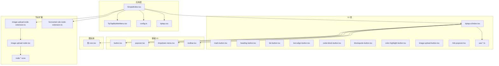
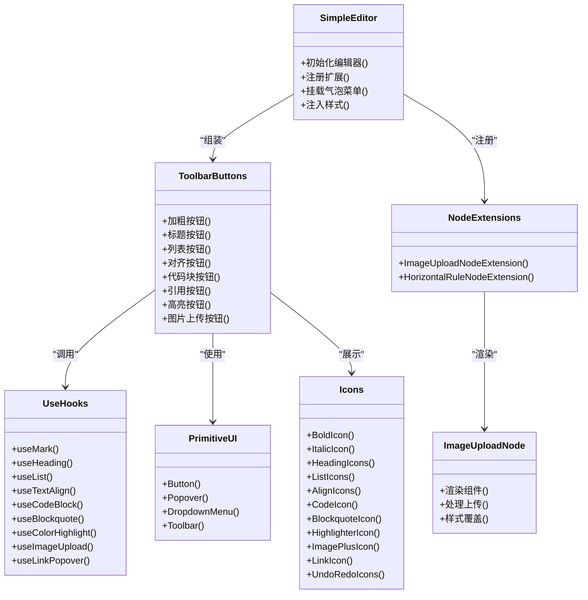
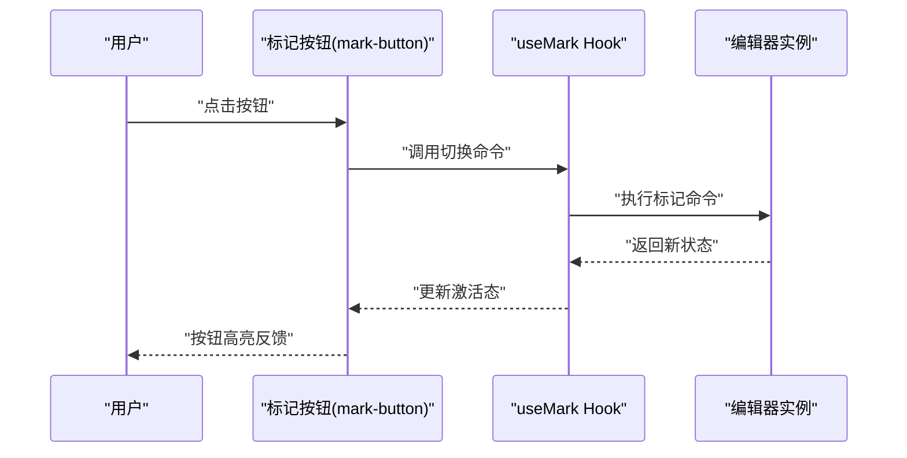
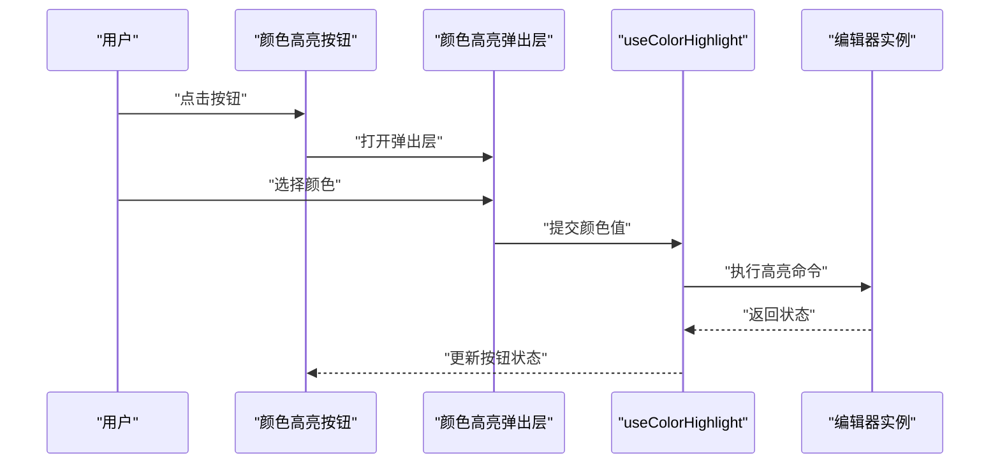
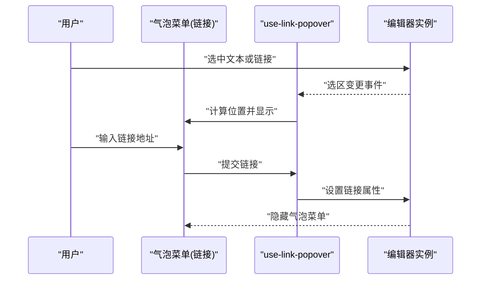
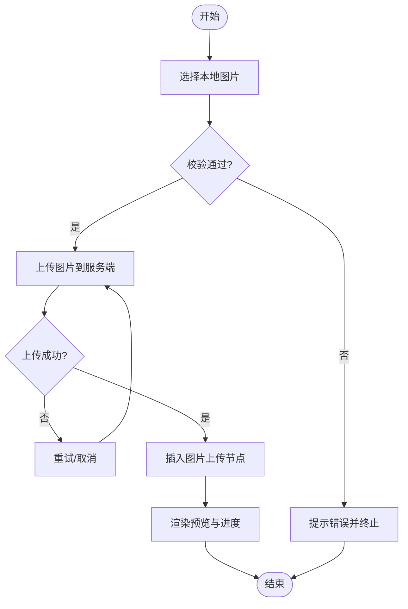
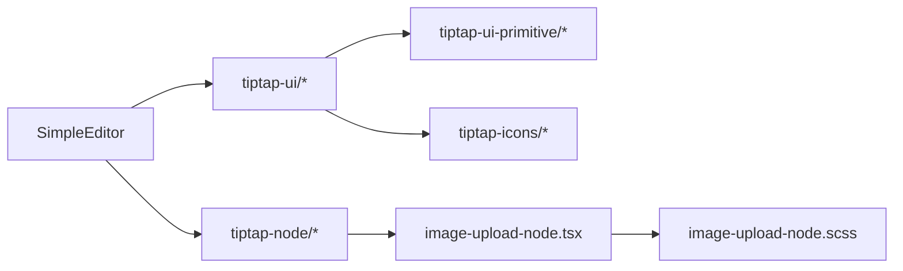

# TipTap 编辑器系统

<cite>
**本文引用的文件**   
- [src/components/tiptap-ui/index.tsx](file://src/components/tiptap-ui/index.tsx)
- [src/components/tiptap-ui/mark-button.tsx](file://src/components/tiptap-ui/mark-button.tsx)
- [src/components/tiptap-ui/use-mark.ts](file://src/components/tiptap-ui/use-mark.ts)
- [src/components/tiptap-ui/heading-button.tsx](file://src/components/tiptap-ui/heading-button.tsx)
- [src/components/tiptap-ui/use-heading.ts](file://src/components/tiptap-ui/use-heading.ts)
- [src/components/tiptap-ui/list-button.tsx](file://src/components/tiptap-ui/list-button.tsx)
- [src/components/tiptap-ui/use-list.ts](file://src/components/tiptap-ui/use-list.ts)
- [src/components/tiptap-ui/text-align-button.tsx](file://src/components/tiptap-ui/text-align-button.tsx)
- [src/components/tiptap-ui/use-text-align.ts](file://src/components/tiptap-ui/use-text-align.ts)
- [src/components/tiptap-ui/code-block-button.tsx](file://src/components/tiptap-ui/code-block-button.tsx)
- [src/components/tiptap-ui/use-code-block.ts](file://src/components/tiptap-ui/use-code-block.ts)
- [src/components/tiptap-ui/blockquote-button.tsx](file://src/components/tiptap-ui/blockquote-button.tsx)
- [src/components/tiptap-ui/use-blockquote.ts](file://src/components/tiptap-ui/use-blockquote.ts)
- [src/components/tiptap-ui/color-highlight-button.tsx](file://src/components/tiptap-ui/color-highlight-button.tsx)
- [src/components/tiptap-ui/color-highlight-popover.tsx](file://src/components/tiptap-ui/color-highlight-popover.tsx)
- [src/components/tiptap-ui/use-color-highlight.ts](file://src/components/tiptap-ui/use-color-highlight.ts)
- [src/components/tiptap-ui/image-upload-button.tsx](file://src/components/tiptap-ui/image-upload-button.tsx)
- [src/components/tiptap-ui/use-image-upload.ts](file://src/components/tiptap-ui/use-image-upload.ts)
- [src/components/tiptap-ui/link-popover.tsx](file://src/components/tiptap-ui/link-popover.tsx)
- [src/components/tiptap-ui/use-link-popover.ts](file://src/components/tiptap-ui/use-link-popover.ts)
- [src/components/tiptap-ui-primitive/button.tsx](file://src/components/tiptap-ui-primitive/button.tsx)
- [src/components/tiptap-ui-primitive/popover.tsx](file://src/components/tiptap-ui-primitive/popover.tsx)
- [src/components/tiptap-ui-primitive/dropdown-menu.tsx](file://src/components/tiptap-ui-primitive/dropdown-menu.tsx)
- [src/components/tiptap-ui-primitive/toolbar.tsx](file://src/components/tiptap-ui-primitive/toolbar.tsx)
- [src/components/tiptap-icons/bold-icon.tsx](file://src/components/tiptap-icons/bold-icon.tsx)
- [src/components/tiptap-icons/italic-icon.tsx](file://src/components/tiptap-icons/italic-icon.tsx)
- [src/components/tiptap-icons/heading-one-icon.tsx](file://src/components/tiptap-icons/heading-one-icon.tsx)
- [src/components/tiptap-icons/heading-two-icon.tsx](file://src/components/tiptap-icons/heading-two-icon.tsx)
- [src/components/tiptap-icons/heading-three-icon.tsx](file://src/components/tiptap-icons/heading-three-icon.tsx)
- [src/components/tiptap-icons/heading-four-icon.tsx](file://src/components/tiptap-icons/heading-four-icon.tsx)
- [src/components/tiptap-icons/heading-five-icon.tsx](file://src/components/tiptap-icons/heading-five-icon.tsx)
- [src/components/tiptap-icons/heading-six-icon.tsx](file://src/components/tiptap-icons/heading-six-icon.tsx)
- [src/components/tiptap-icons/list-icon.tsx](file://src/components/tiptap-icons/list-icon.tsx)
- [src/components/tiptap-icons/list-ordered-icon.tsx](file://src/components/tiptap-icons/list-ordered-icon.tsx)
- [src/components/tiptap-icons/list-todo-icon.tsx](file://src/components/tiptap-icons/list-todo-icon.tsx)
- [src/components/tiptap-icons/align-left-icon.tsx](file://src/components/tiptap-icons/align-left-icon.tsx)
- [src/components/tiptap-icons/align-center-icon.tsx](file://src/components/tiptap-icons/align-center-icon.tsx)
- [src/components/tiptap-icons/align-right-icon.tsx](file://src/components/tiptap-icons/align-right-icon.tsx)
- [src/components/tiptap-icons/align-justify-icon.tsx](file://src/components/tiptap-icons/align-justify-icon.tsx)
- [src/components/tiptap-icons/code2-icon.tsx](file://src/components/tiptap-icons/code2-icon.tsx)
- [src/components/tiptap-icons/blockquote-icon.tsx](file://src/components/tiptap-icons/blockquote-icon.tsx)
- [src/components/tiptap-icons/highlighter-icon.tsx](file://src/components/tiptap-icons/highlighter-icon.tsx)
- [src/components/tiptap-icons/image-plus-icon.tsx](file://src/components/tiptap-icons/image-plus-icon.tsx)
- [src/components/tiptap-icons/link-icon.tsx](file://src/components/tiptap-icons/link-icon.tsx)
- [src/components/tiptap-icons/undo2-icon.tsx](file://src/components/tiptap-icons/undo2-icon.tsx)
- [src/components/tiptap-icons/redo2-icon.tsx](file://src/components/tiptap-icons/redo2-icon.tsx)
- [src/components/tiptap-node/horizontal-rule-node-extension.ts](file://src/components/tiptap-node/horizontal-rule-node-extension.ts)
- [src/components/tiptap-node/image-upload-node-extension.ts](file://src/components/tiptap-node/image-upload-node-extension.ts)
- [src/components/tiptap-node/image-upload-node.tsx](file://src/components/tiptap-node/image-upload-node.tsx)
- [src/components/tiptap-node/image-upload-node.scss](file://src/components/tiptap-node/image-upload-node.scss)
- [src/components/tiptap-node/image-node.scss](file://src/components/tiptap-node/image-node.scss)
- [src/components/tiptap-node/heading-node.scss](file://src/components/tiptap-node/heading-node.scss)
- [src/components/tiptap-node/blockquote-node.scss](file://src/components/tiptap-node/blockquote-node.scss)
- [src/components/tiptap-node/code-block-node.scss](file://src/components/tiptap-node/code-block-node.scss)
- [src/components/tiptap-node/list-node.scss](file://src/components/tiptap-node/list-node.scss)
- [src/components/tiptap-node/paragraph-node.scss](file://src/components/tiptap-node/paragraph-node.scss)
- [src/components/tiptap-node/index.tsx](file://src/components/tiptap-node/index.tsx)
- [src/features/tiptap/SimpleEditor.tsx](file://src/features/tiptap/SimpleEditor.tsx)
- [src/features/tiptap/config.ts](file://src/features/tiptap/config.ts)
- [src/features/tiptap/tiptap.css](file://src/features/tiptap/tiptap.css)
- [src/features/tiptap/TipTapBubbleMenu.tsx](file://src/features/tiptap/TipTapBubbleMenu.tsx)
- [src/hooks/use-tiptap-editor.ts](file://src/hooks/use-tiptap-editor.ts)
- [src/lib/tiptap-utils.ts](file://src/lib/tiptap-utils.ts)
</cite>

## 更新摘要
**所做更改**   
- 移除了已删除的控件库相关文档内容，包括交互式弹出框、工具栏工具函数和编辑器控件等
- 更新了UI组件架构描述，反映当前实际的组件结构
- 简化了UI层描述，专注于现有的基础UI原语和业务组件
- 调整了依赖关系分析以匹配当前的代码组织

## 目录
1. [简介](#简介)
2. [项目结构](#项目结构)
3. [核心组件](#核心组件)
4. [架构总览](#架构总览)
5. [详细组件分析](#详细组件分析)
6. [依赖关系分析](#依赖关系分析)
7. [性能考虑](#性能考虑)
8. [故障排查指南](#故障排查指南)
9. [结论](#结论)
10. [附录](#附录)

## 简介
本技术文档围绕 FishWorker 中的 TipTap 编辑器系统，系统性阐述其整体架构、扩展机制与 UI 组件体系。重点覆盖：
- 自定义节点开发（含图片上传节点）
- 标记扩展与工具栏按钮集成
- 插件化能力与气泡菜单
- 图标组件库的组织与使用
- 基础UI原语与业务组件的分离设计
- 主题定制与样式覆盖策略
- 性能优化技巧与调试方法

## 项目结构
编辑器相关代码按"功能域 + 层次"组织：
- features/tiptap：编辑器装配与配置入口、气泡菜单、全局样式
- components/tiptap-node：自定义节点扩展与渲染组件、节点样式
- components/tiptap-ui：业务级编辑控件（按钮、下拉、弹出层等）及其 Hook
- components/tiptap-ui-primitive：基础 UI 原语（按钮、弹出层、下拉菜单、工具栏等）
- components/tiptap-icons：图标组件集合
- hooks：编辑器生命周期与交互 Hook
- lib：通用工具函数（如 TipTap 辅助）

图表来源
- [src/features/tiptap/SimpleEditor.tsx](file://src/features/tiptap/SimpleEditor.tsx)
- [src/features/tiptap/config.ts](file://src/features/tiptap/config.ts)
- [src/features/tiptap/TipTapBubbleMenu.tsx](file://src/features/tiptap/TipTapBubbleMenu.tsx)
- [src/features/tiptap/tiptap.css](file://src/features/tiptap/tiptap.css)
- [src/components/tiptap-ui/index.tsx](file://src/components/tiptap-ui/index.tsx)
- [src/components/tiptap-ui/mark-button.tsx](file://src/components/tiptap-ui/mark-button.tsx)
- [src/components/tiptap-ui/heading-button.tsx](file://src/components/tiptap-ui/heading-button.tsx)
- [src/components/tiptap-ui/list-button.tsx](file://src/components/tiptap-ui/list-button.tsx)
- [src/components/tiptap-ui/text-align-button.tsx](file://src/components/tiptap-ui/text-align-button.tsx)
- [src/components/tiptap-ui/code-block-button.tsx](file://src/components/tiptap-ui/code-block-button.tsx)
- [src/components/tiptap-ui/blockquote-button.tsx](file://src/components/tiptap-ui/blockquote-button.tsx)
- [src/components/tiptap-ui/color-highlight-button.tsx](file://src/components/tiptap-ui/color-highlight-button.tsx)
- [src/components/tiptap-ui/image-upload-button.tsx](file://src/components/tiptap-ui/image-upload-button.tsx)
- [src/components/tiptap-ui/link-popover.tsx](file://src/components/tiptap-ui/link-popover.tsx)
- [src/components/tiptap-ui-primitive/button.tsx](file://src/components/tiptap-ui-primitive/button.tsx)
- [src/components/tiptap-ui-primitive/popover.tsx](file://src/components/tiptap-ui-primitive/popover.tsx)
- [src/components/tiptap-ui-primitive/dropdown-menu.tsx](file://src/components/tiptap-ui-primitive/dropdown-menu.tsx)
- [src/components/tiptap-ui-primitive/toolbar.tsx](file://src/components/tiptap-ui-primitive/toolbar.tsx)
- [src/components/tiptap-icons/bold-icon.tsx](file://src/components/tiptap-icons/bold-icon.tsx)
- [src/components/tiptap-icons/italic-icon.tsx](file://src/components/tiptap-icons/italic-icon.tsx)
- [src/components/tiptap-icons/heading-one-icon.tsx](file://src/components/tiptap-icons/heading-one-icon.tsx)
- [src/components/tiptap-icons/heading-two-icon.tsx](file://src/components/tiptap-icons/heading-two-icon.tsx)
- [src/components/tiptap-icons/heading-three-icon.tsx](file://src/components/tiptap-icons/heading-three-icon.tsx)
- [src/components/tiptap-icons/heading-four-icon.tsx](file://src/components/tiptap-icons/heading-four-icon.tsx)
- [src/components/tiptap-icons/heading-five-icon.tsx](file://src/components/tiptap-icons/heading-five-icon.tsx)
- [src/components/tiptap-icons/heading-six-icon.tsx](file://src/components/tiptap-icons/heading-six-icon.tsx)
- [src/components/tiptap-icons/list-icon.tsx](file://src/components/tiptap-icons/list-icon.tsx)
- [src/components/tiptap-icons/list-ordered-icon.tsx](file://src/components/tiptap-icons/list-ordered-icon.tsx)
- [src/components/tiptap-icons/list-todo-icon.tsx](file://src/components/tiptap-icons/list-todo-icon.tsx)
- [src/components/tiptap-icons/align-left-icon.tsx](file://src/components/tiptap-icons/align-left-icon.tsx)
- [src/components/tiptap-icons/align-center-icon.tsx](file://src/components/tiptap-icons/align-center-icon.tsx)
- [src/components/tiptap-icons/align-right-icon.tsx](file://src/components/tiptap-icons/align-right-icon.tsx)
- [src/components/tiptap-icons/align-justify-icon.tsx](file://src/components/tiptap-icons/align-justify-icon.tsx)
- [src/components/tiptap-icons/code2-icon.tsx](file://src/components/tiptap-icons/code2-icon.tsx)
- [src/components/tiptap-icons/blockquote-icon.tsx](file://src/components/tiptap-icons/blockquote-icon.tsx)
- [src/components/tiptap-icons/highlighter-icon.tsx](file://src/components/tiptap-icons/highlighter-icon.tsx)
- [src/components/tiptap-icons/image-plus-icon.tsx](file://src/components/tiptap-icons/image-plus-icon.tsx)
- [src/components/tiptap-icons/link-icon.tsx](file://src/components/tiptap-icons/link-icon.tsx)
- [src/components/tiptap-icons/undo2-icon.tsx](file://src/components/tiptap-icons/undo2-icon.tsx)
- [src/components/tiptap-icons/redo2-icon.tsx](file://src/components/tiptap-icons/redo2-icon.tsx)
- [src/components/tiptap-node/image-upload-node-extension.ts](file://src/components/tiptap-node/image-upload-node-extension.ts)
- [src/components/tiptap-node/image-upload-node.tsx](file://src/components/tiptap-node/image-upload-node.tsx)
- [src/components/tiptap-node/horizontal-rule-node-extension.ts](file://src/components/tiptap-node/horizontal-rule-node-extension.ts)
- [src/components/tiptap-node/image-upload-node.scss](file://src/components/tiptap-node/image-upload-node.scss)
- [src/components/tiptap-node/image-node.scss](file://src/components/tiptap-node/image-node.scss)
- [src/components/tiptap-node/heading-node.scss](file://src/components/tiptap-node/heading-node.scss)
- [src/components/tiptap-node/blockquote-node.scss](file://src/components/tiptap-node/blockquote-node.scss)
- [src/components/tiptap-node/code-block-node.scss](file://src/components/tiptap-node/code-block-node.scss)
- [src/components/tiptap-node/list-node.scss](file://src/components/tiptap-node/list-node.scss)
- [src/components/tiptap-node/paragraph-node.scss](file://src/components/tiptap-node/paragraph-node.scss)

章节来源
- [src/features/tiptap/SimpleEditor.tsx](file://src/features/tiptap/SimpleEditor.tsx)
- [src/features/tiptap/config.ts](file://src/features/tiptap/config.ts)
- [src/features/tiptap/tiptap.css](file://src/features/tiptap/tiptap.css)
- [src/components/tiptap-ui/index.tsx](file://src/components/tiptap-ui/index.tsx)
- [src/components/tiptap-node/index.tsx](file://src/components/tiptap-node/index.tsx)

## 核心组件
- 编辑器装配器 SimpleEditor：负责初始化 TipTap 实例、注册扩展、挂载气泡菜单、注入全局样式与主题变量。
- 工具栏与操作按钮：通过 tiptap-ui 下的按钮组件与对应 use-* Hook 组合，驱动编辑器命令执行与状态同步。
- 基础 UI 原语：提供可复用的按钮、弹出层、下拉菜单、工具栏容器等，确保一致的交互体验。
- 图标组件：以独立 React 组件形式提供，便于在按钮中按需引入。
- 自定义节点：以扩展方式注册到编辑器，并配套渲染组件与样式。

章节来源
- [src/features/tiptap/SimpleEditor.tsx](file://src/features/tiptap/SimpleEditor.tsx)
- [src/components/tiptap-ui/index.tsx](file://src/components/tiptap-ui/index.tsx)
- [src/components/tiptap-ui-primitive/toolbar.tsx](file://src/components/tiptap-ui-primitive/toolbar.tsx)
- [src/components/tiptap-node/index.tsx](file://src/components/tiptap-node/index.tsx)

## 架构总览
编辑器采用"装配器 + 扩展 + UI 组件 + 基础原语"的分层设计：
- 装配层：SimpleEditor 聚合配置、扩展、气泡菜单与样式。
- 扩展层：节点扩展（如图片上传、水平线）与标记扩展（加粗、斜体等）。
- UI 层：业务按钮与弹出层，封装命令调用与状态监听。
- 基础层：按钮、弹出层、下拉菜单、工具栏等原子组件。
- 图标层：统一图标资源，供 UI 层消费。

图表来源
- [src/features/tiptap/SimpleEditor.tsx](file://src/features/tiptap/SimpleEditor.tsx)
- [src/components/tiptap-ui/mark-button.tsx](file://src/components/tiptap-ui/mark-button.tsx)
- [src/components/tiptap-ui/heading-button.tsx](file://src/components/tiptap-ui/heading-button.tsx)
- [src/components/tiptap-ui/list-button.tsx](file://src/components/tiptap-ui/list-button.tsx)
- [src/components/tiptap-ui/text-align-button.tsx](file://src/components/tiptap-ui/text-align-button.tsx)
- [src/components/tiptap-ui/code-block-button.tsx](file://src/components/tiptap-ui/code-block-button.tsx)
- [src/components/tiptap-ui/blockquote-button.tsx](file://src/components/tiptap-ui/blockquote-button.tsx)
- [src/components/tiptap-ui/color-highlight-button.tsx](file://src/components/tiptap-ui/color-highlight-button.tsx)
- [src/components/tiptap-ui/image-upload-button.tsx](file://src/components/tiptap-ui/image-upload-button.tsx)
- [src/components/tiptap-ui-primitive/button.tsx](file://src/components/tiptap-ui-primitive/button.tsx)
- [src/components/tiptap-ui-primitive/popover.tsx](file://src/components/tiptap-ui-primitive/popover.tsx)
- [src/components/tiptap-ui-primitive/dropdown-menu.tsx](file://src/components/tiptap-ui-primitive/dropdown-menu.tsx)
- [src/components/tiptap-ui-primitive/toolbar.tsx](file://src/components/tiptap-ui-primitive/toolbar.tsx)
- [src/components/tiptap-icons/bold-icon.tsx](file://src/components/tiptap-icons/bold-icon.tsx)
- [src/components/tiptap-icons/italic-icon.tsx](file://src/components/tiptap-icons/italic-icon.tsx)
- [src/components/tiptap-icons/heading-one-icon.tsx](file://src/components/tiptap-icons/heading-one-icon.tsx)
- [src/components/tiptap-icons/heading-two-icon.tsx](file://src/components/tiptap-icons/heading-two-icon.tsx)
- [src/components/tiptap-icons/heading-three-icon.tsx](file://src/components/tiptap-icons/heading-three-icon.tsx)
- [src/components/tiptap-icons/heading-four-icon.tsx](file://src/components/tiptap-icons/heading-four-icon.tsx)
- [src/components/tiptap-icons/heading-five-icon.tsx](file://src/components/tiptap-icons/heading-five-icon.tsx)
- [src/components/tiptap-icons/heading-six-icon.tsx](file://src/components/tiptap-icons/heading-six-icon.tsx)
- [src/components/tiptap-icons/list-icon.tsx](file://src/components/tiptap-icons/list-icon.tsx)
- [src/components/tiptap-icons/list-ordered-icon.tsx](file://src/components/tiptap-icons/list-ordered-icon.tsx)
- [src/components/tiptap-icons/list-todo-icon.tsx](file://src/components/tiptap-icons/list-todo-icon.tsx)
- [src/components/tiptap-icons/align-left-icon.tsx](file://src/components/tiptap-icons/align-left-icon.tsx)
- [src/components/tiptap-icons/align-center-icon.tsx](file://src/components/tiptap-icons/align-center-icon.tsx)
- [src/components/tiptap-icons/align-right-icon.tsx](file://src/components/tiptap-icons/align-right-icon.tsx)
- [src/components/tiptap-icons/align-justify-icon.tsx](file://src/components/tiptap-icons/align-justify-icon.tsx)
- [src/components/tiptap-icons/code2-icon.tsx](file://src/components/tiptap-icons/code2-icon.tsx)
- [src/components/tiptap-icons/blockquote-icon.tsx](file://src/components/tiptap-icons/blockquote-icon.tsx)
- [src/components/tiptap-icons/highlighter-icon.tsx](file://src/components/tiptap-icons/highlighter-icon.tsx)
- [src/components/tiptap-icons/image-plus-icon.tsx](file://src/components/tiptap-icons/image-plus-icon.tsx)
- [src/components/tiptap-icons/link-icon.tsx](file://src/components/tiptap-icons/link-icon.tsx)
- [src/components/tiptap-icons/undo2-icon.tsx](file://src/components/tiptap-icons/undo2-icon.tsx)
- [src/components/tiptap-icons/redo2-icon.tsx](file://src/components/tiptap-icons/redo2-icon.tsx)
- [src/components/tiptap-node/image-upload-node-extension.ts](file://src/components/tiptap-node/image-upload-node-extension.ts)
- [src/components/tiptap-node/image-upload-node.tsx](file://src/components/tiptap-node/image-upload-node.tsx)

## 详细组件分析

### 标记扩展与工具栏按钮
- 标记扩展（如加粗、斜体）通过 useMark Hook 封装命令切换与状态查询，按钮组件负责触发命令与更新激活态。
- 标题、列表、文本对齐、代码块、引用等均为"按钮 + Hook"的组合模式，保持 UI 与逻辑解耦。

图表来源
- [src/components/tiptap-ui/mark-button.tsx](file://src/components/tiptap-ui/mark-button.tsx)
- [src/components/tiptap-ui/use-mark.ts](file://src/components/tiptap-ui/use-mark.ts)

章节来源
- [src/components/tiptap-ui/mark-button.tsx](file://src/components/tiptap-ui/mark-button.tsx)
- [src/components/tiptap-ui/use-mark.ts](file://src/components/tiptap-ui/use-mark.ts)
- [src/components/tiptap-ui/heading-button.tsx](file://src/components/tiptap-ui/heading-button.tsx)
- [src/components/tiptap-ui/use-heading.ts](file://src/components/tiptap-ui/use-heading.ts)
- [src/components/tiptap-ui/list-button.tsx](file://src/components/tiptap-ui/list-button.tsx)
- [src/components/tiptap-ui/use-list.ts](file://src/components/tiptap-ui/use-list.ts)
- [src/components/tiptap-ui/text-align-button.tsx](file://src/components/tiptap-ui/text-align-button.tsx)
- [src/components/tiptap-ui/use-text-align.ts](file://src/components/tiptap-ui/use-text-align.ts)
- [src/components/tiptap-ui/code-block-button.tsx](file://src/components/tiptap-ui/use-code-block.ts)
- [src/components/tiptap-ui/blockquote-button.tsx](file://src/components/tiptap-ui/use-blockquote.ts)

### 颜色高亮与弹出层
- 颜色高亮由 color-highlight-button 与 color-highlight-popover 协作完成，useColorHighlight Hook 维护当前高亮色与命令执行。
- 弹出层基于 popover 原语，支持定位与关闭行为。

图表来源
- [src/components/tiptap-ui/color-highlight-button.tsx](file://src/components/tiptap-ui/color-highlight-button.tsx)
- [src/components/tiptap-ui/color-highlight-popover.tsx](file://src/components/tiptap-ui/color-highlight-popover.tsx)
- [src/components/tiptap-ui/use-color-highlight.ts](file://src/components/tiptap-ui/use-color-highlight.ts)
- [src/components/tiptap-ui-primitive/popover.tsx](file://src/components/tiptap-ui-primitive/popover.tsx)

章节来源
- [src/components/tiptap-ui/color-highlight-button.tsx](file://src/components/tiptap-ui/color-highlight-button.tsx)
- [src/components/tiptap-ui/color-highlight-popover.tsx](file://src/components/tiptap-ui/color-highlight-popover.tsx)
- [src/components/tiptap-ui/use-color-highlight.ts](file://src/components/tiptap-ui/use-color-highlight.ts)
- [src/components/tiptap-ui-primitive/popover.tsx](file://src/components/tiptap-ui-primitive/popover.tsx)

### 链接气泡菜单
- link-popover 与 use-link-popover 配合，实现选中链接时的插入/编辑/删除等操作。
- 气泡菜单的显示位置与可见性由编辑器选区变化驱动。

图表来源
- [src/components/tiptap-ui/link-popover.tsx](file://src/components/tiptap-ui/link-popover.tsx)
- [src/components/tiptap-ui/use-link-popover.ts](file://src/components/tiptap-ui/use-link-popover.ts)

章节来源
- [src/components/tiptap-ui/link-popover.tsx](file://src/components/tiptap-ui/link-popover.tsx)
- [src/components/tiptap-ui/use-link-popover.ts](file://src/components/tiptap-ui/use-link-popover.ts)

### 图片上传节点
- 节点扩展 image-upload-node-extension 定义节点 schema、序列化与命令；image-upload-node.tsx 提供上传交互与预览。
- 上传流程包含选择文件、校验、上传、插入节点、错误处理与重试。

图表来源
- [src/components/tiptap-node/image-upload-node-extension.ts](file://src/components/tiptap-node/image-upload-node-extension.ts)
- [src/components/tiptap-node/image-upload-node.tsx](file://src/components/tiptap-node/image-upload-node.tsx)
- [src/components/tiptap-node/image-upload-node.scss](file://src/components/tiptap-node/image-upload-node.scss)

章节来源
- [src/components/tiptap-node/image-upload-node-extension.ts](file://src/components/tiptap-node/image-upload-node-extension.ts)
- [src/components/tiptap-node/image-upload-node.tsx](file://src/components/tiptap-node/image-upload-node.tsx)
- [src/components/tiptap-node/image-upload-node.scss](file://src/components/tiptap-node/image-upload-node.scss)

### 水平线与段落/列表/引用/代码块节点
- 水平线通过 horizontal-rule-node-extension 注册为节点。
- 段落、列表、引用、代码块等节点分别提供样式覆盖，保证排版一致性。

章节来源
- [src/components/tiptap-node/horizontal-rule-node-extension.ts](file://src/components/tiptap-node/horizontal-rule-node-extension.ts)
- [src/components/tiptap-node/paragraph-node.scss](file://src/components/tiptap-node/paragraph-node.scss)
- [src/components/tiptap-node/list-node.scss](file://src/components/tiptap-node/list-node.scss)
- [src/components/tiptap-node/blockquote-node.scss](file://src/components/tiptap-node/blockquote-node.scss)
- [src/components/tiptap-node/code-block-node.scss](file://src/components/tiptap-node/code-block-node.scss)

### 气泡菜单与全局装配
- TipTapBubbleMenu 根据选区类型动态显示不同操作项。
- SimpleEditor 负责装配所有扩展、UI 组件与样式，并提供主题变量与全局样式注入。

章节来源
- [src/features/tiptap/TipTapBubbleMenu.tsx](file://src/features/tiptap/TipTapBubbleMenu.tsx)
- [src/features/tiptap/SimpleEditor.tsx](file://src/features/tiptap/SimpleEditor.tsx)
- [src/features/tiptap/config.ts](file://src/features/tiptap/config.ts)
- [src/features/tiptap/tiptap.css](file://src/features/tiptap/tiptap.css)

## 依赖关系分析
- 装配层依赖 UI 层与扩展层；UI 层依赖基础原语与图标库；扩展层依赖节点渲染组件与样式。
- 关键耦合点：
  - 按钮与 Hook：通过 Hook 访问编辑器命令与状态，避免直接耦合编辑器实例。
  - 气泡菜单与选区：依赖编辑器选区事件驱动显示与定位。
  - 图片上传节点：扩展与渲染组件分离，利于测试与替换。

图表来源
- [src/features/tiptap/SimpleEditor.tsx](file://src/features/tiptap/SimpleEditor.tsx)
- [src/components/tiptap-ui/index.tsx](file://src/components/tiptap-ui/index.tsx)
- [src/components/tiptap-node/image-upload-node.tsx](file://src/components/tiptap-node/image-upload-node.tsx)
- [src/components/tiptap-node/image-upload-node.scss](file://src/components/tiptap-node/image-upload-node.scss)

章节来源
- [src/features/tiptap/SimpleEditor.tsx](file://src/features/tiptap/SimpleEditor.tsx)
- [src/components/tiptap-ui/index.tsx](file://src/components/tiptap-ui/index.tsx)
- [src/components/tiptap-node/image-upload-node.tsx](file://src/components/tiptap-node/image-upload-node.tsx)

## 性能考虑
- 懒加载与按需引入：仅引入需要的按钮与图标，减少打包体积。
- 事件节流与防抖：对滚动、窗口尺寸变化、选区频繁变更进行节流/防抖，降低重排重绘。
- 虚拟滚动与分页：长文档场景下，结合气泡菜单与工具栏的可见性控制，避免不必要的渲染。
- 图片上传优化：
  - 前端压缩与格式转换（如转 WebP），减小传输体积。
  - 分片上传与大文件断点续传（如需）。
  - 上传前预检查（大小、类型、数量限制）。
- 状态最小化：Hook 内部仅暴露必要状态，避免过度订阅导致重渲染。
- 样式隔离：使用模块化样式与 CSS 变量，减少全局样式冲突与重绘范围。

[本节为通用指导，不直接分析具体文件]

## 故障排查指南
- 编辑器未响应命令：
  - 检查按钮是否正确使用对应 Hook 调用命令。
  - 确认编辑器实例已正确初始化且扩展已注册。
- 气泡菜单不显示或定位异常：
  - 检查选区事件是否正确触发。
  - 验证弹出层容器与定位上下文。
- 图片上传失败：
  - 查看网络请求与后端返回码。
  - 检查文件大小、类型与服务器限制。
  - 确认节点扩展的命令与渲染组件参数一致。
- 样式覆盖无效：
  - 确认样式加载顺序与优先级。
  - 检查 CSS 变量与类名是否匹配。

章节来源
- [src/features/tiptap/TipTapBubbleMenu.tsx](file://src/features/tiptap/TipTapBubbleMenu.tsx)
- [src/components/tiptap-ui/image-upload-button.tsx](file://src/components/tiptap-ui/image-upload-button.tsx)
- [src/components/tiptap-ui/use-image-upload.ts](file://src/components/tiptap-ui/use-image-upload.ts)
- [src/components/tiptap-node/image-upload-node-extension.ts](file://src/components/tiptap-node/image-upload-node-extension.ts)
- [src/components/tiptap-node/image-upload-node.tsx](file://src/components/tiptap-node/image-upload-node.tsx)

## 结论
FishWorker 的 TipTap 编辑器系统通过清晰的层次划分与可扩展的扩展机制，实现了丰富的富文本能力。UI 层与基础原语解耦，图标库集中管理，节点扩展与渲染组件分离，便于维护与演进。配合主题定制、性能优化与完善的调试手段，可满足复杂业务场景需求。

[本节为总结，不直接分析具体文件]

## 附录

### 图标组件库组织结构与使用
- 组织方式：每个图标一个独立组件文件，命名遵循语义化（如 bold-icon.tsx、heading-one-icon.tsx）。
- 使用方法：在按钮组件中按需引入对应图标，作为按钮内容或占位符。
- 建议：新增图标时保持一致的导出结构与尺寸约定，便于统一替换与主题化。

章节来源
- [src/components/tiptap-icons/bold-icon.tsx](file://src/components/tiptap-icons/bold-icon.tsx)
- [src/components/tiptap-icons/italic-icon.tsx](file://src/components/tiptap-icons/italic-icon.tsx)
- [src/components/tiptap-icons/heading-one-icon.tsx](file://src/components/tiptap-icons/heading-one-icon.tsx)
- [src/components/tiptap-icons/heading-two-icon.tsx](file://src/components/tiptap-icons/heading-two-icon.tsx)
- [src/components/tiptap-icons/heading-three-icon.tsx](file://src/components/tiptap-icons/heading-three-icon.tsx)
- [src/components/tiptap-icons/heading-four-icon.tsx](file://src/components/tiptap-icons/heading-four-icon.tsx)
- [src/components/tiptap-icons/heading-five-icon.tsx](file://src/components/tiptap-icons/heading-five-icon.tsx)
- [src/components/tiptap-icons/heading-six-icon.tsx](file://src/components/tiptap-icons/heading-six-icon.tsx)
- [src/components/tiptap-icons/list-icon.tsx](file://src/components/tiptap-icons/list-icon.tsx)
- [src/components/tiptap-icons/list-ordered-icon.tsx](file://src/components/tiptap-icons/list-ordered-icon.tsx)
- [src/components/tiptap-icons/list-todo-icon.tsx](file://src/components/tiptap-icons/list-todo-icon.tsx)
- [src/components/tiptap-icons/align-left-icon.tsx](file://src/components/tiptap-icons/align-left-icon.tsx)
- [src/components/tiptap-icons/align-center-icon.tsx](file://src/components/tiptap-icons/align-center-icon.tsx)
- [src/components/tiptap-icons/align-right-icon.tsx](file://src/components/tiptap-icons/align-right-icon.tsx)
- [src/components/tiptap-icons/align-justify-icon.tsx](file://src/components/tiptap-icons/align-justify-icon.tsx)
- [src/components/tiptap-icons/code2-icon.tsx](file://src/components/tiptap-icons/code2-icon.tsx)
- [src/components/tiptap-icons/blockquote-icon.tsx](file://src/components/tiptap-icons/blockquote-icon.tsx)
- [src/components/tiptap-icons/highlighter-icon.tsx](file://src/components/tiptap-icons/highlighter-icon.tsx)
- [src/components/tiptap-icons/image-plus-icon.tsx](file://src/components/tiptap-icons/image-plus-icon.tsx)
- [src/components/tiptap-icons/link-icon.tsx](file://src/components/tiptap-icons/link-icon.tsx)
- [src/components/tiptap-icons/undo2-icon.tsx](file://src/components/tiptap-icons/undo2-icon.tsx)
- [src/components/tiptap-icons/redo2-icon.tsx](file://src/components/tiptap-icons/redo2-icon.tsx)

### 编辑器主题定制与样式覆盖
- 主题变量：通过 CSS 变量统一管理字体、字号、间距、颜色等，便于多主题切换。
- 样式覆盖：
  - 节点样式：针对 heading、blockquote、code-block、list、paragraph、image 等节点提供 SCSS 覆盖。
  - 全局样式：tiptap.css 提供基础排版与布局规则。
- 最佳实践：
  - 优先使用 CSS 变量而非硬编码颜色。
  - 将组件样式模块化，避免全局污染。
  - 使用作用域类名或 CSS Modules 防止冲突。

章节来源
- [src/features/tiptap/tiptap.css](file://src/features/tiptap/tiptap.css)
- [src/components/tiptap-node/heading-node.scss](file://src/components/tiptap-node/heading-node.scss)
- [src/components/tiptap-node/blockquote-node.scss](file://src/components/tiptap-node/blockquote-node.scss)
- [src/components/tiptap-node/code-block-node.scss](file://src/components/tiptap-node/code-block-node.scss)
- [src/components/tiptap-node/list-node.scss](file://src/components/tiptap-node/list-node.scss)
- [src/components/tiptap-node/paragraph-node.scss](file://src/components/tiptap-node/paragraph-node.scss)
- [src/components/tiptap-node/image-node.scss](file://src/components/tiptap-node/image-node.scss)

### 图片上传节点配置选项
- 基本配置：
  - 最大文件大小与类型白名单
  - 上传接口 URL、请求头、表单字段名
  - 上传进度回调与错误回调
  - 成功后插入节点的属性映射（如 src、alt、width、height）
- 高级配置：
  - 压缩参数（质量、尺寸上限、目标格式）
  - 分片大小与并发数
  - 重试策略与退避算法
  - 预览图生成与缓存策略

章节来源
- [src/components/tiptap-node/image-upload-node-extension.ts](file://src/components/tiptap-node/image-upload-node-extension.ts)
- [src/components/tiptap-node/image-upload-node.tsx](file://src/components/tiptap-node/image-upload-node.tsx)
- [src/components/tiptap-ui/use-image-upload.ts](file://src/components/tiptap-ui/use-image-upload.ts)