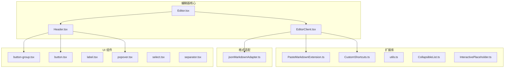
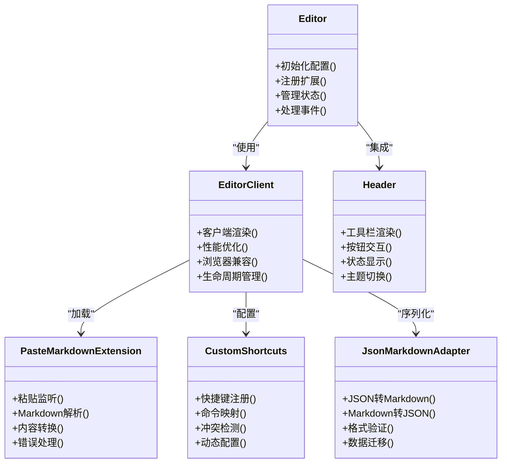
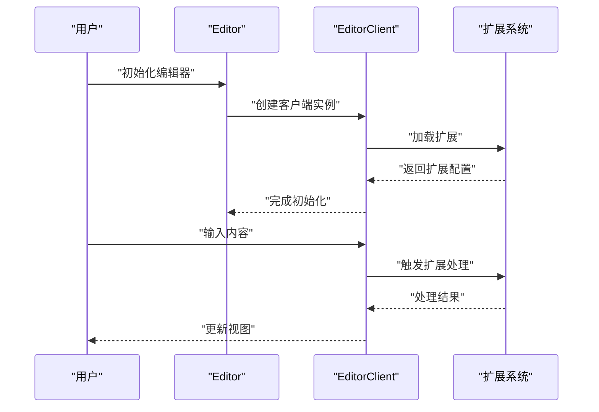
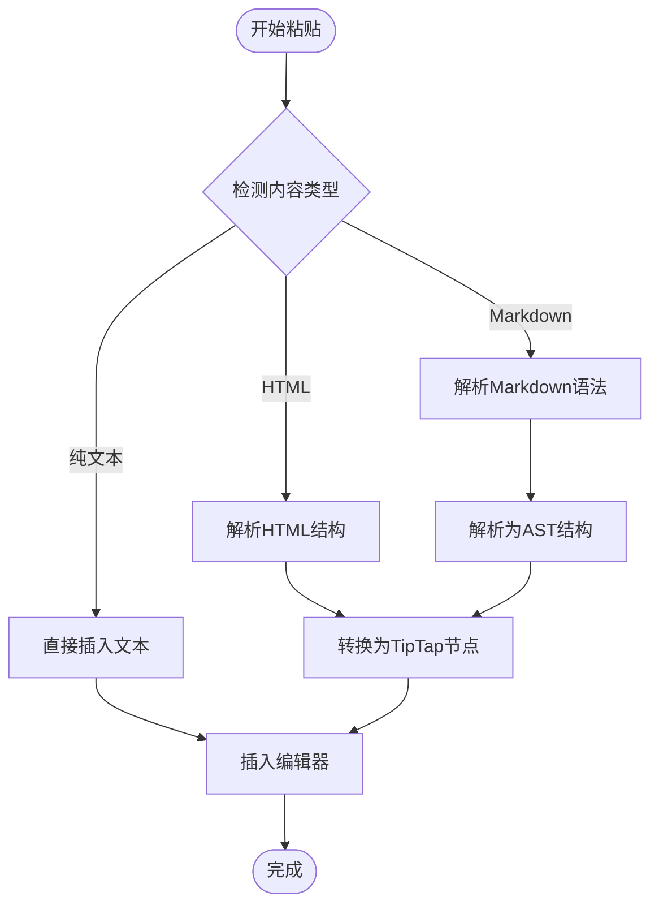
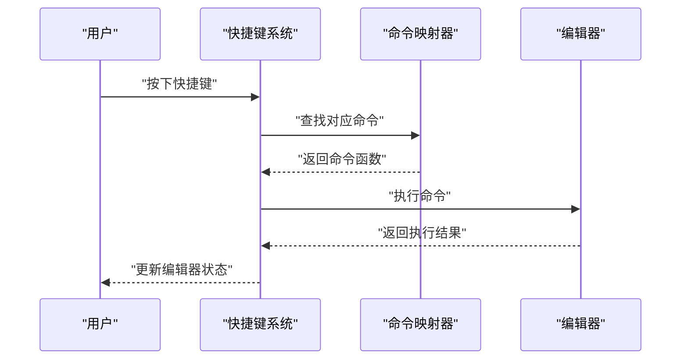
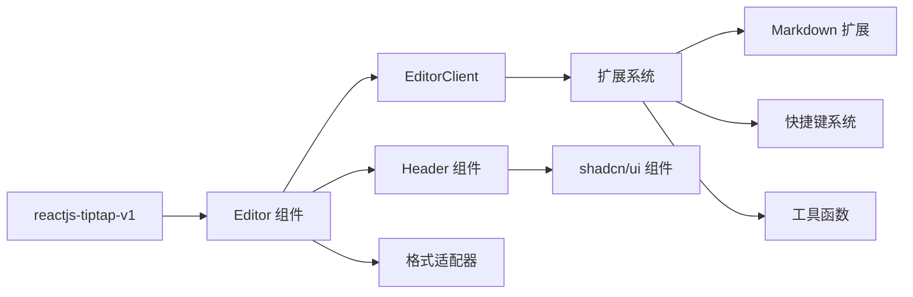

# TipTap 编辑器系统

<cite>
**本文引用的文件**
- [src/features/reactjs-tiptap-v1/index.ts](file://src/features/reactjs-tiptap-v1/index.ts)
- [src/features/reactjs-tiptap-v1/components/Editor/Editor.tsx](file://src/features/reactjs-tiptap-v1/components/Editor/Editor.tsx)
- [src/features/reactjs-tiptap-v1/components/Editor/EditorClient.tsx](file://src/features/reactjs-tiptap-v1/components/Editor/EditorClient.tsx)
- [src/features/reactjs-tiptap-v1/components/Editor/Header.tsx](file://src/features/reactjs-tiptap-v1/components/Editor/Header.tsx)
- [src/features/reactjs-tiptap-v1/lib/PasteMarkdownExtension.ts](file://src/features/reactjs-tiptap-v1/lib/PasteMarkdownExtension.ts)
- [src/features/reactjs-tiptap-v1/lib/CustomShortcuts.ts](file://src/features/reactjs-tiptap-v1/lib/CustomShortcuts.ts)
- [src/features/reactjs-tiptap-v1/jsonMarkdownAdapter.ts](file://src/features/reactjs-tiptap-v1/jsonMarkdownAdapter.ts)
- [src/features/reactjs-tiptap-v1/editor.css](file://src/features/reactjs-tiptap-v1/editor.css)
- [patches/reactjs-tiptap-editor@1.0.29.patch](file://patches/reactjs-tiptap-editor@1.0.29.patch)
</cite>

## 更新摘要
**所做更改**
- 完全迁移到 reactjs-tiptap-v1 架构，替代原有的旧 TipTap 实现
- 新增 Markdown 解析支持，通过 PasteMarkdownExtension 实现粘贴时自动转换
- 实现 JSON 格式存储适配器，支持数据持久化与格式转换
- 集成自定义快捷键系统，提供灵活的键盘操作配置
- 重构编辑器组件结构，采用客户端渲染模式提升性能
- 新增编辑器头部组件，提供工具栏和状态显示功能

## 目录
1. [简介](#简介)
2. [项目结构](#项目结构)
3. [核心组件](#核心组件)
4. [架构总览](#架构总览)
5. [详细组件分析](#详细组件分析)
6. [依赖关系分析](#依赖关系分析)
7. [性能考虑](#性能考虑)
8. [故障排查指南](#故障排查指南)
9. [结论](#结论)
10. [附录](#附录)

## 简介
本技术文档围绕 FishWorker 中基于 reactjs-tiptap-v1 的新一代编辑器系统，系统性阐述其整体架构、扩展机制与核心功能。重点覆盖：
- 基于 reactjs-tiptap-v1 的全新编辑器架构
- Markdown 解析与粘贴转换功能
- JSON 格式数据存储与适配
- 自定义快捷键系统与键盘操作
- 客户端渲染优化与性能提升
- 编辑器头部组件与工具栏集成

## 项目结构
新的编辑器系统采用模块化设计，主要位于 src/features/reactjs-tiptap-v1 目录下：
- components/Editor：编辑器核心组件，包含主编辑器、客户端渲染器、头部组件
- lib：编辑器扩展库，包括 Markdown 粘贴扩展、自定义快捷键等
- hooks：编辑器相关的自定义 Hook（ahooks 子目录）
- jsonMarkdownAdapter：JSON 与 Markdown 格式转换器
- editor.css：编辑器全局样式



**图表来源**
- [src/features/reactjs-tiptap-v1/components/Editor/Editor.tsx](file://src/features/reactjs-tiptap-v1/components/Editor/Editor.tsx)
- [src/features/reactjs-tiptap-v1/components/Editor/EditorClient.tsx](file://src/features/reactjs-tiptap-v1/components/Editor/EditorClient.tsx)
- [src/features/reactjs-tiptap-v1/components/Editor/Header.tsx](file://src/features/reactjs-tiptap-v1/components/Editor/Header.tsx)
- [src/features/reactjs-tiptap-v1/lib/PasteMarkdownExtension.ts](file://src/features/reactjs-tiptap-v1/lib/PasteMarkdownExtension.ts)
- [src/features/reactjs-tiptap-v1/lib/CustomShortcuts.ts](file://src/features/reactjs-tiptap-v1/lib/CustomShortcuts.ts)
- [src/features/reactjs-tiptap-v1/jsonMarkdownAdapter.ts](file://src/features/reactjs-tiptap-v1/jsonMarkdownAdapter.ts)

**章节来源**
- [src/features/reactjs-tiptap-v1/index.ts](file://src/features/reactjs-tiptap-v1/index.ts)
- [src/features/reactjs-tiptap-v1/components/Editor/Editor.tsx](file://src/features/reactjs-tiptap-v1/components/Editor/Editor.tsx)

## 核心组件
- **Editor 主组件**：编辑器入口点，负责初始化配置、注册扩展、管理编辑器状态
- **EditorClient 客户端渲染器**：处理客户端特定的渲染逻辑，优化性能并处理浏览器兼容性
- **Header 头部组件**：提供工具栏、格式化按钮、状态指示器等 UI 元素
- **PasteMarkdownExtension 粘贴扩展**：实现 Markdown 文本的智能粘贴与自动转换
- **CustomShortcuts 快捷键系统**：提供可配置的键盘快捷键支持
- **jsonMarkdownAdapter 格式适配器**：在 JSON 和 Markdown 格式之间进行双向转换

**章节来源**
- [src/features/reactjs-tiptap-v1/components/Editor/Editor.tsx](file://src/features/reactjs-tiptap-v1/components/Editor/Editor.tsx)
- [src/features/reactjs-tiptap-v1/components/Editor/EditorClient.tsx](file://src/features/reactjs-tiptap-v1/components/Editor/EditorClient.tsx)
- [src/features/reactjs-tiptap-v1/components/Editor/Header.tsx](file://src/features/reactjs-tiptap-v1/components/Editor/Header.tsx)
- [src/features/reactjs-tiptap-v1/lib/PasteMarkdownExtension.ts](file://src/features/reactjs-tiptap-v1/lib/PasteMarkdownExtension.ts)
- [src/features/reactjs-tiptap-v1/lib/CustomShortcuts.ts](file://src/features/reactjs-tiptap-v1/lib/CustomShortcuts.ts)
- [src/features/reactjs-tiptap-v1/jsonMarkdownAdapter.ts](file://src/features/reactjs-tiptap-v1/jsonMarkdownAdapter.ts)

## 架构总览
新架构采用"客户端优先 + 扩展驱动"的设计模式：
- **客户端渲染层**：EditorClient 专门处理浏览器环境下的渲染逻辑
- **扩展系统**：通过独立的扩展模块实现功能增强，如 Markdown 解析、快捷键等
- **格式适配层**：统一的 JSON/Markdown 适配器确保数据一致性
- **UI 组件层**：基于 shadcn/ui 的基础组件构建用户界面



**图表来源**
- [src/features/reactjs-tiptap-v1/components/Editor/Editor.tsx](file://src/features/reactjs-tiptap-v1/components/Editor/Editor.tsx)
- [src/features/reactjs-tiptap-v1/components/Editor/EditorClient.tsx](file://src/features/reactjs-tiptap-v1/components/Editor/EditorClient.tsx)
- [src/features/reactjs-tiptap-v1/components/Editor/Header.tsx](file://src/features/reactjs-tiptap-v1/components/Editor/Header.tsx)
- [src/features/reactjs-tiptap-v1/lib/PasteMarkdownExtension.ts](file://src/features/reactjs-tiptap-v1/lib/PasteMarkdownExtension.ts)
- [src/features/reactjs-tiptap-v1/lib/CustomShortcuts.ts](file://src/features/reactjs-tiptap-v1/lib/CustomShortcuts.ts)
- [src/features/reactjs-tiptap-v1/jsonMarkdownAdapter.ts](file://src/features/reactjs-tiptap-v1/jsonMarkdownAdapter.ts)

## 详细组件分析

### 编辑器主组件与客户端渲染
- **Editor 组件**：作为编辑器的顶层容器，负责初始化 reactjs-tiptap-v1 实例、配置扩展、管理全局状态
- **EditorClient 组件**：专注于客户端渲染优化，处理浏览器特定的逻辑，包括性能监控、内存管理、事件监听等



**图表来源**
- [src/features/reactjs-tiptap-v1/components/Editor/Editor.tsx](file://src/features/reactjs-tiptap-v1/components/Editor/Editor.tsx)
- [src/features/reactjs-tiptap-v1/components/Editor/EditorClient.tsx](file://src/features/reactjs-tiptap-v1/components/Editor/EditorClient.tsx)

**章节来源**
- [src/features/reactjs-tiptap-v1/components/Editor/Editor.tsx](file://src/features/reactjs-tiptap-v1/components/Editor/Editor.tsx)
- [src/features/reactjs-tiptap-v1/components/Editor/EditorClient.tsx](file://src/features/reactjs-tiptap-v1/components/Editor/EditorClient.tsx)

### Markdown 粘贴扩展
- **智能粘贴识别**：自动检测粘贴内容的格式（纯文本、HTML、Markdown）
- **Markdown 解析**：将 Markdown 语法转换为 TipTap 节点结构
- **格式保持**：保留原始格式信息，支持嵌套结构和复杂排版
- **错误处理**：对无效内容进行降级处理，保证编辑器稳定性



**图表来源**
- [src/features/reactjs-tiptap-v1/lib/PasteMarkdownExtension.ts](file://src/features/reactjs-tiptap-v1/lib/PasteMarkdownExtension.ts)

**章节来源**
- [src/features/reactjs-tiptap-v1/lib/PasteMarkdownExtension.ts](file://src/features/reactjs-tiptap-v1/lib/PasteMarkdownExtension.ts)

### 自定义快捷键系统
- **动态配置**：支持运行时修改快捷键绑定
- **冲突检测**：自动检测快捷键冲突并提供解决方案
- **平台适配**：根据操作系统自动调整快捷键（Ctrl vs Cmd）
- **命令映射**：将键盘事件映射到编辑器命令



**图表来源**
- [src/features/reactjs-tiptap-v1/lib/CustomShortcuts.ts](file://src/features/reactjs-tiptap-v1/lib/CustomShortcuts.ts)

**章节来源**
- [src/features/reactjs-tiptap-v1/lib/CustomShortcuts.ts](file://src/features/reactjs-tiptap-v1/lib/CustomShortcuts.ts)

### JSON 与 Markdown 格式适配器
- **双向转换**：在 JSON 节点结构和 Markdown 文本之间进行无损转换
- **格式验证**：确保转换后的数据结构完整性
- **版本兼容**：支持不同版本的编辑器数据格式
- **增量同步**：支持部分内容的格式转换，提高性能

```mermaid
flowchart LR
JSON["JSON 节点结构"] < --> ADAPTER["格式适配器"]
MD["Markdown 文本"] < --> ADAPTER
ADAPTER --> VALID["格式验证"]
VALID --> TRANSFORM["结构转换"]
TRANSFORM --> OUTPUT["输出目标格式"]
```

**图表来源**
- [src/features/reactjs-tiptap-v1/jsonMarkdownAdapter.ts](file://src/features/reactjs-tiptap-v1/jsonMarkdownAdapter.ts)

**章节来源**
- [src/features/reactjs-tiptap-v1/jsonMarkdownAdapter.ts](file://src/features/reactjs-tiptap-v1/jsonMarkdownAdapter.ts)

### 编辑器头部组件
- **工具栏集成**：提供常用的文本格式化按钮
- **状态显示**：实时显示光标位置、字符统计等信息
- **主题切换**：支持明暗主题快速切换
- **响应式设计**：适配不同屏幕尺寸的设备

**章节来源**
- [src/features/reactjs-tiptap-v1/components/Editor/Header.tsx](file://src/features/reactjs-tiptap-v1/components/Editor/Header.tsx)

## 依赖关系分析
新架构的依赖关系更加清晰和模块化：
- **核心依赖**：reactjs-tiptap-v1 作为基础编辑器框架
- **扩展依赖**：各功能扩展独立管理，按需加载
- **UI 依赖**：基于 shadcn/ui 的基础组件库
- **工具依赖**：格式转换、数据处理等工具函数



**图表来源**
- [src/features/reactjs-tiptap-v1/components/Editor/Editor.tsx](file://src/features/reactjs-tiptap-v1/components/Editor/Editor.tsx)
- [src/features/reactjs-tiptap-v1/components/Editor/EditorClient.tsx](file://src/features/reactjs-tiptap-v1/components/Editor/EditorClient.tsx)
- [src/features/reactjs-tiptap-v1/components/Editor/Header.tsx](file://src/features/reactjs-tiptap-v1/components/Editor/Header.tsx)

**章节来源**
- [src/features/reactjs-tiptap-v1/components/Editor/Editor.tsx](file://src/features/reactjs-tiptap-v1/components/Editor/Editor.tsx)
- [src/features/reactjs-tiptap-v1/components/Editor/EditorClient.tsx](file://src/features/reactjs-tiptap-v1/components/Editor/EditorClient.tsx)
- [src/features/reactjs-tiptap-v1/components/Editor/Header.tsx](file://src/features/reactjs-tiptap-v1/components/Editor/Header.tsx)

## 性能考虑
- **客户端渲染优化**：EditorClient 专门处理浏览器环境，减少不必要的重渲染
- **懒加载扩展**：扩展按需加载，减少初始包体积
- **虚拟滚动支持**：大文档场景下启用虚拟滚动提升性能
- **内存管理**：自动清理不再使用的扩展和事件监听器
- **增量更新**：只更新变化的内容，避免全量重绘
- **Web Worker 集成**：复杂的 Markdown 解析可在后台线程执行

## 故障排查指南
- **编辑器无法初始化**：检查 reactjs-tiptap-v1 依赖是否正确安装，确认 DOM 容器存在
- **Markdown 粘贴失效**：验证 PasteMarkdownExtension 是否正确注册，检查粘贴内容格式
- **快捷键不响应**：确认快捷键配置无冲突，检查浏览器权限设置
- **格式转换错误**：查看 JSON 数据结构是否符合规范，检查版本兼容性
- **性能问题**：使用浏览器开发者工具分析渲染性能，检查是否有内存泄漏

**章节来源**
- [src/features/reactjs-tiptap-v1/components/Editor/Editor.tsx](file://src/features/reactjs-tiptap-v1/components/Editor/Editor.tsx)
- [src/features/reactjs-tiptap-v1/lib/PasteMarkdownExtension.ts](file://src/features/reactjs-tiptap-v1/lib/PasteMarkdownExtension.ts)
- [src/features/reactjs-tiptap-v1/lib/CustomShortcuts.ts](file://src/features/reactjs-tiptap-v1/lib/CustomShortcuts.ts)
- [src/features/reactjs-tiptap-v1/jsonMarkdownAdapter.ts](file://src/features/reactjs-tiptap-v1/jsonMarkdownAdapter.ts)

## 结论
FishWorker 的新一代 TipTap 编辑器系统基于 reactjs-tiptap-v1 实现了现代化的富文本编辑能力。通过客户端优先的架构设计、灵活的扩展系统和完善的格式支持，提供了优秀的用户体验和开发体验。Markdown 解析、JSON 存储、自定义快捷键等核心功能的集成，使得编辑器能够满足各种复杂的使用场景。

## 附录

### 编辑器配置选项
- **基础配置**：
  - 编辑器主题（明/暗模式）
  - 语言设置（中文/英文界面）
  - 字体大小和类型
  - 行高和间距
- **功能配置**：
  - 启用的扩展列表
  - 快捷键自定义
  - 粘贴行为设置
  - 自动保存间隔
- **高级配置**：
  - 性能优化参数
  - 调试模式开关
  - 日志级别设置
  - 插件加载策略

**章节来源**
- [src/features/reactjs-tiptap-v1/components/Editor/Editor.tsx](file://src/features/reactjs-tiptap-v1/components/Editor/Editor.tsx)
- [src/features/reactjs-tiptap-v1/lib/CustomShortcuts.ts](file://src/features/reactjs-tiptap-v1/lib/CustomShortcuts.ts)

### 扩展开发指南
- **扩展接口**：定义标准的扩展生命周期方法
- **事件系统**：提供统一的事件监听和分发机制
- **状态管理**：扩展内部状态的持久化和同步
- **测试支持**：单元测试和集成测试的最佳实践

**章节来源**
- [src/features/reactjs-tiptap-v1/lib/PasteMarkdownExtension.ts](file://src/features/reactjs-tiptap-v1/lib/PasteMarkdownExtension.ts)
- [src/features/reactjs-tiptap-v1/lib/utils.ts](file://src/features/reactjs-tiptap-v1/lib/utils.ts)

### 样式定制与主题
- **CSS 变量系统**：通过 CSS 变量实现主题切换
- **组件样式覆盖**：支持对特定组件样式的精细控制
- **响应式适配**：移动端和桌面端的样式优化
- **打印样式**：专门的打印输出样式支持

**章节来源**
- [src/features/reactjs-tiptap-v1/editor.css](file://src/features/reactjs-tiptap-v1/editor.css)
- [src/features/reactjs-tiptap-v1/components/Editor/Header.tsx](file://src/features/reactjs-tiptap-v1/components/Editor/Header.tsx)