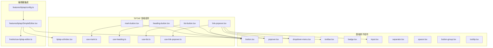
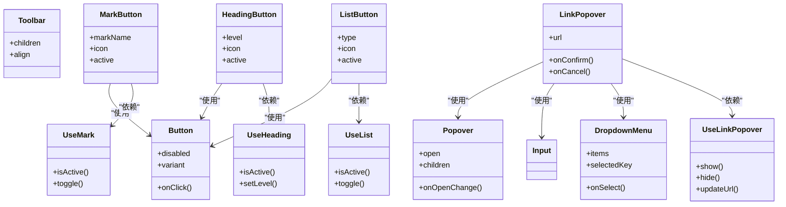
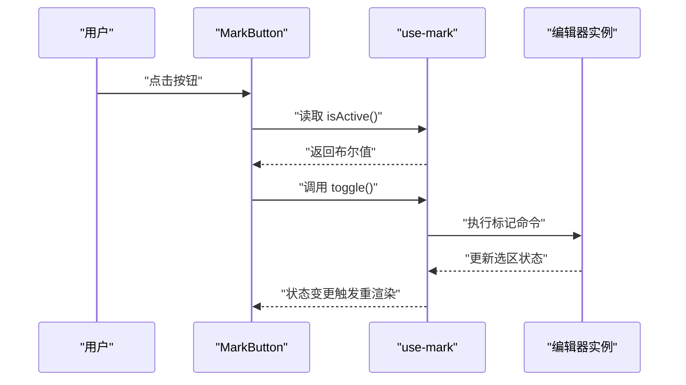
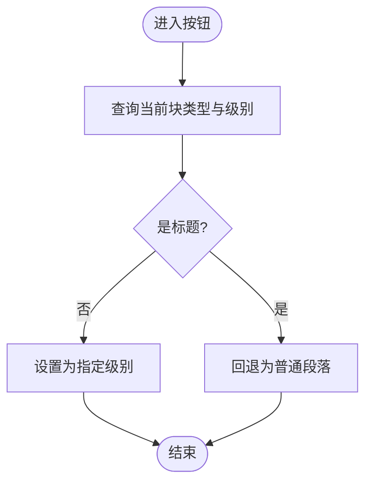
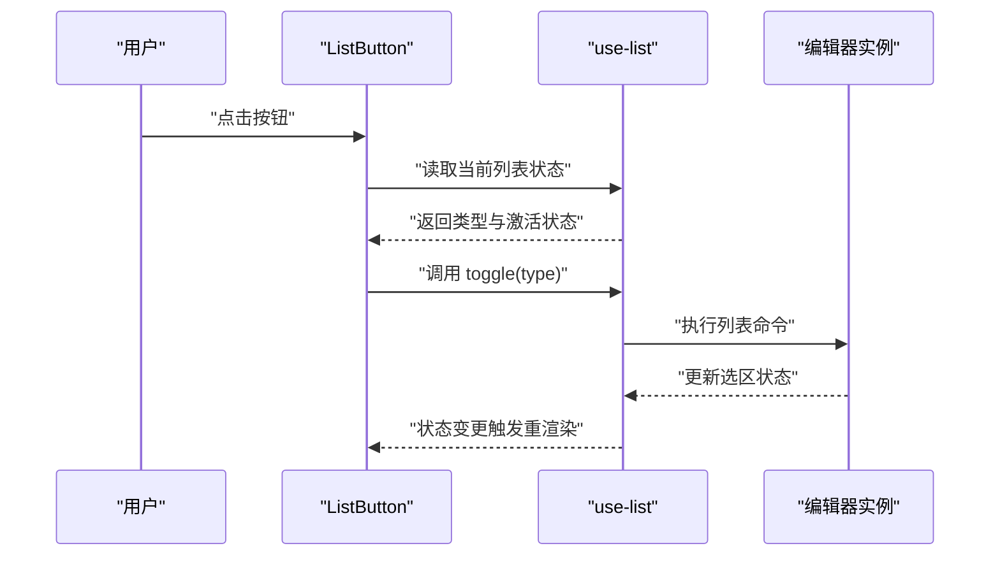
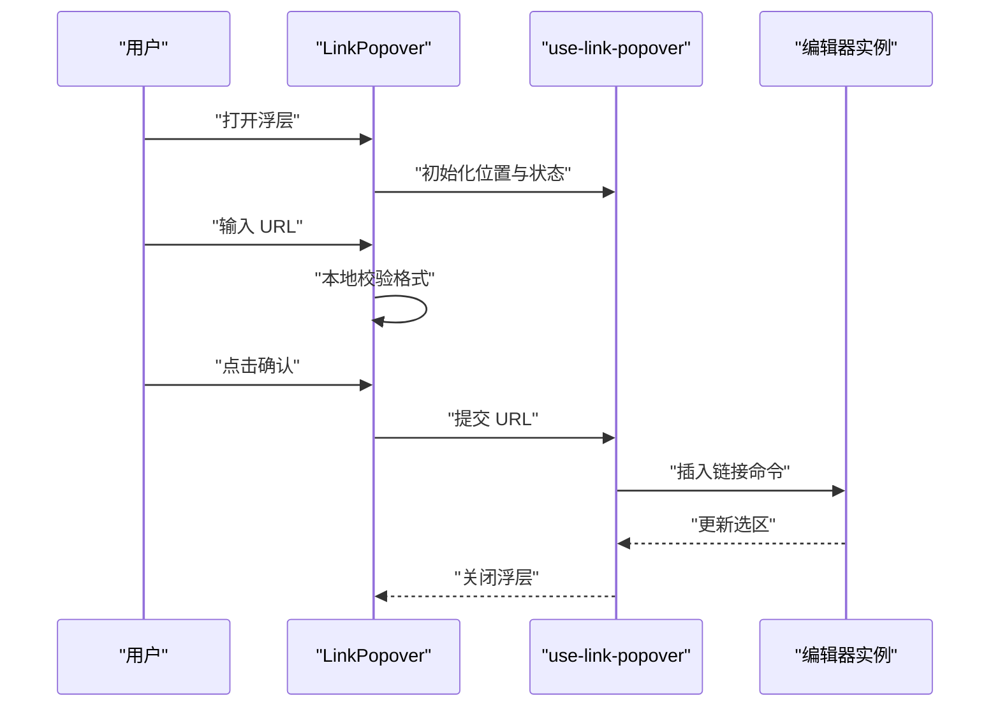
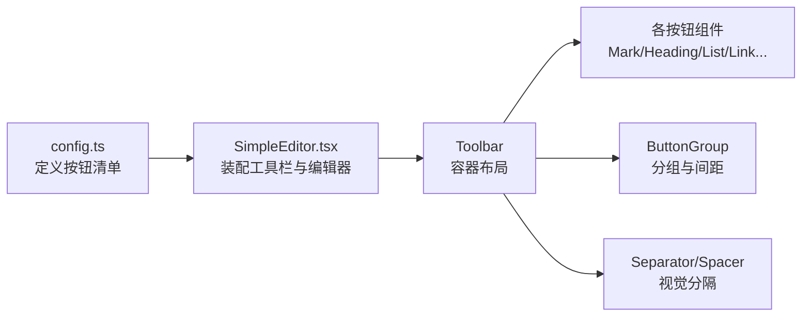
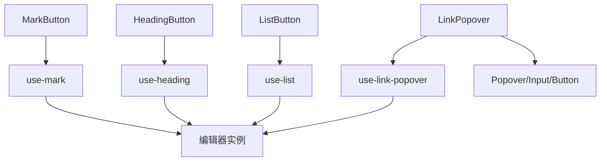

# UI 组件库

<cite>
**本文引用的文件**   
- [src/components/tiptap-ui/index.tsx](file://src/components/tiptap-ui/index.tsx)
- [src/components/tiptap-ui/mark-button.tsx](file://src/components/tiptap-ui/mark-button.tsx)
- [src/components/tiptap-ui/heading-button.tsx](file://src/components/tiptap-ui/heading-button.tsx)
- [src/components/tiptap-ui/list-button.tsx](file://src/components/tiptap-ui/list-button.tsx)
- [src/components/tiptap-ui/link-popover.tsx](file://src/components/tiptap-ui/link-popover.tsx)
- [src/components/tiptap-ui/use-link-popover.ts](file://src/components/tiptap-ui/use-link-popover.ts)
- [src/components/tiptap-ui/use-mark.ts](file://src/components/tiptap-ui/use-mark.ts)
- [src/components/tiptap-ui/use-heading.ts](file://src/components/tiptap-ui/use-heading.ts)
- [src/components/tiptap-ui/use-list.ts](file://src/components/tiptap-ui/use-list.ts)
- [src/components/tiptap-ui-primitive/button.tsx](file://src/components/tiptap-ui-primitive/button.tsx)
- [src/components/tiptap-ui-primitive/popover.tsx](file://src/components/tiptap-ui-primitive/popover.tsx)
- [src/components/tiptap-ui-primitive/dropdown-menu.tsx](file://src/components/tiptap-ui-primitive/dropdown-menu.tsx)
- [src/components/tiptap-ui-primitive/toolbar.tsx](file://src/components/tiptap-ui-primitive/toolbar.tsx)
- [src/components/tiptap-ui-primitive/badge.tsx](file://src/components/tiptap-ui-primitive/badge.tsx)
- [src/components/tiptap-ui-primitive/input.tsx](file://src/components/tiptap-ui-primitive/input.tsx)
- [src/components/tiptap-ui-primitive/spacer.tsx](file://src/components/tiptap-ui-primitive/spacer.tsx)
- [src/components/tiptap-ui-primitive/separator.tsx](file://src/components/tiptap-ui-primitive/separator.tsx)
- [src/components/tiptap-ui-primitive/button-group.tsx](file://src/components/tiptap-ui-primitive/button-group.tsx)
- [src/components/tiptap-ui-primitive/tooltip.tsx](file://src/components/tiptap-ui-primitive/tooltip.tsx)
- [src/components/tiptap-ui-primitive/index.tsx](file://src/components/tiptap-ui-primitive/index.tsx)
- [src/features/tiptap/config.ts](file://src/features/tiptap/config.ts)
- [src/features/tiptap/SimpleEditor.tsx](file://src/features/tiptap/SimpleEditor.tsx)
- [src/hooks/use-tiptap-editor.ts](file://src/hooks/use-tiptap-editor.ts)
</cite>

## 目录
1. [简介](#简介)
2. [项目结构](#项目结构)
3. [核心组件](#核心组件)
4. [架构总览](#架构总览)
5. [详细组件分析](#详细组件分析)
6. [依赖分析](#依赖分析)
7. [性能考虑](#性能考虑)
8. [故障排查指南](#故障排查指南)
9. [结论](#结论)
10. [附录](#附录)

## 简介
本技术文档面向 TipTap UI 组件库，聚焦于编辑器工具栏与交互组件的架构、分层与复用策略。文档覆盖：
- 组件分层结构与复用策略（基础原子组件 → 领域按钮 → 弹出菜单 → 工具栏装配）
- 各类按钮组件实现要点（mark-button、heading-button、list-button）
- 弹出菜单 link-popover 的交互逻辑与状态管理
- 工具栏的组织结构与配置方法
- 主题定制与样式覆盖方式
- 测试策略与性能优化技巧

## 项目结构
TipTap UI 采用“基础原子组件 + 业务按钮 + 弹出菜单 + 工具栏装配”的分层组织方式：
- tiptap-ui-primitive：基础原子组件（按钮、弹出框、下拉菜单、输入、分隔符、间距、徽章等），提供通用 UI 能力
- tiptap-ui：基于 TiPTAP 编辑器的领域按钮与弹出菜单（如 mark、heading、list、link-popover 等），封装编辑器命令与状态
- features/tiptap：编辑器集成示例与配置入口，展示如何组合工具栏与内容区

图表来源
- [src/components/tiptap-ui-primitive/button.tsx](file://src/components/tiptap-ui-primitive/button.tsx)
- [src/components/tiptap-ui-primitive/popover.tsx](file://src/components/tiptap-ui-primitive/popover.tsx)
- [src/components/tiptap-ui-primitive/dropdown-menu.tsx](file://src/components/tiptap-ui-primitive/dropdown-menu.tsx)
- [src/components/tiptap-ui-primitive/toolbar.tsx](file://src/components/tiptap-ui-primitive/toolbar.tsx)
- [src/components/tiptap-ui-primitive/badge.tsx](file://src/components/tiptap-ui-primitive/badge.tsx)
- [src/components/tiptap-ui-primitive/input.tsx](file://src/components/tiptap-ui-primitive/input.tsx)
- [src/components/tiptap-ui-primitive/separator.tsx](file://src/components/tiptap-ui-primitive/separator.tsx)
- [src/components/tiptap-ui-primitive/spacer.tsx](file://src/components/tiptap-ui-primitive/spacer.tsx)
- [src/components/tiptap-ui-primitive/button-group.tsx](file://src/components/tiptap-ui-primitive/button-group.tsx)
- [src/components/tiptap-ui-primitive/tooltip.tsx](file://src/components/tiptap-ui-primitive/tooltip.tsx)
- [src/components/tiptap-ui/index.tsx](file://src/components/tiptap-ui/index.tsx)
- [src/components/tiptap-ui/mark-button.tsx](file://src/components/tiptap-ui/mark-button.tsx)
- [src/components/tiptap-ui/heading-button.tsx](file://src/components/tiptap-ui/heading-button.tsx)
- [src/components/tiptap-ui/list-button.tsx](file://src/components/tiptap-ui/list-button.tsx)
- [src/components/tiptap-ui/link-popover.tsx](file://src/components/tiptap-ui/link-popover.tsx)
- [src/components/tiptap-ui/use-mark.ts](file://src/components/tiptap-ui/use-mark.ts)
- [src/components/tiptap-ui/use-heading.ts](file://src/components/tiptap-ui/use-heading.ts)
- [src/components/tiptap-ui/use-list.ts](file://src/components/tiptap-ui/use-list.ts)
- [src/components/tiptap-ui/use-link-popover.ts](file://src/components/tiptap-ui/use-link-popover.ts)
- [src/features/tiptap/config.ts](file://src/features/tiptap/config.ts)
- [src/features/tiptap/SimpleEditor.tsx](file://src/features/tiptap/SimpleEditor.tsx)
- [src/hooks/use-tiptap-editor.ts](file://src/hooks/use-tiptap-editor.ts)

章节来源
- [src/components/tiptap-ui/index.tsx](file://src/components/tiptap-ui/index.tsx)
- [src/components/tiptap-ui-primitive/index.tsx](file://src/components/tiptap-ui-primitive/index.tsx)
- [src/features/tiptap/config.ts](file://src/features/tiptap/config.ts)
- [src/features/tiptap/SimpleEditor.tsx](file://src/features/tiptap/SimpleEditor.tsx)
- [src/hooks/use-tiptap-editor.ts](file://src/hooks/use-tiptap-editor.ts)

## 核心组件
- 基础原子组件（tiptap-ui-primitive）
  - button：可点击控件，支持图标、禁用态、尺寸、颜色变体等
  - popover：浮层容器，用于承载复杂交互面板
  - dropdown-menu：下拉菜单项集合，支持键盘导航与选中态
  - toolbar：工具栏布局容器，负责排列与对齐
  - badge：标签/徽标，常用于状态或计数
  - input：文本输入控件，用于链接地址、占位符等
  - separator/spacer：分割线与间距，提升工具栏可读性
  - button-group：按钮分组，统一内边距与边框合并
  - tooltip：提示气泡，增强可访问性与引导
- 领域按钮（tiptap-ui）
  - mark-button：对选中文本应用标记（加粗、斜体、删除线等）
  - heading-button：切换段落标题级别
  - list-button：切换有序/无序列表或任务列表
  - link-popover：在选区上显示链接编辑浮层，包含输入与确认操作
- 状态钩子（tiptap-ui）
  - use-mark / use-heading / use-list / use-link-popover：封装编辑器状态查询与命令执行

章节来源
- [src/components/tiptap-ui-primitive/button.tsx](file://src/components/tiptap-ui-primitive/button.tsx)
- [src/components/tiptap-ui-primitive/popover.tsx](file://src/components/tiptap-ui-primitive/popover.tsx)
- [src/components/tiptap-ui-primitive/dropdown-menu.tsx](file://src/components/tiptap-ui-primitive/dropdown-menu.tsx)
- [src/components/tiptap-ui-primitive/toolbar.tsx](file://src/components/tiptap-ui-primitive/toolbar.tsx)
- [src/components/tiptap-ui-primitive/badge.tsx](file://src/components/tiptap-ui-primitive/badge.tsx)
- [src/components/tiptap-ui-primitive/input.tsx](file://src/components/tiptap-ui-primitive/input.tsx)
- [src/components/tiptap-ui-primitive/separator.tsx](file://src/components/tiptap-ui-primitive/separator.tsx)
- [src/components/tiptap-ui-primitive/spacer.tsx](file://src/components/tiptap-ui-primitive/spacer.tsx)
- [src/components/tiptap-ui-primitive/button-group.tsx](file://src/components/tiptap-ui-primitive/button-group.tsx)
- [src/components/tiptap-ui-primitive/tooltip.tsx](file://src/components/tiptap-ui-primitive/tooltip.tsx)
- [src/components/tiptap-ui/mark-button.tsx](file://src/components/tiptap-ui/mark-button.tsx)
- [src/components/tiptap-ui/heading-button.tsx](file://src/components/tiptap-ui/heading-button.tsx)
- [src/components/tiptap-ui/list-button.tsx](file://src/components/tiptap-ui/list-button.tsx)
- [src/components/tiptap-ui/link-popover.tsx](file://src/components/tiptap-ui/link-popover.tsx)
- [src/components/tiptap-ui/use-mark.ts](file://src/components/tiptap-ui/use-mark.ts)
- [src/components/tiptap-ui/use-heading.ts](file://src/components/tiptap-ui/use-heading.ts)
- [src/components/tiptap-ui/use-list.ts](file://src/components/tiptap-ui/use-list.ts)
- [src/components/tiptap-ui/use-link-popover.ts](file://src/components/tiptap-ui/use-link-popover.ts)

## 架构总览
TipTap UI 遵循“低耦合、高内聚”的分层设计：
- 原子层（primitive）：纯 UI 能力，不感知编辑器
- 领域层（tiptap-ui）：围绕 TiPTAP 的命令与状态，组合原子组件形成按钮与弹出菜单
- 集成层（features/tiptap）：将工具栏与编辑器实例装配在一起，暴露配置化接口

图表来源
- [src/components/tiptap-ui-primitive/button.tsx](file://src/components/tiptap-ui-primitive/button.tsx)
- [src/components/tiptap-ui-primitive/popover.tsx](file://src/components/tiptap-ui-primitive/popover.tsx)
- [src/components/tiptap-ui-primitive/dropdown-menu.tsx](file://src/components/tiptap-ui-primitive/dropdown-menu.tsx)
- [src/components/tiptap-ui-primitive/toolbar.tsx](file://src/components/tiptap-ui-primitive/toolbar.tsx)
- [src/components/tiptap-ui/mark-button.tsx](file://src/components/tiptap-ui/mark-button.tsx)
- [src/components/tiptap-ui/heading-button.tsx](file://src/components/tiptap-ui/heading-button.tsx)
- [src/components/tiptap-ui/list-button.tsx](file://src/components/tiptap-ui/list-button.tsx)
- [src/components/tiptap-ui/link-popover.tsx](file://src/components/tiptap-ui/link-popover.tsx)
- [src/components/tiptap-ui/use-mark.ts](file://src/components/tiptap-ui/use-mark.ts)
- [src/components/tiptap-ui/use-heading.ts](file://src/components/tiptap-ui/use-heading.ts)
- [src/components/tiptap-ui/use-list.ts](file://src/components/tiptap-ui/use-list.ts)
- [src/components/tiptap-ui/use-link-popover.ts](file://src/components/tiptap-ui/use-link-popover.ts)

## 详细组件分析

### 标记类按钮（mark-button）
- 职责：对当前选区应用/取消文本标记（如加粗、斜体、下划线、删除线等）
- 状态来源：通过 use-mark 获取当前标记是否激活
- 交互流程：点击触发 toggle；根据 active 更新按钮选中态
- 可访问性：配合 tooltip 显示快捷键或说明；支持键盘焦点与 Enter/Space 触发

图表来源
- [src/components/tiptap-ui/mark-button.tsx](file://src/components/tiptap-ui/mark-button.tsx)
- [src/components/tiptap-ui/use-mark.ts](file://src/components/tiptap-ui/use-mark.ts)
- [src/components/tiptap-ui-primitive/button.tsx](file://src/components/tiptap-ui-primitive/button.tsx)
- [src/components/tiptap-ui-primitive/tooltip.tsx](file://src/components/tiptap-ui-primitive/tooltip.tsx)

章节来源
- [src/components/tiptap-ui/mark-button.tsx](file://src/components/tiptap-ui/mark-button.tsx)
- [src/components/tiptap-ui/use-mark.ts](file://src/components/tiptap-ui/use-mark.ts)
- [src/components/tiptap-ui-primitive/button.tsx](file://src/components/tiptap-ui-primitive/button.tsx)
- [src/components/tiptap-ui-primitive/tooltip.tsx](file://src/components/tiptap-ui-primitive/tooltip.tsx)

### 标题按钮（heading-button）
- 职责：切换当前段落的标题级别（H1-H6）
- 状态来源：通过 use-heading 判断当前块级节点是否为标题及级别
- 交互流程：点击设置对应级别；若已是该级别则回退为普通段落
- 组合模式：常与下拉菜单联动，快速选择目标级别

图表来源
- [src/components/tiptap-ui/heading-button.tsx](file://src/components/tiptap-ui/heading-button.tsx)
- [src/components/tiptap-ui/use-heading.ts](file://src/components/tiptap-ui/use-heading.ts)

章节来源
- [src/components/tiptap-ui/heading-button.tsx](file://src/components/tiptap-ui/heading-button.tsx)
- [src/components/tiptap-ui/use-heading.ts](file://src/components/tiptap-ui/use-heading.ts)

### 列表按钮（list-button）
- 职责：切换有序/无序列表或任务列表
- 状态来源：通过 use-list 判断当前选区是否在列表中以及类型
- 交互流程：点击切换列表类型；若已在同类型列表则退出列表
- 扩展点：可通过下拉菜单展示更多列表选项

图表来源
- [src/components/tiptap-ui/list-button.tsx](file://src/components/tiptap-ui/list-button.tsx)
- [src/components/tiptap-ui/use-list.ts](file://src/components/tiptap-ui/use-list.ts)

章节来源
- [src/components/tiptap-ui/list-button.tsx](file://src/components/tiptap-ui/list-button.tsx)
- [src/components/tiptap-ui/use-list.ts](file://src/components/tiptap-ui/use-list.ts)

### 链接弹出菜单（link-popover）
- 职责：在选区上显示链接编辑浮层，支持输入 URL、确认插入、取消关闭
- 状态管理：
  - 打开/关闭：由外部控制或点击空白区域关闭
  - URL 输入：受控输入，实时校验
  - 确认：调用编辑器插入链接命令并关闭浮层
- 交互时序：

图表来源
- [src/components/tiptap-ui/link-popover.tsx](file://src/components/tiptap-ui/link-popover.tsx)
- [src/components/tiptap-ui/use-link-popover.ts](file://src/components/tiptap-ui/use-link-popover.ts)
- [src/components/tiptap-ui-primitive/popover.tsx](file://src/components/tiptap-ui-primitive/popover.tsx)
- [src/components/tiptap-ui-primitive/input.tsx](file://src/components/tiptap-ui-primitive/input.tsx)
- [src/components/tiptap-ui-primitive/button.tsx](file://src/components/tiptap-ui-primitive/button.tsx)

章节来源
- [src/components/tiptap-ui/link-popover.tsx](file://src/components/tiptap-ui/link-popover.tsx)
- [src/components/tiptap-ui/use-link-popover.ts](file://src/components/tiptap-ui/use-link-popover.ts)
- [src/components/tiptap-ui-primitive/popover.tsx](file://src/components/tiptap-ui-primitive/popover.tsx)
- [src/components/tiptap-ui-primitive/input.tsx](file://src/components/tiptap-ui-primitive/input.tsx)
- [src/components/tiptap-ui-primitive/button.tsx](file://src/components/tiptap-ui-primitive/button.tsx)

### 工具栏（Toolbar）组织与配置
- 组织结构：以 toolbar 作为容器，内部按功能分组（文本样式、段落结构、列表、链接等），使用 separator 与 spacer 划分区域
- 配置方法：
  - 通过 features/tiptap/config 定义可用按钮集合与顺序
  - SimpleEditor 组装工具栏与编辑器实例，注入 hooks 提供的编辑器上下文
- 推荐实践：
  - 将常用操作置于首行，次要操作放入下拉菜单
  - 使用 button-group 合并相邻按钮，减少视觉噪音
  - 为每个按钮提供 tooltip 与 aria-label，提升可访问性

图表来源
- [src/features/tiptap/config.ts](file://src/features/tiptap/config.ts)
- [src/features/tiptap/SimpleEditor.tsx](file://src/features/tiptap/SimpleEditor.tsx)
- [src/components/tiptap-ui-primitive/toolbar.tsx](file://src/components/tiptap-ui-primitive/toolbar.tsx)
- [src/components/tiptap-ui-primitive/button-group.tsx](file://src/components/tiptap-ui-primitive/button-group.tsx)
- [src/components/tiptap-ui-primitive/separator.tsx](file://src/components/tiptap-ui-primitive/separator.tsx)
- [src/components/tiptap-ui-primitive/spacer.tsx](file://src/components/tiptap-ui-primitive/spacer.tsx)

章节来源
- [src/features/tiptap/config.ts](file://src/features/tiptap/config.ts)
- [src/features/tiptap/SimpleEditor.tsx](file://src/features/tiptap/SimpleEditor.tsx)
- [src/components/tiptap-ui-primitive/toolbar.tsx](file://src/components/tiptap-ui-primitive/toolbar.tsx)
- [src/components/tiptap-ui-primitive/button-group.tsx](file://src/components/tiptap-ui-primitive/button-group.tsx)
- [src/components/tiptap-ui-primitive/separator.tsx](file://src/components/tiptap-ui-primitive/separator.tsx)
- [src/components/tiptap-ui-primitive/spacer.tsx](file://src/components/tiptap-ui-primitive/spacer.tsx)

## 依赖分析
- 组件间依赖关系
  - 领域按钮依赖对应的 use-* 钩子，钩子再与编辑器实例交互
  - 弹出菜单依赖 popover、input、button 等原子组件
  - 工具栏聚合所有按钮与分组、分隔元素
- 外部依赖
  - TiPTAP 编辑器实例通过 hooks/use-tiptap-editor 注入到组件树
- 潜在循环依赖
  - 避免在 use-* 钩子中直接引入具体按钮组件，保持单向依赖：按钮 → 钩子 → 编辑器

图表来源
- [src/components/tiptap-ui/mark-button.tsx](file://src/components/tiptap-ui/mark-button.tsx)
- [src/components/tiptap-ui/heading-button.tsx](file://src/components/tiptap-ui/heading-button.tsx)
- [src/components/tiptap-ui/list-button.tsx](file://src/components/tiptap-ui/list-button.tsx)
- [src/components/tiptap-ui/link-popover.tsx](file://src/components/tiptap-ui/link-popover.tsx)
- [src/components/tiptap-ui/use-mark.ts](file://src/components/tiptap-ui/use-mark.ts)
- [src/components/tiptap-ui/use-heading.ts](file://src/components/tiptap-ui/use-heading.ts)
- [src/components/tiptap-ui/use-list.ts](file://src/components/tiptap-ui/use-list.ts)
- [src/components/tiptap-ui/use-link-popover.ts](file://src/components/tiptap-ui/use-link-popover.ts)
- [src/hooks/use-tiptap-editor.ts](file://src/hooks/use-tiptap-editor.ts)
- [src/components/tiptap-ui-primitive/popover.tsx](file://src/components/tiptap-ui-primitive/popover.tsx)
- [src/components/tiptap-ui-primitive/input.tsx](file://src/components/tiptap-ui-primitive/input.tsx)
- [src/components/tiptap-ui-primitive/button.tsx](file://src/components/tiptap-ui-primitive/button.tsx)

章节来源
- [src/hooks/use-tiptap-editor.ts](file://src/hooks/use-tiptap-editor.ts)
- [src/components/tiptap-ui-primitive/index.tsx](file://src/components/tiptap-ui-primitive/index.tsx)
- [src/components/tiptap-ui/index.tsx](file://src/components/tiptap-ui/index.tsx)

## 性能考虑
- 状态最小化
  - 仅在必要处订阅编辑器状态，避免全量重渲染
  - 使用 memo 包裹按钮与弹出菜单，减少无关更新
- 事件节流与防抖
  - 对频繁触发的输入（如链接 URL 校验）进行节流/防抖
- 懒加载与按需渲染
  - 弹出菜单默认隐藏，仅当需要时挂载 DOM
- 批量命令
  - 多个编辑操作尽量合并为一次事务，减少重排与重绘
- 资源优化
  - 图标与样式按需引入，避免打包体积膨胀

[本节为通用指导，无需源码引用]

## 故障排查指南
- 常见问题
  - 按钮无响应：检查是否正确传入编辑器实例与选区
  - 弹出菜单位置异常：确认父容器定位上下文与滚动容器
  - 链接无效：校验 URL 格式与协议白名单
- 调试建议
  - 打印 use-* 钩子的状态变化，定位状态不同步问题
  - 使用浏览器开发者工具观察 DOM 层级与事件冒泡
  - 为关键路径添加日志，记录命令执行前后状态差异

章节来源
- [src/components/tiptap-ui/use-link-popover.ts](file://src/components/tiptap-ui/use-link-popover.ts)
- [src/components/tiptap-ui/use-mark.ts](file://src/components/tiptap-ui/use-mark.ts)
- [src/components/tiptap-ui/use-heading.ts](file://src/components/tiptap-ui/use-heading.ts)
- [src/components/tiptap-ui/use-list.ts](file://src/components/tiptap-ui/use-list.ts)

## 结论
TipTap UI 通过清晰的分层与稳定的原子组件，实现了可扩展的工具栏与弹出菜单体系。领域按钮与状态钩子解耦了 UI 与编辑器逻辑，便于主题定制与二次开发。结合合理的测试策略与性能优化手段，可在保证用户体验的同时提升可维护性。

[本节为总结，无需源码引用]

## 附录

### 主题定制与样式覆盖
- 变量与 CSS 自定义属性
  - 在根样式文件中定义颜色、字号、圆角等变量，供原子组件消费
- 组件样式覆盖
  - 通过 className 覆盖原子组件样式，或使用 CSS 作用域隔离
- 主题开关
  - 在 SimpleEditor 或外层容器切换主题类名，驱动全局样式变化

章节来源
- [src/components/tiptap-ui-primitive/button.scss](file://src/components/tiptap-ui-primitive/button.scss)
- [src/components/tiptap-ui-primitive/popover.scss](file://src/components/tiptap-ui-primitive/popover.scss)
- [src/components/tiptap-ui-primitive/dropdown-menu.scss](file://src/components/tiptap-ui-primitive/dropdown-menu.scss)
- [src/components/tiptap-ui-primitive/toolbar.scss](file://src/components/tiptap-ui-primitive/toolbar.scss)
- [src/components/tiptap-ui-primitive/badge-colors.scss](file://src/components/tiptap-ui-primitive/badge-colors.scss)
- [src/components/tiptap-ui-primitive/button-colors.scss](file://src/components/tiptap-ui-primitive/button-colors.scss)
- [src/components/tiptap-ui-primitive/badge-group.scss](file://src/components/tiptap-ui-primitive/badge-group.scss)
- [src/components/tiptap-ui-primitive/button-group.scss](file://src/components/tiptap-ui-primitive/button-group.scss)
- [src/components/tiptap-ui-primitive/input.scss](file://src/components/tiptap-ui-primitive/input.scss)
- [src/components/tiptap-ui-primitive/separator.scss](file://src/components/tiptap-ui-primitive/separator.scss)
- [src/components/tiptap-ui-primitive/tooltip.scss](file://src/components/tiptap-ui-primitive/tooltip.scss)
- [src/components/tiptap-ui/color-highlight-button.scss](file://src/components/tiptap-ui/color-highlight-button.scss)
- [src/components/tiptap-ui/link-popover.scss](file://src/components/tiptap-ui/link-popover.scss)

### 组件测试策略
- 单元测试
  - 针对 use-* 钩子编写断言，验证状态计算与命令调用
  - 对按钮点击行为与 active 状态进行快照或行为断言
- 集成测试
  - 模拟编辑器实例，端到端验证工具栏与弹出菜单的交互流程
- 可访问性测试
  - 检查键盘导航、焦点管理与语义标签是否符合规范

章节来源
- [src/components/tiptap-ui/use-mark.ts](file://src/components/tiptap-ui/use-mark.ts)
- [src/components/tiptap-ui/use-heading.ts](file://src/components/tiptap-ui/use-heading.ts)
- [src/components/tiptap-ui/use-list.ts](file://src/components/tiptap-ui/use-list.ts)
- [src/components/tiptap-ui/use-link-popover.ts](file://src/components/tiptap-ui/use-link-popover.ts)
- [src/components/tiptap-ui/mark-button.tsx](file://src/components/tiptap-ui/mark-button.tsx)
- [src/components/tiptap-ui/heading-button.tsx](file://src/components/tiptap-ui/heading-button.tsx)
- [src/components/tiptap-ui/list-button.tsx](file://src/components/tiptap-ui/list-button.tsx)
- [src/components/tiptap-ui/link-popover.tsx](file://src/components/tiptap-ui/link-popover.tsx)