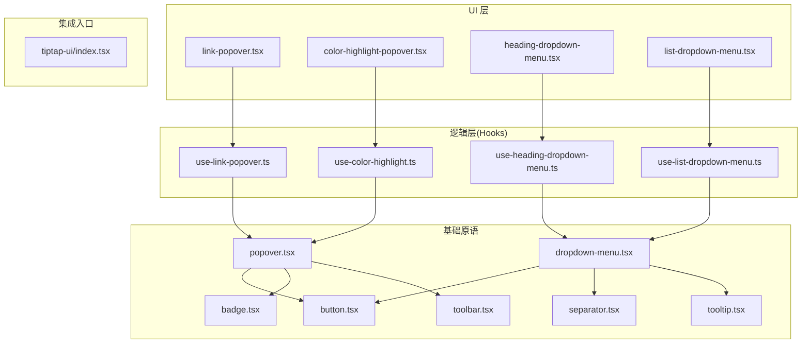
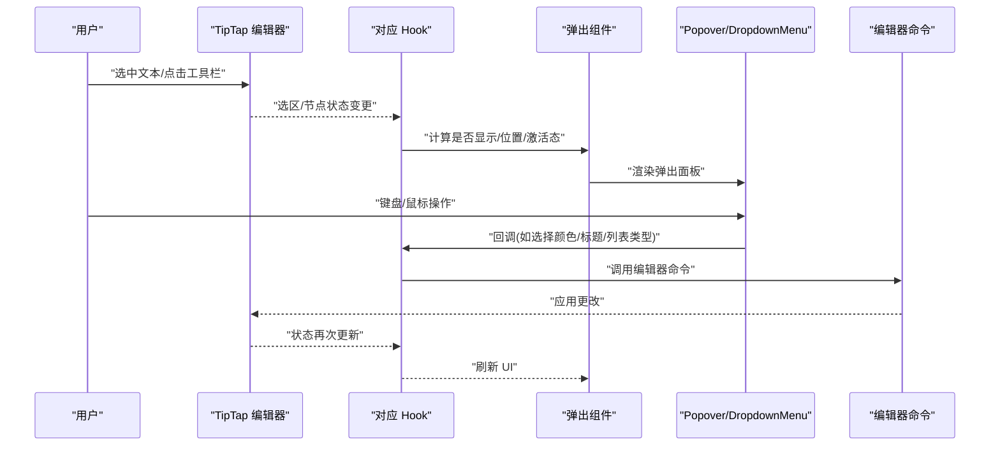
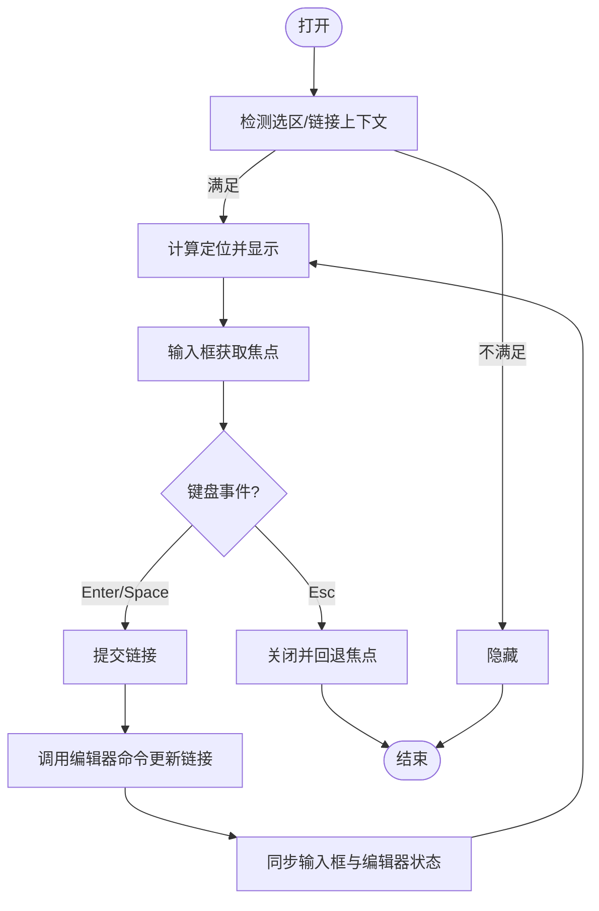
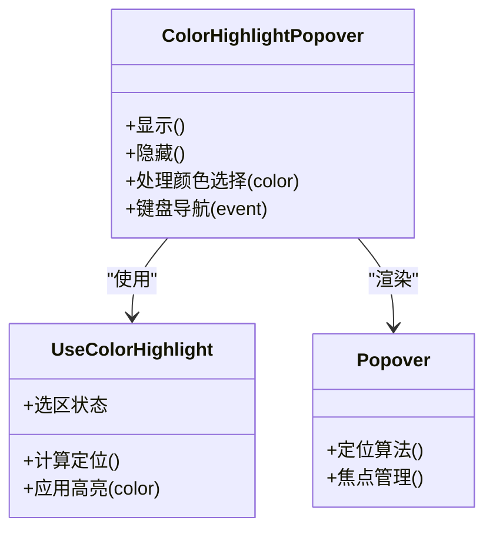
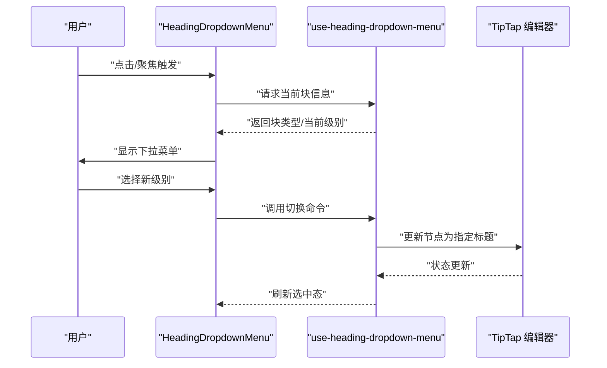
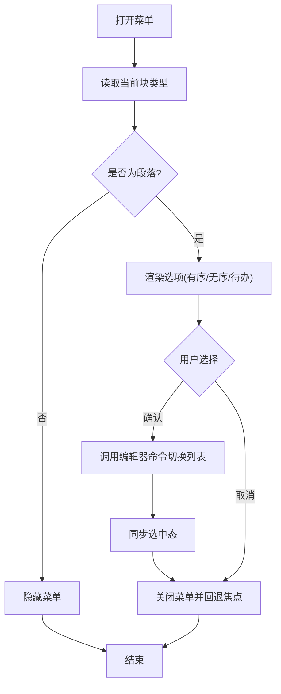
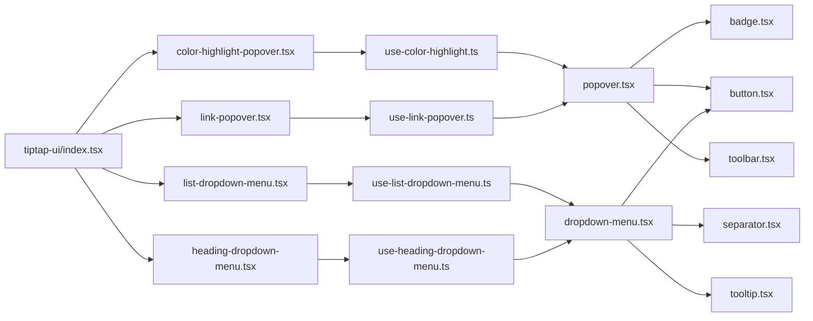

# 交互式弹出组件

<cite>
**本文引用的文件**   
- [link-popover.tsx](file://src/components/tiptap-ui/link-popover.tsx)
- [link-popover.scss](file://src/components/tiptap-ui/link-popover.scss)
- [use-link-popover.ts](file://src/components/tiptap-ui/use-link-popover.ts)
- [color-highlight-popover.tsx](file://src/components/tiptap-ui/color-highlight-popover.tsx)
- [color-highlight-button.tsx](file://src/components/tiptap-ui/color-highlight-button.tsx)
- [use-color-highlight.ts](file://src/components/tiptap-ui/use-color-highlight.ts)
- [heading-dropdown-menu.tsx](file://src/components/tiptap-ui/heading-dropdown-menu.tsx)
- [use-heading-dropdown-menu.ts](file://src/components/tiptap-ui/use-heading-dropdown-menu.ts)
- [list-dropdown-menu.tsx](file://src/components/tiptap-ui/list-dropdown-menu.tsx)
- [use-list-dropdown-menu.ts](file://src/components/tiptap-ui/use-list-dropdown-menu.ts)
- [popover.tsx](file://src/components/tiptap-ui-primitive/popover.tsx)
- [dropdown-menu.tsx](file://src/components/tiptap-ui-primitive/dropdown-menu.tsx)
- [button.tsx](file://src/components/tiptap-ui-primitive/button.tsx)
- [badge.tsx](file://src/components/tiptap-ui-primitive/badge.tsx)
- [toolbar.tsx](file://src/components/tiptap-ui-primitive/toolbar.tsx)
- [separator.tsx](file://src/components/tiptap-ui-primitive/separator.tsx)
- [tooltip.tsx](file://src/components/tiptap-ui-primitive/tooltip.tsx)
- [index.tsx](file://src/components/tiptap-ui/index.tsx)
- [tiptap.css](file://src/features/tiptap/tiptap.css)
</cite>

## 目录
1. [简介](#简介)
2. [项目结构](#项目结构)
3. [核心组件](#核心组件)
4. [架构总览](#架构总览)
5. [详细组件分析](#详细组件分析)
6. [依赖关系分析](#依赖关系分析)
7. [性能考虑](#性能考虑)
8. [故障排查指南](#故障排查指南)
9. [结论](#结论)
10. [附录](#附录)

## 简介
本技术文档聚焦于编辑器工具栏中的四类交互式弹出组件：链接编辑（link-popover）、颜色高亮（color-highlight-popover）、标题下拉菜单（heading-dropdown-menu）与列表下拉菜单（list-dropdown-menu）。文档从系统架构、组件职责、定位算法、键盘导航与焦点管理、状态同步与数据绑定、扩展与样式定制、性能优化与用户体验改进等维度进行系统化说明，帮助读者快速理解并高效使用这些组件。

## 项目结构
上述四个弹出组件位于 tiptap-ui 层，基于 tiptap-ui-primitive 的基础 UI 原语构建，并通过 hooks 与 TipTap 编辑器实例交互，实现“选中内容 -> 弹出显示 -> 操作应用 -> 更新编辑器”的闭环。

图表来源
- [link-popover.tsx](file://src/components/tiptap-ui/link-popover.tsx)
- [color-highlight-popover.tsx](file://src/components/tiptap-ui/color-highlight-popover.tsx)
- [heading-dropdown-menu.tsx](file://src/components/tiptap-ui/heading-dropdown-menu.tsx)
- [list-dropdown-menu.tsx](file://src/components/tiptap-ui/list-dropdown-menu.tsx)
- [use-link-popover.ts](file://src/components/tiptap-ui/use-link-popover.ts)
- [use-color-highlight.ts](file://src/components/tiptap-ui/use-color-highlight.ts)
- [use-heading-dropdown-menu.ts](file://src/components/tiptap-ui/use-heading-dropdown-menu.ts)
- [use-list-dropdown-menu.ts](file://src/components/tiptap-ui/use-list-dropdown-menu.ts)
- [popover.tsx](file://src/components/tiptap-ui-primitive/popover.tsx)
- [dropdown-menu.tsx](file://src/components/tiptap-ui-primitive/dropdown-menu.tsx)
- [button.tsx](file://src/components/tiptap-ui-primitive/button.tsx)
- [badge.tsx](file://src/components/tiptap-ui-primitive/badge.tsx)
- [toolbar.tsx](file://src/components/tiptap-ui-primitive/toolbar.tsx)
- [separator.tsx](file://src/components/tiptap-ui-primitive/separator.tsx)
- [tooltip.tsx](file://src/components/tiptap-ui-primitive/tooltip.tsx)
- [index.tsx](file://src/components/tiptap-ui/index.tsx)

章节来源
- [index.tsx](file://src/components/tiptap-ui/index.tsx)

## 核心组件
- link-popover：在选中文本或链接时出现，提供 URL 输入、打开链接、移除链接等操作，支持键盘导航与焦点回退。
- color-highlight-popover：在选中文本时出现，提供色板选择以设置文本背景高亮，支持键盘导航与焦点回退。
- heading-dropdown-menu：在段落块上提供标题层级切换的下拉菜单，支持键盘导航与焦点回退。
- list-dropdown-menu：在段落块上提供有序/无序/待办列表切换的下拉菜单，支持键盘导航与焦点回退。

以上组件均通过对应 hook 与 TipTap 编辑器实例通信，读取当前选区/节点状态，执行命令后触发编辑器更新。

章节来源
- [link-popover.tsx](file://src/components/tiptap-ui/link-popover.tsx)
- [color-highlight-popover.tsx](file://src/components/tiptap-ui/color-highlight-popover.tsx)
- [heading-dropdown-menu.tsx](file://src/components/tiptap-ui/heading-dropdown-menu.tsx)
- [list-dropdown-menu.tsx](file://src/components/tiptap-ui/list-dropdown-menu.tsx)
- [use-link-popover.ts](file://src/components/tiptap-ui/use-link-popover.ts)
- [use-color-highlight.ts](file://src/components/tiptap-ui/use-color-highlight.ts)
- [use-heading-dropdown-menu.ts](file://src/components/tiptap-ui/use-heading-dropdown-menu.ts)
- [use-list-dropdown-menu.ts](file://src/components/tiptap-ui/use-list-dropdown-menu.ts)

## 架构总览
整体采用“视图 + Hook + 原语”的分层设计：
- 视图层：负责渲染弹出面板、按钮、菜单项等 UI。
- 逻辑层：封装与 TipTap 的交互（选区检测、命令调用、状态订阅），暴露给视图层使用。
- 原语层：提供可复用的 popover、dropdown-menu、button、badge、toolbar、separator、tooltip 等基础控件。

图表来源
- [use-link-popover.ts](file://src/components/tiptap-ui/use-link-popover.ts)
- [use-color-highlight.ts](file://src/components/tiptap-ui/use-color-highlight.ts)
- [use-heading-dropdown-menu.ts](file://src/components/tiptap-ui/use-heading-dropdown-menu.ts)
- [use-list-dropdown-menu.ts](file://src/components/tiptap-ui/use-list-dropdown-menu.ts)
- [popover.tsx](file://src/components/tiptap-ui-primitive/popover.tsx)
- [dropdown-menu.tsx](file://src/components/tiptap-ui-primitive/dropdown-menu.tsx)

## 详细组件分析

### 链接编辑弹出（link-popover）
- 触发条件：当存在文本选区且处于链接上下文时显示；也可由工具栏按钮触发。
- 主要功能：输入/编辑链接地址、打开链接、移除链接、根据当前选区自动填充值。
- 定位策略：优先锚定到选区矩形或光标位置，若溢出视口则翻转方向，确保完全可见。
- 键盘导航：Tab/Shift+Tab 在输入框与操作按钮间移动焦点；Enter/Space 确认；Esc 关闭并回退焦点。
- 焦点管理：打开前记录触发元素，关闭后将焦点安全回退；输入框获得初始焦点。
- 状态同步：监听编辑器选区与链接属性变化，保持输入框与编辑器状态一致。
- 数据绑定：双向绑定输入框与编辑器链接属性；提交时合并协议与校验 URL。
- 扩展方式：可替换内部输入/按钮为自定义组件；可通过 props 注入额外操作项。
- 样式定制：通过 SCSS 覆盖类名调整尺寸、阴影、圆角、间距等。

图表来源
- [link-popover.tsx](file://src/components/tiptap-ui/link-popover.tsx)
- [use-link-popover.ts](file://src/components/tiptap-ui/use-link-popover.ts)
- [popover.tsx](file://src/components/tiptap-ui-primitive/popover.tsx)

章节来源
- [link-popover.tsx](file://src/components/tiptap-ui/link-popover.tsx)
- [link-popover.scss](file://src/components/tiptap-ui/link-popover.scss)
- [use-link-popover.ts](file://src/components/tiptap-ui/use-link-popover.ts)
- [popover.tsx](file://src/components/tiptap-ui-primitive/popover.tsx)

### 颜色高亮弹出（color-highlight-popover）
- 触发条件：存在文本选区时显示。
- 主要功能：展示预设色板，点击后为选区文本设置背景高亮。
- 定位策略：同 link-popover，基于选区矩形计算最优位置，必要时翻转。
- 键盘导航：方向键在色板网格中移动焦点；Enter/Space 应用颜色；Esc 关闭。
- 焦点管理：打开前保存焦点，关闭后恢复；默认聚焦首个色板项。
- 状态同步：监听选区变化，仅在有效选区时显示；应用颜色后刷新 UI。
- 数据绑定：色板项与编辑器标记属性联动，避免重复设置相同颜色。
- 扩展方式：可动态加载更多颜色、分组展示、支持自定义色值输入。
- 样式定制：通过 SCSS 控制色板布局、选中态边框、悬停效果等。

图表来源
- [color-highlight-popover.tsx](file://src/components/tiptap-ui/color-highlight-popover.tsx)
- [use-color-highlight.ts](file://src/components/tiptap-ui/use-color-highlight.ts)
- [popover.tsx](file://src/components/tiptap-ui-primitive/popover.tsx)

章节来源
- [color-highlight-popover.tsx](file://src/components/tiptap-ui/color-highlight-popover.tsx)
- [color-highlight-button.tsx](file://src/components/tiptap-ui/color-highlight-button.tsx)
- [use-color-highlight.ts](file://src/components/tiptap-ui/use-color-highlight.ts)
- [popover.tsx](file://src/components/tiptap-ui-primitive/popover.tsx)

### 标题下拉菜单（heading-dropdown-menu）
- 触发条件：当前块级节点为段落时显示。
- 主要功能：切换标题层级（H1-H6），保持段落语义与样式一致。
- 定位策略：基于触发按钮或当前块边界计算位置，防止溢出。
- 键盘导航：上下方向键切换选项；Enter/Space 确认；Esc 关闭。
- 焦点管理：打开前记录焦点，关闭后回退至触发元素。
- 状态同步：监听当前块类型与标题级别，自动高亮已选项。
- 数据绑定：将选择的标题级别写入编辑器节点属性。
- 扩展方式：可新增自定义标题级别或组合样式。
- 样式定制：通过 SCSS 控制菜单宽度、选中指示器、分隔线等。

图表来源
- [heading-dropdown-menu.tsx](file://src/components/tiptap-ui/heading-dropdown-menu.tsx)
- [use-heading-dropdown-menu.ts](file://src/components/tiptap-ui/use-heading-dropdown-menu.ts)
- [dropdown-menu.tsx](file://src/components/tiptap-ui-primitive/dropdown-menu.tsx)

章节来源
- [heading-dropdown-menu.tsx](file://src/components/tiptap-ui/heading-dropdown-menu.tsx)
- [use-heading-dropdown-menu.ts](file://src/components/tiptap-ui/use-heading-dropdown-menu.ts)
- [dropdown-menu.tsx](file://src/components/tiptap-ui-primitive/dropdown-menu.tsx)

### 列表下拉菜单（list-dropdown-menu）
- 触发条件：当前块级节点为段落时显示。
- 主要功能：切换有序列表、无序列表、待办列表。
- 定位策略：基于触发元素计算位置，必要时翻转。
- 键盘导航：方向键在选项间移动；Enter/Space 确认；Esc 关闭。
- 焦点管理：打开前保存焦点，关闭后恢复。
- 状态同步：监听当前块的列表类型，自动高亮已选项。
- 数据绑定：将选择的列表类型应用到编辑器节点。
- 扩展方式：可新增自定义列表类型或嵌套规则。
- 样式定制：通过 SCSS 控制菜单项图标、间距、选中态等。

图表来源
- [list-dropdown-menu.tsx](file://src/components/tiptap-ui/list-dropdown-menu.tsx)
- [use-list-dropdown-menu.ts](file://src/components/tiptap-ui/use-list-dropdown-menu.ts)
- [dropdown-menu.tsx](file://src/components/tiptap-ui-primitive/dropdown-menu.tsx)

章节来源
- [list-dropdown-menu.tsx](file://src/components/tiptap-ui/list-dropdown-menu.tsx)
- [use-list-dropdown-menu.ts](file://src/components/tiptap-ui/use-list-dropdown-menu.ts)
- [dropdown-menu.tsx](file://src/components/tiptap-ui-primitive/dropdown-menu.tsx)

## 依赖关系分析
- 组件对 Hook 的依赖：每个弹出组件都依赖对应的 use-*-hook 来获取选区/节点状态、计算定位、执行命令。
- Hook 对原语的依赖：通过 popover 与 dropdown-menu 完成弹出容器与菜单渲染；button、badge、separator、tooltip 用于增强交互体验。
- 统一入口：tiptap-ui/index.tsx 聚合导出各组件与 Hook，便于上层集成。

图表来源
- [link-popover.tsx](file://src/components/tiptap-ui/link-popover.tsx)
- [color-highlight-popover.tsx](file://src/components/tiptap-ui/color-highlight-popover.tsx)
- [heading-dropdown-menu.tsx](file://src/components/tiptap-ui/heading-dropdown-menu.tsx)
- [list-dropdown-menu.tsx](file://src/components/tiptap-ui/list-dropdown-menu.tsx)
- [use-link-popover.ts](file://src/components/tiptap-ui/use-link-popover.ts)
- [use-color-highlight.ts](file://src/components/tiptap-ui/use-color-highlight.ts)
- [use-heading-dropdown-menu.ts](file://src/components/tiptap-ui/use-heading-dropdown-menu.ts)
- [use-list-dropdown-menu.ts](file://src/components/tiptap-ui/use-list-dropdown-menu.ts)
- [popover.tsx](file://src/components/tiptap-ui-primitive/popover.tsx)
- [dropdown-menu.tsx](file://src/components/tiptap-ui-primitive/dropdown-menu.tsx)
- [button.tsx](file://src/components/tiptap-ui-primitive/button.tsx)
- [badge.tsx](file://src/components/tiptap-ui-primitive/badge.tsx)
- [toolbar.tsx](file://src/components/tiptap-ui-primitive/toolbar.tsx)
- [separator.tsx](file://src/components/tiptap-ui-primitive/separator.tsx)
- [tooltip.tsx](file://src/components/tiptap-ui-primitive/tooltip.tsx)
- [index.tsx](file://src/components/tiptap-ui/index.tsx)

章节来源
- [index.tsx](file://src/components/tiptap-ui/index.tsx)

## 性能考虑
- 定位计算节流：在滚动或窗口大小变化时，对定位计算进行节流或防抖，减少重排与重绘。
- 最小化重渲染：仅当必要状态（选区、节点类型、激活项）变化时更新弹出组件；利用 React 的 memo 与稳定引用降低开销。
- 事件去抖：对频繁触发的键盘/鼠标事件进行合理去抖，避免过多命令调用。
- 懒渲染：弹出面板在首次显示后再完整渲染子树，缩短首帧时间。
- 样式隔离：通过 CSS 变量与模块化样式减少全局污染，提升样式计算效率。
- 内存管理：组件卸载时清理事件监听与定时器，避免泄漏。

[本节为通用指导，无需具体文件来源]

## 故障排查指南
- 弹出未显示
  - 检查选区是否存在且符合触发条件（例如段落块、链接上下文）。
  - 确认 Hook 是否正确订阅编辑器状态变更。
- 定位异常
  - 检查父容器 overflow 与 z-index 设置；必要时调整定位容器的参考元素。
  - 验证翻转逻辑是否在极端视口下生效。
- 键盘导航失效
  - 确认菜单项具备正确的 tabindex 与 role 属性；检查 Enter/Space/Esc 事件绑定。
- 焦点丢失
  - 确保打开前记录触发元素，关闭后正确回退焦点；避免在异步回调中错误转移焦点。
- 状态不同步
  - 核对命令调用后的状态更新链路；确保输入框与编辑器属性保持一致。
- 样式冲突
  - 检查 tiptap.css 与组件 SCSS 的优先级；必要时提高选择器特异性或使用 CSS 变量覆盖。

章节来源
- [tiptap.css](file://src/features/tiptap/tiptap.css)
- [link-popover.scss](file://src/components/tiptap-ui/link-popover.scss)

## 结论
四类弹出组件通过清晰的分层设计与稳定的 Hook 抽象，实现了与 TipTap 编辑器的无缝集成。其定位算法兼顾可用性与健壮性，键盘导航与焦点管理遵循无障碍最佳实践。通过合理的扩展点与样式定制能力，开发者可在不侵入核心逻辑的前提下灵活定制行为与外观。结合性能优化建议，可在复杂场景下保持流畅的用户体验。

[本节为总结性内容，无需具体文件来源]

## 附录
- 常用扩展方法
  - 自定义弹出内容：在对应组件内替换子组件，或通过 props 注入自定义渲染函数。
  - 增加菜单项：在 dropdown-menu 中追加选项，并在 Hook 中实现相应命令分支。
  - 主题适配：通过 CSS 变量与 SCSS 覆盖默认样式，实现明暗主题切换。
- 无障碍要点
  - 为所有交互元素提供 aria-* 属性与键盘可达性。
  - 确保焦点顺序符合阅读顺序，并提供明确的关闭路径。

[本节为概念性内容，无需具体文件来源]