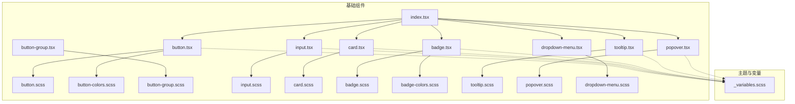
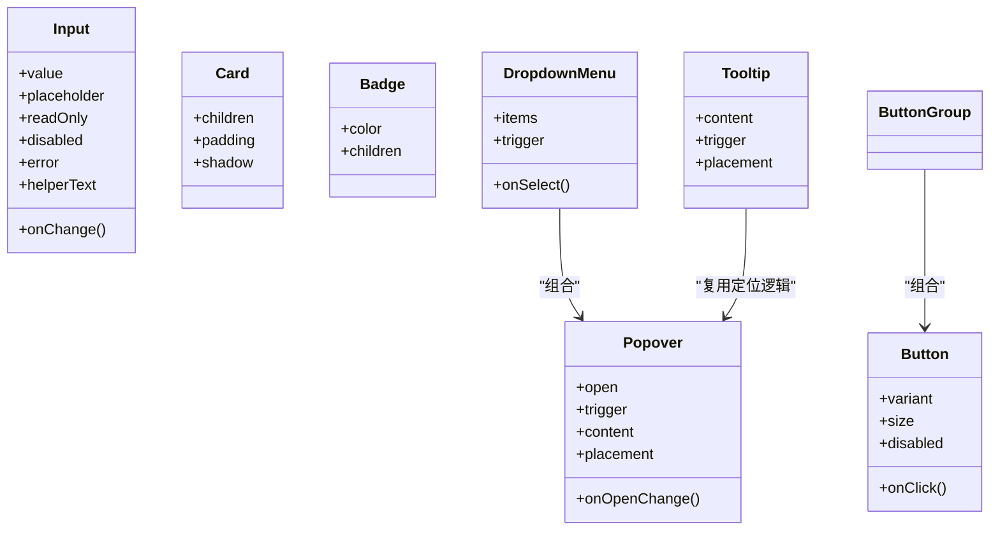
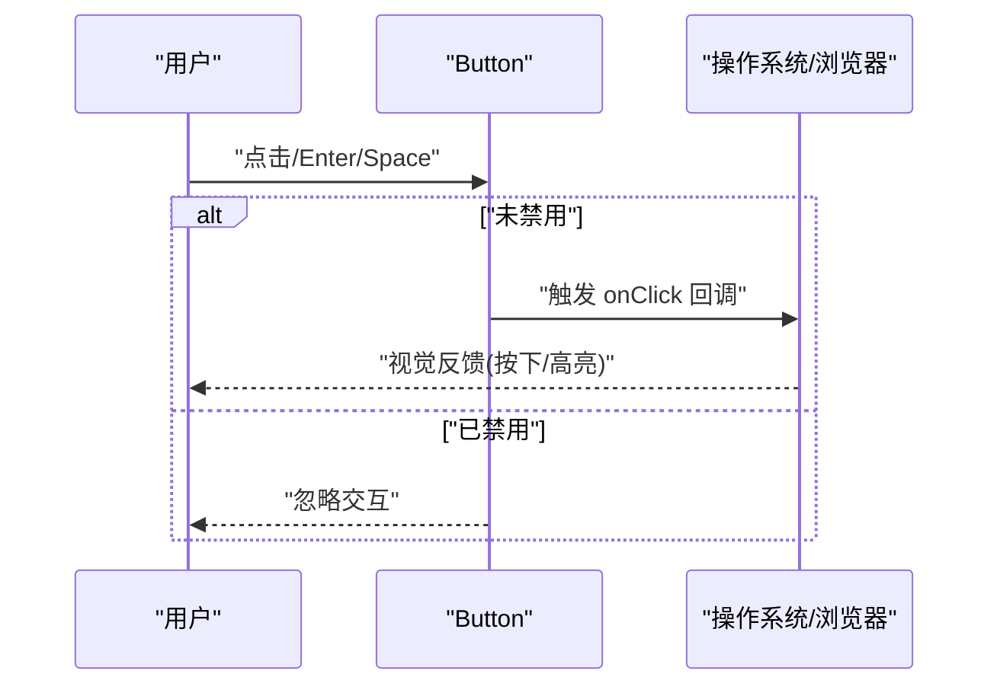
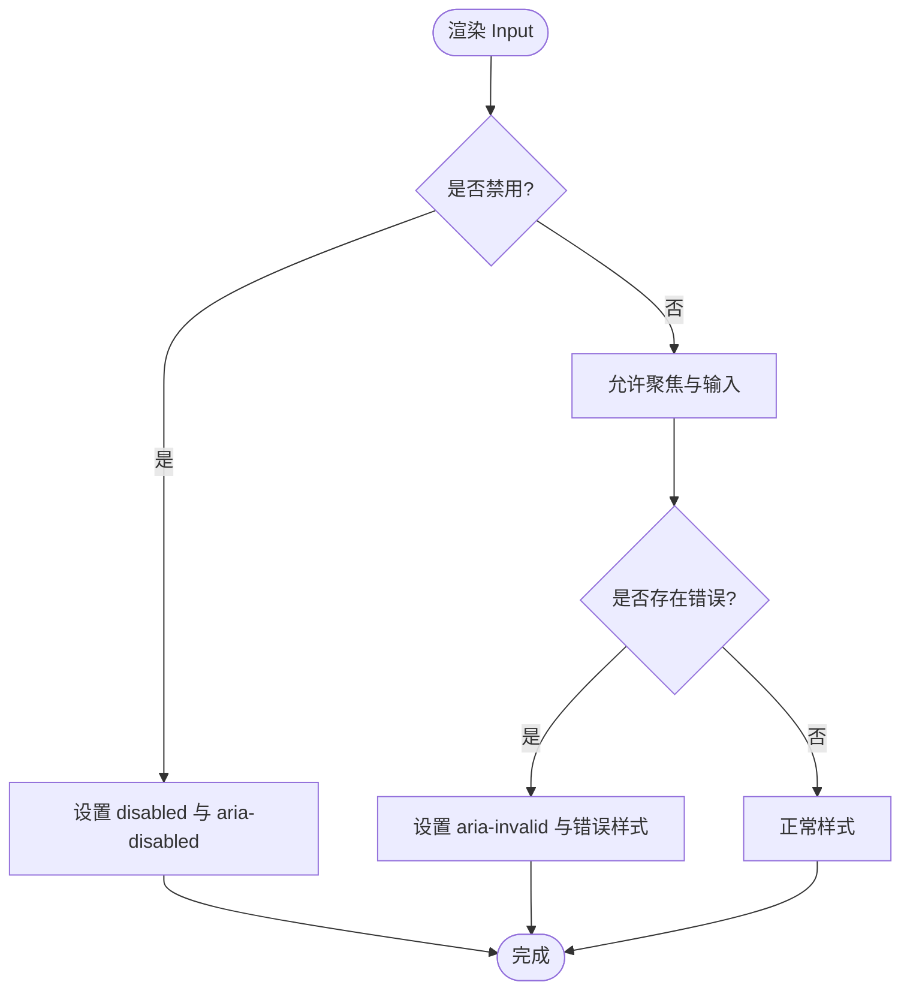
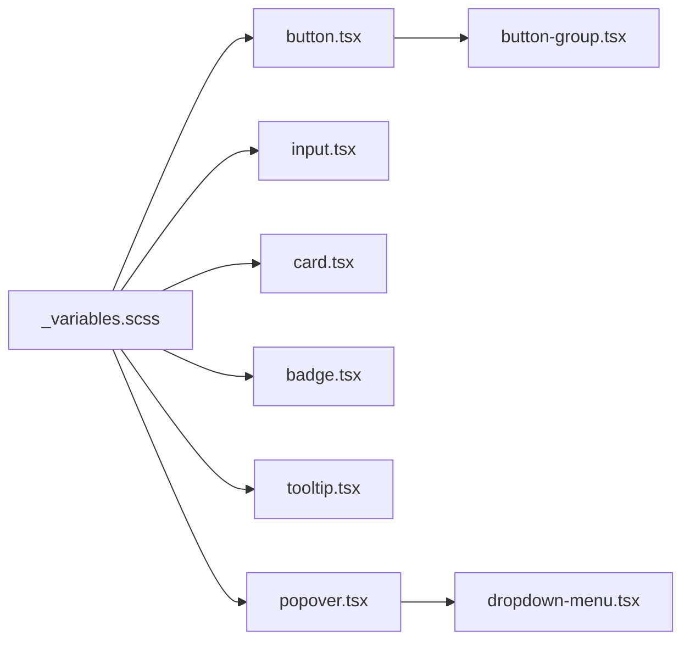

# 基础 UI 组件

<cite>
**本文引用的文件**   
- [src/components/tiptap-ui-primitive/button.tsx](file://src/components/tiptap-ui-primitive/button.tsx)
- [src/components/tiptap-ui-primitive/button.scss](file://src/components/tiptap-ui-primitive/button.scss)
- [src/components/tiptap-ui-primitive/button-colors.scss](file://src/components/tiptap-ui-primitive/button-colors.scss)
- [src/components/tiptap-ui-primitive/button-group.tsx](file://src/components/tiptap-ui-primitive/button-group.tsx)
- [src/components/tiptap-ui-primitive/button-group.scss](file://src/components/tiptap-ui-primitive/button-group.scss)
- [src/components/tiptap-ui-primitive/input.tsx](file://src/components/tiptap-ui-primitive/input.tsx)
- [src/components/tiptap-ui-primitive/input.scss](file://src/components/tiptap-ui-primitive/input.scss)
- [src/components/tiptap-ui-primitive/card.tsx](file://src/components/tiptap-ui-primitive/card.tsx)
- [src/components/tiptap-ui-primitive/card.scss](file://src/components/tiptap-ui-primitive/card.scss)
- [src/components/tiptap-ui-primitive/badge.tsx](file://src/components/tiptap-ui-primitive/badge.tsx)
- [src/components/tiptap-ui-primitive/badge.scss](file://src/components/tiptap-ui-primitive/badge.scss)
- [src/components/tiptap-ui-primitive/badge-colors.scss](file://src/components/tiptap-ui-primitive/badge-colors.scss)
- [src/components/tiptap-ui-primitive/tooltip.tsx](file://src/components/tiptap-ui-primitive/tooltip.tsx)
- [src/components/tiptap-ui-primitive/tooltip.scss](file://src/components/tiptap-ui-primitive/tooltip.scss)
- [src/components/tiptap-ui-primitive/popover.tsx](file://src/components/tiptap-ui-primitive/popover.tsx)
- [src/components/tiptap-ui-primitive/popover.scss](file://src/components/tiptap-ui-primitive/popover.scss)
- [src/components/tiptap-ui-primitive/dropdown-menu.tsx](file://src/components/tiptap-ui-primitive/dropdown-menu.tsx)
- [src/components/tiptap-ui-primitive/dropdown-menu.scss](file://src/components/tiptap-ui-primitive/dropdown-menu.scss)
- [src/components/tiptap-ui-primitive/index.tsx](file://src/components/tiptap-ui-primitive/index.tsx)
- [src/styles/_variables.scss](file://src/styles/_variables.scss)
</cite>

## 目录
1. [简介](#简介)
2. [项目结构](#项目结构)
3. [核心组件](#核心组件)
4. [架构总览](#架构总览)
5. [详细组件分析](#详细组件分析)
6. [依赖分析](#依赖分析)
7. [性能考虑](#性能考虑)
8. [故障排查指南](#故障排查指南)
9. [结论](#结论)
10. [附录](#附录)

## 简介
本文件面向“基础 UI 组件”的技术文档，聚焦于按钮、输入框、卡片、徽章、提示与弹出层等核心原子组件。文档从设计原则、实现规范、Props 接口、样式定制、事件处理、可访问性与响应式策略等方面展开，并提供组合使用模式、主题定制方法与样式覆盖技巧，帮助开发者高效、一致地构建高质量界面。

## 项目结构
基础 UI 组件位于 tiptap-ui-primitive 目录中，采用“按组件拆分 + 样式就近管理”的组织方式：每个组件包含独立的 TSX 实现与 SCSS/CSS 样式文件，并通过统一入口 index.tsx 进行聚合导出。全局变量与主题相关常量集中在 styles/_variables.scss 中，便于跨组件复用与主题切换。

图表来源
- [src/components/tiptap-ui-primitive/index.tsx](file://src/components/tiptap-ui-primitive/index.tsx)
- [src/components/tiptap-ui-primitive/button.tsx](file://src/components/tiptap-ui-primitive/button.tsx)
- [src/components/tiptap-ui-primitive/button.scss](file://src/components/tiptap-ui-primitive/button.scss)
- [src/components/tiptap-ui-primitive/button-colors.scss](file://src/components/tiptap-ui-primitive/button-colors.scss)
- [src/components/tiptap-ui-primitive/button-group.tsx](file://src/components/tiptap-ui-primitive/button-group.tsx)
- [src/components/tiptap-ui-primitive/button-group.scss](file://src/components/tiptap-ui-primitive/button-group.scss)
- [src/components/tiptap-ui-primitive/input.tsx](file://src/components/tiptap-ui-primitive/input.tsx)
- [src/components/tiptap-ui-primitive/input.scss](file://src/components/tiptap-ui-primitive/input.tsx)
- [src/components/tiptap-ui-primitive/card.tsx](file://src/components/tiptap-ui-primitive/card.tsx)
- [src/components/tiptap-ui-primitive/card.scss](file://src/components/tiptap-ui-primitive/card.tsx)
- [src/components/tiptap-ui-primitive/badge.tsx](file://src/components/tiptap-ui-primitive/badge.tsx)
- [src/components/tiptap-ui-primitive/badge.scss](file://src/components/tiptap-ui-primitive/badge.tsx)
- [src/components/tiptap-ui-primitive/badge-colors.scss](file://src/components/tiptap-ui-primitive/badge-colors.scss)
- [src/components/tiptap-ui-primitive/tooltip.tsx](file://src/components/tiptap-ui-primitive/tooltip.tsx)
- [src/components/tiptap-ui-primitive/tooltip.scss](file://src/components/tiptap-ui-primitive/tooltip.tsx)
- [src/components/tiptap-ui-primitive/popover.tsx](file://src/components/tiptap-ui-primitive/popover.tsx)
- [src/components/tiptap-ui-primitive/popover.scss](file://src/components/tiptap-ui-primitive/popover.tsx)
- [src/components/tiptap-ui-primitive/dropdown-menu.tsx](file://src/components/tiptap-ui-primitive/dropdown-menu.tsx)
- [src/components/tiptap-ui-primitive/dropdown-menu.scss](file://src/components/tiptap-ui-primitive/dropdown-menu.tsx)
- [src/styles/_variables.scss](file://src/styles/_variables.scss)

章节来源
- [src/components/tiptap-ui-primitive/index.tsx](file://src/components/tiptap-ui-primitive/index.tsx)
- [src/styles/_variables.scss](file://src/styles/_variables.scss)

## 核心组件
本节概述各基础组件的职责边界与设计约定，后续章节将逐一深入。

- 按钮 Button：承载交互动作，支持多种尺寸、颜色变体与禁用态；提供键盘可达性与焦点可见性。
- 输入 Input：文本输入控件，支持受控与非受控模式、占位符、只读与禁用态、错误提示与辅助说明。
- 卡片 Card：内容容器，用于分组展示信息或操作，具备圆角、阴影与内边距等视觉层次。
- 徽章 Badge：轻量状态标记，支持颜色语义（成功、警告、危险等）与紧凑布局。
- 提示 Tooltip：悬停或聚焦时显示简短说明，遵循屏幕阅读器语义。
- 弹出层 Popover：承载更丰富的浮层内容，支持定位、遮罩与关闭行为。
- 下拉菜单 Dropdown Menu：基于 Popover 的复合交互，提供选项列表与选择回调。

章节来源
- [src/components/tiptap-ui-primitive/button.tsx](file://src/components/tiptap-ui-primitive/button.tsx)
- [src/components/tiptap-ui-primitive/input.tsx](file://src/components/tiptap-ui-primitive/input.tsx)
- [src/components/tiptap-ui-primitive/card.tsx](file://src/components/tiptap-ui-primitive/card.tsx)
- [src/components/tiptap-ui-primitive/badge.tsx](file://src/components/tiptap-ui-primitive/badge.tsx)
- [src/components/tiptap-ui-primitive/tooltip.tsx](file://src/components/tiptap-ui-primitive/tooltip.tsx)
- [src/components/tiptap-ui-primitive/popover.tsx](file://src/components/tiptap-ui-primitive/popover.tsx)
- [src/components/tiptap-ui-primitive/dropdown-menu.tsx](file://src/components/tiptap-ui-primitive/dropdown-menu.tsx)

## 架构总览
基础组件以“原子化 + 组合式”为架构理念：
- 原子组件：Button、Input、Card、Badge、Tooltip、Popover 各自独立，职责单一。
- 组合组件：Dropdown Menu 由 Popover 与列表项组合而成；Button Group 对多个 Button 进行布局与联动。
- 主题系统：通过 _variables.scss 集中管理色彩、间距、圆角、阴影等设计令牌，组件样式引用这些变量以实现一致的视觉语言。
- 可访问性：所有交互组件遵循 ARIA 语义与键盘导航规则，确保屏幕阅读器可用。

图表来源
- [src/components/tiptap-ui-primitive/button.tsx](file://src/components/tiptap-ui-primitive/button.tsx)
- [src/components/tiptap-ui-primitive/input.tsx](file://src/components/tiptap-ui-primitive/input.tsx)
- [src/components/tiptap-ui-primitive/card.tsx](file://src/components/tiptap-ui-primitive/card.tsx)
- [src/components/tiptap-ui-primitive/badge.tsx](file://src/components/tiptap-ui-primitive/badge.tsx)
- [src/components/tiptap-ui-primitive/tooltip.tsx](file://src/components/tiptap-ui-primitive/tooltip.tsx)
- [src/components/tiptap-ui-primitive/popover.tsx](file://src/components/tiptap-ui-primitive/popover.tsx)
- [src/components/tiptap-ui-primitive/dropdown-menu.tsx](file://src/components/tiptap-ui-primitive/dropdown-menu.tsx)

## 详细组件分析

### 按钮 Button
- 设计原则
  - 明确的主次层级：通过 variant 区分主按钮、次要按钮、幽灵按钮等。
  - 一致的交互反馈：hover、active、focus、disabled 状态清晰。
  - 可访问性：支持 Enter/Space 触发、清晰的焦点环、aria-disabled 同步。
- Props 接口要点
  - variant：控制颜色与语义（如 primary、secondary、danger）。
  - size：控制尺寸（如 small、medium、large）。
  - disabled：禁用态，同时更新 aria-disabled 与 tabIndex。
  - onClick：点击回调。
  - children：按钮内容，支持图标与文字组合。
- 样式定制
  - 通过 button.scss 定义基础样式，button-colors.scss 定义颜色变体。
  - 推荐通过 CSS 变量或类名覆盖，避免直接修改源码。
- 事件处理机制
  - 原生 click 事件透传，禁用态阻止默认行为。
  - 键盘 Enter/Space 触发 onClick，符合 WAI-ARIA 按钮语义。
- 可访问性与响应式
  - 焦点可见性高对比度；移动端触控区域满足最小点击面积。
  - 在小屏下自动调整内边距与字号，保持可读性。

图表来源
- [src/components/tiptap-ui-primitive/button.tsx](file://src/components/tiptap-ui-primitive/button.tsx)
- [src/components/tiptap-ui-primitive/button.scss](file://src/components/tiptap-ui-primitive/button.scss)
- [src/components/tiptap-ui-primitive/button-colors.scss](file://src/components/tiptap-ui-primitive/button-colors.scss)

章节来源
- [src/components/tiptap-ui-primitive/button.tsx](file://src/components/tiptap-ui-primitive/button.tsx)
- [src/components/tiptap-ui-primitive/button.scss](file://src/components/tiptap-ui-primitive/button.scss)
- [src/components/tiptap-ui-primitive/button-colors.scss](file://src/components/tiptap-ui-primitive/button-colors.scss)

### 输入 Input
- 设计原则
  - 清晰的输入状态：默认、聚焦、错误、只读、禁用。
  - 辅助信息：占位符、错误消息、帮助文本。
  - 受控与非受控：既支持 value+onChange 受控模式，也支持 defaultValue 非受控模式。
- Props 接口要点
  - value / onChange：受控输入。
  - placeholder：占位提示。
  - readOnly / disabled：只读与禁用。
  - error / helperText：错误与帮助文案。
  - id / name / type：表单语义与提交字段。
- 样式定制
  - input.scss 定义边框、圆角、内边距、错误态与禁用态。
  - 建议通过外层包裹类名或 CSS 变量覆盖，避免侵入组件内部。
- 事件处理机制
  - onChange 透传原生事件，支持合成事件封装。
  - 错误态时增加 aria-invalid 与 aria-describedby 指向帮助元素。
- 可访问性与响应式
  - 标签关联（label htmlFor=id），屏幕阅读器可正确朗读。
  - 小屏下自适应宽度与行高，保证输入体验。

图表来源
- [src/components/tiptap-ui-primitive/input.tsx](file://src/components/tiptap-ui-primitive/input.tsx)
- [src/components/tiptap-ui-primitive/input.scss](file://src/components/tiptap-ui-primitive/input.tsx)

章节来源
- [src/components/tiptap-ui-primitive/input.tsx](file://src/components/tiptap-ui-primitive/input.tsx)
- [src/components/tiptap-ui-primitive/input.scss](file://src/components/tiptap-ui-primitive/input.tsx)

### 卡片 Card
- 设计原则
  - 作为内容容器，强调层次与留白。
  - 可选阴影与圆角，适配不同场景（面板、模态内容、列表项）。
- Props 接口要点
  - children：子节点内容。
  - padding：内边距控制。
  - shadow：阴影强度开关。
- 样式定制
  - card.scss 定义背景、边框、圆角与阴影。
  - 可通过外层类名覆盖，保持组件纯净。
- 可访问性与响应式
  - 作为容器不强制语义，但建议配合标题与描述提升可访问性。
  - 在小屏下自动缩减内边距与阴影，提升性能与可读性。

章节来源
- [src/components/tiptap-ui-primitive/card.tsx](file://src/components/tiptap-ui-primitive/card.tsx)
- [src/components/tiptap-ui-primitive/card.scss](file://src/components/tiptap-ui-primitive/card.tsx)

### 徽章 Badge
- 设计原则
  - 轻量状态标识，强调颜色语义与紧凑布局。
- Props 接口要点
  - color：颜色变体（成功、警告、危险、中性等）。
  - children：文本或图标。
- 样式定制
  - badge.scss 定义基础形状与尺寸。
  - badge-colors.scss 定义颜色映射，便于扩展新语义色。
- 可访问性与响应式
  - 建议使用 aria-label 补充含义，避免仅靠颜色传达信息。
  - 在小屏下缩小字号与间距，保持布局稳定。

章节来源
- [src/components/tiptap-ui-primitive/badge.tsx](file://src/components/tiptap-ui-primitive/badge.tsx)
- [src/components/tiptap-ui-primitive/badge.scss](file://src/components/tiptap-ui-primitive/badge.tsx)
- [src/components/tiptap-ui-primitive/badge-colors.scss](file://src/components/tiptap-ui-primitive/badge-colors.scss)

### 提示 Tooltip
- 设计原则
  - 轻量说明，仅在需要时出现，避免干扰主流程。
- Props 接口要点
  - content：提示文案。
  - trigger：触发元素（通常为 Button 或其他可聚焦元素）。
  - placement：位置（上、下、左、右）。
- 样式定制
  - tooltip.scss 定义气泡样式、箭头与阴影。
- 可访问性与响应式
  - 聚焦时显示，失焦隐藏；支持 aria-describedby 关联。
  - 在窄屏下自动调整位置，防止溢出视口。

章节来源
- [src/components/tiptap-ui-primitive/tooltip.tsx](file://src/components/tiptap-ui-primitive/tooltip.tsx)
- [src/components/tiptap-ui-primitive/tooltip.scss](file://src/components/tiptap-ui-primitive/tooltip.tsx)

### 弹出层 Popover
- 设计原则
  - 承载更丰富内容的浮层，需关注定位、遮罩与关闭行为。
- Props 接口要点
  - open：显隐控制。
  - onOpenChange：显隐变化回调。
  - trigger：触发元素。
  - content：浮层内容。
  - placement：位置策略。
- 样式定制
  - popover.scss 定义背景、边框、阴影与定位偏移。
- 可访问性与响应式
  - 打开时聚焦到浮层首项，Esc 关闭；支持点击外部关闭。
  - 在小屏下自动回退为全屏或底部抽屉式布局（由上层组合决定）。

章节来源
- [src/components/tiptap-ui-primitive/popover.tsx](file://src/components/tiptap-ui-primitive/popover.tsx)
- [src/components/tiptap-ui-primitive/popover.scss](file://src/components/tiptap-ui-primitive/popover.tsx)

### 下拉菜单 Dropdown Menu
- 设计原则
  - 基于 Popover 的组合组件，提供选项列表与选择回调。
- Props 接口要点
  - items：选项数组（含 label、value、disabled 等）。
  - onSelect：选中回调。
  - trigger：触发元素。
- 样式定制
  - dropdown-menu.scss 定义列表项、分隔线与悬浮态。
- 可访问性与响应式
  - 键盘上下导航、Enter 选择、Esc 关闭；支持 aria-selected 与 role="menu"。
  - 在小屏下全宽显示，提升触控友好性。

章节来源
- [src/components/tiptap-ui-primitive/dropdown-menu.tsx](file://src/components/tiptap-ui-primitive/dropdown-menu.tsx)
- [src/components/tiptap-ui-primitive/dropdown-menu.scss](file://src/components/tiptap-ui-primitive/dropdown-menu.tsx)

### 按钮组 Button Group
- 设计原则
  - 将一组按钮紧密排列，提供统一的边框与间距。
- Props 接口要点
  - children：多个 Button 实例。
  - orientation：水平或垂直排列。
- 样式定制
  - button-group.scss 定义边框合并、间距与圆角处理。
- 可访问性与响应式
  - 使用 role="group" 与 aria-labelledby 关联标题。
  - 在小屏下自动换行或改为垂直堆叠。

章节来源
- [src/components/tiptap-ui-primitive/button-group.tsx](file://src/components/tiptap-ui-primitive/button-group.tsx)
- [src/components/tiptap-ui-primitive/button-group.scss](file://src/components/tiptap-ui-primitive/button-group.tsx)

## 依赖分析
- 组件间依赖
  - Dropdown Menu 依赖 Popover 的定位与显隐逻辑。
  - Tooltip 复用 Popover 的定位策略，简化为轻量提示。
  - Button Group 组合多个 Button，负责布局与边框合并。
- 主题与变量
  - 所有组件样式均引用 _variables.scss 中的设计令牌（颜色、间距、圆角、阴影等），确保视觉一致性。
- 潜在循环依赖
  - 当前组件均为单向依赖，无循环导入风险。

图表来源
- [src/styles/_variables.scss](file://src/styles/_variables.scss)
- [src/components/tiptap-ui-primitive/button.tsx](file://src/components/tiptap-ui-primitive/button.tsx)
- [src/components/tiptap-ui-primitive/input.tsx](file://src/components/tiptap-ui-primitive/input.tsx)
- [src/components/tiptap-ui-primitive/card.tsx](file://src/components/tiptap-ui-primitive/card.tsx)
- [src/components/tiptap-ui-primitive/badge.tsx](file://src/components/tiptap-ui-primitive/badge.tsx)
- [src/components/tiptap-ui-primitive/tooltip.tsx](file://src/components/tiptap-ui-primitive/tooltip.tsx)
- [src/components/tiptap-ui-primitive/popover.tsx](file://src/components/tiptap-ui-primitive/popover.tsx)
- [src/components/tiptap-ui-primitive/dropdown-menu.tsx](file://src/components/tiptap-ui-primitive/dropdown-menu.tsx)
- [src/components/tiptap-ui-primitive/button-group.tsx](file://src/components/tiptap-ui-primitive/button-group.tsx)

章节来源
- [src/styles/_variables.scss](file://src/styles/_variables.scss)
- [src/components/tiptap-ui-primitive/index.tsx](file://src/components/tiptap-ui-primitive/index.tsx)

## 性能考虑
- 渲染优化
  - 避免在高频事件中创建新对象或函数，必要时使用 useMemo/useCallback 缓存。
  - 浮层组件（Tooltip/Popover/Dropdown）按需渲染，减少初始 DOM 体积。
- 样式与重排
  - 尽量使用 CSS 变量与类名切换，避免频繁读取布局属性导致重排。
  - 在小屏下减少阴影与复杂渐变，降低绘制成本。
- 可访问性与性能平衡
  - 大量选项的下拉菜单可采用虚拟滚动或分页加载，避免一次性渲染过多节点。

[本节为通用指导，不涉及具体文件分析]

## 故障排查指南
- 常见问题
  - 浮层被遮挡：检查父级容器的 z-index 与 overflow 设置，确保浮层定位上下文正确。
  - 键盘不可用：确认组件设置了正确的 role、tabIndex 与 aria-* 属性。
  - 样式冲突：优先通过外层类名覆盖，避免直接修改组件源码样式。
- 调试建议
  - 使用浏览器开发者工具检查 ARIA 属性与焦点顺序。
  - 针对浮层问题，临时添加边框与背景色以观察定位与层级关系。

章节来源
- [src/components/tiptap-ui-primitive/tooltip.tsx](file://src/components/tiptap-ui-primitive/tooltip.tsx)
- [src/components/tiptap-ui-primitive/popover.tsx](file://src/components/tiptap-ui-primitive/popover.tsx)
- [src/components/tiptap-ui-primitive/dropdown-menu.tsx](file://src/components/tiptap-ui-primitive/dropdown-menu.tsx)

## 结论
基础 UI 组件以原子化与组合式为核心，结合统一的主题变量与严格的可访问性规范，形成一致、可扩展且易维护的组件体系。通过合理的 Props 设计与样式覆盖策略，开发者可以在不同业务场景中快速搭建高质量的界面。

[本节为总结性内容，不涉及具体文件分析]

## 附录
- 主题定制方法
  - 在 _variables.scss 中新增或覆盖设计令牌（颜色、间距、圆角、阴影等），组件样式将自动生效。
  - 通过外层包裹类名与 CSS 变量覆盖特定页面或模块的视觉风格。
- 样式覆盖技巧
  - 优先使用类名与作用域覆盖，避免 !important。
  - 对于浮层组件，注意定位上下文与层级关系，必要时调整父容器样式。
- 组合使用模式
  - 按钮组 + 下拉菜单：用于批量操作与筛选。
  - 卡片 + 徽章 + 按钮：用于信息卡片与快捷操作。
  - 输入 + 提示：用于表单校验与即时反馈。

章节来源
- [src/styles/_variables.scss](file://src/styles/_variables.scss)
- [src/components/tiptap-ui-primitive/button-group.tsx](file://src/components/tiptap-ui-primitive/button-group.tsx)
- [src/components/tiptap-ui-primitive/dropdown-menu.tsx](file://src/components/tiptap-ui-primitive/dropdown-menu.tsx)
- [src/components/tiptap-ui-primitive/card.tsx](file://src/components/tiptap-ui-primitive/card.tsx)
- [src/components/tiptap-ui-primitive/badge.tsx](file://src/components/tiptap-ui-primitive/badge.tsx)
- [src/components/tiptap-ui-primitive/input.tsx](file://src/components/tiptap-ui-primitive/input.tsx)
- [src/components/tiptap-ui-primitive/tooltip.tsx](file://src/components/tiptap-ui-primitive/tooltip.tsx)