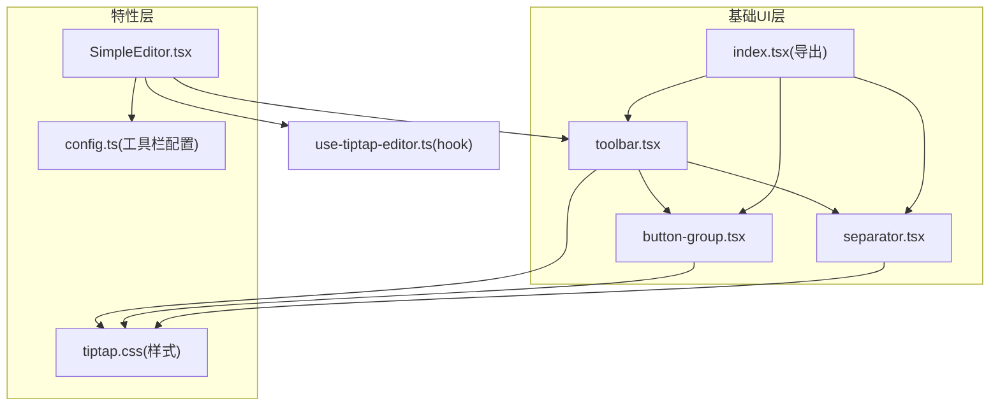
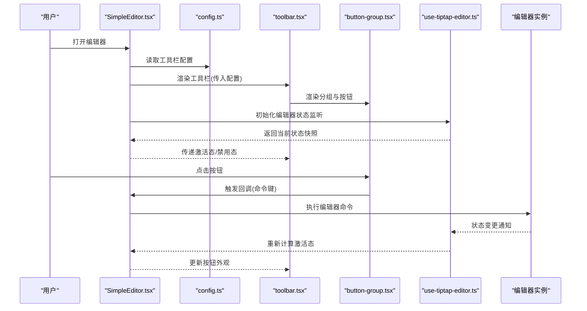
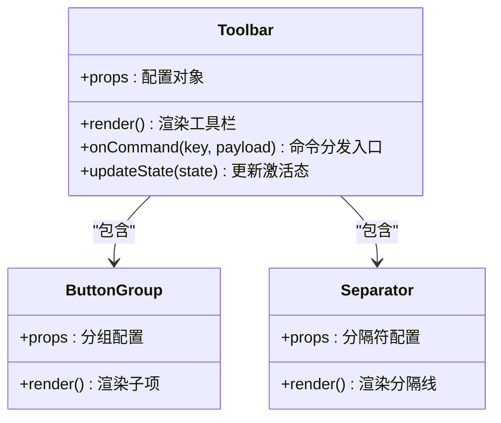
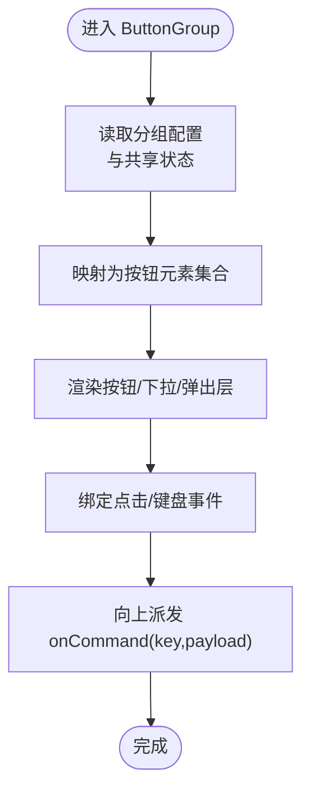
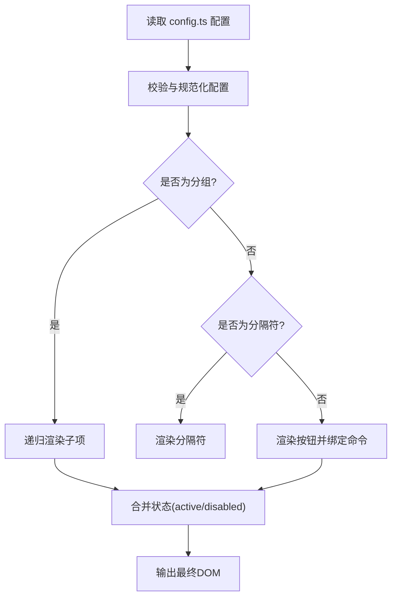
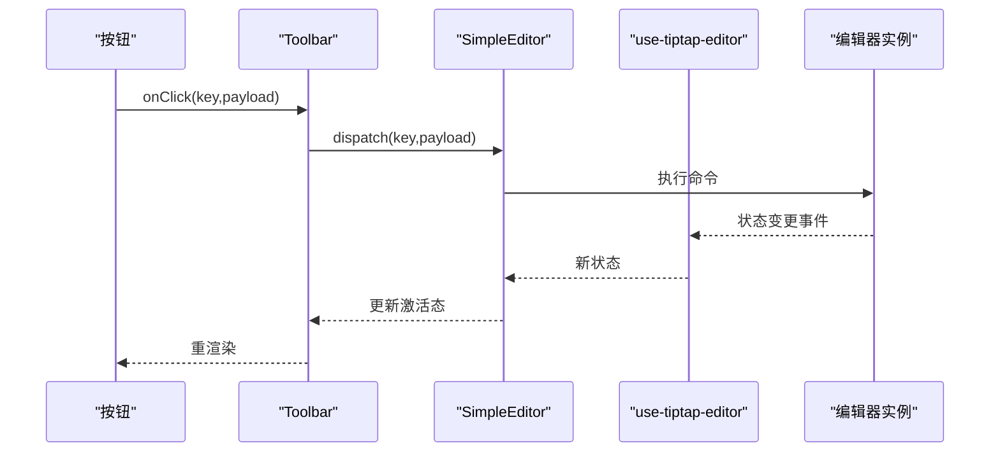
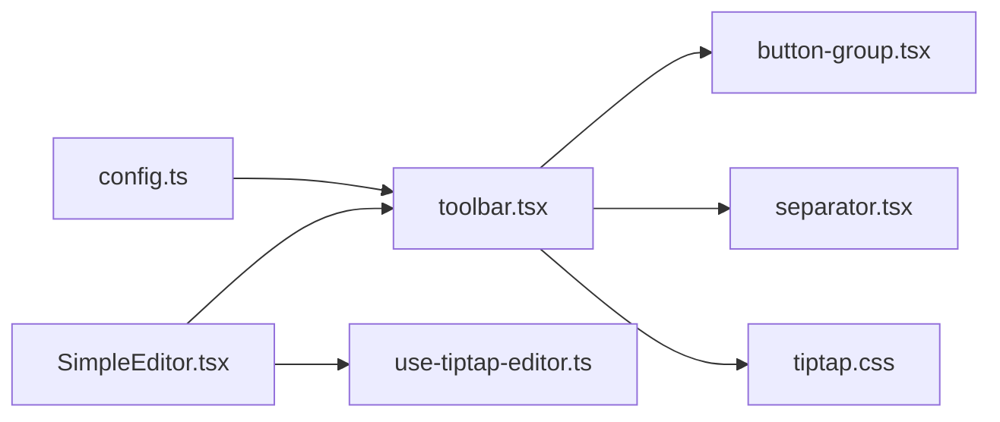

# 工具栏系统

<cite>
**本文引用的文件**   
- [toolbar.tsx](file://src/components/tiptap-ui-primitive/toolbar.tsx)
- [button-group.tsx](file://src/components/tiptap-ui-primitive/button-group.tsx)
- [separator.tsx](file://src/components/tiptap-ui-primitive/separator.tsx)
- [index.tsx](file://src/components/tiptap-ui-primitive/index.tsx)
- [use-tiptap-editor.ts](file://src/hooks/use-tiptap-editor.ts)
- [SimpleEditor.tsx](file://src/features/tiptap/SimpleEditor.tsx)
- [config.ts](file://src/features/tiptap/config.ts)
- [tiptap.css](file://src/features/tiptap/tiptap.css)
</cite>

## 目录
1. [简介](#简介)
2. [项目结构](#项目结构)
3. [核心组件](#核心组件)
4. [架构总览](#架构总览)
5. [详细组件分析](#详细组件分析)
6. [依赖关系分析](#依赖关系分析)
7. [性能考虑](#性能考虑)
8. [故障排查指南](#故障排查指南)
9. [结论](#结论)
10. [附录](#附录)

## 简介
本技术文档聚焦于编辑器工具栏系统的整体设计与实现，覆盖以下关键主题：
- 工具栏主容器、按钮分组与分隔符组件的职责与协作方式
- 配置化渲染与动态更新机制
- 响应式布局策略
- 与编辑器状态的同步及命令分发流程
- 主题定制与样式覆盖方法
- 扩展开发与第三方组件集成指南

## 项目结构
工具栏相关代码主要位于 tiptap-ui-primitive 基础 UI 层与 tiptap 功能特性层之间。基础层提供可复用的 toolbar、button-group、separator 等原子组件；特性层将具体编辑能力（如加粗、标题、列表等）以“按钮”或“菜单”形式组合到工具栏中，并通过 hooks 与编辑器实例进行状态同步和命令派发。

图表来源
- [toolbar.tsx:1-200](file://src/components/tiptap-ui-primitive/toolbar.tsx#L1-L200)
- [button-group.tsx:1-200](file://src/components/tiptap-ui-primitive/button-group.tsx#L1-L200)
- [separator.tsx:1-200](file://src/components/tiptap-ui-primitive/separator.tsx#L1-L200)
- [index.tsx:1-200](file://src/components/tiptap-ui-primitive/index.tsx#L1-L200)
- [SimpleEditor.tsx:1-200](file://src/features/tiptap/SimpleEditor.tsx#L1-L200)
- [config.ts:1-200](file://src/features/tiptap/config.ts#L1-L200)
- [tiptap.css:1-200](file://src/features/tiptap/tiptap.css#L1-L200)

章节来源
- [toolbar.tsx:1-200](file://src/components/tiptap-ui-primitive/toolbar.tsx#L1-L200)
- [button-group.tsx:1-200](file://src/components/tiptap-ui-primitive/button-group.tsx#L1-L200)
- [separator.tsx:1-200](file://src/components/tiptap-ui-primitive/separator.tsx#L1-L200)
- [index.tsx:1-200](file://src/components/tiptap-ui-primitive/index.tsx#L1-L200)
- [SimpleEditor.tsx:1-200](file://src/features/tiptap/SimpleEditor.tsx#L1-L200)
- [config.ts:1-200](file://src/features/tiptap/config.ts#L1-L200)
- [tiptap.css:1-200](file://src/features/tiptap/tiptap.css#L1-L200)

## 核心组件
- 工具栏主容器（Toolbar）
  - 职责：作为工具栏的根节点，负责布局容器、响应式断点处理、主题类名注入、滚动与对齐策略。
  - 关键点：对外暴露 props 控制可见性、间距、对齐方向；内部聚合 button-group 与 separator。
- 按钮分组（ButtonGroup）
  - 职责：对一组按钮进行逻辑分组，支持紧凑模式、溢出折叠、键盘导航等。
  - 关键点：通过 props 控制分组行为；为子项提供统一的焦点管理与事件转发。
- 分隔符（Separator）
  - 职责：在工具栏内提供视觉分割，增强可读性与操作分区。
  - 关键点：根据布局方向自动切换横竖形态。

章节来源
- [toolbar.tsx:1-200](file://src/components/tiptap-ui-primitive/toolbar.tsx#L1-L200)
- [button-group.tsx:1-200](file://src/components/tiptap-ui-primitive/button-group.tsx#L1-L200)
- [separator.tsx:1-200](file://src/components/tiptap-ui-primitive/separator.tsx#L1-L200)

## 架构总览
工具栏采用“配置驱动 + 状态同步 + 命令分发”的架构：
- 配置驱动：在特性层的配置文件中声明工具栏项（按钮、分组、分隔符），由渲染器解析并生成 DOM。
- 状态同步：通过自定义 hook 订阅编辑器状态变化（选区、标记、块级属性等），驱动按钮激活态与可用性。
- 命令分发：点击按钮后，调用编辑器命令 API 执行对应操作（如插入、切换、跳转）。

图表来源
- [SimpleEditor.tsx:1-200](file://src/features/tiptap/SimpleEditor.tsx#L1-L200)
- [config.ts:1-200](file://src/features/tiptap/config.ts#L1-L200)
- [toolbar.tsx:1-200](file://src/components/tiptap-ui-primitive/toolbar.tsx#L1-L200)
- [button-group.tsx:1-200](file://src/components/tiptap-ui-primitive/button-group.tsx#L1-L200)
- [use-tiptap-editor.ts:1-200](file://src/hooks/use-tiptap-editor.ts#L1-L200)

## 详细组件分析

### Toolbar 主容器
- 设计要点
  - 容器语义与无障碍：提供正确的 role、aria-* 属性，确保键盘可达与屏幕阅读器友好。
  - 响应式布局：依据断点调整排列方向、间距与溢出策略。
  - 主题与样式：通过 class 注入主题变量，支持覆盖默认样式。
- 交互流程
  - 接收配置数组，遍历渲染 ButtonGroup 与 Separator。
  - 将编辑器状态映射为按钮的激活/禁用态。
  - 将按钮点击事件转换为命令回调，交由上层统一调度。

图表来源
- [toolbar.tsx:1-200](file://src/components/tiptap-ui-primitive/toolbar.tsx#L1-L200)
- [button-group.tsx:1-200](file://src/components/tiptap-ui-primitive/button-group.tsx#L1-L200)
- [separator.tsx:1-200](file://src/components/tiptap-ui-primitive/separator.tsx#L1-L200)

章节来源
- [toolbar.tsx:1-200](file://src/components/tiptap-ui-primitive/toolbar.tsx#L1-L200)

### ButtonGroup 分组组件
- 设计要点
  - 分组边界与视觉层次：通过边框、背景或阴影区分不同功能域。
  - 紧凑模式与溢出：在小屏下自动折叠或隐藏次要按钮。
  - 键盘导航：左右箭头在组内移动焦点，Enter/Space 触发。
- 数据流
  - 从父级获取按钮集合与共享状态。
  - 将每个按钮的激活态与禁用态透传至子项。
  - 捕获子项事件并向上冒泡至 Toolbar 的命令分发。

图表来源
- [button-group.tsx:1-200](file://src/components/tiptap-ui-primitive/button-group.tsx#L1-L200)

章节来源
- [button-group.tsx:1-200](file://src/components/tiptap-ui-primitive/button-group.tsx#L1-L200)

### Separator 分隔符组件
- 设计要点
  - 自适应方向：水平/垂直布局下自动切换分隔线方向。
  - 尺寸与间距：遵循设计令牌，保持与按钮一致的视觉节奏。
- 使用建议
  - 用于功能域之间的清晰切分，避免过度使用导致界面碎片化。

章节来源
- [separator.tsx:1-200](file://src/components/tiptap-ui-primitive/separator.tsx#L1-L200)

### 配置与动态渲染
- 配置模型
  - 工具栏项类型：按钮、分组、分隔符、占位符等。
  - 通用字段：id、label、icon、active、disabled、tooltip、onClick/onCommand。
  - 分组字段：items、compact、overflow。
- 渲染流程
  - 解析配置数组，按顺序构建虚拟树。
  - 根据 active/disabled 更新按钮外观。
  - 根据窗口尺寸与 compact 标志决定折叠策略。

图表来源
- [config.ts:1-200](file://src/features/tiptap/config.ts#L1-L200)
- [toolbar.tsx:1-200](file://src/components/tiptap-ui-primitive/toolbar.tsx#L1-L200)
- [button-group.tsx:1-200](file://src/components/tiptap-ui-primitive/button-group.tsx#L1-L200)
- [separator.tsx:1-200](file://src/components/tiptap-ui-primitive/separator.tsx#L1-L200)

章节来源
- [config.ts:1-200](file://src/features/tiptap/config.ts#L1-L200)
- [toolbar.tsx:1-200](file://src/components/tiptap-ui-primitive/toolbar.tsx#L1-L200)

### 与编辑器状态同步与命令分发
- 状态同步
  - 使用 use-tiptap-editor 钩子订阅编辑器状态（选区、标记、块级属性等）。
  - 将状态映射为按钮的激活态与可用性，保证 UI 与编辑器一致。
- 命令分发
  - 按钮点击时，向 Toolbar 上报命令键与参数。
  - Toolbar 调用 SimpleEditor 的命令处理器，后者调用编辑器 API 执行操作。
  - 编辑器状态变更后，再次触发 UI 刷新。

图表来源
- [use-tiptap-editor.ts:1-200](file://src/hooks/use-tiptap-editor.ts#L1-L200)
- [SimpleEditor.tsx:1-200](file://src/features/tiptap/SimpleEditor.tsx#L1-L200)
- [toolbar.tsx:1-200](file://src/components/tiptap-ui-primitive/toolbar.tsx#L1-L200)

章节来源
- [use-tiptap-editor.ts:1-200](file://src/hooks/use-tiptap-editor.ts#L1-L200)
- [SimpleEditor.tsx:1-200](file://src/features/tiptap/SimpleEditor.tsx#L1-L200)
- [toolbar.tsx:1-200](file://src/components/tiptap-ui-primitive/toolbar.tsx#L1-L200)

### 响应式布局
- 断点策略
  - 小屏：启用紧凑模式，隐藏次要按钮，必要时折叠为下拉菜单。
  - 中屏：保留常用按钮，适当增加间距。
  - 大屏：全量展示，支持多行或固定宽度。
- 实现要点
  - 基于窗口尺寸与容器宽度计算布局。
  - 通过 CSS 媒体查询与 JS 判断结合，平衡性能与灵活性。
  - 提供 compact 与 overflow 配置项，便于业务侧微调。

章节来源
- [toolbar.tsx:1-200](file://src/components/tiptap-ui-primitive/toolbar.tsx#L1-L200)
- [button-group.tsx:1-200](file://src/components/tiptap-ui-primitive/button-group.tsx#L1-L200)

### 主题定制与样式覆盖
- 主题变量
  - 通过 CSS 变量定义颜色、字号、间距、圆角等，供组件消费。
  - 支持明暗主题切换，通过 class 切换变量值。
- 覆盖方式
  - 在 tiptap.css 中针对工具栏选择器覆盖默认样式。
  - 在应用层引入自定义主题样式表，优先级高于默认样式。
- 最佳实践
  - 尽量使用 CSS 变量而非硬编码值，提升可维护性。
  - 避免直接覆盖组件内部私有类名，优先使用公开主题接口。

章节来源
- [tiptap.css:1-200](file://src/features/tiptap/tiptap.css#L1-L200)
- [toolbar.tsx:1-200](file://src/components/tiptap-ui-primitive/toolbar.tsx#L1-L200)

### 扩展开发与第三方组件集成
- 扩展步骤
  - 在配置文件中新增工具栏项，指定 id、label、icon、command 等。
  - 若需要复杂交互，封装为独立按钮组件，并在 ButtonGroup 中使用。
  - 在命令处理器中对接编辑器 API 或第三方服务。
- 注意事项
  - 确保命令幂等与错误处理，避免重复执行。
  - 关注无障碍与键盘可达性，补充 aria-* 与键盘事件。
  - 对小屏场景做降级处理，保障可用体验。

章节来源
- [config.ts:1-200](file://src/features/tiptap/config.ts#L1-L200)
- [button-group.tsx:1-200](file://src/components/tiptap-ui-primitive/button-group.tsx#L1-L200)
- [SimpleEditor.tsx:1-200](file://src/features/tiptap/SimpleEditor.tsx#L1-L200)

## 依赖关系分析
- 组件耦合
  - Toolbar 依赖 ButtonGroup 与 Separator，形成清晰的父子关系。
  - ButtonGroup 与 Separator 无相互依赖，具备高内聚低耦合特征。
- 外部依赖
  - 编辑器状态通过 use-tiptap-editor 钩子解耦，降低与具体编辑器实现的耦合度。
  - 样式集中在 tiptap.css，便于集中管理与覆盖。
- 潜在风险
  - 配置过大可能导致渲染性能下降，需按需加载与懒渲染。
  - 频繁状态同步可能引发重渲染，应优化订阅粒度与比较策略。

图表来源
- [config.ts:1-200](file://src/features/tiptap/config.ts#L1-L200)
- [toolbar.tsx:1-200](file://src/components/tiptap-ui-primitive/toolbar.tsx#L1-L200)
- [button-group.tsx:1-200](file://src/components/tiptap-ui-primitive/button-group.tsx#L1-L200)
- [separator.tsx:1-200](file://src/components/tiptap-ui-primitive/separator.tsx#L1-L200)
- [SimpleEditor.tsx:1-200](file://src/features/tiptap/SimpleEditor.tsx#L1-L200)
- [use-tiptap-editor.ts:1-200](file://src/hooks/use-tiptap-editor.ts#L1-L200)
- [tiptap.css:1-200](file://src/features/tiptap/tiptap.css#L1-L200)

章节来源
- [config.ts:1-200](file://src/features/tiptap/config.ts#L1-L200)
- [toolbar.tsx:1-200](file://src/components/tiptap-ui-primitive/toolbar.tsx#L1-L200)
- [button-group.tsx:1-200](file://src/components/tiptap-ui-primitive/button-group.tsx#L1-L200)
- [separator.tsx:1-200](file://src/components/tiptap-ui-primitive/separator.tsx#L1-L200)
- [SimpleEditor.tsx:1-200](file://src/features/tiptap/SimpleEditor.tsx#L1-L200)
- [use-tiptap-editor.ts:1-200](file://src/hooks/use-tiptap-editor.ts#L1-L200)
- [tiptap.css:1-200](file://src/features/tiptap/tiptap.css#L1-L200)

## 性能考虑
- 减少不必要的重渲染
  - 仅在必要字段变化时更新按钮激活态，避免整棵树重绘。
  - 对长列表配置进行分页或虚拟化渲染。
- 事件节流与防抖
  - 对高频输入触发的状态同步进行节流，降低计算压力。
- 资源加载
  - 图标与图片按需加载，避免首屏阻塞。
- 内存管理
  - 及时移除事件监听与订阅，防止泄漏。

[本节为通用指导，不直接分析具体文件]

## 故障排查指南
- 常见问题
  - 按钮未激活：检查状态映射逻辑与订阅字段是否正确。
  - 命令无效：确认命令键与处理器映射是否一致，查看控制台错误。
  - 样式错乱：检查主题变量是否被覆盖，CSS 优先级是否正确。
  - 小屏异常：验证 compact 与 overflow 配置，确认断点阈值。
- 调试建议
  - 打印配置解析结果与最终渲染树，定位差异。
  - 使用浏览器开发者工具的组件面板观察状态变化。
  - 逐步注释命令处理器，缩小问题范围。

章节来源
- [toolbar.tsx:1-200](file://src/components/tiptap-ui-primitive/toolbar.tsx#L1-L200)
- [button-group.tsx:1-200](file://src/components/tiptap-ui-primitive/button-group.tsx#L1-L200)
- [SimpleEditor.tsx:1-200](file://src/features/tiptap/SimpleEditor.tsx#L1-L200)
- [tiptap.css:1-200](file://src/features/tiptap/tiptap.css#L1-L200)

## 结论
工具栏系统通过配置驱动、状态同步与命令分发实现了高内聚、低耦合的可扩展架构。基础组件职责清晰，配合响应式布局与主题体系，能够灵活适配多种业务场景。建议在扩展开发中遵循无障碍与性能最佳实践，持续优化用户体验。

[本节为总结性内容，不直接分析具体文件]

## 附录
- 快速上手
  - 在配置文件中添加工具栏项，启动编辑器即可看到效果。
  - 如需自定义样式，覆盖 tiptap.css 中的相关选择器。
- 参考路径
  - 工具栏主容器：[toolbar.tsx](file://src/components/tiptap-ui-primitive/toolbar.tsx)
  - 按钮分组：[button-group.tsx](file://src/components/tiptap-ui-primitive/button-group.tsx)
  - 分隔符：[separator.tsx](file://src/components/tiptap-ui-primitive/separator.tsx)
  - 导出入口：[index.tsx](file://src/components/tiptap-ui-primitive/index.tsx)
  - 编辑器集成：[SimpleEditor.tsx](file://src/features/tiptap/SimpleEditor.tsx)
  - 配置示例：[config.ts](file://src/features/tiptap/config.ts)
  - 样式文件：[tiptap.css](file://src/features/tiptap/tiptap.css)
  - 状态钩子：[use-tiptap-editor.ts](file://src/hooks/use-tiptap-editor.ts)