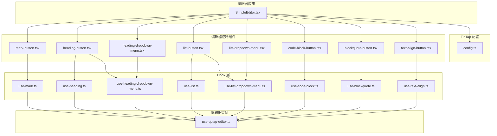
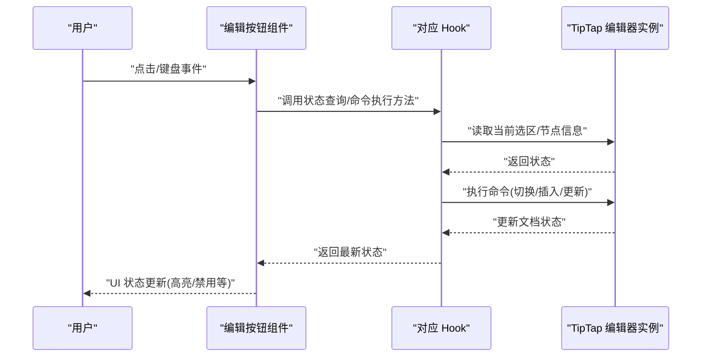
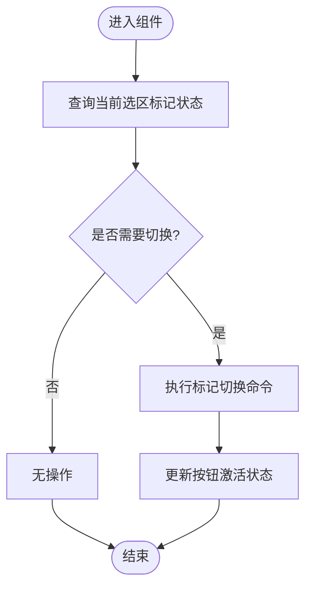
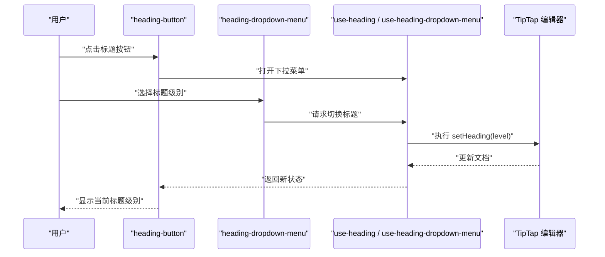
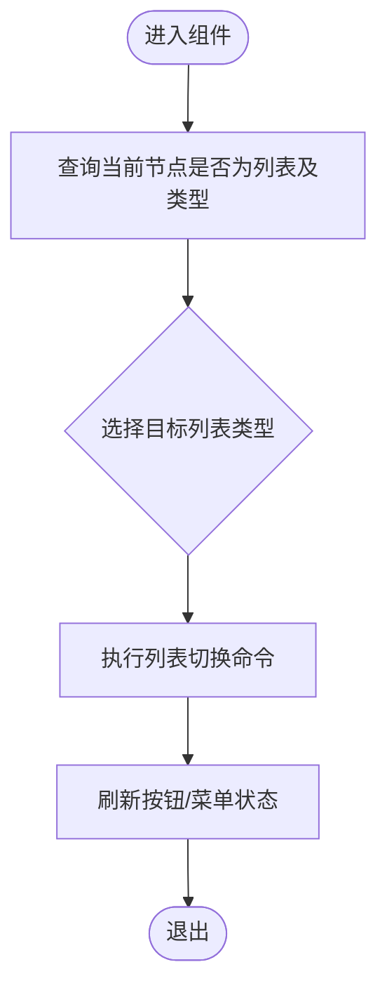
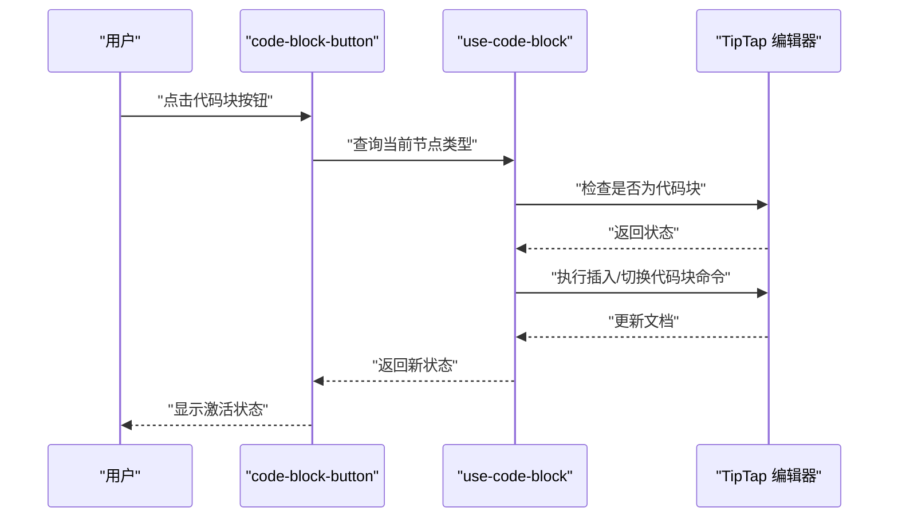
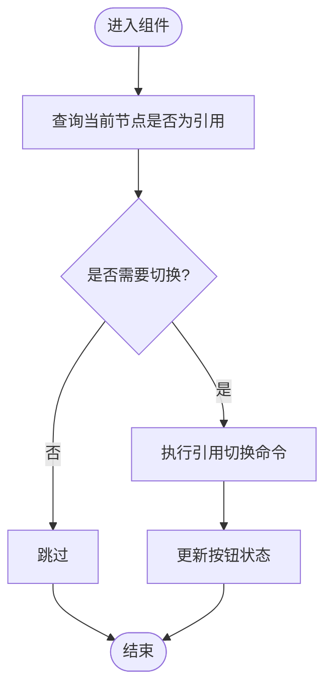
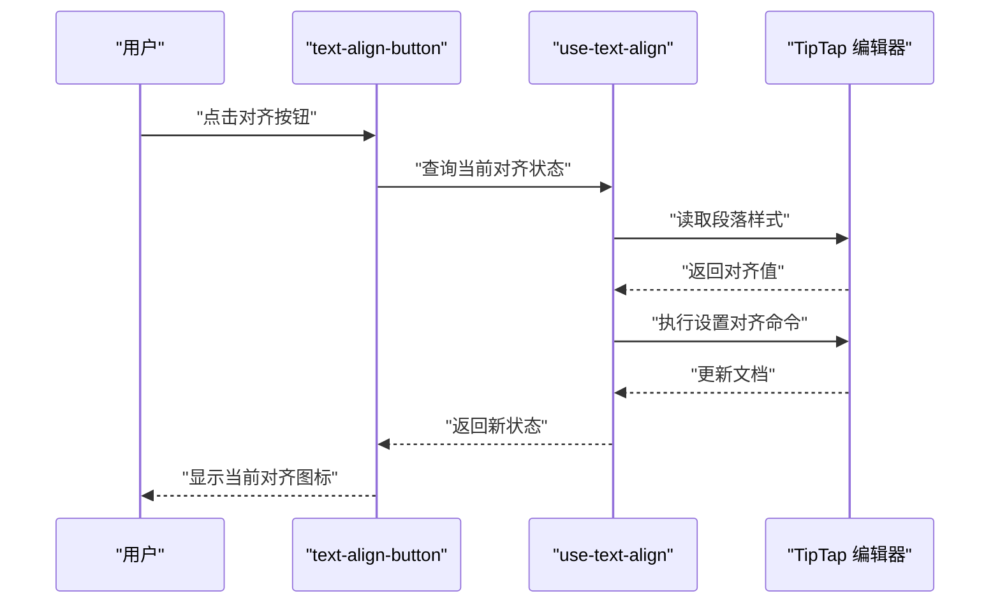
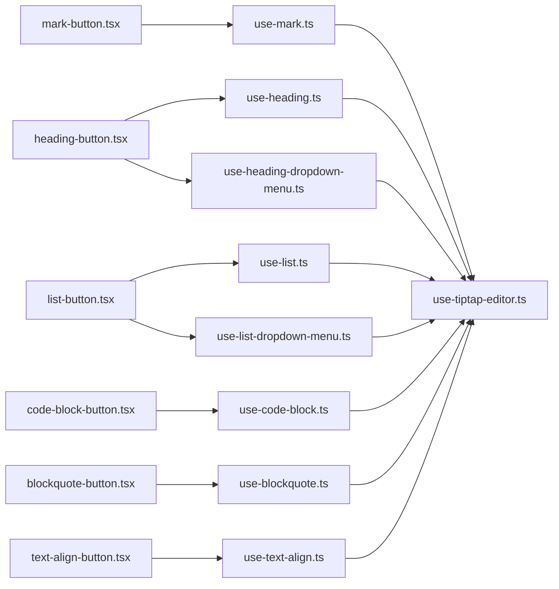

# 编辑器控制组件

<cite>
**本文引用的文件**   
- [src/components/tiptap-ui/mark-button.tsx](file://src/components/tiptap-ui/mark-button.tsx)
- [src/components/tiptap-ui/use-mark.ts](file://src/components/tiptap-ui/use-mark.ts)
- [src/components/tiptap-ui/heading-button.tsx](file://src/components/tiptap-ui/heading-button.tsx)
- [src/components/tiptap-ui/heading-dropdown-menu.tsx](file://src/components/tiptap-ui/heading-dropdown-menu.tsx)
- [src/components/tiptap-ui/use-heading.ts](file://src/components/tiptap-ui/use-heading.ts)
- [src/components/tiptap-ui/use-heading-dropdown-menu.ts](file://src/components/tiptap-ui/use-heading-dropdown-menu.ts)
- [src/components/tiptap-ui/list-button.tsx](file://src/components/tiptap-ui/list-button.tsx)
- [src/components/tiptap-ui/list-dropdown-menu.tsx](file://src/components/tiptap-ui/list-dropdown-menu.tsx)
- [src/components/tiptap-ui/use-list.ts](file://src/components/tiptap-ui/use-list.ts)
- [src/components/tiptap-ui/use-list-dropdown-menu.ts](file://src/components/tiptap-ui/use-list-dropdown-menu.ts)
- [src/components/tiptap-ui/code-block-button.tsx](file://src/components/tiptap-ui/code-block-button.tsx)
- [src/components/tiptap-ui/use-code-block.ts](file://src/components/tiptap-ui/use-code-block.ts)
- [src/components/tiptap-ui/blockquote-button.tsx](file://src/components/tiptap-ui/blockquote-button.tsx)
- [src/components/tiptap-ui/use-blockquote.ts](file://src/components/tiptap-ui/use-blockquote.ts)
- [src/components/tiptap-ui/text-align-button.tsx](file://src/components/tiptap-ui/text-align-button.tsx)
- [src/components/tiptap-ui/use-text-align.ts](file://src/components/tiptap-ui/use-text-align.ts)
- [src/hooks/use-tiptap-editor.ts](file://src/hooks/use-tiptap-editor.ts)
- [src/features/tiptap/SimpleEditor.tsx](file://src/features/tiptap/SimpleEditor.tsx)
- [src/features/tiptap/config.ts](file://src/features/tiptap/config.ts)
</cite>

## 目录
1. [简介](#简介)
2. [项目结构](#项目结构)
3. [核心组件](#核心组件)
4. [架构总览](#架构总览)
5. [详细组件分析](#详细组件分析)
6. [依赖关系分析](#依赖关系分析)
7. [性能考虑](#性能考虑)
8. [故障排查指南](#故障排查指南)
9. [结论](#结论)
10. [附录：自定义编辑按钮开发指南](#附录自定义编辑按钮开发指南)

## 简介
本技术文档聚焦于编辑器控制组件，围绕 TipTap 编辑器实现一系列工具栏按钮与交互逻辑，包括文本格式（mark）、标题选择（heading）、列表操作（list）、代码块（code-block）、引用（blockquote）以及文本对齐（text-align）。文档将详细说明各组件与 TipTap 的集成方式、状态管理、命令执行机制、激活状态检测与快捷键支持，并提供可复用的自定义编辑按钮开发指南。

## 项目结构
编辑器控制组件位于 src/components/tiptap-ui 目录下，采用“UI 组件 + Hook”的分层组织方式：
- UI 组件负责渲染与用户交互（如按钮、下拉菜单等）
- Hook 封装与 TipTap 编辑器的交互逻辑（查询当前状态、执行命令、注册快捷键等）
- 上层 SimpleEditor 组合这些组件并注入编辑器实例

图表来源
- [src/features/tiptap/SimpleEditor.tsx](file://src/features/tiptap/SimpleEditor.tsx)
- [src/features/tiptap/config.ts](file://src/features/tiptap/config.ts)
- [src/components/tiptap-ui/mark-button.tsx](file://src/components/tiptap-ui/mark-button.tsx)
- [src/components/tiptap-ui/heading-button.tsx](file://src/components/tiptap-ui/heading-button.tsx)
- [src/components/tiptap-ui/heading-dropdown-menu.tsx](file://src/components/tiptap-ui/heading-dropdown-menu.tsx)
- [src/components/tiptap-ui/list-button.tsx](file://src/components/tiptap-ui/list-button.tsx)
- [src/components/tiptap-ui/list-dropdown-menu.tsx](file://src/components/tiptap-ui/list-dropdown-menu.tsx)
- [src/components/tiptap-ui/code-block-button.tsx](file://src/components/tiptap-ui/code-block-button.tsx)
- [src/components/tiptap-ui/blockquote-button.tsx](file://src/components/tiptap-ui/blockquote-button.tsx)
- [src/components/tiptap-ui/text-align-button.tsx](file://src/components/tiptap-ui/text-align-button.tsx)
- [src/components/tiptap-ui/use-mark.ts](file://src/components/tiptap-ui/use-mark.ts)
- [src/components/tiptap-ui/use-heading.ts](file://src/components/tiptap-ui/use-heading.ts)
- [src/components/tiptap-ui/use-heading-dropdown-menu.ts](file://src/components/tiptap-ui/use-heading-dropdown-menu.ts)
- [src/components/tiptap-ui/use-list.ts](file://src/components/tiptap-ui/use-list.ts)
- [src/components/tiptap-ui/use-list-dropdown-menu.ts](file://src/components/tiptap-ui/use-list-dropdown-menu.ts)
- [src/components/tiptap-ui/use-code-block.ts](file://src/components/tiptap-ui/use-code-block.ts)
- [src/components/tiptap-ui/use-blockquote.ts](file://src/components/tiptap-ui/use-blockquote.ts)
- [src/components/tiptap-ui/use-text-align.ts](file://src/components/tiptap-ui/use-text-align.ts)
- [src/hooks/use-tiptap-editor.ts](file://src/hooks/use-tiptap-editor.ts)

章节来源
- [src/features/tiptap/SimpleEditor.tsx](file://src/features/tiptap/SimpleEditor.tsx)
- [src/features/tiptap/config.ts](file://src/features/tiptap/config.ts)
- [src/hooks/use-tiptap-editor.ts](file://src/hooks/use-tiptap-editor.ts)

## 核心组件
本节概述六大控制组件的职责与协作方式：
- mark-button：对选中文本应用或移除文本标记（如加粗、斜体、删除线等），通过 use-mark Hook 获取当前选中范围的状态并调用 TipTap 命令切换标记。
- heading-button：切换段落为指定级别的标题，配合 heading-dropdown-menu 提供多级标题选择；use-heading 与 use-heading-dropdown-menu 分别处理当前节点类型与下拉菜单行为。
- list-button：在有序列表、无序列表、待办列表之间切换，使用 use-list 与 use-list-dropdown-menu 管理列表类型与菜单交互。
- code-block-button：插入或切换代码块节点，use-code-block 负责判断当前是否处于代码块上下文并触发相应命令。
- blockquote-button：插入或切换引用块，use-blockquote 负责引用状态的检测与切换。
- text-align-button：设置段落文本对齐方式（左、中、右、两端对齐），use-text-align 负责对齐状态检测与命令执行。

章节来源
- [src/components/tiptap-ui/mark-button.tsx](file://src/components/tiptap-ui/mark-button.tsx)
- [src/components/tiptap-ui/use-mark.ts](file://src/components/tiptap-ui/use-mark.ts)
- [src/components/tiptap-ui/heading-button.tsx](file://src/components/tiptap-ui/heading-button.tsx)
- [src/components/tiptap-ui/heading-dropdown-menu.tsx](file://src/components/tiptap-ui/heading-dropdown-menu.tsx)
- [src/components/tiptap-ui/use-heading.ts](file://src/components/tiptap-ui/use-heading.ts)
- [src/components/tiptap-ui/use-heading-dropdown-menu.ts](file://src/components/tiptap-ui/use-heading-dropdown-menu.ts)
- [src/components/tiptap-ui/list-button.tsx](file://src/components/tiptap-ui/list-button.tsx)
- [src/components/tiptap-ui/list-dropdown-menu.tsx](file://src/components/tiptap-ui/list-dropdown-menu.tsx)
- [src/components/tiptap-ui/use-list.ts](file://src/components/tiptap-ui/use-list.ts)
- [src/components/tiptap-ui/use-list-dropdown-menu.ts](file://src/components/tiptap-ui/use-list-dropdown-menu.ts)
- [src/components/tiptap-ui/code-block-button.tsx](file://src/components/tiptap-ui/code-block-button.tsx)
- [src/components/tiptap-ui/use-code-block.ts](file://src/components/tiptap-ui/use-code-block.ts)
- [src/components/tiptap-ui/blockquote-button.tsx](file://src/components/tiptap-ui/blockquote-button.tsx)
- [src/components/tiptap-ui/use-blockquote.ts](file://src/components/tiptap-ui/use-blockquote.ts)
- [src/components/tiptap-ui/text-align-button.tsx](file://src/components/tiptap-ui/text-align-button.tsx)
- [src/components/tiptap-ui/use-text-align.ts](file://src/components/tiptap-ui/use-text-align.ts)

## 架构总览
整体架构遵循“UI 组件 -> Hook -> TipTap 编辑器实例”的单向数据流：
- UI 组件仅负责渲染与事件绑定
- Hook 封装 TipTap 的查询与命令调用，暴露布尔状态与回调函数
- 编辑器实例由 use-tiptap-editor 提供，并在 SimpleEditor 中集中初始化与配置

图表来源
- [src/components/tiptap-ui/mark-button.tsx](file://src/components/tiptap-ui/mark-button.tsx)
- [src/components/tiptap-ui/use-mark.ts](file://src/components/tiptap-ui/use-mark.ts)
- [src/components/tiptap-ui/heading-button.tsx](file://src/components/tiptap-ui/heading-button.tsx)
- [src/components/tiptap-ui/use-heading.ts](file://src/components/tiptap-ui/use-heading.ts)
- [src/components/tiptap-ui/list-button.tsx](file://src/components/tiptap-ui/list-button.tsx)
- [src/components/tiptap-ui/use-list.ts](file://src/components/tiptap-ui/use-list.ts)
- [src/components/tiptap-ui/code-block-button.tsx](file://src/components/tiptap-ui/code-block-button.tsx)
- [src/components/tiptap-ui/use-code-block.ts](file://src/components/tiptap-ui/use-code-block.ts)
- [src/components/tiptap-ui/blockquote-button.tsx](file://src/components/tiptap-ui/blockquote-button.tsx)
- [src/components/tiptap-ui/use-blockquote.ts](file://src/components/tiptap-ui/use-blockquote.ts)
- [src/components/tiptap-ui/text-align-button.tsx](file://src/components/tiptap-ui/text-align-button.tsx)
- [src/components/tiptap-ui/use-text-align.ts](file://src/components/tiptap-ui/use-text-align.ts)
- [src/hooks/use-tiptap-editor.ts](file://src/hooks/use-tiptap-editor.ts)

## 详细组件分析

### 文本格式按钮（mark-button）
- 职责：对选中文本应用或移除文本标记（如加粗、斜体、下划线、删除线等）
- 状态管理：use-mark 根据当前选区中的标记属性返回布尔状态，用于按钮高亮
- 命令执行：调用 TipTap 的标记命令进行切换
- 快捷键：use-mark 内部可注册快捷键以快速切换标记
- 交互流程：点击按钮 -> 查询状态 -> 执行命令 -> 更新 UI

图表来源
- [src/components/tiptap-ui/mark-button.tsx](file://src/components/tiptap-ui/mark-button.tsx)
- [src/components/tiptap-ui/use-mark.ts](file://src/components/tiptap-ui/use-mark.ts)

章节来源
- [src/components/tiptap-ui/mark-button.tsx](file://src/components/tiptap-ui/mark-button.tsx)
- [src/components/tiptap-ui/use-mark.ts](file://src/components/tiptap-ui/use-mark.ts)

### 标题选择按钮（heading-button）
- 职责：将当前段落切换为指定级别标题（H1-H6）
- 状态管理：use-heading 检测当前节点是否为标题及级别；use-heading-dropdown-menu 管理下拉菜单展开与选择
- 命令执行：调用 TipTap 的标题命令设置节点类型与级别
- 快捷键：可在 Hook 中注册快捷键快速切换标题级别
- 交互流程：点击按钮或菜单项 -> 查询当前节点类型 -> 执行标题命令 -> 更新 UI

图表来源
- [src/components/tiptap-ui/heading-button.tsx](file://src/components/tiptap-ui/heading-button.tsx)
- [src/components/tiptap-ui/heading-dropdown-menu.tsx](file://src/components/tiptap-ui/heading-dropdown-menu.tsx)
- [src/components/tiptap-ui/use-heading.ts](file://src/components/tiptap-ui/use-heading.ts)
- [src/components/tiptap-ui/use-heading-dropdown-menu.ts](file://src/components/tiptap-ui/use-heading-dropdown-menu.ts)

章节来源
- [src/components/tiptap-ui/heading-button.tsx](file://src/components/tiptap-ui/heading-button.tsx)
- [src/components/tiptap-ui/heading-dropdown-menu.tsx](file://src/components/tiptap-ui/heading-dropdown-menu.tsx)
- [src/components/tiptap-ui/use-heading.ts](file://src/components/tiptap-ui/use-heading.ts)
- [src/components/tiptap-ui/use-heading-dropdown-menu.ts](file://src/components/tiptap-ui/use-heading-dropdown-menu.ts)

### 列表操作按钮（list-button）
- 职责：在有序列表、无序列表、待办列表之间切换
- 状态管理：use-list 检测当前节点是否为列表及其类型；use-list-dropdown-menu 管理菜单交互
- 命令执行：调用 TipTap 的列表命令创建或切换列表类型
- 快捷键：可在 Hook 中注册快捷键快速切换列表类型
- 交互流程：点击按钮或菜单项 -> 查询当前列表状态 -> 执行列表命令 -> 更新 UI

图表来源
- [src/components/tiptap-ui/list-button.tsx](file://src/components/tiptap-ui/list-button.tsx)
- [src/components/tiptap-ui/list-dropdown-menu.tsx](file://src/components/tiptap-ui/list-dropdown-menu.tsx)
- [src/components/tiptap-ui/use-list.ts](file://src/components/tiptap-ui/use-list.ts)
- [src/components/tiptap-ui/use-list-dropdown-menu.ts](file://src/components/tiptap-ui/use-list-dropdown-menu.ts)

章节来源
- [src/components/tiptap-ui/list-button.tsx](file://src/components/tiptap-ui/list-button.tsx)
- [src/components/tiptap-ui/list-dropdown-menu.tsx](file://src/components/tiptap-ui/list-dropdown-menu.tsx)
- [src/components/tiptap-ui/use-list.ts](file://src/components/tiptap-ui/use-list.ts)
- [src/components/tiptap-ui/use-list-dropdown-menu.ts](file://src/components/tiptap-ui/use-list-dropdown-menu.ts)

### 代码块按钮（code-block-button）
- 职责：插入或切换代码块节点
- 状态管理：use-code-block 检测当前节点是否为代码块
- 命令执行：调用 TipTap 的代码块命令插入或切换
- 快捷键：可在 Hook 中注册快捷键快速插入代码块
- 交互流程：点击按钮 -> 查询当前节点类型 -> 执行代码块命令 -> 更新 UI

图表来源
- [src/components/tiptap-ui/code-block-button.tsx](file://src/components/tiptap-ui/code-block-button.tsx)
- [src/components/tiptap-ui/use-code-block.ts](file://src/components/tiptap-ui/use-code-block.ts)

章节来源
- [src/components/tiptap-ui/code-block-button.tsx](file://src/components/tiptap-ui/code-block-button.tsx)
- [src/components/tiptap-ui/use-code-block.ts](file://src/components/tiptap-ui/use-code-block.ts)

### 引用按钮（blockquote-button）
- 职责：插入或切换引用块
- 状态管理：use-blockquote 检测当前节点是否为引用
- 命令执行：调用 TipTap 的引用命令插入或切换
- 快捷键：可在 Hook 中注册快捷键快速插入引用
- 交互流程：点击按钮 -> 查询当前节点类型 -> 执行引用命令 -> 更新 UI

图表来源
- [src/components/tiptap-ui/blockquote-button.tsx](file://src/components/tiptap-ui/blockquote-button.tsx)
- [src/components/tiptap-ui/use-blockquote.ts](file://src/components/tiptap-ui/use-blockquote.ts)

章节来源
- [src/components/tiptap-ui/blockquote-button.tsx](file://src/components/tiptap-ui/blockquote-button.tsx)
- [src/components/tiptap-ui/use-blockquote.ts](file://src/components/tiptap-ui/use-blockquote.ts)

### 文本对齐按钮（text-align-button）
- 职责：设置段落文本对齐方式（左、中、右、两端对齐）
- 状态管理：use-text-align 检测当前段落的对齐样式
- 命令执行：调用 TipTap 的对齐命令设置样式
- 快捷键：可在 Hook 中注册快捷键快速切换对齐方式
- 交互流程：点击按钮 -> 查询当前对齐状态 -> 执行对齐命令 -> 更新 UI

图表来源
- [src/components/tiptap-ui/text-align-button.tsx](file://src/components/tiptap-ui/text-align-button.tsx)
- [src/components/tiptap-ui/use-text-align.ts](file://src/components/tiptap-ui/use-text-align.ts)

章节来源
- [src/components/tiptap-ui/text-align-button.tsx](file://src/components/tiptap-ui/text-align-button.tsx)
- [src/components/tiptap-ui/use-text-align.ts](file://src/components/tiptap-ui/use-text-align.ts)

## 依赖关系分析
- 组件耦合度低：每个按钮组件只依赖对应的 Hook，避免跨组件直接访问编辑器实例
- Hook 内聚度高：每个 Hook 封装单一功能的 TipTap 查询与命令，便于复用与测试
- 编辑器实例集中管理：use-tiptap-editor 提供统一入口，SimpleEditor 负责组装与配置

图表来源
- [src/components/tiptap-ui/mark-button.tsx](file://src/components/tiptap-ui/mark-button.tsx)
- [src/components/tiptap-ui/use-mark.ts](file://src/components/tiptap-ui/use-mark.ts)
- [src/components/tiptap-ui/heading-button.tsx](file://src/components/tiptap-ui/heading-button.tsx)
- [src/components/tiptap-ui/use-heading.ts](file://src/components/tiptap-ui/use-heading.ts)
- [src/components/tiptap-ui/use-heading-dropdown-menu.ts](file://src/components/tiptap-ui/use-heading-dropdown-menu.ts)
- [src/components/tiptap-ui/list-button.tsx](file://src/components/tiptap-ui/list-button.tsx)
- [src/components/tiptap-ui/use-list.ts](file://src/components/tiptap-ui/use-list.ts)
- [src/components/tiptap-ui/use-list-dropdown-menu.ts](file://src/components/tiptap-ui/use-list-dropdown-menu.ts)
- [src/components/tiptap-ui/code-block-button.tsx](file://src/components/tiptap-ui/code-block-button.tsx)
- [src/components/tiptap-ui/use-code-block.ts](file://src/components/tiptap-ui/use-code-block.ts)
- [src/components/tiptap-ui/blockquote-button.tsx](file://src/components/tiptap-ui/blockquote-button.tsx)
- [src/components/tiptap-ui/use-blockquote.ts](file://src/components/tiptap-ui/use-blockquote.ts)
- [src/components/tiptap-ui/text-align-button.tsx](file://src/components/tiptap-ui/text-align-button.tsx)
- [src/components/tiptap-ui/use-text-align.ts](file://src/components/tiptap-ui/use-text-align.ts)
- [src/hooks/use-tiptap-editor.ts](file://src/hooks/use-tiptap-editor.ts)

章节来源
- [src/hooks/use-tiptap-editor.ts](file://src/hooks/use-tiptap-editor.ts)
- [src/features/tiptap/SimpleEditor.tsx](file://src/features/tiptap/SimpleEditor.tsx)
- [src/features/tiptap/config.ts](file://src/features/tiptap/config.ts)

## 性能考虑
- 状态查询最小化：Hook 仅在必要时机查询编辑器状态，避免频繁重渲染
- 命令批量执行：复杂操作尽量合并为单次命令，减少文档变更次数
- 事件节流：高频输入场景（如实时预览）可使用节流策略降低计算开销
- 组件拆分：将重型 UI 与轻量 Hook 分离，提升可维护性与可测试性

## 故障排查指南
- 按钮未高亮：确认 Hook 是否正确读取当前选区/节点状态，检查 TipTap 扩展是否启用
- 命令无效：检查编辑器实例是否正确注入，确认命令名称与参数是否符合 TipTap API
- 快捷键不生效：确认快捷键注册是否在编辑器生命周期内完成，避免重复注册或冲突
- 菜单状态异常：检查下拉菜单 Hook 的状态同步逻辑，确保选择后正确关闭并更新 UI

## 结论
编辑器控制组件通过“UI 组件 + Hook”的分层设计，实现了与 TipTap 编辑器的松耦合集成。各组件职责清晰、状态管理明确、命令执行可靠，并支持快捷键以提升用户体验。基于此模式，开发者可以快速扩展新的编辑功能并保持代码的可维护性与一致性。

## 附录：自定义编辑按钮开发指南
- 步骤一：定义 Hook
  - 在 src/components/tiptap-ui 下新建 use-xxx.ts
  - 使用 use-tiptap-editor 提供的编辑器实例进行状态查询与命令执行
  - 如需快捷键，在 Hook 中注册快捷键监听
- 步骤二：实现 UI 组件
  - 在 src/components/tiptap-ui 下新建 xxx-button.tsx
  - 从 Hook 中解构状态与回调，绑定点击事件与键盘事件
  - 根据状态渲染激活/非激活样式
- 步骤三：集成到编辑器
  - 在 SimpleEditor 中引入并放置按钮组件
  - 确保编辑器配置中包含必要的 TipTap 扩展
- 最佳实践
  - 保持 Hook 纯逻辑，UI 组件仅负责渲染
  - 使用一致的命名约定与错误处理策略
  - 为复杂交互编写单元测试，覆盖状态分支与边界条件