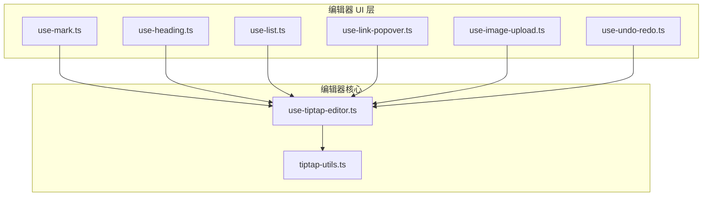
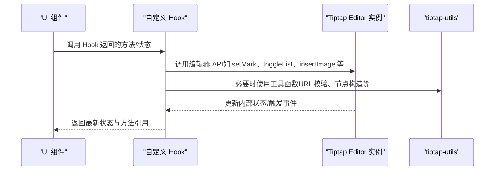
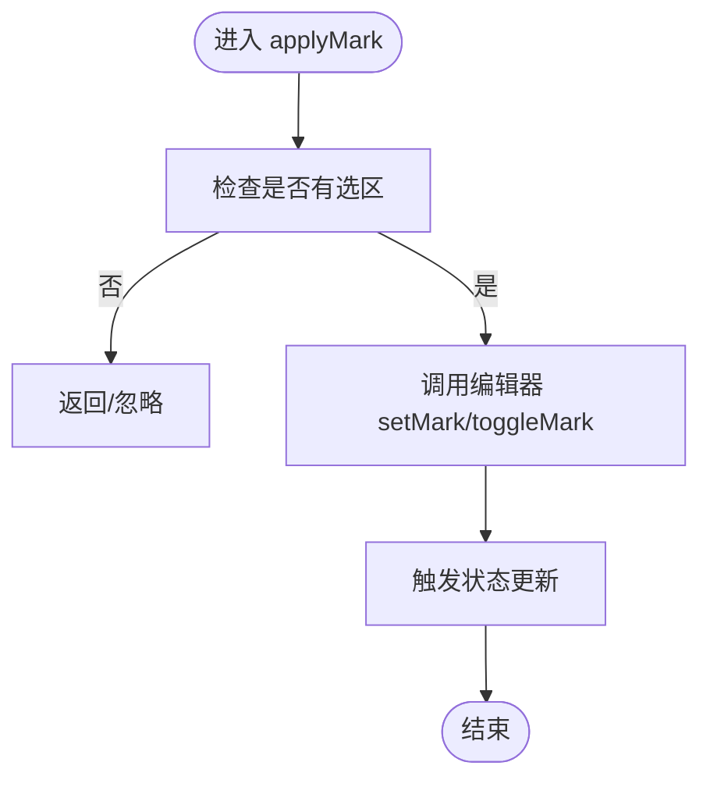
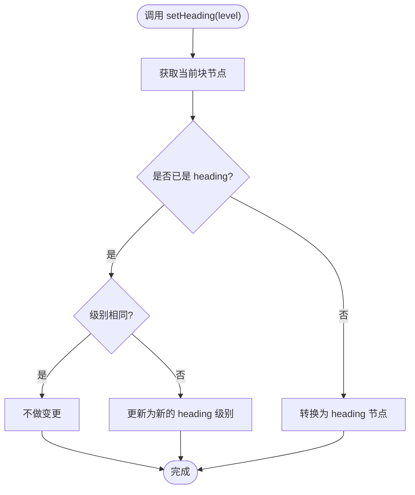
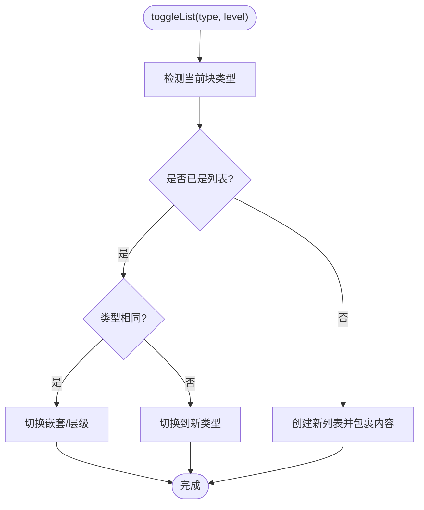
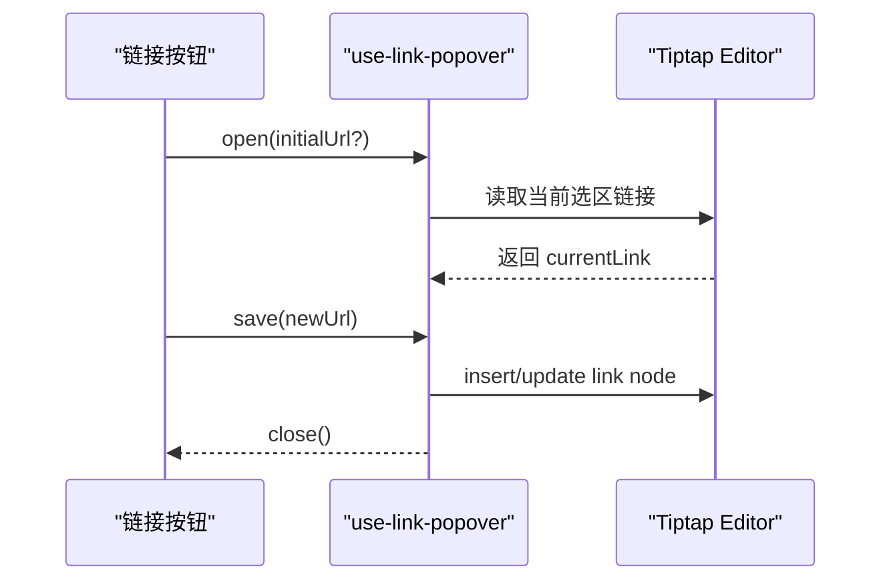
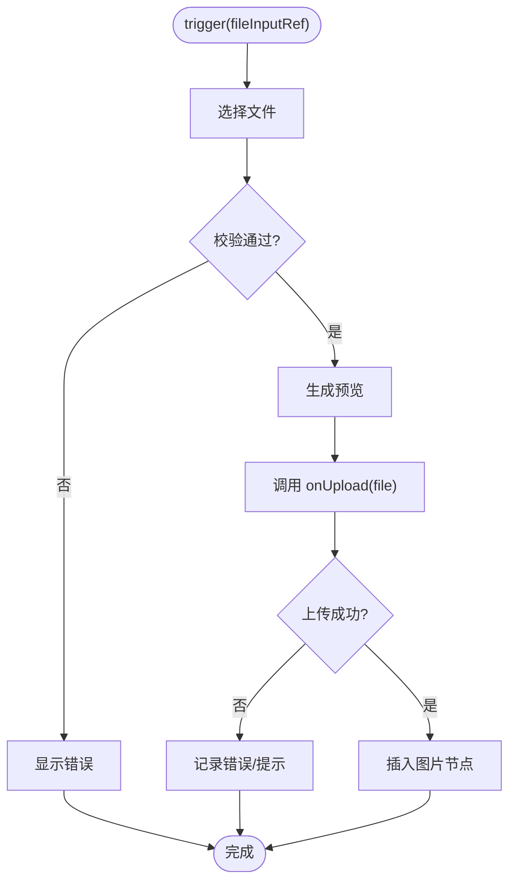
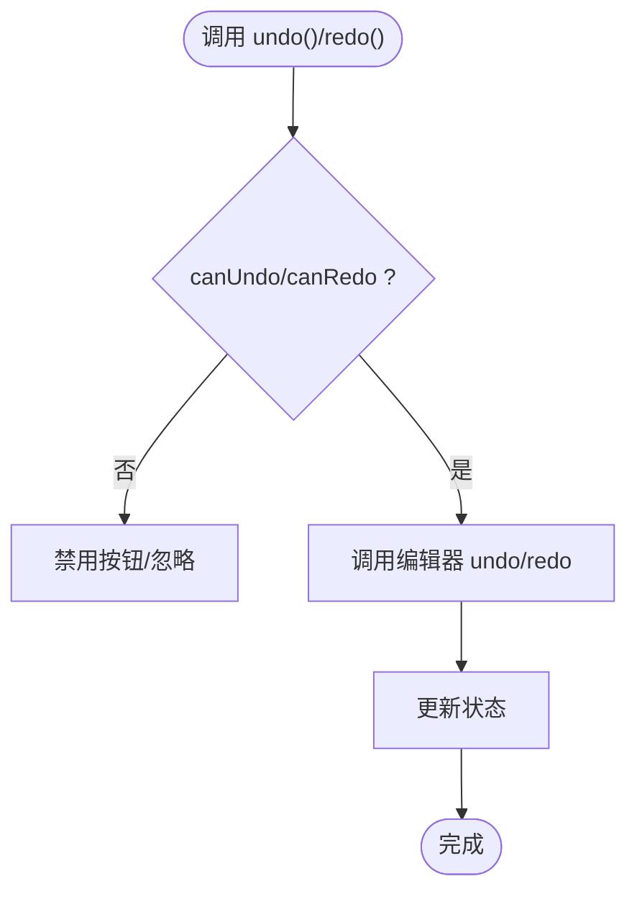
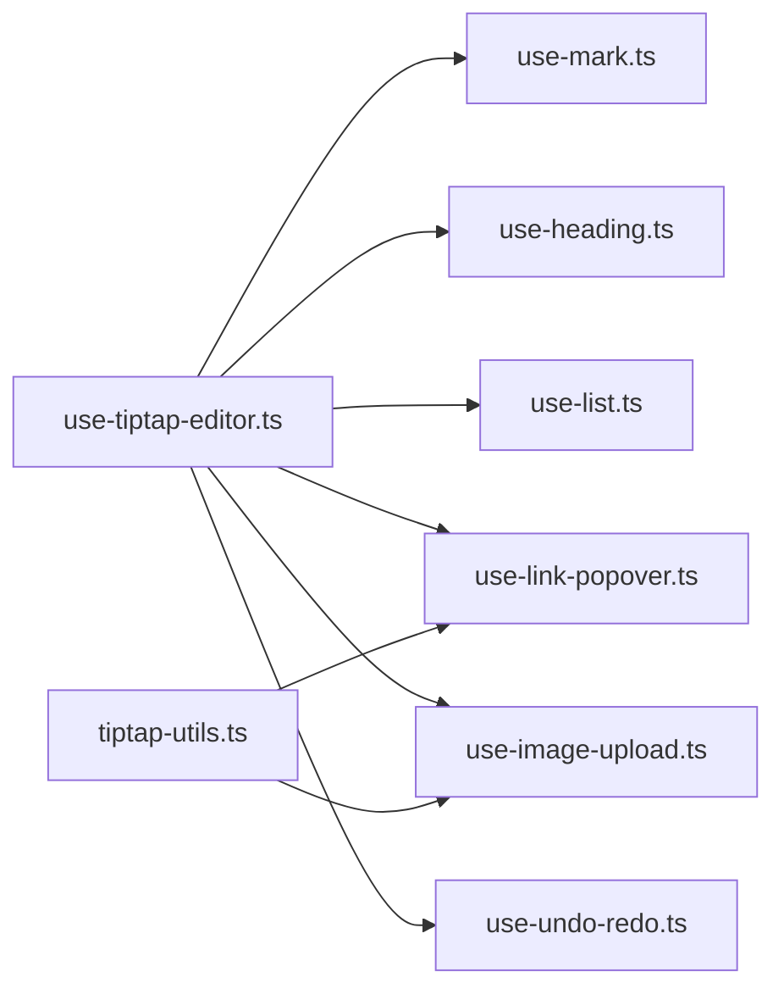

# 自定义 Hook 库

<cite>
**本文引用的文件**   
- [use-mark.ts](file://src/components/tiptap-ui/use-mark.ts)
- [use-heading.ts](file://src/components/tiptap-ui/use-heading.ts)
- [use-list.ts](file://src/components/tiptap-ui/use-list.ts)
- [use-link-popover.ts](file://src/components/tiptap-ui/use-link-popover.ts)
- [use-image-upload.ts](file://src/components/tiptap-ui/use-image-upload.ts)
- [use-undo-redo.ts](file://src/components/tiptap-ui/use-undo-redo.ts)
- [use-tiptap-editor.ts](file://src/hooks/use-tiptap-editor.ts)
- [tiptap-utils.ts](file://src/lib/tiptap-utils.ts)
</cite>

## 目录
1. [简介](#简介)
2. [项目结构](#项目结构)
3. [核心组件](#核心组件)
4. [架构总览](#架构总览)
5. [详细组件分析](#详细组件分析)
6. [依赖关系分析](#依赖关系分析)
7. [性能考量](#性能考量)
8. [故障排查指南](#故障排查指南)
9. [结论](#结论)
10. [附录：开发规范与最佳实践](#附录开发规范与最佳实践)

## 简介
本技术文档聚焦于编辑器 UI 层的自定义 Hook 集合，覆盖以下能力：
- use-mark：文本格式（加粗、斜体、删除线等）
- use-heading：标题操作（切换/设置各级标题）
- use-list：列表管理（有序、无序、任务列表）
- use-link-popover：链接弹窗（插入/编辑链接）
- use-image-upload：图片上传（本地选择与上传流程）
- use-undo-redo：撤销重做（基于编辑器历史栈）

文档将逐一说明各 Hook 的参数配置、返回值结构、状态管理逻辑，并解释 Hook 之间的依赖关系与组合使用方法。同时提供自定义 Hook 的开发规范与最佳实践，帮助团队在 Tiptap 编辑器生态中高效复用与扩展。

## 项目结构
这些 Hook 位于编辑器 UI 层，主要职责是封装对 Tiptap Editor 实例的调用，暴露简洁的 React 接口供按钮、下拉菜单、气泡菜单等 UI 组件消费。

图表来源
- [use-mark.ts](file://src/components/tiptap-ui/use-mark.ts)
- [use-heading.ts](file://src/components/tiptap-ui/use-heading.ts)
- [use-list.ts](file://src/components/tiptap-ui/use-list.ts)
- [use-link-popover.ts](file://src/components/tiptap-ui/use-link-popover.ts)
- [use-image-upload.ts](file://src/components/tiptap-ui/use-image-upload.ts)
- [use-undo-redo.ts](file://src/components/tiptap-ui/use-undo-redo.ts)
- [use-tiptap-editor.ts](file://src/hooks/use-tiptap-editor.ts)
- [tiptap-utils.ts](file://src/lib/tiptap-utils.ts)

章节来源
- [use-mark.ts](file://src/components/tiptap-ui/use-mark.ts)
- [use-heading.ts](file://src/components/tiptap-ui/use-heading.ts)
- [use-list.ts](file://src/components/tiptap-ui/use-list.ts)
- [use-link-popover.ts](file://src/components/tiptap-ui/use-link-popover.ts)
- [use-image-upload.ts](file://src/components/tiptap-ui/use-image-upload.ts)
- [use-undo-redo.ts](file://src/components/tiptap-ui/use-undo-redo.ts)
- [use-tiptap-editor.ts](file://src/hooks/use-tiptap-editor.ts)
- [tiptap-utils.ts](file://src/lib/tiptap-utils.ts)

## 核心组件
本节概述每个 Hook 的职责与典型用法场景：
- use-mark：对选中文本应用或移除文本标记（如加粗、斜体、下划线、删除线、高亮等），并提供当前选中范围是否已激活某标记的状态查询。
- use-heading：在当前光标位置或选区处设置段落为指定级别的标题，支持多级标题切换与层级判断。
- use-list：创建/切换有序列表、无序列表与任务列表；支持嵌套、缩进与层级控制。
- use-link-popover：打开/关闭链接气泡弹窗，完成链接插入与编辑，处理 URL 校验与焦点恢复。
- use-image-upload：触发文件选择、读取本地预览、调用上传接口、将结果以图片节点插入编辑器。
- use-undo-redo：封装撤销与重做命令，暴露可执行函数与状态（是否可撤销/重做）。

章节来源
- [use-mark.ts](file://src/components/tiptap-ui/use-mark.ts)
- [use-heading.ts](file://src/components/tiptap-ui/use-heading.ts)
- [use-list.ts](file://src/components/tiptap-ui/use-list.ts)
- [use-link-popover.ts](file://src/components/tiptap-ui/use-link-popover.ts)
- [use-image-upload.ts](file://src/components/tiptap-ui/use-image-upload.ts)
- [use-undo-redo.ts](file://src/components/tiptap-ui/use-undo-redo.ts)

## 架构总览
Hook 通过统一的编辑器入口 use-tiptap-editor 获取 Tiptap Editor 实例，再调用其 API 完成具体操作。部分通用工具方法由 tiptap-utils 提供。

图表来源
- [use-tiptap-editor.ts](file://src/hooks/use-tiptap-editor.ts)
- [tiptap-utils.ts](file://src/lib/tiptap-utils.ts)
- [use-mark.ts](file://src/components/tiptap-ui/use-mark.ts)
- [use-heading.ts](file://src/components/tiptap-ui/use-heading.ts)
- [use-list.ts](file://src/components/tiptap-ui/use-list.ts)
- [use-link-popover.ts](file://src/components/tiptap-ui/use-link-popover.ts)
- [use-image-upload.ts](file://src/components/tiptap-ui/use-image-upload.ts)
- [use-undo-redo.ts](file://src/components/tiptap-ui/use-undo-redo.ts)

## 详细组件分析

### use-mark（文本格式）
- 功能
  - 对当前选区应用或移除文本标记（如 bold、italic、underline、strike、code、highlight 等）。
  - 提供“当前选区是否已激活某标记”的状态查询，用于按钮高亮显示。
- 参数
  - 通常无需额外参数；或在某些实现中接受标记类型与可选属性。
- 返回值
  - 方法：applyMark(type, attrs?)、removeMark(type)、toggleMark(type, attrs?)
  - 状态：isActive(type, attrs?) 布尔值，表示当前选区是否处于该标记状态
- 状态管理逻辑
  - 监听编辑器 selection/mark 变化，计算 isActive 状态。
  - 调用编辑器 API 修改选区标记，不直接维护复杂状态，保持单一数据源。
- 错误处理
  - 当无选区或编辑器未就绪时，跳过操作或返回默认状态。
- 性能考虑
  - 使用稳定引用与最小化重渲染策略，避免频繁订阅无关变更。

图表来源
- [use-mark.ts](file://src/components/tiptap-ui/use-mark.ts)
- [use-tiptap-editor.ts](file://src/hooks/use-tiptap-editor.ts)

章节来源
- [use-mark.ts](file://src/components/tiptap-ui/use-mark.ts)
- [use-tiptap-editor.ts](file://src/hooks/use-tiptap-editor.ts)

### use-heading（标题操作）
- 功能
  - 将当前段落设置为指定级别（h1-h6）的标题，或根据现有标题层级进行切换。
- 参数
  - level：数字 1-6，表示目标标题级别。
- 返回值
  - 方法：setHeading(level)、toggleHeading(level)
  - 状态：isHeading(level) 布尔值，表示当前光标所在块是否为该级别标题
- 状态管理逻辑
  - 基于编辑器节点类型与属性判断当前块是否为 heading 及级别。
  - 切换时优先保留内容，仅改变节点类型与属性。
- 错误处理
  - 非 heading 节点降级为普通段落后再提升为 heading，保证一致性。
- 性能考虑
  - 仅在光标/选区变化时重新计算 isHeading，减少不必要的渲染。

图表来源
- [use-heading.ts](file://src/components/tiptap-ui/use-heading.ts)
- [use-tiptap-editor.ts](file://src/hooks/use-tiptap-editor.ts)

章节来源
- [use-heading.ts](file://src/components/tiptap-ui/use-heading.ts)
- [use-tiptap-editor.ts](file://src/hooks/use-tiptap-editor.ts)

### use-list（列表管理）
- 功能
  - 创建/切换有序列表、无序列表与任务列表；支持嵌套与层级调整。
- 参数
  - type：list-type（ordered、unordered、task）
  - level：可选，用于嵌套层级控制
- 返回值
  - 方法：toggleList(type, level?)、indent()、outdent()
  - 状态：isList(type) 布尔值，表示当前选区是否在对应类型的列表中
- 状态管理逻辑
  - 检测当前块是否为 list 节点及其类型，动态切换。
  - 嵌套通过 parent/child 关系与缩进属性维护。
- 错误处理
  - 非列表块转为列表时，包裹内容并保持光标位置合理。
- 性能考虑
  - 批量更新嵌套层级，避免多次重排。

图表来源
- [use-list.ts](file://src/components/tiptap-ui/use-list.ts)
- [use-tiptap-editor.ts](file://src/hooks/use-tiptap-editor.ts)

章节来源
- [use-list.ts](file://src/components/tiptap-ui/use-list.ts)
- [use-tiptap-editor.ts](file://src/hooks/use-tiptap-editor.ts)

### use-link-popover（链接弹窗）
- 功能
  - 打开/关闭链接气泡弹窗，完成链接插入与编辑；支持 URL 校验与焦点恢复。
- 参数
  - 通常无需参数；或通过上下文传入初始链接值。
- 返回值
  - 状态：isOpen、initialUrl、currentLink
  - 方法：open(url?)、close()、save(url)
- 状态管理逻辑
  - 打开时读取当前选区中的链接信息作为初始值。
  - 保存时校验 URL，插入或更新 link 节点，并关闭弹窗。
- 错误处理
  - URL 无效时提示用户或拒绝保存。
- 性能考虑
  - 弹窗状态与编辑器选区解耦，避免频繁同步导致抖动。

图表来源
- [use-link-popover.ts](file://src/components/tiptap-ui/use-link-popover.ts)
- [use-tiptap-editor.ts](file://src/hooks/use-tiptap-editor.ts)
- [tiptap-utils.ts](file://src/lib/tiptap-utils.ts)

章节来源
- [use-link-popover.ts](file://src/components/tiptap-ui/use-link-popover.ts)
- [use-tiptap-editor.ts](file://src/hooks/use-tiptap-editor.ts)
- [tiptap-utils.ts](file://src/lib/tiptap-utils.ts)

### use-image-upload（图片上传）
- 功能
  - 触发文件选择、读取本地预览、调用上传接口、将结果以图片节点插入编辑器。
- 参数
  - onUpload(file): Promise<{url: string}> 或类似结构，用于上传并返回图片地址。
- 返回值
  - 方法：trigger(fileInputRef?)、insertFromUrl(url)
  - 状态：loading、error、previewUrl
- 状态管理逻辑
  - 选择文件后生成预览，调用 onUpload 获取远端地址，成功后插入图片节点。
  - 失败时记录 error 并提示用户。
- 错误处理
  - 文件类型/大小校验、网络异常捕获与重试策略。
- 性能考虑
  - 大文件分片上传、进度反馈与取消上传。

图表来源
- [use-image-upload.ts](file://src/components/tiptap-ui/use-image-upload.ts)
- [use-tiptap-editor.ts](file://src/hooks/use-tiptap-editor.ts)

章节来源
- [use-image-upload.ts](file://src/components/tiptap-ui/use-image-upload.ts)
- [use-tiptap-editor.ts](file://src/hooks/use-tiptap-editor.ts)

### use-undo-redo（撤销重做）
- 功能
  - 封装撤销与重做命令，暴露可执行函数与状态（是否可撤销/重做）。
- 参数
  - 通常无需参数；或可配置最大历史步数。
- 返回值
  - 方法：undo()、redo()
  - 状态：canUndo、canRedo
- 状态管理逻辑
  - 监听编辑器 history 栈变化，更新 canUndo/canRedo。
  - 调用编辑器 undo/redo 方法执行操作。
- 错误处理
  - 在不可撤销/重做时禁用按钮，避免重复调用。
- 性能考虑
  - 合并连续操作，限制历史长度，防止内存增长。

图表来源
- [use-undo-redo.ts](file://src/components/tiptap-ui/use-undo-redo.ts)
- [use-tiptap-editor.ts](file://src/hooks/use-tiptap-editor.ts)

章节来源
- [use-undo-redo.ts](file://src/components/tiptap-ui/use-undo-redo.ts)
- [use-tiptap-editor.ts](file://src/hooks/use-tiptap-editor.ts)

## 依赖关系分析
- 统一入口
  - 所有 Hook 均依赖 use-tiptap-editor 提供的编辑器实例，确保操作一致性与生命周期安全。
- 工具函数
  - tiptap-utils 提供通用工具（如 URL 校验、节点构造辅助），被多个 Hook 复用。
- 组合使用
  - 常见组合：use-heading + use-list（标题下的列表）、use-mark + use-link-popover（在链接内应用格式）、use-image-upload + use-undo-redo（上传图片后可撤销）。

图表来源
- [use-tiptap-editor.ts](file://src/hooks/use-tiptap-editor.ts)
- [tiptap-utils.ts](file://src/lib/tiptap-utils.ts)
- [use-mark.ts](file://src/components/tiptap-ui/use-mark.ts)
- [use-heading.ts](file://src/components/tiptap-ui/use-heading.ts)
- [use-list.ts](file://src/components/tiptap-ui/use-list.ts)
- [use-link-popover.ts](file://src/components/tiptap-ui/use-link-popover.ts)
- [use-image-upload.ts](file://src/components/tiptap-ui/use-image-upload.ts)
- [use-undo-redo.ts](file://src/components/tiptap-ui/use-undo-redo.ts)

章节来源
- [use-tiptap-editor.ts](file://src/hooks/use-tiptap-editor.ts)
- [tiptap-utils.ts](file://src/lib/tiptap-utils.ts)
- [use-mark.ts](file://src/components/tiptap-ui/use-mark.ts)
- [use-heading.ts](file://src/components/tiptap-ui/use-heading.ts)
- [use-list.ts](file://src/components/tiptap-ui/use-list.ts)
- [use-link-popover.ts](file://src/components/tiptap-ui/use-link-popover.ts)
- [use-image-upload.ts](file://src/components/tiptap-ui/use-image-upload.ts)
- [use-undo-redo.ts](file://src/components/tiptap-ui/use-undo-redo.ts)

## 性能考量
- 最小化重渲染
  - 使用稳定引用与选择性订阅，避免每次编辑器事件都触发全量更新。
- 批量操作
  - 列表嵌套、多标记应用时尽量合并为一次事务，减少重排。
- 历史管理
  - 限制最大历史步数，避免内存占用过高。
- 资源加载
  - 图片上传采用懒加载与压缩策略，减少首屏压力。

## 故障排查指南
- 常见问题
  - 链接无效：检查 URL 校验逻辑与输入格式。
  - 图片上传失败：确认 onUpload 回调返回结构与网络状态。
  - 撤销重做无效：确认编辑器 history 插件启用且未被禁用。
  - 列表嵌套错乱：检查层级计算与父/子节点关系。
- 定位建议
  - 打印编辑器选区与节点树，确认当前块类型与属性。
  - 在关键方法前后添加日志，观察状态变化顺序。
  - 使用浏览器开发者工具的 Performance 面板分析卡顿点。

## 结论
本 Hook 库围绕 Tiptap 编辑器提供了完整的高阶交互能力，涵盖文本格式、标题、列表、链接、图片与撤销重做。通过统一的编辑器入口与工具函数，实现了良好的解耦与复用性。遵循本文档的开发规范与最佳实践，可进一步提升稳定性与可维护性。

## 附录：开发规范与最佳实践
- 命名约定
  - Hook 名称以 use- 开头，动词+名词结构（如 use-image-upload）。
- 参数设计
  - 优先使用对象参数，便于扩展与向后兼容。
  - 必填参数显式声明，可选参数提供默认值。
- 返回值设计
  - 方法保持稳定引用，状态字段语义清晰。
  - 避免返回过多中间状态，按需拆分 Hook。
- 错误处理
  - 对外暴露错误状态与提示方法，内部吞掉可恢复错误。
- 性能优化
  - 使用 useMemo/useCallback 缓存计算结果与回调。
  - 避免在高频事件中执行昂贵计算。
- 测试建议
  - 针对关键路径编写单元测试（如 URL 校验、列表切换）。
  - 使用编辑器 mock 验证交互流程。