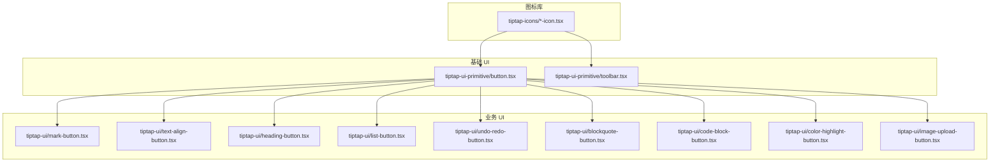
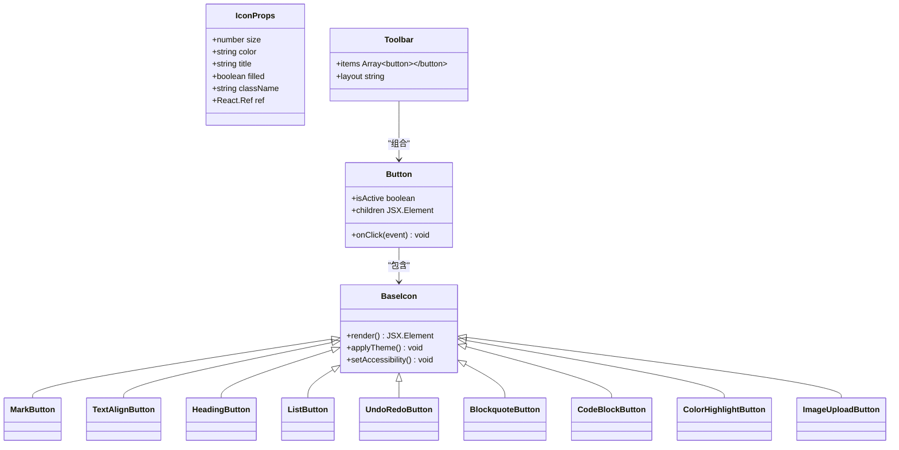
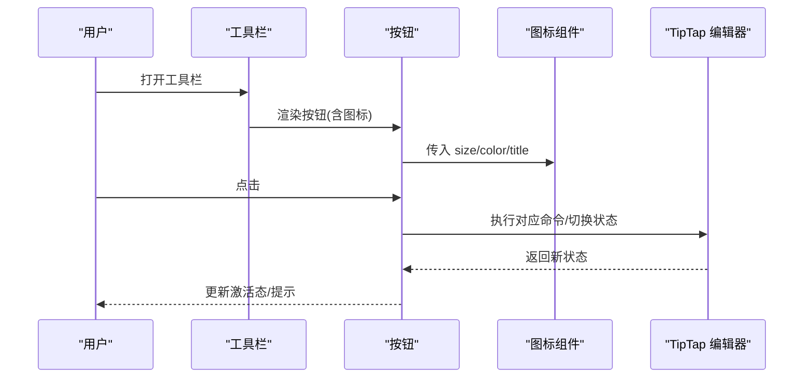
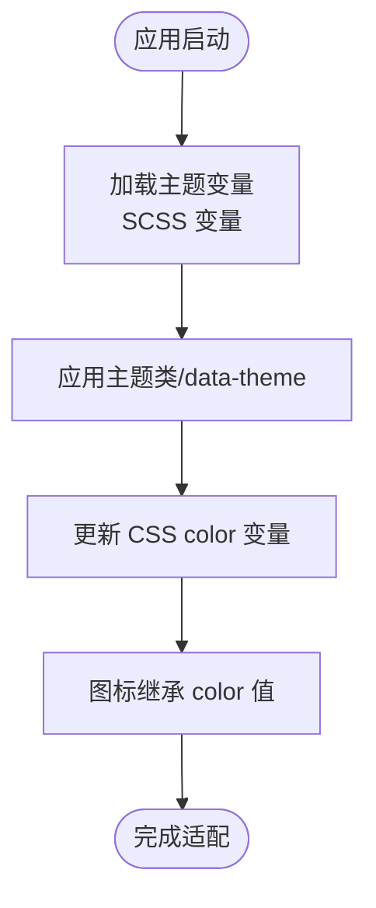
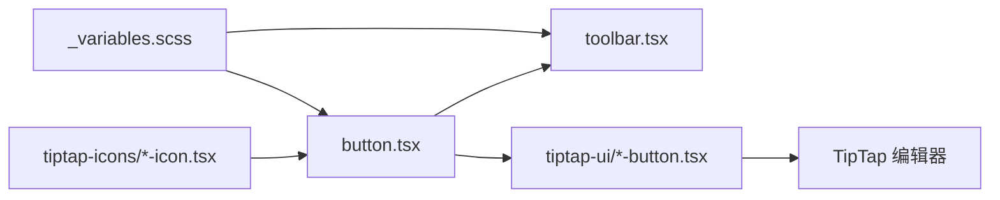

# 图标系统

<cite>
**本文引用的文件**   
- [src/components/tiptap-icons/align-center-icon.tsx](file://src/components/tiptap-icons/align-center-icon.tsx)
- [src/components/tiptap-icons/align-justify-icon.tsx](file://src/components/tiptap-icons/align-justify-icon.tsx)
- [src/components/tiptap-icons/align-left-icon.tsx](file://src/components/tiptap-icons/align-left-icon.tsx)
- [src/components/tiptap-icons/align-right-icon.tsx](file://src/components/tiptap-icons/align-right-icon.tsx)
- [src/components/tiptap-icons/arrow-left-icon.tsx](file://src/components/tiptap-icons/arrow-left-icon.tsx)
- [src/components/tiptap-icons/ban-icon.tsx](file://src/components/tiptap-icons/ban-icon.tsx)
- [src/components/tiptap-icons/blockquote-icon.tsx](file://src/components/tiptap-icons/blockquote-icon.tsx)
- [src/components/tiptap-icons/bold-icon.tsx](file://src/components/tiptap-icons/bold-icon.tsx)
- [src/components/tiptap-icons/check-icon.tsx](file://src/components/tiptap-icons/check-icon.tsx)
- [src/components/tiptap-icons/chevron-down-icon.tsx](file://src/components/tiptap-icons/chevron-down-icon.tsx)
- [src/components/tiptap-icons/close-icon.tsx](file://src/components/tiptap-icons/close-icon.tsx)
- [src/components/tiptap-icons/code-block-icon.tsx](file://src/components/tiptap-icons/code-block-icon.tsx)
- [src/components/tiptap-icons/code2-icon.tsx](file://src/components/tiptap-icons/code2-icon.tsx)
- [src/components/tiptap-icons/corner-down-left-icon.tsx](file://src/components/tiptap-icons/corner-down-left-icon.tsx)
- [src/components/tiptap-icons/external-link-icon.tsx](file://src/components/tiptap-icons/external-link-icon.tsx)
- [src/components/tiptap-icons/heading-five-icon.tsx](file://src/components/tiptap-icons/heading-five-icon.tsx)
- [src/components/tiptap-icons/heading-four-icon.tsx](file://src/components/tiptap-icons/heading-four-icon.tsx)
- [src/components/tiptap-icons/heading-icon.tsx](file://src/components/tiptap-icons/heading-icon.tsx)
- [src/components/tiptap-icons/heading-one-icon.tsx](file://src/components/tiptap-icons/heading-one-icon.tsx)
- [src/components/tiptap-icons/heading-six-icon.tsx](file://src/components/tiptap-icons/heading-six-icon.tsx)
- [src/components/tiptap-icons/heading-three-icon.tsx](file://src/components/tiptap-icons/heading-three-icon.tsx)
- [src/components/tiptap-icons/heading-two-icon.tsx](file://src/components/tiptap-icons/heading-two-icon.tsx)
- [src/components/tiptap-icons/highlighter-icon.tsx](file://src/components/tiptap-icons/highlighter-icon.tsx)
- [src/components/tiptap-icons/image-plus-icon.tsx](file://src/components/tiptap-icons/image-plus-icon.tsx)
- [src/components/tiptap-icons/italic-icon.tsx](file://src/components/tiptap-icons/italic-icon.tsx)
- [src/components/tiptap-icons/link-icon.tsx](file://src/components/tiptap-icons/link-icon.tsx)
- [src/components/tiptap-icons/list-icon.tsx](file://src/components/tiptap-icons/list-icon.tsx)
- [src/components/tiptap-icons/list-ordered-icon.tsx](file://src/components/tiptap-icons/list-ordered-icon.tsx)
- [src/components/tiptap-icons/list-todo-icon.tsx](file://src/components/tiptap-icons/list-todo-icon.tsx)
- [src/components/tiptap-icons/moon-star-icon.tsx](file://src/components/tiptap-icons/moon-star-icon.tsx)
- [src/components/tiptap-icons/redo2-icon.tsx](file://src/components/tiptap-icons/redo2-icon.tsx)
- [src/components/tiptap-icons/strike-icon.tsx](file://src/components/tiptap-icons/strike-icon.tsx)
- [src/components/tiptap-icons/subscript-icon.tsx](file://src/components/tiptap-icons/subscript-icon.tsx)
- [src/components/tiptap-icons/sun-icon.tsx](file://src/components/tiptap-icons/sun-icon.tsx)
- [src/components/tiptap-icons/superscript-icon.tsx](file://src/components/tiptap-icons/superscript-icon.tsx)
- [src/components/tiptap-icons/trash-icon.tsx](file://src/components/tiptap-icons/trash-icon.tsx)
- [src/components/tiptap-icons/underline-icon.tsx](file://src/components/tiptap-icons/underline-icon.tsx)
- [src/components/tiptap-icons/undo2-icon.tsx](file://src/components/tiptap-icons/undo2-icon.tsx)
- [src/components/tiptap-ui-primitive/button.tsx](file://src/components/tiptap-ui-primitive/button.tsx)
- [src/components/tiptap-ui-primitive/toolbar.tsx](file://src/components/tiptap-ui-primitive/toolbar.tsx)
- [src/components/tiptap-ui/mark-button.tsx](file://src/components/tiptap-ui/mark-button.tsx)
- [src/components/tiptap-ui/text-align-button.tsx](file://src/components/tiptap-ui/text-align-button.tsx)
- [src/components/tiptap-ui/heading-button.tsx](file://src/components/tiptap-ui/heading-button.tsx)
- [src/components/tiptap-ui/list-button.tsx](file://src/components/tiptap-ui/list-button.tsx)
- [src/components/tiptap-ui/undo-redo-button.tsx](file://src/components/tiptap-ui/undo-redo-button.tsx)
- [src/components/tiptap-ui/blockquote-button.tsx](file://src/components/tiptap-ui/blockquote-button.tsx)
- [src/components/tiptap-ui/code-block-button.tsx](file://src/components/tiptap-ui/code-block-button.tsx)
- [src/components/tiptap-ui/color-highlight-button.tsx](file://src/components/tiptap-ui/color-highlight-button.tsx)
- [src/components/tiptap-ui/image-upload-button.tsx](file://src/components/tiptap-ui/image-upload-button.tsx)
- [src/components/tiptap-ui/index.tsx](file://src/components/tiptap-ui/index.tsx)
- [src/styles/_variables.scss](file://src/styles/_variables.scss)
</cite>

## 目录
1. [简介](#简介)
2. [项目结构](#项目结构)
3. [核心组件](#核心组件)
4. [架构总览](#架构总览)
5. [详细组件分析](#详细组件分析)
6. [依赖分析](#依赖分析)
7. [性能考虑](#性能考虑)
8. [故障排查指南](#故障排查指南)
9. [结论](#结论)
10. [附录](#附录)

## 简介
本文件为 TipTap 编辑器项目的图标系统技术文档，聚焦于 SVG 图标组件的统一设计、封装模式与使用规范。内容涵盖：
- 统一设计规范与实现模式
- SVG 图标的封装方法与属性传递机制
- 命名约定与组织结构
- 新增图标的完整流程与最佳实践
- 主题适配方案（明暗主题）
- 性能优化与懒加载策略

## 项目结构
图标系统位于 src/components/tiptap-icons 目录下，每个图标以独立的 TSX 文件组织，遵循“一个文件一个图标”的约定。UI 层通过 tiptap-ui 和 tiptap-ui-primitive 中的按钮、工具栏等组件消费这些图标。

图表来源
- [src/components/tiptap-icons/align-center-icon.tsx](file://src/components/tiptap-icons/align-center-icon.tsx)
- [src/components/tiptap-icons/bold-icon.tsx](file://src/components/tiptap-icons/bold-icon.tsx)
- [src/components/tiptap-ui-primitive/button.tsx](file://src/components/tiptap-ui-primitive/button.tsx)
- [src/components/tiptap-ui-primitive/toolbar.tsx](file://src/components/tiptap-ui-primitive/toolbar.tsx)
- [src/components/tiptap-ui/mark-button.tsx](file://src/components/tiptap-ui/mark-button.tsx)
- [src/components/tiptap-ui/text-align-button.tsx](file://src/components/tiptap-ui/text-align-button.tsx)
- [src/components/tiptap-ui/heading-button.tsx](file://src/components/tiptap-ui/heading-button.tsx)
- [src/components/tiptap-ui/list-button.tsx](file://src/components/tiptap-ui/list-button.tsx)
- [src/components/tiptap-ui/undo-redo-button.tsx](file://src/components/tiptap-ui/undo-redo-button.tsx)
- [src/components/tiptap-ui/blockquote-button.tsx](file://src/components/tiptap-ui/blockquote-button.tsx)
- [src/components/tiptap-ui/code-block-button.tsx](file://src/components/tiptap-ui/code-block-button.tsx)
- [src/components/tiptap-ui/color-highlight-button.tsx](file://src/components/tiptap-ui/color-highlight-button.tsx)
- [src/components/tiptap-ui/image-upload-button.tsx](file://src/components/tiptap-ui/image-upload-button.tsx)

章节来源
- [src/components/tiptap-icons/align-center-icon.tsx](file://src/components/tiptap-icons/align-center-icon.tsx)
- [src/components/tiptap-icons/bold-icon.tsx](file://src/components/tiptap-icons/bold-icon.tsx)
- [src/components/tiptap-ui-primitive/button.tsx](file://src/components/tiptap-ui-primitive/button.tsx)
- [src/components/tiptap-ui-primitive/toolbar.tsx](file://src/components/tiptap-ui-primitive/toolbar.tsx)
- [src/components/tiptap-ui/mark-button.tsx](file://src/components/tiptap-ui/mark-button.tsx)
- [src/components/tiptap-ui/text-align-button.tsx](file://src/components/tiptap-ui/text-align-button.tsx)
- [src/components/tiptap-ui/heading-button.tsx](file://src/components/tiptap-ui/heading-button.tsx)
- [src/components/tiptap-ui/list-button.tsx](file://src/components/tiptap-ui/list-button.tsx)
- [src/components/tiptap-ui/undo-redo-button.tsx](file://src/components/tiptap-ui/undo-redo-button.tsx)
- [src/components/tiptap-ui/blockquote-button.tsx](file://src/components/tiptap-ui/blockquote-button.tsx)
- [src/components/tiptap-ui/code-block-button.tsx](file://src/components/tiptap-ui/code-block-button.tsx)
- [src/components/tiptap-ui/color-highlight-button.tsx](file://src/components/tiptap-ui/color-highlight-button.tsx)
- [src/components/tiptap-ui/image-upload-button.tsx](file://src/components/tiptap-ui/image-upload-button.tsx)

## 核心组件
- 图标组件（tiptap-icons/*-icon.tsx）
  - 职责：渲染单个 SVG 图标，暴露统一的 props 接口（如尺寸、颜色、无障碍标签等）。
  - 设计要点：
    - 基于 viewBox 的矢量缩放，避免多套位图。
    - 默认继承文本颜色，便于跟随主题。
    - 提供 aria-* 属性支持可访问性。
    - 可选填充/描边控制，保持视觉一致性。
- 基础按钮（tiptap-ui-primitive/button.tsx）
  - 职责：通用按钮容器，接收图标作为子节点或独立 prop，负责样式与交互。
- 工具栏（tiptap-ui-primitive/toolbar.tsx）
  - 职责：组合多个按钮，提供布局与对齐能力。
- 功能按钮（tiptap-ui/*-button.tsx）
  - 职责：将具体编辑操作与图标绑定，调用编辑器命令或状态切换。

章节来源
- [src/components/tiptap-icons/align-center-icon.tsx](file://src/components/tiptap-icons/align-center-icon.tsx)
- [src/components/tiptap-icons/bold-icon.tsx](file://src/components/tiptap-icons/bold-icon.tsx)
- [src/components/tiptap-ui-primitive/button.tsx](file://src/components/tiptap-ui-primitive/button.tsx)
- [src/components/tiptap-ui-primitive/toolbar.tsx](file://src/components/tiptap-ui-primitive/toolbar.tsx)
- [src/components/tiptap-ui/mark-button.tsx](file://src/components/tiptap-ui/mark-button.tsx)
- [src/components/tiptap-ui/text-align-button.tsx](file://src/components/tiptap-ui/text-align-button.tsx)
- [src/components/tiptap-ui/heading-button.tsx](file://src/components/tiptap-ui/heading-button.tsx)
- [src/components/tiptap-ui/list-button.tsx](file://src/components/tiptap-ui/list-button.tsx)
- [src/components/tiptap-ui/undo-redo-button.tsx](file://src/components/tiptap-ui/undo-redo-button.tsx)
- [src/components/tiptap-ui/blockquote-button.tsx](file://src/components/tiptap-ui/blockquote-button.tsx)
- [src/components/tiptap-ui/code-block-button.tsx](file://src/components/tiptap-ui/code-block-button.tsx)
- [src/components/tiptap-ui/color-highlight-button.tsx](file://src/components/tiptap-ui/color-highlight-button.tsx)
- [src/components/tiptap-ui/image-upload-button.tsx](file://src/components/tiptap-ui/image-upload-button.tsx)

## 架构总览
图标系统采用“原子化图标 + 语义化按钮 + 工具栏编排”的分层架构。图标组件只关注图形渲染；按钮组件负责交互与状态；工具栏负责布局与分组。

图表来源
- [src/components/tiptap-ui-primitive/button.tsx](file://src/components/tiptap-ui-primitive/button.tsx)
- [src/components/tiptap-ui-primitive/toolbar.tsx](file://src/components/tiptap-ui-primitive/toolbar.tsx)
- [src/components/tiptap-ui/mark-button.tsx](file://src/components/tiptap-ui/mark-button.tsx)
- [src/components/tiptap-ui/text-align-button.tsx](file://src/components/tiptap-ui/text-align-button.tsx)
- [src/components/tiptap-ui/heading-button.tsx](file://src/components/tiptap-ui/heading-button.tsx)
- [src/components/tiptap-ui/list-button.tsx](file://src/components/tiptap-ui/list-button.tsx)
- [src/components/tiptap-ui/undo-redo-button.tsx](file://src/components/tiptap-ui/undo-redo-button.tsx)
- [src/components/tiptap-ui/blockquote-button.tsx](file://src/components/tiptap-ui/blockquote-button.tsx)
- [src/components/tiptap-ui/code-block-button.tsx](file://src/components/tiptap-ui/code-block-button.tsx)
- [src/components/tiptap-ui/color-highlight-button.tsx](file://src/components/tiptap-ui/color-highlight-button.tsx)
- [src/components/tiptap-ui/image-upload-button.tsx](file://src/components/tiptap-ui/image-upload-button.tsx)

## 详细组件分析

### 图标组件设计与实现模式
- 统一 Props 接口
  - size：图标尺寸（px），用于设置 viewBox 或外部容器尺寸。
  - color：图标颜色，优先继承 CSS color，也可显式覆盖。
  - title：无障碍标题，配合 aria-label 提升可访问性。
  - filled：是否使用填充路径，保证同一系列图标风格一致。
  - className：样式类名，便于主题或场景定制。
  - ref：DOM 引用，便于测试或外部交互。
- 渲染策略
  - 使用 viewBox 进行等比缩放，避免多分辨率资源。
  - 默认 fill="currentColor"，随父级 color 变化，简化主题适配。
  - 对复杂路径进行归一化处理，减少重复代码。
- 可访问性
  - 提供 role="img"、aria-label/title，确保屏幕阅读器可读。
  - 装饰性图标可设置 aria-hidden="true"。

章节来源
- [src/components/tiptap-icons/align-center-icon.tsx](file://src/components/tiptap-icons/align-center-icon.tsx)
- [src/components/tiptap-icons/bold-icon.tsx](file://src/components/tiptap-icons/bold-icon.tsx)
- [src/components/tiptap-icons/heading-one-icon.tsx](file://src/components/tiptap-icons/heading-one-icon.tsx)
- [src/components/tiptap-icons/list-icon.tsx](file://src/components/tiptap-icons/list-icon.tsx)
- [src/components/tiptap-icons/undo2-icon.tsx](file://src/components/tiptap-icons/undo2-icon.tsx)

### 属性传递机制
- 从按钮到图标
  - 按钮组件接收 size、color、title 等通用属性，并透传给内部图标组件。
  - 通过 className 注入主题或激活态样式。
- 从工具栏到按钮
  - 工具栏统一配置间距、对齐方式，按钮按需覆盖。
- 从业务按钮到编辑器
  - 业务按钮在点击时调用编辑器命令或更新状态，不直接操作 DOM。

图表来源
- [src/components/tiptap-ui-primitive/toolbar.tsx](file://src/components/tiptap-ui-primitive/toolbar.tsx)
- [src/components/tiptap-ui-primitive/button.tsx](file://src/components/tiptap-ui-primitive/button.tsx)
- [src/components/tiptap-ui/mark-button.tsx](file://src/components/tiptap-ui/mark-button.tsx)
- [src/components/tiptap-ui/text-align-button.tsx](file://src/components/tiptap-ui/text-align-button.tsx)
- [src/components/tiptap-ui/heading-button.tsx](file://src/components/tiptap-ui/heading-button.tsx)
- [src/components/tiptap-ui/list-button.tsx](file://src/components/tiptap-ui/list-button.tsx)
- [src/components/tiptap-ui/undo-redo-button.tsx](file://src/components/tiptap-ui/undo-redo-button.tsx)
- [src/components/tiptap-ui/blockquote-button.tsx](file://src/components/tiptap-ui/blockquote-button.tsx)
- [src/components/tiptap-ui/code-block-button.tsx](file://src/components/tiptap-ui/code-block-button.tsx)
- [src/components/tiptap-ui/color-highlight-button.tsx](file://src/components/tiptap-ui/color-highlight-button.tsx)
- [src/components/tiptap-ui/image-upload-button.tsx](file://src/components/tiptap-ui/image-upload-button.tsx)

### 命名约定与组织结构
- 文件命名
  - 小写连字符命名，后缀 -icon.tsx，例如 align-center-icon.tsx。
  - 名称需直观表达图标语义，避免缩写歧义。
- 目录组织
  - 所有图标集中存放于 tiptap-icons 目录，便于统一管理与按需引入。
- 导出约定
  - 每个文件默认导出一个 React 函数组件，组件名与文件名保持一致（首字母大写）。

章节来源
- [src/components/tiptap-icons/align-center-icon.tsx](file://src/components/tiptap-icons/align-center-icon.tsx)
- [src/components/tiptap-icons/align-justify-icon.tsx](file://src/components/tiptap-icons/align-justify-icon.tsx)
- [src/components/tiptap-icons/align-left-icon.tsx](file://src/components/tiptap-icons/align-left-icon.tsx)
- [src/components/tiptap-icons/align-right-icon.tsx](file://src/components/tiptap-icons/align-right-icon.tsx)
- [src/components/tiptap-icons/heading-one-icon.tsx](file://src/components/tiptap-icons/heading-one-icon.tsx)
- [src/components/tiptap-icons/heading-two-icon.tsx](file://src/components/tiptap-icons/heading-two-icon.tsx)
- [src/components/tiptap-icons/heading-three-icon.tsx](file://src/components/tiptap-icons/heading-three-icon.tsx)
- [src/components/tiptap-icons/heading-four-icon.tsx](file://src/components/tiptap-icons/heading-four-icon.tsx)
- [src/components/tiptap-icons/heading-five-icon.tsx](file://src/components/tiptap-icons/heading-five-icon.tsx)
- [src/components/tiptap-icons/heading-six-icon.tsx](file://src/components/tiptap-icons/heading-six-icon.tsx)
- [src/components/tiptap-icons/list-icon.tsx](file://src/components/tiptap-icons/list-icon.tsx)
- [src/components/tiptap-icons/list-ordered-icon.tsx](file://src/components/tiptap-icons/list-ordered-icon.tsx)
- [src/components/tiptap-icons/list-todo-icon.tsx](file://src/components/tiptap-icons/list-todo-icon.tsx)
- [src/components/tiptap-icons/undo2-icon.tsx](file://src/components/tiptap-icons/undo2-icon.tsx)
- [src/components/tiptap-icons/redo2-icon.tsx](file://src/components/tiptap-icons/redo2-icon.tsx)

### 新增图标完整流程与最佳实践
- 步骤
  1. 准备 SVG 源文件，确保 viewBox 合理、路径简洁、无多余元素。
  2. 在 tiptap-icons 下新建 *-icon.tsx，定义统一 props 接口并渲染 SVG。
  3. 在相关按钮组件中引入并使用新图标，确保尺寸与颜色一致。
  4. 更新工具栏或菜单项，使新图标可见可用。
  5. 验证可访问性与主题适配（明/暗主题）。
  6. 补充单元测试或快照测试（如有）。
- 最佳实践
  - 使用 fill="currentColor" 与 CSS color 联动，减少硬编码颜色。
  - 保持路径方向与基线一致，避免视觉抖动。
  - 为装饰性图标设置 aria-hidden，为功能性图标提供标题。
  - 控制路径复杂度，必要时合并重叠路径。

章节来源
- [src/components/tiptap-icons/align-center-icon.tsx](file://src/components/tiptap-icons/align-center-icon.tsx)
- [src/components/tiptap-icons/bold-icon.tsx](file://src/components/tiptap-icons/bold-icon.tsx)
- [src/components/tiptap-icons/heading-one-icon.tsx](file://src/components/tiptap-icons/heading-one-icon.tsx)
- [src/components/tiptap-icons/list-icon.tsx](file://src/components/tiptap-icons/list-icon.tsx)
- [src/components/tiptap-icons/undo2-icon.tsx](file://src/components/tiptap-icons/undo2-icon.tsx)
- [src/components/tiptap-ui/mark-button.tsx](file://src/components/tiptap-ui/mark-button.tsx)
- [src/components/tiptap-ui/text-align-button.tsx](file://src/components/tiptap-ui/text-align-button.tsx)
- [src/components/tiptap-ui/heading-button.tsx](file://src/components/tiptap-ui/heading-button.tsx)
- [src/components/tiptap-ui/list-button.tsx](file://src/components/tiptap-ui/list-button.tsx)
- [src/components/tiptap-ui/undo-redo-button.tsx](file://src/components/tiptap-ui/undo-redo-button.tsx)

### 主题适配方案
- 颜色继承
  - 图标默认继承文本颜色，随主题变量变化自动适配。
- 变量驱动
  - 通过 SCSS 变量统一管理色板，按钮与工具栏样式引用变量，图标无需额外处理。
- 明暗切换
  - 在根容器切换 data-theme 或 class，CSS 变量随之变化，图标颜色自动响应。

图表来源
- [src/styles/_variables.scss](file://src/styles/_variables.scss)
- [src/components/tiptap-ui-primitive/button.tsx](file://src/components/tiptap-ui-primitive/button.tsx)
- [src/components/tiptap-ui-primitive/toolbar.tsx](file://src/components/tiptap-ui-primitive/toolbar.tsx)

章节来源
- [src/styles/_variables.scss](file://src/styles/_variables.scss)
- [src/components/tiptap-ui-primitive/button.tsx](file://src/components/tiptap-ui-primitive/button.tsx)
- [src/components/tiptap-ui-primitive/toolbar.tsx](file://src/components/tiptap-ui-primitive/toolbar.tsx)

## 依赖分析
- 组件耦合
  - 图标组件无业务依赖，仅依赖 React 与 CSS。
  - 按钮组件依赖图标组件与样式变量。
  - 工具栏依赖按钮组件与布局样式。
- 外部依赖
  - TipTap 编辑器通过业务按钮间接被调用，图标不参与编辑器逻辑。
- 潜在循环依赖
  - 当前结构清晰，未发现循环依赖风险。

图表来源
- [src/styles/_variables.scss](file://src/styles/_variables.scss)
- [src/components/tiptap-ui-primitive/button.tsx](file://src/components/tiptap-ui-primitive/button.tsx)
- [src/components/tiptap-ui-primitive/toolbar.tsx](file://src/components/tiptap-ui-primitive/toolbar.tsx)
- [src/components/tiptap-icons/align-center-icon.tsx](file://src/components/tiptap-icons/align-center-icon.tsx)
- [src/components/tiptap-ui/mark-button.tsx](file://src/components/tiptap-ui/mark-button.tsx)
- [src/components/tiptap-ui/text-align-button.tsx](file://src/components/tiptap-ui/text-align-button.tsx)
- [src/components/tiptap-ui/heading-button.tsx](file://src/components/tiptap-ui/heading-button.tsx)
- [src/components/tiptap-ui/list-button.tsx](file://src/components/tiptap-ui/list-button.tsx)
- [src/components/tiptap-ui/undo-redo-button.tsx](file://src/components/tiptap-ui/undo-redo-button.tsx)
- [src/components/tiptap-ui/blockquote-button.tsx](file://src/components/tiptap-ui/blockquote-button.tsx)
- [src/components/tiptap-ui/code-block-button.tsx](file://src/components/tiptap-ui/code-block-button.tsx)
- [src/components/tiptap-ui/color-highlight-button.tsx](file://src/components/tiptap-ui/color-highlight-button.tsx)
- [src/components/tiptap-ui/image-upload-button.tsx](file://src/components/tiptap-ui/image-upload-button.tsx)

章节来源
- [src/styles/_variables.scss](file://src/styles/_variables.scss)
- [src/components/tiptap-ui-primitive/button.tsx](file://src/components/tiptap-ui-primitive/button.tsx)
- [src/components/tiptap-ui-primitive/toolbar.tsx](file://src/components/tiptap-ui-primitive/toolbar.tsx)
- [src/components/tiptap-icons/align-center-icon.tsx](file://src/components/tiptap-icons/align-center-icon.tsx)
- [src/components/tiptap-ui/mark-button.tsx](file://src/components/tiptap-ui/mark-button.tsx)
- [src/components/tiptap-ui/text-align-button.tsx](file://src/components/tiptap-ui/text-align-button.tsx)
- [src/components/tiptap-ui/heading-button.tsx](file://src/components/tiptap-ui/heading-button.tsx)
- [src/components/tiptap-ui/list-button.tsx](file://src/components/tiptap-ui/list-button.tsx)
- [src/components/tiptap-ui/undo-redo-button.tsx](file://src/components/tiptap-ui/undo-redo-button.tsx)
- [src/components/tiptap-ui/blockquote-button.tsx](file://src/components/tiptap-ui/blockquote-button.tsx)
- [src/components/tiptap-ui/code-block-button.tsx](file://src/components/tiptap-ui/code-block-button.tsx)
- [src/components/tiptap-ui/color-highlight-button.tsx](file://src/components/tiptap-ui/color-highlight-button.tsx)
- [src/components/tiptap-ui/image-upload-button.tsx](file://src/components/tiptap-ui/image-upload-button.tsx)

## 性能考虑
- 体积与打包
  - 使用 SVG 矢量路径，体积小且可复用；建议移除未使用的图标以减少包体。
- 渲染性能
  - 避免在高频重绘区域创建大量复杂路径；必要时缓存路径或使用 sprite。
- 懒加载策略
  - 对非首屏图标使用动态 import 或条件渲染，仅在需要时加载。
  - 结合虚拟滚动或分页展示，减少初始渲染压力。
- 主题切换
  - 通过 CSS 变量与 color 继承，避免 JS 频繁计算与重排。

[本节为通用指导，不涉及具体文件分析]

## 故障排查指南
- 图标颜色异常
  - 检查父级 color 是否正确设置，确认 fill="currentColor" 未被覆盖。
  - 核对主题变量是否生效，确认 data-theme 或 class 已正确应用。
- 尺寸不一致
  - 统一使用 size prop 或外层容器尺寸，避免混用 px 与 em/rem。
- 可访问性问题
  - 为功能性图标添加 title/aria-label，装饰性图标设置 aria-hidden。
- 构建与导入错误
  - 确认文件命名与导出一致，路径正确，避免循环导入。

章节来源
- [src/components/tiptap-ui-primitive/button.tsx](file://src/components/tiptap-ui-primitive/button.tsx)
- [src/components/tiptap-ui-primitive/toolbar.tsx](file://src/components/tiptap-ui-primitive/toolbar.tsx)
- [src/components/tiptap-icons/align-center-icon.tsx](file://src/components/tiptap-icons/align-center-icon.tsx)
- [src/components/tiptap-icons/bold-icon.tsx](file://src/components/tiptap-icons/bold-icon.tsx)
- [src/styles/_variables.scss](file://src/styles/_variables.scss)

## 结论
本图标系统通过统一的 SVG 封装、清晰的命名与分层架构，实现了良好的可维护性与可扩展性。借助 CSS 变量与 color 继承，图标在不同主题下表现一致。通过懒加载与路径优化，可在保证体验的同时控制性能开销。建议持续遵循本文规范，逐步完善图标资产与使用文档。

[本节为总结，不涉及具体文件分析]

## 附录
- 常用图标清单（示例）
  - 对齐：居中对齐、两端对齐、左对齐、右对齐
  - 文本格式：加粗、斜体、删除线、下划线、上标、下标
  - 列表：无序列表、有序列表、待办列表
  - 段落：引用块、标题（H1-H6）、代码块、高亮
  - 链接与媒体：插入链接、外部链接、图片上传
  - 撤销与重做：撤销、重做
  - 其他：关闭、勾选、箭头、垃圾桶、月亮/太阳（主题切换）

章节来源
- [src/components/tiptap-icons/align-center-icon.tsx](file://src/components/tiptap-icons/align-center-icon.tsx)
- [src/components/tiptap-icons/align-justify-icon.tsx](file://src/components/tiptap-icons/align-justify-icon.tsx)
- [src/components/tiptap-icons/align-left-icon.tsx](file://src/components/tiptap-icons/align-left-icon.tsx)
- [src/components/tiptap-icons/align-right-icon.tsx](file://src/components/tiptap-icons/align-right-icon.tsx)
- [src/components/tiptap-icons/bold-icon.tsx](file://src/components/tiptap-icons/bold-icon.tsx)
- [src/components/tiptap-icons/italic-icon.tsx](file://src/components/tiptap-icons/italic-icon.tsx)
- [src/components/tiptap-icons/strike-icon.tsx](file://src/components/tiptap-icons/strike-icon.tsx)
- [src/components/tiptap-icons/underline-icon.tsx](file://src/components/tiptap-icons/underline-icon.tsx)
- [src/components/tiptap-icons/superscript-icon.tsx](file://src/components/tiptap-icons/superscript-icon.tsx)
- [src/components/tiptap-icons/subscript-icon.tsx](file://src/components/tiptap-icons/subscript-icon.tsx)
- [src/components/tiptap-icons/list-icon.tsx](file://src/components/tiptap-icons/list-icon.tsx)
- [src/components/tiptap-icons/list-ordered-icon.tsx](file://src/components/tiptap-icons/list-ordered-icon.tsx)
- [src/components/tiptap-icons/list-todo-icon.tsx](file://src/components/tiptap-icons/list-todo-icon.tsx)
- [src/components/tiptap-icons/blockquote-icon.tsx](file://src/components/tiptap-icons/blockquote-icon.tsx)
- [src/components/tiptap-icons/heading-one-icon.tsx](file://src/components/tiptap-icons/heading-one-icon.tsx)
- [src/components/tiptap-icons/heading-two-icon.tsx](file://src/components/tiptap-icons/heading-two-icon.tsx)
- [src/components/tiptap-icons/heading-three-icon.tsx](file://src/components/tiptap-icons/heading-three-icon.tsx)
- [src/components/tiptap-icons/heading-four-icon.tsx](file://src/components/tiptap-icons/heading-four-icon.tsx)
- [src/components/tiptap-icons/heading-five-icon.tsx](file://src/components/tiptap-icons/heading-five-icon.tsx)
- [src/components/tiptap-icons/heading-six-icon.tsx](file://src/components/tiptap-icons/heading-six-icon.tsx)
- [src/components/tiptap-icons/code-block-icon.tsx](file://src/components/tiptap-icons/code-block-icon.tsx)
- [src/components/tiptap-icons/highlighter-icon.tsx](file://src/components/tiptap-icons/highlighter-icon.tsx)
- [src/components/tiptap-icons/link-icon.tsx](file://src/components/tiptap-icons/link-icon.tsx)
- [src/components/tiptap-icons/external-link-icon.tsx](file://src/components/tiptap-icons/external-link-icon.tsx)
- [src/components/tiptap-icons/image-plus-icon.tsx](file://src/components/tiptap-icons/image-plus-icon.tsx)
- [src/components/tiptap-icons/undo2-icon.tsx](file://src/components/tiptap-icons/undo2-icon.tsx)
- [src/components/tiptap-icons/redo2-icon.tsx](file://src/components/tiptap-icons/redo2-icon.tsx)
- [src/components/tiptap-icons/close-icon.tsx](file://src/components/tiptap-icons/close-icon.tsx)
- [src/components/tiptap-icons/check-icon.tsx](file://src/components/tiptap-icons/check-icon.tsx)
- [src/components/tiptap-icons/arrow-left-icon.tsx](file://src/components/tiptap-icons/arrow-left-icon.tsx)
- [src/components/tiptap-icons/trash-icon.tsx](file://src/components/tiptap-icons/trash-icon.tsx)
- [src/components/tiptap-icons/moon-star-icon.tsx](file://src/components/tiptap-icons/moon-star-icon.tsx)
- [src/components/tiptap-icons/sun-icon.tsx](file://src/components/tiptap-icons/sun-icon.tsx)