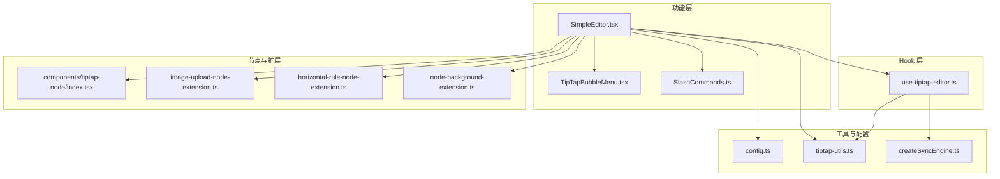
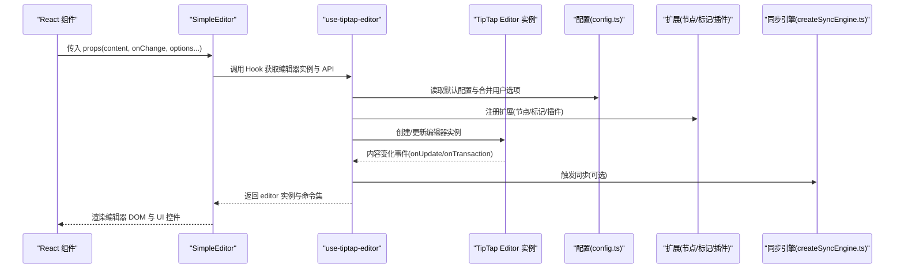
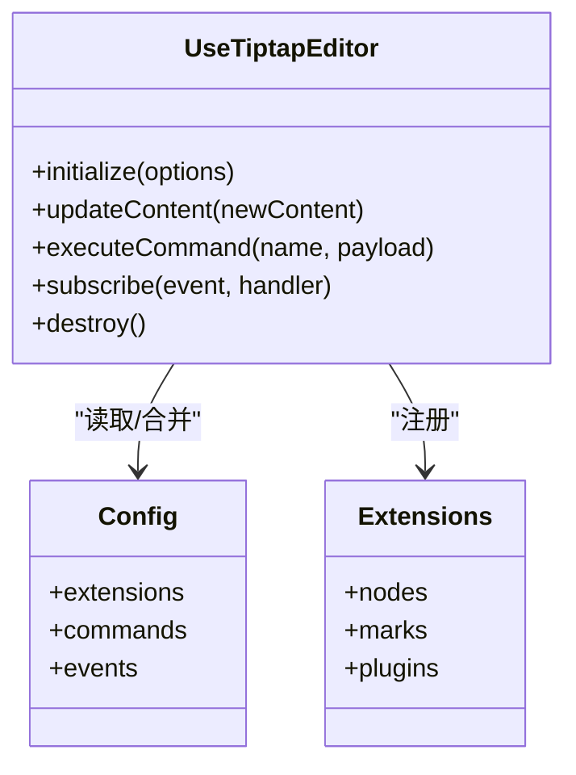
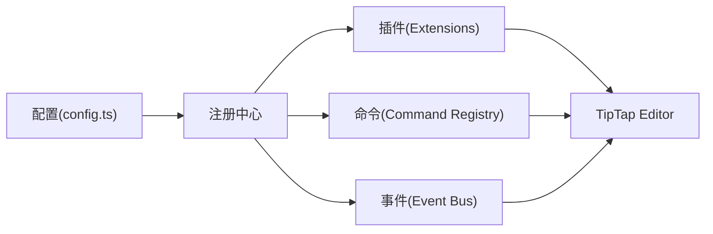
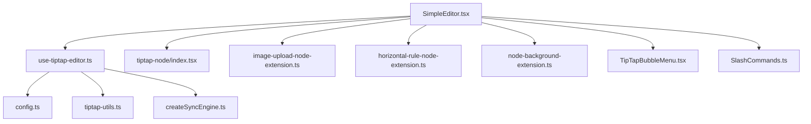

# 编辑器核心架构

<cite>
**本文引用的文件**   
- [SimpleEditor.tsx](file://src/features/tiptap/SimpleEditor.tsx)
- [use-tiptap-editor.ts](file://src/hooks/use-tiptap-editor.ts)
- [config.ts](file://src/features/tiptap/config.ts)
- [tiptap-utils.ts](file://src/lib/tiptap-utils.ts)
- [createSyncEngine.ts](file://src/lib/createSyncEngine.ts)
- [simple-editor.tsx](file://src/components/tiptap-templates/simple/simple-editor.tsx)
- [index.tsx](file://src/components/tiptap-node/index.tsx)
- [image-upload-node-extension.ts](file://src/components/tiptap-node/image-upload-node-extension.ts)
- [horizontal-rule-node-extension.ts](file://src/components/tiptap-node/horizontal-rule-node-extension.ts)
- [node-background-extension.ts](file://src/components/tiptap-extension/node-background-extension.ts)
- [SlashCommands.ts](file://src/features/tiptap/SlashCommands.ts)
- [TipTapBubbleMenu.tsx](file://src/features/tiptap/TipTapBubbleMenu.tsx)
</cite>

## 目录
1. [简介](#简介)
2. [项目结构](#项目结构)
3. [核心组件](#核心组件)
4. [架构总览](#架构总览)
5. [详细组件分析](#详细组件分析)
6. [依赖关系分析](#依赖关系分析)
7. [性能考虑](#性能考虑)
8. [故障排查指南](#故障排查指南)
9. [结论](#结论)
10. [附录](#附录)

## 简介
本文件围绕 TipTap 编辑器在工程中的核心架构进行系统化技术文档化，重点覆盖以下方面：
- SimpleEditor 组件的整体设计与实现原理，包括初始化配置、生命周期管理与状态同步机制。
- use-tiptap-editor Hook 的设计模式与扩展方法。
- 编辑器的配置系统：插件注册、命令定义与事件处理。
- 编辑器与 React 组件的集成方式及性能优化策略。
- 自定义编辑器实例的创建方法与最佳实践。

## 项目结构
本项目将 TipTap 相关能力按“功能域 + 可复用 Hook + 工具库”的方式组织：
- features/tiptap：业务级编辑器组合（SimpleEditor、气泡菜单、斜杠命令等）
- hooks/use-tiptap-editor：封装编辑器实例的生命周期与状态同步
- lib/tiptap-utils：编辑器通用工具函数
- components/tiptap-*：节点扩展、UI 按钮与模板示例
- src/components/tiptap-templates/simple：简单编辑器模板



图表来源
- [SimpleEditor.tsx:1-200](file://src/features/tiptap/SimpleEditor.tsx#L1-L200)
- [use-tiptap-editor.ts:1-200](file://src/hooks/use-tiptap-editor.ts#L1-L200)
- [config.ts:1-200](file://src/features/tiptap/config.ts#L1-L200)
- [tiptap-utils.ts:1-200](file://src/lib/tiptap-utils.ts#L1-L200)
- [createSyncEngine.ts:1-200](file://src/lib/createSyncEngine.ts#L1-L200)
- [index.tsx:1-200](file://src/components/tiptap-node/index.tsx#L1-L200)
- [image-upload-node-extension.ts:1-200](file://src/components/tiptap-node/image-upload-node-extension.ts#L1-L200)
- [horizontal-rule-node-extension.ts:1-200](file://src/components/tiptap-node/horizontal-rule-node-extension.ts#L1-L200)
- [node-background-extension.ts:1-200](file://src/components/tiptap-extension/node-background-extension.ts#L1-L200)
- [TipTapBubbleMenu.tsx:1-200](file://src/features/tiptap/TipTapBubbleMenu.tsx#L1-L200)
- [SlashCommands.ts:1-200](file://src/features/tiptap/SlashCommands.ts#L1-L200)

章节来源
- [SimpleEditor.tsx:1-200](file://src/features/tiptap/SimpleEditor.tsx#L1-L200)
- [use-tiptap-editor.ts:1-200](file://src/hooks/use-tiptap-editor.ts#L1-L200)
- [config.ts:1-200](file://src/features/tiptap/config.ts#L1-L200)
- [tiptap-utils.ts:1-200](file://src/lib/tiptap-utils.ts#L1-L200)
- [createSyncEngine.ts:1-200](file://src/lib/createSyncEngine.ts#L1-L200)
- [index.tsx:1-200](file://src/components/tiptap-node/index.tsx#L1-L200)
- [image-upload-node-extension.ts:1-200](file://src/components/tiptap-node/image-upload-node-extension.ts#L1-L200)
- [horizontal-rule-node-extension.ts:1-200](file://src/components/tiptap-node/horizontal-rule-node-extension.ts#L1-L200)
- [node-background-extension.ts:1-200](file://src/components/tiptap-extension/node-background-extension.ts#L1-L200)
- [TipTapBubbleMenu.tsx:1-200](file://src/features/tiptap/TipTapBubbleMenu.tsx#L1-L200)
- [SlashCommands.ts:1-200](file://src/features/tiptap/SlashCommands.ts#L1-L200)

## 核心组件
本节聚焦 SimpleEditor 组件与 use-tiptap-editor Hook 的职责边界与协作方式。

- SimpleEditor 组件
  - 职责：组装编辑器所需的所有能力（配置、扩展、命令、UI），渲染编辑器容器并挂载气泡菜单与斜杠命令。
  - 关键流程：接收 props → 解析配置 → 通过 Hook 创建/更新编辑器实例 → 监听内容变化 → 触发外部回调或持久化。
  - 生命周期：React 挂载时初始化；依赖变更时按需重建或增量更新；卸载时销毁编辑器实例，释放资源。
  - 状态同步：内部维护 editor 实例引用与必要 UI 状态（如选区、活跃标记），并通过 Hook 暴露稳定接口供上层消费。

- use-tiptap-editor Hook
  - 职责：封装 TipTap Editor 的创建、更新与销毁；管理 content 与 editorState 的双向同步；提供命令调用与事件订阅的统一入口。
  - 设计模式：受控与非受控并存；基于 ref 持有实例避免重复创建；使用稳定依赖数组控制重建；对外暴露稳定的 API。
  - 扩展点：支持注入自定义插件、命令、事件处理器；支持延迟初始化与条件启用。

章节来源
- [SimpleEditor.tsx:1-200](file://src/features/tiptap/SimpleEditor.tsx#L1-L200)
- [use-tiptap-editor.ts:1-200](file://src/hooks/use-tiptap-editor.ts#L1-L200)

## 架构总览
下图展示了从 React 组件到 TipTap 内核的关键交互路径，以及配置、扩展与同步引擎的参与位置。



图表来源
- [SimpleEditor.tsx:1-200](file://src/features/tiptap/SimpleEditor.tsx#L1-L200)
- [use-tiptap-editor.ts:1-200](file://src/hooks/use-tiptap-editor.ts#L1-L200)
- [config.ts:1-200](file://src/features/tiptap/config.ts#L1-L200)
- [createSyncEngine.ts:1-200](file://src/lib/createSyncEngine.ts#L1-L200)

## 详细组件分析

### SimpleEditor 组件
- 初始化配置
  - 聚合基础配置与业务扩展，统一由 Hook 完成实例化。
  - 支持通过 props 覆盖默认行为（如是否启用自动保存、快捷键、主题等）。
- 生命周期管理
  - 首次渲染：构建配置、注册扩展、创建编辑器实例。
  - 依赖更新：根据 content/options 的变化决定是否重建实例或仅更新属性。
  - 卸载清理：确保编辑器实例被正确销毁，解除事件监听，避免内存泄漏。
- 状态同步机制
  - 受控模式：content 来自 props，onChange 回调驱动父组件更新。
  - 非受控模式：内部维护当前内容，仅在必要时与外部同步。
  - 防抖/节流：对高频输入事件进行节流，减少不必要的重渲染与同步开销。
- 与 UI 集成
  - 气泡菜单：基于选区与活跃状态显示上下文操作。
  - 斜杠命令：输入“/”后展示命令面板，执行插入节点或格式化命令。

```mermaid
flowchart TD
Start(["组件挂载"]) --> BuildCfg["构建配置<br/>合并默认与用户选项"]
BuildCfg --> RegExt["注册扩展与命令"]
RegExt --> CreateInst["创建/更新编辑器实例"]
CreateInst --> BindEvents["绑定内容变化与事务事件"]
BindEvents --> RenderDOM["渲染编辑器容器与工具栏"]
RenderDOM --> UserInput{"用户输入?"}
UserInput --> |是| Throttle["节流/防抖处理"]
Throttle --> Sync["触发同步/回调"]
Sync --> UpdateUI["更新 UI 状态(选区/标记)]
UpdateUI --> UserInput
UserInput --> |否| Idle["等待事件"]
Idle --> UserInput
```

图表来源
- [SimpleEditor.tsx:1-200](file://src/features/tiptap/SimpleEditor.tsx#L1-L200)
- [use-tiptap-editor.ts:1-200](file://src/hooks/use-tiptap-editor.ts#L1-L200)

章节来源
- [SimpleEditor.tsx:1-200](file://src/features/tiptap/SimpleEditor.tsx#L1-L200)

### use-tiptap-editor Hook
- 设计模式
  - 单例式实例管理：通过 ref 持有编辑器实例，避免重复创建。
  - 受控/非受控双模式：根据 props 决定以外部 state 还是内部 state 作为数据源。
  - 稳定 API：对外暴露稳定的方法集合（设置内容、执行命令、订阅事件等）。
- 扩展方法
  - 插件注册：允许在 Hook 初始化阶段注入自定义插件。
  - 命令定义：支持注册全局命令并在运行时调用。
  - 事件处理：提供 onBeforeCreate、onCreate、onUpdate、onTransaction、onDestroy 等钩子。
- 生命周期
  - 初始化：合并配置、注册扩展、创建实例。
  - 更新：对比依赖项，必要时重建实例或仅更新属性。
  - 销毁：在组件卸载时安全销毁实例，释放资源。



图表来源
- [use-tiptap-editor.ts:1-200](file://src/hooks/use-tiptap-editor.ts#L1-L200)
- [config.ts:1-200](file://src/features/tiptap/config.ts#L1-L200)

章节来源
- [use-tiptap-editor.ts:1-200](file://src/hooks/use-tiptap-editor.ts#L1-L200)
- [config.ts:1-200](file://src/features/tiptap/config.ts#L1-L200)

### 配置系统：插件注册、命令定义与事件处理
- 插件注册
  - 集中式配置对象声明所有扩展（节点、标记、插件），便于复用与测试。
  - 支持条件启用与参数化配置，满足不同场景需求。
- 命令定义
  - 命令以命名空间组织，支持链式调用与撤销栈集成。
  - 提供类型安全的调用入口，便于 IDE 提示与静态检查。
- 事件处理
  - 统一的事件总线，支持订阅/发布模型。
  - 关键事件：内容更新、事务提交、焦点变化、选区变化等。



图表来源
- [config.ts:1-200](file://src/features/tiptap/config.ts#L1-L200)

章节来源
- [config.ts:1-200](file://src/features/tiptap/config.ts#L1-L200)

### 编辑器与 React 集成与性能优化
- 集成方式
  - 通过 Hook 将 TipTap 实例与 React 生命周期解耦，避免直接操作 DOM。
  - 使用 ref 传递编辑器实例给 UI 组件（如气泡菜单、工具栏）。
- 性能优化
  - 节流/防抖：对输入事件进行节流，降低重渲染频率。
  - 惰性加载：按需加载扩展与命令，减少首屏体积。
  - 最小化重建：依赖数组精细化，避免不必要的实例重建。
  - 虚拟滚动：长文档场景下结合虚拟滚动提升渲染性能。

章节来源
- [SimpleEditor.tsx:1-200](file://src/features/tiptap/SimpleEditor.tsx#L1-L200)
- [use-tiptap-editor.ts:1-200](file://src/hooks/use-tiptap-editor.ts#L1-L200)

### 自定义编辑器实例的创建方法与最佳实践
- 创建步骤
  - 准备配置：定义扩展、命令与事件。
  - 调用 Hook：传入配置与初始内容，获取编辑器实例与 API。
  - 渲染容器：在 React 中渲染编辑器 DOM 节点。
  - 绑定 UI：将实例传递给工具栏、气泡菜单等组件。
- 最佳实践
  - 受控优先：在需要精确控制内容的场景使用受控模式。
  - 合理拆分：将复杂逻辑下沉至 Hook 或工具函数，保持组件简洁。
  - 错误边界：为编辑器区域添加错误边界，防止崩溃扩散。
  - 资源清理：确保在卸载时销毁实例，避免内存泄漏。

章节来源
- [use-tiptap-editor.ts:1-200](file://src/hooks/use-tiptap-editor.ts#L1-L200)
- [tiptap-utils.ts:1-200](file://src/lib/tiptap-utils.ts#L1-L200)

## 依赖关系分析
- 组件耦合
  - SimpleEditor 依赖 Hook 提供的实例与 API，低耦合高内聚。
  - 扩展与命令通过配置集中管理，便于替换与测试。
- 外部依赖
  - TipTap 核心库：提供编辑器内核与扩展体系。
  - 同步引擎：可选的数据持久化与协作能力。
- 潜在循环依赖
  - 通过 Hook 与配置对象隔离，避免组件与扩展之间的直接循环引用。



图表来源
- [SimpleEditor.tsx:1-200](file://src/features/tiptap/SimpleEditor.tsx#L1-L200)
- [use-tiptap-editor.ts:1-200](file://src/hooks/use-tiptap-editor.ts#L1-L200)
- [config.ts:1-200](file://src/features/tiptap/config.ts#L1-L200)
- [tiptap-utils.ts:1-200](file://src/lib/tiptap-utils.ts#L1-L200)
- [createSyncEngine.ts:1-200](file://src/lib/createSyncEngine.ts#L1-L200)
- [index.tsx:1-200](file://src/components/tiptap-node/index.tsx#L1-L200)
- [image-upload-node-extension.ts:1-200](file://src/components/tiptap-node/image-upload-node-extension.ts#L1-L200)
- [horizontal-rule-node-extension.ts:1-200](file://src/components/tiptap-node/horizontal-rule-node-extension.ts#L1-L200)
- [node-background-extension.ts:1-200](file://src/components/tiptap-extension/node-background-extension.ts#L1-L200)
- [TipTapBubbleMenu.tsx:1-200](file://src/features/tiptap/TipTapBubbleMenu.tsx#L1-L200)
- [SlashCommands.ts:1-200](file://src/features/tiptap/SlashCommands.ts#L1-L200)

章节来源
- [SimpleEditor.tsx:1-200](file://src/features/tiptap/SimpleEditor.tsx#L1-L200)
- [use-tiptap-editor.ts:1-200](file://src/hooks/use-tiptap-editor.ts#L1-L200)
- [config.ts:1-200](file://src/features/tiptap/config.ts#L1-L200)

## 性能考虑
- 输入节流：对高频输入事件进行节流，减少重渲染与同步压力。
- 惰性加载：按需加载扩展与命令，缩短首屏时间。
- 最小化重建：精细化依赖数组，避免不必要的实例重建。
- 虚拟滚动：长文档场景下采用虚拟滚动提升渲染性能。
- 内存管理：确保在组件卸载时销毁编辑器实例，释放事件监听与缓存。

[本节为通用性能建议，不直接分析具体文件]

## 故障排查指南
- 常见问题
  - 编辑器未渲染：检查 DOM 容器是否存在且尺寸有效。
  - 内容不同步：确认受控/非受控模式是否正确配置，避免双向绑定冲突。
  - 扩展未生效：检查扩展是否在配置中正确注册，依赖是否满足。
  - 内存泄漏：确认在组件卸载时销毁编辑器实例。
- 定位手段
  - 打印关键事件：在 onUpdate/onTransaction 中输出日志，观察数据流。
  - 断点调试：在 Hook 的初始化与更新分支设置断点，验证依赖变化。
  - 简化复现：逐步移除扩展与命令，定位问题范围。

章节来源
- [use-tiptap-editor.ts:1-200](file://src/hooks/use-tiptap-editor.ts#L1-L200)
- [tiptap-utils.ts:1-200](file://src/lib/tiptap-utils.ts#L1-L200)

## 结论
本架构通过 SimpleEditor 组件与 use-tiptap-editor Hook 的清晰分工，实现了编辑器的高内聚与低耦合。配置系统集中管理扩展、命令与事件，便于复用与测试。结合节流、惰性加载与最小化重建等策略，整体具备良好的性能表现。遵循本文的最佳实践，可快速搭建稳定、可扩展的自定义编辑器实例。

[本节为总结性内容，不直接分析具体文件]

## 附录
- 参考模板
  - 简单编辑器模板：用于快速上手与样式参考。
- 常用扩展
  - 图片上传节点、水平分割线、背景节点等，可按需引入。

章节来源
- [simple-editor.tsx:1-200](file://src/components/tiptap-templates/simple/simple-editor.tsx#L1-L200)
- [index.tsx:1-200](file://src/components/tiptap-node/index.tsx#L1-L200)
- [image-upload-node-extension.ts:1-200](file://src/components/tiptap-node/image-upload-node-extension.ts#L1-L200)
- [horizontal-rule-node-extension.ts:1-200](file://src/components/tiptap-node/horizontal-rule-node-extension.ts#L1-L200)
- [node-background-extension.ts:1-200](file://src/components/tiptap-extension/node-background-extension.ts#L1-L200)