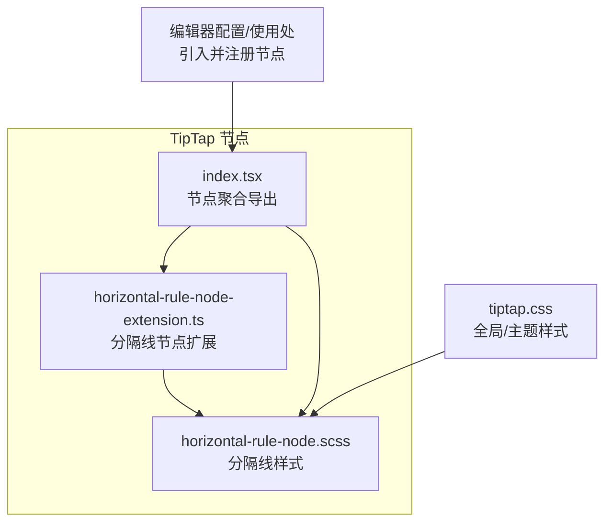
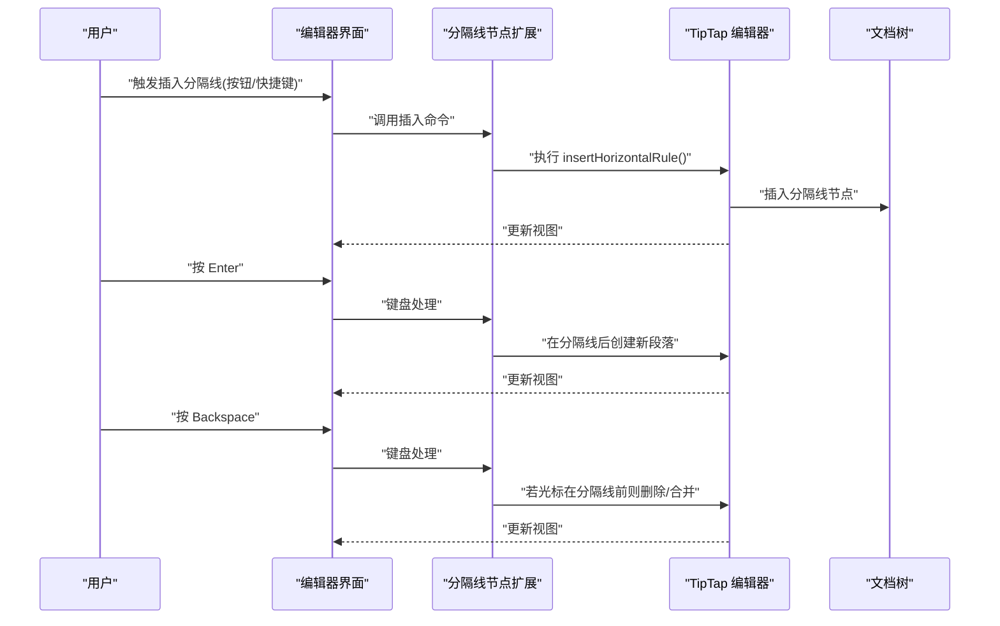
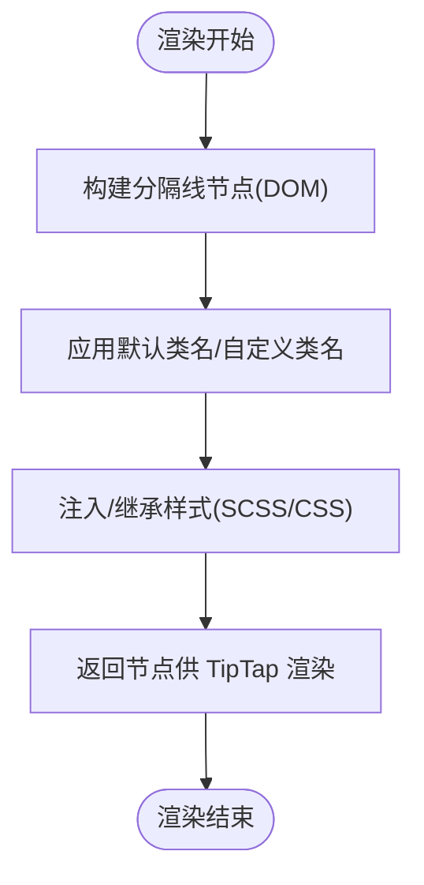
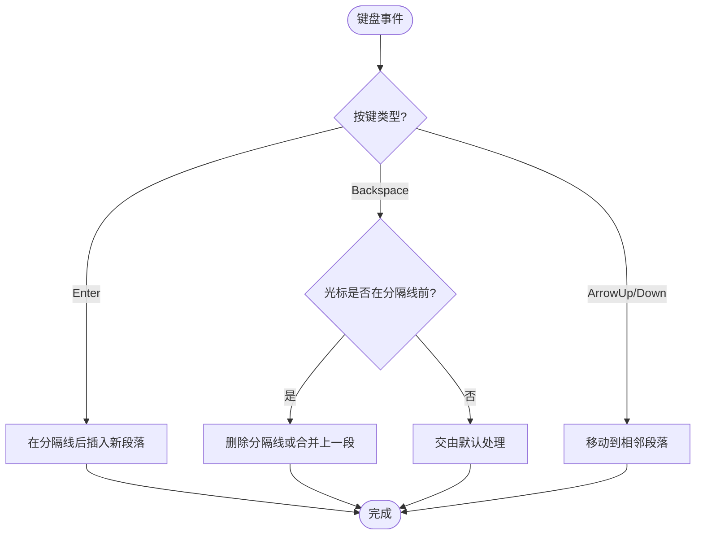
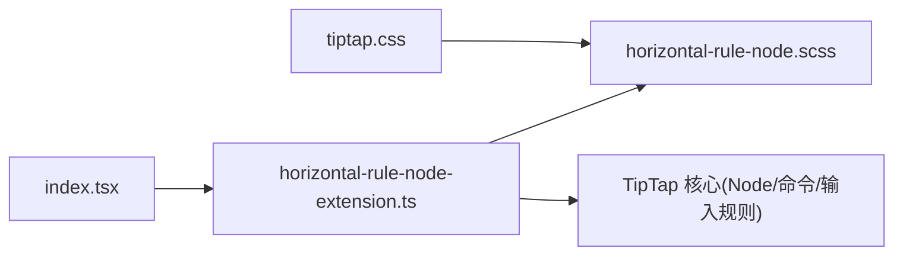

# 分隔线节点实现

<cite>
**本文引用的文件**   
- [horizontal-rule-node-extension.ts](file://src/components/tiptap-node/horizontal-rule-node-extension.ts)
- [horizontal-rule-node.scss](file://src/components/tiptap-node/horizontal-rule-node.scss)
- [index.tsx](file://src/components/tiptap-node/index.tsx)
- [tiptap.css](file://src/features/tiptap/tiptap.css)
</cite>

## 目录
1. [简介](#简介)
2. [项目结构](#项目结构)
3. [核心组件](#核心组件)
4. [架构总览](#架构总览)
5. [详细组件分析](#详细组件分析)
6. [依赖分析](#依赖分析)
7. [性能考虑](#性能考虑)
8. [故障排查指南](#故障排查指南)
9. [结论](#结论)
10. [附录](#附录)

## 简介
本文件为 TipTap 编辑器中“分隔线”节点的技术文档，聚焦于 horizontal-rule-node-extension.ts 的实现原理与集成方式。内容涵盖：
- 渲染逻辑与样式定制
- 数据模型设计与序列化格式
- 与编辑器的集成（光标定位、键盘导航、快捷键）
- 不同视觉风格示例（虚线、实线、装饰性）
- 无障碍访问支持与跨浏览器兼容性方案

## 项目结构
与分隔线节点相关的代码位于 tiptap-node 模块下，包含扩展定义与样式文件，并通过统一入口聚合导出。

图表来源
- [horizontal-rule-node-extension.ts:1-200](file://src/components/tiptap-node/horizontal-rule-node-extension.ts#L1-L200)
- [horizontal-rule-node.scss:1-200](file://src/components/tiptap-node/horizontal-rule-node.scss#L1-L200)
- [index.tsx:1-200](file://src/components/tiptap-node/index.tsx#L1-L200)
- [tiptap.css:1-200](file://src/features/tiptap/tiptap.css#L1-L200)

章节来源
- [horizontal-rule-node-extension.ts:1-200](file://src/components/tiptap-node/horizontal-rule-node-extension.ts#L1-L200)
- [horizontal-rule-node.scss:1-200](file://src/components/tiptap-node/horizontal-rule-node.scss#L1-L200)
- [index.tsx:1-200](file://src/components/tiptap-node/index.tsx#L1-L200)
- [tiptap.css:1-200](file://src/features/tiptap/tiptap.css#L1-L200)

## 核心组件
- 分隔线节点扩展：定义节点类型、渲染器、输入规则、命令与键盘处理等，使 TipTap 将分隔线作为独立块级元素管理。
- 分隔线样式：通过 SCSS 提供默认外观，支持主题变量与可替换类名，便于定制虚线、实线或装饰性风格。
- 聚合导出：在 index.tsx 中统一导出，供上层编辑器装配时引用。

章节来源
- [horizontal-rule-node-extension.ts:1-200](file://src/components/tiptap-node/horizontal-rule-extension.ts#L1-L200)
- [horizontal-rule-node.scss:1-200](file://src/components/tiptap-node/horizontal-rule-node.scss#L1-L200)
- [index.tsx:1-200](file://src/components/tiptap-node/index.tsx#L1-L200)

## 架构总览
分隔线节点以 TipTap Node Extension 的形式接入编辑器，遵循 TipTap 的节点生命周期与事件机制。其关键交互包括：
- 插入：通过命令或输入规则插入分隔线节点
- 选中与操作：点击选中后，可通过工具栏或快捷键删除/移动
- 键盘导航：上下键在分隔线前后段落间跳转；Enter 在分隔线后新建段落；Backspace 在分隔线前合并或删除

图表来源
- [horizontal-rule-node-extension.ts:1-200](file://src/components/tiptap-node/horizontal-rule-node-extension.ts#L1-L200)

## 详细组件分析

### 数据模型与序列化
- 节点类型：分隔线为独立的块级节点，不包含文本内容，仅作为结构性标记存在。
- 属性定义：通常无需额外属性；如需扩展（如颜色、粗细），可在扩展中声明可选属性并在渲染器中消费。
- 序列化格式：在 JSON 文档中表示为一个节点对象，type 指向分隔线节点标识；HTML 输出通常为 
 标签，便于兼容与可访问性。

章节来源
- [horizontal-rule-node-extension.ts:1-200](file://src/components/tiptap-node/horizontal-rule-node-extension.ts#L1-L200)

### 渲染逻辑与样式定制
- 渲染器：返回一个可被 TipTap 渲染的分隔线 DOM 节点（例如 hr）。
- 样式策略：
  - 默认样式由 SCSS 提供，建议通过 CSS 变量控制颜色、粗细、间距等，便于主题切换。
  - 支持通过类名覆盖默认样式，实现虚线、点线、渐变或带装饰元素的风格。
- 主题适配：结合全局 tiptap.css 中的主题变量，确保明暗主题下的对比度与可读性。

图表来源
- [horizontal-rule-node-extension.ts:1-200](file://src/components/tiptap-node/horizontal-rule-node-extension.ts#L1-L200)
- [horizontal-rule-node.scss:1-200](file://src/components/tiptap-node/horizontal-rule-node.scss#L1-L200)
- [tiptap.css:1-200](file://src/features/tiptap/tiptap.css#L1-L200)

章节来源
- [horizontal-rule-node-extension.ts:1-200](file://src/components/tiptap-node/horizontal-rule-node-extension.ts#L1-L200)
- [horizontal-rule-node.scss:1-200](file://src/components/tiptap-node/horizontal-rule-node.scss#L1-L200)
- [tiptap.css:1-200](file://src/features/tiptap/tiptap.css#L1-L200)

### 交互行为与键盘导航
- 插入：
  - 命令：提供插入分隔线的命令函数，供工具栏或快捷键调用。
  - 输入规则：可配置输入序列（如 --- 或 ***）自动转换为分隔线节点。
- 键盘导航：
  - Enter：在分隔线之后插入新段落，保持自然书写流。
  - Backspace：当光标位于分隔线之前且前方无其他内容时，删除分隔线；否则合并到上一段落。
  - 方向键：上下键在分隔线前后段落间移动光标。
- 选择与删除：
  - 点击分隔线可选中，Delete/Backspace 删除当前节点。
  - 支持拖拽手柄（若启用）进行重排。

图表来源
- [horizontal-rule-node-extension.ts:1-200](file://src/components/tiptap-node/horizontal-rule-node-extension.ts#L1-L200)

章节来源
- [horizontal-rule-node-extension.ts:1-200](file://src/components/tiptap-node/horizontal-rule-node-extension.ts#L1-L200)

### 无障碍访问与跨浏览器兼容
- 语义化：使用原生 
 元素，天然具备分节语义，利于屏幕阅读器识别。
- 角色与描述：可为分隔线节点添加 aria-role 与 aria-label，明确其“水平分隔符”的用途。
- 焦点管理：确保分隔线不可聚焦（除非需要特殊交互），避免干扰键盘导航。
- 跨浏览器：
  - 样式差异：不同浏览器对 hr 的默认样式不一致，需通过 SCSS/CSS 统一。
  - 输入法与组合键：在 IME 场景下，确保输入规则不会误触发。
  - 打印样式：必要时提供 @media print 样式，保证打印输出清晰。

章节来源
- [horizontal-rule-node-extension.ts:1-200](file://src/components/tiptap-node/horizontal-rule-node-extension.ts#L1-L200)
- [horizontal-rule-node.scss:1-200](file://src/components/tiptap-node/horizontal-rule-node.scss#L1-L200)
- [tiptap.css:1-200](file://src/features/tiptap/tiptap.css#L1-L200)

### 样式风格示例（概念说明）
以下为常见风格的实现思路（不直接展示代码，仅提供路径参考）：
- 虚线风格：调整边框样式为 dashed，并设置合适的颜色与粗细。
- 实线风格：使用 solid 边框，配合主题色变量。
- 装饰性风格：利用伪元素或背景渐变，增加两端小圆点或中间图标。

章节来源
- [horizontal-rule-node.scss:1-200](file://src/components/tiptap-node/horizontal-rule-node.scss#L1-L200)
- [tiptap.css:1-200](file://src/features/tiptap/tiptap.css#L1-L200)

## 依赖分析
- 内部依赖：
  - 样式依赖：horizontal-rule-node.scss 提供默认样式，可能被 tiptap.css 的主题变量覆盖。
  - 聚合导出：index.tsx 统一导出分隔线节点扩展，供上层编辑器装配。
- 外部依赖：
  - TipTap 运行时：节点扩展基于 TipTap 的 Node API 与命令系统。
  - 浏览器 DOM：渲染为 
 元素，依赖浏览器对 hr 的支持。

图表来源
- [horizontal-rule-node-extension.ts:1-200](file://src/components/tiptap-node/horizontal-rule-node-extension.ts#L1-L200)
- [horizontal-rule-node.scss:1-200](file://src/components/tiptap-node/horizontal-rule-node.scss#L1-L200)
- [index.tsx:1-200](file://src/components/tiptap-node/index.tsx#L1-L200)
- [tiptap.css:1-200](file://src/features/tiptap/tiptap.css#L1-L200)

章节来源
- [horizontal-rule-node-extension.ts:1-200](file://src/components/tiptap-node/horizontal-rule-node-extension.ts#L1-L200)
- [horizontal-rule-node.scss:1-200](file://src/components/tiptap-node/horizontal-rule-node.scss#L1-L200)
- [index.tsx:1-200](file://src/components/tiptap-node/index.tsx#L1-L200)
- [tiptap.css:1-200](file://src/features/tiptap/tiptap.css#L1-L200)

## 性能考虑
- 轻量节点：分隔线节点结构简单，渲染开销低，适合频繁插入与删除。
- 样式计算：避免复杂动画与大量伪元素，确保滚动与重绘流畅。
- 输入规则节流：在高频率输入场景下，确保输入规则不会造成不必要的重排。

## 故障排查指南
- 无法插入分隔线：
  - 检查是否已正确导入并注册分隔线节点扩展。
  - 确认命令或输入规则未被其他扩展拦截。
- 样式异常：
  - 检查 SCSS 是否被编译并引入。
  - 确认主题变量未覆盖导致对比度不足。
- 键盘行为不符合预期：
  - 检查键盘处理逻辑是否与现有扩展冲突。
  - 验证光标位置判断条件是否正确。
- 无障碍问题：
  - 确认 aria 属性已正确设置。
  - 测试屏幕阅读器是否能识别分隔线语义。

章节来源
- [horizontal-rule-node-extension.ts:1-200](file://src/components/tiptap-node/horizontal-rule-node-extension.ts#L1-L200)
- [horizontal-rule-node.scss:1-200](file://src/components/tiptap-node/horizontal-rule-node.scss#L1-L200)
- [tiptap.css:1-200](file://src/features/tiptap/tiptap.css#L1-L200)

## 结论
分隔线节点通过 TipTap 的节点扩展机制实现了简洁而强大的功能：结构化插入、一致的键盘导航、灵活的样式定制以及良好的无障碍与跨浏览器支持。建议在项目中通过 SCSS 与主题变量统一管理外观，并结合输入规则与快捷键提升用户体验。

## 附录
- 集成步骤（概念流程）：
  - 在编辑器配置中导入并注册分隔线节点扩展。
  - 在工具栏中添加“插入分隔线”按钮，绑定对应命令。
  - 根据需要配置输入规则（如 --- 或 ***）。
  - 通过 SCSS/CSS 定制分隔线样式，适配主题。