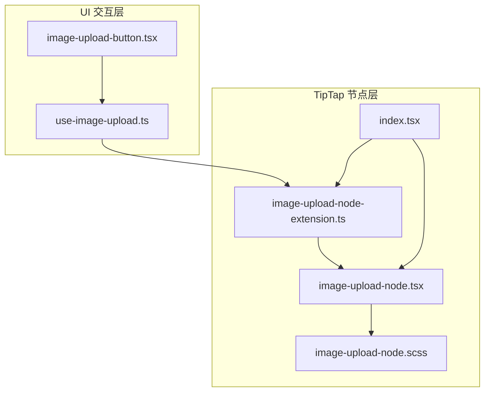
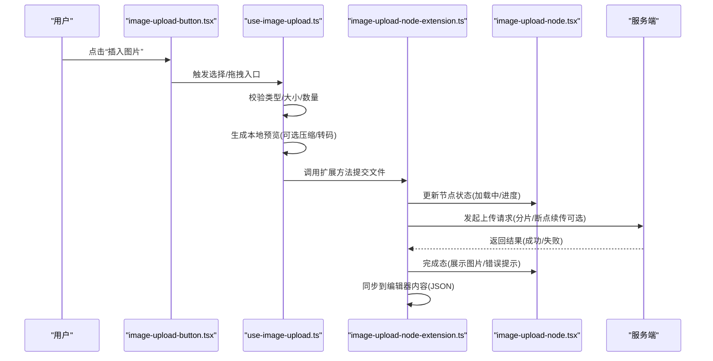
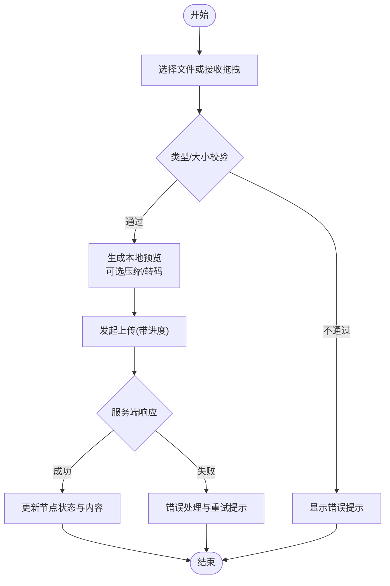
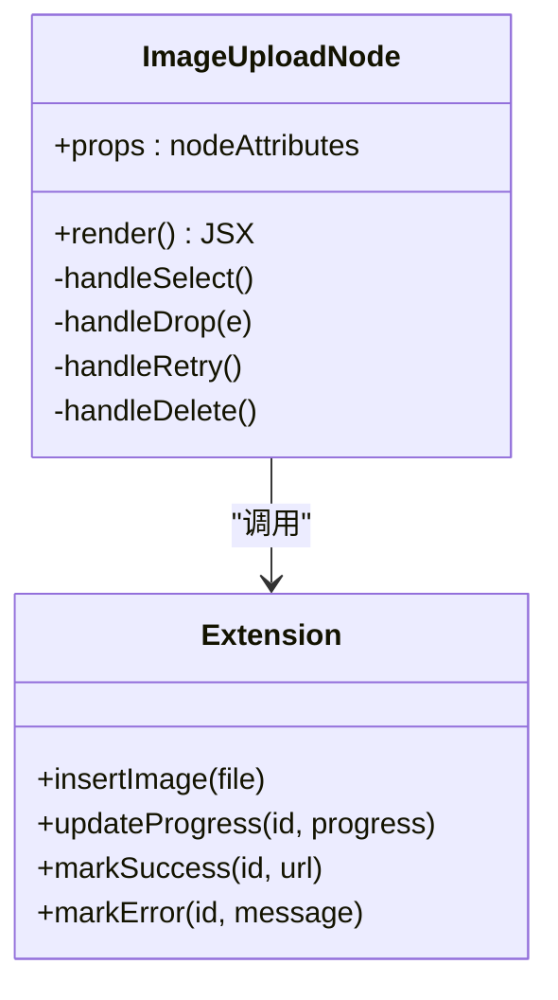
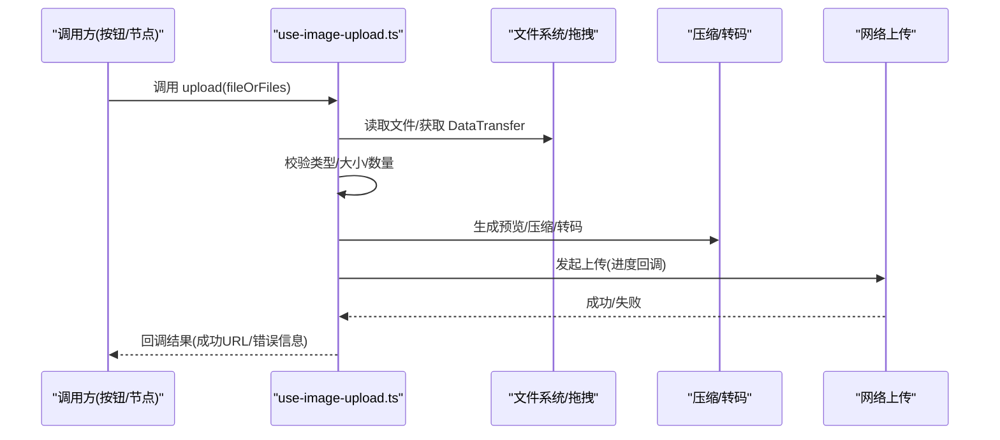
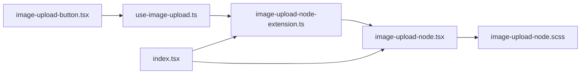

# 图片上传节点开发

<cite>
**本文引用的文件**   
- [image-upload-node-extension.ts](file://src/components/tiptap-node/image-upload-node-extension.ts)
- [image-upload-node.tsx](file://src/components/tiptap-node/image-upload-node.tsx)
- [image-upload-node.scss](file://src/components/tiptap-node/image-upload-node.scss)
- [use-image-upload.ts](file://src/components/tiptap-ui/use-image-upload.ts)
- [image-upload-button.tsx](file://src/components/tiptap-ui/image-upload-button.tsx)
- [index.tsx](file://src/components/tiptap-node/index.tsx)
</cite>

## 目录
1. [简介](#简介)
2. [项目结构](#项目结构)
3. [核心组件](#核心组件)
4. [架构总览](#架构总览)
5. [详细组件分析](#详细组件分析)
6. [依赖关系分析](#依赖关系分析)
7. [性能考虑](#性能考虑)
8. [故障排查指南](#故障排查指南)
9. [结论](#结论)
10. [附录](#附录)

## 简介
本技术文档围绕 TipTap 的图片上传节点进行系统化分析与说明，重点覆盖以下方面：
- 文件选择器集成与拖拽上传支持
- 从文件选择到服务器上传的完整链路
- 图片预览机制（本地预览、压缩处理、格式转换）
- 图片存储管理（临时存储、持久化保存、数据同步）
- 图片编辑扩展能力（裁剪、旋转、滤镜）
- 错误处理、进度显示与用户体验优化

目标读者包括前端工程师、编辑器二次开发者以及希望扩展 TipTap 图片能力的产品与测试人员。

## 项目结构
与图片上传节点相关的代码主要分布在以下位置：
- 节点扩展与渲染：src/components/tiptap-node/
- UI 交互与 Hook：src/components/tiptap-ui/
- 样式资源：对应 .scss 文件

图表来源
- [image-upload-node-extension.ts:1-200](file://src/components/tiptap-node/image-upload-node-extension.ts#L1-L200)
- [image-upload-node.tsx:1-200](file://src/components/tiptap-node/image-upload-node.tsx#L1-L200)
- [image-upload-node.scss:1-200](file://src/components/tiptap-node/image-upload-node.scss#L1-L200)
- [use-image-upload.ts:1-200](file://src/components/tiptap-ui/use-image-upload.ts#L1-L200)
- [image-upload-button.tsx:1-200](file://src/components/tiptap-ui/image-upload-button.tsx#L1-L200)
- [index.tsx:1-200](file://src/components/tiptap-node/index.tsx#L1-L200)

章节来源
- [image-upload-node-extension.ts:1-200](file://src/components/tiptap-node/image-upload-node-extension.ts#L1-L200)
- [image-upload-node.tsx:1-200](file://src/components/tiptap-node/image-upload-node.tsx#L1-L200)
- [image-upload-node.scss:1-200](file://src/components/tiptap-node/image-upload-node.scss#L1-L200)
- [use-image-upload.ts:1-200](file://src/components/tiptap-ui/use-image-upload.ts#L1-L200)
- [image-upload-button.tsx:1-200](file://src/components/tiptap-ui/image-upload-button.tsx#L1-L200)
- [index.tsx:1-200](file://src/components/tiptap-node/index.tsx#L1-L200)

## 核心组件
- image-upload-node-extension.ts：定义 TipTap 自定义节点类型，注册命令、解析/序列化、事件处理（选择、拖拽）、上传流程与状态管理。
- image-upload-node.tsx：节点视图组件，负责渲染图片占位、预览图、进度条、操作按钮等。
- use-image-upload.ts：封装图片上传逻辑（选择、校验、压缩、转码、上传、回调），供按钮或节点内部复用。
- image-upload-button.tsx：工具栏中的“插入图片”按钮，触发文件选择或打开上传对话框。
- index.tsx：将扩展与视图聚合导出，便于在编辑器中统一注册。

章节来源
- [image-upload-node-extension.ts:1-200](file://src/components/tiptap-node/image-upload-node-extension.ts#L1-L200)
- [image-upload-node.tsx:1-200](file://src/components/tiptap-node/image-upload-node.tsx#L1-L200)
- [use-image-upload.ts:1-200](file://src/components/tiptap-ui/use-image-upload.ts#L1-L200)
- [image-upload-button.tsx:1-200](file://src/components/tiptap-ui/image-upload-button.tsx#L1-L200)
- [index.tsx:1-200](file://src/components/tiptap-node/index.tsx#L1-L200)

## 架构总览
下图展示了从用户交互到最终落盘的端到端流程，涵盖选择、预览、压缩、上传、持久化与编辑器数据同步。

图表来源
- [image-upload-button.tsx:1-200](file://src/components/tiptap-ui/image-upload-button.tsx#L1-L200)
- [use-image-upload.ts:1-200](file://src/components/tiptap-ui/use-image-upload.ts#L1-L200)
- [image-upload-node-extension.ts:1-200](file://src/components/tiptap-node/image-upload-node-extension.ts#L1-L200)
- [image-upload-node.tsx:1-200](file://src/components/tiptap-node/image-upload-node.tsx#L1-L200)

## 详细组件分析

### 节点扩展：image-upload-node-extension.ts
职责概览
- 定义节点 schema（属性：如 src、width、height、alt、status、progress 等）。
- 提供命令：插入图片、替换图片、删除图片。
- 处理输入事件：粘贴图片、拖拽图片进入编辑器区域。
- 管理上传生命周期：开始、进度、成功、失败。
- 与编辑器内容同步：将图片信息序列化为 JSON，并反序列化渲染。

关键实现要点
- 文件选择器集成：通过隐藏的 input[type=file] 或浏览器 API 触发选择；支持多文件与类型过滤。
- 拖拽上传支持：监听 dragover/dragleave/drop，阻止默认行为，读取 DataTransfer 中的文件列表。
- 预览机制：使用 FileReader 或 URL.createObjectURL 生成本地预览；可结合 Canvas 进行压缩与格式转换。
- 上传流程：封装为 Promise 或基于事件回调；支持进度上报与取消。
- 错误处理：网络异常、类型不符、大小超限、服务端错误码映射。
- 状态管理：节点内维护 status（idle/uploading/success/error）与 progress（0-100）。

复杂度与性能
- 大文件上传建议分片与并发控制，避免阻塞主线程。
- 预览阶段优先使用 Blob URL，减少内存占用。
- 压缩策略：按目标尺寸与质量阈值动态调整，避免过度压缩导致失真。

图表来源
- [image-upload-node-extension.ts:1-200](file://src/components/tiptap-node/image-upload-node-extension.ts#L1-L200)

章节来源
- [image-upload-node-extension.ts:1-200](file://src/components/tiptap-node/image-upload-node-extension.ts#L1-L200)

### 节点视图：image-upload-node.tsx
职责概览
- 根据节点属性渲染不同状态：占位、加载中、成功、失败。
- 展示进度条与错误信息。
- 提供操作入口（重新上传、删除、替换）。
- 与扩展通信：通过 props 暴露的方法触发上传或状态变更。

交互细节
- 点击占位区可再次触发选择。
- 拖拽至节点区域可替换当前图片。
- 右键菜单或气泡菜单（由上层提供）支持编辑与删除。

图表来源
- [image-upload-node.tsx:1-200](file://src/components/tiptap-node/image-upload-node.tsx#L1-L200)
- [image-upload-node-extension.ts:1-200](file://src/components/tiptap-node/image-upload-node-extension.ts#L1-L200)

章节来源
- [image-upload-node.tsx:1-200](file://src/components/tiptap-node/image-upload-node.tsx#L1-L200)

### 上传 Hook：use-image-upload.ts
职责概览
- 封装通用上传逻辑：选择、校验、预览、压缩、转码、上传、回调。
- 暴露接口供按钮与节点内部复用。
- 管理临时状态：当前文件、预览 URL、进度、错误信息。

关键流程
- 文件选择：支持 input 与拖拽两种入口。
- 校验规则：MIME 类型白名单、文件大小上限、数量限制。
- 预览与压缩：Canvas 缩放、JPEG/WebP 质量参数、PNG 转 WebP 策略。
- 上传策略：FormData 构造、请求头设置、进度事件监听、超时与重试。
- 回调与清理：成功后释放 Blob URL，失败时保留错误上下文。

图表来源
- [use-image-upload.ts:1-200](file://src/components/tiptap-ui/use-image-upload.ts#L1-L200)

章节来源
- [use-image-upload.ts:1-200](file://src/components/tiptap-ui/use-image-upload.ts#L1-L200)

### 工具栏按钮：image-upload-button.tsx
职责概览
- 提供“插入图片”入口，触发文件选择或打开上传对话框。
- 可与 use-image-upload 组合，直接完成一次完整的上传流程。
- 支持禁用态与加载态，提升可用性。

章节来源
- [image-upload-button.tsx:1-200](file://src/components/tiptap-ui/image-upload-button.tsx#L1-L200)

### 聚合导出：index.tsx
职责概览
- 将扩展与视图聚合导出，简化编辑器侧的注册与使用。
- 保证扩展与视图的生命周期一致。

章节来源
- [index.tsx:1-200](file://src/components/tiptap-node/index.tsx#L1-L200)

## 依赖关系分析
- 组件耦合
  - 按钮依赖 Hook，Hook 被扩展与视图共同消费，降低重复逻辑。
  - 视图依赖扩展提供的命令与状态更新方法，保持单向数据流。
- 外部依赖
  - 浏览器原生 API：FileReader、URL.createObjectURL、Canvas、Fetch/XHR。
  - TipTap 扩展体系：Node、Schema、Commands、Events。
- 潜在循环依赖
  - 确保 Hook 不反向依赖视图，仅通过回调与扩展接口通信。

图表来源
- [image-upload-button.tsx:1-200](file://src/components/tiptap-ui/image-upload-button.tsx#L1-L200)
- [use-image-upload.ts:1-200](file://src/components/tiptap-ui/use-image-upload.ts#L1-L200)
- [image-upload-node-extension.ts:1-200](file://src/components/tiptap-node/image-upload-node-extension.ts#L1-L200)
- [image-upload-node.tsx:1-200](file://src/components/tiptap-node/image-upload-node.tsx#L1-L200)
- [image-upload-node.scss:1-200](file://src/components/tiptap-node/image-upload-node.scss#L1-L200)
- [index.tsx:1-200](file://src/components/tiptap-node/index.tsx#L1-L200)

章节来源
- [image-upload-button.tsx:1-200](file://src/components/tiptap-ui/image-upload-button.tsx#L1-L200)
- [use-image-upload.ts:1-200](file://src/components/tiptap-ui/use-image-upload.ts#L1-L200)
- [image-upload-node-extension.ts:1-200](file://src/components/tiptap-node/image-upload-node-extension.ts#L1-L200)
- [image-upload-node.tsx:1-200](file://src/components/tiptap-node/image-upload-node.tsx#L1-L200)
- [image-upload-node.scss:1-200](file://src/components/tiptap-node/image-upload-node.scss#L1-L200)
- [index.tsx:1-200](file://src/components/tiptap-node/index.tsx#L1-L200)

## 性能考虑
- 预览与压缩
  - 优先使用 Blob URL 进行预览，避免 Base64 导致的内存膨胀。
  - 对大图进行等比缩放与质量降级，目标尺寸与质量阈值可配置。
  - 批量上传时采用队列与并发上限控制，避免页面卡顿。
- 上传优化
  - 支持分片上传与断点续传，提升弱网稳定性。
  - 使用 HTTP/2 与 CDN 加速静态资源访问。
- 渲染优化
  - 懒加载图片，仅在可视区域内加载真实地址。
  - 使用 will-change 与 transform 提升动画流畅度。

[本节为通用性能建议，无需源码引用]

## 故障排查指南
常见问题与定位思路
- 无法选择文件
  - 检查 input[type=file] 的 accept 属性与 MIME 白名单。
  - 确认浏览器权限与沙箱限制（移动端相机/相册权限）。
- 拖拽无效
  - 确认 dragover/dragleave/drop 事件未被 preventDefault 阻断。
  - 检查 DataTransfer.files 是否为空。
- 预览不显示
  - 检查 Blob URL 是否及时释放或跨域问题。
  - 确认 Canvas 压缩未产生空数据。
- 上传失败
  - 查看网络面板与后端日志，核对状态码与错误消息。
  - 检查 FormData 字段名与签名/鉴权头是否正确。
- 进度不更新
  - 确认 onuploadprogress 回调是否绑定且返回值正确。
  - 检查节流频率，避免频繁重绘。

章节来源
- [image-upload-node-extension.ts:1-200](file://src/components/tiptap-node/image-upload-node-extension.ts#L1-L200)
- [use-image-upload.ts:1-200](file://src/components/tiptap-ui/use-image-upload.ts#L1-L200)
- [image-upload-node.tsx:1-200](file://src/components/tiptap-node/image-upload-node.tsx#L1-L200)

## 结论
该图片上传节点以扩展为核心，配合 Hook 与视图组件，实现了从选择、预览、压缩、上传到持久化的完整链路。通过合理的状态管理与错误处理，提供了良好的用户体验。后续可在分片上传、裁剪/旋转/滤镜等编辑能力上进一步扩展，以满足更丰富的业务场景。

[本节为总结性内容，无需源码引用]

## 附录

### 图片编辑功能扩展建议
- 裁剪
  - 引入轻量裁剪库，基于 Canvas 实现矩形/圆形/自由裁剪。
  - 支持比例锁定与画布自适应。
- 旋转与翻转
  - 基于 CSS transform 快速预览，确认后写入新图像数据。
- 滤镜效果
  - 使用 Canvas filter 或 WebGL 着色器实现灰度、模糊、锐化等。
- 撤销/重做
  - 记录编辑步骤快照，与编辑器历史栈集成。

[本节为概念性建议，无需源码引用]