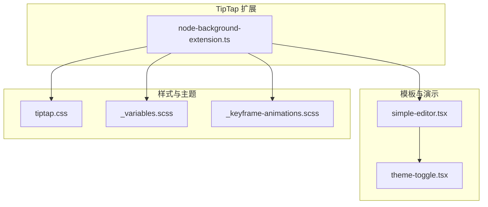
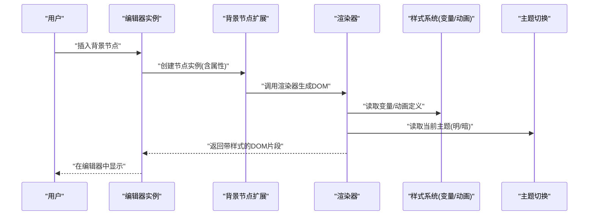
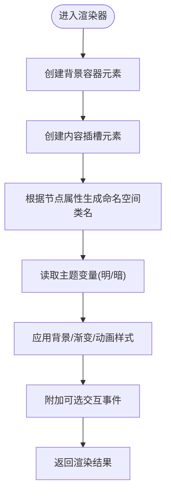
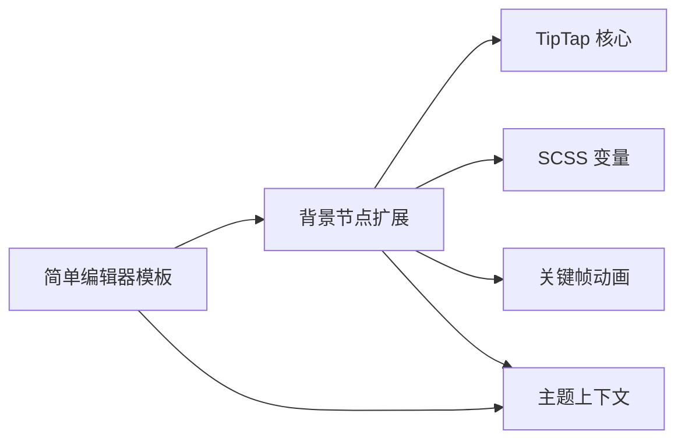

# 背景节点实现详解

<cite>
**本文引用的文件**   
- [node-background-extension.ts](file://src/components/tiptap-extension/node-background-extension.ts)
- [simple-editor.tsx](file://src/components/tiptap-templates/simple/simple-editor.tsx)
- [theme-toggle.tsx](file://src/components/tiptap-templates/simple/theme-toggle.tsx)
- [tiptap.css](file://src/features/tiptap/tiptap.css)
- [_variables.scss](file://src/styles/_variables.scss)
- [_keyframe-animations.scss](file://src/styles/_keyframe-animations.scss)
</cite>

## 目录
1. [简介](#简介)
2. [项目结构](#项目结构)
3. [核心组件](#核心组件)
4. [架构总览](#架构总览)
5. [详细组件分析](#详细组件分析)
6. [依赖关系分析](#依赖关系分析)
7. [性能考虑](#性能考虑)
8. [故障排查指南](#故障排查指南)
9. [结论](#结论)
10. [附录](#附录)

## 简介
本文件围绕 TipTap 背景节点扩展的实现进行系统化技术文档化，重点解析 node-background-extension.ts 的完整实现路径与渲染流程，涵盖：
- 背景样式的动态绑定机制
- CSS 类名的生成逻辑与样式隔离策略
- 从 DOM 生成到样式应用的端到端渲染过程
- 与编辑器主题（明/暗）集成及响应式适配
- 自定义背景颜色、渐变与动画的实践示例
- 常见样式冲突解决方案与性能优化技巧

## 项目结构
本项目采用按功能域组织的前端工程结构。与背景节点相关的代码主要位于 tiptap-extension 与 tiptap-templates 两个目录中，同时通过全局样式与变量管理主题与动画。



图表来源
- [node-background-extension.ts](file://src/components/tiptap-extension/node-background-extension.ts)
- [simple-editor.tsx](file://src/components/tiptap-templates/simple/simple-editor.tsx)
- [theme-toggle.tsx](file://src/components/tiptap-templates/simple/theme-toggle.tsx)
- [tiptap.css](file://src/features/tiptap/tiptap.css)
- [_variables.scss](file://src/styles/_variables.scss)
- [_keyframe-animations.scss](file://src/styles/_keyframe-animations.scss)

章节来源
- [node-background-extension.ts](file://src/components/tiptap-extension/node-background-extension.ts)
- [simple-editor.tsx](file://src/components/tiptap-templates/simple/simple-editor.tsx)
- [theme-toggle.tsx](file://src/components/tiptap-templates/simple/theme-toggle.tsx)
- [tiptap.css](file://src/features/tiptap/tiptap.css)
- [_variables.scss](file://src/styles/_variables.scss)
- [_keyframe-animations.scss](file://src/styles/_keyframe-animations.scss)

## 核心组件
- 背景节点扩展：负责在 TipTap 中注册一个“背景”类型的块级节点，提供默认属性、序列化/反序列化能力、DOM 渲染器以及样式注入与隔离策略。
- 简单编辑器模板：展示如何引入并使用背景节点扩展，并配合主题切换组件演示明/暗主题下的表现。
- 主题与动画：通过 SCSS 变量与关键帧动画定义可复用的视觉资源，供背景节点按需引用。

章节来源
- [node-background-extension.ts](file://src/components/tiptap-extension/node-background-extension.ts)
- [simple-editor.tsx](file://src/components/tiptap-templates/simple/simple-editor.tsx)
- [theme-toggle.tsx](file://src/components/tiptap-templates/simple/theme-toggle.tsx)
- [_variables.scss](file://src/styles/_variables.scss)
- [_keyframe-animations.scss](file://src/styles/_keyframe-animations.scss)

## 架构总览
背景节点的渲染链路如下：
- 扩展初始化：注册节点类型、定义 schema、配置渲染器。
- 数据驱动：节点属性（如背景色、渐变、动画等）作为状态参与渲染。
- DOM 构建：根据 schema 与渲染器生成容器元素与内容插槽。
- 样式应用：基于节点属性与主题上下文计算最终样式，并通过 CSS 类名或内联样式注入。
- 主题适配：依据根节点的主题类（明/暗）选择不同变量值，实现主题切换。
- 响应式：结合媒体查询与容器宽度自适应布局。



图表来源
- [node-background-extension.ts](file://src/components/tiptap-extension/node-background-extension.ts)
- [simple-editor.tsx](file://src/components/tiptap-templates/simple/simple-editor.tsx)
- [theme-toggle.tsx](file://src/components/tiptap-templates/simple/theme-toggle.tsx)
- [tiptap.css](file://src/features/tiptap/tiptap.css)
- [_variables.scss](file://src/styles/_variables.scss)
- [_keyframe-animations.scss](file://src/styles/_keyframe-animations.scss)

## 详细组件分析

### 背景节点扩展（node-background-extension.ts）
该扩展是背景节点的核心实现，承担以下职责：
- 节点定义与 Schema：声明节点名称、默认属性（例如背景色、渐变方向、动画类型等）、是否块级、可包含子节点等。
- 序列化/反序列化：将节点属性持久化为 JSON，并在加载时恢复为节点实例。
- DOM 渲染器：根据节点属性生成外层容器与内容插槽，确保编辑区内容与背景区域分离。
- 样式注入与隔离：
  - 使用命名空间化的 CSS 类名避免与全局样式冲突。
  - 通过 CSS 变量与主题类组合，实现明/暗主题无缝切换。
  - 支持响应式断点与容器相对单位，保证在不同屏幕尺寸下表现一致。
- 事件与交互：可选地处理点击、拖拽等交互，不影响编辑器的默认行为。

```mermaid
classDiagram
class BackgroundNode {
+string name
+object attrs
+toJSON() object
+parseHTML() HTMLParser
+render({ node, getAttrs }) HTMLElement
}
class ThemeContext {
+string mode
+applyTheme(mode) void
}
class StyleInjector {
+injectCSS(cssText) void
+generateClassName(prefix, suffix) string
+getVariables(theme) object
}
BackgroundNode --> ThemeContext : "读取主题"
BackgroundNode --> StyleInjector : "生成类名/注入样式"
```

图表来源
- [node-background-extension.ts](file://src/components/tiptap-extension/node-background-extension.ts)

章节来源
- [node-background-extension.ts](file://src/components/tiptap-extension/node-background-extension.ts)

#### 渲染流程（DOM 生成到样式应用）


图表来源
- [node-background-extension.ts](file://src/components/tiptap-extension/node-background-extension.ts)

章节来源
- [node-background-extension.ts](file://src/components/tiptap-extension/node-background-extension.ts)

#### 样式隔离与类名生成
- 命名空间前缀：为所有生成的类名添加统一前缀，避免与第三方库或全局样式冲突。
- 属性映射：将节点属性映射为具体的 CSS 类或变量赋值，确保样式与数据一一对应。
- 主题变量：通过 CSS 变量在明/暗主题间切换，无需重复编写两套样式。
- 响应式：利用媒体查询与相对单位，使背景在不同视口下自适应。

章节来源
- [node-background-extension.ts](file://src/components/tiptap-extension/node-background-extension.ts)
- [_variables.scss](file://src/styles/_variables.scss)
- [tiptap.css](file://src/features/tiptap/tiptap.css)

#### 主题集成（明/暗适配）
- 主题切换组件在根节点上切换主题类，背景节点通过读取该主题类决定使用的变量值。
- 变量集中管理于 SCSS 文件中，便于统一维护与扩展。

章节来源
- [theme-toggle.tsx](file://src/components/tiptap-templates/simple/theme-toggle.tsx)
- [_variables.scss](file://src/styles/_variables.scss)

#### 响应式设计支持
- 使用相对单位与弹性布局，确保背景容器随内容自适应。
- 针对小屏设备调整内边距与字体大小，提升可读性。

章节来源
- [tiptap.css](file://src/features/tiptap/tiptap.css)
- [_variables.scss](file://src/styles/_variables.scss)

### 简单编辑器模板（simple-editor.tsx）
- 引入并注册背景节点扩展。
- 提供工具栏或菜单项用于插入背景节点。
- 与主题切换组件联动，验证明/暗主题下的背景效果。

章节来源
- [simple-editor.tsx](file://src/components/tiptap-templates/simple/simple-editor.tsx)
- [theme-toggle.tsx](file://src/components/tiptap-templates/simple/theme-toggle.tsx)

### 主题与动画（_variables.scss 与 _keyframe-animations.scss）
- 变量：定义明/暗主题下的颜色、阴影、边框等基础变量。
- 动画：定义可复用的关键帧动画，供背景节点以类名方式启用。

章节来源
- [_variables.scss](file://src/styles/_variables.scss)
- [_keyframe-animations.scss](file://src/styles/_keyframe-animations.scss)

## 依赖关系分析
- 背景节点扩展依赖：
  - TipTap 核心 API（节点注册、Schema、渲染器）。
  - 样式系统（SCSS 变量、CSS 类名、动画）。
  - 主题上下文（通过根节点类名切换）。
- 模板与演示依赖：
  - 背景节点扩展。
  - 主题切换组件。
  - 全局样式与变量。



图表来源
- [node-background-extension.ts](file://src/components/tiptap-extension/node-background-extension.ts)
- [simple-editor.tsx](file://src/components/tiptap-templates/simple/simple-editor.tsx)
- [_variables.scss](file://src/styles/_variables.scss)
- [_keyframe-animations.scss](file://src/styles/_keyframe-animations.scss)

章节来源
- [node-background-extension.ts](file://src/components/tiptap-extension/node-background-extension.ts)
- [simple-editor.tsx](file://src/components/tiptap-templates/simple/simple-editor.tsx)
- [_variables.scss](file://src/styles/_variables.scss)
- [_keyframe-animations.scss](file://src/styles/_keyframe-animations.scss)

## 性能考虑
- 减少重排与重绘：
  - 尽量使用 CSS 变量与类名切换而非频繁修改内联样式。
  - 对复杂动画使用 will-change 与 transform 以提升合成层性能。
- 样式注入优化：
  - 合并同类样式规则，避免重复注入。
  - 使用命名空间类名降低选择器复杂度。
- 渲染优化：
  - 仅在节点属性变化时更新样式，避免不必要的重新渲染。
  - 对大段内容使用惰性渲染或虚拟滚动（若需要）。

[本节为通用指导，不直接分析具体文件]

## 故障排查指南
- 背景未生效：
  - 检查节点属性是否正确传递至渲染器。
  - 确认命名空间类名未被全局样式覆盖。
- 主题切换无效：
  - 验证根节点主题类是否成功切换。
  - 确认 SCSS 变量在明/暗主题下均有定义。
- 动画卡顿：
  - 检查是否使用了昂贵的动画属性（如 box-shadow 大量变化）。
  - 尝试改用 transform 与 opacity 提升性能。
- 样式冲突：
  - 使用浏览器开发者工具定位被覆盖的规则。
  - 提高选择器优先级或使用更具体的命名空间类名。

章节来源
- [node-background-extension.ts](file://src/components/tiptap-extension/node-background-extension.ts)
- [tiptap.css](file://src/features/tiptap/tiptap.css)
- [_variables.scss](file://src/styles/_variables.scss)

## 结论
背景节点扩展通过清晰的 Schema 定义、稳定的渲染器与完善的样式隔离机制，实现了在 TipTap 编辑器中灵活、可主题化且高性能的背景效果。借助 SCSS 变量与关键帧动画，用户可以轻松定制颜色、渐变与动画，并在明/暗主题与多尺寸设备上保持一致体验。遵循本文提供的最佳实践与优化建议，可进一步降低样式冲突风险并提升整体性能。

[本节为总结性内容，不直接分析具体文件]

## 附录

### 自定义背景颜色
- 在节点属性中指定颜色值，渲染器将其映射为对应的 CSS 变量或类名。
- 参考路径：
  - [node-background-extension.ts](file://src/components/tiptap-extension/node-background-extension.ts)
  - [_variables.scss](file://src/styles/_variables.scss)

### 自定义渐变效果
- 通过节点属性传入渐变方向与颜色序列，渲染器生成相应的 background-image 规则。
- 参考路径：
  - [node-background-extension.ts](file://src/components/tiptap-extension/node-background-extension.ts)
  - [tiptap.css](file://src/features/tiptap/tiptap.css)

### 自定义动画
- 在节点属性中启用预定义动画类名，或扩展新的关键帧动画。
- 参考路径：
  - [node-background-extension.ts](file://src/components/tiptap-extension/node-background-extension.ts)
  - [_keyframe-animations.scss](file://src/styles/_keyframe-animations.scss)

### 主题适配与响应式
- 在根节点切换主题类，背景节点自动读取对应变量。
- 使用媒体查询与相对单位实现响应式布局。
- 参考路径：
  - [theme-toggle.tsx](file://src/components/tiptap-templates/simple/theme-toggle.tsx)
  - [tiptap.css](file://src/features/tiptap/tiptap.css)
  - [_variables.scss](file://src/styles/_variables.scss)