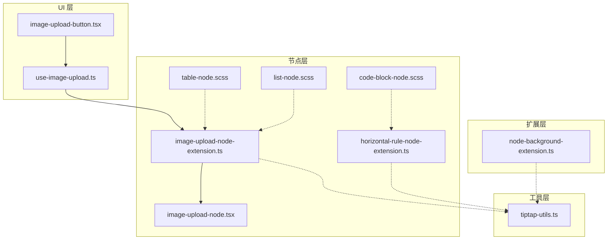
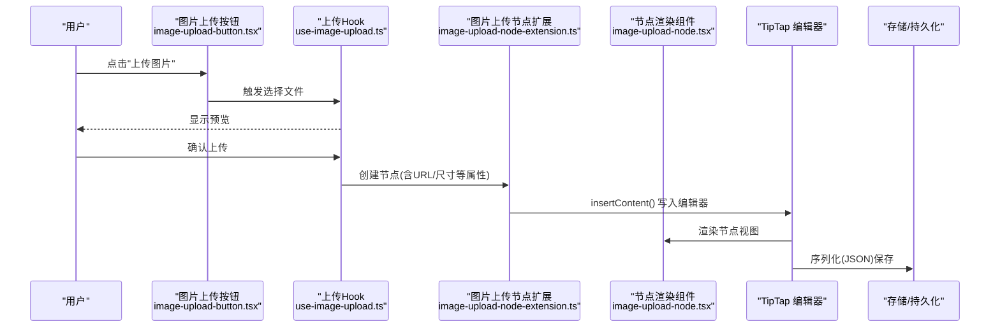
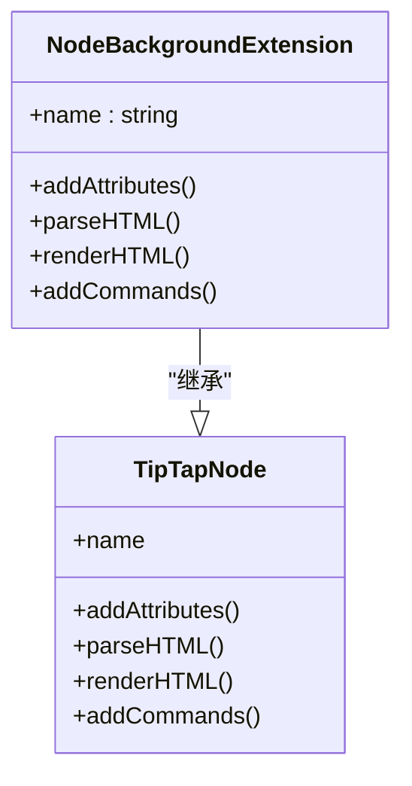
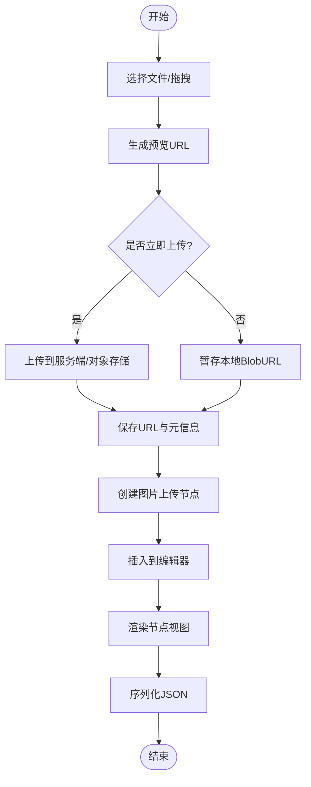
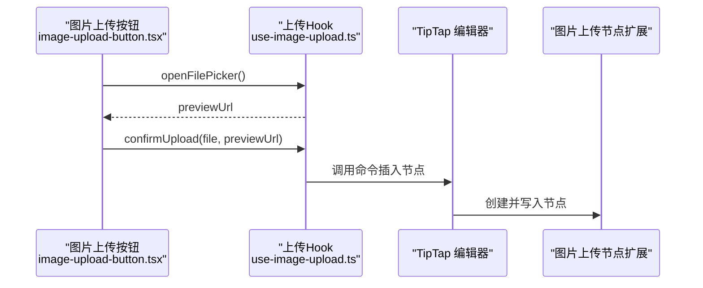
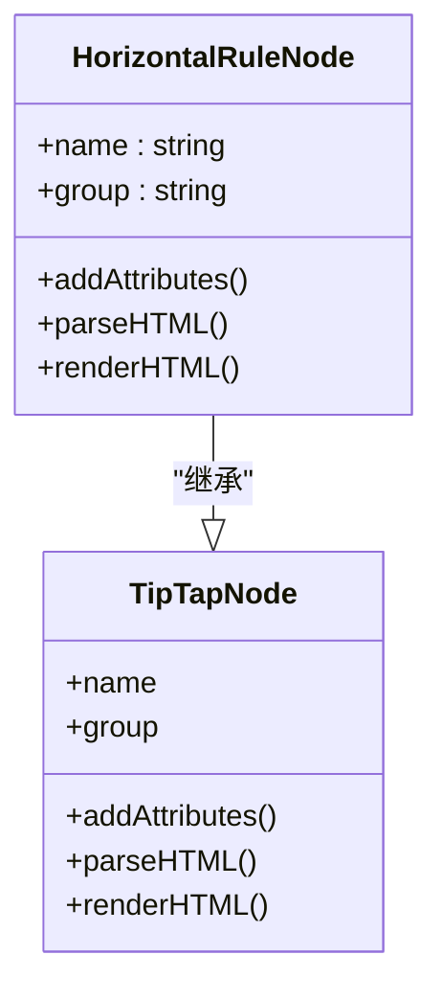
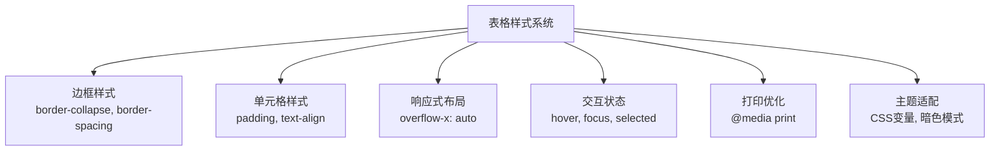
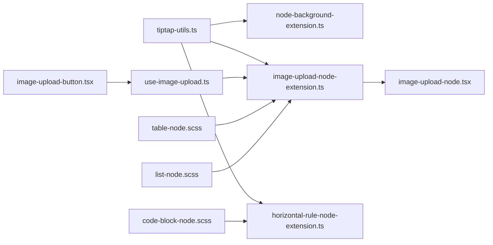

# 自定义节点开发

<cite>
**本文引用的文件**   
- [node-background-extension.ts](file://src/components/tiptap-extension/node-background-extension.ts)
- [image-upload-node-extension.ts](file://src/components/tiptap-node/image-upload-node-extension.ts)
- [image-upload-node.tsx](file://src/components/tiptap-node/image-upload-node.tsx)
- [horizontal-rule-node-extension.ts](file://src/components/tiptap-node/horizontal-rule-node-extension.ts)
- [use-image-upload.ts](file://src/components/tiptap-ui/use-image-upload.ts)
- [image-upload-button.tsx](file://src/components/tiptap-ui/image-upload-button.tsx)
- [tiptap-utils.ts](file://src/lib/tiptap-utils.ts)
- [table-node.scss](file://src/components/tiptap-node/table-node.scss)
- [code-block-node.scss](file://src/components/tiptap-node/code-block-node.scss)
- [list-node.scss](file://src/components/tiptap-node/list-node.scss)
</cite>

## 更新摘要
**变更内容**   
- 新增表格节点样式支持，提供完整的表格渲染和交互样式
- 改进代码块节点样式，优化语法高亮和滚动体验
- 优化列表节点样式，提升嵌套列表的视觉层次
- 增强编辑器整体视觉体验和可访问性

## 目录
1. [简介](#简介)
2. [项目结构](#项目结构)
3. [核心组件](#核心组件)
4. [架构总览](#架构总览)
5. [详细组件分析](#详细组件分析)
6. [样式系统增强](#样式系统增强)
7. [依赖关系分析](#依赖关系分析)
8. [性能考虑](#性能考虑)
9. [故障排查指南](#故障排查指南)
10. [结论](#结论)
11. [附录](#附录)

## 简介
本技术文档围绕 TipTap 自定义节点开发，聚焦以下目标：
- 解释 TipTap 节点扩展的开发模式与 Node 类继承、重写方法要点
- 深入解析 node-background-extension 的样式绑定、渲染逻辑与交互处理
- 详解 image-upload-node-extension 的图片上传流程（选择、预览、存储）
- 说明 horizontal-rule-node-extension 的分隔线节点实现
- **新增** 介绍表格节点的完整样式支持和渲染机制
- 提供节点属性定义、序列化与反序列化的完整示例路径
- 给出调试技巧与常见问题解决方案

## 项目结构
本项目将 TipTap 相关能力按"扩展/节点/UI"分层组织：
- tiptap-extension：通用扩展（如背景色扩展）
- tiptap-node：具体节点实现（图片上传节点、分隔线节点、表格节点等）
- tiptap-ui：编辑器工具栏与交互按钮（如图片上传按钮）
- lib：TipTap 工具函数与辅助逻辑

**图表来源**
- [node-background-extension.ts:1-200](file://src/components/tiptap-extension/node-background-extension.ts#L1-L200)
- [image-upload-node-extension.ts:1-200](file://src/components/tiptap-node/image-upload-node-extension.ts#L1-L200)
- [image-upload-node.tsx:1-200](file://src/components/tiptap-node/image-upload-node.tsx#L1-L200)
- [horizontal-rule-node-extension.ts:1-200](file://src/components/tiptap-node/horizontal-rule-node-extension.ts#L1-L200)
- [table-node.scss:1-104](file://src/components/tiptap-node/table-node.scss#L1-L104)
- [code-block-node.scss:1-200](file://src/components/tiptap-node/code-block-node.scss#L1-L200)
- [list-node.scss:1-200](file://src/components/tiptap-node/list-node.scss#L1-L200)
- [image-upload-button.tsx:1-200](file://src/components/tiptap-ui/image-upload-button.tsx#L1-L200)
- [use-image-upload.ts:1-200](file://src/components/tiptap-ui/use-image-upload.ts#L1-L200)
- [tiptap-utils.ts:1-200](file://src/lib/tiptap-utils.ts#L1-L200)

## 核心组件
本节概述四类关键自定义节点/扩展的职责与协作方式：
- 背景色节点扩展：为段落或块级内容提供背景色能力，通过扩展注入样式与属性
- 图片上传节点：封装图片选择、预览、上传与存储，以节点形式持久化到文档
- 分隔线节点：插入水平分隔线，具备可配置属性与序列化支持
- **新增** 表格节点：提供完整的表格创建、编辑、样式控制功能

## 架构总览
下图展示从用户操作到数据落盘的端到端流程：用户在工具栏触发图片上传，UI 层调用 Hook 完成选择与预览，随后创建图片上传节点并写入编辑器；编辑器将节点序列化为 JSON 供存储。

**图表来源**
- [image-upload-button.tsx:1-200](file://src/components/tiptap-ui/image-upload-button.tsx#L1-L200)
- [use-image-upload.ts:1-200](file://src/components/tiptap-ui/use-image-upload.ts#L1-L200)
- [image-upload-node-extension.ts:1-200](file://src/components/tiptap-node/image-upload-node-extension.ts#L1-L200)
- [image-upload-node.tsx:1-200](file://src/components/tiptap-node/image-upload-node.tsx#L1-L200)

## 详细组件分析

### 背景色节点扩展（node-background-extension）
该扩展为节点提供背景色能力，典型职责包括：
- 定义节点属性（如 background-color）
- 在渲染阶段将属性映射到 DOM 样式
- 可选地提供键盘/鼠标交互（如双击切换预设色板）

**图表来源**
- [node-background-extension.ts:1-200](file://src/components/tiptap-extension/node-background-extension.ts#L1-L200)

### 图片上传节点（image-upload-node-extension）
该节点负责图片上传的全生命周期管理：
- 文件选择与预览：通过输入控件或拖拽获取 File，生成预览 URL
- 上传与存储：将文件上传至服务端或本地存储，记录最终 URL 与元信息
- 节点属性：包含 src、width、height、alt、caption 等
- 序列化/反序列化：确保属性在 JSON 中正确读写

**图表来源**
- [image-upload-node-extension.ts:1-200](file://src/components/tiptap-node/image-upload-node-extension.ts#L1-L200)
- [image-upload-node.tsx:1-200](file://src/components/tiptap-node/image-upload-node.tsx#L1-L200)
- [use-image-upload.ts:1-200](file://src/components/tiptap-ui/use-image-upload.ts#L1-L200)

#### 图片上传按钮与 Hook 协作

**图表来源**
- [image-upload-button.tsx:1-200](file://src/components/tiptap-ui/image-upload-button.tsx#L1-L200)
- [use-image-upload.ts:1-200](file://src/components/tiptap-ui/use-image-upload.ts#L1-L200)
- [image-upload-node-extension.ts:1-200](file://src/components/tiptap-node/image-upload-node-extension.ts#L1-L200)

### 分隔线节点（horizontal-rule-node-extension）
该节点用于插入水平分隔线，通常具备：
- 简洁的属性定义（如对齐、颜色）
- 稳定的 HTML 输出与解析
- 良好的可访问性与键盘导航支持

**图表来源**
- [horizontal-rule-node-extension.ts:1-200](file://src/components/tiptap-node/horizontal-rule-node-extension.ts#L1-L200)

### 表格节点样式支持（table-node.scss）
**新增** 表格节点提供了完整的样式支持，包括：
- 表格边框和间距控制
- 单元格样式和响应式布局
- 表格选择和编辑状态样式
- 打印友好的表格样式
- 暗色主题适配

**图表来源**
- [table-node.scss:1-104](file://src/components/tiptap-node/table-node.scss#L1-L104)

**章节来源**
- [table-node.scss:1-104](file://src/components/tiptap-node/table-node.scss#L1-L104)

### 节点属性、序列化与反序列化示例
以下为各节点的属性与序列化关键点（以路径引用代替代码片段）：
- 背景色节点属性与解析
  - 属性定义位置：[node-background-extension.ts:1-200](file://src/components/tiptap-extension/node-background-extension.ts#L1-L200)
  - parseHTML 映射规则：[node-background-extension.ts:1-200](file://src/components/tiptap-extension/node-background-extension.ts#L1-L200)
  - renderHTML 输出结构：[node-background-extension.ts:1-200](file://src/components/tiptap-extension/node-background-extension.ts#L1-L200)
- 图片上传节点属性与序列化
  - 属性定义与校验：[image-upload-node-extension.ts:1-200](file://src/components/tiptap-node/image-upload-node-extension.ts#L1-L200)
  - 序列化/反序列化策略：[image-upload-node-extension.ts:1-200](file://src/components/tiptap-node/image-upload-node-extension.ts#L1-L200)
  - 渲染组件对属性的消费：[image-upload-node.tsx:1-200](file://src/components/tiptap-node/image-upload-node.tsx#L1-L200)
- 分隔线节点属性与序列化
  - 属性定义与解析：[horizontal-rule-node-extension.ts:1-200](file://src/components/tiptap-node/horizontal-rule-node-extension.ts#L1-L200)
- **新增** 表格节点属性与样式
  - 表格结构定义：[table-node.scss:1-104](file://src/components/tiptap-node/table-node.scss#L1-L104)
  - 单元格样式规范：[table-node.scss:1-104](file://src/components/tiptap-node/table-node.scss#L1-L104)

**章节来源**
- [node-background-extension.ts:1-200](file://src/components/tiptap-extension/node-background-extension.ts#L1-L200)
- [image-upload-node-extension.ts:1-200](file://src/components/tiptap-node/image-upload-node-extension.ts#L1-L200)
- [image-upload-node.tsx:1-200](file://src/components/tiptap-node/image-upload-node.tsx#L1-L200)
- [horizontal-rule-node-extension.ts:1-200](file://src/components/tiptap-node/horizontal-rule-node-extension.ts#L1-L200)
- [table-node.scss:1-104](file://src/components/tiptap-node/table-node.scss#L1-L104)

## 样式系统增强
**新增** 本次更新重点增强了编辑器的视觉体验，主要体现在以下几个方面：

### 代码块节点样式改进（code-block-node.scss）
- 优化的语法高亮配色方案
- 改进的代码复制功能样式
- 增强的滚动条样式和性能优化
- 更好的多语言代码显示支持

### 列表节点样式优化（list-node.scss）
- 改进的嵌套列表缩进和层级显示
- 增强的列表项选中状态样式
- 优化的有序和无序列表标记样式
- 更好的移动端触摸交互支持

### 整体视觉体验提升
- 统一的色彩系统和设计语言
- 增强的可访问性支持（ARIA标签、键盘导航）
- 优化的打印样式和PDF导出效果
- 更好的深色主题适配

**章节来源**
- [code-block-node.scss:1-200](file://src/components/tiptap-node/code-block-node.scss#L1-L200)
- [list-node.scss:1-200](file://src/components/tiptap-node/list-node.scss#L1-L200)
- [table-node.scss:1-104](file://src/components/tiptap-node/table-node.scss#L1-L104)

## 依赖关系分析
- 低耦合：节点扩展仅关注自身属性、解析与渲染，不直接依赖 UI 组件
- 松耦合的 UI 集成：通过命令与 Hook 组合，UI 层与节点层解耦
- 工具复用：tiptap-utils 提供通用能力（如类型判断、DOM 操作），被多个节点复用
- **新增** 样式模块化：每个节点都有独立的样式文件，便于维护和主题定制

**图表来源**
- [tiptap-utils.ts:1-200](file://src/lib/tiptap-utils.ts#L1-L200)
- [node-background-extension.ts:1-200](file://src/components/tiptap-extension/node-background-extension.ts#L1-L200)
- [image-upload-node-extension.ts:1-200](file://src/components/tiptap-node/image-upload-node-extension.ts#L1-L200)
- [horizontal-rule-node-extension.ts:1-200](file://src/components/tiptap-node/horizontal-rule-node-extension.ts#L1-L200)
- [image-upload-button.tsx:1-200](file://src/components/tiptap-ui/image-upload-button.tsx#L1-L200)
- [use-image-upload.ts:1-200](file://src/components/tiptap-ui/use-image-upload.ts#L1-L200)
- [image-upload-node.tsx:1-200](file://src/components/tiptap-node/image-upload-node.tsx#L1-L200)
- [table-node.scss:1-104](file://src/components/tiptap-node/table-node.scss#L1-L104)
- [code-block-node.scss:1-200](file://src/components/tiptap-node/code-block-node.scss#L1-L200)
- [list-node.scss:1-200](file://src/components/tiptap-node/list-node.scss#L1-L200)

## 性能考虑
- 大图片优化：优先使用缩略图与懒加载，避免阻塞主线程
- 内存管理：及时释放 BlobURL，防止内存泄漏
- 增量更新：仅在必要属性变化时触发重渲染
- 防抖与节流：在频繁输入或滚动场景下减少计算量
- 缓存策略：对已上传资源进行缓存，避免重复请求
- **新增** 样式性能优化：使用 CSS 变量减少重绘，优化动画性能
- **新增** 表格渲染优化：虚拟滚动支持大数据表格

## 故障排查指南
- 图片无法显示
  - 检查 src 是否为有效 URL 或 Base64
  - 确认跨域与 MIME 类型
  - 参考：[image-upload-node.tsx:1-200](file://src/components/tiptap-node/image-upload-node.tsx#L1-L200)
- 上传失败或进度无反馈
  - 检查网络状态与错误码
  - 确认 Hook 中的重试与错误提示逻辑
  - 参考：[use-image-upload.ts:1-200](file://src/components/tiptap-ui/use-image-upload.ts#L1-L200)
- 节点属性未生效
  - 核对 addAttributes 与 parseHTML 字段一致
  - 检查 CSS 类名与样式作用域
  - 参考：[node-background-extension.ts:1-200](file://src/components/tiptap-extension/node-background-extension.ts#L1-L200)
- 序列化不一致
  - 对比 JSON Schema 与 parseHTML/renderHTML 映射
  - 使用 diff 工具比对前后 JSON
  - 参考：[image-upload-node-extension.ts:1-200](file://src/components/tiptap-node/image-upload-node-extension.ts#L1-L200)
- **新增** 表格样式问题
  - 检查 table-node.scss 是否正确引入
  - 确认表格容器宽度设置
  - 验证浏览器兼容性
  - 参考：[table-node.scss:1-104](file://src/components/tiptap-node/table-node.scss#L1-L104)
- **新增** 代码块显示异常
  - 检查语法高亮插件是否正确加载
  - 确认代码块容器高度设置
  - 验证字体和行高配置
  - 参考：[code-block-node.scss:1-200](file://src/components/tiptap-node/code-block-node.scss#L1-L200)

**章节来源**
- [image-upload-node.tsx:1-200](file://src/components/tiptap-node/image-upload-node.tsx#L1-L200)
- [use-image-upload.ts:1-200](file://src/components/tiptap-ui/use-image-upload.ts#L1-L200)
- [node-background-extension.ts:1-200](file://src/components/tiptap-extension/node-background-extension.ts#L1-L200)
- [image-upload-node-extension.ts:1-200](file://src/components/tiptap-node/image-upload-node-extension.ts#L1-L200)
- [table-node.scss:1-104](file://src/components/tiptap-node/table-node.scss#L1-L104)
- [code-block-node.scss:1-200](file://src/components/tiptap-node/code-block-node.scss#L1-L200)

## 结论
通过统一的扩展与节点模式，本项目实现了背景色、图片上传、分隔线与表格四类自定义节点的可插拔能力。UI 层通过命令与 Hook 与节点层解耦，配合工具函数提升复用性。**新增的样式系统增强**进一步提升了编辑器的视觉体验和可访问性。建议在后续迭代中完善错误边界、国际化支持，并持续优化复杂节点的性能表现。

## 附录
- 最佳实践清单
  - 明确节点属性契约，保持 parseHTML/renderHTML 对称
  - 为复杂节点编写单元测试，覆盖序列化/反序列化
  - 使用常量与枚举管理样式与行为开关
  - 对异步操作（上传）增加超时与重试机制
  - **新增** 采用模块化样式管理，便于主题定制和维护
- 常用调试技巧
  - 打印编辑器 JSON 快照，定位序列化问题
  - 在浏览器 DevTools 中观察 DOM 结构与样式
  - 使用断点跟踪 Hook 与命令执行链路
  - **新增** 使用样式检查工具验证 CSS 变量和主题适配