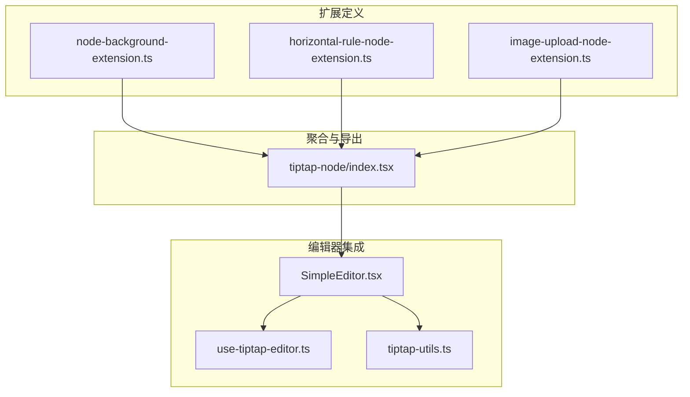
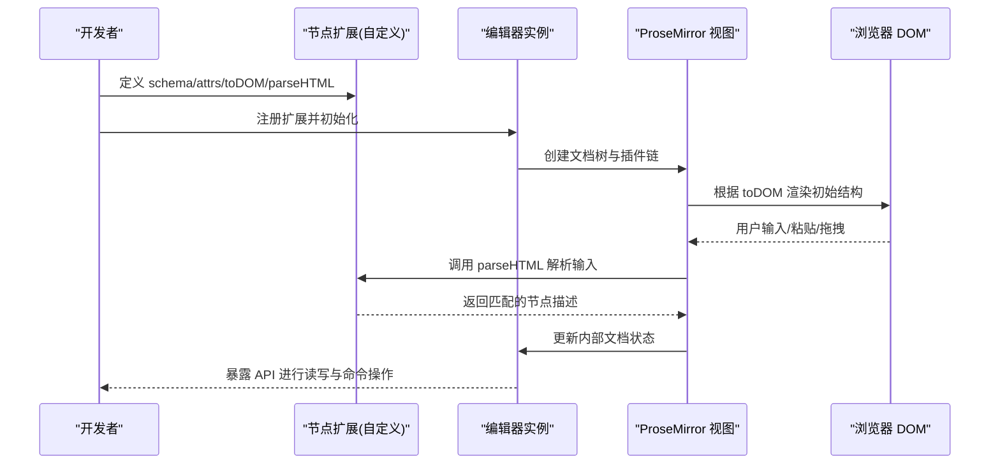
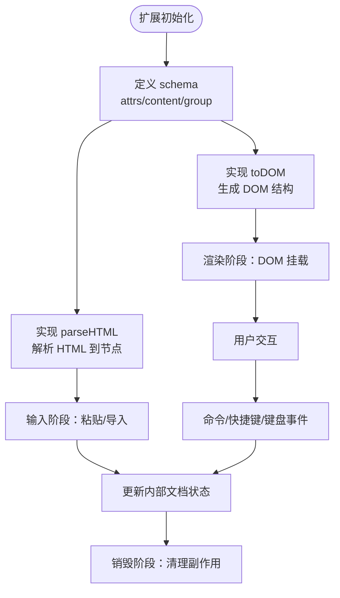
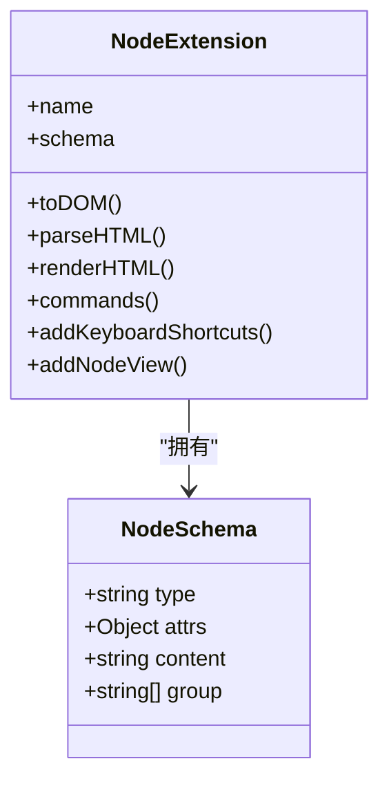
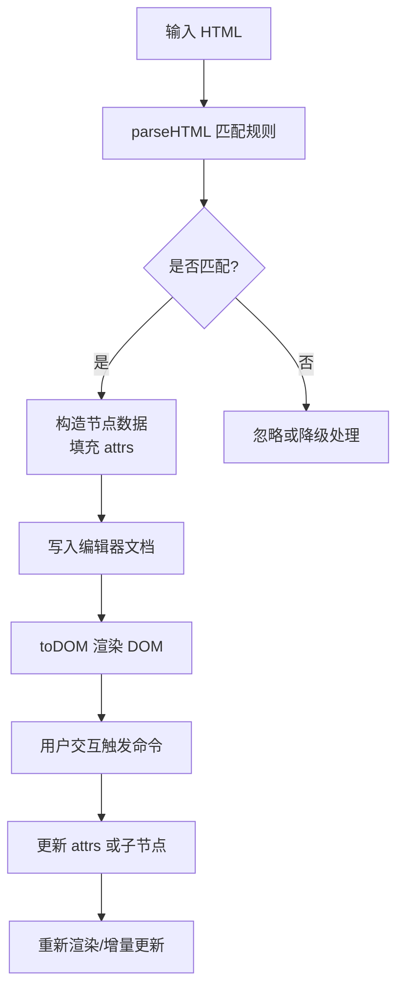
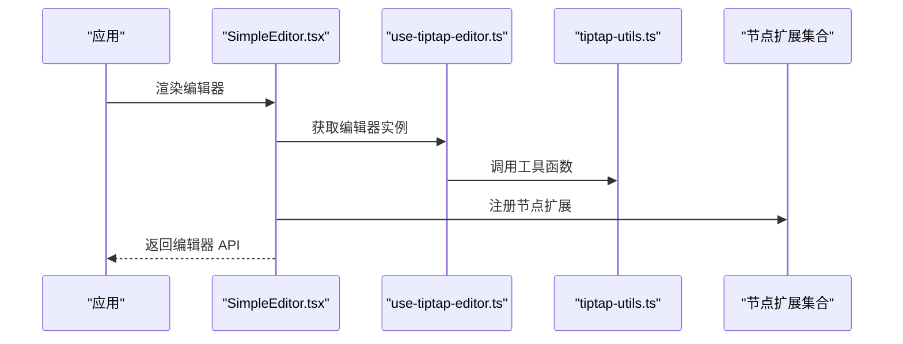
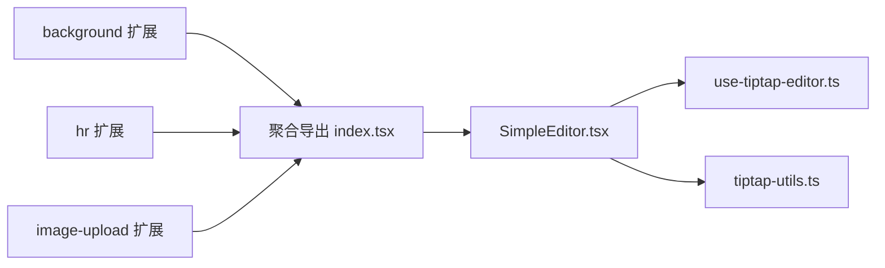

# 节点扩展基础概念

<cite>
**本文引用的文件**   
- [node-background-extension.ts](file://src/components/tiptap-extension/node-background-extension.ts)
- [horizontal-rule-node-extension.ts](file://src/components/tiptap-node/horizontal-rule-node-extension.ts)
- [image-upload-node-extension.ts](file://src/components/tiptap-node/image-upload-node-extension.ts)
- [index.tsx](file://src/components/tiptap-node/index.tsx)
- [use-tiptap-editor.ts](file://src/hooks/use-tiptap-editor.ts)
- [tiptap-utils.ts](file://src/lib/tiptap-utils.ts)
- [SimpleEditor.tsx](file://src/features/tiptap/SimpleEditor.tsx)
</cite>

## 目录
1. [简介](#简介)
2. [项目结构](#项目结构)
3. [核心组件](#核心组件)
4. [架构总览](#架构总览)
5. [详细组件分析](#详细组件分析)
6. [依赖分析](#依赖分析)
7. [性能考虑](#性能考虑)
8. [故障排查指南](#故障排查指南)
9. [结论](#结论)
10. [附录](#附录)

## 简介
本文件面向希望基于 TipTap 构建自定义节点的开发者，系统梳理节点扩展的基础概念与实现要点。内容覆盖：
- Node 类继承机制、生命周期方法与扩展点
- 节点扩展基本结构：schema、renderHTML、parseHTML、toDOM 的职责与协作关系
- 节点属性系统、数据绑定与状态管理
- 完整开发模板与最佳实践
- 调试技巧与性能优化建议

## 项目结构
仓库中与 TipTap 节点扩展相关的代码主要分布在以下位置：
- 扩展定义（Node/Extension）：src/components/tiptap-extension、src/components/tiptap-node
- 编辑器集成与配置：src/features/tiptap、src/hooks、src/lib
- 示例与入口：src/features/tiptap/SimpleEditor.tsx

图表来源
- [node-background-extension.ts:1-200](file://src/components/tiptap-extension/node-background-extension.ts#L1-L200)
- [horizontal-rule-node-extension.ts:1-200](file://src/components/tiptap-node/horizontal-rule-node-extension.ts#L1-L200)
- [image-upload-node-extension.ts:1-200](file://src/components/tiptap-node/image-upload-node-extension.ts#L1-L200)
- [index.tsx](file://src/components/tiptap-node/index.tsx)
- [SimpleEditor.tsx](file://src/features/tiptap/SimpleEditor.tsx)
- [use-tiptap-editor.ts](file://src/hooks/use-tiptap-editor.ts)
- [tiptap-utils.ts](file://src/lib/tiptap-utils.ts)

章节来源
- [node-background-extension.ts:1-200](file://src/components/tiptap-extension/node-background-extension.ts#L1-L200)
- [horizontal-rule-node-extension.ts:1-200](file://src/components/tiptap-node/horizontal-rule-node-extension.ts#L1-L200)
- [image-upload-node-extension.ts:1-200](file://src/components/tiptap-node/image-upload-node-extension.ts#L1-L200)
- [index.tsx](file://src/components/tiptap-node/index.tsx)
- [SimpleEditor.tsx](file://src/features/tiptap/SimpleEditor.tsx)
- [use-tiptap-editor.ts](file://src/hooks/use-tiptap-editor.ts)
- [tiptap-utils.ts](file://src/lib/tiptap-utils.ts)

## 核心组件
本节聚焦于项目中已实现的节点扩展，帮助理解 TipTap 节点在真实工程中的落地方式。

- 背景色节点扩展
  - 职责：为段落或块级节点提供背景色能力，通常通过 schema 的 attrs 声明颜色属性，并在 toDOM/renderHTML 中输出样式。
  - 关键点：attrs 默认值、CSS 变量或内联样式的注入时机、与现有节点组合使用的方式。
  - 参考路径：[node-background-extension.ts](file://src/components/tiptap-extension/node-background-extension.ts)

- 水平分割线节点
  - 职责：新增一个独立的块级节点，用于插入水平分割线。
  - 关键点：schema 的 group/content 约束、toDOM 渲染 HTML 标签、可选的 parseHTML 解析规则。
  - 参考路径：[horizontal-rule-node-extension.ts](file://src/components/tiptap-node/horizontal-rule-node-extension.ts)

- 图片上传节点扩展
  - 职责：将图片上传流程与节点数据模型结合，支持本地选择、预览、上传后回填 URL 等。
  - 关键点：attrs 包含 src/alt/title 等字段；事件处理与副作用（如上传）在命令或视图层触发；与编辑器状态同步。
  - 参考路径：[image-upload-node-extension.ts](file://src/components/tiptap-node/image-upload-node-extension.ts)

- 节点聚合导出
  - 职责：集中导出各节点扩展，供编辑器统一注册。
  - 关键点：命名空间组织、按需引入、版本兼容策略。
  - 参考路径：[index.tsx](file://src/components/tiptap-node/index.tsx)

章节来源
- [node-background-extension.ts:1-200](file://src/components/tiptap-extension/node-background-extension.ts#L1-L200)
- [horizontal-rule-node-extension.ts:1-200](file://src/components/tiptap-node/horizontal-rule-node-extension.ts#L1-L200)
- [image-upload-node-extension.ts:1-200](file://src/components/tiptap-node/image-upload-node-extension.ts#L1-L200)
- [index.tsx](file://src/components/tiptap-node/index.tsx)

## 架构总览
TipTap 节点扩展在编辑器中的典型交互链路如下：

图表来源
- [SimpleEditor.tsx](file://src/features/tiptap/SimpleEditor.tsx)
- [use-tiptap-editor.ts](file://src/hooks/use-tiptap-editor.ts)
- [tiptap-utils.ts](file://src/lib/tiptap-utils.ts)
- [horizontal-rule-node-extension.ts:1-200](file://src/components/tiptap-node/horizontal-rule-node-extension.ts#L1-L200)
- [image-upload-node-extension.ts:1-200](file://src/components/tiptap-node/image-upload-node-extension.ts#L1-L200)
- [node-background-extension.ts:1-200](file://src/components/tiptap-extension/node-background-extension.ts#L1-L200)

## 详细组件分析

### 节点扩展通用结构与生命周期
TipTap 节点扩展围绕以下核心部分展开：
- schema：定义节点类型、属性（attrs）、可包含的子节点（content）、分组（group）等
- toDOM：将内部节点数据映射为 DOM 结构
- renderHTML：将节点序列化为 HTML 字符串（常用于导出）
- parseHTML：从 HTML 反序列化为内部节点（常用于粘贴/导入）
- 生命周期与扩展点：onCreate/onDestroy、commands、addKeyboardShortcuts、addNodeView 等

图表来源
- [horizontal-rule-node-extension.ts:1-200](file://src/components/tiptap-node/horizontal-rule-node-extension.ts#L1-L200)
- [image-upload-node-extension.ts:1-200](file://src/components/tiptap-node/image-upload-node-extension.ts#L1-L200)
- [node-background-extension.ts:1-200](file://src/components/tiptap-extension/node-background-extension.ts#L1-L200)

章节来源
- [horizontal-rule-node-extension.ts:1-200](file://src/components/tiptap-node/horizontal-rule-node-extension.ts#L1-L200)
- [image-upload-node-extension.ts:1-200](file://src/components/tiptap-node/image-upload-node-extension.ts#L1-L200)
- [node-background-extension.ts:1-200](file://src/components/tiptap-extension/node-background-extension.ts#L1-L200)

### 节点属性系统与数据绑定
- 属性声明：在 schema.attrs 中声明属性名、类型与默认值
- 数据绑定：通过 commands 修改属性，或通过 setAttributes 在运行时更新
- 状态管理：结合 React 状态或外部 store，将节点属性变化驱动 UI 更新
- 持久化：序列化时保留 attrs，反序列化时恢复默认值

图表来源
- [horizontal-rule-node-extension.ts:1-200](file://src/components/tiptap-node/horizontal-rule-node-extension.ts#L1-L200)
- [image-upload-node-extension.ts:1-200](file://src/components/tiptap-node/image-upload-node-extension.ts#L1-L200)
- [node-background-extension.ts:1-200](file://src/components/tiptap-extension/node-background-extension.ts#L1-L200)

章节来源
- [horizontal-rule-node-extension.ts:1-200](file://src/components/tiptap-node/horizontal-rule-node-extension.ts#L1-L200)
- [image-upload-node-extension.ts:1-200](file://src/components/tiptap-node/image-upload-node-extension.ts#L1-L200)
- [node-background-extension.ts:1-200](file://src/components/tiptap-extension/node-background-extension.ts#L1-L200)

### 关键方法详解
- schema
  - 作用：定义节点的数据模型与约束
  - 关注点：attrs 的类型校验、content 的嵌套限制、group 的语义分组
- toDOM
  - 作用：将节点数据转换为 DOM 结构
  - 关注点：属性到 DOM 属性的映射、样式注入、事件绑定
- renderHTML
  - 作用：将节点序列化为 HTML 字符串
  - 关注点：与 toDOM 保持一致性、避免多余标签
- parseHTML
  - 作用：从 HTML 解析为节点
  - 关注点：匹配规则精确性、容错处理、默认值回退

图表来源
- [horizontal-rule-node-extension.ts:1-200](file://src/components/tiptap-node/horizontal-rule-node-extension.ts#L1-L200)
- [image-upload-node-extension.ts:1-200](file://src/components/tiptap-node/image-upload-node-extension.ts#L1-L200)
- [node-background-extension.ts:1-200](file://src/components/tiptap-extension/node-background-extension.ts#L1-L200)

章节来源
- [horizontal-rule-node-extension.ts:1-200](file://src/components/tiptap-node/horizontal-rule-node-extension.ts#L1-L200)
- [image-upload-node-extension.ts:1-200](file://src/components/tiptap-node/image-upload-node-extension.ts#L1-L200)
- [node-background-extension.ts:1-200](file://src/components/tiptap-extension/node-background-extension.ts#L1-L200)

### 编辑器集成与入口
- 编辑器初始化：在 SimpleEditor 中注册所有节点扩展
- 工具函数：在 tiptap-utils 中封装常用命令与辅助逻辑
- Hook 封装：use-tiptap-editor 提供统一的编辑器实例与状态访问

图表来源
- [SimpleEditor.tsx](file://src/features/tiptap/SimpleEditor.tsx)
- [use-tiptap-editor.ts](file://src/hooks/use-tiptap-editor.ts)
- [tiptap-utils.ts](file://src/lib/tiptap-utils.ts)
- [index.tsx](file://src/components/tiptap-node/index.tsx)

章节来源
- [SimpleEditor.tsx](file://src/features/tiptap/SimpleEditor.tsx)
- [use-tiptap-editor.ts](file://src/hooks/use-tiptap-editor.ts)
- [tiptap-utils.ts](file://src/lib/tiptap-utils.ts)
- [index.tsx](file://src/components/tiptap-node/index.tsx)

## 依赖分析
- 模块耦合
  - 节点扩展之间尽量保持低耦合，通过聚合导出统一管理
  - 编辑器入口负责装配，不直接持有业务细节
- 外部依赖
  - TipTap 核心库与 ProseMirror 底层
  - React 生态（若使用 NodeView 或 UI 组件）
- 潜在循环依赖
  - 避免在扩展中反向引用编辑器实例，必要时通过回调或上下文传递

图表来源
- [node-background-extension.ts:1-200](file://src/components/tiptap-extension/node-background-extension.ts#L1-L200)
- [horizontal-rule-node-extension.ts:1-200](file://src/components/tiptap-node/horizontal-rule-node-extension.ts#L1-L200)
- [image-upload-node-extension.ts:1-200](file://src/components/tiptap-node/image-upload-node-extension.ts#L1-L200)
- [index.tsx](file://src/components/tiptap-node/index.tsx)
- [SimpleEditor.tsx](file://src/features/tiptap/SimpleEditor.tsx)
- [use-tiptap-editor.ts](file://src/hooks/use-tiptap-editor.ts)
- [tiptap-utils.ts](file://src/lib/tiptap-utils.ts)

章节来源
- [node-background-extension.ts:1-200](file://src/components/tiptap-extension/node-background-extension.ts#L1-L200)
- [horizontal-rule-node-extension.ts:1-200](file://src/components/tiptap-node/horizontal-rule-node-extension.ts#L1-L200)
- [image-upload-node-extension.ts:1-200](file://src/components/tiptap-node/image-upload-node-extension.ts#L1-L200)
- [index.tsx](file://src/components/tiptap-node/index.tsx)
- [SimpleEditor.tsx](file://src/features/tiptap/SimpleEditor.tsx)
- [use-tiptap-editor.ts](file://src/hooks/use-tiptap-editor.ts)
- [tiptap-utils.ts](file://src/lib/tiptap-utils.ts)

## 性能考虑
- 渲染优化
  - 避免在 toDOM 中进行昂贵计算，优先使用 CSS 变量或预计算样式
  - 对复杂节点使用 memo 或虚拟滚动（当列表很长时）
- 解析优化
  - parseHTML 规则尽量具体，减少回溯与匹配分支
  - 对大段 HTML 分批解析或延迟处理
- 状态更新
  - 批量更新 attrs，减少不必要的重渲染
  - 使用命令合并与防抖/节流处理高频输入
- 内存管理
  - 在 onDestroy 中清理定时器、事件监听与第三方资源
  - 避免闭包持有大对象引用

## 故障排查指南
- 常见问题定位
  - 节点未渲染：检查 schema 的 content/group 是否与父节点兼容
  - 粘贴失败：核对 parseHTML 的匹配规则与目标标签/属性
  - 属性未生效：确认 toDOM 是否正确映射 attrs 到 DOM 属性或样式
- 调试技巧
  - 在 onRender/onCreate 中打印节点数据与 DOM 结构
  - 使用浏览器开发者工具的“元素”面板观察 DOM 变更
  - 通过命令日志记录 attrs 变更轨迹
- 错误边界
  - 在 NodeView 或 UI 层捕获异常，避免崩溃整个编辑器
  - 提供降级渲染方案，确保基本可读性

章节来源
- [horizontal-rule-node-extension.ts:1-200](file://src/components/tiptap-node/horizontal-rule-node-extension.ts#L1-L200)
- [image-upload-node-extension.ts:1-200](file://src/components/tiptap-node/image-upload-node-extension.ts#L1-L200)
- [node-background-extension.ts:1-200](file://src/components/tiptap-extension/node-background-extension.ts#L1-L200)

## 结论
通过本项目中的多个节点扩展示例，可以清晰看到 TipTap 节点扩展的标准模式与最佳实践：以 schema 为中心定义数据模型，用 toDOM/parseHTML 完成双向转换，借助命令与生命周期钩子实现交互与副作用。遵循低耦合、高内聚的组织方式，配合合理的性能优化与调试手段，能够高效构建稳定可扩展的富文本节点体系。

## 附录

### 节点扩展开发模板（步骤清单）
- 定义 schema
  - 指定 type/name、attrs 及其默认值
  - 明确 content/group 约束
- 实现 toDOM
  - 将 attrs 映射为 DOM 属性或样式
  - 添加必要的事件监听（谨慎管理生命周期）
- 实现 parseHTML
  - 编写精确的匹配规则
  - 处理缺失属性时的默认值
- 实现 renderHTML（如需导出）
  - 与 toDOM 保持一致的输出语义
- 集成命令与快捷键
  - 提供设置/清除属性的命令
  - 绑定常用快捷键提升体验
- 注册与测试
  - 在编辑器入口注册扩展
  - 编写单元测试覆盖解析/渲染/命令路径

章节来源
- [horizontal-rule-node-extension.ts:1-200](file://src/components/tiptap-node/horizontal-rule-node-extension.ts#L1-L200)
- [image-upload-node-extension.ts:1-200](file://src/components/tiptap-node/image-upload-node-extension.ts#L1-L200)
- [node-background-extension.ts:1-200](file://src/components/tiptap-extension/node-background-extension.ts#L1-L200)
- [index.tsx](file://src/components/tiptap-node/index.tsx)
- [SimpleEditor.tsx](file://src/features/tiptap/SimpleEditor.tsx)