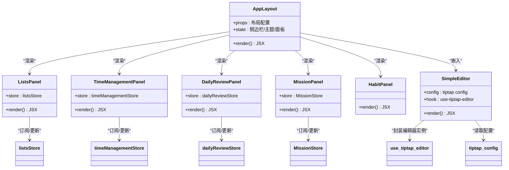
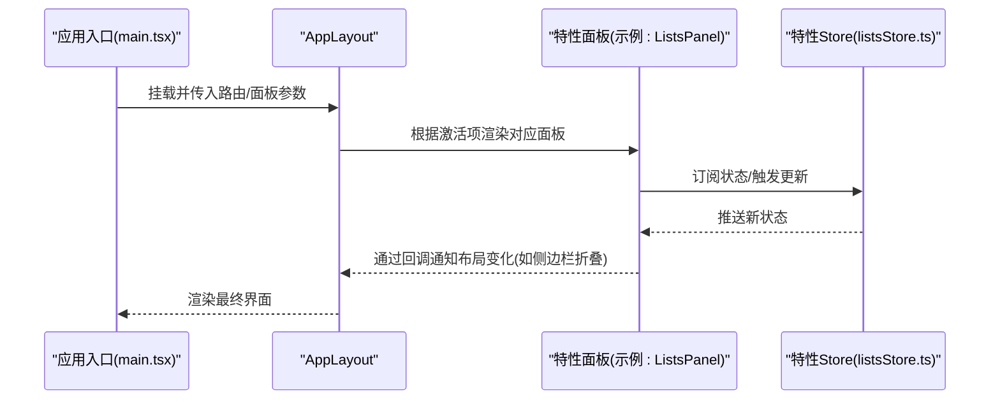
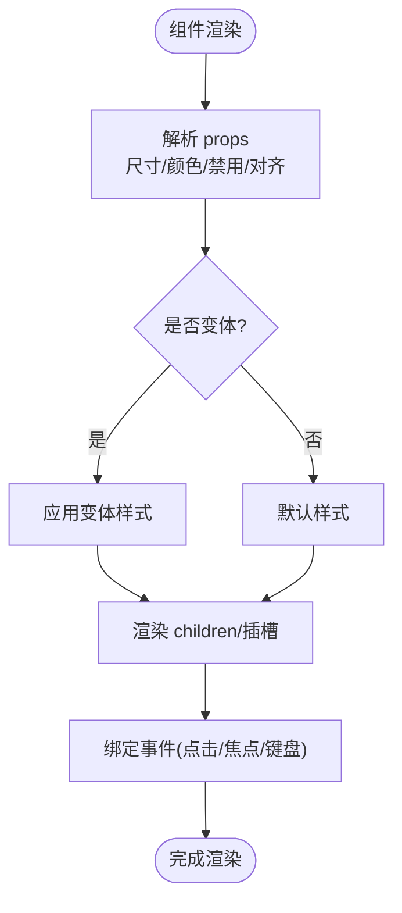
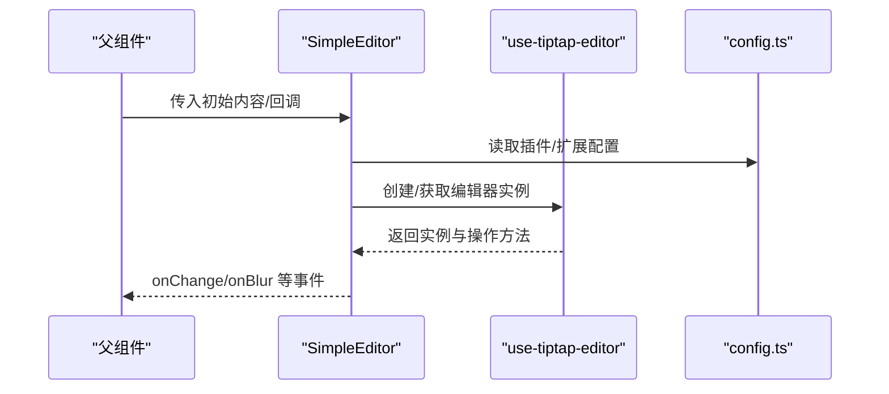
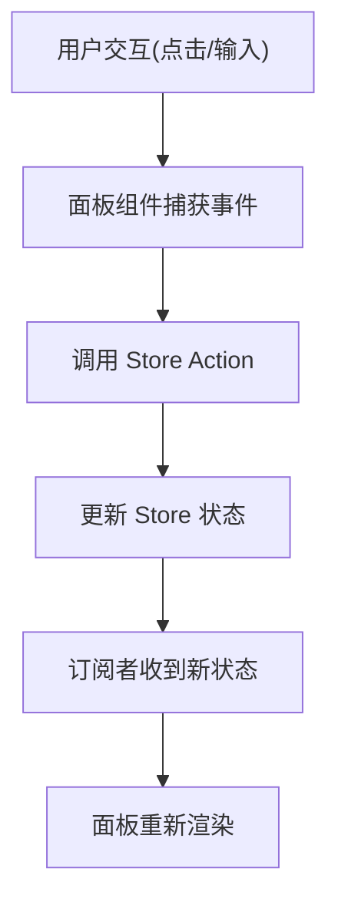
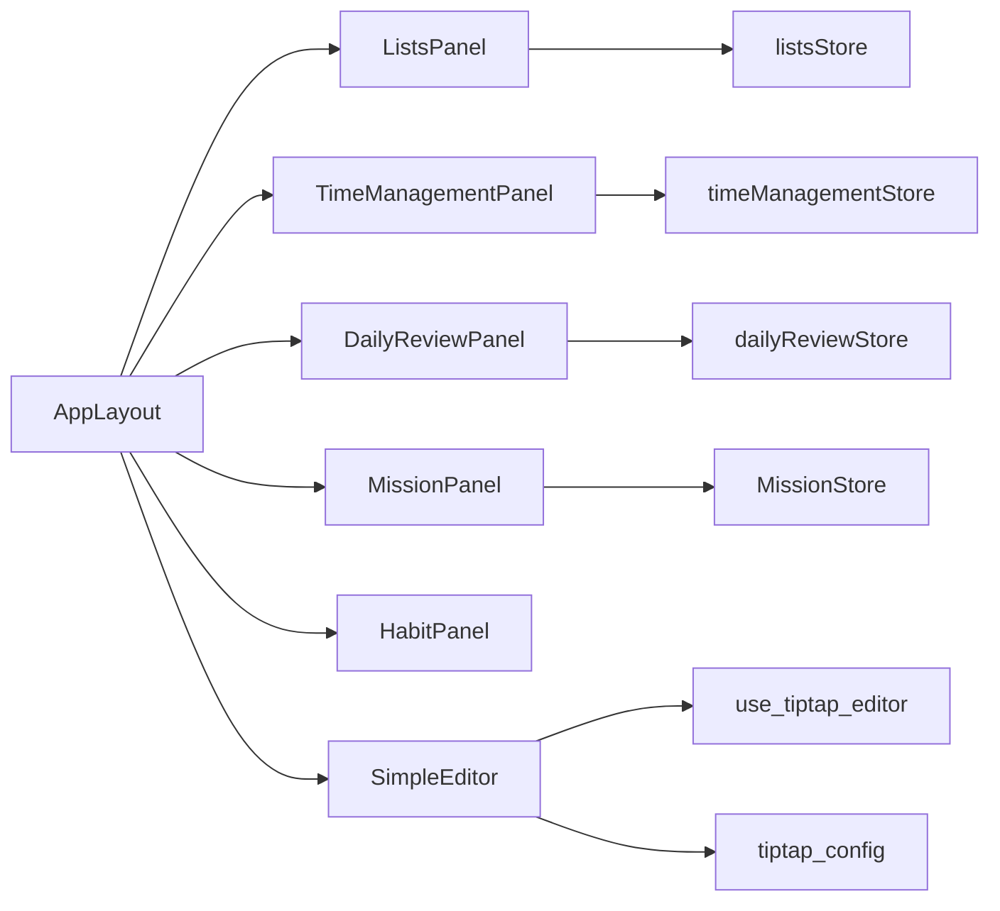

# React 组件架构

<cite>
**本文引用的文件**   
- [AppLayout.tsx](file://src/components/layout/AppLayout.tsx)
- [AppLayout.css](file://src/components/layout/AppLayout.css)
- [types.ts](file://src/components/layout/types.ts)
- [main.tsx](file://src/main.tsx)
- [index.css](file://src/index.css)
- [layout.css](file://src/styles/layout.css)
- [shared.css](file://src/styles/shared.css)
- [tiptap.css](file://src/features/tiptap/tiptap.css)
- [SimpleEditor.tsx](file://src/features/tiptap/SimpleEditor.tsx)
- [config.ts](file://src/features/tiptap/config.ts)
- [Button.tsx](file://src/components/tiptap-ui-primitive/button.tsx)
- [Card.tsx](file://src/components/tiptap-ui-primitive/card.tsx)
- [Input.tsx](file://src/components/tiptap-ui-primitive/input.tsx)
- [Popover.tsx](file://src/components/tiptap-ui-primitive/popover.tsx)
- [Badge.tsx](file://src/components/tiptap-ui-primitive/badge.tsx)
- [Toolbar.tsx](file://src/components/tiptap-ui-primitive/toolbar.tsx)
- [Tooltip.tsx](file://src/components/tiptap-ui-primitive/tooltip.tsx)
- [Separator.tsx](file://src/components/tiptap-ui-primitive/separator.tsx)
- [DropdownMenu.tsx](file://src/components/tiptap-ui-primitive/dropdown-menu.tsx)
- [ButtonGroup.tsx](file://src/components/tiptap-ui-primitive/button-group.tsx)
- [Spacer.tsx](file://src/components/tiptap-ui-primitive/spacer.tsx)
- [use-tiptap-editor.ts](file://src/hooks/use-tiptap-editor.ts)
- [use-window-size.ts](file://src/hooks/use-window-size.ts)
- [use-is-breakpoint.ts](file://src/hooks/use-is-breakpoint.ts)
- [use-scrolling.ts](file://src/hooks/use-scrolling.ts)
- [use-throttled-callback.ts](file://src/hooks/use-throttled-callback.ts)
- [listsStore.ts](file://src/features/lists/listsStore.ts)
- [timeManagementStore.ts](file://src/features/time-management/timeManagementStore.ts)
- [dailyReviewStore.ts](file://src/features/daily-review/dailyReviewStore.ts)
- [MissionStore.ts](file://src/features/mission/MissionStore.ts)
- [HabitPanel.tsx](file://src/features/habits/HabitPanel.tsx)
- [TimeManagementPanel.tsx](file://src/features/time-management/TimeManagementPanel.tsx)
- [DailyReviewPanel.tsx](file://src/features/daily-review/DailyReviewPanel.tsx)
- [MissionPanel.tsx](file://src/features/mission/MissionPanel.tsx)
</cite>

## 目录
1. [简介](#简介)
2. [项目结构](#项目结构)
3. [核心组件](#核心组件)
4. [架构总览](#架构总览)
5. [详细组件分析](#详细组件分析)
6. [依赖关系分析](#依赖关系分析)
7. [性能考虑](#性能考虑)
8. [故障排查指南](#故障排查指南)
9. [结论](#结论)
10. [附录](#附录)

## 简介
本文件面向 FishWorker 前端工程，聚焦基于 React 19 的组件架构与最佳实践。文档围绕以下目标展开：
- 解释组件层次结构与父子通信、事件处理机制
- 深入解析 AppLayout 主布局组件的设计思路与实现方式
- 梳理功能特性组件的组织结构与命名规范
- 说明基础 UI 组件、业务组件、页面组件的分层复用策略
- 提供开发最佳实践、代码组织建议、性能优化技巧与调试方法

## 项目结构
FishWorker 的前端采用“按领域（feature）+ 共享能力（components/hooks/lib）”的混合组织方式：
- src/components：跨功能复用的 UI 与布局组件
  - layout：全局布局（如 AppLayout）
  - tiptap-*：编辑器相关扩展、节点、模板与 UI 控件
  - tiptap-ui-primitive：基础 UI 原子组件（按钮、卡片、输入、弹出等）
- src/features：按业务域划分的特性模块（列表、时间管理、每日复盘、使命、习惯、设置、Tiptap 集成等）
- src/hooks：可复用 Hook（窗口尺寸、断点、滚动、节流、编辑器封装等）
- src/styles：全局样式与主题变量
- src/lib：通用工具与同步引擎等

```mermaid
graph TB
subgraph "应用入口"
main["main.tsx"]
root_css["index.css"]
end
subgraph "布局层"
app_layout["AppLayout.tsx"]
layout_css["layout.css"]
shared_css["shared.css"]
end
subgraph "基础 UI 组件"
btn["button.tsx"]
card["card.tsx"]
input["input.tsx"]
popover["popover.tsx"]
badge["badge.tsx"]
toolbar["toolbar.tsx"]
tooltip["tooltip.tsx"]
separator["separator.tsx"]
dropdown["dropdown-menu.tsx"]
buttongroup["button-group.tsx"]
spacer["spacer.tsx"]
end
subgraph "特性模块"
lists_panel["ListsPanel.tsx"]
time_panel["TimeManagementPanel.tsx"]
daily_panel["DailyReviewPanel.tsx"]
mission_panel["MissionPanel.tsx"]
habits_panel["HabitPanel.tsx"]
tiptap_editor["SimpleEditor.tsx"]
end
subgraph "状态与数据"
lists_store["listsStore.ts"]
time_store["timeManagementStore.ts"]
daily_store["dailyReviewStore.ts"]
mission_store["MissionStore.ts"]
end
subgraph "编辑器生态"
tiptap_config["config.ts"]
tiptap_hook["use-tiptap-editor.ts"]
tiptap_css["tiptap.css"]
end
main --> app_layout
app_layout --> lists_panel
app_layout --> time_panel
app_layout --> daily_panel
app_layout --> mission_panel
app_layout --> habits_panel
app_layout --> tiptap_editor
tiptap_editor --> tiptap_config
tiptap_editor --> tiptap_hook
tiptap_editor --> tiptap_css
lists_panel --> lists_store
time_panel --> time_store
daily_panel --> daily_store
mission_panel --> mission_store
app_layout --> btn
app_layout --> card
app_layout --> input
app_layout --> popover
app_layout --> badge
app_layout --> toolbar
app_layout --> tooltip
app_layout --> separator
app_layout --> dropdown
app_layout --> buttongroup
app_layout --> spacer
app_layout --> layout_css
app_layout --> shared_css
main --> root_css
```

图表来源
- [main.tsx:1-200](file://src/main.tsx#L1-L200)
- [AppLayout.tsx:1-200](file://src/components/layout/AppLayout.tsx#L1-L200)
- [layout.css:1-200](file://src/styles/layout.css#L1-L200)
- [shared.css:1-200](file://src/styles/shared.css#L1-L200)
- [tiptap.css:1-200](file://src/features/tiptap/tiptap.css#L1-L200)
- [SimpleEditor.tsx:1-200](file://src/features/tiptap/SimpleEditor.tsx#L1-L200)
- [config.ts:1-200](file://src/features/tiptap/config.ts#L1-L200)
- [use-tiptap-editor.ts:1-200](file://src/hooks/use-tiptap-editor.ts#L1-L200)
- [listsStore.ts:1-200](file://src/features/lists/listsStore.ts#L1-L200)
- [timeManagementStore.ts:1-200](file://src/features/time-management/timeManagementStore.ts#L1-L200)
- [dailyReviewStore.ts:1-200](file://src/features/daily-review/dailyReviewStore.ts#L1-L200)
- [MissionStore.ts:1-200](file://src/features/mission/MissionStore.ts#L1-L200)

章节来源
- [main.tsx:1-200](file://src/main.tsx#L1-L200)
- [index.css:1-200](file://src/index.css#L1-L200)
- [layout.css:1-200](file://src/styles/layout.css#L1-L200)
- [shared.css:1-200](file://src/styles/shared.css#L1-L200)

## 核心组件
本节聚焦应用级布局与基础 UI 组件，阐述其职责边界与协作方式。

- AppLayout 主布局
  - 职责：承载全局导航、侧边栏、内容区、主题切换、响应式适配；为各特性面板提供统一容器与上下文。
  - 设计要点：
    - 使用受控或半受控的状态管理侧边栏折叠、主题模式、当前激活面板
    - 通过 props 将路由/面板选择传递给子面板
    - 通过 context 或 store 注入用户偏好、主题、语言等全局配置
    - 结合 hooks 监听窗口尺寸与断点，驱动布局自适应
  - 关键文件路径参考：[AppLayout.tsx](file://src/components/layout/AppLayout.tsx)、[types.ts](file://src/components/layout/types.ts)、[AppLayout.css](file://src/components/layout/AppLayout.css)

- 基础 UI 组件（tiptap-ui-primitive）
  - 职责：提供无业务语义的原子化 UI 元素，保证一致性与可复用性
  - 典型组件：按钮、卡片、输入、弹出框、徽章、工具栏、提示、分隔符、下拉菜单、按钮组、间距
  - 设计要点：
    - 以 props 驱动外观与行为，避免内部耦合业务逻辑
    - 支持组合与插槽（children）扩展
    - 样式模块化，遵循 CSS 变量与主题体系
  - 关键文件路径参考：
    - [Button.tsx](file://src/components/tiptap-ui-primitive/button.tsx)
    - [Card.tsx](file://src/components/tiptap-ui-primitive/card.tsx)
    - [Input.tsx](file://src/components/tiptap-ui-primitive/input.tsx)
    - [Popover.tsx](file://src/components/tiptap-ui-primitive/popover.tsx)
    - [Badge.tsx](file://src/components/tiptap-ui-primitive/badge.tsx)
    - [Toolbar.tsx](file://src/components/tiptap-ui-primitive/toolbar.tsx)
    - [Tooltip.tsx](file://src/components/tiptap-ui-primitive/tooltip.tsx)
    - [Separator.tsx](file://src/components/tiptap-ui-primitive/separator.tsx)
    - [DropdownMenu.tsx](file://src/components/tiptap-ui-primitive/dropdown-menu.tsx)
    - [ButtonGroup.tsx](file://src/components/tiptap-ui-primitive/button-group.tsx)
    - [Spacer.tsx](file://src/components/tiptap-ui-primitive/spacer.tsx)

章节来源
- [AppLayout.tsx:1-200](file://src/components/layout/AppLayout.tsx#L1-L200)
- [types.ts:1-200](file://src/components/layout/types.ts#L1-L200)
- [AppLayout.css:1-200](file://src/components/layout/AppLayout.css#L1-L200)
- [Button.tsx:1-200](file://src/components/tiptap-ui-primitive/button.tsx#L1-L200)
- [Card.tsx:1-200](file://src/components/tiptap-ui-primitive/card.tsx#L1-L200)
- [Input.tsx:1-200](file://src/components/tiptap-ui-primitive/input.tsx#L1-L200)
- [Popover.tsx:1-200](file://src/components/tiptap-ui-primitive/popover.tsx#L1-L200)
- [Badge.tsx:1-200](file://src/components/tiptap-ui-primitive/badge.tsx#L1-L200)
- [Toolbar.tsx:1-200](file://src/components/tiptap-ui-primitive/toolbar.tsx#L1-L200)
- [Tooltip.tsx:1-200](file://src/components/tiptap-ui-primitive/tooltip.tsx#L1-L200)
- [Separator.tsx:1-200](file://src/components/tiptap-ui-primitive/separator.tsx#L1-L200)
- [DropdownMenu.tsx:1-200](file://src/components/tiptap-ui-primitive/dropdown-menu.tsx#L1-L200)
- [ButtonGroup.tsx:1-200](file://src/components/tiptap-ui-primitive/button-group.tsx#L1-L200)
- [Spacer.tsx:1-200](file://src/components/tiptap-ui-primitive/spacer.tsx#L1-L200)

## 架构总览
整体架构遵循“布局层 → 特性面板层 → 基础 UI 层”的自顶向下分层，配合 Store 进行状态管理，Hook 提供横切能力。

图表来源
- [AppLayout.tsx:1-200](file://src/components/layout/AppLayout.tsx#L1-L200)
- [ListsPanel.tsx:1-200](file://src/features/lists/ListsPanel.tsx#L1-L200)
- [TimeManagementPanel.tsx:1-200](file://src/features/time-management/TimeManagementPanel.tsx#L1-L200)
- [DailyReviewPanel.tsx:1-200](file://src/features/daily-review/DailyReviewPanel.tsx#L1-L200)
- [MissionPanel.tsx:1-200](file://src/features/mission/MissionPanel.tsx#L1-L200)
- [HabitPanel.tsx:1-200](file://src/features/habits/HabitPanel.tsx#L1-L200)
- [SimpleEditor.tsx:1-200](file://src/features/tiptap/SimpleEditor.tsx#L1-L200)
- [use-tiptap-editor.ts:1-200](file://src/hooks/use-tiptap-editor.ts#L1-L200)
- [config.ts:1-200](file://src/features/tiptap/config.ts#L1-L200)
- [listsStore.ts:1-200](file://src/features/lists/listsStore.ts#L1-L200)
- [timeManagementStore.ts:1-200](file://src/features/time-management/timeManagementStore.ts#L1-L200)
- [dailyReviewStore.ts:1-200](file://src/features/daily-review/dailyReviewStore.ts#L1-L200)
- [MissionStore.ts:1-200](file://src/features/mission/MissionStore.ts#L1-L200)

## 详细组件分析

### AppLayout 主布局组件
- 设计目标
  - 提供稳定的应用外壳：顶部导航、左侧导航、主内容区、底部信息
  - 支撑多面板切换与响应式布局
  - 统一管理主题、国际化、快捷键等横切关注点
- 关键实现要点
  - 通过 props 接收路由/面板标识，控制当前激活项
  - 使用本地状态或外部 store 维护侧边栏折叠、面板切换
  - 借助断点 Hook 动态调整布局（移动端/桌面端）
  - 通过 context 暴露全局配置（主题、语言、用户信息）
  - 在内容区按需懒加载特性面板，减少首屏体积
- 父子通信与事件处理
  - 父→子：通过 props 传递面板参数、主题、布局开关
  - 子→父：回调函数（onClick/onToggle/onSave）或事件总线
  - 跨层级：context/store 作为单一事实源
- 样式与可访问性
  - 使用 CSS 变量与主题类名，确保明暗主题一致性
  - 为交互元素提供 aria-* 属性与键盘导航支持

图表来源
- [main.tsx:1-200](file://src/main.tsx#L1-L200)
- [AppLayout.tsx:1-200](file://src/components/layout/AppLayout.tsx#L1-L200)
- [ListsPanel.tsx:1-200](file://src/features/lists/ListsPanel.tsx#L1-L200)
- [listsStore.ts:1-200](file://src/features/lists/listsStore.ts#L1-L200)

章节来源
- [AppLayout.tsx:1-200](file://src/components/layout/AppLayout.tsx#L1-L200)
- [types.ts:1-200](file://src/components/layout/types.ts#L1-L200)
- [AppLayout.css:1-200](file://src/components/layout/AppLayout.css#L1-L200)

### 基础 UI 组件（tiptap-ui-primitive）
- 设计原则
  - 纯展示与交互，不持有业务状态
  - 通过 props 暴露所有可变行为（颜色、尺寸、禁用态、对齐等）
  - 支持 children 插槽与组合模式
- 组件清单与职责
  - Button：按钮变体、图标、大小、禁用态
  - Card：卡片容器、阴影、圆角、内边距
  - Input：文本输入、占位符、校验反馈、前缀/后缀
  - Popover：弹出框定位、触发器、遮罩
  - Badge：标签、计数、状态色
  - Toolbar：工具栏容器、分组、分隔
  - Tooltip：悬浮提示、位置、延迟
  - Separator：水平/垂直分隔线
  - DropdownMenu：下拉菜单、选项、选中态
  - ButtonGroup：按钮组、单选/多选联动
  - Spacer：间距控制
- 样式与主题
  - 使用 CSS 变量与主题类名，便于明暗切换
  - 组件样式文件与组件同名，保持高内聚

图表来源
- [Button.tsx:1-200](file://src/components/tiptap-ui-primitive/button.tsx#L1-L200)
- [Card.tsx:1-200](file://src/components/tiptap-ui-primitive/card.tsx#L1-L200)
- [Input.tsx:1-200](file://src/components/tiptap-ui-primitive/input.tsx#L1-L200)
- [Popover.tsx:1-200](file://src/components/tiptap-ui-primitive/popover.tsx#L1-L200)
- [Badge.tsx:1-200](file://src/components/tiptap-ui-primitive/badge.tsx#L1-L200)
- [Toolbar.tsx:1-200](file://src/components/tiptap-ui-primitive/toolbar.tsx#L1-L200)
- [Tooltip.tsx:1-200](file://src/components/tiptap-ui-primitive/tooltip.tsx#L1-L200)
- [Separator.tsx:1-200](file://src/components/tiptap-ui-primitive/separator.tsx#L1-L200)
- [DropdownMenu.tsx:1-200](file://src/components/tiptap-ui-primitive/dropdown-menu.tsx#L1-L200)
- [ButtonGroup.tsx:1-200](file://src/components/tiptap-ui-primitive/button-group.tsx#L1-L200)
- [Spacer.tsx:1-200](file://src/components/tiptap-ui-primitive/spacer.tsx#L1-L200)

章节来源
- [Button.tsx:1-200](file://src/components/tiptap-ui-primitive/button.tsx#L1-L200)
- [Card.tsx:1-200](file://src/components/tiptap-ui-primitive/card.tsx#L1-L200)
- [Input.tsx:1-200](file://src/components/tiptap-ui-primitive/input.tsx#L1-L200)
- [Popover.tsx:1-200](file://src/components/tiptap-ui-primitive/popover.tsx#L1-L200)
- [Badge.tsx:1-200](file://src/components/tiptap-ui-primitive/badge.tsx#L1-L200)
- [Toolbar.tsx:1-200](file://src/components/tiptap-ui-primitive/toolbar.tsx#L1-L200)
- [Tooltip.tsx:1-200](file://src/components/tiptap-ui-primitive/tooltip.tsx#L1-L200)
- [Separator.tsx:1-200](file://src/components/tiptap-ui-primitive/separator.tsx#L1-L200)
- [DropdownMenu.tsx:1-200](file://src/components/tiptap-ui-primitive/dropdown-menu.tsx#L1-L200)
- [ButtonGroup.tsx:1-200](file://src/components/tiptap-ui-primitive/button-group.tsx#L1-L200)
- [Spacer.tsx:1-200](file://src/components/tiptap-ui-primitive/spacer.tsx#L1-L200)

### 编辑器生态（Tiptap 集成）
- 角色分工
  - SimpleEditor：编辑器容器，负责初始化、配置、事件桥接
  - config：编辑器插件、命令、扩展的配置集合
  - use-tiptap-editor：封装编辑器实例生命周期与常用操作
  - tiptap.css：编辑器主题与排版样式
- 数据流
  - 上层组件通过 props 传入初始内容与变更回调
  - 编辑器内部通过 Hook 获取实例，调用命令/扩展执行编辑动作
  - 变更事件向上抛出，由父组件持久化或同步到后端

图表来源
- [SimpleEditor.tsx:1-200](file://src/features/tiptap/SimpleEditor.tsx#L1-L200)
- [config.ts:1-200](file://src/features/tiptap/config.ts#L1-L200)
- [use-tiptap-editor.ts:1-200](file://src/hooks/use-tiptap-editor.ts#L1-L200)
- [tiptap.css:1-200](file://src/features/tiptap/tiptap.css#L1-L200)

章节来源
- [SimpleEditor.tsx:1-200](file://src/features/tiptap/SimpleEditor.tsx#L1-L200)
- [config.ts:1-200](file://src/features/tiptap/config.ts#L1-L200)
- [use-tiptap-editor.ts:1-200](file://src/hooks/use-tiptap-editor.ts#L1-L200)
- [tiptap.css:1-200](file://src/features/tiptap/tiptap.css#L1-L200)

### 特性面板与状态管理
- 面板职责
  - ListsPanel：列表管理（增删改查、排序、分组）
  - TimeManagementPanel：时间管理（四象限、周计划、任务详情）
  - DailyReviewPanel：每日复盘（统计、自动保存、编辑器）
  - MissionPanel：使命与目标（角色、目标、看板）
  - HabitPanel：习惯追踪（打卡、统计、侧边详情）
- 状态管理
  - 每个特性拥有独立 Store（listsStore、timeManagementStore、dailyReviewStore、MissionStore）
  - 面板订阅 Store 的变化，触发局部重渲染
  - 通过 actions 派发更新，避免直接修改状态

图表来源
- [ListsPanel.tsx:1-200](file://src/features/lists/ListsPanel.tsx#L1-L200)
- [listsStore.ts:1-200](file://src/features/lists/listsStore.ts#L1-L200)
- [TimeManagementPanel.tsx:1-200](file://src/features/time-management/TimeManagementPanel.tsx#L1-L200)
- [timeManagementStore.ts:1-200](file://src/features/time-management/timeManagementStore.ts#L1-L200)
- [DailyReviewPanel.tsx:1-200](file://src/features/daily-review/DailyReviewPanel.tsx#L1-L200)
- [dailyReviewStore.ts:1-200](file://src/features/daily-review/dailyReviewStore.ts#L1-L200)
- [MissionPanel.tsx:1-200](file://src/features/mission/MissionPanel.tsx#L1-L200)
- [MissionStore.ts:1-200](file://src/features/mission/MissionStore.ts#L1-L200)
- [HabitPanel.tsx:1-200](file://src/features/habits/HabitPanel.tsx#L1-L200)

章节来源
- [ListsPanel.tsx:1-200](file://src/features/lists/ListsPanel.tsx#L1-L200)
- [listsStore.ts:1-200](file://src/features/lists/listsStore.ts#L1-L200)
- [TimeManagementPanel.tsx:1-200](file://src/features/time-management/TimeManagementPanel.tsx#L1-L200)
- [timeManagementStore.ts:1-200](file://src/features/time-management/timeManagementStore.ts#L1-L200)
- [DailyReviewPanel.tsx:1-200](file://src/features/daily-review/DailyReviewPanel.tsx#L1-L200)
- [dailyReviewStore.ts:1-200](file://src/features/daily-review/dailyReviewStore.ts#L1-L200)
- [MissionPanel.tsx:1-200](file://src/features/mission/MissionPanel.tsx#L1-L200)
- [MissionStore.ts:1-200](file://src/features/mission/MissionStore.ts#L1-L200)
- [HabitPanel.tsx:1-200](file://src/features/habits/HabitPanel.tsx#L1-L200)

## 依赖关系分析
- 组件耦合
  - AppLayout 对特性面板存在弱耦合（仅通过 props 与路由/面板标识），利于替换与扩展
  - 基础 UI 组件无业务依赖，具备高内聚与低耦合
- 外部依赖
  - Tiptap 编辑器生态（扩展、命令、主题）
  - 状态管理库（各特性 Store）
  - 样式系统（CSS 变量、主题类名）
- 潜在循环依赖
  - 特性模块之间应保持单向依赖（通过 AppLayout 编排），避免互相引用导致循环

图表来源
- [AppLayout.tsx:1-200](file://src/components/layout/AppLayout.tsx#L1-L200)
- [ListsPanel.tsx:1-200](file://src/features/lists/ListsPanel.tsx#L1-L200)
- [TimeManagementPanel.tsx:1-200](file://src/features/time-management/TimeManagementPanel.tsx#L1-L200)
- [DailyReviewPanel.tsx:1-200](file://src/features/daily-review/DailyReviewPanel.tsx#L1-L200)
- [MissionPanel.tsx:1-200](file://src/features/mission/MissionPanel.tsx#L1-L200)
- [HabitPanel.tsx:1-200](file://src/features/habits/HabitPanel.tsx#L1-L200)
- [SimpleEditor.tsx:1-200](file://src/features/tiptap/SimpleEditor.tsx#L1-L200)
- [use-tiptap-editor.ts:1-200](file://src/hooks/use-tiptap-editor.ts#L1-L200)
- [config.ts:1-200](file://src/features/tiptap/config.ts#L1-L200)
- [listsStore.ts:1-200](file://src/features/lists/listsStore.ts#L1-L200)
- [timeManagementStore.ts:1-200](file://src/features/time-management/timeManagementStore.ts#L1-L200)
- [dailyReviewStore.ts:1-200](file://src/features/daily-review/dailyReviewStore.ts#L1-L200)
- [MissionStore.ts:1-200](file://src/features/mission/MissionStore.ts#L1-L200)

## 性能考虑
- 渲染优化
  - 使用 React.memo 包裹基础 UI 组件，减少不必要的重渲染
  - 对大型列表使用虚拟滚动或分页加载
  - 合理拆分特性面板，按需懒加载
- 状态更新
  - 将频繁更新的局部状态下沉至组件内部，避免全局风暴
  - 使用不可变更新与选择性订阅，降低影响范围
- 计算与 I/O
  - 使用 useMemo/useCallback 缓存昂贵计算与稳定回调
  - 对高频事件使用节流/防抖（如滚动、输入）
- 样式与主题
  - 利用 CSS 变量与类名切换，避免 JS 大量样式计算
  - 合并重复样式，减少 CSS 体积
- 编辑器性能
  - 增量更新内容，避免整块替换
  - 按需启用扩展与命令，减少初始化开销

[本节为通用指导，无需特定文件来源]

## 故障排查指南
- 常见问题定位
  - 布局错乱：检查 AppLayout 的响应式断点与 CSS 变量是否正确应用
  - 主题不一致：确认主题类名与 CSS 变量覆盖顺序
  - 面板不更新：核对 Store 订阅与 action 派发链路
  - 编辑器异常：检查配置项与扩展冲突，查看控制台错误栈
- 调试建议
  - 使用浏览器开发者工具的组件树与性能面板
  - 在关键 Hook 与 Store 中增加日志输出
  - 对复杂交互录制时序，定位异步问题
- 参考文件
  - 布局与样式：[AppLayout.tsx](file://src/components/layout/AppLayout.tsx)、[layout.css](file://src/styles/layout.css)、[shared.css](file://src/styles/shared.css)
  - 编辑器：[SimpleEditor.tsx](file://src/features/tiptap/SimpleEditor.tsx)、[config.ts](file://src/features/tiptap/config.ts)、[use-tiptap-editor.ts](file://src/hooks/use-tiptap-editor.ts)
  - 状态管理：[listsStore.ts](file://src/features/lists/listsStore.ts)、[timeManagementStore.ts](file://src/features/time-management/timeManagementStore.ts)、[dailyReviewStore.ts](file://src/features/daily-review/dailyReviewStore.ts)、[MissionStore.ts](file://src/features/mission/MissionStore.ts)

章节来源
- [AppLayout.tsx:1-200](file://src/components/layout/AppLayout.tsx#L1-L200)
- [layout.css:1-200](file://src/styles/layout.css#L1-L200)
- [shared.css:1-200](file://src/styles/shared.css#L1-L200)
- [SimpleEditor.tsx:1-200](file://src/features/tiptap/SimpleEditor.tsx#L1-L200)
- [config.ts:1-200](file://src/features/tiptap/config.ts#L1-L200)
- [use-tiptap-editor.ts:1-200](file://src/hooks/use-tiptap-editor.ts#L1-L200)
- [listsStore.ts:1-200](file://src/features/lists/listsStore.ts#L1-L200)
- [timeManagementStore.ts:1-200](file://src/features/time-management/timeManagementStore.ts#L1-L200)
- [dailyReviewStore.ts:1-200](file://src/features/daily-review/dailyReviewStore.ts#L1-L200)
- [MissionStore.ts:1-200](file://src/features/mission/MissionStore.ts#L1-L200)

## 结论
FishWorker 的 React 组件架构以 AppLayout 为核心，结合特性面板与基础 UI 组件形成清晰的分层结构。通过 Store 管理状态、Hook 提供横切能力，实现了良好的可扩展性与可维护性。遵循本文的最佳实践与性能优化建议，可进一步提升用户体验与开发效率。

[本节为总结性内容，无需特定文件来源]

## 附录
- 命名规范建议
  - 组件：PascalCase，语义化命名（如 ListsPanel、TimeManagementPanel）
  - 基础 UI：动词/名词组合（Button、Card、Input）
  - Hooks：useXxx（如 useWindowSize、useIsBreakpoint）
  - Store：FeatureStore（如 listsStore、timeManagementStore）
- 代码组织建议
  - 特性模块内聚：组件、类型、服务、测试同目录
  - 基础 UI 与业务解耦：禁止在原子组件中引入业务逻辑
  - 样式模块化：组件级样式文件与组件同名，避免全局污染
- 常用 Hook 参考
  - [use-window-size.ts](file://src/hooks/use-window-size.ts)
  - [use-is-breakpoint.ts](file://src/hooks/use-is-breakpoint.ts)
  - [use-scrolling.ts](file://src/hooks/use-scrolling.ts)
  - [use-throttled-callback.ts](file://src/hooks/use-throttled-callback.ts)

章节来源
- [use-window-size.ts:1-200](file://src/hooks/use-window-size.ts#L1-L200)
- [use-is-breakpoint.ts:1-200](file://src/hooks/use-is-breakpoint.ts#L1-L200)
- [use-scrolling.ts:1-200](file://src/hooks/use-scrolling.ts#L1-L200)
- [use-throttled-callback.ts:1-200](file://src/hooks/use-throttled-callback.ts#L1-L200)