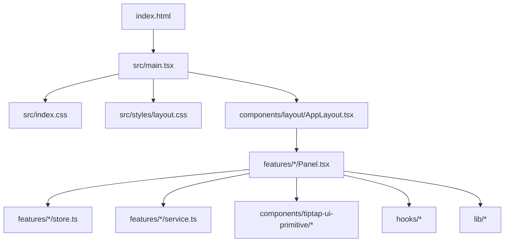
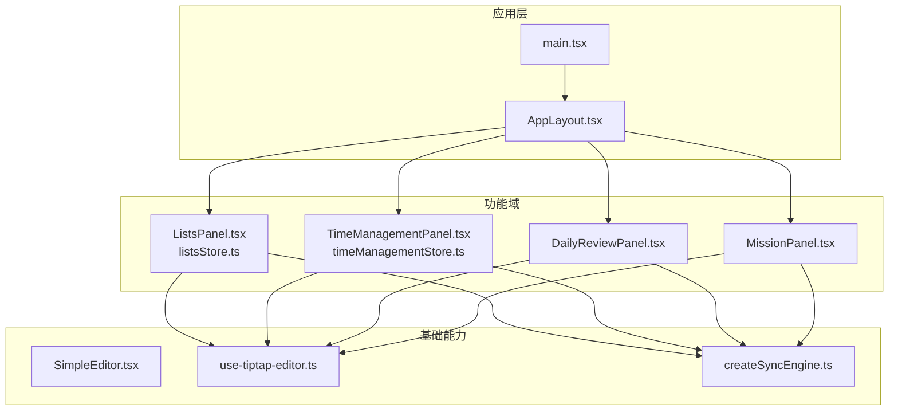
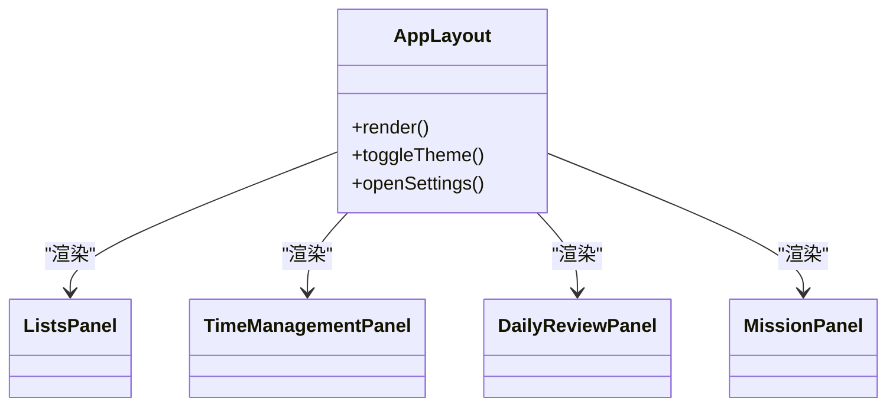
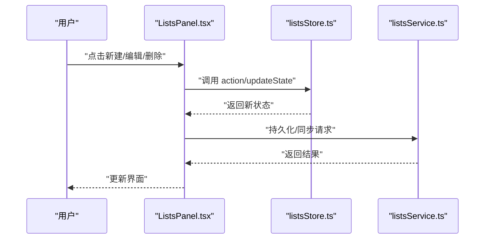
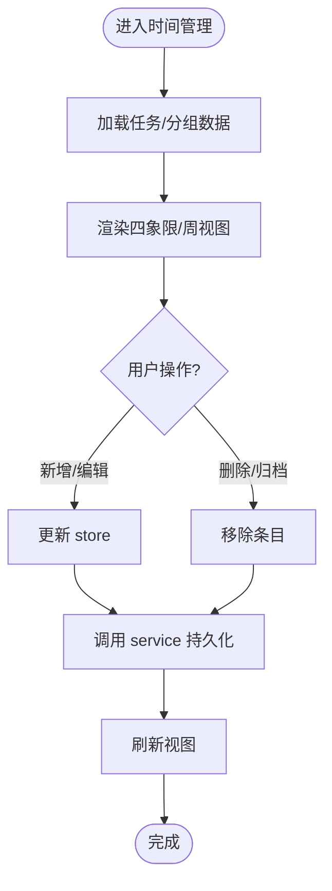
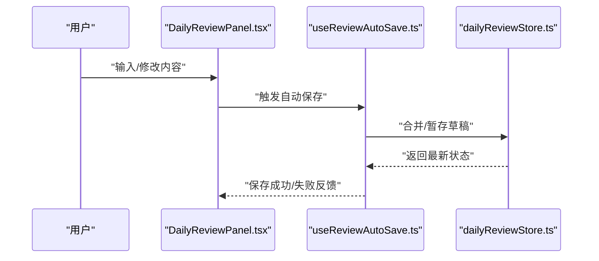
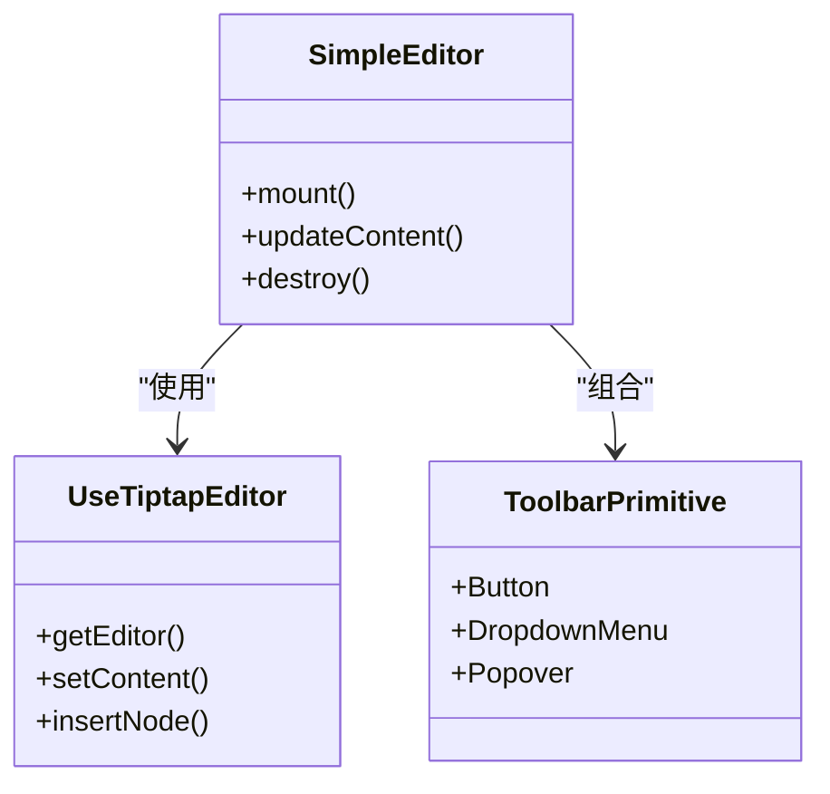
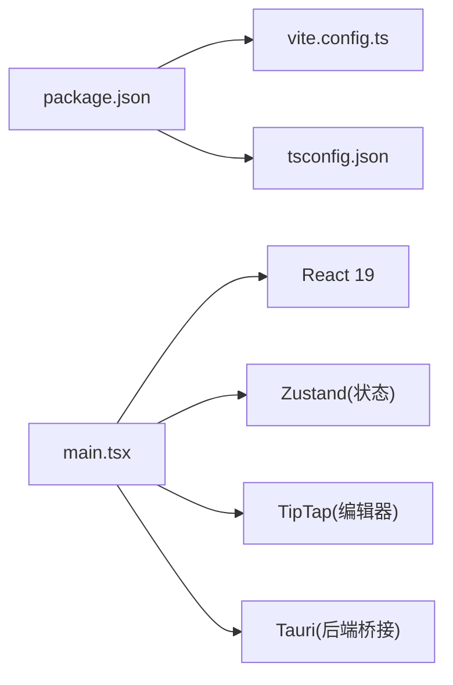

# 前端架构

<cite>
**本文引用的文件**   
- [package.json](file://package.json)
- [vite.config.ts](file://vite.config.ts)
- [tsconfig.json](file://tsconfig.json)
- [index.html](file://index.html)
- [src/main.tsx](file://src/main.tsx)
- [src/index.css](file://src/index.css)
- [src/styles/_variables.scss](file://src/styles/_variables.scss)
- [src/styles/layout.css](file://src/styles/layout.css)
- [src/components/layout/AppLayout.tsx](file://src/components/layout/AppLayout.tsx)
- [src/features/lists/ListsPanel.tsx](file://src/features/lists/ListsPanel.tsx)
- [src/features/lists/listsStore.ts](file://src/features/lists/listsStore.ts)
- [src/features/time-management/TimeManagementPanel.tsx](file://src/features/time-management/TimeManagementPanel.tsx)
- [src/features/time-management/timeManagementStore.ts](file://src/features/time-management/timeManagementStore.ts)
- [src/features/daily-review/DailyReviewPanel.tsx](file://src/features/daily-review/DailyReviewPanel.tsx)
- [src/features/settings/SettingsModal.tsx](file://src/features/settings/SettingsModal.tsx)
- [src/features/tiptap/SimpleEditor.tsx](file://src/features/tiptap/SimpleEditor.tsx)
- [src/hooks/use-tiptap-editor.ts](file://src/hooks/use-tiptap-editor.ts)
- [src/lib/createSyncEngine.ts](file://src/lib/createSyncEngine.ts)
</cite>

## 更新摘要
**所做更改**   
- 移除了习惯追踪模块的所有引用和相关章节
- 更新了功能列表以反映当前实现（清单、时间管理、每日复盘、人生罗盘）
- 修正了架构图和组件关系图
- 更新了依赖关系分析以匹配实际代码结构

## 目录
1. [简介](#简介)
2. [项目结构](#项目结构)
3. [核心组件](#核心组件)
4. [架构总览](#架构总览)
5. [详细组件分析](#详细组件分析)
6. [依赖关系分析](#依赖关系分析)
7. [性能考虑](#性能考虑)
8. [故障排查指南](#故障排查指南)
9. [结论](#结论)
10. [附录](#附录)

## 简介
本文件为 FishWorker 前端部分的架构文档，聚焦于基于 React 19 + TypeScript 的前端设计。内容涵盖：
- 组件层次结构与模块组织方式（按功能特性划分）
- 状态管理策略与数据流
- 路由与导航机制（当前实现说明与演进建议）
- 样式系统与主题切换机制
- 构建配置与开发工具链
- 性能优化、代码分割与懒加载
- 组件复用模式与最佳实践

## 项目结构
前端采用"功能特性优先"的模块化组织方式，根入口负责应用初始化与全局样式注入，业务功能以 features 为边界进行拆分，通用 UI 与编辑器能力集中在 components 与 hooks/lib 中。

图表来源
- [index.html:1-20](file://index.html#L1-L20)
- [src/main.tsx:1-40](file://src/main.tsx#L1-L40)
- [src/index.css:1-20](file://src/index.css#L1-L20)
- [src/styles/layout.css:1-20](file://src/styles/layout.css#L1-L20)
- [src/components/layout/AppLayout.tsx:1-40](file://src/components/layout/AppLayout.tsx#L1-L40)
- [src/features/lists/ListsPanel.tsx:1-40](file://src/features/lists/ListsPanel.tsx#L1-L40)
- [src/features/time-management/TimeManagementPanel.tsx:1-40](file://src/features/time-management/TimeManagementPanel.tsx#L1-L40)
- [src/features/daily-review/DailyReviewPanel.tsx:1-40](file://src/features/daily-review/DailyReviewPanel.tsx#L1-L40)
- [src/features/lists/listsStore.ts:1-40](file://src/features/lists/listsStore.ts#L1-L40)
- [src/features/time-management/timeManagementStore.ts:1-40](file://src/features/time-management/timeManagementStore.ts#L1-L40)
- [src/hooks/use-tiptap-editor.ts:1-40](file://src/hooks/use-tiptap-editor.ts#L1-L40)
- [src/lib/createSyncEngine.ts:1-40](file://src/lib/createSyncEngine.ts#L1-L40)

章节来源
- [package.json:1-40](file://package.json#L1-L40)
- [vite.config.ts:1-60](file://vite.config.ts#L1-L60)
- [tsconfig.json:1-40](file://tsconfig.json#L1-L40)
- [index.html:1-20](file://index.html#L1-L20)
- [src/main.tsx:1-40](file://src/main.tsx#L1-L40)

## 核心组件
- 布局容器
  - AppLayout 作为应用级布局容器，承载侧边栏、主区域与全局交互上下文。
- 功能面板
  - ListsPanel、TimeManagementPanel、DailyReviewPanel、MissionPanel 等分别对应清单、时间管理、每日复盘、人生罗盘等功能域。
- 基础 UI 与编辑器
  - tiptap-ui-primitive 提供按钮、卡片、下拉菜单、弹出层等原子组件；tiptap 相关能力通过 SimpleEditor 与 use-tiptap-editor 封装。
- 状态与服务
  - 各 feature 内 store.ts 使用轻量状态库（如 Zustand）维护领域状态；service.ts 负责与后端或 Tauri 命令交互。
- 共享能力
  - hooks 提供跨功能复用的行为（如滚动、断点、光标可见性等）。
  - lib 提供同步引擎 createSyncEngine 等基础设施。

章节来源
- [src/components/layout/AppLayout.tsx:1-80](file://src/components/layout/AppLayout.tsx#L1-L80)
- [src/features/lists/ListsPanel.tsx:1-80](file://src/features/lists/ListsPanel.tsx#L1-L80)
- [src/features/time-management/TimeManagementPanel.tsx:1-80](file://src/features/time-management/TimeManagementPanel.tsx#L1-L80)
- [src/features/daily-review/DailyReviewPanel.tsx:1-80](file://src/features/daily-review/DailyReviewPanel.tsx#L1-L80)
- [src/features/mission/MissionPanel.tsx:1-80](file://src/features/mission/MissionPanel.tsx#L1-L80)
- [src/features/tiptap/SimpleEditor.tsx:1-80](file://src/features/tiptap/SimpleEditor.tsx#L1-L80)
- [src/hooks/use-tiptap-editor.ts:1-80](file://src/hooks/use-tiptap-editor.ts#L1-L80)
- [src/lib/createSyncEngine.ts:1-80](file://src/lib/createSyncEngine.ts#L1-L80)

## 架构总览
整体采用"单入口 + 功能模块 + 原子组件 + 状态服务分离"的分层架构。应用启动后挂载布局与全局样式，随后渲染各功能面板。状态在 feature 内部集中管理，UI 仅消费状态并触发副作用。

图表来源
- [src/main.tsx:1-40](file://src/main.tsx#L1-L40)
- [src/components/layout/AppLayout.tsx:1-80](file://src/components/layout/AppLayout.tsx#L1-L80)
- [src/features/lists/ListsPanel.tsx:1-80](file://src/features/lists/ListsPanel.tsx#L1-L80)
- [src/features/lists/listsStore.ts:1-80](file://src/features/lists/listsStore.ts#L1-L80)
- [src/features/time-management/TimeManagementPanel.tsx:1-80](file://src/features/time-management/TimeManagementPanel.tsx#L1-L80)
- [src/features/time-management/timeManagementStore.ts:1-80](file://src/features/time-management/timeManagementStore.ts#L1-L80)
- [src/features/daily-review/DailyReviewPanel.tsx:1-80](file://src/features/daily-review/DailyReviewPanel.tsx#L1-L80)
- [src/features/mission/MissionPanel.tsx:1-80](file://src/features/mission/MissionPanel.tsx#L1-L80)
- [src/features/tiptap/SimpleEditor.tsx:1-80](file://src/features/tiptap/SimpleEditor.tsx#L1-L80)
- [src/hooks/use-tiptap-editor.ts:1-80](file://src/hooks/use-tiptap-editor.ts#L1-L80)
- [src/lib/createSyncEngine.ts:1-80](file://src/lib/createSyncEngine.ts#L1-L80)

## 详细组件分析

### 布局与页面容器
- AppLayout 负责应用壳结构（侧边栏、主内容区、全局弹窗/抽屉容器），并提供主题、语言、设置等上下文。
- 当前未引入独立路由库，页面切换通过条件渲染或状态驱动的方式在布局内切换功能面板。

图表来源
- [src/components/layout/AppLayout.tsx:1-80](file://src/components/layout/AppLayout.tsx#L1-L80)
- [src/features/lists/ListsPanel.tsx:1-80](file://src/features/lists/ListsPanel.tsx#L1-L80)
- [src/features/time-management/TimeManagementPanel.tsx:1-80](file://src/features/time-management/TimeManagementPanel.tsx#L1-L80)
- [src/features/daily-review/DailyReviewPanel.tsx:1-80](file://src/features/daily-review/DailyReviewPanel.tsx#L1-L80)
- [src/features/mission/MissionPanel.tsx:1-80](file://src/features/mission/MissionPanel.tsx#L1-L80)

章节来源
- [src/components/layout/AppLayout.tsx:1-120](file://src/components/layout/AppLayout.tsx#L1-L120)

### 清单功能（Lists）
- 列表展示与编辑由 ListsPanel 聚合，子组件包括列表项、分组视图、抽屉详情、模态框等。
- 状态集中于 listsStore.ts，操作通过 service.ts 与后端/Tauri 通信。
- 拖拽排序逻辑位于 listsReorder.ts，测试用例位于 listsReorder.test.ts。

图表来源
- [src/features/lists/ListsPanel.tsx:1-120](file://src/features/lists/ListsPanel.tsx#L1-L120)
- [src/features/lists/listsStore.ts:1-120](file://src/features/lists/listsStore.ts#L1-L120)
- [src/features/lists/listsService.ts:1-120](file://src/features/lists/listsService.ts#L1-L120)

章节来源
- [src/features/lists/ListsPanel.tsx:1-200](file://src/features/lists/ListsPanel.tsx#L1-L200)
- [src/features/lists/listsStore.ts:1-200](file://src/features/lists/listsStore.ts#L1-L200)
- [src/features/lists/listsService.ts:1-200](file://src/features/lists/listsService.ts#L1-L200)
- [src/features/lists/listsReorder.ts:1-120](file://src/features/lists/listsReorder.ts#L1-L120)
- [src/features/lists/listsReorder.test.ts:1-120](file://src/features/lists/listsReorder.test.ts#L1-L120)

### 时间管理（Time Management）
- TimeManagementPanel 聚合日四象限、周计划、任务详情弹窗等。
- timeManagementStore.ts 管理任务、分组、视图状态；timeManagementService.ts 负责数据读写。

图表来源
- [src/features/time-management/TimeManagementPanel.tsx:1-120](file://src/features/time-management/TimeManagementPanel.tsx#L1-L120)
- [src/features/time-management/timeManagementStore.ts:1-120](file://src/features/time-management/timeManagementStore.ts#L1-L120)
- [src/features/time-management/timeManagementService.ts:1-120](file://src/features/time-management/timeManagementService.ts#L1-L120)

章节来源
- [src/features/time-management/TimeManagementPanel.tsx:1-200](file://src/features/time-management/TimeManagementPanel.tsx#L1-L200)
- [src/features/time-management/timeManagementStore.ts:1-200](file://src/features/time-management/timeManagementStore.ts#L1-L200)
- [src/features/time-management/timeManagementService.ts:1-200](file://src/features/time-management/timeManagementService.ts#L1-L200)

### 每日复盘（Daily Review）
- DailyReviewPanel 聚合统计、编辑器与自动保存逻辑。
- useReviewAutoSave 钩子负责增量保存与防抖。

图表来源
- [src/features/daily-review/DailyReviewPanel.tsx:1-120](file://src/features/daily-review/DailyReviewPanel.tsx#L1-L120)
- [src/features/daily-review/useReviewAutoSave.ts:1-120](file://src/features/daily-review/useReviewAutoSave.ts#L1-L120)
- [src/features/daily-review/dailyReviewStore.ts:1-120](file://src/features/daily-review/dailyReviewStore.ts#L1-L120)

章节来源
- [src/features/daily-review/DailyReviewPanel.tsx:1-200](file://src/features/daily-review/DailyReviewPanel.tsx#L1-L200)
- [src/features/daily-review/useReviewAutoSave.ts:1-200](file://src/features/daily-review/useReviewAutoSave.ts#L1-L200)
- [src/features/daily-review/dailyReviewStore.ts:1-200](file://src/features/daily-review/dailyReviewStore.ts#L1-L200)

### 人生罗盘（Mission）
- MissionPanel 聚合使命宣言编辑器、角色侧边栏和目标详情面板。
- MissionStore.ts 管理使命宣言、角色和目标数据。
- RoleSidebar 提供角色管理和快速访问功能。

章节来源
- [src/features/mission/MissionPanel.tsx:1-120](file://src/features/mission/MissionPanel.tsx#L1-L120)
- [src/features/mission/MissionStore.ts:1-120](file://src/features/mission/MissionStore.ts#L1-L120)
- [src/features/mission/RoleSidebar.tsx:1-120](file://src/features/mission/RoleSidebar.tsx#L1-L120)
- [src/features/mission/GoalDetailPanel.tsx:1-120](file://src/features/mission/GoalDetailPanel.tsx#L1-L120)

### 设置（Settings）
- SettingsModal 提供数据库设置等系统级配置入口。
- preferencesStore.ts 管理偏好与本地缓存。

章节来源
- [src/features/settings/SettingsModal.tsx:1-120](file://src/features/settings/SettingsModal.tsx#L1-L120)
- [src/features/settings/preferencesStore.ts:1-120](file://src/features/settings/preferencesStore.ts#L1-L120)

### 富文本编辑器（TipTap）
- SimpleEditor 封装 TipTap 编辑器实例与工具栏，结合 use-tiptap-editor 统一生命周期。
- tiptap-ui-primitive 提供按钮、弹出层、分隔符等基础控件，供编辑器工具栏组合使用。

图表来源
- [src/features/tiptap/SimpleEditor.tsx:1-120](file://src/features/tiptap/SimpleEditor.tsx#L1-120)
- [src/hooks/use-tiptap-editor.ts:1-120](file://src/hooks/use-tiptap-editor.ts#L1-120)
- [src/components/tiptap-ui-primitive/button.tsx:1-80](file://src/components/tiptap-ui-primitive/button.tsx#L1-80)
- [src/components/tiptap-ui-primitive/dropdown-menu.tsx:1-80](file://src/components/tiptap-ui-primitive/dropdown-menu.tsx#L1-80)
- [src/components/tiptap-ui-primitive/popover.tsx:1-80](file://src/components/tiptap-ui-primitive/popover.tsx#L1-80)

章节来源
- [src/features/tiptap/SimpleEditor.tsx:1-200](file://src/features/tiptap/SimpleEditor.tsx#L1-200)
- [src/hooks/use-tiptap-editor.ts:1-200](file://src/hooks/use-tiptap-editor.ts#L1-200)

## 依赖关系分析
- 构建与脚本
  - package.json 定义依赖与脚本命令，vite.config.ts 配置 Vite 插件、别名、代理等。
  - tsconfig.json 配置 TypeScript 编译选项与路径映射。
- 运行时依赖
  - React 19 + ReactDOM 作为 UI 框架。
  - 状态库（Zustand）在各 feature store 中使用。
  - TipTap 用于富文本编辑能力。
  - Tauri 命令通过 service 层桥接（具体命令在 Rust 侧实现）。

图表来源
- [package.json:1-60](file://package.json#L1-60)
- [vite.config.ts:1-60](file://vite.config.ts#L1-60)
- [tsconfig.json:1-40](file://tsconfig.json#L1-40)
- [src/main.tsx:1-40](file://src/main.tsx#L1-40)

章节来源
- [package.json:1-120](file://package.json#L1-120)
- [vite.config.ts:1-120](file://vite.config.ts#L1-120)
- [tsconfig.json:1-80](file://tsconfig.json#L1-80)

## 性能考虑
- 代码分割与懒加载
  - 利用 Vite 的动态 import 对大体积功能（如富文本编辑器、复杂面板）进行按需加载，减少首屏包体。
  - 将非关键资源（图标、图片）延迟加载。
- 状态更新粒度
  - 在 store 中细化 selector，避免不必要的重渲染；对高频更新场景使用不可变更新与批量更新。
- 编辑器性能
  - 使用 use-tiptap-editor 提供的受控/非受控模式合理选择，避免频繁 setContent 导致卡顿。
  - 对长文档启用虚拟滚动或分页渲染。
- 网络与持久化
  - 合并请求、去抖动/节流提交；离线时先落盘再同步。
- 构建优化
  - 开启生产环境压缩、Tree Shaking、CSS 提取与按需加载。
  - 合理使用别名与路径映射，减少深层导入带来的打包膨胀。

[本节为通用指导，不直接分析具体文件]

## 故障排查指南
- 常见问题定位
  - 样式冲突：检查 styles 下的全局样式与功能样式作用域，确认是否重复覆盖变量。
  - 状态不同步：核对 store 的更新函数与订阅方是否正确匹配，避免竞态条件。
  - 编辑器异常：检查 use-tiptap-editor 的生命周期与销毁逻辑，确保实例正确释放。
  - 网络错误：在 service 层增加错误码映射与重试策略，并在 UI 层给出明确提示。
- 调试建议
  - 使用浏览器开发者工具的 React DevTools 观察组件树与状态变化。
  - 在关键路径添加日志输出，区分开发与生产环境。
  - 针对复杂算法（如拖拽排序）编写单元测试，快速回归验证。

章节来源
- [src/features/lists/listsReorder.test.ts:1-120](file://src/features/lists/listsReorder.test.ts#L1-L120)
- [src/features/time-management/MissionStore.test.ts:1-120](file://src/features/time-management/MissionStore.test.ts#L1-L120)
- [src/lib/createSyncEngine.test.ts:1-120](file://src/lib/createSyncEngine.test.ts#L1-L120)

## 结论
FishWorker 前端采用清晰的功能域分层与原子组件体系，配合轻量状态管理与编辑器能力封装，具备良好的可扩展性与可维护性。当前实现了清单管理、时间管理、每日复盘和人生罗盘四大核心功能模块。后续可在路由抽象、国际化、主题系统完善与更细粒度的性能监控方面持续演进。

[本节为总结性内容，不直接分析具体文件]

## 附录

### 样式系统与主题切换
- SCSS/CSS 组织
  - 全局变量与动画片段集中在 styles 目录，layout.css 提供布局基线样式，index.css 作为入口汇总。
  - 功能样式尽量就近放置于 features 目录下，保持高内聚。
- 主题切换机制
  - 通过 CSS 自定义属性（变量）与 _variables.scss 统一管理颜色、字号、间距等主题值。
  - 在 AppLayout 中维护主题状态，切换时更新根节点属性或类名，使所有组件即时响应。

章节来源
- [src/styles/_variables.scss:1-120](file://src/styles/_variables.scss#L1-120)
- [src/styles/layout.css:1-120](file://src/styles/layout.css#L1-120)
- [src/index.css:1-120](file://src/index.css#L1-120)
- [src/components/layout/AppLayout.tsx:1-120](file://src/components/layout/AppLayout.tsx#L1-120)

### 构建配置与开发工具链
- Vite 配置
  - 通过 vite.config.ts 配置别名、插件、代理、环境变量注入等。
- TypeScript 配置
  - tsconfig.json 定义目标版本、模块解析、路径映射与严格模式。
- 包管理与脚本
  - package.json 定义依赖、脚本命令与工作区配置（pnpm-workspace.yaml）。

章节来源
- [vite.config.ts:1-120](file://vite.config.ts#L1-120)
- [tsconfig.json:1-120](file://tsconfig.json#L1-120)
- [package.json:1-120](file://package.json#L1-120)
- [pnpm-workspace.yaml:1-40](file://pnpm-workspace.yaml#L1-40)

### 路由与导航机制（现状与建议）
- 现状
  - 当前未引入独立路由库，页面切换通过状态驱动在 AppLayout 内渲染对应 Panel。
- 建议
  - 当功能进一步扩展时，可引入轻量路由（如 TanStack Router 或 Wouter），并结合懒加载与路由守卫提升体验与安全。

[本节为概念性说明，不直接分析具体文件]

### 组件复用模式与最佳实践
- 原子组件优先
  - 将按钮、卡片、弹出层等拆分为 tiptap-ui-primitive，供上层组合使用。
- 组合优于继承
  - 通过 props 与插槽式组合实现灵活定制，避免深继承链。
- 状态与 UI 解耦
  - 使用 store 管理领域状态，UI 只负责展示与事件转发。
- 可访问性与一致性
  - 统一键盘导航、ARIA 属性与焦点管理，保证无障碍体验。
- 测试驱动
  - 对关键逻辑编写单元与集成测试，保障重构安全。

[本节为通用指导，不直接分析具体文件]