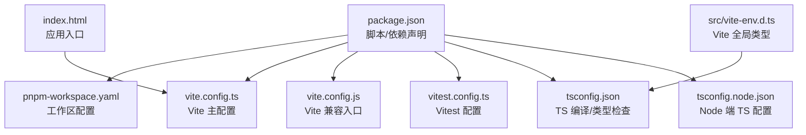
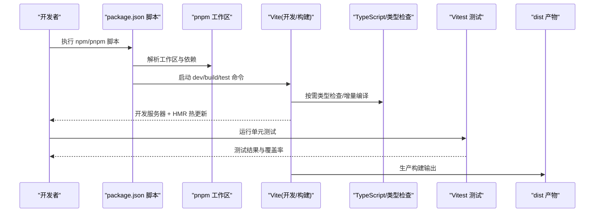
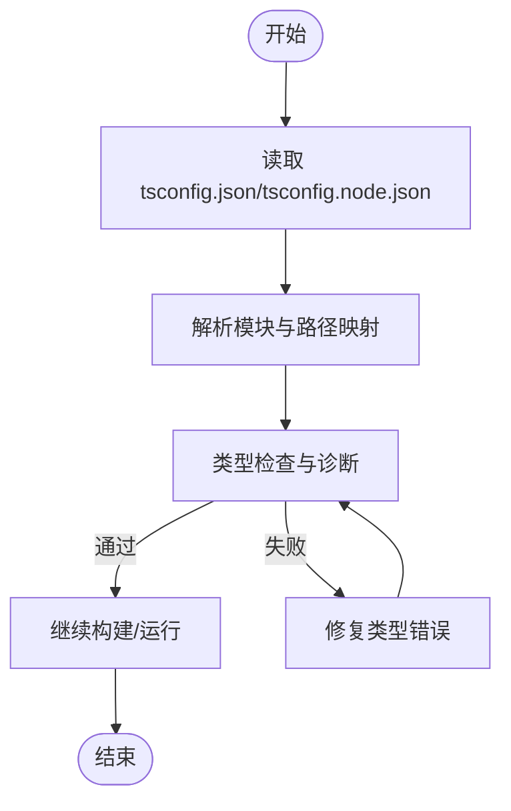
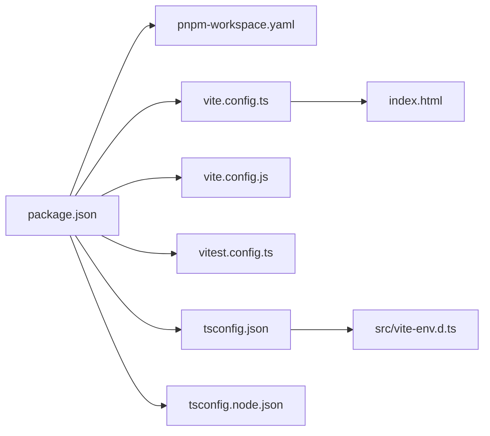

# 构建配置

<cite>
**本文引用的文件**   
- [package.json](file://package.json)
- [pnpm-workspace.yaml](file://pnpm-workspace.yaml)
- [vite.config.ts](file://vite.config.ts)
- [vite.config.js](file://vite.config.js)
- [tsconfig.json](file://tsconfig.json)
- [tsconfig.node.json](file://tsconfig.node.json)
- [vitest.config.ts](file://vitest.config.ts)
- [index.html](file://index.html)
- [src/vite-env.d.ts](file://src/vite-env.d.ts)
</cite>

## 目录
1. [简介](#简介)
2. [项目结构](#项目结构)
3. [核心组件](#核心组件)
4. [架构总览](#架构总览)
5. [详细组件分析](#详细组件分析)
6. [依赖分析](#依赖分析)
7. [性能考虑](#性能考虑)
8. [故障排查指南](#故障排查指南)
9. [结论](#结论)
10. [附录](#附录)

## 简介
本文件面向 FishWorker 前端构建配置，系统性说明基于 Vite 的开发与构建工具链、TypeScript 编译选项、pnpm 包管理与工作区策略、Vitest 测试环境、环境变量与多环境部署、构建优化与产物分析，以及开发工作流与自动化脚本。目标是帮助开发者快速理解并高效使用项目的构建体系。

## 项目结构
与构建相关的关键文件位于仓库根目录：
- 构建与打包：vite.config.ts（主配置）、vite.config.js（兼容入口）
- 类型系统：tsconfig.json、tsconfig.node.json、src/vite-env.d.ts
- 测试：vitest.config.ts
- 包管理：package.json、pnpm-workspace.yaml
- 应用入口：index.html

图表来源
- [package.json](file://package.json)
- [pnpm-workspace.yaml](file://pnpm-workspace.yaml)
- [vite.config.ts](file://vite.config.ts)
- [vite.config.js](file://vite.config.js)
- [vitest.config.ts](file://vitest.config.ts)
- [tsconfig.json](file://tsconfig.json)
- [tsconfig.node.json](file://tsconfig.node.json)
- [index.html](file://index.html)
- [src/vite-env.d.ts](file://src/vite-env.d.ts)

章节来源
- [package.json](file://package.json)
- [pnpm-workspace.yaml](file://pnpm-workspace.yaml)
- [vite.config.ts](file://vite.config.ts)
- [vite.config.js](file://vite.config.js)
- [vitest.config.ts](file://vitest.config.ts)
- [tsconfig.json](file://tsconfig.json)
- [tsconfig.node.json](file://tsconfig.node.json)
- [index.html](file://index.html)
- [src/vite-env.d.ts](file://src/vite-env.d.ts)

## 核心组件
本节聚焦构建系统的核心模块及其职责：
- Vite 构建与开发服务器：通过 vite.config.ts 定义开发服务器、插件、别名、输出等；vite.config.js 作为兼容入口或覆盖点。
- TypeScript 编译与类型检查：tsconfig.json 控制语言服务、模块解析、严格模式等；tsconfig.node.json 用于 Node 侧脚本；src/vite-env.d.ts 提供 Vite 注入的全局类型。
- 包管理器 pnpm：package.json 声明依赖与脚本；pnpm-workspace.yaml 定义工作区范围与共享策略。
- 测试框架 Vitest：vitest.config.ts 配置运行环境、覆盖率、匹配规则等。
- 应用入口：index.html 作为 Vite 的 HTML 入口，挂载应用。

章节来源
- [vite.config.ts](file://vite.config.ts)
- [vite.config.js](file://vite.config.js)
- [tsconfig.json](file://tsconfig.json)
- [tsconfig.node.json](file://tsconfig.node.json)
- [src/vite-env.d.ts](file://src/vite-env.d.ts)
- [package.json](file://package.json)
- [pnpm-workspace.yaml](file://pnpm-workspace.yaml)
- [vitest.config.ts](file://vitest.config.ts)
- [index.html](file://index.html)

## 架构总览
下图展示了从脚本到构建产物的整体流程，包括开发服务器、热重载、类型检查、测试与打包。

图表来源
- [package.json](file://package.json)
- [pnpm-workspace.yaml](file://pnpm-workspace.yaml)
- [vite.config.ts](file://vite.config.ts)
- [vitest.config.ts](file://vitest.config.ts)
- [tsconfig.json](file://tsconfig.json)

## 详细组件分析

### Vite 构建与开发服务器
- 开发服务器与热重载
  - 通过 Vite 提供的开发服务器实现即时编译与 HMR，提升开发体验。
  - 可结合代理、端口、基础路径等常用选项进行本地联调与跨域处理。
- 构建优化
  - 启用代码分割、Tree Shaking、压缩与资源优化。
  - 可通过插件生态扩展功能（如 CSS 预处理器、图片优化、SVG 图标等）。
- 别名与路径解析
  - 配置模块别名以简化导入路径，提高可读性与维护性。
- 输出产物
  - 指定构建目标与输出目录，便于后续部署与静态托管。

章节来源
- [vite.config.ts](file://vite.config.ts)
- [vite.config.js](file://vite.config.js)

### TypeScript 编译与类型检查
- tsconfig.json
  - 控制语言服务、模块解析策略、目标平台、严格模式、路径映射等。
  - 与 Vite 集成时，通常采用“仅类型检查”的策略，避免重复编译开销。
- tsconfig.node.json
  - 针对 Node 端脚本与构建工具的独立配置，隔离浏览器与 Node 的差异。
- src/vite-env.d.ts
  - 为 Vite 注入的全局变量与环境类型提供声明，确保类型安全。

图表来源
- [tsconfig.json](file://tsconfig.json)
- [tsconfig.node.json](file://tsconfig.node.json)
- [src/vite-env.d.ts](file://src/vite-env.d.ts)

章节来源
- [tsconfig.json](file://tsconfig.json)
- [tsconfig.node.json](file://tsconfig.node.json)
- [src/vite-env.d.ts](file://src/vite-env.d.ts)

### 包管理器 pnpm 与工作区
- package.json
  - 声明项目依赖、开发依赖与脚本命令，统一入口。
- pnpm-workspace.yaml
  - 定义工作区范围与包组织方式，支持多包协作与依赖提升。
- 依赖管理策略
  - 利用 pnpm 的严格依赖解析与硬链接机制，减少磁盘占用与安装时间。
  - 建议锁定版本与使用 .npmrc/.pnpmfile.cjs 等策略统一管理。

章节来源
- [package.json](file://package.json)
- [pnpm-workspace.yaml](file://pnpm-workspace.yaml)

### 测试框架 Vitest
- vitest.config.ts
  - 配置测试运行环境、匹配规则、覆盖率、模拟与桩等。
  - 与 Vite 共享配置，复用别名与插件能力，保证一致的类型与模块解析。
- 运行与报告
  - 支持并行执行、增量运行与交互式 UI，提升测试效率。
  - 可集成覆盖率统计与 CI 门禁。

章节来源
- [vitest.config.ts](file://vitest.config.ts)

### 环境变量与多环境部署
- 环境变量加载
  - 通过 Vite 的环境变量约定与注入机制，在开发与构建期访问不同环境的配置。
- 多环境策略
  - 按环境区分配置文件或变量前缀，配合构建脚本切换目标环境。
- 类型安全
  - 在 src/vite-env.d.ts 中声明自定义环境变量类型，避免运行时错误。

章节来源
- [vite.config.ts](file://vite.config.ts)
- [src/vite-env.d.ts](file://src/vite-env.d.ts)

### 应用入口与资源组织
- index.html
  - 作为 Vite 的 HTML 入口，挂载应用根节点与样式资源。
- 静态资源
  - 将静态资源放入 public 或通过 import 引入，由 Vite 自动处理缓存与优化。

章节来源
- [index.html](file://index.html)

## 依赖分析
下图展示构建相关文件的依赖关系与交互。

图表来源
- [package.json](file://package.json)
- [pnpm-workspace.yaml](file://pnpm-workspace.yaml)
- [vite.config.ts](file://vite.config.ts)
- [vite.config.js](file://vite.config.js)
- [vitest.config.ts](file://vitest.config.ts)
- [tsconfig.json](file://tsconfig.json)
- [tsconfig.node.json](file://tsconfig.node.json)
- [index.html](file://index.html)
- [src/vite-env.d.ts](file://src/vite-env.d.ts)

章节来源
- [package.json](file://package.json)
- [pnpm-workspace.yaml](file://pnpm-workspace.yaml)
- [vite.config.ts](file://vite.config.ts)
- [vite.config.js](file://vite.config.js)
- [vitest.config.ts](file://vitest.config.ts)
- [tsconfig.json](file://tsconfig.json)
- [tsconfig.node.json](file://tsconfig.node.json)
- [index.html](file://index.html)
- [src/vite-env.d.ts](file://src/vite-env.d.ts)

## 性能考虑
- 开发阶段
  - 合理配置开发服务器代理与端口，减少跨域与重定向开销。
  - 使用 HMR 与增量编译，避免全量刷新。
- 构建阶段
  - 开启代码分割与 Tree Shaking，减少冗余依赖。
  - 对大体积第三方库进行外部化或懒加载。
  - 启用资源压缩与缓存策略，提升首屏加载速度。
- 类型检查
  - 采用“仅类型检查”策略，避免与 Vite 的编译链路重复。
- 测试
  - 使用并行执行与增量测试，缩短反馈周期。
- 产物分析
  - 借助 Vite 生态的分析插件生成可视化报告，定位大依赖与瓶颈。

[本节为通用指导，不直接分析具体文件]

## 故障排查指南
- 类型错误
  - 检查 tsconfig.json 的模块解析与路径映射是否正确。
  - 确认 src/vite-env.d.ts 是否包含必要的环境变量类型声明。
- 环境变量未生效
  - 确认变量命名规范与前缀是否符合 Vite 约定。
  - 检查构建脚本是否传递了正确的环境变量。
- 测试失败
  - 核对 vitest.config.ts 的匹配规则与运行环境。
  - 确认测试数据与桩函数是否与业务逻辑保持一致。
- 构建异常
  - 查看控制台日志定位具体插件或依赖问题。
  - 清理缓存与 node_modules 后重试。

章节来源
- [tsconfig.json](file://tsconfig.json)
- [src/vite-env.d.ts](file://src/vite-env.d.ts)
- [vitest.config.ts](file://vitest.config.ts)
- [vite.config.ts](file://vite.config.ts)

## 结论
FishWorker 的前端构建体系以 Vite 为核心，结合 TypeScript、pnpm 与 Vitest，形成高效、可扩展的开发与交付流水线。通过合理的配置与优化策略，可在保证类型安全与测试质量的同时，显著提升构建性能与开发体验。

[本节为总结性内容，不直接分析具体文件]

## 附录
- 常用命令
  - 开发服务器：通过 package.json 中的脚本启动。
  - 构建产物：通过 package.json 中的脚本执行生产构建。
  - 运行测试：通过 package.json 中的脚本调用 Vitest。
- 参考文件
  - 构建配置：vite.config.ts、vite.config.js
  - 类型配置：tsconfig.json、tsconfig.node.json、src/vite-env.d.ts
  - 测试配置：vitest.config.ts
  - 包管理：package.json、pnpm-workspace.yaml
  - 应用入口：index.html

章节来源
- [package.json](file://package.json)
- [vite.config.ts](file://vite.config.ts)
- [vite.config.js](file://vite.config.js)
- [tsconfig.json](file://tsconfig.json)
- [tsconfig.node.json](file://tsconfig.node.json)
- [src/vite-env.d.ts](file://src/vite-env.d.ts)
- [vitest.config.ts](file://vitest.config.ts)
- [index.html](file://index.html)